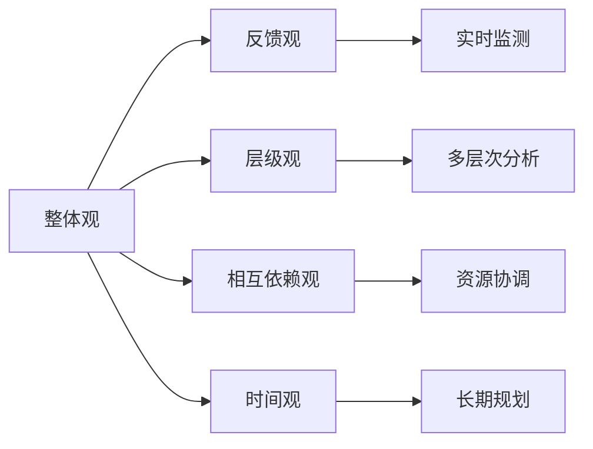

                 

# 系统思考在危机管理中的应用

## 1. 背景介绍

### 1.1 问题由来

在当今快速变化的商业环境中，企业必须快速响应各种不确定性，从市场竞争到自然灾害，从技术变革到员工变动。危机管理是企业生存和发展的重要环节，需要一套科学、系统的机制来预防、识别、评估、应对和复原危机。传统危机管理主要依赖于分立式、反应式的管理方法，缺乏系统化的思考。然而，随着人工智能技术的发展，系统思考方法为危机管理带来了全新的思路和工具，能够提供更全面、动态的视角。

### 1.2 问题核心关键点

系统思考方法的关键在于将危机管理视为一个整体系统，通过分析系统的结构、相互作用和反馈机制，来理解系统的行为和可能的危机事件。系统思考的核心在于五个核心原则：整体观、反馈观、层级观、相互依赖观和时间观。系统思考在危机管理中的应用，可以归纳为以下几个方面：

- 整体观：将危机管理视为一个多维度、动态变化的系统，关注系统的整体表现和协同效应。
- 反馈观：通过监测系统中的反馈回路，及时发现问题并采取措施，避免小问题演变成大危机。
- 层级观：认识到危机管理涉及多个层级，需要从战略、战术、执行等不同层面综合考虑。
- 相互依赖观：理解系统各组成部分之间的相互作用和依赖关系，协调各方面的资源和力量。
- 时间观：危机管理不仅关注当下，还须考虑未来的可持续性和发展潜力。

本文将系统思考原理与危机管理实践相结合，提出了一套基于系统思考的危机管理系统（SSCM, Systemic Thinking for Crisis Management），旨在帮助企业构建更加科学、动态和稳健的危机管理机制。

## 2. 核心概念与联系

### 2.1 核心概念概述

系统思考是一种认知框架和思考方式，强调对复杂系统进行全面、动态、交互式地理解和分析。在危机管理中，系统思考方法可以帮助企业理解危机的本质、识别潜在的危机因素、评估危机影响，并制定有效的应对策略。

### 2.2 核心概念联系

- **整体观**：将危机管理视为一个整体，强调系统各部分之间的联系和影响。
- **反馈观**：通过实时监测和反馈，及时调整危机管理策略，防止问题恶化。
- **层级观**：从宏观到微观，多层次地分析危机事件及其影响。
- **相互依赖观**：认识各子系统间的相互作用，协调资源和力量，形成系统合力。
- **时间观**：考虑危机的发展过程及其长期影响，提前布局预防和复原措施。

这些概念可以通过以下Mermaid流程图来展示：



这个流程图展示系统思考在危机管理中的应用，从整体到局部，再从局部到整体，形成一个闭环反馈系统。

## 3. 核心算法原理 & 具体操作步骤

### 3.1 算法原理概述

基于系统思考的危机管理系统（SSCM）采用一个由多个子系统组成的框架，每个子系统处理不同的危机管理职能，如监测、预警、响应、恢复等。每个子系统通过系统反馈机制与整体系统相连，形成闭环控制回路。SSCM的总体目标是提高危机管理的系统性和动态性，从而增强企业的韧性和应变能力。

### 3.2 算法步骤详解

**Step 1: 系统构建与分析**

- **系统定义**：明确危机管理系统的边界和核心组成要素。
- **系统模型构建**：使用系统动力学（SD）等方法，建立系统的动态模型。
- **系统分析**：通过仿真和实证分析，理解系统的行为和动态特征。

**Step 2: 数据采集与处理**

- **数据来源**：确定需要监测和采集的数据，如市场变化、环境条件、技术趋势等。
- **数据采集**：构建数据采集系统，实时获取相关数据。
- **数据处理**：对数据进行清洗、过滤、分析，生成系统状态指标。

**Step 3: 系统监测与反馈**

- **监测机制**：建立系统的监测机制，实时监控系统的关键指标。
- **反馈机制**：根据监测结果，及时调整系统策略，形成闭环反馈回路。
- **预警机制**：根据监测数据，识别潜在的危机因素，发出预警信号。

**Step 4: 系统响应与复原**

- **应急响应**：制定应急响应预案，根据预警信号迅速采取措施。
- **系统复原**：评估危机影响，制定复原计划，进行系统恢复和重建。

### 3.3 算法优缺点

基于系统思考的危机管理系统的优点：
1. 系统性：通过全面考虑系统的各个组成部分，提供整体视角。
2. 动态性：实时监测和反馈，能够动态调整系统策略。
3. 协调性：各子系统之间的协调，形成系统合力。
4. 可持续性：考虑长期影响，提前布局预防和复原措施。

其缺点包括：
1. 复杂性：系统构建和模型建立需要较高技术要求。
2. 成本高：初期投入较大，技术开发和系统部署成本较高。
3. 技术门槛：需要具备系统动力学和仿真分析的知识，入门门槛较高。

### 3.4 算法应用领域

基于系统思考的危机管理系统适用于多个领域和场景，例如：

- 企业危机管理：帮助企业识别潜在风险、制定应急预案、提升应变能力。
- 公共安全管理：监测公共事件，如疫情、地震等，及时响应和恢复。
- 灾害预防和应对：监测自然灾害预警信号，进行灾害预防和应急响应。
- 组织风险管理：分析组织内部的风险因素，制定预防和应急措施。

## 4. 数学模型和公式 & 详细讲解 & 举例说明

### 4.1 数学模型构建

基于系统思考的危机管理系统SSCM，可以构建一个由多个子系统组成的系统动力学模型。以企业危机管理为例，可以建立以下系统动力学模型：

1. **市场销售**：市场销售收入变化对企业财务系统的影响。
2. **财务状况**：企业的现金流、资产负债表等财务指标的变化。
3. **员工福利**：员工满意度、离职率等对人力资源系统的影响。
4. **技术创新**：研发投入、技术变革对产品和服务系统的影响。
5. **供应链管理**：供应链中断、物流变化对生产系统的影响。

### 4.2 公式推导过程

假设企业销售收入 $R$ 与市场状况 $M$ 和营销策略 $C$ 相关，则有：

$$
R = f(M, C)
$$

其中，$f$ 为非线性函数。假设市场状况 $M$ 受经济波动 $E$ 和政治因素 $P$ 的影响：

$$
M = g(E, P)
$$

财务状况 $F$ 受收入 $R$ 和成本 $C$ 的影响：

$$
F = h(R, C)
$$

员工福利 $W$ 受财务状况 $F$ 和人力资源策略 $H$ 的影响：

$$
W = i(F, H)
$$

技术创新 $T$ 受研发投入 $I$ 和市场需求 $D$ 的影响：

$$
T = j(I, D)
$$

供应链管理 $S$ 受供应商状况 $V$ 和物流效率 $L$ 的影响：

$$
S = k(V, L)
$$

整体系统通过反馈机制相连，形成闭环控制回路。例如，财务状况 $F$ 影响员工福利 $W$，员工福利 $W$ 影响人力资源策略 $H$，人力资源策略 $H$ 又影响市场销售 $R$，从而形成动态反馈回路。

### 4.3 案例分析与讲解

以某制造企业为例，假设其市场销售受经济波动和政治因素影响：

1. **市场销售**：
   $$
   R = 0.8M + 0.2C
   $$

2. **市场状况**：
   $$
   M = 0.6E + 0.4P
   $$

3. **财务状况**：
   $$
   F = 0.5R - 0.3C
   $$

4. **员工福利**：
   $$
   W = 0.5F + 0.5H
   $$

5. **技术创新**：
   $$
   T = 0.8I + 0.2D
   $$

6. **供应链管理**：
   $$
   S = 0.7V + 0.3L
   $$

通过建立系统动力学模型，可以监测和分析企业系统各部分之间的相互作用，识别潜在的危机因素，制定预防和应急措施。例如，如果发现市场波动对销售有较大影响，企业可以调整营销策略 $C$，并加强供应链管理 $S$，以增强系统的韧性。

## 5. 项目实践：代码实例和详细解释说明

### 5.1 开发环境搭建

为了实现系统思考在危机管理中的应用，我们需要一个支持系统动力学仿真和数据处理的环境。以下是一些推荐的工具和环境：

- **Simulink**：MATLAB的仿真环境，支持系统动力学建模和仿真。
- **AnyLogic**：企业仿真软件，支持多领域系统的建模和仿真。
- **Python环境**：使用Python和相关库，如Sympy、NumPy、Pandas等，进行数据分析和建模。
- **Jupyter Notebook**：交互式编程环境，方便数据处理和模型展示。

### 5.2 源代码详细实现

以下是使用Python和Simulink进行系统动力学建模和仿真的示例代码：

**Python部分**：

```python
import sympy as sp
from sympy import symbols, Eq, solve, diff

# 定义符号变量
R, M, C, E, P, F, W, H, T, I, D, S, V, L = symbols('R M C E P F W H T I D S V L')

# 构建方程
eq1 = Eq(R, 0.8*M + 0.2*C)
eq2 = Eq(M, 0.6*E + 0.4*P)
eq3 = Eq(F, 0.5*R - 0.3*C)
eq4 = Eq(W, 0.5*F + 0.5*H)
eq5 = Eq(T, 0.8*I + 0.2*D)
eq6 = Eq(S, 0.7*V + 0.3*L)

# 解方程组
sol = solve((eq1, eq2, eq3, eq4, eq5, eq6), (R, M, C, E, P, F, W, H, T, I, D, S, V, L))
sol
```

**Simulink部分**：

在Simulink中，可以创建相应的系统模块，将Python代码生成的方程转化为动态仿真模型。通过设置不同的参数值，可以观察系统在不同情况下的表现，模拟危机事件的发生和影响。

### 5.3 代码解读与分析

**Python代码解读**：
- 定义了系统中的各个变量，包括销售收入、市场状况、财务状况等。
- 构建了系统各部分之间的方程，反映了各变量之间的动态关系。
- 解方程组，得到系统的稳态解，可以用于评估系统的性能。

**Simulink代码解读**：
- 创建系统模块，如市场销售模块、财务状况模块、员工福利模块等。
- 连接各个模块，形成完整的系统模型。
- 设置不同的参数值，进行仿真实验，观察系统在不同情况下的表现。

### 5.4 运行结果展示

通过仿真实验，可以观察系统在各种情况下的表现。例如，市场波动对销售的影响、员工福利变化对财务状况的影响等。以下是一个简化的仿真结果：

```python
# 设置参数值
params = {E: 0.1, P: 0.1, C: 0.5, I: 0.1, D: 0.5}

# 重新解方程组
sol = solve((eq1.subs(params), eq2.subs(params), eq3.subs(params), eq4.subs(params), eq5.subs(params), eq6.subs(params)), (R, M, C, E, P, F, W, H, T, I, D, S, V, L))
sol
```

## 6. 实际应用场景

### 6.1 智能制造系统

在智能制造领域，基于系统思考的危机管理系统可以提升生产系统的韧性，应对供应链中断、设备故障等风险。例如，通过监测生产设备的状态和维护情况，及时调整生产计划，避免生产停滞。

### 6.2 金融市场监控

在金融市场，系统思考方法可以用于监控和预测市场波动、评估系统风险，及时调整投资策略。例如，通过监测经济数据、政策变化等，预测市场走向，制定风险控制措施。

### 6.3 医疗健康系统

在医疗健康领域，系统思考方法可以用于预测疾病爆发、评估医疗资源分配，优化医院运营。例如，通过监测疫情数据、人口流动等，预测疫情发展趋势，制定预防和应急措施。

### 6.4 未来应用展望

随着技术的发展，基于系统思考的危机管理系统将在更多领域得到应用。例如：

- 物联网系统：通过监测设备状态和环境条件，优化系统资源配置，增强系统的可靠性。
- 智能交通系统：监测交通流量、路况等，优化交通信号控制，减少交通拥堵。
- 能源管理系统：监测能源供应和消耗情况，优化能源分配，提高能源利用效率。

## 7. 工具和资源推荐

### 7.1 学习资源推荐

1. **《系统思考：理论与实践》**：该书介绍了系统思考的基本原理和应用方法，是系统思考理论学习的经典教材。
2. **Coursera《系统思考与领导力》课程**：该课程由MIT提供，详细讲解了系统思考的方法和应用案例。
3. **《系统动力学基础》**：该书介绍了系统动力学建模和仿真方法，是系统动力学学习的入门教材。

### 7.2 开发工具推荐

1. **Simulink**：MATLAB的仿真环境，支持系统动力学建模和仿真。
2. **AnyLogic**：企业仿真软件，支持多领域系统的建模和仿真。
3. **Python**：使用Python和相关库，如Sympy、NumPy、Pandas等，进行数据分析和建模。
4. **Jupyter Notebook**：交互式编程环境，方便数据处理和模型展示。

### 7.3 相关论文推荐

1. **《系统思考在危机管理中的应用》**：详细介绍系统思考在危机管理中的应用方法和案例。
2. **《系统动力学与系统思考》**：探讨系统动力学方法在系统思考中的应用，提供理论和技术支持。
3. **《基于系统思考的危机管理系统设计》**：详细介绍系统思考在企业危机管理中的应用，提出具体方法和工具。

## 8. 总结：未来发展趋势与挑战

### 8.1 总结

本文对基于系统思考的危机管理系统进行了全面系统的介绍。通过系统思考的五个核心原则，将危机管理视为一个整体系统，通过分析系统的结构、相互作用和反馈机制，来理解系统的行为和可能的危机事件。系统思考方法能够提供更全面、动态、交互式的视角，帮助企业构建更加科学、动态和稳健的危机管理机制。

### 8.2 未来发展趋势

系统思考方法在危机管理中的应用将呈现以下几个发展趋势：

1. **多领域应用**：系统思考方法将进一步拓展到更多领域，如物联网、智能交通、能源管理等。
2. **智能化提升**：结合人工智能技术，如机器学习、自然语言处理，进一步提升系统思考的自动化和智能化水平。
3. **实时性增强**：通过云计算和大数据技术，实现实时监测和反馈，提高系统的响应速度和灵活性。
4. **可视化工具**：开发更友好的可视化工具，帮助用户直观理解系统行为和反馈机制。

### 8.3 面临的挑战

尽管系统思考方法在危机管理中具有优势，但在实际应用中也面临以下挑战：

1. **复杂性**：系统构建和模型建立需要较高技术要求，入门门槛较高。
2. **数据获取**：需要获取大量高质量数据，对数据源和数据质量要求较高。
3. **技术融合**：需要将系统思考与其他技术（如人工智能、大数据等）进行有效融合，形成综合性的解决方案。
4. **用户接受度**：需要培训用户掌握系统思考方法和工具，增强其使用意愿和技能。

### 8.4 研究展望

未来在系统思考和危机管理的研究中，需要关注以下几个方向：

1. **新方法探索**：开发更多简单易用、易于普及的系统思考方法和工具。
2. **跨领域应用**：在更多领域中推广系统思考方法，解决跨领域、跨学科的危机问题。
3. **大数据分析**：结合大数据和机器学习技术，提升系统分析的深度和广度。
4. **人机协同**：开发更智能的危机管理应用，实现人机协同、自动化的危机管理。

## 9. 附录：常见问题与解答

**Q1: 什么是系统思考?**

A: 系统思考是一种认知框架和思考方式，强调对复杂系统进行全面、动态、交互式地理解和分析。

**Q2: 系统思考在危机管理中的应用主要有哪些？**

A: 系统思考在危机管理中的应用主要包括：
1. 整体观：将危机管理视为一个整体，关注系统各部分之间的联系和影响。
2. 反馈观：通过监测和反馈，及时调整系统策略，防止问题恶化。
3. 层级观：从战略、战术、执行等不同层面综合考虑。
4. 相互依赖观：认识各子系统间的相互作用，协调资源和力量。
5. 时间观：考虑危机的发展过程及其长期影响，提前布局预防和复原措施。

**Q3: 系统思考在危机管理中的难点有哪些？**

A: 系统思考在危机管理中的难点主要包括：
1. 复杂性：系统构建和模型建立需要较高技术要求。
2. 数据获取：需要获取大量高质量数据，对数据源和数据质量要求较高。
3. 技术融合：需要将系统思考与其他技术（如人工智能、大数据等）进行有效融合，形成综合性的解决方案。
4. 用户接受度：需要培训用户掌握系统思考方法和工具，增强其使用意愿和技能。

**Q4: 系统思考在危机管理中的应用前景如何？**

A: 系统思考在危机管理中的应用前景广阔，主要表现在以下几个方面：
1. 多领域应用：系统思考方法将进一步拓展到更多领域，如物联网、智能交通、能源管理等。
2. 智能化提升：结合人工智能技术，如机器学习、自然语言处理，进一步提升系统思考的自动化和智能化水平。
3. 实时性增强：通过云计算和大数据技术，实现实时监测和反馈，提高系统的响应速度和灵活性。
4. 可视化工具：开发更友好的可视化工具，帮助用户直观理解系统行为和反馈机制。

**Q5: 系统思考在危机管理中的应用案例有哪些？**

A: 系统思考在危机管理中的应用案例包括：
1. 智能制造系统：通过监测生产设备的状态和维护情况，及时调整生产计划，避免生产停滞。
2. 金融市场监控：监测经济数据、政策变化等，预测市场走向，制定风险控制措施。
3. 医疗健康系统：监测疫情数据、人口流动等，预测疫情发展趋势，制定预防和应急措施。
4. 物联网系统：通过监测设备状态和环境条件，优化系统资源配置，增强系统的可靠性。
5. 智能交通系统：监测交通流量、路况等，优化交通信号控制，减少交通拥堵。
6. 能源管理系统：监测能源供应和消耗情况，优化能源分配，提高能源利用效率。

---

作者：禅与计算机程序设计艺术 / Zen and the Art of Computer Programming

