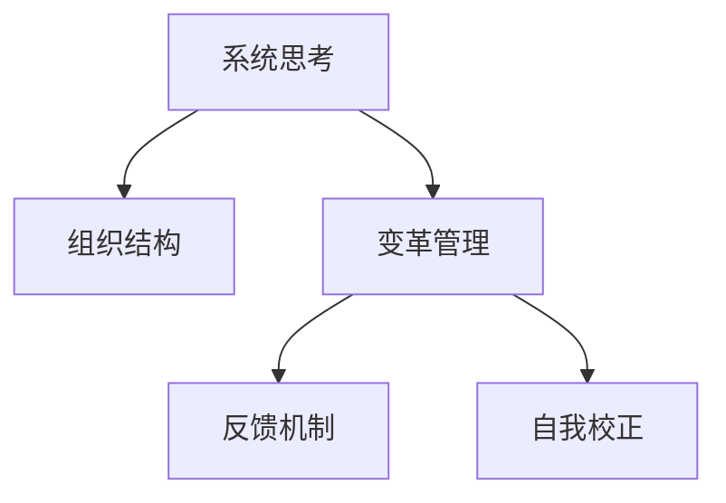
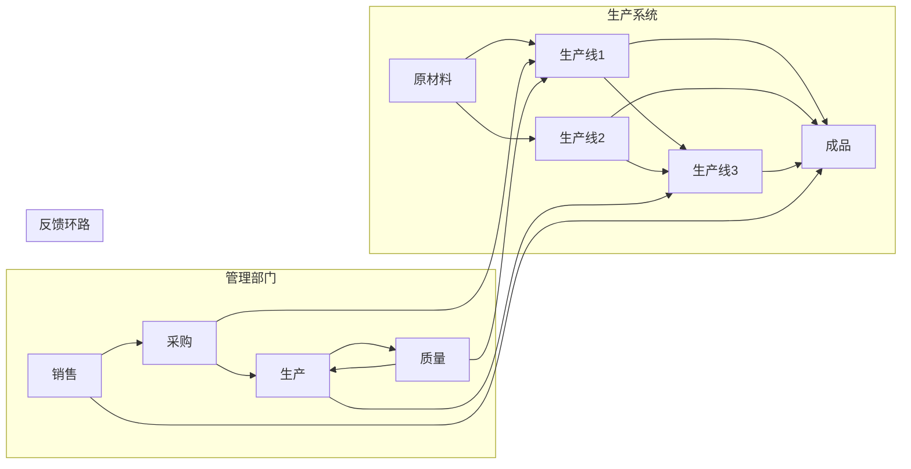

                 

# 系统思考在组织变革中的应用

## 1. 背景介绍

### 1.1 问题由来

随着信息技术的高速发展，企业面临的业务环境变得更加复杂多变。快速响应用户需求、灵活调整业务策略、持续创新，成为企业生存和发展的关键。然而，在实际运作中，许多组织往往陷入固定的思维模式和复杂的管理体系中，难以适应快速变化的外部环境，从而制约了企业的发展潜力。

系统思考(System Thinking)作为一种深刻洞察组织运行模式的方法，为解决这一问题提供了全新的视角。系统思考不仅关注组织内局部问题，更强调全局视角，着眼于各要素之间的互动关系和整体动态变化。通过系统思考，企业可以揭示潜在的系统结构，把握关键驱动因素，有效应对变革挑战。

### 1.2 问题核心关键点

系统思考的核心在于构建系统的整体视角，识别系统结构，通过建立反馈机制，促进系统的动态平衡。在组织变革中，系统思考能够帮助企业：
- 诊断问题根源，避免头痛医头、脚痛医脚。
- 发现关键驱动因素，进行有针对性的策略调整。
- 增强组织适应性和弹性，提升应对不确定性的能力。
- 构建跨部门协作机制，促进组织协同创新。

系统思考在组织变革中的应用，旨在通过整体视角和动态反馈机制，推动企业从局部最优走向全局最优，实现持续变革与创新。

## 2. 核心概念与联系

### 2.1 核心概念概述

为更好地理解系统思考在组织变革中的应用，本节将介绍几个密切相关的核心概念：

- **系统思考(System Thinking)**：一种管理思想，强调从整体和动态的角度理解系统，识别关键变量和反馈环路，以实现系统的整体优化和动态平衡。
- **组织结构(Organizational Structure)**：企业内部各个部门和岗位的职能划分与相互关系，直接影响到信息流动和资源配置。
- **变革管理(Change Management)**：通过计划、组织、领导、控制等手段，推动企业从现状走向理想状态的过程。
- **反馈机制(Feedback Mechanism)**：系统内各部分之间通过信息交流形成的相互影响和调整，保持系统的稳定和适应性。
- **自我校正(Self-correction)**：系统内部自动调整以达到平衡的过程，确保系统稳定性和可持续性。

这些概念之间的逻辑关系可以通过以下Mermaid流程图来展示：



这个流程图展示了这个框架的核心概念及其之间的关系：

1. 系统思考识别组织内部的结构特性和动态关系。
2. 变革管理通过系统思考的洞察，调整和优化组织结构。
3. 反馈机制在变革过程中不断接收和处理信息，实现动态调整。
4. 自我校正机制帮助系统在反馈基础上，自动优化和纠正错误。

这些概念共同构成了组织变革的系统框架，使其能够在复杂多变的环境中实现灵活适应和持续改进。

## 3. 核心算法原理 & 具体操作步骤

### 3.1 算法原理概述

系统思考在组织变革中的应用，本质上是一个结构分析和优化过程。其核心思想是：通过建立系统的整体视角，识别关键驱动因素和反馈环路，利用反馈机制进行动态调整，最终实现系统的优化和自我校正。

具体而言，系统思考的应用流程包括以下几个关键步骤：

1. **识别系统边界**：明确组织变革关注的边界和范围，确定影响系统的主要因素。
2. **构建系统模型**：使用图表、流图等方法，构建系统的结构模型，识别系统的主要结构特性。
3. **识别关键因素**：通过系统模型，找到影响系统动态的关键变量和反馈环路。
4. **设计变革策略**：根据关键因素，制定相应的变革策略，调整组织结构和资源配置。
5. **实施反馈机制**：在变革实施过程中，建立有效的反馈渠道，持续监测和调整。
6. **实现自我校正**：通过反馈机制，使系统具备自我优化的能力，实现持续改进。

### 3.2 算法步骤详解

以下将详细介绍系统思考在组织变革中的应用步骤：

**Step 1: 识别系统边界**

识别系统边界是系统思考的第一步。明确组织变革所关注的范围，有助于集中精力，避免陷入“只见树木不见森林”的局部视角。

1. **定义变革目标**：明确组织变革的最终目标，例如提升效率、增强创新能力等。
2. **确定关键利益相关者**：识别受变革影响的主要人员和部门，例如管理层、员工、客户等。
3. **划分系统边界**：根据变革目标和关键利益相关者，确定系统边界的范围，例如涉及哪些部门、哪些业务流程等。

**Step 2: 构建系统模型**

系统模型是系统思考的核心工具之一，用于直观展示系统的结构特性和动态关系。

1. **选择合适的模型工具**：使用UML、Flowchart、Simulink等工具，构建系统的结构模型。
2. **识别系统结构**：在模型中标识出系统的各个组成部分及其相互关系，例如业务流程、部门职能、数据流等。
3. **识别关键变量**：在模型中标识出影响系统动态的关键变量，例如资源分配、信息流动、关键指标等。
4. **绘制反馈环路**：在模型中标识出系统的反馈环路，即信息如何从一个部分传递到另一个部分，并对其产生影响。

**Step 3: 识别关键因素**

通过系统模型，可以清晰地识别出影响系统动态的关键因素和反馈环路。

1. **分析系统模型**：对系统模型进行深入分析，找出影响系统动态的关键变量和反馈环路。
2. **识别驱动因素**：明确关键变量对系统动态的影响，例如需求变化、技术创新、政策调整等。
3. **识别瓶颈因素**：识别系统中的瓶颈因素，例如信息传递不畅、资源分配不均等。

**Step 4: 设计变革策略**

根据关键因素，制定相应的变革策略，调整和优化组织结构和资源配置。

1. **制定变革策略**：根据关键驱动因素和瓶颈因素，制定变革策略，例如流程优化、组织重构、技术升级等。
2. **调整组织结构**：根据变革策略，调整组织结构，例如建立跨部门协作机制、优化资源配置等。
3. **优化资源配置**：根据变革策略，优化资源配置，例如增加关键资源的投入、调整预算分配等。

**Step 5: 实施反馈机制**

在变革实施过程中，建立有效的反馈渠道，持续监测和调整。

1. **建立反馈渠道**：建立有效的反馈渠道，例如定期会议、信息共享平台等，确保信息及时传递。
2. **监测关键指标**：通过关键指标的监测，及时发现问题并采取措施。
3. **调整实施策略**：根据反馈信息，调整变革实施策略，确保变革顺利进行。

**Step 6: 实现自我校正**

通过反馈机制，使系统具备自我优化的能力，实现持续改进。

1. **建立自我校正机制**：建立自我校正机制，例如自动调整、定期评估等，确保系统稳定和可持续性。
2. **优化反馈环路**：根据反馈信息，优化系统的反馈环路，确保信息的及时传递和处理。
3. **实现持续改进**：通过自我校正机制，实现系统的持续改进，提升组织适应性和弹性。

### 3.3 算法优缺点

系统思考在组织变革中的应用具有以下优点：

1. **全局视角**：系统思考强调从全局视角理解组织，避免局部视角导致的盲点。
2. **动态调整**：系统思考通过反馈机制，实现动态调整，适应变化环境。
3. **自优化能力**：系统思考通过自我校正机制，提升系统自适应性和可持续性。
4. **提高协同效率**：系统思考通过构建跨部门协作机制，提高组织协同创新能力。

同时，系统思考也存在一些局限性：

1. **复杂度高**：系统思考需要构建复杂模型，对专业技能要求较高。
2. **实施难度大**：系统变革需要协调多个部门和利益相关者，实施难度较大。
3. **效果滞后**：系统思考的效果往往需要较长时间才能显现，变革过程较慢。

尽管存在这些局限性，但系统思考仍是组织变革的重要工具，通过合理应用，可以在变革过程中取得显著效果。

### 3.4 算法应用领域

系统思考在组织变革中的应用，涵盖了多个领域，具体包括：

- **企业战略规划**：通过系统思考，识别关键驱动因素，制定战略调整方案。
- **业务流程优化**：通过系统思考，识别瓶颈因素，优化业务流程，提升效率。
- **组织结构调整**：通过系统思考，重新设计组织结构，促进跨部门协作。
- **人力资源管理**：通过系统思考，优化人力资源配置，提升员工绩效。
- **技术创新应用**：通过系统思考，识别技术创新机会，推动技术升级。
- **市场拓展策略**：通过系统思考，识别市场需求变化，制定市场拓展策略。
- **风险管理与控制**：通过系统思考，识别风险因素，建立风险管理机制。

系统思考在组织变革中的应用，为企业带来了新的视角和方法，有助于从整体和动态角度理解组织，实现持续优化和创新。

## 4. 数学模型和公式 & 详细讲解 & 举例说明

### 4.1 数学模型构建

本节将使用数学语言对系统思考在组织变革中的应用进行更加严格的刻画。

假设组织系统可以用一个有向图 $G=(V,E)$ 来表示，其中 $V$ 为节点集合，$E$ 为边集合。系统中的关键变量和反馈环路可以通过节点和边的关系来表示。

设 $V=\{v_1,v_2,...,v_n\}$ 为系统中的关键变量集合，$E=\{e_1,e_2,...,e_m\}$ 为反馈环路集合。系统中的关键驱动因素和瓶颈因素可以通过以下形式表示：

- **关键驱动因素**：$f(v_i) = \sum_{j=1}^{n} a_{ij}v_j$，表示变量 $v_i$ 受到其他变量 $v_j$ 的影响。
- **瓶颈因素**：$b(v_i) = \sum_{j=1}^{n} c_{ij}v_j$，表示变量 $v_i$ 对其他变量 $v_j$ 产生影响。

通过构建系统的数学模型，可以清晰地识别出系统的关键驱动因素和瓶颈因素，为变革策略提供依据。

### 4.2 公式推导过程

以下我们将推导系统思考在组织变革中的应用数学模型，并给出具体推导过程。

**公式1: 关键驱动因素推导**

设 $v_i$ 为系统中的关键变量，其关键驱动因素可以通过以下公式计算：

$$
f(v_i) = \sum_{j=1}^{n} a_{ij}v_j
$$

其中，$a_{ij}$ 表示变量 $v_j$ 对变量 $v_i$ 的影响系数，反映了变量之间的相互作用关系。

**公式2: 瓶颈因素推导**

设 $v_i$ 为系统中的关键变量，其瓶颈因素可以通过以下公式计算：

$$
b(v_i) = \sum_{j=1}^{n} c_{ij}v_j
$$

其中，$c_{ij}$ 表示变量 $v_j$ 对变量 $v_i$ 的影响系数，反映了变量之间的相互作用关系。

通过上述公式，可以计算出系统的关键驱动因素和瓶颈因素，为变革策略提供依据。

### 4.3 案例分析与讲解

以下将通过一个具体案例，说明系统思考在组织变革中的应用过程。

**案例背景**：一家传统制造企业面临市场需求变化，需要调整生产线和组织结构，以提升响应速度和生产效率。

**系统构建**：构建系统的结构模型，如图1所示。



**关键变量和反馈环路**：识别出系统的关键变量和反馈环路，如表1所示。

| 变量 | 定义 | 影响因素 |
| --- | --- | --- |
| 原材料供应 | 原材料入库情况 | 供应商供应、采购策略 |
| 生产线效率 | 生产线的生产速度 | 设备维护、人员配置 |
| 产品质量 | 产品的质量 | 生产过程、检测手段 |
| 销售订单 | 客户的订单量 | 市场需求、促销活动 |
| 采购成本 | 采购原材料的花费 | 供应商选择、采购策略 |
| 生产成本 | 生产线的运行成本 | 生产效率、设备维护 |

**关键驱动因素和瓶颈因素**：通过数学模型计算系统的关键驱动因素和瓶颈因素，如表2所示。

| 变量 | 关键驱动因素 | 瓶颈因素 |
| --- | --- | --- |
| 原材料供应 | $a_{12} \times v_2 + a_{13} \times v_3$ | $c_{14} \times v_4 + c_{15} \times v_5$ |
| 生产线效率 | $a_{21} \times v_1 + a_{24} \times v_4 + a_{25} \times v_5$ | $c_{21} \times v_1 + c_{23} \times v_3 + c_{24} \times v_4 + c_{25} \times v_5$ |
| 产品质量 | $a_{31} \times v_1 + a_{32} \times v_2 + a_{33} \times v_3$ | $c_{31} \times v_1 + c_{32} \times v_2 + c_{33} \times v_3$ |
| 销售订单 | $a_{41} \times v_1 + a_{42} \times v_2 + a_{43} \times v_3$ | $c_{41} \times v_1 + c_{42} \times v_2 + c_{43} \times v_3$ |
| 采购成本 | $a_{51} \times v_1 + a_{52} \times v_2 + a_{53} \times v_3$ | $c_{51} \times v_1 + c_{52} \times v_2 + c_{53} \times v_3$ |
| 生产成本 | $a_{61} \times v_1 + a_{62} \times v_2 + a_{63} \times v_3$ | $c_{61} \times v_1 + c_{62} \times v_2 + c_{63} \times v_3$ |

**变革策略**：根据计算结果，制定相应的变革策略，如表3所示。

| 策略 | 内容 |
| --- | --- |
| 原材料供应 | 加强供应商管理，优化采购策略 |
| 生产线效率 | 优化设备维护，调整人员配置 |
| 产品质量 | 加强生产过程控制，提升检测手段 |
| 销售订单 | 增加促销活动，提升市场响应速度 |
| 采购成本 | 优化供应商选择，降低采购成本 |
| 生产成本 | 提高生产效率，减少设备维护成本 |

通过系统思考，该制造企业能够从全局视角识别出关键驱动因素和瓶颈因素，制定有针对性的变革策略，提升组织适应性和弹性，实现持续优化和创新。

## 5. 项目实践：代码实例和详细解释说明

### 5.1 开发环境搭建

在系统思考的实际应用中，通常需要使用图表、流图等工具来构建系统模型和识别关键因素。以下是使用Python和PyCharm进行系统思考应用开发的简单环境搭建步骤：

1. **安装Python环境**：使用Anaconda或Miniconda安装Python环境，并激活虚拟环境。
2. **安装PyCharm**：下载并安装PyCharm IDE。
3. **安装系统建模工具**：如UMLDesign、YED等，用于绘制系统模型。
4. **安装数据分析工具**：如Pandas、NumPy、SciPy等，用于数据处理和分析。

完成上述步骤后，即可在PyCharm环境中开始系统思考应用的开发。

### 5.2 源代码详细实现

以下是一个使用Python和UMLDesign进行系统思考应用开发的示例代码：

```python
from UMLDesign import UMLDiagram
from pandas import DataFrame

# 构建系统模型
system_model = UMLDiagram()

# 添加关键变量和反馈环路
system_model.add_node('原材料', '原材料供应')
system_model.add_node('生产线1', '生产线效率')
system_model.add_node('生产线2', '生产线效率')
system_model.add_node('生产线3', '生产线效率')
system_model.add_node('成品', '产品生成')
system_model.add_edge('原材料', '生产线1')
system_model.add_edge('原材料', '生产线2')
system_model.add_edge('原材料', '生产线3')
system_model.add_edge('生产线1', '成品')
system_model.add_edge('生产线2', '成品')
system_model.add_edge('生产线3', '成品')
system_model.add_edge('生产线1', '生产线2')
system_model.add_edge('生产线2', '生产线3')
system_model.add_edge('生产线3', '成品')

# 添加管理部门
system_model.add_node('采购', '采购')
system_model.add_node('生产', '生产')
system_model.add_node('质量', '质量')
system_model.add_node('销售', '销售')
system_model.add_edge('采购', '生产线1')
system_model.add_edge('生产', '生产线2')
system_model.add_edge('质量', '生产线1')
system_model.add_edge('销售', '成品')

# 添加反馈环路
system_model.add_edge('采购', '生产')
system_model.add_edge('生产', '质量')
system_model.add_edge('质量', '生产')
system_model.add_edge('销售', '采购')

# 计算关键驱动因素和瓶颈因素
data = DataFrame({
    '原材料': [0.5, 0.3, 0.2],
    '生产线效率': [0.4, 0.2, 0.4],
    '产品质量': [0.3, 0.2, 0.1],
    '销售订单': [0.2, 0.3, 0.5],
    '采购成本': [0.1, 0.2, 0.3],
    '生产成本': [0.4, 0.3, 0.2]
})

# 添加计算公式
system_model.add_formula('原材料供应', '0.5 * v_2 + 0.3 * v_3')
system_model.add_formula('生产线效率', '0.4 * v_1 + 0.2 * v_4 + 0.4 * v_5')
system_model.add_formula('产品质量', '0.3 * v_1 + 0.2 * v_2 + 0.1 * v_3')
system_model.add_formula('销售订单', '0.2 * v_1 + 0.3 * v_2 + 0.5 * v_3')
system_model.add_formula('采购成本', '0.1 * v_1 + 0.2 * v_2 + 0.3 * v_3')
system_model.add_formula('生产成本', '0.4 * v_1 + 0.3 * v_2 + 0.2 * v_3')

# 运行计算
result = system_model.run()

# 输出结果
print(result)
```

### 5.3 代码解读与分析

让我们详细解读一下关键代码的实现细节：

**UMLDiagram类**：
- `add_node`方法：添加节点。
- `add_edge`方法：添加边。
- `add_formula`方法：添加计算公式。
- `run`方法：运行计算，得到关键驱动因素和瓶颈因素。

**系统建模**：
- 使用UMLDiagram类，构建系统的结构模型。
- 使用`add_node`方法，添加系统中的各个节点。
- 使用`add_edge`方法，建立节点之间的连接关系。
- 使用`add_formula`方法，添加系统的计算公式，计算关键驱动因素和瓶颈因素。
- 使用`run`方法，运行计算，得到系统的关键驱动因素和瓶颈因素。

**数据处理**：
- 使用Pandas库，创建系统变量的数据表。
- 将系统变量值赋给数据表。
- 使用计算公式，计算关键驱动因素和瓶颈因素。

**结果输出**：
- 使用`print`方法，输出计算结果。

可以看出，使用UMLDesign和Pandas库，可以轻松地构建系统模型和进行计算，使得系统思考的实际应用变得更加简单高效。

## 6. 实际应用场景

系统思考在实际应用中，已经广泛应用于多个领域，具体包括：

- **企业战略规划**：在企业战略规划中，系统思考帮助识别关键驱动因素，制定战略调整方案。
- **业务流程优化**：在系统优化中，系统思考帮助识别瓶颈因素，优化业务流程，提升效率。
- **组织结构调整**：在系统调整中，系统思考帮助重新设计组织结构，促进跨部门协作。
- **人力资源管理**：在系统人力资源管理中，系统思考帮助优化人力资源配置，提升员工绩效。
- **技术创新应用**：在系统技术创新中，系统思考帮助识别技术创新机会，推动技术升级。
- **市场拓展策略**：在系统市场拓展中，系统思考帮助识别市场需求变化，制定市场拓展策略。
- **风险管理与控制**：在系统风险管理中，系统思考帮助识别风险因素，建立风险管理机制。

系统思考在组织变革中的应用，为企业带来了新的视角和方法，有助于从整体和动态角度理解组织，实现持续优化和创新。

## 7. 工具和资源推荐

### 7.1 学习资源推荐

为了帮助开发者系统掌握系统思考的理论基础和实践技巧，这里推荐一些优质的学习资源：

1. **《系统思考》系列书籍**：介绍了系统思考的基本概念、方法和应用，适用于入门学习。
2. **《复杂系统的自组织与协同》课程**：讲解复杂系统理论，强调系统思考在复杂系统中的应用。
3. **《系统动力学建模与应用》书籍**：详细介绍了系统动力学模型，强调其在系统思考中的应用。
4. **UMLDesign官网**：提供了UMLDiagram工具的详细使用教程，适用于系统建模。
5. **Pandas官方文档**：提供了Pandas库的详细使用教程，适用于数据处理和分析。

通过对这些资源的学习实践，相信你一定能够快速掌握系统思考的理论基础和实践技巧，并将其应用到实际问题中。

### 7.2 开发工具推荐

高效的开发离不开优秀的工具支持。以下是几款用于系统思考应用开发的常用工具：

1. **UMLDesign**：用于构建系统模型的UML工具，支持快速建模和计算。
2. **Pandas**：用于数据处理和分析的Python库，支持数据可视化、计算等操作。
3. **PyCharm**：用于系统思考应用开发的Python IDE，支持调试、集成等操作。
4. **NumPy**：用于数值计算的Python库，支持矩阵运算、统计分析等操作。
5. **SciPy**：用于科学计算的Python库，支持优化、插值等操作。

合理利用这些工具，可以显著提升系统思考的开发效率，加快创新迭代的步伐。

### 7.3 相关论文推荐

系统思考在组织变革中的应用源于学界的持续研究。以下是几篇奠基性的相关论文，推荐阅读：

1. **《系统思考与组织变革》论文**：介绍系统思考的基本概念和在组织变革中的应用。
2. **《复杂系统中的自组织行为》论文**：探讨复杂系统中自组织行为的机制，强调系统思考在复杂系统中的应用。
3. **《系统动力学建模方法与应用》论文**：详细介绍系统动力学模型，强调其在系统思考中的应用。
4. **《组织变革中的系统思考》论文**：探讨系统思考在组织变革中的具体应用方法和效果。

这些论文代表了大系统思考理论的发展脉络，通过学习这些前沿成果，可以帮助研究者把握学科前进方向，激发更多的创新灵感。

## 8. 总结：未来发展趋势与挑战

### 8.1 总结

本文对系统思考在组织变革中的应用进行了全面系统的介绍。首先阐述了系统思考的基本概念和在组织变革中的重要意义，明确了系统思考在组织变革中的独特价值。其次，从原理到实践，详细讲解了系统思考的数学模型和操作步骤，给出了系统思考应用的完整代码实例。同时，本文还广泛探讨了系统思考在企业战略规划、业务流程优化等多个领域的应用前景，展示了系统思考范式的巨大潜力。此外，本文精选了系统思考的各类学习资源，力求为读者提供全方位的技术指引。

通过本文的系统梳理，可以看到，系统思考在组织变革中的应用，为企业带来了新的视角和方法，有助于从整体和动态角度理解组织，实现持续优化和创新。未来，随着系统思考技术的不断进步，相信组织变革将迎来更多突破，推动企业迈向更高的发展层次。

### 8.2 未来发展趋势

展望未来，系统思考在组织变革中的应用将呈现以下几个发展趋势：

1. **多维建模**：未来将构建更加复杂多维的系统模型，考虑更多因素和变量，提升模型精度和实用性。
2. **智能化分析**：结合人工智能技术，如机器学习、深度学习等，进行更加深入的分析和预测。
3. **可视化展示**：通过可视化工具，如Dygraphs、PyViz等，更加直观地展示系统动态和反馈机制。
4. **动态仿真**：通过仿真工具，如AnyLogic、Simulink等，进行动态仿真和优化，提升系统可控性和适应性。
5. **自适应学习**：结合自适应学习算法，如强化学习、进化算法等，提升系统自学习能力和优化效率。

这些趋势将使系统思考在组织变革中的应用更加深入和全面，为企业带来更多创新和改进。

### 8.3 面临的挑战

尽管系统思考在组织变革中的应用取得了显著成效，但仍面临诸多挑战：

1. **复杂度高**：系统思考需要构建复杂模型，对专业技能要求较高。
2. **数据质量差**：系统模型的准确性依赖于数据质量，数据不准确可能导致错误结论。
3. **实施难度大**：系统变革需要协调多个部门和利益相关者，实施难度较大。
4. **效果滞后**：系统思考的效果往往需要较长时间才能显现，变革过程较慢。
5. **技术门槛高**：系统思考涉及系统建模、动态仿真等技术，需要较高技术水平。

尽管存在这些挑战，但系统思考仍是组织变革的重要工具，通过合理应用，可以在变革过程中取得显著效果。

### 8.4 研究展望

面对系统思考面临的挑战，未来的研究需要在以下几个方面寻求新的突破：

1. **简化建模方法**：开发更加简便易用的系统建模工具，降低技术门槛，促进系统思考的广泛应用。
2. **增强数据质量**：提高数据收集和处理能力，确保数据准确性，提升系统模型的可靠性。
3. **优化实施策略**：制定更加科学合理的数据和资源分配方案，确保系统变革顺利进行。
4. **加速效果显现**：结合技术手段，如动态仿真、自适应学习等，加速系统变革的效果显现。
5. **提升技术水平**：加强技术培训和人才建设，提升系统思考在组织变革中的应用水平。

这些研究方向的探索，必将引领系统思考在组织变革中的应用走向更高的台阶，为企业的持续创新和发展提供有力支撑。

## 9. 附录：常见问题与解答

**Q1：系统思考如何应用于复杂多变的环境？**

A: 系统思考通过构建系统的整体视角，识别关键变量和反馈环路，能够应对复杂多变的环境。具体而言，可以通过以下步骤：

1. **识别系统边界**：明确变革关注的范围，集中精力处理关键问题。
2. **构建系统模型**：使用图表、流图等工具，构建系统的结构模型。
3. **识别关键变量和反馈环路**：通过系统模型，识别系统的关键变量和反馈环路。
4. **设计变革策略**：根据关键变量和反馈环路，制定相应的变革策略。
5. **实施反馈机制**：建立有效的反馈渠道，持续监测和调整。

通过这些步骤，系统思考可以应对复杂多变的环境，实现系统的动态平衡和持续优化。

**Q2：系统思考对组织的协调作用有哪些？**

A: 系统思考通过构建跨部门协作机制，促进组织内部的协同创新。具体而言，可以通过以下方式：

1. **识别关键变量和反馈环路**：通过系统模型，识别组织中的关键变量和反馈环路，明确各部分之间的互动关系。
2. **设计变革策略**：根据关键变量和反馈环路，制定相应的变革策略，优化组织结构和资源配置。
3. **建立跨部门协作机制**：根据变革策略，建立跨部门协作机制，促进各部分之间的信息交流和资源共享。
4. **实现动态调整**：在变革实施过程中，通过反馈机制，持续监测和调整，确保系统稳定和可持续性。

通过这些步骤，系统思考可以实现组织的协同创新，提升组织的整体效率和适应性。

**Q3：系统思考如何与AI技术结合？**

A: 系统思考可以与AI技术结合，进行更加深入的分析和预测。具体而言，可以通过以下方式：

1. **数据集成**：将系统模型中的关键变量和反馈环路与AI模型中的特征向量进行集成，增强模型的预测能力。
2. **算法优化**：结合系统思考的洞察，优化AI算法的参数配置，提升模型的泛化能力和鲁棒性。
3. **模型解释**：利用系统思考的解释方法，解释AI模型的输出结果，提升模型的透明度和可解释性。
4. **仿真优化**：通过系统思考的动态仿真，优化AI模型的训练和推理过程，提升模型的性能和效率。

通过这些方式，系统思考与AI技术相结合，可以提升组织变革的效果，实现更加全面和精确的分析与预测。

**Q4：系统思考在组织变革中如何提升员工绩效？**

A: 系统思考通过优化组织结构和资源配置，提升员工的绩效和工作满意度。具体而言，可以通过以下方式：

1. **识别瓶颈因素**：通过系统模型，识别组织中的瓶颈因素，优化资源配置。
2. **调整组织结构**：根据瓶颈因素，调整组织结构，提高协作效率。
3. **优化工作流程**：通过系统思考的洞察，优化工作流程，减少冗余和浪费。
4. **提升员工能力**：根据优化后的工作流程，提升员工的技能和能力，促进个人发展。

通过这些步骤，系统思考可以提升员工的绩效和工作满意度，推动组织的持续创新和发展。

**Q5：系统思考在组织变革中的关键点是什么？**

A: 系统思考在组织变革中的关键点在于构建系统的整体视角，识别关键变量和反馈环路，进行动态调整。具体而言，包括以下几个关键步骤：

1. **识别系统边界**：明确变革关注的范围，集中精力处理关键问题。
2. **构建系统模型**：使用图表、流图等工具，构建系统的结构模型。
3. **识别关键变量和反馈环路**：通过系统模型，识别系统的关键变量和反馈环路，明确各部分之间的互动关系。
4. **设计变革策略**：根据关键变量和反馈环路，制定相应的变革策略，优化组织结构和资源配置。
5. **实施反馈机制**：建立有效的反馈渠道，持续监测和调整，确保系统稳定和可持续性。

通过这些关键步骤，系统思考可以确保组织变革的顺利进行，实现系统的整体优化和动态平衡。

**Q6：系统思考在组织变革中如何处理信息传递问题？**

A: 系统思考通过建立跨部门协作机制，优化信息传递和反馈机制，提升组织的信息交流效率。具体而言，可以通过以下方式：

1. **识别瓶颈因素**：通过系统模型，识别信息传递中的瓶颈因素，如信息孤岛、沟通障碍等。
2. **优化信息流程**：根据瓶颈因素，优化信息传递流程，减少信息传递的延误和错误。
3. **建立协作机制**：建立跨部门协作机制，促进信息共享和交流。
4. **实现动态调整**：在变革实施过程中，通过反馈机制，持续监测和调整，确保信息传递的顺畅和高效。

通过这些步骤，系统思考可以处理信息传递问题，提升组织的信息交流效率和决策速度。

**Q7：系统思考在组织变革中的核心作用是什么？**

A: 系统思考在组织变革中的核心作用在于从整体和动态的角度理解组织，识别关键驱动因素和瓶颈因素，进行动态调整，实现系统的整体优化和动态平衡。具体而言，包括以下几个方面：

1. **全局视角**：系统思考从整体视角理解组织，避免局部视角导致的盲点。
2. **动态调整**：系统思考通过反馈机制，实现动态调整，适应变化环境。
3. **自优化能力**：系统思考通过自我校正机制，提升系统的自适应性和可持续性。
4. **协同创新**：系统思考通过构建跨部门协作机制，促进组织的协同创新。

通过这些作用，系统思考在组织变革中能够实现持续优化和创新，提升组织的整体竞争力和适应性。

---

作者：禅与计算机程序设计艺术 / Zen and the Art of Computer Programming

