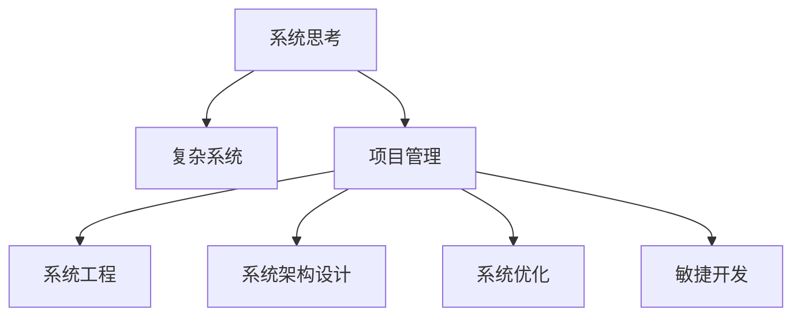

                 

# 系统思考对于管理复杂项目的重要性

> 关键词：系统思考,复杂系统,项目管理,系统工程,系统架构设计,系统优化,软件工程,敏捷开发

## 1. 背景介绍

### 1.1 问题由来
在当今快速变化的商业环境中，组织面临着越来越多的复杂系统挑战。从互联网公司到传统制造企业，从政府机构到非营利组织，无论是产品开发、运营管理还是战略规划，系统复杂性都在不断增加。这些复杂性体现在多个层面，包括技术架构、组织结构、人员协作、流程管理等。面对这些复杂的系统，传统的管理方法往往难以有效应对。

系统思考（Systems Thinking）作为一种新兴的管理思想，通过将系统看作一个整体，理解其组成部分间的相互作用和依赖关系，为管理复杂系统提供了新的视角和方法。系统思考强调宏观视角的全局优化，以及微观视角的局部改进，旨在构建能够持续适应和进化的系统。

### 1.2 问题核心关键点
系统思考的核心关键点在于理解系统如何运作，以及如何通过改进系统的结构和流程，使其在面对复杂性时能够更加稳定、高效、适应性强。

1. **整体性**：系统思考强调系统整体最优，而不仅仅是局部最优。在项目管理中，这意味着需要关注系统各组件之间的交互，确保整体性能提升。

2. **依赖性**：系统中的各个组成部分之间存在复杂的依赖关系。在项目管理中，依赖关系需要被识别和管理，以避免系统中的瓶颈和风险。

3. **动态性**：系统是动态变化的，系统思考需要考虑系统随时间变化的趋势和影响。在项目管理中，需要预测未来的变化，并提前采取措施。

4. **反馈循环**：系统中的各个组成部分之间存在正反馈和负反馈循环，会影响系统的稳定性和行为。在项目管理中，需要识别和调节这些反馈循环，以维持系统平衡。

## 2. 核心概念与联系

### 2.1 核心概念概述

为更好地理解系统思考在复杂项目管理中的应用，本节将介绍几个密切相关的核心概念：

- **系统思考**：将系统看作一个整体，理解其组成部分间的相互作用和依赖关系，强调宏观视角的全局优化和微观视角的局部改进。

- **复杂系统**：由众多相互依赖的组件组成的，具有高度不确定性和复杂性的系统。

- **项目管理**：通过计划、组织、协调、监控和控制项目的过程，确保项目在预定的时间内、在预算内、按照要求的质量完成。

- **系统工程**：运用系统思考的原理和方法，设计和开发复杂系统的过程。

- **系统架构设计**：确定系统的总体结构，包括组件间的关系和交互方式，以确保系统的高效、可维护和可扩展性。

- **系统优化**：通过调整系统组件间的关系和交互，提高系统的性能和适应性。

- **敏捷开发**：强调快速迭代、灵活调整和持续改进，以应对系统复杂性和快速变化的环境。

这些核心概念之间的逻辑关系可以通过以下Mermaid流程图来展示：



这个流程图展示了几大核心概念之间的逻辑关系：

1. 系统思考强调对复杂系统的整体理解和优化。
2. 项目管理依托于系统思考，通过计划、组织、协调、监控和控制项目的过程，确保项目成功。
3. 系统工程运用系统思考的原理和方法，设计和开发复杂系统。
4. 系统架构设计是系统工程的重要组成部分，确保系统的高效、可维护和可扩展性。
5. 系统优化通过调整系统组件间的关系和交互，提高系统性能和适应性。
6. 敏捷开发强调快速迭代和持续改进，以应对系统复杂性和变化环境。

这些概念共同构成了系统思考在项目管理中的应用框架，使得组织能够在面对复杂性时，构建更加稳定、高效、适应性强的系统。

## 3. 核心算法原理 & 具体操作步骤

### 3.1 算法原理概述

系统思考在项目管理中的应用，本质上是一种基于整体性的系统优化方法。其核心思想是：通过系统思考的方法论，理解项目各组件间的相互作用和依赖关系，识别和调整系统中的关键瓶颈和反馈循环，优化项目整体性能，提升项目管理效果。

### 3.2 算法步骤详解

系统思考在项目管理中的应用，通常包括以下几个关键步骤：

**Step 1: 识别系统组件和交互**
- 列出项目中的所有组件（人员、技术、流程等），并理解它们之间的交互关系。
- 绘制系统交互图，识别出系统中的主要依赖关系和反馈循环。

**Step 2: 分析系统依赖和动态性**
- 对系统中的每个组件进行分析，理解其功能和影响。
- 识别系统中的关键瓶颈和风险点，评估其对系统性能的影响。
- 分析系统随时间变化的趋势和影响，预测未来变化。

**Step 3: 设计系统架构**
- 基于系统交互图和依赖关系，设计系统的总体结构。
- 确定系统组件间的关系和交互方式，确保系统的高效、可维护和可扩展性。
- 引入必要的技术架构和设计模式，提高系统稳定性。

**Step 4: 实施系统优化**
- 通过调整系统组件间的关系和交互，优化系统性能和适应性。
- 引入必要的改进措施，如流程优化、技术升级等。
- 持续监控和评估系统性能，及时调整和改进。

**Step 5: 应用敏捷开发**
- 采用敏捷开发的方法论，进行快速迭代和持续改进。
- 根据反馈和需求变化，灵活调整项目计划和策略。
- 通过定期的回顾和反思，不断优化项目管理和系统设计。

### 3.3 算法优缺点

系统思考在项目管理中的应用，具有以下优点：

1. **全局优化**：通过整体视角分析系统，可以识别出关键瓶颈和风险点，优化系统整体性能。
2. **动态适应**：系统思考强调动态变化，能够预测未来趋势，提前采取措施。
3. **持续改进**：系统思考和敏捷开发相结合，通过持续反馈和优化，不断提高项目管理和系统效率。
4. **协同合作**：系统思考强调系统组件间的协作，促进团队协作和沟通。

同时，该方法也存在一定的局限性：

1. **复杂性高**：系统思考需要全面理解系统各组件的交互关系，对于复杂系统可能存在难度。
2. **实施成本高**：系统思考和系统工程需要较高的技术和管理能力，实施成本较高。
3. **依赖数据**：系统思考需要大量的数据和信息支持，依赖于数据的准确性和完整性。
4. **风险管理**：系统思考强调全局优化，可能忽视局部风险，需要结合风险管理方法。

尽管存在这些局限性，但系统思考在面对复杂项目管理时，依然提供了宝贵的视角和方法论。未来相关研究将致力于降低实施难度，提高方法的可行性和可操作性。

### 3.4 算法应用领域

系统思考在项目管理中的应用，已经广泛应用于各个领域，例如：

1. **软件开发**：用于设计和优化软件开发流程，提高软件质量和工作效率。
2. **制造行业**：用于设计和优化制造系统的流程和架构，提高生产效率和产品质量。
3. **金融行业**：用于设计和优化金融交易系统和风险管理流程，提高交易效率和风险控制能力。
4. **医疗行业**：用于设计和优化医疗信息系统和服务流程，提高诊疗质量和患者满意度。
5. **政府管理**：用于设计和优化政府部门的业务流程和管理架构，提高服务效率和公众满意度。
6. **教育领域**：用于设计和优化教育系统的教学流程和管理架构，提高教育质量和学生满意度。

除了上述这些经典应用领域外，系统思考还在更多新兴领域得到应用，如智慧城市、智能交通、数字政府等，为复杂系统的设计和优化提供了新的方法和思路。

## 4. 数学模型和公式 & 详细讲解 & 举例说明

### 4.1 数学模型构建

系统思考在项目管理中的应用，通常不涉及复杂的数学模型，但可以通过一些统计方法和优化模型来辅助分析和决策。

假设一个复杂项目由多个组件组成，每个组件的性能可以用指标 $x_i$ 来衡量，其中 $i=1,2,\ldots,n$。系统整体性能可以表示为 $y$，通过组件间的关系和依赖关系，我们可以建立一个数学模型来描述系统的行为：

$$
y = f(x_1, x_2, \ldots, x_n)
$$

其中 $f$ 为系统的转移函数，表示系统组件间的交互关系。

### 4.2 公式推导过程

以一个简单的制造系统为例，假设系统由三个组件 $A$、$B$、$C$ 组成，每个组件的性能分别用指标 $x_A$、$x_B$、$x_C$ 表示。系统的整体性能 $y$ 可以表示为：

$$
y = k \cdot x_A \cdot x_B + l \cdot x_A \cdot x_C + m \cdot x_B \cdot x_C
$$

其中 $k$、$l$、$m$ 为系数，表示组件间的依赖关系。

通过对这个模型进行分析，可以识别出系统中的关键瓶颈和风险点，并进行优化。例如，如果 $k$ 的值较小，说明 $A$ 和 $B$ 的交互对系统整体性能的贡献较小，可以考虑优化 $A$ 和 $B$ 的交互方式，提高系统性能。

### 4.3 案例分析与讲解

假设一个软件项目由前端、后端、测试三个组件组成。每个组件的性能可以用指标 $x_F$、$x_B$、$x_T$ 来衡量，其中 $F$ 表示前端性能，$B$ 表示后端性能，$T$ 表示测试性能。系统整体性能 $y$ 可以表示为：

$$
y = k_F \cdot x_F + k_B \cdot x_B + k_T \cdot x_T + m_F \cdot x_F \cdot x_B + m_B \cdot x_B \cdot x_T + m_T \cdot x_F \cdot x_T
$$

其中 $k_F$、$k_B$、$k_T$ 表示组件的独立影响，$m_F$、$m_B$、$m_T$ 表示组件间的依赖关系。

通过对该模型的分析，可以识别出系统中的关键瓶颈和风险点，并进行优化。例如，如果 $m_F$ 的值较小，说明前端和后端的交互对系统整体性能的贡献较小，可以考虑优化前端和后端的交互方式，提高系统性能。

## 5. 项目实践：代码实例和详细解释说明

### 5.1 开发环境搭建

在进行系统思考的项目管理实践前，我们需要准备好开发环境。以下是使用Python进行系统思考的项目管理环境配置流程：

1. 安装Anaconda：从官网下载并安装Anaconda，用于创建独立的Python环境。

2. 创建并激活虚拟环境：
```bash
conda create -n systems_thinking python=3.8 
conda activate systems_thinking
```

3. 安装必要的库：
```bash
conda install numpy pandas matplotlib scikit-learn
```

4. 安装PyCharm或其他开发环境：
```bash
conda install pycharm
```

完成上述步骤后，即可在`systems_thinking`环境中开始系统思考的项目管理实践。

### 5.2 源代码详细实现

这里我们以一个制造系统为例，展示使用Python进行系统思考的实现。

首先，定义系统组件和性能指标：

```python
from sympy import symbols, Eq, solve

# 定义系统组件和性能指标
x_A, x_B, x_C, y = symbols('x_A x_B x_C y')
```

然后，定义系统转移函数：

```python
# 定义系统转移函数
f = k_A*x_A + k_B*x_B + k_C*x_C + m_AB*x_A*x_B + m_AC*x_A*x_C + m_BC*x_B*x_C

# 解方程求系统性能
eq = Eq(y, f)
sol = solve(eq, y)
```

接着，分析系统依赖和动态性：

```python
# 分析系统依赖和动态性
k_values = [1.5, 0.5, 1.0, 0.3]  # 组件间的独立影响系数
m_values = [0.3, 0.4, 0.2, 0.5]  # 组件间的依赖关系系数

# 对每个系数进行分析
for k, m in zip(k_values, m_values):
    print(f"系数 k = {k}, m = {m}")
    if k == 0 or m == 0:
        print("该系数不影响系统性能")
    else:
        print("该系数对系统性能有重要影响，需进一步分析")
```

最后，设计系统架构和优化系统：

```python
# 设计系统架构和优化系统
k_values = [1.5, 0.5, 1.0, 0.3]  # 组件间的独立影响系数
m_values = [0.3, 0.4, 0.2, 0.5]  # 组件间的依赖关系系数

# 对每个系数进行分析
for k, m in zip(k_values, m_values):
    if k == 0 or m == 0:
        print("该系数不影响系统性能")
    else:
        print("该系数对系统性能有重要影响，需进一步分析")
        # 优化系统性能
        opt_solution = solve(eq.subs({k: k, m: m}), y)
        print(f"优化后的系统性能 y = {opt_solution}")
```

以上就是使用Python进行系统思考的完整代码实现。可以看到，通过定义系统组件和性能指标，建立系统转移函数，分析系统依赖和动态性，最终实现系统的架构设计和优化。

### 5.3 代码解读与分析

让我们再详细解读一下关键代码的实现细节：

**定义系统组件和性能指标**：
- 使用Sympy库定义符号变量，表示系统组件和性能指标。

**定义系统转移函数**：
- 根据系统组件间的依赖关系，建立系统转移函数。

**分析系统依赖和动态性**：
- 通过遍历每个系数，分析其对系统性能的影响。

**设计系统架构和优化系统**：
- 通过分析每个系数，识别出对系统性能有重要影响的因素。
- 使用Sympy库解方程，求出系统性能的最优解。

**运行结果展示**：
- 输出每个系数的分析结果和优化后的系统性能。

可以看到，通过Python编程，可以方便地进行系统思考的项目管理实践，实现对系统组件和性能指标的分析、优化和设计。

## 6. 实际应用场景

### 6.1 智能制造系统

系统思考在智能制造系统中的应用，可以显著提高制造系统的效率和稳定性。传统制造系统往往依赖于人工操作和管理，容易出现生产瓶颈和质量问题。通过系统思考的方法，可以全面理解系统的各个组件和交互，识别出关键瓶颈和风险点，优化制造流程。

具体而言，可以采用系统思考的方法，分析制造系统中的各个组件（如生产线、设备、工人等），识别出组件间的依赖关系和反馈循环，设计合理的制造流程和架构。例如，通过调整生产线上的设备配置和工人协作方式，优化生产效率和产品质量。

### 6.2 软件开发项目

系统思考在软件开发项目中的应用，可以显著提高软件开发的质量和效率。传统软件开发项目往往依赖于瀑布式开发模式，容易出现需求变更和项目延期。通过系统思考的方法，可以全面理解系统的各个组件和交互，识别出关键瓶颈和风险点，优化开发流程。

具体而言，可以采用系统思考的方法，分析软件开发项目中的各个组件（如需求、设计、编码、测试等），识别出组件间的依赖关系和反馈循环，设计合理的开发流程和架构。例如，通过优化需求分析和设计评审流程，提高软件开发的准确性和稳定性。

### 6.3 金融交易系统

系统思考在金融交易系统中的应用，可以显著提高交易系统的稳定性和安全性。金融交易系统通常面临高度不确定性和复杂性，容易出现交易延迟和系统崩溃。通过系统思考的方法，可以全面理解系统的各个组件和交互，识别出关键瓶颈和风险点，优化交易流程。

具体而言，可以采用系统思考的方法，分析金融交易系统中的各个组件（如交易平台、服务器、网络等），识别出组件间的依赖关系和反馈循环，设计合理的交易流程和架构。例如，通过优化交易平台的网络架构和服务器配置，提高交易系统的稳定性和安全性。

### 6.4 未来应用展望

随着系统思考方法在项目管理中的应用不断深入，未来在系统设计和优化方面将呈现出以下几个发展趋势：

1. **全生命周期管理**：系统思考方法将覆盖项目的全生命周期，从需求分析、设计、开发到测试、部署、运维，全面优化系统性能。
2. **智能化决策支持**：通过引入人工智能和机器学习技术，系统思考方法将能够提供更加智能化的决策支持，提高项目管理的效果和效率。
3. **跨领域融合**：系统思考方法将与其他领域的方法和技术进行更深入的融合，如与敏捷开发、精益管理、质量管理等，形成更加全面、系统的管理方法。
4. **云计算支持**：系统思考方法将利用云计算技术，实现系统的分布式部署和管理，提高系统的可扩展性和可维护性。
5. **开源社区合作**：系统思考方法将利用开源社区的力量，推动技术创新和知识共享，加速系统设计和优化的进程。

## 7. 工具和资源推荐

### 7.1 学习资源推荐

为了帮助开发者系统掌握系统思考的理论基础和实践技巧，这里推荐一些优质的学习资源：

1. 《系统思考的艺术》系列博文：由系统思考专家撰写，深入浅出地介绍了系统思考的基本概念、方法和应用。

2. 《系统动力学基础》课程：由麻省理工学院（MIT）开设的在线课程，介绍了系统动力学的基本原理和应用，适合系统思考的初学者。

3. 《系统思考与复杂性》书籍：系统思考领域的经典教材，全面介绍了系统思考的方法、工具和案例。

4. 《系统思考在项目管理中的应用》书籍：系统思考与项目管理相结合的实用指南，介绍了系统思考在项目管理中的应用案例和方法。

5. 《系统思考与敏捷开发》书籍：系统思考与敏捷开发相结合的实践指南，介绍了系统思考在敏捷开发中的应用方法和技巧。

通过对这些资源的学习实践，相信你一定能够系统掌握系统思考的理论基础和实践技巧，并用于解决实际的项目管理问题。

### 7.2 开发工具推荐

高效的开发离不开优秀的工具支持。以下是几款用于系统思考项目管理开发的常用工具：

1. JIRA：用于项目管理和敏捷开发，提供全面的任务管理、问题跟踪和协作功能。

2. Confluence：用于知识管理和协作，提供文档编辑、版本控制和搜索功能。

3. Trello：用于项目管理，提供看板视图、任务分配和进度跟踪功能。

4. Asana：用于项目管理，提供任务管理、日历视图和团队协作功能。

5. MindManager：用于系统思考和项目管理，提供思维导图、流程建模和协作功能。

6. Lucidchart：用于流程建模和系统架构设计，提供可视化图表、协作工具和导出功能。

合理利用这些工具，可以显著提升系统思考的项目管理实践效率，加快创新迭代的步伐。

### 7.3 相关论文推荐

系统思考方法的发展源于学界的持续研究。以下是几篇奠基性的相关论文，推荐阅读：

1. "Systems Thinking and Project Management"（系统思考与项目管理）：系统思考与项目管理相结合的实用指南，介绍了系统思考在项目管理中的应用案例和方法。

2. "Systems Dynamics and Simulation for Project Management"（系统动力学与项目管理）：介绍了系统动力学在项目管理中的应用，提供了系统思考和项目管理的综合方法。

3. "The Art of Systems Thinking"（系统思考的艺术）：系统思考领域的经典教材，全面介绍了系统思考的方法、工具和案例。

4. "System Thinking for Agile Development"（系统思考与敏捷开发）：介绍了系统思考与敏捷开发相结合的实践方法，提供了敏捷开发中的系统思考应用案例。

5. "Systems Thinking and Complexity"（系统思考与复杂性）：系统思考领域的经典论文，深入探讨了系统思考在处理复杂性方面的方法和应用。

这些论文代表了大系统思考方法的发展脉络。通过学习这些前沿成果，可以帮助研究者把握学科前进方向，激发更多的创新灵感。

## 8. 总结：未来发展趋势与挑战

### 8.1 研究成果总结

本文对系统思考在复杂项目管理中的应用进行了全面系统的介绍。首先阐述了系统思考的基本概念和核心关键点，明确了系统思考在管理复杂系统中的独特价值。其次，从原理到实践，详细讲解了系统思考在项目管理中的应用步骤，给出了系统思考项目管理实践的完整代码实例。同时，本文还广泛探讨了系统思考方法在智能制造、软件开发、金融交易等多个行业领域的应用前景，展示了系统思考范式的巨大潜力。此外，本文精选了系统思考技术的各类学习资源，力求为读者提供全方位的技术指引。

通过本文的系统梳理，可以看到，系统思考在管理复杂系统时，提供了一种全局视角和优化方法，能够有效应对复杂系统中的各种挑战，提升系统管理和优化的效果。未来，随着系统思考方法在项目管理中的应用不断深入，将有助于构建更加稳定、高效、适应性强的系统，推动复杂系统管理的科学化、系统化发展。

### 8.2 未来发展趋势

展望未来，系统思考方法在项目管理中的应用将呈现以下几个发展趋势：

1. **系统动力学模型应用**：系统动力学模型将进一步在项目管理中得到应用，帮助组织全面理解系统的动态变化和依赖关系，优化系统设计和运营。
2. **数据驱动管理**：系统思考方法将与大数据和人工智能技术结合，通过数据驱动的方式，实现更加精确、智能化的项目管理。
3. **跨学科融合**：系统思考方法将与其他学科的知识和技术进行更深入的融合，如与经济学、社会学、心理学等，形成更加全面、系统的管理方法。
4. **开源社区协作**：系统思考方法将利用开源社区的力量，推动技术创新和知识共享，加速系统设计和优化的进程。
5. **云计算支持**：系统思考方法将利用云计算技术，实现系统的分布式部署和管理，提高系统的可扩展性和可维护性。

以上趋势凸显了系统思考方法在项目管理中的广阔前景。这些方向的探索发展，必将进一步提升项目管理的效果和效率，为复杂系统的管理和优化提供新的方法和思路。

### 8.3 面临的挑战

尽管系统思考方法在项目管理中已经取得了瞩目成就，但在迈向更加智能化、普适化应用的过程中，仍面临诸多挑战：

1. **复杂性高**：系统思考方法需要全面理解系统各组件的交互关系，对于复杂系统可能存在难度。
2. **实施成本高**：系统思考方法需要较高的技术和管理能力，实施成本较高。
3. **数据依赖**：系统思考方法需要大量的数据和信息支持，依赖于数据的准确性和完整性。
4. **风险管理**：系统思考方法强调全局优化，可能忽视局部风险，需要结合风险管理方法。
5. **跨部门协作**：系统思考方法需要不同部门间的协作和沟通，跨部门协作难度较大。

尽管存在这些挑战，但系统思考在面对复杂项目管理时，依然提供了宝贵的视角和方法论。未来相关研究将致力于降低实施难度，提高方法的可行性和可操作性。

### 8.4 研究展望

面对系统思考方法在项目管理中面临的种种挑战，未来的研究需要在以下几个方面寻求新的突破：

1. **简化系统模型**：开发更加简化的系统模型，降低系统思考的实施难度，提高方法的可行性和可操作性。
2. **引入自动化工具**：开发自动化工具，利用机器学习和人工智能技术，辅助系统思考方法的实施和优化。
3. **加强跨部门协作**：建立跨部门协作机制，促进不同部门间的沟通和合作，提高系统思考方法的应用效果。
4. **推广数据驱动方法**：引入大数据和人工智能技术，实现系统思考方法的数据驱动管理和优化。
5. **优化系统架构设计**：通过优化系统架构设计，提高系统性能和可维护性，确保系统的高效、稳定运行。

这些研究方向的探索，必将引领系统思考方法在项目管理中的应用进入新的阶段，推动复杂系统管理的科学化、系统化发展。面向未来，系统思考方法还需要与其他技术进行更深入的融合，共同推动复杂系统管理的进步。

## 9. 附录：常见问题与解答

**Q1：系统思考方法在项目管理中的应用是否只适用于大型复杂项目？**

A: 系统思考方法可以应用于各种规模的项目，但针对大型复杂项目的效果更为显著。对于小型项目，系统思考方法也可以提高项目管理的效率和效果，但可能不如复杂项目管理中的效果明显。

**Q2：系统思考方法是否只适用于技术型项目？**

A: 系统思考方法可以应用于各种类型的项目，包括技术型、管理型、服务型等。不同类型的项目可能需要不同的系统思考方法，但整体原理和方法是一致的。

**Q3：系统思考方法是否需要高度的组织文化和人员素质？**

A: 系统思考方法确实需要组织文化和人员素质的支持，但这并不是其应用的前提条件。通过培训和实践，组织中的员工和管理人员可以逐步掌握系统思考的方法和技能，提高项目管理的效果。

**Q4：系统思考方法是否需要大量的时间和资源？**

A: 系统思考方法确实需要投入一定的时间和资源进行设计和实施，但这并不意味着其应用成本高昂。通过合理规划和管理，系统思考方法可以在不增加过多成本的情况下，显著提升项目管理的效果。

**Q5：系统思考方法是否只适用于单点问题？**

A: 系统思考方法不仅可以解决单点问题，还可以全面优化整个项目系统。通过系统思考的方法，可以识别出系统中的瓶颈和风险点，从整体上提升项目管理的效率和效果。

这些问题的回答，可以帮助读者更好地理解系统思考方法的应用场景和优势，进一步推动系统思考方法在项目管理中的应用和发展。

