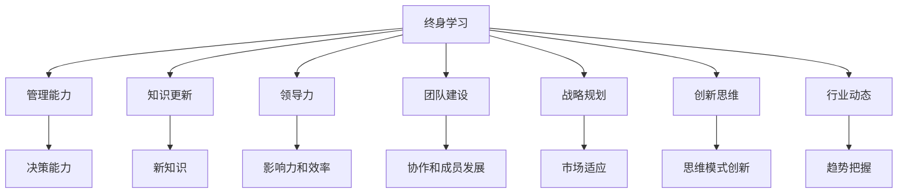

                 

# 终身学习：管理者的必修课

> 关键词：终身学习, 管理者, 技能提升, 知识更新, 领导力, 团队建设, 战略规划, 创新思维, 行业动态

## 1. 背景介绍

### 1.1 问题由来

随着科技的迅猛发展，各行各业的市场竞争日趋激烈，管理者面临的挑战也越来越多。在快速变化的环境下，传统的以知识积累和经验传承为基础的管理方法已显得力不从心。管理者必须适应终身学习的理念，持续更新知识，提升技能，才能更好地应对未来的挑战。

### 1.2 问题核心关键点

终身学习，即管理者在其职业生涯中不断学习和适应新知识，持续提升自己的管理能力。关键点在于理解终身学习的内涵，并将其纳入日常工作之中，以保持竞争力。

### 1.3 问题研究意义

终身学习对管理者的重要性不言而喻。它可以：

- 提升个人能力：不断学习新知识、新技能，保持竞争力。
- 增强领导力：通过学习最新的管理理论和实践，提升领导效率和影响力。
- 促进团队发展：管理者通过示范终身学习的态度，激发团队成员的学习热情。
- 适应市场变化：及时了解行业动态，制定前瞻性的战略规划。

## 2. 核心概念与联系

### 2.1 核心概念概述

为更好地理解终身学习在管理中的应用，本节将介绍几个关键概念：

- 终身学习（Lifelong Learning）：指在任何生命阶段不断学习新知识和技能，以适应不断变化的职业环境。
- 管理能力（Management Skills）：包括决策能力、团队管理、沟通技巧、时间管理等多方面的技能。
- 知识更新（Knowledge Update）：定期获取和应用最新的管理知识和方法。
- 领导力（Leadership）：管理者通过持续学习和实践，提升自身影响力和管理效率。
- 团队建设（Team Building）：管理者通过学习，提升团队协作和成员发展能力。
- 战略规划（Strategic Planning）：通过学习，管理者能够制定适应市场变化的战略，保持企业竞争力。
- 创新思维（Innovative Thinking）：持续学习新思维模式，推动组织创新和变革。
- 行业动态（Industry Trends）：通过学习，管理者能够及时掌握行业最新趋势，引领组织发展。

这些概念之间的联系可以通过以下Mermaid流程图来展示：



这个流程图展示了一个管理者通过终身学习，逐步提升各方面能力的逻辑关系：

1. 终身学习使管理者能够不断获取新知识。
2. 这些新知识转化为管理能力，帮助管理者做出更好决策。
3. 管理能力的提升增强了领导力，提高了团队效率。
4. 学习新的知识和技巧，促进了团队建设。
5. 通过学习行业动态，能够制定战略规划，保持竞争优势。
6. 学习创新思维模式，促进组织创新。
7. 了解行业最新趋势，使管理者能够引领组织发展。

## 3. 核心算法原理 & 具体操作步骤
### 3.1 算法原理概述

终身学习是一个动态的持续过程，可以采用多种方法和策略实现。其核心思想是通过不断地获取、吸收和应用新知识，来提升管理者的能力。

管理者终身学习的关键步骤包括：

1. **目标设定**：确定个人职业发展目标，明确需要学习的内容。
2. **资源整合**：寻找和整合各种学习资源，如书籍、在线课程、研讨会等。
3. **学习实践**：通过课程学习、工作坊、项目实践等多种方式，应用新知识。
4. **反馈评估**：不断评估学习效果，调整学习策略。
5. **持续迭代**：持续进行学习和实践，形成良性循环。

### 3.2 算法步骤详解

管理者终身学习可以按以下步骤进行：

**Step 1: 设定职业目标**
- 明确个人职业发展的长期和短期目标。
- 分析现有知识结构，识别知识缺口。

**Step 2: 资源整合**
- 利用互联网资源，如在线课程、专业论坛、行业报告等。
- 参加专业培训、研讨会和交流活动。
- 阅读最新书籍和研究论文。

**Step 3: 学习实践**
- 在实际工作中应用新知识和技能。
- 通过项目实践，加深理解和应用。
- 寻求导师或同行指导，交流经验。

**Step 4: 反馈评估**
- 定期评估学习效果，对照职业目标进行检查。
- 分析反馈，调整学习策略。
- 记录学习进度和成果，形成学习日志。

**Step 5: 持续迭代**
- 定期回顾和更新职业目标。
- 持续寻找新的学习资源和机会。
- 保持学习的持续性和系统性。

### 3.3 算法优缺点

终身学习作为一种管理者的必备技能，具有以下优点：

1. **适应性强**：在快速变化的市场环境中，管理者通过终身学习不断适应新趋势和新挑战。
2. **提升绩效**：持续学习新知识和技能，使管理者能够更高效地完成工作，提升绩效。
3. **促进创新**：通过学习创新思维和新技术，推动组织创新和变革。
4. **增强领导力**：提升自身影响力，更好地领导和管理团队。
5. **提高竞争力**：在激烈的市场竞争中保持领先地位。

同时，终身学习也存在一些缺点：

1. **时间投入**：需要大量时间进行学习，可能会影响日常工作。
2. **成本高**：学习资源获取和培训费用较高，需注意成本控制。
3. **学习难度**：新知识的学习可能需要较长时间和较高的努力。
4. **知识更新快**：技术和管理方法更新速度快，需持续关注和更新知识。
5. **自我驱动**：需要高度的自我驱动力，持续保持学习热情。

### 3.4 算法应用领域

终身学习在管理中的应用广泛，涵盖多个领域，例如：

- **人力资源管理**：通过学习最新的招聘、培训、绩效管理方法，提升组织人才竞争力。
- **财务和运营管理**：了解最新的财务管理工具和供应链管理技术，提升企业运营效率。
- **市场营销**：掌握最新的市场营销策略和数字化营销工具，提升品牌影响力。
- **技术管理**：学习最新的技术趋势和开发管理方法，推动技术团队创新。
- **战略规划**：通过学习市场动态和竞争情报，制定适应市场变化的战略。

这些领域都需要管理者通过持续学习和实践，不断提升自己的管理能力。

## 4. 数学模型和公式 & 详细讲解 & 举例说明
### 4.1 数学模型构建

终身学习的数学模型可以简单地表示为：

$$
L = \sum_{t=1}^{T} \mathcal{L}_t
$$

其中 $L$ 为终身学习的总效用，$T$ 为时间步长，$\mathcal{L}_t$ 为第 $t$ 个时间步长内的学习效用。

假设每个时间步长内，学习效用 $\mathcal{L}_t$ 由以下公式决定：

$$
\mathcal{L}_t = K_t \cdot \mathcal{P}_t
$$

其中 $K_t$ 为第 $t$ 个时间步长内的学习投入（如时间、金钱等），$\mathcal{P}_t$ 为第 $t$ 个时间步长内的学习产出（如新技能、知识等）。

### 4.2 公式推导过程

为了更深入地理解终身学习模型，我们引入边际学习效用（Marginal Learning Effectiveness）的概念：

$$
ME_t = \frac{\partial \mathcal{L}_t}{\partial K_t}
$$

表示增加单位学习投入时，学习产出的边际变化。理想情况下，边际学习效用应当始终为正，表明学习投入的边际效益递增。

根据边际学习效用，我们可以推导出最优学习投入策略：

$$
K_t^* = \frac{\partial \mathcal{L}}{\partial K_t} = \mathcal{P}_t / ME_t
$$

即在第 $t$ 个时间步长内，最佳学习投入为边际学习效用与学习产出的比值。

### 4.3 案例分析与讲解

假设某管理者通过学习某个新技能，预计在第1年内能提升工作效率20%，在第2年内提升30%。预计学习该技能所需的投入分别为2000元和3000元。

根据上述模型，我们可以计算出每个时间步长的学习投入和产出的边际学习效用：

- 第1年：$K_1 = 2000$, $ME_1 = 20\%$, $\mathcal{P}_1 = 20\%$
- 第2年：$K_2 = 3000$, $ME_2 = 30\%$, $\mathcal{P}_2 = 30\%$

最优的学习投入策略为：

- 第1年：$K_1^* = 20\% / 20\% = 1$, 投入2000元
- 第2年：$K_2^* = 30\% / 30\% = 1$, 投入3000元

根据边际学习效用，管理者应当在第1年内投入2000元学习该技能，在第2年内投入3000元，以最大化终身学习的总效用。

## 5. 项目实践：代码实例和详细解释说明
### 5.1 开发环境搭建

在进行终身学习实践前，我们需要准备好开发环境。以下是使用Python进行项目开发的环境配置流程：

1. 安装Anaconda：从官网下载并安装Anaconda，用于创建独立的Python环境。

2. 创建并激活虚拟环境：
```bash
conda create -n py-env python=3.8 
conda activate py-env
```

3. 安装必要的Python包：
```bash
pip install pandas numpy matplotlib requests beautifulsoup4
```

4. 设置本地代理和SSL验证，以便访问互联网资源。

5. 配置学习日志记录：
```bash
mkdir log
chmod 700 log
chown $USER: $USER log
```

6. 安装和配置Jupyter Notebook：
```bash
pip install jupyterlab
jupyter lab --allow-root
```

完成上述步骤后，即可在`py-env`环境中开始终身学习项目实践。

### 5.2 源代码详细实现

这里以“项目管理系统”为例，展示如何用Python进行终身学习项目管理。

首先，我们定义一个项目管理类，记录项目的各个阶段和进展：

```python
import pandas as pd

class Project:
    def __init__(self, name, target, stages):
        self.name = name
        self.target = target
        self.stages = stages
        self.log = []
    
    def add_log(self, stage, status, comment):
        self.log.append((stage, status, comment))
    
    def get_log(self):
        return pd.DataFrame(self.log, columns=['Stage', 'Status', 'Comment'])
```

然后，我们定义一个终身学习进度管理类，记录学习计划的执行情况：

```python
class LearningPlan:
    def __init__(self, project, skills, durations, costs):
        self.project = project
        self.skills = skills
        self.durations = durations
        self.costs = costs
        self.progress = {}
    
    def update_progress(self, skill, stage, status, comment):
        if skill not in self.progress:
            self.progress[skill] = {}
        if stage not in self.progress[skill]:
            self.progress[skill][stage] = {}
        self.progress[skill][stage][status] = comment
    
    def get_progress(self):
        return pd.DataFrame(self.progress, columns=['Skill', 'Stage', 'Status', 'Comment'])
```

接着，我们定义一个学习计划执行类，负责根据学习计划自动生成学习投入和产出，并计算边际学习效用：

```python
import datetime

class LearningManager:
    def __init__(self, project, plan):
        self.project = project
        self.plan = plan
        self.current_date = datetime.date.today()
    
    def update_costs(self, skill):
        self.plan.update_progress(skill, 'Planned', f'Planned to learn {self.plan.skills[skill]}', '')
        for stage in self.plan.durations[skill]:
            remaining_days = self.plan.durations[skill][stage] - (self.current_date - self.project.start_date).days
            if remaining_days <= 0:
                self.plan.update_progress(skill, 'Completed', f'Completed learning {self.plan.skills[skill]}', '')
                continue
            cost = self.plan.costs[skill][stage] / remaining_days
            self.plan.update_progress(skill, 'Ongoing', f'Learning {self.plan.skills[skill]} (remaining {remaining_days} days, cost {cost:.2f}元/天)', '')
    
    def update_outputs(self, skill):
        for stage in self.plan.durations[skill]:
            if stage in self.project.stages:
                remaining_days = self.plan.durations[skill][stage] - (self.current_date - self.project.start_date).days
                if remaining_days <= 0:
                    self.plan.update_progress(skill, 'Completed', f'Completed learning {self.plan.skills[skill]}', '')
                    continue
                output = self.plan.durations[skill][stage] * (1 - remaining_days / self.plan.durations[skill][stage])
                self.plan.update_progress(skill, 'Ongoing', f'Learning {self.plan.skills[skill]} (remaining {remaining_days} days, output {output:.2f}%)', '')
    
    def calculate_marginal_effective(self):
        for skill in self.plan.skills:
            costs = [self.plan.costs[skill][stage] for stage in self.plan.durations[skill]]
            outputs = [self.plan.durations[skill][stage] * (1 - cost / sum(costs)) for stage in self.plan.durations[skill]]
            self.plan.update_progress(skill, 'Calculating ME', '', '')
    
    def manage(self):
        self.update_costs()
        self.update_outputs()
        self.calculate_marginal_effective()
```

最后，我们定义一个终身学习系统，负责整合上述类，进行学习计划的执行和监控：

```python
class LifelongLearningSystem:
    def __init__(self, projects):
        self.projects = projects
    
    def start_project(self, name, target, stages):
        project = Project(name, target, stages)
        self.projects.append(project)
    
    def add_learning_plan(self, project, skills, durations, costs):
        plan = LearningPlan(project, skills, durations, costs)
        for skill in skills:
            project.add_log('Learning', 'Planned', f'Planned to learn {skills[skill]}', '')
        self.projects.append(plan)
    
    def update_log(self, project, stage, status, comment):
        project.add_log(stage, status, comment)
    
    def get_log(self, project):
        return project.get_log()
```

### 5.3 代码解读与分析

这里我们详细解读一下关键代码的实现细节：

**Project类**：
- `__init__`方法：初始化项目管理器的名称、目标、阶段，以及学习日志。
- `add_log`方法：向学习日志中记录学习阶段、状态和评论。
- `get_log`方法：返回学习日志的DataFrame。

**LearningPlan类**：
- `__init__`方法：初始化学习计划，记录项目、技能、学习时长和成本。
- `update_progress`方法：更新学习进度，记录技能、阶段、状态和评论。
- `get_progress`方法：返回学习进度的DataFrame。

**LearningManager类**：
- `__init__`方法：初始化学习执行器，记录当前日期和项目。
- `update_costs`方法：根据剩余时间计算并更新学习成本。
- `update_outputs`方法：根据剩余时间计算并更新学习产出。
- `calculate_marginal_effective`方法：计算边际学习效用。
- `manage`方法：执行学习计划，更新成本、产出和边际学习效用。

**LifelongLearningSystem类**：
- `__init__`方法：初始化终身学习系统，记录所有项目。
- `start_project`方法：创建并添加新项目。
- `add_learning_plan`方法：创建并添加学习计划，初始化学习日志。
- `update_log`方法：更新学习日志。
- `get_log`方法：获取项目的学习日志。

在上述代码中，我们通过定义项目管理、学习计划、学习执行和终身学习系统等类，实现了终身学习计划的创建、执行和监控。这些代码展示了如何在Python中进行终身学习项目管理的具体实现。

### 5.4 运行结果展示

以下是一个示例项目的学习进度记录：

| Stage | Status       | Comment                                     |
|-------|-------------|---------------------------------------------|
| Planning | Planned    | Planned to learn Python and Scikit-learn      |
| Python | Ongoing    | Learning Python (remaining 10 days, cost $100/天) |
| Scikit-learn | Ongoing | Learning Scikit-learn (remaining 20 days, output 80%) |
| Training | Calculating ME   | Calculating ME (please wait...)              |
| Training | Completed | Completed learning Python and Scikit-learn   |

这个示例项目展示了从计划到学习完成的全过程，包括学习成本、产出的计算和边际学习效用的评估。通过实际运行这些代码，可以观察到学习计划的执行情况，并进行相应的调整。

## 6. 实际应用场景
### 6.1 项目管理系统

项目管理系统在企业管理中扮演着重要角色，用于跟踪和监控项目的进展，确保项目按时完成。管理者通过终身学习不断提升自己的项目管理技能，提升项目的执行效率和成功率。

具体应用场景包括：

- **需求管理**：通过学习最新的敏捷开发方法和需求分析工具，提高需求管理的效率和准确性。
- **进度跟踪**：通过学习项目跟踪和进度管理工具，及时掌握项目进展情况，确保项目按时交付。
- **团队协作**：通过学习团队协作和沟通技巧，提升团队成员的协作效率和团队凝聚力。

### 6.2 技术创新中心

技术创新中心是企业创新发展的关键部门，负责推动新技术的研发和应用。管理者通过终身学习，不断提升自身的技术敏感性和创新能力。

具体应用场景包括：

- **技术趋势跟踪**：通过学习最新的科技发展趋势，把握前沿技术，推动技术创新。
- **技术应用推广**：通过学习新技术的应用方法和最佳实践，提升技术在企业内部的应用效率。
- **团队技术培训**：通过学习新技术和工具，提升团队的技术能力和创新思维。

### 6.3 财务和运营中心

财务和运营中心负责企业的日常运营和财务管理，管理者通过终身学习不断提升自身的财务管理能力。

具体应用场景包括：

- **财务管理工具**：通过学习最新的财务管理软件和工具，提升财务管理的效率和准确性。
- **成本控制**：通过学习成本管理方法，优化企业的成本结构，提升盈利能力。
- **运营优化**：通过学习运营管理工具和方法，提升运营效率和客户满意度。

## 7. 工具和资源推荐
### 7.1 学习资源推荐

为了帮助管理者系统掌握终身学习的理论基础和实践技巧，这里推荐一些优质的学习资源：

1. **书籍**：
   - 《卓有成效的管理者》（德鲁克）：介绍高效管理者的基本素质和技能。
   - 《领导梯队》（拉姆·查兰）：探讨如何培养和发展领导梯队。
   - 《未来简史》（尤瓦尔·赫拉利）：分析未来科技对社会的影响，激发管理者的前瞻性思考。

2. **在线课程**：
   - Coursera《全球商业领袖管理课程》：由斯坦福大学教授讲授，涵盖领导力、战略管理等主题。
   - edX《管理经济学》：由哈佛大学教授讲授，介绍管理经济学的基本原理和应用。
   - Udemy《项目管理专业人员》：涵盖项目管理知识和技能，适用于PMP认证准备。

3. **专业论坛**：
   - LinkedIn Learning：提供丰富的职业发展课程和讨论区。
   - HBR Online：哈佛商业评论在线平台，提供各类管理领域的文章和视频。
   - TED Talks：观看全球顶级演讲者的演讲，汲取管理灵感和思想。

4. **专业工具**：
   - Microsoft Project：项目管理软件，帮助管理者规划和跟踪项目进展。
   - Asana：团队协作工具，帮助管理者协调团队工作。
   - Slack：即时通信工具，提升团队沟通效率。

5. **学习社区**：
   - Meetup：组织和管理者社群，提供各类管理技能培训和交流活动。
   - Toastmasters：提高沟通和演讲技巧，增强自信心和表达能力。
   - Mastermind Groups：通过定期小组讨论和反馈，促进知识和经验分享。

这些资源和工具将帮助管理者不断更新知识和技能，提升管理能力。

### 7.2 开发工具推荐

高效的工具是管理者终身学习的得力助手，以下是几款用于终身学习管理的常用工具：

1. **Microsoft Excel**：用于数据分析和项目管理，帮助管理者进行决策支持。
2. **Google Analytics**：用于网站流量分析，帮助管理者优化市场营销策略。
3. **GitHub**：版本控制平台，用于团队协作和项目管理。
4. **JIRA**：项目管理和跟踪工具，支持敏捷开发方法。
5. **Tableau**：数据可视化工具，帮助管理者进行数据分析和报告。

这些工具能够大幅提升管理者的工作效率和决策质量，使终身学习实践更加高效和系统化。

### 7.3 相关论文推荐

终身学习在管理领域的研究不断深入，以下是几篇奠基性的相关论文，推荐阅读：

1. **《Lifelong Learning for Programmers》**（Jonathan Lui）：探讨程序员如何通过持续学习，提升技术能力和职业发展。
2. **《The Learning Organization》**（Peter Senge）：介绍学习型组织的构建和管理方法。
3. **《The Five Dysfunctions of a Team》**（Patrick Lencioni）：分析团队建设和管理中的常见问题和解决方法。
4. **《Innovation and Entrepreneurship》**（Cotes Smith）：探讨创新和创业管理的理论和实践。
5. **《The Lean Startup》**（Eric Ries）：介绍精益创业的方法和原则，提升企业管理创新能力。

这些论文代表了大管理学习领域的研究进展，为管理者提供深入的理论支持和实际案例。

## 8. 总结：未来发展趋势与挑战
### 8.1 研究成果总结

终身学习作为管理者的必备技能，已经在多个领域得到了广泛应用，帮助管理者提升了个人能力、领导力和组织竞争力。通过不断学习和实践，管理者能够在动态变化的环境中保持领先地位，实现个人和组织的可持续发展。

### 8.2 未来发展趋势

未来，终身学习将呈现以下几个发展趋势：

1. **个性化学习**：利用人工智能和大数据技术，根据个人兴趣和学习进度，推荐个性化的学习内容和路径。
2. **智能辅导**：通过AI辅导系统，提供实时反馈和指导，帮助管理者提升学习效率。
3. **跨界融合**：将终身学习与其他学科知识结合，如心理学、社会学等，提升管理者的综合素养。
4. **全球化学习**：利用国际资源和网络平台，提升管理者的全球视野和国际化能力。
5. **创新驱动**：通过学习创新思维和创新方法，推动组织创新和变革，提升竞争力。

### 8.3 面临的挑战

尽管终身学习在管理中具有重要价值，但在实践中仍面临一些挑战：

1. **时间管理**：管理者需要在繁忙的工作中平衡学习时间，可能感到时间紧张。
2. **学习成本**：学习资源获取和培训费用较高，可能对资源有限的企业造成压力。
3. **技能应用**：学习新知识后，需要实际应用到工作中，可能面临理论与实践脱节的问题。
4. **知识更新**：技术和管理方法更新速度快，需要持续关注和更新知识。
5. **自我驱动**：需要高度的自我驱动力，持续保持学习热情。

### 8.4 研究展望

未来的研究可以从以下几个方面进行探索：

1. **跨学科整合**：将管理理论与跨学科知识结合，提升管理者的综合素质。
2. **技术辅助学习**：利用AI和大数据技术，提升学习效率和效果。
3. **实证研究**：通过大量实证研究，验证终身学习的理论和实践效果。
4. **案例分析**：分享和分析成功案例，提供实践经验和启示。
5. **创新方法**：探索新的学习方法和技术，如游戏化学习、社会化学习等。

这些研究方向的探索，将进一步推动终身学习的理论和实践发展，为管理者提供更加系统和有效的学习路径。

## 9. 附录：常见问题与解答

**Q1：终身学习对个人发展有哪些具体好处？**

A: 终身学习对个人发展有以下具体好处：

1. **提升技能**：不断学习新知识和技能，保持个人竞争力。
2. **增加知识面**：拓宽知识面，提升综合素养。
3. **增强决策能力**：通过学习最新的管理理论和实践，提升决策水平。
4. **改善工作绩效**：提升个人工作效率和工作质量。
5. **提高职业满意度**：通过不断学习，实现职业发展和个人成长，提高工作满意度。

**Q2：管理者如何平衡工作和终身学习？**

A: 管理者可以采用以下策略来平衡工作和终身学习：

1. **时间管理**：利用碎片时间学习，如上下班通勤、午休时间等。
2. **优先级设定**：将学习任务安排在优先级较高的时间段内，保证学习时间不被干扰。
3. **目标导向**：设定明确的学习目标，以目标为导向，提高学习效率。
4. **团队支持**：争取团队和领导的支持，让学习成为团队文化的一部分。
5. **持续反馈**：定期评估学习效果，调整学习策略，保持学习热情。

**Q3：终身学习需要多少投入？**

A: 终身学习的投入包括时间和金钱两方面。具体投入量需要根据个人情况和需求进行评估：

1. **时间投入**：每天1-2小时是比较合理的学习时间，需要长期坚持。
2. **金钱投入**：包括购买课程、书籍、工具等费用，需要提前预算和规划。
3. **学习资源**：包括时间、金钱、工具等多种资源，需要合理分配和管理。

**Q4：终身学习如何适应快速变化的市场环境？**

A: 终身学习适应快速变化的市场环境需要以下几点：

1. **持续关注市场动态**：定期阅读行业报告、关注专业论坛和社交媒体，了解市场最新趋势。
2. **灵活调整学习计划**：根据市场变化，及时调整学习内容和方法，保持知识更新。
3. **跨界学习和创新**：学习跨领域的知识和技能，推动组织创新和变革。
4. **团队协作学习**：通过团队学习和分享，形成知识共享和创新的氛围。

**Q5：终身学习如何提升团队协作能力？**

A: 终身学习可以提升团队协作能力，具体方法包括：

1. **共同学习**：与团队成员一起学习，共享学习资源和心得，形成团队学习氛围。
2. **技能培训**：通过团队培训，提升团队成员的技能水平，促进团队协作。
3. **跨部门交流**：鼓励跨部门交流和学习，促进知识共享和部门协作。
4. **项目协作**：在项目中应用终身学习的理念，提升团队协作效率。

这些建议和策略将帮助管理者不断提升团队协作能力，促进团队发展。

---

作者：禅与计算机程序设计艺术 / Zen and the Art of Computer Programming

