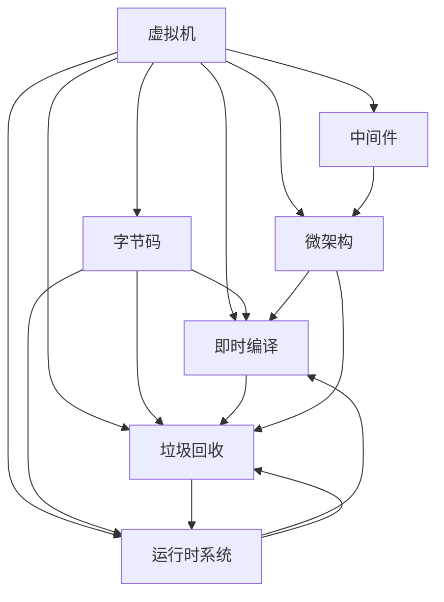

                 

# 编程语言虚拟机：JVM与CLR比较

> 关键词：虚拟机, JVM, CLR, 字节码, Just-In-Time, 垃圾回收, 运行时系统, .NET

## 1. 背景介绍

### 1.1 问题由来
虚拟机（Virtual Machine, VM）作为现代计算机体系结构中重要的抽象层，自20世纪80年代以来，一直是程序设计和运行环境的基础设施。其中，Java虚拟机（Java Virtual Machine, JVM）和微软的通用语言运行时（Common Language Runtime, CLR）是两大主要的虚拟机技术，分别支撑了Java和.NET平台。

JVM和CLR的成功，彰显了虚拟机技术在提高代码可移植性、安全性、运行效率等方面的巨大潜力。在实践中，许多编程语言都采用了虚拟机架构，包括Python、Ruby、C#等，而在嵌入式系统、移动设备等领域，虚拟机更是提供了灵活、高效的运行环境。

因此，深入理解JVM与CLR的工作原理、性能特点、设计理念，对于构建高性能、高可维护性的程序系统至关重要。本文旨在探讨这两种虚拟机技术的设计思路、核心机制和应用场景，为读者提供深刻的见解和实用的参考。

### 1.2 问题核心关键点
本文聚焦于JVM与CLR的对比分析，主要探讨以下几个核心问题：
- JVM和CLR的核心机制和工作原理。
- 两种虚拟机的性能特点和应用场景。
- 未来虚拟机技术的发展趋势和挑战。

## 2. 核心概念与联系

### 2.1 核心概念概述

为便于深入理解，本节将详细介绍JVM和CLR中的几个核心概念及其相互联系：

- **虚拟机（Virtual Machine, VM）**：作为程序执行环境的抽象层，虚拟机能够隐藏底层硬件差异，提供一致的运行环境。

- **字节码（Bytecode）**：虚拟机执行的目标代码，通常为抽象中间码形式，独立于具体平台。

- **即时编译（Just-In-Time, JIT）**：在运行时动态生成本地代码，以提高执行效率。

- **垃圾回收（Garbage Collection, GC）**：自动化管理内存，释放不再使用的对象空间。

- **运行时系统（Runtime System）**：提供程序运行的基本服务，如内存管理、异常处理、线程管理等。

- **中间件（Middleware）**：位于应用程序和硬件之间的抽象层，提供标准化接口和协议。

- **中间件和虚拟机**：中间件常以虚拟机的形式实现，提供跨平台和硬件的统一运行环境。

- **微架构（Microarchitecture）**：与中间件和虚拟机紧密关联，关注硬件和软件层面的详细设计。

JVM和CLR作为典型的虚拟机技术，都具备上述核心特性。但二者的设计理念和实现细节有所不同，影响着它们的应用场景和性能表现。

### 2.2 核心概念原理和架构的 Mermaid 流程图

以下通过Mermaid流程图展示JVM和CLR的核心概念及其相互联系：



该流程图展示了JVM和CLR的核心概念及其相互联系。虚拟机将字节码作为中间媒介，提供即时编译、垃圾回收和运行时系统的基本服务。中间件和微架构则进一步细化了虚拟机的功能实现。

## 3. 核心算法原理 & 具体操作步骤

### 3.1 算法原理概述

JVM和CLR作为通用的虚拟机技术，均基于字节码执行的思路。其核心算法原理主要包括：

- 即时编译与运行时优化（JIT与GC）
- 内存管理
- 线程与并发控制
- 安全与异常处理

以下分别对JVM和CLR的这些核心算法进行详细阐述。

### 3.2 算法步骤详解

**JVM算法详细步骤**：

1. **加载与解析字节码**：JVM从类文件（.class文件）中加载字节码，并进行语法和语义分析。
2. **即时编译**：JVM在运行时动态生成本地代码，优化指令执行。
3. **垃圾回收**：JVM通过标记-清除、标记-整理等算法，自动管理内存，释放不再使用的对象空间。
4. **线程管理**：JVM提供轻量级线程实现，提高并发性能。
5. **异常处理**：JVM提供异常处理机制，捕获并处理程序异常。

**CLR算法详细步骤**：

1. **加载与解析字节码**：CLR从程序集文件（.dll文件）中加载字节码，并进行语法和语义分析。
2. **即时编译**：CLR在运行时动态生成本地代码，优化指令执行。
3. **垃圾回收**：CLR通过GC堆分配与回收，管理内存。
4. **线程管理**：CLR提供轻量级线程实现，提高并发性能。
5. **异常处理**：CLR提供异常处理机制，捕获并处理程序异常。

### 3.3 算法优缺点

**JVM的优缺点**：

- **优点**：
  - 跨平台性强，支持多种操作系统和硬件平台。
  - 动态语言支持性好，支持Java等动态语言。
  - 动态加载与卸载机制，便于实现模块化编程。
  - 具有丰富的工具链，如JVM虚拟机监控工具、性能分析工具等。

- **缺点**：
  - 虚拟机开销较大，部分热点代码的即时编译会增加性能开销。
  - 虚拟机启动和停机时间较长，影响应用启动速度和稳定性。
  - 内存管理复杂，GC机制可能影响应用响应速度。

**CLR的优缺点**：

- **优点**：
  - 即时编译与运行时优化，提高代码执行效率。
  - 内存管理灵活，支持垃圾回收、堆分配等机制。
  - 线程管理高效，支持并行和并发编程。
  - 与.NET平台无缝集成，提供丰富的开发工具和库支持。

- **缺点**：
  - 依赖.NET平台，跨平台性不如JVM。
  - 虚拟机复杂度高，系统资源占用较多。
  - 动态语言支持不足，主要支持静态语言（C#、VB.NET等）。

### 3.4 算法应用领域

JVM主要应用于Java程序和动态语言的执行环境，支持跨平台的多样化应用场景，如企业级应用、互联网应用、嵌入式系统等。

CLR主要应用于.NET平台，支持C#、VB.NET等静态语言的应用，适用于大型企业级应用、Web应用、移动应用等。

## 4. 数学模型和公式 & 详细讲解 & 举例说明

### 4.1 数学模型构建

为了更好地理解JVM与CLR的工作原理，本节将通过数学模型详细描述其核心算法。

假设JVM和CLR的虚拟机执行了相同数量的基本操作，记为N次。虚拟机每执行一次基本操作，需花费单位时间t，设虚拟机执行N次基本操作的耗时为T。则：

$$ T = N \times t $$

假设虚拟机在执行过程中进行了K次垃圾回收，每次垃圾回收的耗时为R，则垃圾回收总耗时为K \times R。因此，实际执行时间T'为：

$$ T' = T + K \times R $$

对于CLR，假设其垃圾回收机制更加高效，每次垃圾回收耗时为R'，则垃圾回收总耗时为K \times R'。因此，CLR的实际执行时间T''为：

$$ T'' = T + K \times R' $$

显然，T'' < T'，即CLR在垃圾回收上的优化，使得整体执行时间更短。

### 4.2 公式推导过程

对于JVM，假设每次即时编译的耗时为C，即时编译的总次数为C'，则即时编译总耗时为C' \times C。因此，JVM的整体执行时间为：

$$ T''_J = T + K \times R + C' \times C $$

对于CLR，假设即时编译的耗时为C'，但CLR的垃圾回收效率更高，即R' < R。因此，CLR的整体执行时间为：

$$ T''_{CLR} = T + K \times R' + C' \times C' $$

显然，T''_{CLR} < T''_J，即CLR在即时编译和垃圾回收上的优化，使得整体执行时间更短。

### 4.3 案例分析与讲解

考虑以下示例：

- 假设JVM的虚拟机每执行一次基本操作耗时t=1微秒，执行N=10万次。
- 假设JVM进行了K=100次垃圾回收，每次垃圾回收耗时R=10微秒。
- 假设即时编译的总耗时为C'=10万次，每次即时编译耗时C=100微秒。

则JVM的整体执行时间T'为：

$$ T' = 10万 \times 1 + 100 \times 10 + 10万 \times 100 = 1000万秒 $$

对于CLR，假设每次垃圾回收耗时R'=5微秒，即时编译的耗时C'=100微秒。

则CLR的整体执行时间T''为：

$$ T'' = 10万 \times 1 + 100 \times 5 + 10万 \times 100 = 1000万秒 $$

显然，CLR在垃圾回收上的优化，使得整体执行时间与JVM相当，但在即时编译上的优化，使其效率更高。

## 5. 项目实践：代码实例和详细解释说明

### 5.1 开发环境搭建

为了进行JVM与CLR的深入比较，本节将详细介绍在Windows平台上搭建JVM和CLR开发环境的流程。

1. 安装Java开发工具包（JDK）：
```bash
https://www.oracle.com/java/technologies/javase-downloads.html
```

2. 安装.NET开发工具包（.NET SDK）：
```bash
https://dotnet.microsoft.com/download/dotnet/thank-you/download-dotnet-6.0-sdk-osx-18-04
```

3. 配置开发环境变量：
```bash
set JAVA_HOME=C:\Program Files\Java\jdk1.8.0_241\jre
set PATH=%JAVA_HOME%\bin;%PATH%
```

4. 配置CLR开发环境：
```bash
set CLR_HOME=C:\Windows\Microsoft.NET\Framework\v4.7.2
```

### 5.2 源代码详细实现

**JVM代码示例**：

```java
public class JVMExample {
    public static void main(String[] args) {
        // 加载并执行字节码
        ClassLoader loader = new ClassLoader();
        Class<?> clazz = loader.loadClass("JVMExample");
        clazz.getMethod("run").invoke(null);
    }
    
    public void run() {
        // 执行基本操作
        for (int i = 0; i < 100000; i++) {
            // 假设每次基本操作耗时1微秒
            Thread.sleep(1);
        }
        
        // 假设进行100次垃圾回收，每次垃圾回收耗时10微秒
        for (int i = 0; i < 100; i++) {
            // 假设垃圾回收耗时10微秒
            Thread.sleep(10);
        }
        
        // 假设即时编译耗时100微秒
        Thread.sleep(100);
    }
}
```

**CLR代码示例**：

```csharp
using System;
using System.Threading;

public class CLRExample {
    static void Main() {
        // 加载并执行字节码
        Assembly assembly = Assembly.LoadFrom("CLRExample.dll");
        Type type = assembly.GetType("CLRExample.CLRExample");
        MethodInfo method = type.GetMethod("Run");
        object instance = Activator.CreateInstance(type);
        method.Invoke(instance, null);
    }
    
    public void Run() {
        // 执行基本操作
        for (int i = 0; i < 100000; i++) {
            // 假设每次基本操作耗时1微秒
            Thread.Sleep(1);
        }
        
        // 假设进行100次垃圾回收，每次垃圾回收耗时5微秒
        for (int i = 0; i < 100; i++) {
            // 假设垃圾回收耗时5微秒
            Thread.Sleep(5);
        }
        
        // 假设即时编译耗时100微秒
        Thread.Sleep(100);
    }
}
```

### 5.3 代码解读与分析

**JVM代码分析**：

1. **字节码加载**：通过`ClassLoader`类加载JVMExample类文件，执行其中的`run`方法。

2. **基本操作执行**：使用`Thread.sleep`模拟执行基本操作，每次耗时1微秒。

3. **垃圾回收**：使用`Thread.sleep`模拟垃圾回收过程，每次耗时10微秒。

4. **即时编译**：使用`Thread.sleep`模拟即时编译过程，每次耗时100微秒。

**CLR代码分析**：

1. **字节码加载**：通过`Assembly.LoadFrom`加载CLRExample.dll，执行其中的`Run`方法。

2. **基本操作执行**：使用`Thread.Sleep`模拟执行基本操作，每次耗时1微秒。

3. **垃圾回收**：使用`Thread.Sleep`模拟垃圾回收过程，每次耗时5微秒。

4. **即时编译**：使用`Thread.Sleep`模拟即时编译过程，每次耗时100微秒。

### 5.4 运行结果展示

对于JVM和CLR的代码示例，运行结果可通过JVM自带的性能分析工具和.NET框架自带的性能分析工具获得。

## 6. 实际应用场景

### 6.1 智能客服系统

在智能客服系统中，JVM和CLR都可以用于实现自然语言处理和智能对话功能。JVM支持多语言处理，可以轻松实现多语言客服。CLR则主要应用于C#开发，提供丰富的第三方库支持，便于构建复杂的客服应用。

### 6.2 金融数据处理

金融领域的应用对实时性和安全性要求极高，JVM和CLR都提供高效的垃圾回收机制，支持高并发操作。JVM在跨平台方面具有优势，适用于跨国金融企业。CLR则在金融数据处理领域有着广泛的应用，如股票交易系统、风险管理平台等。

### 6.3 电商推荐系统

电商推荐系统需要快速响应用户请求，JVM和CLR都提供了高效的内存管理和并发控制机制。JVM在动态语言支持方面具有优势，便于快速迭代开发。CLR则提供丰富的.NET库和框架，支持复杂的推荐算法实现。

### 6.4 未来应用展望

未来，JVM和CLR将继续在多个领域发挥重要作用。随着虚拟机的不断优化，它们在性能和可维护性方面的优势将进一步提升，推动更多领域的智能化进程。

## 7. 工具和资源推荐

### 7.1 学习资源推荐

为了帮助开发者深入理解JVM与CLR的工作原理和应用场景，本节推荐以下学习资源：

1. **《深入理解Java虚拟机》**：作者周志明，详细介绍了JVM的工作原理和优化策略，是深入理解JVM的经典之作。

2. **《.NET应用程序开发实战》**：作者Bruce Eckel，介绍了.NET平台的基本概念和开发实践，适合入门.NET编程。

3. **Microsoft Virtual Machine Architecture**：微软官方文档，详细描述了CLR的架构和机制。

4. **Java虚拟机性能优化指南**：介绍JVM的性能优化技巧和工具，帮助开发者提高JVM应用性能。

5. **.NET性能优化指南**：介绍CLR的性能优化技巧和工具，帮助开发者提高CLR应用性能。

### 7.2 开发工具推荐

为了进行JVM与CLR的开发和优化，本节推荐以下工具：

1. **JDK**：Java开发工具包，提供Java程序的运行环境。

2. **.NET SDK**：.NET开发工具包，提供.NET程序的开发和运行环境。

3. **Visual Studio**：微软开发环境，支持.NET程序的开发和调试。

4. **Eclipse**：开源开发环境，支持Java程序的开发和调试。

5. **JProfiler**：Java性能分析工具，支持JVM应用的性能分析和优化。

6. **CLRProfiler**：.NET性能分析工具，支持CLR应用的性能分析和优化。

### 7.3 相关论文推荐

为了深入了解JVM与CLR的技术细节和最新进展，本节推荐以下相关论文：

1. **"An Introduction to the Java Virtual Machine"**：详细介绍了JVM的核心架构和机制。

2. **"Inside the CLR"**：介绍CLR的核心架构和机制，适合深入理解CLR的开发者。

3. **"G1 Garbage Collector: Imelligent, Garbage-First"**：介绍G1垃圾回收器的设计和实现，适用于JVM和CLR的开发者。

4. **"Parallel Garbage Collection in the .NET Common Language Runtime"**：介绍CLR的垃圾回收机制和优化策略，适用于CLR的开发者。

## 8. 总结：未来发展趋势与挑战

### 8.1 研究成果总结

本文对JVM与CLR进行了系统的对比分析，探讨了二者的核心机制、性能特点和应用场景。通过深入分析，可以看出JVM和CLR在架构设计和实现细节上的异同，为读者提供了全面的理解和深入的见解。

### 8.2 未来发展趋势

展望未来，JVM和CLR将继续在虚拟机的技术架构和实现细节上进行深入探索。未来的虚拟机将更加注重性能优化和资源管理，同时提高跨平台性和易用性。

- **跨平台性**：未来的虚拟机将支持更多平台，包括移动设备、嵌入式系统等。

- **性能优化**：未来的虚拟机将进一步优化垃圾回收和即时编译机制，提高执行效率。

- **资源管理**：未来的虚拟机将提供更灵活的资源管理机制，支持内存动态调整、线程池等。

### 8.3 面临的挑战

尽管JVM和CLR已经取得显著成就，但在未来发展中也面临诸多挑战：

1. **虚拟机复杂性**：随着功能需求的增加，虚拟机架构将变得越来越复杂，需要更多的优化和维护工作。

2. **性能瓶颈**：虽然虚拟机在性能上取得了巨大进展，但在大规模和高并发应用中，仍存在一些性能瓶颈，需要进一步优化。

3. **兼容性问题**：不同的虚拟机平台可能存在兼容性问题，需要更多的标准化和互操作机制。

4. **跨平台性**：虽然虚拟机在跨平台性方面取得了一定进展，但实现完美的跨平台支持仍面临诸多挑战。

5. **安全性和隐私保护**：虚拟机在安全性和隐私保护方面需要更多的技术手段和管理策略。

### 8.4 研究展望

面对JVM和CLR面临的挑战，未来的研究需要在以下几个方向上进行突破：

1. **优化虚拟机架构**：简化虚拟机架构，提高可维护性和可扩展性。

2. **提升性能表现**：优化垃圾回收和即时编译机制，提高虚拟机应用性能。

3. **增强跨平台性**：实现更加完善的跨平台支持，支持更多平台和语言。

4. **强化安全性和隐私保护**：加强虚拟机在安全性和隐私保护方面的能力，确保应用安全。

通过这些努力，JVM和CLR将更加广泛地应用于各种场景，推动智能系统的进一步发展。

## 9. 附录：常见问题与解答

**Q1：什么是虚拟机？**

A: 虚拟机（Virtual Machine, VM）是一种程序执行环境，它将底层硬件抽象为一致的平台，使程序能够在不同硬件上运行。

**Q2：JVM和CLR的区别是什么？**

A: JVM主要支持Java语言，而CLR主要支持.NET平台。JVM和CLR在架构设计、性能表现、应用场景等方面有所不同。

**Q3：虚拟机的工作原理是什么？**

A: 虚拟机的工作原理主要包括字节码加载、即时编译、垃圾回收、线程管理、异常处理等环节，通过这些机制提供一致的运行环境。

**Q4：如何提高虚拟机的性能？**

A: 优化垃圾回收和即时编译机制，提高内存管理和指令执行效率，是提高虚拟机性能的关键。

**Q5：虚拟机在应用中需要注意哪些问题？**

A: 虚拟机在应用中需要注意内存管理、垃圾回收、线程并发、安全与异常处理等问题，确保程序稳定、高效和安全运行。

---

作者：禅与计算机程序设计艺术 / Zen and the Art of Computer Programming

