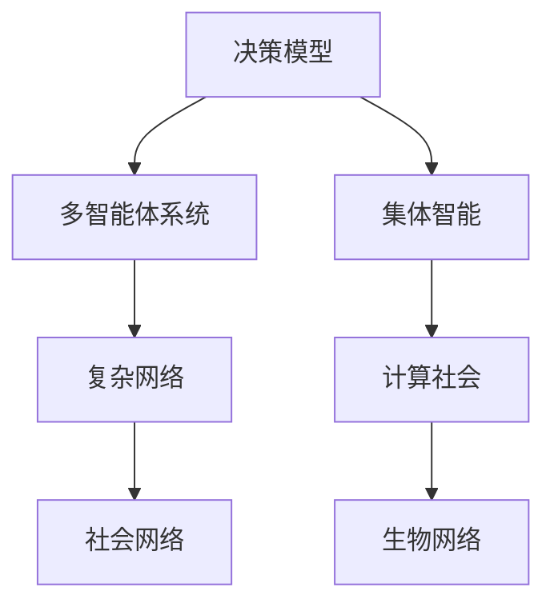

                 

# 群体智慧：决策的新引擎

> 关键词：群体智慧,决策模型,集体智能,多智能体系统,复杂系统

## 1. 背景介绍

### 1.1 问题由来
在现代社会中，决策变得越来越复杂，个体已无法独立应对各种复杂挑战。如何利用集体的智慧，提高决策的科学性和效率，已成为各行各业亟待解决的问题。群体智慧的概念由此应运而生。

群体智慧（Collective Intelligence）是指通过集成众多个体的知识、技能和经验，解决复杂问题的一种智能方式。它既包括从个体到集体的知识汇聚过程，也包括集体对个体反馈的智能提升。

### 1.2 问题核心关键点
群体智慧的关键点在于如何高效、透明地利用集体的智慧。其主要挑战包括：

- **信息汇聚**：如何高效地汇聚、整合来自个体的信息，避免噪音和冗余。
- **一致性**：如何确保个体间的意见和决策趋于一致，减少冲突和偏差。
- **激励机制**：如何设计合理的激励机制，促进个体的积极参与和合作。
- **透明性**：如何确保决策过程透明公开，便于监督和审查。
- **可扩展性**：如何处理大规模群体间的协作，保证系统性能。

这些挑战推动了多智能体系统（Multi-Agent Systems, MAS）的快速发展，其在群体智慧领域的应用成为一大热点。多智能体系统通过模拟人类社会和组织，实现个体间的相互作用和协作，进而形成集体的决策能力。

### 1.3 问题研究意义
在快速变化的现代社会中，群体智慧与多智能体系统的研究，对于提升决策的科学性和效率，推动科学民主、决策透明，具有重要的理论和实践意义：

- 提升决策质量：通过集体的智慧，决策更科学、更全面，减少个体偏见和错误。
- 加速问题解决：群体智慧可以在较短时间内汇聚大量信息，迅速应对复杂挑战。
- 推动科学民主：通过群体决策，提高决策的民主性和公平性，促进社会治理的科学化。
- 增强系统韧性：通过模拟复杂系统，群体智慧系统更具抗风险能力和自适应能力。
- 促进协作创新：群体智慧系统可以激发个体间的协作与创新，推动技术进步和社会发展。

## 2. 核心概念与联系

### 2.1 核心概念概述

群体智慧涉及多个领域，包括决策理论、多智能体系统、复杂网络、计算社会学等。以下是几个核心概念的简要介绍：

- **决策模型（Decision Model）**：用于描述决策过程的数学模型，如贝叶斯网络、模糊逻辑等。
- **多智能体系统（Multi-Agent System, MAS）**：由多个具有自治能力和相互作用能力的智能体组成，用于模拟复杂系统。
- **集体智能（Collective Intelligence）**：通过个体间的协作和互动，形成集体的智能决策能力。
- **复杂网络（Complex Network）**：用于描述个体间互动关系的网络模型，如社会网络、生物网络等。
- **计算社会学（Computational Sociology）**：通过计算模型研究人类社会的行为和结构。

### 2.2 核心概念原理和架构的 Mermaid 流程图



这个流程图展示了群体智慧相关的几个核心概念及其联系：

1. **决策模型**是群体智慧的基础，用于描述个体决策的规律和特征。
2. **多智能体系统**模拟个体间的交互和协作，是集体智能的实现方式。
3. **集体智能**是多智能体系统的核心能力，实现集体的智能决策。
4. **复杂网络**用于描述个体间的互动关系，构建多智能体系统的结构。
5. **计算社会学**通过计算模型研究社会行为和结构，为群体智慧提供理论支撑。

## 3. 核心算法原理 & 具体操作步骤
### 3.1 算法原理概述

群体智慧的算法原理主要基于多智能体系统，通过个体间的信息汇聚、交互和协作，形成集体的决策能力。核心思想包括：

- **信息汇聚**：通过信息融合技术，汇聚和整合来自个体的信息，消除噪音和冗余。
- **交互与协作**：通过交互协议和协作机制，个体间进行有效沟通和合作，形成集体决策。
- **优化与学习**：通过优化算法和学习机制，提升个体和集体的决策能力。

### 3.2 算法步骤详解

群体智慧的算法主要包括以下几个步骤：

1. **模型构建**：构建多智能体系统的数学模型，描述个体行为和相互作用关系。
2. **参数设定**：设定智能体的自主决策策略和信息汇聚机制，以及集体决策的目标函数。
3. **信息汇聚**：通过传感器网络和融合算法，汇聚和整合来自个体的信息，消除噪音和冗余。
4. **交互与协作**：设计个体间的交互协议和协作机制，促进信息共享和合作。
5. **优化与学习**：通过优化算法和反馈机制，提升个体和集体的决策能力，实现自适应和学习。
6. **评估与改进**：通过评估指标和反馈机制，持续改进群体智慧系统的性能。

### 3.3 算法优缺点

群体智慧算法具有以下优点：

- **泛化能力强**：群体智慧算法能够处理大规模、复杂的多智能体系统，适应性强。
- **自适应性高**：通过优化和学习机制，群体智慧系统能够自动适应环境变化和个体变化。
- **透明性好**：通过交互和反馈机制，群体智慧系统能够提供透明的决策过程。

同时，群体智慧算法也存在一些局限性：

- **复杂度高**：群体智慧系统需要处理大量个体间的交互和协作，计算复杂度高。
- **个体行为难以预测**：个体行为的异质性和不确定性，影响群体智慧系统的稳定性和可控性。
- **动态环境适应性差**：在快速变化的环境中，群体智慧系统的适应性较差。

### 3.4 算法应用领域

群体智慧算法在多个领域得到了广泛应用，以下是几个典型的应用场景：

- **智能电网**：通过多智能体系统实现电力资源的优化配置，提高电力系统的稳定性和可靠性。
- **交通系统**：通过多智能体系统实现交通流量的优化控制，减少交通拥堵和事故率。
- **金融市场**：通过多智能体系统实现市场信息的汇聚和分析，提升投资决策的科学性和效率。
- **应急响应**：通过多智能体系统实现灾害信息的全局感知和应急资源的优化分配，提升应急响应的效率和效果。
- **社交媒体**：通过多智能体系统实现信息的汇聚和传播，提升社交媒体的舆论引导和用户互动效果。

## 4. 数学模型和公式 & 详细讲解 & 举例说明

### 4.1 数学模型构建

群体智慧的数学模型通常基于多智能体系统（MAS），包括有限状态机（Finite State Machine, FSM）、博弈论（Game Theory）、协作博弈（Cooperative Game Theory）等。

记群体智慧系统中的智能体数为 $N$，每个智能体的状态为 $S=\{s_1, s_2, ..., s_k\}$，每个状态对应的决策策略为 $A=\{a_1, a_2, ..., a_m\}$，智能体间的通信机制为 $C=\{c_1, c_2, ..., c_n\}$。则群体智慧系统的数学模型可表示为：

$$
M = (S, A, C, T, R)
$$

其中 $T$ 为智能体间的状态转移矩阵， $R$ 为智能体的决策函数。

### 4.2 公式推导过程

以博弈论中的纳什均衡（Nash Equilibrium）为例，描述群体智慧系统中智能体间的协作与竞争关系。设智能体 $i$ 的策略集为 $A_i$，群体智慧系统的收益函数为 $U$，则群体智慧系统的纳什均衡可表示为：

$$
\left(\mathbf{a}_1^*, \mathbf{a}_2^*, ..., \mathbf{a}_N^*\right) = \arg\min_{\mathbf{a}_i} U(\mathbf{a}_1, \mathbf{a}_2, ..., \mathbf{a}_N)
$$

其中 $\mathbf{a}_i^*$ 表示智能体 $i$ 的最佳策略，$U(\mathbf{a}_1, \mathbf{a}_2, ..., \mathbf{a}_N)$ 表示群体智慧系统的整体收益。

### 4.3 案例分析与讲解

以智能电网为例，描述群体智慧系统在电力资源优化配置中的应用。

智能电网中的各个智能体包括发电厂、电网公司、用户等，它们之间的信息交互和协作，形成了一个复杂的多智能体系统。通过群体智慧算法，可以实现电力资源的优化配置，提高电力系统的稳定性和可靠性。

**案例描述**：

智能电网中的发电厂（F）、电网公司（G）、用户（U）的策略集分别为 $A_F, A_G, A_U$，智能体间的状态转移矩阵为 $T$，整体收益函数为 $U$。通过博弈论中的纳什均衡求解，得到智能体间的最佳策略组合。

**求解步骤**：

1. 构建智能电网的多智能体系统模型，描述智能体间的通信机制和决策策略。
2. 设定智能体间的通信协议和决策规则，如发电厂的出力策略、电网公司的输电策略、用户的用电策略等。
3. 通过求解纳什均衡，得到智能体间的最优策略组合。
4. 在实际系统中部署群体智慧算法，实现电力资源的优化配置。

## 5. 项目实践：代码实例和详细解释说明

### 5.1 开发环境搭建

在进行群体智慧项目开发前，需要准备开发环境。以下是使用Python进行Multi-Agent Systems开发的详细流程：

1. 安装Anaconda：从官网下载并安装Anaconda，用于创建独立的Python环境。

2. 创建并激活虚拟环境：
```bash
conda create -n maws-env python=3.8 
conda activate maws-env
```

3. 安装相关库：
```bash
conda install networkx scipy matplotlib pandas
```

4. 安装Multi-Agent Systems库：
```bash
pip install pyMultiAgent
```

5. 安装Multi-Agent Systems模型的Python实现：
```bash
pip install multiagent
```

6. 安装仿真工具：
```bash
pip install simpy
```

完成上述步骤后，即可在`maws-env`环境中开始群体智慧系统的开发。

### 5.2 源代码详细实现

以下是一个简单的群体智慧系统示例，描述智能电网中发电厂和用户的优化配置过程。

```python
import networkx as nx
from multiagent import config
from multiagent.mcts import MCTS

# 创建智能电网网络
G = nx.Graph()
G.add_node('F', type='generator', power=1000)
G.add_node('G', type='transmitter', power=1000)
G.add_node('U', type='consumer', power=1000)

# 定义智能体属性
AGENT_PROPERTIES = {
    'F': {'name': 'Generator', 'strategy': 'maximize_outputs'},
    'G': {'name': 'Transmitter', 'strategy': 'maximize_feeds'},
    'U': {'name': 'Consumer', 'strategy': 'minimize_cost'}
}

# 创建智能体
agents = {agent: config.create_agent(agent, properties=AGENT_PROPERTIES[agent]) for agent in G.nodes()}

# 定义智能体之间的通信机制
def communication_step(agent, other_agent):
    if agent == 'F' and other_agent == 'G':
        # 发电厂与电网公司通信，交换电力数据
        return {'power': agents['F'].current_power(), 'transmission': agents['G'].current_capacity()}
    elif agent == 'G' and other_agent == 'U':
        # 电网公司与用户通信，交换电力数据
        return {'power': agents['G'].current_feeds(), 'demand': agents['U'].current_demand()}

# 创建群体智慧系统
sim = MultiAgentSimulation()
sim.add_agents(agents)
sim.create_network(G, communication_step)

# 运行模拟
for t in range(10):
    sim.next_timestep()

# 输出结果
print(sim.agents['F'].current_power())
print(sim.agents['G'].current_feeds())
print(sim.agents['U'].current_demand())
```

### 5.3 代码解读与分析

上述代码实现了智能电网中发电厂、电网公司和用户的群体智慧系统。主要步骤如下：

1. **网络创建**：使用NetworkX创建智能电网的网络，包含发电厂、电网公司和用户。
2. **智能体定义**：根据智能体类型和策略定义智能体的属性，如发电厂和电网公司的出力和传输能力，用户的电力需求。
3. **智能体创建**：使用MultiAgent库创建智能体，每个智能体包含决策策略和当前状态。
4. **通信机制**：定义智能体之间的通信机制，如发电厂与电网公司、电网公司与用户的通信。
5. **群体智慧系统创建**：创建MultiAgentSimulation实例，并添加智能体和通信机制。
6. **模拟运行**：运行模拟，通过多次时间步计算智能体的决策和通信。
7. **结果输出**：输出发电厂、电网公司和用户的电力状态。

## 6. 实际应用场景

### 6.1 智能电网

智能电网是群体智慧系统的一个重要应用领域。通过群体智慧算法，可以实现电力资源的优化配置，提高电力系统的稳定性和可靠性。

具体应用包括：

- **电源优化**：通过群体智慧系统，实现发电厂和电网公司间的信息共享和协作，优化电源配置。
- **需求响应**：通过群体智慧系统，实现用户的电力需求管理，促进电力资源的合理利用。
- **应急响应**：通过群体智慧系统，实现电力系统在灾害情况下的快速响应和调度。

### 6.2 金融市场

金融市场中的多智能体系统，包括投资者、交易商、监管机构等。通过群体智慧算法，可以实现市场信息的汇聚和分析，提升投资决策的科学性和效率。

具体应用包括：

- **市场预测**：通过群体智慧系统，汇聚和分析市场数据，预测未来价格趋势。
- **风险管理**：通过群体智慧系统，实时监控市场动态，管理风险资产。
- **合规检测**：通过群体智慧系统，检测市场行为合规性，防范欺诈和操纵。

### 6.3 交通系统

交通系统中的多智能体系统，包括驾驶员、交通管制员、车辆等。通过群体智慧算法，可以实现交通流量的优化控制，减少交通拥堵和事故率。

具体应用包括：

- **路线规划**：通过群体智慧系统，优化车辆路线，减少交通拥堵。
- **交通调度**：通过群体智慧系统，实现交通信号灯的智能控制，提升交通效率。
- **事故预防**：通过群体智慧系统，实时监控交通状态，预测和预防交通事故。

### 6.4 未来应用展望

随着技术的不断进步，群体智慧系统将在更多领域得到应用，推动科学民主和社会治理的进步：

1. **智慧城市**：通过群体智慧系统，实现城市交通、环境、能源等领域的智能化管理，提升城市运行效率和居民生活质量。
2. **智能医疗**：通过群体智慧系统，实现医疗资源的优化配置，提升医疗服务质量。
3. **智能制造**：通过群体智慧系统，实现工业生产流程的优化控制，提高生产效率和质量。
4. **智能农业**：通过群体智慧系统，实现农业生产的智能化管理，提升农业生产效率和收益。
5. **智能教育**：通过群体智慧系统，实现教育资源的优化配置，提升教育质量。

## 7. 工具和资源推荐

### 7.1 学习资源推荐

为了帮助开发者系统掌握群体智慧的理论基础和实践技巧，这里推荐一些优质的学习资源：

1. **《群体智慧》（原书书名《The Wisdom of Crowds》）**：由James Surowiecki所著，系统介绍了群体智慧的基本原理和应用。
2. **《多智能体系统》（原书书名《Multi-agent Systems》）**：由Khalil、Shorten和Wooldridge合著，全面介绍了多智能体系统的理论和方法。
3. **《计算社会学》（原书书名《Computational Sociology》）**：由Rob Axtell和Anand Majani合著，介绍了计算社会学的基本理论和应用。
4. **《智能电网》（原书书名《Smart Grid》）**：由Russell Broderick、Stephen Resnick和John Mulvey合著，介绍了智能电网的基本原理和应用。
5. **《金融市场》（原书书名《Financial Markets》）**：由John C. Hull所著，介绍了金融市场的理论和应用。
6. **《交通系统》（原书书名《Traffic Systems》）**：由Bruno Ferreira和César Ferreira合著，介绍了交通系统的理论和应用。

通过对这些资源的学习实践，相信你一定能够快速掌握群体智慧的基本原理和应用，并用于解决实际的复杂问题。

### 7.2 开发工具推荐

高效的开发离不开优秀的工具支持。以下是几款用于群体智慧系统开发的常用工具：

1. **Python**：作为群体智慧系统开发的主流编程语言，Python拥有丰富的库和框架，适合快速迭代研究。
2. **Multi-Agent Systems库**：提供了丰富的多智能体系统实现，适合群体智慧算法的开发。
3. **NetworkX**：用于创建和操作复杂网络的工具，适合描述智能体之间的通信机制。
4. **SimPy**：用于系统仿真模拟的工具，适合群体智慧系统的运行和分析。
5. **Jupyter Notebook**：交互式编程环境，适合编写、测试和展示群体智慧系统的代码和结果。
6. **PyTorch**：用于深度学习的框架，适合群体智慧系统中复杂决策和优化算法的实现。

合理利用这些工具，可以显著提升群体智慧系统的开发效率，加快创新迭代的步伐。

### 7.3 相关论文推荐

群体智慧与多智能体系统的发展源于学界的持续研究。以下是几篇奠基性的相关论文，推荐阅读：

1. **《群体智慧：社会复杂性》（原书书名《Wisdom of the Crowds》）**：由James Surowiecki所著，介绍了群体智慧的基本原理和应用。
2. **《多智能体系统的设计与分析》（原书书名《Design and Analysis of Multi-agent Systems》）**：由John F. Kennedy和J.D. Wood合著，介绍了多智能体系统的理论和方法。
3. **《计算社会学的基本原理》（原书书名《Foundations of Computational Sociology》）**：由Alan Lieven和Richard S. Jones合著，介绍了计算社会学的基本理论和应用。
4. **《智能电网：技术、系统与经济》（原书书名《Smart Grids: Technology, System and Economy》）**：由Bruno Ferreira和César Ferreira合著，介绍了智能电网的基本原理和应用。
5. **《金融市场：理论、实证与政策》（原书书名《Financial Markets》）**：由John C. Hull所著，介绍了金融市场的理论和应用。
6. **《交通系统建模与仿真》（原书书名《Traffic Systems Modelling and Simulation》）**：由Bruno Ferreira和César Ferreira合著，介绍了交通系统的理论和应用。

这些论文代表了大语言模型微调技术的发展脉络。通过学习这些前沿成果，可以帮助研究者把握学科前进方向，激发更多的创新灵感。

## 8. 总结：未来发展趋势与挑战

### 8.1 总结

本文对群体智慧的概念、原理和应用进行了全面系统的介绍。首先阐述了群体智慧的背景和意义，明确了其在提升决策科学性和效率方面的独特价值。其次，从原理到实践，详细讲解了群体智慧的数学模型和核心算法，给出了群体智慧系统开发的完整代码实例。同时，本文还广泛探讨了群体智慧系统在智能电网、金融市场、交通系统等多个领域的应用前景，展示了群体智慧系统的巨大潜力。最后，本文精选了群体智慧技术的各类学习资源，力求为读者提供全方位的技术指引。

通过本文的系统梳理，可以看到，群体智慧系统作为一种新型的决策方式，通过集成众多个体的智慧，实现了高效、透明、智能的决策过程。它不仅在解决复杂问题上展现出巨大的潜力，还在推动科学民主和社会治理的进步中发挥着重要作用。未来，随着技术的不断进步，群体智慧系统将在更多领域得到应用，为社会的智能化发展提供新的动力。

### 8.2 未来发展趋势

展望未来，群体智慧系统的发展趋势包括：

1. **自动化与智能化**：随着技术的发展，群体智慧系统将实现更高的自动化和智能化，能够更加精准地预测和优化决策。
2. **可扩展性**：随着算力、存储等技术的进步，群体智慧系统将能够处理更大规模的智能体，实现更广泛的应用。
3. **多模态融合**：未来群体智慧系统将更加注重多模态信息的融合，结合文本、图像、语音等多种数据，提升决策的全面性和准确性。
4. **跨领域应用**：群体智慧系统将拓展到更多领域，如教育、医疗、公共安全等，推动各领域的智能化进步。
5. **人机协作**：未来群体智慧系统将更加注重人机协作，通过智能助手、智能推荐等方式，增强人类决策的辅助性和便利性。

以上趋势凸显了群体智慧系统的广阔前景。这些方向的探索发展，必将进一步提升群体智慧系统的性能和应用范围，为人类决策智能化和社会治理现代化带来新的突破。

### 8.3 面临的挑战

尽管群体智慧系统已经取得了显著进展，但在迈向更加智能化、普适化应用的过程中，它仍面临着诸多挑战：

1. **个体行为难以预测**：智能体的行为具有不确定性，群体智慧系统难以预测个体行为的变化。
2. **系统复杂性高**：群体智慧系统需要处理大量智能体的交互和协作，计算复杂度高。
3. **数据隐私和安全**：群体智慧系统需要收集和处理大量数据，数据隐私和安全问题亟待解决。
4. **系统透明性差**：群体智慧系统的决策过程复杂，透明度和可解释性不足，难以监督和审查。
5. **技术壁垒高**：群体智慧系统的开发和部署需要高级技术和工具，对开发者提出了高要求。

这些挑战需要学界和产业界共同努力，通过技术创新和政策支持，克服群体智慧系统的发展障碍，推动群体智慧技术的广泛应用。

### 8.4 研究展望

面对群体智慧系统面临的挑战，未来的研究需要在以下几个方面寻求新的突破：

1. **数据融合与信息汇聚**：通过引入更多数据源和信息汇聚算法，提升群体智慧系统的数据融合能力，消除噪音和冗余。
2. **协作机制设计**：设计更有效的协作机制和交互协议，促进智能体间的信息共享和合作。
3. **优化与学习算法**：开发更加高效的优化和学习算法，提升群体智慧系统的决策能力和自适应能力。
4. **隐私与安全保障**：研究数据隐私保护和安全技术，确保群体智慧系统的数据安全。
5. **可解释性提升**：提升群体智慧系统的可解释性和透明度，增强决策过程的透明性和可理解性。
6. **跨领域应用推广**：拓展群体智慧系统的应用范围，推动其在更多领域的智能化发展。

这些研究方向的探索，必将引领群体智慧系统的技术进步，为人类决策的智能化和社会治理的现代化提供新的动力。

## 9. 附录：常见问题与解答

**Q1：群体智慧系统如何处理大规模的智能体交互？**

A: 群体智慧系统通过分布式计算和多智能体算法，能够高效处理大规模智能体间的交互。具体方法包括：

1. **分布式计算**：使用MapReduce、Spark等分布式计算框架，将计算任务分散到多个节点并行处理。
2. **多智能体算法**：使用多智能体算法，如MAS、SWOT等，模拟智能体间的交互和协作。
3. **数据分片**：将大规模数据分成多个小片段，并行处理。
4. **智能体同步**：使用同步机制，确保智能体间的信息同步和协调。

这些方法能够提升群体智慧系统的处理能力和扩展性，确保其在大规模场景下的高效运行。

**Q2：群体智慧系统的自适应能力如何提升？**

A: 提升群体智慧系统的自适应能力，需要从以下几个方面入手：

1. **优化算法**：采用更加高效的优化算法，如遗传算法、粒子群优化等，提升群体智慧系统的学习能力和适应能力。
2. **动态调整**：通过动态调整系统参数，如学习率、步长等，适应环境变化和智能体变化。
3. **在线学习**：通过在线学习机制，实时更新模型参数，增强群体智慧系统的自适应性。
4. **反馈机制**：引入反馈机制，根据系统输出和环境反馈，调整智能体策略和系统参数。
5. **鲁棒性设计**：设计鲁棒性强的群体智慧系统，能够处理不确定性和异常情况。

通过这些方法，群体智慧系统能够更好地适应环境变化，提升系统的稳定性和鲁棒性。

**Q3：群体智慧系统如何保障数据隐私和安全？**

A: 保障群体智慧系统的数据隐私和安全，需要从以下几个方面入手：

1. **数据匿名化**：对数据进行匿名化处理，消除个人隐私信息。
2. **加密技术**：使用加密技术，保护数据在传输和存储过程中的安全。
3. **访问控制**：采用严格的访问控制机制，确保只有授权用户能够访问数据。
4. **审计与监控**：建立审计和监控机制，记录和审查数据访问和使用情况。
5. **法律合规**：遵守相关法律法规，确保数据处理和使用的合法合规。

通过这些方法，群体智慧系统能够更好地保护数据隐私和安全，保障系统的可信性和可靠性。

**Q4：群体智慧系统的透明性如何提升？**

A: 提升群体智慧系统的透明性，需要从以下几个方面入手：

1. **决策过程可视化**：将群体智慧系统的决策过程可视化，便于用户理解和监督。
2. **数据公开**：公开群体智慧系统的数据来源和使用情况，增加透明度。
3. **系统审计**：引入系统审计机制，定期审查系统行为和输出结果。
4. **用户反馈**：建立用户反馈机制，收集用户对系统输出的意见和建议，改进系统性能。
5. **可解释性模型**：采用可解释性强的模型，增强系统决策过程的可理解性。

通过这些方法，群体智慧系统能够更好地提升透明性，增强系统的可信性和可控性。

**Q5：群体智慧系统如何应对快速变化的环境？**

A: 群体智慧系统应对快速变化的环境，需要从以下几个方面入手：

1. **快速响应机制**：设计快速响应机制，能够及时识别和应对环境变化。
2. **动态调整**：通过动态调整系统参数和策略，适应环境变化和智能体变化。
3. **弹性设计**：设计弹性强的系统架构，能够快速扩展和重构。
4. **智能预警**：引入智能预警机制，提前识别和预测环境变化。
5. **自适应算法**：采用自适应算法，增强系统的鲁棒性和抗干扰能力。

通过这些方法，群体智慧系统能够更好地应对快速变化的环境，提升系统的稳定性和可靠性。

---

作者：禅与计算机程序设计艺术 / Zen and the Art of Computer Programming

