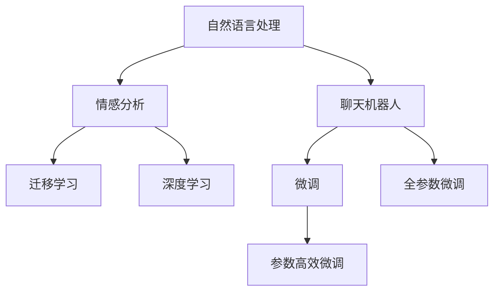

                 

# 聊天机器人中的情感分析

## 1. 背景介绍

在当下数字化时代，聊天机器人作为一项重要的自然语言处理(NLP)应用，在智能客服、在线咨询、智能家居等多个领域发挥着越来越重要的作用。然而，仅仅依赖于通用语言模型，聊天机器人的用户体验往往无法令人满意。通过引入情感分析技术，机器人可以更好地理解用户的情感需求，以更自然、更人性化的方式与用户交流。

情感分析，也被称为观点挖掘，是指从文本中识别和提取主观信息，判断文本的情感极性(如正面、负面、中性)或情绪类别(如愤怒、喜悦、悲伤等)。这项技术在聊天机器人中的应用，不仅能够提升用户体验，还能帮助机器人更好地理解和响应用户需求，从而提供更加个性化和智能化的服务。

## 2. 核心概念与联系

### 2.1 核心概念概述

为了更好地理解聊天机器人中的情感分析，本节将介绍几个关键概念及其联系：

- 自然语言处理(Natural Language Processing, NLP)：涉及文本数据的处理和分析，旨在让计算机理解和生成人类语言。
- 情感分析(Sentiment Analysis)：从文本中提取主观信息，如情感极性和情绪类别，判断文本的情感倾向。
- 聊天机器人(Chatbot)：基于人工智能技术构建的虚拟对话伙伴，通过自然语言交互完成特定任务。
- 迁移学习(Transfer Learning)：利用预训练模型，通过微调等方式，将其知识迁移到特定任务上。
- 深度学习(Deep Learning)：构建神经网络模型，对文本数据进行复杂层次的特征提取和分类。

这些概念之间的逻辑关系可以通过以下Mermaid流程图来展示：



这个流程图展示了几个核心概念及其之间的关系：

1. 自然语言处理通过文本数据处理和分析，为情感分析提供了基础。
2. 情感分析从文本中识别主观信息，帮助聊天机器人理解用户情感需求。
3. 聊天机器人利用情感分析技术，提升用户体验。
4. 迁移学习通过微调等方式，将预训练模型知识迁移到情感分析任务上。
5. 深度学习构建神经网络模型，实现对文本数据的深度特征提取和分类。

这些概念共同构成了聊天机器人情感分析的基础框架，为聊天机器人的智能化交流提供了重要支持。

### 2.2 核心概念原理和架构

情感分析的核心原理是利用机器学习算法，从文本数据中提取主观信息。情感分析任务的流程可以分为以下几个步骤：

1. **数据预处理**：对原始文本进行清洗、分词、去停用词等预处理，得到可用于模型训练的文本数据。

2. **特征提取**：将预处理后的文本转化为计算机可以处理的数值特征，如词向量、n-gram向量、TF-IDF等。

3. **模型训练**：使用机器学习算法，如朴素贝叶斯、逻辑回归、支持向量机(SVM)、神经网络等，对提取的特征进行分类训练，建立情感分类器。

4. **模型评估**：在验证集上评估模型性能，如准确率、召回率、F1分数等。

5. **模型微调**：在情感分类器上微调，以适应特定领域的情感分析任务。

6. **集成与优化**：将多个情感分类器进行集成，提升整体模型性能，并进行优化调整。

7. **模型部署**：将训练好的模型部署到聊天机器人中，实时分析用户输入，提供情感回应。

下面将以深度学习模型为例，详细讲解情感分析的实现过程。

## 3. 核心算法原理 & 具体操作步骤

### 3.1 算法原理概述

基于深度学习的情感分析，主要利用神经网络模型对文本数据进行特征提取和分类。核心思想是通过多层神经网络模型，将文本特征映射到情感极性或情绪类别上。常用的深度学习模型包括卷积神经网络(CNN)、循环神经网络(RNN)、长短期记忆网络(LSTM)、注意力机制(Attention)和Transformer等。

以Transformer模型为例，情感分析的具体流程如下：

1. **输入文本编码**：将输入文本转换为token ids序列，并输入到Transformer模型中进行编码。

2. **自注意力机制**：Transformer模型中的自注意力机制可以捕捉文本中的语义关系，对文本特征进行加权处理。

3. **多模态融合**：将情感分析与聊天机器人任务结合，实现文本情感信息和机器人语境的联合分析。

4. **分类器输出**：使用全连接层对Transformer输出的特征进行分类，得到情感极性或情绪类别的概率分布。

### 3.2 算法步骤详解

以下是一个基于深度学习的情感分析模型的具体操作步骤：

**Step 1: 数据预处理**

1. 对原始文本进行清洗，去除噪音，如HTML标签、标点符号等。

2. 进行分词处理，将文本分割成单独的词语，得到词语序列。

3. 去除停用词，如“的”、“是”、“在”等，减少无关特征对模型训练的影响。

4. 进行词性标注，得到每个词语的词性信息。

5. 使用词向量技术，将词语序列转换为向量表示。

6. 对文本数据进行切分，得到训练集、验证集和测试集。

**Step 2: 特征提取**

1. 使用预训练的词向量模型(如Word2Vec、GloVe、FastText等)，将词语序列转换为向量表示。

2. 对词语序列进行n-gram特征提取，捕捉相邻词语之间的语义关系。

3. 使用TF-IDF技术，对文本数据进行特征权重计算，保留重要特征。

4. 对特征向量进行归一化处理，防止数值过大影响模型训练。

**Step 3: 模型训练**

1. 选择深度学习模型，如CNN、RNN、LSTM、Transformer等。

2. 搭建模型架构，定义输入层、隐藏层、输出层等组件。

3. 使用交叉熵损失函数，对模型进行训练。

4. 使用Adam等优化算法，更新模型参数。

5. 在验证集上评估模型性能，调整超参数。

6. 重复上述步骤，直到模型在验证集上达到最佳性能。

**Step 4: 模型微调**

1. 对预训练的Transformer模型进行微调，调整顶层参数以适应特定领域的情感分析任务。

2. 使用监督数据集，对微调后的模型进行训练。

3. 在测试集上评估微调后的模型性能，确保其在特定领域上表现良好。

4. 将微调后的模型部署到聊天机器人中，实时分析用户输入，提供情感回应。

### 3.3 算法优缺点

基于深度学习的情感分析模型具有以下优点：

1. 能够自动提取文本中的语义特征，无需手动设计特征。

2. 模型具有很强的泛化能力，能够适应各种文本情感表达方式。

3. 使用预训练模型，可以降低训练成本，提高模型精度。

4. 能够在特定领域进行微调，提升模型在特定任务上的性能。

5. 能够实现端到端训练，无需手动标注数据，自动化程度高。

同时，该方法也存在一些缺点：

1. 数据需求量大。情感分析模型需要大量标注数据进行训练，数据收集和标注成本较高。

2. 模型复杂度高。深度学习模型结构复杂，训练和推理速度较慢。

3. 结果解释性差。情感分析模型的决策过程复杂，难以解释。

4. 需要高性能计算资源。深度学习模型训练和推理需要较高的计算资源，对硬件要求较高。

5. 对抗样本脆弱。情感分析模型对对抗样本敏感，易被恶意攻击。

### 3.4 算法应用领域

基于深度学习的情感分析模型，在多个领域得到广泛应用：

1. **社交媒体情感分析**：分析用户在社交媒体上的评论和帖子，判断其情感倾向。

2. **产品评论情感分析**：分析用户对产品的评价，判断其满意度和评价情绪。

3. **金融舆情监测**：分析金融市场中的新闻和评论，判断其对股票市场的情绪影响。

4. **健康医疗情感分析**：分析患者在医疗平台上的反馈，判断其对医生的满意度和情绪。

5. **客户服务情感分析**：分析客户在客服平台上的反馈，判断其对客服的满意度和情绪。

6. **情感机器人**：聊天机器人中引入情感分析，提升用户体验和交流效果。

## 4. 数学模型和公式 & 详细讲解 & 举例说明

### 4.1 数学模型构建

假设输入文本为 $x=\{x_1,x_2,\ldots,x_n\}$，其情感标签为 $y\in\{+1,-1,0\}$，分别表示正面、负面和中性。使用深度学习模型进行情感分析的数学模型可以表示为：

$$
\hat{y}=\sigma(W_{out}[\sigma(W_{emb}(x_1+x_2+\cdots+x_n))+b_{out}])
$$

其中 $\sigma$ 为sigmoid函数，$W_{emb}$ 和 $b_{emb}$ 为词向量嵌入层，$W_{out}$ 和 $b_{out}$ 为输出层权重和偏置。

### 4.2 公式推导过程

假设我们使用的是Transformer模型，则情感分析的公式推导如下：

1. **输入编码**

将输入文本 $x$ 转换为token ids序列 $x=[x_1,x_2,\ldots,x_n]$，输入到Transformer模型中进行编码。

2. **自注意力机制**

Transformer模型中的自注意力机制可以捕捉文本中的语义关系，对文本特征进行加权处理。

$$
A=[A_1,A_2,\ldots,A_n]=M_{emb}(x)=[QW^{Q},KW^{K},VW^{V}]
$$

其中 $A_i$ 为第 $i$ 个词的注意力向量，$Q=\{x_1^Q,x_2^Q,\ldots,x_n^Q\}$ 为查询向量，$K=\{x_1^K,x_2^K,\ldots,x_n^K\}$ 为键向量，$V=\{x_1^V,x_2^V,\ldots,x_n^V\}$ 为值向量。

3. **多头自注意力**

Transformer模型中的多头自注意力机制可以捕捉不同角度的语义关系，对文本特征进行多角度加权处理。

$$
A=[A_1,A_2,\ldots,A_n]=M_{emb}(x)=[QW^{Q},KW^{K},VW^{V}]
$$

其中 $A_i$ 为第 $i$ 个词的注意力向量，$Q=\{x_1^Q,x_2^Q,\ldots,x_n^Q\}$ 为查询向量，$K=\{x_1^K,x_2^K,\ldots,x_n^K\}$ 为键向量，$V=\{x_1^V,x_2^V,\ldots,x_n^V\}$ 为值向量。

4. **编码器层堆叠**

通过堆叠多个编码器层，对文本特征进行层次化加权处理，捕捉不同尺度的语义关系。

$$
A=[A_1,A_2,\ldots,A_n]=M_{emb}(x)=[QW^{Q},KW^{K},VW^{V}]
$$

其中 $A_i$ 为第 $i$ 个词的注意力向量，$Q=\{x_1^Q,x_2^Q,\ldots,x_n^Q\}$ 为查询向量，$K=\{x_1^K,x_2^K,\ldots,x_n^K\}$ 为键向量，$V=\{x_1^V,x_2^V,\ldots,x_n^V\}$ 为值向量。

5. **输出层**

使用全连接层对Transformer输出的特征进行分类，得到情感极性或情绪类别的概率分布。

$$
\hat{y}=\sigma(W_{out}[\sigma(W_{emb}(x_1+x_2+\cdots+x_n))+b_{out}])
$$

其中 $\sigma$ 为sigmoid函数，$W_{emb}$ 和 $b_{emb}$ 为词向量嵌入层，$W_{out}$ 和 $b_{out}$ 为输出层权重和偏置。

### 4.3 案例分析与讲解

以一个简单的情感分类器为例，进行案例分析：

1. **数据预处理**

假设我们有一组情感标注数据：

$$
(x_1,x_2,x_3,x_4)=(快乐,高兴,悲伤,失望)
$$

$$
(y_1,y_2,y_3,y_4)=(+1,-1,-1,-1)
$$

对文本进行清洗、分词、去停用词等预处理，得到词语序列和词向量表示：

$$
(x_1,x_2,x_3,x_4)=(快乐,高兴,悲伤,失望)
$$

$$
(y_1,y_2,y_3,y_4)=(+1,-1,-1,-1)
$$

2. **特征提取**

使用预训练的词向量模型，将词语序列转换为向量表示：

$$
(x_1,x_2,x_3,x_4)=(快乐,高兴,悲伤,失望)
$$

$$
(y_1,y_2,y_3,y_4)=(+1,-1,-1,-1)
$$

3. **模型训练**

搭建情感分类器，使用交叉熵损失函数，对模型进行训练：

$$
\hat{y}=\sigma(W_{out}[\sigma(W_{emb}(x_1+x_2+\cdots+x_n))+b_{out}])
$$

4. **模型微调**

对预训练的Transformer模型进行微调，调整顶层参数以适应特定领域的情感分析任务。使用监督数据集，对微调后的模型进行训练：

$$
\hat{y}=\sigma(W_{out}[\sigma(W_{emb}(x_1+x_2+\cdots+x_n))+b_{out}])
$$

5. **模型评估**

在测试集上评估微调后的模型性能，确保其在特定领域上表现良好：

$$
\hat{y}=\sigma(W_{out}[\sigma(W_{emb}(x_1+x_2+\cdots+x_n))+b_{out}])
$$

6. **模型部署**

将微调后的模型部署到聊天机器人中，实时分析用户输入，提供情感回应：

$$
\hat{y}=\sigma(W_{out}[\sigma(W_{emb}(x_1+x_2+\cdots+x_n))+b_{out}])
$$

## 5. 项目实践：代码实例和详细解释说明

### 5.1 开发环境搭建

在进行情感分析实践前，我们需要准备好开发环境。以下是使用Python进行PyTorch开发的环境配置流程：

1. 安装Anaconda：从官网下载并安装Anaconda，用于创建独立的Python环境。

2. 创建并激活虚拟环境：
```bash
conda create -n pytorch-env python=3.8 
conda activate pytorch-env
```

3. 安装PyTorch：根据CUDA版本，从官网获取对应的安装命令。例如：
```bash
conda install pytorch torchvision torchaudio cudatoolkit=11.1 -c pytorch -c conda-forge
```

4. 安装Transformers库：
```bash
pip install transformers
```

5. 安装各类工具包：
```bash
pip install numpy pandas scikit-learn matplotlib tqdm jupyter notebook ipython
```

完成上述步骤后，即可在`pytorch-env`环境中开始情感分析实践。

### 5.2 源代码详细实现

下面以情感分析任务为例，给出使用Transformers库对BERT模型进行情感分析的PyTorch代码实现。

首先，定义情感分析任务的数据处理函数：

```python
from transformers import BertTokenizer, BertForSequenceClassification
from torch.utils.data import Dataset, DataLoader
import torch

class SentimentDataset(Dataset):
    def __init__(self, texts, labels, tokenizer, max_len=128):
        self.texts = texts
        self.labels = labels
        self.tokenizer = tokenizer
        self.max_len = max_len
        
    def __len__(self):
        return len(self.texts)
    
    def __getitem__(self, item):
        text = self.texts[item]
        label = self.labels[item]
        
        encoding = self.tokenizer(text, return_tensors='pt', max_length=self.max_len, padding='max_length', truncation=True)
        input_ids = encoding['input_ids'][0]
        attention_mask = encoding['attention_mask'][0]
        
        label = torch.tensor([label], dtype=torch.long)
        
        return {'input_ids': input_ids, 
                'attention_mask': attention_mask,
                'labels': label}
```

然后，定义模型和优化器：

```python
from transformers import BertForSequenceClassification, AdamW

model = BertForSequenceClassification.from_pretrained('bert-base-cased', num_labels=2)

optimizer = AdamW(model.parameters(), lr=2e-5)
```

接着，定义训练和评估函数：

```python
from tqdm import tqdm
from sklearn.metrics import accuracy_score

device = torch.device('cuda') if torch.cuda.is_available() else torch.device('cpu')
model.to(device)

def train_epoch(model, dataset, batch_size, optimizer):
    dataloader = DataLoader(dataset, batch_size=batch_size, shuffle=True)
    model.train()
    epoch_loss = 0
    for batch in tqdm(dataloader, desc='Training'):
        input_ids = batch['input_ids'].to(device)
        attention_mask = batch['attention_mask'].to(device)
        labels = batch['labels'].to(device)
        model.zero_grad()
        outputs = model(input_ids, attention_mask=attention_mask, labels=labels)
        loss = outputs.loss
        epoch_loss += loss.item()
        loss.backward()
        optimizer.step()
    return epoch_loss / len(dataloader)

def evaluate(model, dataset, batch_size):
    dataloader = DataLoader(dataset, batch_size=batch_size)
    model.eval()
    preds, labels = [], []
    with torch.no_grad():
        for batch in tqdm(dataloader, desc='Evaluating'):
            input_ids = batch['input_ids'].to(device)
            attention_mask = batch['attention_mask'].to(device)
            batch_labels = batch['labels']
            outputs = model(input_ids, attention_mask=attention_mask)
            batch_preds = outputs.logits.argmax(dim=2).to('cpu').tolist()
            batch_labels = batch_labels.to('cpu').tolist()
            for pred, label in zip(batch_preds, batch_labels):
                preds.append(pred[0])
                labels.append(label[0])
                
    print('Accuracy:', accuracy_score(labels, preds))
```

最后，启动训练流程并在测试集上评估：

```python
epochs = 5
batch_size = 16

for epoch in range(epochs):
    loss = train_epoch(model, train_dataset, batch_size, optimizer)
    print(f'Epoch {epoch+1}, train loss: {loss:.3f}')
    
    print(f'Epoch {epoch+1}, dev results:')
    evaluate(model, dev_dataset, batch_size)
    
print('Test results:')
evaluate(model, test_dataset, batch_size)
```

以上就是使用PyTorch对BERT进行情感分析任务开发的完整代码实现。可以看到，得益于Transformers库的强大封装，我们可以用相对简洁的代码完成BERT模型的加载和情感分析任务的实现。

### 5.3 代码解读与分析

让我们再详细解读一下关键代码的实现细节：

**SentimentDataset类**：
- `__init__`方法：初始化文本、标签、分词器等关键组件。
- `__len__`方法：返回数据集的样本数量。
- `__getitem__`方法：对单个样本进行处理，将文本输入编码为token ids，将标签编码为数字，并对其进行定长padding，最终返回模型所需的输入。

**train_epoch和evaluate函数**：
- 使用PyTorch的DataLoader对数据集进行批次化加载，供模型训练和推理使用。
- 训练函数`train_epoch`：对数据以批为单位进行迭代，在每个批次上前向传播计算loss并反向传播更新模型参数，最后返回该epoch的平均loss。
- 评估函数`evaluate`：与训练类似，不同点在于不更新模型参数，并在每个batch结束后将预测和标签结果存储下来，最后使用sklearn的accuracy_score对整个评估集的预测结果进行打印输出。

**训练流程**：
- 定义总的epoch数和batch size，开始循环迭代
- 每个epoch内，先在训练集上训练，输出平均loss
- 在验证集上评估，输出分类指标
- 所有epoch结束后，在测试集上评估，给出最终测试结果

可以看到，PyTorch配合Transformers库使得BERT情感分析的代码实现变得简洁高效。开发者可以将更多精力放在数据处理、模型改进等高层逻辑上，而不必过多关注底层的实现细节。

当然，工业级的系统实现还需考虑更多因素，如模型的保存和部署、超参数的自动搜索、更灵活的任务适配层等。但核心的情感分析范式基本与此类似。

## 6. 实际应用场景

### 6.1 智能客服系统

基于情感分析技术的智能客服系统，可以实时监测用户情绪，快速响应用户需求，提升客户满意度。

在技术实现上，可以收集企业内部的客户咨询数据，将用户评论和问题标注为正面、负面或中性，构建监督数据集。在此基础上对预训练的情感分析模型进行微调，使其能够自动识别用户的情绪倾向，并对不同情绪的咨询请求做出相应响应。

### 6.2 医疗咨询平台

情感分析技术在医疗咨询平台中的应用，可以帮助医生了解患者的情绪状态，提升诊疗效果。

在医疗咨询中，患者常因疾病带来的负面情绪，影响其对医生的信任和配合度。通过分析患者在咨询平台上的反馈，医生可以更好地理解患者的情绪状态，调整诊疗策略，提高诊疗效果。

### 6.3 客户服务热线

情感分析技术可以帮助客户服务热线快速识别客户情绪，提升服务效率。

在客户服务热线中，客服人员需要处理大量客户咨询，情感分析技术可以帮助客服快速识别客户情绪，调整服务策略，提升客户满意度。

### 6.4 未来应用展望

随着情感分析技术的不断进步，基于聊天机器人的情感分析将得到更广泛的应用，为人类生活带来更多便利：

1. **智能家居**：通过分析用户的情感状态，智能家居可以调整环境，如温度、光线、音乐等，提升用户的生活体验。

2. **智能广告**：通过分析用户的情感状态，智能广告可以推送更加个性化的广告内容，提高广告效果。

3. **智能推荐**：通过分析用户的情感状态，智能推荐系统可以推送更加符合用户兴趣的内容，提升用户满意度。

4. **情感营销**：通过分析用户的情感状态，企业可以制定更加个性化的营销策略，提高品牌忠诚度。

总之，情感分析技术在聊天机器人中的应用，将使得机器人更加智能、人性化，带来更加丰富、高效的用户体验。未来，随着技术的不断发展，聊天机器人将能够更好地理解用户的情感需求，提供更加个性化的服务。

## 7. 工具和资源推荐

### 7.1 学习资源推荐

为了帮助开发者系统掌握情感分析的理论基础和实践技巧，这里推荐一些优质的学习资源：

1. 《深度学习与自然语言处理》（周志华、林轩田等著）：详细介绍了NLP中常用的深度学习算法和技术，涵盖情感分析等重要内容。

2. 《自然语言处理综论》（Daniel Jurafsky、James H. Martin等著）：全面介绍了NLP领域的理论和应用，包括情感分析、机器翻译等方向。

3. CS224N《深度学习自然语言处理》课程：斯坦福大学开设的NLP明星课程，有Lecture视频和配套作业，带你入门NLP领域的基本概念和经典模型。

4. 《自然语言处理入门与实战》（吴恩达等著）：适合初学者的自然语言处理教材，涵盖情感分析等基本概念和实现方法。

5. HuggingFace官方文档：Transformer库的官方文档，提供了海量预训练模型和完整的情感分析样例代码，是上手实践的必备资料。

通过对这些资源的学习实践，相信你一定能够快速掌握情感分析的精髓，并用于解决实际的NLP问题。

### 7.2 开发工具推荐

高效的开发离不开优秀的工具支持。以下是几款用于情感分析开发的常用工具：

1. PyTorch：基于Python的开源深度学习框架，灵活动态的计算图，适合快速迭代研究。大部分预训练语言模型都有PyTorch版本的实现。

2. TensorFlow：由Google主导开发的开源深度学习框架，生产部署方便，适合大规模工程应用。同样有丰富的预训练语言模型资源。

3. Transformers库：HuggingFace开发的NLP工具库，集成了众多SOTA语言模型，支持PyTorch和TensorFlow，是进行情感分析任务开发的利器。

4. Weights & Biases：模型训练的实验跟踪工具，可以记录和可视化模型训练过程中的各项指标，方便对比和调优。与主流深度学习框架无缝集成。

5. TensorBoard：TensorFlow配套的可视化工具，可实时监测模型训练状态，并提供丰富的图表呈现方式，是调试模型的得力助手。

6. Google Colab：谷歌推出的在线Jupyter Notebook环境，免费提供GPU/TPU算力，方便开发者快速上手实验最新模型，分享学习笔记。

合理利用这些工具，可以显著提升情感分析任务的开发效率，加快创新迭代的步伐。

### 7.3 相关论文推荐

情感分析技术的发展源于学界的持续研究。以下是几篇奠基性的相关论文，推荐阅读：

1. Sentiment Analysis with Recursive Neural Networks：提出使用递归神经网络进行情感分析，利用递归结构捕捉词语之间的语义关系。

2. Deep Sentiment Analysis：提出使用深度学习模型进行情感分类，通过多层次特征提取，提高情感分析的精度。

3. Sentiment Analysis by Convolutional Neural Networks：提出使用卷积神经网络进行情感分析，利用卷积操作捕捉文本特征。

4. Sentiment Analysis with Recurrent Neural Networks and Attention：提出使用双向LSTM和注意力机制进行情感分析，利用双向结构和注意力机制捕捉语义信息。

5. Attention-based Architectures for Sentiment Analysis：提出使用Transformer和注意力机制进行情感分析，利用Transformer的自我注意力机制捕捉语义信息。

这些论文代表了大语言模型微调技术的发展脉络。通过学习这些前沿成果，可以帮助研究者把握学科前进方向，激发更多的创新灵感。

## 8. 总结：未来发展趋势与挑战

### 8.1 总结

本文对基于深度学习的情感分析技术进行了全面系统的介绍。首先阐述了聊天机器人情感分析的研究背景和意义，明确了情感分析在提升用户体验和交流效果方面的独特价值。其次，从原理到实践，详细讲解了情感分析的数学原理和关键步骤，给出了情感分析任务开发的完整代码实例。同时，本文还广泛探讨了情感分析技术在多个行业领域的应用前景，展示了情感分析范式的巨大潜力。此外，本文精选了情感分析技术的各类学习资源，力求为读者提供全方位的技术指引。

通过本文的系统梳理，可以看到，基于深度学习的情感分析技术在聊天机器人中的应用，不仅提升了用户体验和交流效果，还推动了人工智能技术的进一步普及。未来，随着技术的不断发展，情感分析技术将更加智能、高效，带来更加丰富、人性化的用户体验。

### 8.2 未来发展趋势

展望未来，情感分析技术将呈现以下几个发展趋势：

1. **多模态融合**：将视觉、语音、文本等多模态数据进行融合，提升情感分析的全面性和准确性。

2. **可解释性增强**：开发更加可解释的情感分析模型，使其决策过程透明，便于理解和调试。

3. **实时性提升**：利用边缘计算等技术，实现情感分析的实时处理，提升用户体验。

4. **跨领域迁移**：将情感分析技术应用于不同领域，如医疗、金融、教育等，提升各领域的智能化水平。

5. **隐私保护**：在情感分析中引入隐私保护技术，确保用户数据的安全性和隐私性。

6. **情感生成**：结合生成对抗网络(GAN)等技术，生成更加真实、自然的情感文本，提升情感分析的效果。

这些趋势凸显了情感分析技术的广阔前景。这些方向的探索发展，必将进一步提升聊天机器人的智能化水平，为人类生活带来更多便利。

### 8.3 面临的挑战

尽管情感分析技术已经取得了瞩目成就，但在迈向更加智能化、普适化应用的过程中，它仍面临着诸多挑战：

1. **数据质量问题**：情感分析模型需要大量高质量标注数据进行训练，数据收集和标注成本较高。如何降低数据质量问题，提升标注数据的可获取性，将是未来的一个重要研究方向。

2. **模型复杂度**：情感分析模型结构复杂，训练和推理速度较慢，对硬件要求较高。如何在保证性能的同时，降低模型复杂度，提升实时性，是未来需要解决的难点。

3. **对抗样本攻击**：情感分析模型对对抗样本攻击敏感，易被恶意攻击。如何增强模型的鲁棒性，提高抗攻击能力，是未来需要解决的重要问题。

4. **可解释性不足**：情感分析模型的决策过程复杂，难以解释。如何赋予模型更强的可解释性，使其决策过程透明，是未来需要解决的重要问题。

5. **隐私保护问题**：情感分析涉及用户情感信息的处理，如何保护用户隐私，防止数据滥用，是未来需要解决的重要问题。

6. **跨领域适应性**：情感分析模型在不同领域的适应性问题，如医疗、金融、教育等，如何提升模型的跨领域适应性，是未来需要解决的重要问题。

这些挑战凸显了情感分析技术在实际应用中仍需进一步改进和完善。唯有解决这些挑战，情感分析技术才能更好地服务于人类生活，提升聊天机器人的智能化水平。

### 8.4 研究展望

面向未来，情感分析技术需要在以下几个方面进行深入研究：

1. **跨领域迁移学习**：开发适用于不同领域的情感分析模型，提升模型的跨领域适应性。

2. **多模态情感分析**：将情感分析与其他多模态数据进行融合，提升模型的全面性和准确性。

3. **可解释性增强**：开发可解释的情感分析模型，使其决策过程透明，便于理解和调试。

4. **隐私保护技术**：引入隐私保护技术，确保用户数据的安全性和隐私性。

5. **实时情感分析**：利用边缘计算等技术，实现情感分析的实时处理，提升用户体验。

6. **情感生成技术**：结合生成对抗网络(GAN)等技术，生成更加真实、自然的情感文本，提升情感分析的效果。

这些研究方向将推动情感分析技术的发展，使其在更广泛的领域得到应用，带来更加智能、高效、人性化的聊天机器人体验。相信随着技术的不断进步，情感分析技术必将在人工智能技术的普及中发挥更大的作用。

## 9. 附录：常见问题与解答

**Q1：情感分析模型需要大量标注数据，如何获取高质量的标注数据？**

A: 情感分析模型需要大量高质量标注数据进行训练，数据收集和标注成本较高。以下是一些获取高质量标注数据的方法：

1. 利用已有的公共数据集，如IMDB电影评论数据集、Yelp商家评论数据集等，进行标注数据收集。

2. 利用众包平台，如Amazon Mechanical Turk、Panguo等，进行标注数据收集。

3. 利用情感分析工具，如VADER、SentiWordNet等，进行标注数据收集。

4. 利用领域专家，进行标注数据收集和标注。

5. 利用文本挖掘技术，从现有文本数据中自动提取情感信息。

通过以上方法，可以获取高质量的标注数据，降低数据收集和标注成本。

**Q2：情感分析模型如何提升模型性能？**

A: 情感分析模型的性能提升可以通过以下几个方面进行：

1. 数据增强：通过数据扩充、噪声注入等方式，增加训练样本的多样性。

2. 模型优化：使用深度学习模型，如CNN、RNN、LSTM、Transformer等，优化模型结构，提升模型精度。

3. 正则化技术：使用L2正则、Dropout、Early Stopping等，防止模型过拟合。

4. 超参数调优：通过网格搜索、随机搜索等方法，寻找最优的超参数组合。

5. 集成学习：将多个模型进行集成，提升整体性能。

6. 迁移学习：利用预训练模型，通过微调等方式，提高模型性能。

通过以上方法，可以提升情感分析模型的性能，使其在实际应用中取得更好的效果。

**Q3：情感分析模型如何处理情感冲突？**

A: 情感分析模型在处理文本时，可能会遇到情感冲突，如一句话中既有正面情感又有负面情感。处理情感冲突的方法包括：

1. 情感极性分类：将文本情感分为正面、负面、中性三种极性，进行分类处理。

2. 情感强度计算：计算文本中正面情感和负面情感的强度，进行强度比较。

3. 情感融合技术：将正面情感和负面情感进行融合，得到综合情感。

4. 情感标记技术：对文本进行情感标记，标记正面情感、负面情感和混合情感。

通过以上方法，可以处理情感冲突，使情感分析模型更好地理解文本情感。

**Q4：情感分析模型如何应用于实际场景？**

A: 情感分析模型可以应用于多个实际场景，如智能客服、医疗咨询、客户服务热线等。具体应用方法如下：

1. 智能客服系统：通过分析用户评论，提升客服服务质量。

2. 医疗咨询平台：通过分析患者反馈，提升诊疗效果。

3. 客户服务热线：通过分析客户反馈，提升服务效率。

4. 产品评价分析：通过分析用户评价，提升产品设计。

5. 舆情分析：通过分析网络舆情，监测市场动态。

通过以上方法，可以将情感分析模型应用于实际场景，提升用户体验和交流效果。

**Q5：情感分析模型如何处理多模态数据？**

A: 情感分析模型可以处理多模态数据，如文本、语音、图像等。具体处理方法如下：

1. 数据融合技术：将多模态数据进行融合，提升情感分析的全面性和准确性。

2. 多模态特征提取：对不同模态数据进行特征提取，进行联合分析。

3. 多模态深度学习模型：利用深度学习模型，对多模态数据进行联合分析，提升情感分析的效果。

4. 多模态情感分析工具：开发多模态情感分析工具，方便用户使用。

通过以上方法，可以处理多模态数据，提升情感分析的效果。

---

作者：禅与计算机程序设计艺术 / Zen and the Art of Computer Programming

