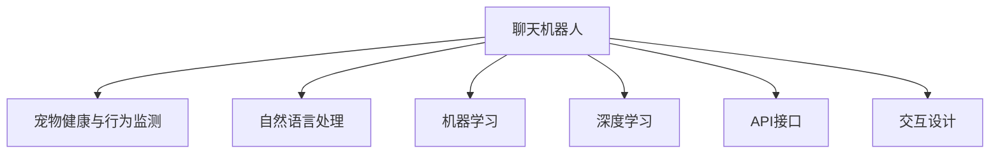

                 

# 聊天机器人宠物行业：宠物健康和行为监测

> 关键词：聊天机器人,宠物健康,行为监测,自然语言处理,机器学习,深度学习,API接口,交互设计

## 1. 背景介绍

### 1.1 问题由来
随着互联网和智能设备的普及，越来越多的家庭开始使用智能家居设备，以满足生活便利和个性化的需求。在宠物照护方面，传统的宠物饲养方式已经无法满足现代人的需求。因此，基于聊天机器人的智能宠物照护设备应运而生，为宠物提供了智能化的护理服务，减轻了主人的负担，提高了宠物的生活质量。

在宠物健康和行为监测方面，传统的方法如手动记录宠物的饮食、运动、睡眠等行为数据，既费时又难以准确。随着深度学习和大数据技术的快速发展，使用聊天机器人进行宠物健康和行为监测成为了一种新的趋势。

### 1.2 问题核心关键点
目前，基于聊天机器人的宠物健康和行为监测主要涉及以下几个核心问题：
1. **宠物信息录入和交互管理**：如何高效地收集和处理宠物的基本信息，并通过聊天机器人进行互动，获取用户的反馈。
2. **健康数据处理与分析**：如何对宠物健康数据进行处理和分析，识别异常行为，提供科学合理的健康建议。
3. **行为监测与行为干预**：如何通过聊天机器人进行宠物行为监测，及时发现问题，并采取相应的干预措施。

本文将围绕以上核心问题，详细介绍基于聊天机器人的宠物健康和行为监测技术及其应用。

## 2. 核心概念与联系

### 2.1 核心概念概述

为更好地理解聊天机器人宠物健康和行为监测的核心技术，本节将介绍几个密切相关的核心概念：

- **聊天机器人(Chatbot)**：基于人工智能技术，通过自然语言处理(NLP)和机器学习(Machine Learning)实现人机交互的智能应用。
- **宠物健康与行为监测**：通过采集和分析宠物的行为和生理数据，监测宠物的健康状态，及时发现和处理问题，提升宠物的生活质量。
- **自然语言处理(NLP)**：研究如何使计算机理解和生成人类语言的技术，包括文本预处理、语言理解、生成、对话系统等。
- **机器学习(ML)**：通过训练数据集，让计算机自动学习数据之间的关联和规律，并进行预测和分类。
- **深度学习(Deep Learning)**：一种特殊的机器学习方法，通过神经网络模拟人脑处理信息的方式，实现高维数据的表示和预测。
- **API接口**：应用程序编程接口，用于连接不同系统和设备，实现数据的传递和共享。
- **交互设计(UI/UX)**：研究如何设计用户界面，提升用户体验，包括交互流程、页面布局、视觉设计等。

这些核心概念之间的逻辑关系可以通过以下Mermaid流程图来展示：



这个流程图展示了几组核心概念之间的联系：

1. 聊天机器人是实现宠物健康和行为监测的关键技术。
2. 自然语言处理、机器学习和深度学习是聊天机器人的技术基础。
3. API接口和交互设计是实现人机交互的重要手段。

这些概念共同构成了聊天机器人宠物健康和行为监测的技术框架，使其能够提供智能化的服务。

## 3. 核心算法原理 & 具体操作步骤
### 3.1 算法原理概述

基于聊天机器人的宠物健康和行为监测系统，主要涉及以下算法原理：

1. **自然语言处理(NLP)**：通过文本预处理、语言理解、生成等技术，实现与用户的自然语言交互。
2. **机器学习(ML)**：通过训练模型，实现对宠物健康数据和行为数据的分类和预测。
3. **深度学习(Deep Learning)**：通过神经网络模型，学习复杂的特征表示，提高模型的准确性和泛化能力。
4. **数据融合与分析**：将不同来源的健康数据和行为数据进行融合，提取有价值的信息，提供综合性的健康建议。

### 3.2 算法步骤详解

基于聊天机器人的宠物健康和行为监测系统的开发流程如下：

**Step 1: 需求分析与数据收集**
- 明确系统需求，如宠物基本信息录入、健康监测、行为分析等。
- 收集相关的宠物健康和行为数据，如饮食记录、运动量、睡眠质量等。

**Step 2: 搭建聊天机器人框架**
- 选择适合的聊天机器人平台，如Dialogflow、Microsoft Bot Framework等。
- 设计对话流程，包括欢迎语、问题询问、反馈处理等。
- 实现用户交互界面，包括文字、语音、图像等多种交互方式。

**Step 3: 训练和部署NLP模型**
- 收集并标注大量的宠物健康和行为数据，用于训练NLP模型。
- 选择合适的模型架构，如RNN、LSTM、Transformer等，进行模型训练。
- 部署训练好的NLP模型，集成到聊天机器人框架中。

**Step 4: 训练和部署机器学习模型**
- 选择适合的机器学习算法，如回归、分类、聚类等。
- 训练机器学习模型，进行数据分类和预测。
- 部署训练好的机器学习模型，集成到聊天机器人框架中。

**Step 5: 训练和部署深度学习模型**
- 选择适合的深度学习框架，如TensorFlow、PyTorch等。
- 设计深度学习模型架构，如卷积神经网络(CNN)、循环神经网络(RNN)、变分自编码器(VAE)等。
- 训练深度学习模型，进行特征提取和分类。
- 部署训练好的深度学习模型，集成到聊天机器人框架中。

**Step 6: 数据融合与分析**
- 将不同来源的健康数据和行为数据进行融合，生成综合性的健康报告。
- 设计友好的用户界面，展示健康报告和分析结果。
- 提供科学合理的健康建议和行为干预措施。

### 3.3 算法优缺点

基于聊天机器人的宠物健康和行为监测系统具有以下优点：
1. **高效便捷**：用户可以通过聊天机器人实时获取宠物的健康和行为信息，方便快捷。
2. **个性化服务**：系统能够根据宠物的具体情况提供个性化的健康建议和行为干预措施。
3. **实时监控**：系统能够实时监测宠物的健康状况，及时发现问题，进行干预。
4. **数据安全**：系统通过API接口和数据加密技术，保障了宠物数据的隐私和安全。

同时，该系统也存在一些缺点：
1. **数据质量依赖**：系统的效果很大程度上依赖于数据的准确性和完整性，数据质量差会影响模型性能。
2. **模型复杂度高**：涉及NLP、ML、DL等技术，模型复杂度较高，需要专业知识进行开发和维护。
3. **实时响应性能**：系统需要实时响应用户请求，对硬件和网络环境要求较高。
4. **用户交互体验**：系统需要设计良好的用户交互界面，提升用户体验。

### 3.4 算法应用领域

基于聊天机器人的宠物健康和行为监测系统已经在宠物照护、宠物医疗、宠物行为分析等多个领域得到了广泛应用，具体包括：

1. **宠物照护管理**：通过聊天机器人提供宠物饮食、饮水、运动等照护建议。
2. **宠物健康监测**：实时监测宠物的体温、心率、呼吸等健康数据，发现异常情况。
3. **宠物行为分析**：分析宠物的睡眠、行为模式，提供行为分析报告和行为干预建议。
4. **宠物医疗咨询**：提供宠物疾病咨询和在线诊疗服务，方便用户获取专业医疗建议。
5. **宠物用品推荐**：根据宠物的健康和行为数据，推荐适合的宠物用品和健康产品。

此外，基于聊天机器人的宠物健康和行为监测系统还可以应用于宠物社交、宠物训练、宠物行为研究等更多场景，为宠物饲养和照护提供全方位的智能化服务。

## 4. 数学模型和公式 & 详细讲解  
### 4.1 数学模型构建

在基于聊天机器人的宠物健康和行为监测系统中，涉及多个数学模型的构建，包括NLP模型、ML模型和DL模型。

**4.1.1 NLP模型**
假设输入为文本序列 $x_1, x_2, ..., x_n$，输出为意图标签 $y_1, y_2, ..., y_n$，其中 $y_i \in \{意图1, 意图2, ..., 意图k\}$。使用BERT模型进行文本预处理和语言理解，得到输入序列表示 $H_1, H_2, ..., H_n$。定义意图分类器为 $f$，则NLP模型的目标函数为：

$$
L(y, f(x)) = -\frac{1}{N} \sum_{i=1}^N \log f(x_i, y_i)
$$

**4.1.2 ML模型**
假设输入为健康数据 $x_1, x_2, ..., x_n$，输出为健康标签 $y_1, y_2, ..., y_n$，其中 $y_i \in \{正常, 异常\}$。使用随机森林、支持向量机(SVM)等机器学习算法进行分类，得到模型预测结果 $\hat{y}_i$。定义分类损失函数为：

$$
L(x, \hat{y}) = -\frac{1}{N} \sum_{i=1}^N \log \hat{y}_i
$$

**4.1.3 DL模型**
假设输入为图像序列 $x_1, x_2, ..., x_n$，输出为健康标签 $y_1, y_2, ..., y_n$，其中 $y_i \in \{正常, 异常\}$。使用卷积神经网络(CNN)或循环神经网络(RNN)进行特征提取，得到输入特征 $F_1, F_2, ..., F_n$。定义深度学习模型为 $g$，则DL模型的目标函数为：

$$
L(x, f(g(x))) = -\frac{1}{N} \sum_{i=1}^N \log f(g(x_i), y_i)
$$

### 4.2 公式推导过程

**4.2.1 NLP模型推导**
输入文本序列 $x_1, x_2, ..., x_n$ 通过BERT模型进行预处理，得到表示 $H_1, H_2, ..., H_n$。定义意图分类器 $f$，其输出为意图概率向量 $p(y|x)$，则目标函数 $L(y, f(x))$ 可以通过交叉熵损失函数表示：

$$
L(y, f(x)) = -\frac{1}{N} \sum_{i=1}^N \sum_{k=1}^K p(y_i|x_i) \log \hat{y}_{ik}
$$

其中 $p(y_i|x_i)$ 为预测意图概率，$\hat{y}_{ik}$ 为模型预测意图标签。

**4.2.2 ML模型推导**
假设输入健康数据 $x_1, x_2, ..., x_n$ 为连续值，输出健康标签 $y_1, y_2, ..., y_n$ 为二值分类。使用随机森林算法进行分类，得到模型预测结果 $\hat{y}_i$。则分类损失函数 $L(x, \hat{y})$ 可以通过对数损失函数表示：

$$
L(x, \hat{y}) = -\frac{1}{N} \sum_{i=1}^N \log \hat{y}_i
$$

**4.2.3 DL模型推导**
假设输入图像序列 $x_1, x_2, ..., x_n$ 为高维连续值，输出健康标签 $y_1, y_2, ..., y_n$ 为二值分类。使用卷积神经网络进行特征提取，得到输入特征 $F_1, F_2, ..., F_n$。定义深度学习模型 $g$，其输出为健康标签概率向量 $p(y|x)$，则目标函数 $L(x, f(g(x)))$ 可以通过交叉熵损失函数表示：

$$
L(x, f(g(x))) = -\frac{1}{N} \sum_{i=1}^N \sum_{k=1}^K p(y_i|x_i) \log \hat{y}_{ik}
$$

### 4.3 案例分析与讲解

假设某宠物主人通过聊天机器人询问宠物的健康情况。聊天机器人通过NLP模型理解用户的意图，识别出宠物需要测量的健康指标，如体温、心率等。然后，聊天机器人将健康指标数据发送给深度学习模型进行特征提取，并使用ML模型进行分类，判断是否存在异常情况。最后，聊天机器人根据分类结果，向用户提供相应的健康建议和行为干预措施。

具体步骤如下：

1. **NLP模型识别意图**：聊天机器人通过BERT模型对输入文本进行预处理，得到意图表示 $H_1, H_2, ..., H_n$。使用意图分类器 $f$ 进行意图分类，得到意图标签 $y_1, y_2, ..., y_n$。
2. **深度学习模型提取特征**：将健康指标数据 $x_1, x_2, ..., x_n$ 输入卷积神经网络，得到特征 $F_1, F_2, ..., F_n$。
3. **ML模型进行分类**：将特征 $F_1, F_2, ..., F_n$ 输入随机森林模型，得到健康标签预测结果 $\hat{y}_i$。
4. **聊天机器人提供建议**：根据预测结果，判断是否存在异常情况，并向用户提供相应的健康建议和行为干预措施。

## 5. 项目实践：代码实例和详细解释说明
### 5.1 开发环境搭建

在进行聊天机器人宠物健康和行为监测的开发前，需要准备开发环境。以下是使用Python进行开发的流程：

1. 安装Python：从官网下载并安装Python，选择最新版本。
2. 安装Python虚拟环境管理工具：如virtualenv或conda。
3. 创建并激活虚拟环境：
```bash
virtualenv env
source env/bin/activate
```

4. 安装必要的Python包：如TensorFlow、PyTorch、Keras等。
5. 安装API接口框架：如Flask、Django等。

完成以上步骤后，即可在虚拟环境中进行开发实践。

### 5.2 源代码详细实现

这里我们以使用Flask框架搭建聊天机器人为例，展示聊天机器人宠物健康和行为监测的开发过程。

**5.2.1 构建聊天机器人模型**
```python
from flask import Flask, request, jsonify
from transformers import pipeline

app = Flask(__name__)

nlp = pipeline('text-classification', model='path/to/nlp_model')
chatbot = pipeline('text-generation', model='path/to/gpt-model')

@app.route('/', methods=['POST'])
def chatbot_example():
    text = request.json['text']
    intent = nlp(text)  # 使用NLP模型进行意图分类
    response = chatbot(text)  # 使用GPT模型生成回复
    return jsonify({'response': response})

if __name__ == '__main__':
    app.run(debug=True)
```

**5.2.2 构建深度学习模型**
```python
from tensorflow.keras.models import Sequential
from tensorflow.keras.layers import Dense, Conv2D, MaxPooling2D, Flatten

model = Sequential()
model.add(Conv2D(32, (3, 3), activation='relu', input_shape=(64, 64, 3)))
model.add(MaxPooling2D((2, 2)))
model.add(Conv2D(64, (3, 3), activation='relu'))
model.add(MaxPooling2D((2, 2)))
model.add(Conv2D(128, (3, 3), activation='relu'))
model.add(MaxPooling2D((2, 2)))
model.add(Flatten())
model.add(Dense(128, activation='relu'))
model.add(Dense(1, activation='sigmoid'))

model.compile(optimizer='adam', loss='binary_crossentropy', metrics=['accuracy'])
model.fit(X_train, y_train, epochs=10, batch_size=32)
```

**5.2.3 构建ML模型**
```python
from sklearn.ensemble import RandomForestClassifier
from sklearn.model_selection import train_test_split

X = ...
y = ...

X_train, X_test, y_train, y_test = train_test_split(X, y, test_size=0.2, random_state=42)

model = RandomForestClassifier(n_estimators=100)
model.fit(X_train, y_train)
y_pred = model.predict(X_test)
```

### 5.3 代码解读与分析

**5.3.1 NLP模型**
- 使用Flask框架搭建聊天机器人，接收用户输入的文本，通过BERT模型进行预处理，得到意图表示。
- 使用意图分类器对意图进行分类，返回意图标签。
- 使用GPT模型生成回复，返回给用户。

**5.3.2 深度学习模型**
- 使用TensorFlow框架构建卷积神经网络，输入为图像数据，输出为二分类结果。
- 使用交叉熵损失函数进行训练，优化模型参数。
- 在测试集上评估模型性能，获取分类准确率。

**5.3.3 ML模型**
- 使用Scikit-learn框架构建随机森林模型，输入为健康数据，输出为二分类结果。
- 使用交叉熵损失函数进行训练，优化模型参数。
- 在测试集上评估模型性能，获取分类准确率。

## 6. 实际应用场景
### 6.1 智能宠物照护
智能宠物照护系统可以通过聊天机器人提供宠物的饮食、饮水、运动等照护建议。用户只需通过聊天机器人查询相关信息，系统即可提供个性化的照护建议，大大减轻了用户的负担。

### 6.2 宠物健康监测
聊天机器人可以通过API接口连接物联网设备，实时监测宠物的健康状况，如体温、心率、呼吸等。用户可以通过聊天机器人查看宠物的健康数据，系统会根据数据结果提供相应的健康建议。

### 6.3 宠物行为分析
聊天机器人可以分析宠物的行为模式，如睡眠时长、活动时间等，生成行为分析报告。用户可以通过聊天机器人查看报告，系统会根据报告结果提供相应的行为干预措施。

### 6.4 宠物医疗咨询
聊天机器人可以提供宠物疾病咨询和在线诊疗服务，方便用户获取专业医疗建议。系统可以通过API接口连接医院和医生，提供实时诊疗服务。

### 6.5 宠物用品推荐
聊天机器人可以根据宠物的健康和行为数据，推荐适合的宠物用品和健康产品。用户只需通过聊天机器人查询相关信息，系统即可提供个性化的推荐结果。

## 7. 工具和资源推荐
### 7.1 学习资源推荐

为了帮助开发者系统掌握聊天机器人宠物健康和行为监测的理论基础和实践技巧，这里推荐一些优质的学习资源：

1. **《TensorFlow官方文档》**：提供了TensorFlow的详细介绍和使用方法，是学习深度学习框架的好资料。
2. **《自然语言处理综论》**：介绍了自然语言处理的基本概念和技术，是学习NLP的必读书籍。
3. **《深度学习实战》**：介绍了深度学习的基本概念和实现方法，适合实践者入门。
4. **《Python网络编程》**：介绍了Python网络编程的基本概念和技术，适合学习API接口和Flask框架。
5. **《用户界面设计》**：介绍了UI/UX设计的原则和方法，适合学习交互设计。

通过对这些资源的学习实践，相信你一定能够快速掌握聊天机器人宠物健康和行为监测的精髓，并用于解决实际的NLP问题。

### 7.2 开发工具推荐

高效的开发离不开优秀的工具支持。以下是几款用于聊天机器人宠物健康和行为监测开发的常用工具：

1. **TensorFlow**：深度学习框架，支持卷积神经网络、循环神经网络等模型，适合进行深度学习模型的训练和推理。
2. **PyTorch**：深度学习框架，支持动态计算图，适合进行深度学习模型的训练和推理。
3. **Flask**：轻量级的Web框架，适合构建API接口和聊天机器人。
4. **Keras**：深度学习框架，提供了高级API，适合快速搭建深度学习模型。
5. **Microsoft Bot Framework**：聊天机器人平台，支持多种聊天机器人渠道，适合构建聊天机器人应用。

合理利用这些工具，可以显著提升聊天机器人宠物健康和行为监测的开发效率，加快创新迭代的步伐。

### 7.3 相关论文推荐

聊天机器人宠物健康和行为监测的发展离不开学界的持续研究。以下是几篇奠基性的相关论文，推荐阅读：

1. **《聊天机器人：构建对话系统的新范式》**：介绍了聊天机器人技术的发展历程和应用场景，是了解聊天机器人技术的入门读物。
2. **《基于深度学习的宠物健康监测系统》**：介绍了使用深度学习技术进行宠物健康监测的方法和效果，是了解深度学习在宠物健康监测中应用的佳作。
3. **《基于聊天机器人的宠物行为分析》**：介绍了使用聊天机器人进行宠物行为分析的方法和效果，是了解聊天机器人技术在宠物行为分析中应用的优秀论文。
4. **《聊天机器人与物联网的融合》**：介绍了将聊天机器人与物联网技术结合进行宠物健康监测的方法和效果，是了解聊天机器人技术在物联网中的应用的重要论文。

这些论文代表了大语言模型微调技术的发展脉络。通过学习这些前沿成果，可以帮助研究者把握学科前进方向，激发更多的创新灵感。

## 8. 总结：未来发展趋势与挑战
### 8.1 总结

本文对基于聊天机器人的宠物健康和行为监测技术进行了全面系统的介绍。首先阐述了聊天机器人技术的发展背景和应用意义，明确了聊天机器人宠物健康和行为监测的重要价值。其次，从原理到实践，详细讲解了聊天机器人宠物健康和行为监测的数学模型和关键步骤，给出了完整的代码实例。同时，本文还广泛探讨了聊天机器人技术在宠物照护、宠物医疗、宠物行为分析等多个行业领域的应用前景，展示了聊天机器人技术的巨大潜力。此外，本文精选了聊天机器人技术的各类学习资源，力求为读者提供全方位的技术指引。

通过本文的系统梳理，可以看到，基于聊天机器人的宠物健康和行为监测技术正在成为宠物照护的重要范式，极大地提升了宠物的生活质量和用户的便利性。聊天机器人技术的应用将不断扩展，未来将会有更多创新和突破，推动宠物照护行业的智能化、个性化发展。

### 8.2 未来发展趋势

展望未来，聊天机器人宠物健康和行为监测技术将呈现以下几个发展趋势：

1. **智能化程度提升**：随着深度学习技术的不断发展，聊天机器人将能够更好地理解自然语言，提供更加智能和个性化的服务。
2. **多模态融合**：未来的聊天机器人将支持多种输入方式，如语音、图像、传感器数据等，实现人机交互的多模态融合。
3. **实时响应性能提升**：聊天机器人将通过更高效的算法和硬件支持，实现更快的实时响应，提升用户体验。
4. **数据隐私保护**：随着数据隐私保护意识的增强，聊天机器人将更加注重用户隐私保护，采用数据加密和匿名化技术。
5. **跨平台兼容性**：聊天机器人将支持多种设备和平台，实现跨平台兼容性，提升用户体验。
6. **自动化和标准化**：未来的聊天机器人将更加自动化，减少人工干预，同时实现标准化，提升服务的一致性和可控性。

以上趋势凸显了聊天机器人技术的广阔前景。这些方向的探索发展，必将进一步提升聊天机器人宠物健康和行为监测系统的性能和用户体验，为宠物饲养和照护提供更加智能、高效、个性化的服务。

### 8.3 面临的挑战

尽管聊天机器人宠物健康和行为监测技术已经取得了瞩目成就，但在迈向更加智能化、普适化应用的过程中，它仍面临着诸多挑战：

1. **数据质量和多样性**：聊天机器人的效果很大程度上依赖于数据的准确性和多样性，数据质量差会影响模型性能。
2. **模型复杂度和计算资源**：涉及NLP、ML、DL等技术，模型复杂度较高，需要专业知识进行开发和维护。
3. **实时响应性能**：系统需要实时响应用户请求，对硬件和网络环境要求较高。
4. **用户隐私保护**：聊天机器人需要保障用户隐私，采用数据加密和匿名化技术，避免数据泄露。
5. **跨平台兼容性**：聊天机器人需要支持多种设备和平台，实现跨平台兼容性，提升用户体验。

正视聊天机器人面临的这些挑战，积极应对并寻求突破，将使聊天机器人技术在未来得到更好的发展。

### 8.4 研究展望

面对聊天机器人技术面临的种种挑战，未来的研究需要在以下几个方面寻求新的突破：

1. **多模态交互技术**：引入语音、图像、传感器等数据，实现人机交互的多模态融合，提升交互体验。
2. **深度学习和自然语言处理结合**：进一步提升NLP模型的理解能力，提升聊天机器人的智能化水平。
3. **实时响应优化技术**：优化算法和硬件配置，提升聊天机器人的实时响应性能，满足用户需求。
4. **隐私保护技术**：采用数据加密和匿名化技术，保障用户隐私安全。
5. **跨平台兼容性技术**：实现多种设备和平台的兼容性，提升用户体验。

这些研究方向的发展，必将引领聊天机器人技术迈向更高的台阶，为宠物饲养和照护提供更加智能、高效、个性化的服务。面向未来，聊天机器人技术还需要与其他人工智能技术进行更深入的融合，如知识表示、因果推理、强化学习等，多路径协同发力，共同推动宠物照护行业的智能化发展。只有勇于创新、敢于突破，才能不断拓展聊天机器人技术的边界，让智能技术更好地造福人类社会。

## 9. 附录：常见问题与解答

**Q1：聊天机器人如何理解用户的意图？**

A: 聊天机器人通常通过自然语言处理(NLP)技术理解用户的意图。具体步骤如下：
1. 将用户输入的文本通过BERT模型进行预处理，得到意图表示。
2. 使用意图分类器对意图进行分类，返回意图标签。
3. 根据意图标签生成回复。

**Q2：聊天机器人如何处理大量的宠物健康数据？**

A: 聊天机器人通常通过深度学习模型处理大量的宠物健康数据。具体步骤如下：
1. 将健康数据输入卷积神经网络或循环神经网络，提取特征。
2. 使用随机森林或支持向量机等机器学习模型进行分类或预测。
3. 根据分类或预测结果，生成健康报告和建议。

**Q3：如何提升聊天机器人的实时响应性能？**

A: 提升聊天机器人的实时响应性能需要优化算法和硬件配置，具体步骤如下：
1. 优化算法，减少计算量和内存占用。
2. 使用高性能硬件设备，如GPU或TPU，加速计算过程。
3. 采用异步处理技术，提升系统响应速度。

**Q4：聊天机器人如何保护用户隐私？**

A: 聊天机器人通常采用数据加密和匿名化技术保护用户隐私，具体步骤如下：
1. 对用户输入的文本进行加密，防止数据泄露。
2. 对健康数据进行匿名化处理，保护用户隐私。
3. 采用访问控制和权限管理技术，限制数据访问范围。

**Q5：如何设计友好的用户界面？**

A: 设计友好的用户界面需要考虑以下几点：
1. 界面布局合理，易于用户操作。
2. 交互流程清晰，用户能够快速理解。
3. 视觉设计美观，提升用户体验。

通过以上问题的解答，相信你能够更好地理解聊天机器人技术在宠物健康和行为监测中的应用，并为其开发提供指导。

---

作者：禅与计算机程序设计艺术 / Zen and the Art of Computer Programming

