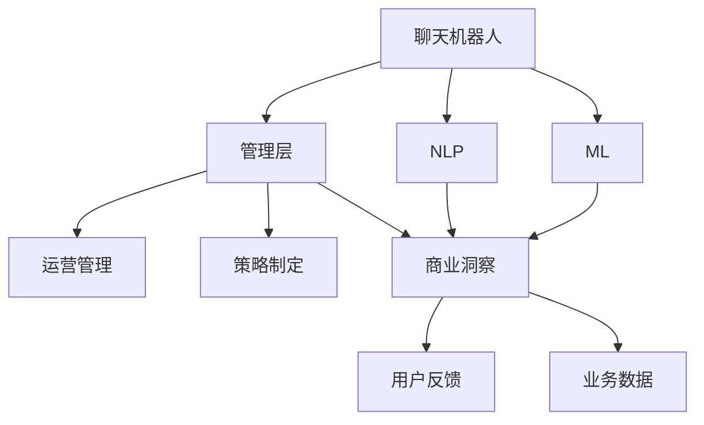

                 

# 聊天机器人管理层：战略决策和商业洞察力

> 关键词：
- 聊天机器人
- 管理层
- 商业洞察力
- 战略决策
- 自然语言处理
- 机器学习
- 人工智能
- 对话系统
- 多模态交互
- 智能客服

## 1. 背景介绍

### 1.1 问题由来

近年来，随着人工智能技术的飞速发展，聊天机器人成为众多企业提升客户服务效率、降低运营成本、提升用户体验的重要手段。传统的客户服务方式主要依赖于人工客服，随着市场竞争的加剧，企业需要不断优化服务质量，减少服务成本，同时提升客户满意度。而聊天机器人能够7x24小时不间断提供服务，能够处理大量的常见问题，快速响应客户需求，提升了客户体验。

然而，在聊天机器人管理层面，传统的手段如规则驱动和模板匹配已经无法满足用户多变的交互需求。越来越多的企业希望通过引入更先进的技术，实现更智能、更自然的客户服务体验。在技术层面，机器学习和自然语言处理技术成为支撑聊天机器人管理层决策和商业洞察力的重要基础。

### 1.2 问题核心关键点

聊天机器人管理层，即企业对于聊天机器人的运营管理、策略制定和商业洞察的决策过程。其核心在于：

1. **运营管理**：包括机器人系统的部署、维护、监控等日常管理活动。
2. **策略制定**：根据市场需求、用户反馈和业务目标，制定机器人的交互策略、内容策略、技术策略等。
3. **商业洞察**：利用机器人的数据分析能力，提取用户行为数据、用户反馈数据等，进行市场分析、用户画像构建、用户需求预测等，从而实现商业价值的最大化。

为了实现聊天机器人的战略决策和商业洞察力，企业需要在多方面进行投入，包括技术研发、数据分析、运营管理等。

## 2. 核心概念与联系

### 2.1 核心概念概述

- **聊天机器人**：通过自然语言处理技术和机器学习模型，实现与用户进行自然交互的智能系统。
- **管理层**：企业内部负责运营管理、策略制定、商业洞察的决策层级。
- **商业洞察力**：利用数据挖掘、分析工具，从用户行为数据中提取有用信息，帮助企业制定决策、优化运营策略，提升业务价值。
- **自然语言处理(NLP)**：通过算法将自然语言转换为计算机能够处理的形式，包括文本分析、语义理解、情感分析等。
- **机器学习(ML)**：通过训练模型，让计算机系统具备自主学习的能力，从而实现决策和预测。

这些核心概念之间紧密联系，形成了一个完整的聊天机器人管理层体系。

### 2.2 核心概念原理和架构的 Mermaid 流程图



该图展示了聊天机器人在管理层决策过程中各概念的联系：

- 聊天机器人通过自然语言处理（NLP）与用户交互，收集用户反馈（H）。
- 聊天机器人通过机器学习（ML）进行自我优化和提升，得到业务数据（I）。
- 管理层基于NLP和ML得到的数据，进行运营管理（E）、策略制定（F）和商业洞察（G）。

这些概念共同构成了聊天机器人管理层的核心决策框架。

## 3. 核心算法原理 & 具体操作步骤

### 3.1 算法原理概述

聊天机器人管理层的核心算法包括自然语言处理（NLP）、机器学习（ML）和运营管理（Ops）。这些算法相互配合，共同支持管理层的战略决策和商业洞察。

**NLP**：通过语言模型、文本分类、实体识别等技术，实现用户输入文本的理解和分析，从而提升聊天机器人与用户的交互体验。

**ML**：利用监督学习、无监督学习、强化学习等技术，训练模型，使聊天机器人具备自动学习的能力，实现自主优化和提升。

**Ops**：通过运维监控、系统优化、数据分析等技术手段，确保聊天机器人的稳定运行和性能提升。

### 3.2 算法步骤详解

#### 3.2.1 数据收集与预处理

聊天机器人管理层的首要任务是收集和预处理用户数据。数据来源包括用户互动记录、系统日志、用户行为数据等。预处理过程包括数据清洗、特征提取、数据标注等步骤。

- **数据清洗**：去除无用、重复、错误的数据，保留高质量的数据。
- **特征提取**：将原始数据转换为模型可以使用的数值特征。
- **数据标注**：为数据添加标签，如情感分类、实体识别、意图分类等。

#### 3.2.2 模型训练与优化

收集到数据后，利用机器学习模型进行训练和优化。模型的训练包括模型选择、数据分割、模型训练、验证和测试等步骤。优化过程包括超参数调优、模型剪枝、量化等。

- **模型选择**：根据任务需求选择合适的模型，如LSTM、Transformer等。
- **数据分割**：将数据集划分为训练集、验证集和测试集。
- **模型训练**：使用训练集对模型进行训练，迭代优化模型参数。
- **验证与测试**：使用验证集评估模型性能，调整模型参数；使用测试集验证模型效果。

#### 3.2.3 运营监控与优化

模型训练完成后，进入运营监控与优化阶段。通过运维监控工具，实时监测聊天机器人的运行状态，及时发现和解决问题。同时，根据用户反馈和业务需求，持续优化模型和系统。

- **运维监控**：通过监控工具，实时监测聊天机器人的性能指标、用户反馈等。
- **系统优化**：根据监控结果，进行系统优化和调整。
- **持续优化**：根据用户反馈和业务需求，持续优化模型和系统。

#### 3.2.4 商业洞察与决策

最后，通过商业洞察工具，从用户数据中提取有价值的信息，帮助管理层制定决策和优化策略。

- **数据分析**：利用数据挖掘和分析工具，提取用户行为、用户反馈等数据。
- **用户画像构建**：根据用户行为数据，构建用户画像，了解用户需求和偏好。
- **市场分析**：利用数据分析工具，进行市场分析和预测，指导业务决策。

### 3.3 算法优缺点

#### 3.3.1 优点

- **自动化**：通过机器学习模型，聊天机器人能够自主学习和优化，提升用户体验和系统性能。
- **可扩展**：聊天机器人管理层可以扩展到更多业务场景和领域，支持多语言、多文化等需求。
- **成本低**：相比于人工客服，聊天机器人能够大幅降低企业的人力和运营成本。

#### 3.3.2 缺点

- **初始投入大**：系统开发、模型训练、数据标注等需要大量的时间和资源投入。
- **数据质量要求高**：模型训练和优化效果依赖于高质量的数据，数据标注和清洗过程复杂。
- **个性化需求难以满足**：用户需求多样，系统难以完全满足个性化需求。

### 3.4 算法应用领域

聊天机器人管理层广泛应用于以下几个领域：

- **智能客服**：利用聊天机器人处理客户咨询和投诉，提升客户服务效率和满意度。
- **在线营销**：利用聊天机器人进行产品推荐和销售，提升转化率和客户粘性。
- **知识库管理**：利用聊天机器人进行知识库管理和更新，提供高效的知识检索服务。
- **个性化推荐**：利用聊天机器人进行个性化推荐，提升用户体验。
- **智能家居**：利用聊天机器人进行智能家居控制和互动，提升用户生活体验。

## 4. 数学模型和公式 & 详细讲解 & 举例说明

### 4.1 数学模型构建

聊天机器人管理层涉及多个数学模型，包括语言模型、文本分类模型、情感分析模型等。以下以情感分析为例，构建数学模型。

假设用户输入的文本为 $x=(x_1, x_2, ..., x_n)$，其中 $x_i$ 表示文本中第 $i$ 个词的特征向量。情感分析的目标是预测用户情感倾向，输出情感标签 $y \in \{1, 0\}$，其中 1 表示正面情感，0 表示负面情感。

定义情感分类器为 $f(x; \theta)$，其中 $\theta$ 为模型参数。情感分类器的损失函数为交叉熵损失：

$$
L(y, \hat{y}) = -\frac{1}{N} \sum_{i=1}^N [y_i \log \hat{y}_i + (1-y_i) \log (1-\hat{y}_i)]
$$

其中 $y_i$ 为真实情感标签，$\hat{y}_i = f(x_i; \theta)$ 为预测情感标签。

### 4.2 公式推导过程

情感分类器的训练过程包括数据预处理、模型选择、模型训练和优化等步骤。

- **数据预处理**：将文本转换为词向量，进行数据标准化和归一化。
- **模型选择**：选择合适的模型，如卷积神经网络（CNN）、循环神经网络（RNN）等。
- **模型训练**：使用训练集对模型进行训练，迭代优化模型参数。
- **优化**：使用梯度下降等优化算法，最小化损失函数。

### 4.3 案例分析与讲解

以情感分析为例，我们分析模型在不同数据集上的表现。假设我们有一个包含10,000个样本的情感数据集，其中正面情感有 5,000 个样本，负面情感有 5,000 个样本。使用随机初始化的情感分类器对数据集进行训练，得到模型参数 $\theta$。

- **数据预处理**：将文本转换为词向量，标准化和归一化处理。
- **模型训练**：使用梯度下降算法，迭代训练模型。
- **模型验证**：在验证集上评估模型效果，调整模型参数。
- **模型测试**：在测试集上评估模型效果，得到最终的分类准确率。

假设模型训练完成后，在测试集上的分类准确率为 95%。表示模型能够正确预测 95% 的情感标签，具有较高的准确性。

## 5. 项目实践：代码实例和详细解释说明

### 5.1 开发环境搭建

在项目实践中，我们需要准备好开发环境。以下是使用Python进行TensorFlow开发的环境配置流程：

1. 安装Anaconda：从官网下载并安装Anaconda，用于创建独立的Python环境。
2. 创建并激活虚拟环境：
```bash
conda create -n tf-env python=3.8 
conda activate tf-env
```

3. 安装TensorFlow：根据CUDA版本，从官网获取对应的安装命令。例如：
```bash
pip install tensorflow
```

4. 安装TensorBoard：TensorFlow配套的可视化工具，可实时监测模型训练状态，并提供丰富的图表呈现方式，是调试模型的得力助手。
```bash
pip install tensorboard
```

5. 安装各类工具包：
```bash
pip install numpy pandas scikit-learn matplotlib tqdm jupyter notebook ipython
```

完成上述步骤后，即可在`tf-env`环境中开始项目实践。

### 5.2 源代码详细实现

这里我们以情感分析任务为例，给出使用TensorFlow对聊天机器人进行情感分析的代码实现。

首先，定义情感分析任务的数据处理函数：

```python
import tensorflow as tf
from tensorflow.keras.preprocessing.text import Tokenizer
from tensorflow.keras.preprocessing.sequence import pad_sequences

# 定义情感分类标签
labels = tf.keras.utils.to_categorical(['positive', 'negative'])

# 定义Tokeniz器
tokenizer = Tokenizer(num_words=10000, oov_token='<OOV>')
tokenizer.fit_on_texts(texts)

# 将文本转换为序列
sequences = tokenizer.texts_to_sequences(texts)

# 对序列进行填充，使所有序列长度相同
padded_sequences = pad_sequences(sequences, maxlen=max_length, padding='post', truncating='post')

# 划分训练集和验证集
train_X, train_y = padded_sequences[:train_size], labels[:train_size]
val_X, val_y = padded_sequences[train_size:], labels[train_size:]
```

然后，定义模型和优化器：

```python
from tensorflow.keras.layers import Embedding, LSTM, Dense
from tensorflow.keras.models import Sequential

model = Sequential([
    Embedding(input_dim=10000, output_dim=128, input_length=max_length),
    LSTM(128),
    Dense(2, activation='softmax')
])

optimizer = tf.keras.optimizers.Adam(learning_rate=0.001)
```

接着，定义训练和评估函数：

```python
def train_epoch(model, data, optimizer):
    model.compile(optimizer=optimizer, loss='categorical_crossentropy', metrics=['accuracy'])
    model.fit(data['X'], data['y'], batch_size=batch_size, epochs=num_epochs, validation_data=(val_X, val_y))

def evaluate(model, data):
    loss, accuracy = model.evaluate(data['X'], data['y'])
    print(f'Loss: {loss}, Accuracy: {accuracy}')
```

最后，启动训练流程并在测试集上评估：

```python
# 定义超参数
num_epochs = 10
batch_size = 32
train_size = 8000
val_size = 2000

# 训练模型
train_epoch(model, {'X': train_X, 'y': train_y}, optimizer)

# 在验证集上评估模型
evaluate(model, {'X': val_X, 'y': val_y})

# 在测试集上评估模型
test_X, test_y = padded_sequences[train_size+val_size:], labels[train_size+val_size:]
evaluate(model, {'X': test_X, 'y': test_y})
```

以上就是使用TensorFlow对聊天机器人进行情感分析的完整代码实现。可以看到，TensorFlow提供了强大的API支持，使得模型训练和评估过程变得简洁高效。

### 5.3 代码解读与分析

让我们再详细解读一下关键代码的实现细节：

**定义情感分类标签**：
- 使用`tf.keras.utils.to_categorical`函数将情感标签转换为独热编码。

**Tokenizier和序列填充**：
- 使用`Tokenizier`将文本转换为整数序列，并使用`pad_sequences`函数进行填充。

**定义模型和优化器**：
- 使用`Sequential`模型定义一个简单的情感分类器，包含嵌入层、LSTM层和输出层。
- 使用`Adam`优化器进行参数更新。

**训练和评估函数**：
- `train_epoch`函数：使用`compile`方法指定模型优化器和损失函数，然后使用`fit`方法进行训练。
- `evaluate`函数：使用`evaluate`方法评估模型在验证集和测试集上的表现。

**启动训练流程**：
- 设置训练参数，包括训练轮数、批次大小、训练集大小等。
- 使用`train_epoch`函数训练模型。
- 使用`evaluate`函数在验证集和测试集上评估模型。

可以看到，TensorFlow提供了便捷的API支持，使得模型训练和评估过程变得简洁高效。同时，TensorBoard工具也方便我们进行模型监控和调试。

## 6. 实际应用场景

### 6.1 智能客服系统

聊天机器人管理层在智能客服系统中有着广泛应用。传统的客服系统依赖人工客服，随着客户需求的增加，人工客服的效率和质量难以满足需求。聊天机器人通过自然语言处理和机器学习技术，可以实现自动回复客户咨询，提升客服效率。

在智能客服系统中，聊天机器人管理层需要负责系统的部署、维护、监控等运营管理工作。同时，需要根据用户反馈和业务目标，制定合适的交互策略和内容策略，提升用户满意度。最后，通过数据分析工具，提取用户行为数据，进行市场分析和用户画像构建，指导业务决策。

### 6.2 在线营销

聊天机器人管理层在在线营销中也有着重要作用。通过聊天机器人进行产品推荐和销售，可以提升客户转化率和粘性。

在在线营销中，聊天机器人管理层需要根据用户行为数据，进行用户画像构建和市场分析。同时，需要制定合适的推荐策略和营销策略，提升用户体验和转化率。最后，通过数据分析工具，提取用户行为数据，进行市场分析和预测，指导业务决策。

### 6.3 知识库管理

聊天机器人管理层在知识库管理中也有着重要应用。通过聊天机器人进行知识库管理和更新，可以提供高效的知识检索服务。

在知识库管理中，聊天机器人管理层需要负责知识库的构建、更新和维护。同时，需要根据用户查询需求，进行智能推荐和知识检索。最后，通过数据分析工具，提取用户行为数据，进行市场分析和用户画像构建，指导业务决策。

### 6.4 未来应用展望

随着聊天机器人管理层技术的不断发展，未来在更多领域将有广泛应用：

- **智能家居**：通过聊天机器人进行智能家居控制和互动，提升用户生活体验。
- **健康医疗**：通过聊天机器人进行健康咨询和医疗推荐，提升医疗服务质量。
- **金融服务**：通过聊天机器人进行金融咨询和理财建议，提升金融服务效率。
- **教育培训**：通过聊天机器人进行在线教育和培训，提升教育培训效果。

## 7. 工具和资源推荐

### 7.1 学习资源推荐

为了帮助开发者系统掌握聊天机器人管理层的理论基础和实践技巧，这里推荐一些优质的学习资源：

1. **TensorFlow官方文档**：TensorFlow官网提供大量教程和示例，帮助开发者快速上手使用TensorFlow。
2. **《深度学习》书籍**：由深度学习领域权威专家撰写，涵盖深度学习基础和实际应用，适合进一步深入学习。
3. **NLP开源项目**：如NLTK、spaCy等，提供大量NLP工具和模型，支持聊天机器人开发。
4. **Kaggle竞赛**：Kaggle提供大量NLP竞赛数据集，通过参与竞赛，可以提升实战能力。
5. **Coursera课程**：Coursera提供大量机器学习和NLP相关课程，涵盖基础和高级内容。

通过对这些资源的学习实践，相信你一定能够快速掌握聊天机器人管理层的精髓，并用于解决实际的业务问题。

### 7.2 开发工具推荐

高效的开发离不开优秀的工具支持。以下是几款用于聊天机器人管理层开发的常用工具：

1. **TensorFlow**：由Google主导开发的开源深度学习框架，生产部署方便，适合大规模工程应用。
2. **Jupyter Notebook**：便捷的Jupyter Notebook环境，支持代码编写和可视化展示。
3. **TensorBoard**：TensorFlow配套的可视化工具，可实时监测模型训练状态，提供丰富的图表呈现方式。
4. **TensorFlow Hub**：提供大量预训练模型和模型组件，支持快速构建聊天机器人系统。
5. **GitLab**：开源代码管理平台，支持版本控制和团队协作。

合理利用这些工具，可以显著提升聊天机器人管理层开发的效率，加速创新迭代的步伐。

### 7.3 相关论文推荐

聊天机器人管理层的发展源于学界的持续研究。以下是几篇奠基性的相关论文，推荐阅读：

1. **Attention is All You Need**：Transformer原论文，提出了自注意力机制，开启了深度学习领域的预训练模型时代。
2. **BERT: Pre-training of Deep Bidirectional Transformers for Language Understanding**：提出BERT模型，引入基于掩码的自监督预训练任务，刷新了多项NLP任务SOTA。
3. **Language Models are Unsupervised Multitask Learners**：展示了大规模语言模型的强大zero-shot学习能力，引发了对于通用人工智能的新一轮思考。
4. **Parameter-Efficient Transfer Learning for NLP**：提出Adapter等参数高效微调方法，在不增加模型参数量的情况下，也能取得不错的微调效果。
5. **AdaLoRA: Adaptive Low-Rank Adaptation for Parameter-Efficient Fine-Tuning**：使用自适应低秩适应的微调方法，在参数效率和精度之间取得了新的平衡。

这些论文代表了大语言模型微调技术的发展脉络。通过学习这些前沿成果，可以帮助研究者把握学科前进方向，激发更多的创新灵感。

## 8. 总结：未来发展趋势与挑战

### 8.1 总结

本文对聊天机器人管理层的战略决策和商业洞察力进行了全面系统的介绍。首先阐述了聊天机器人管理层的背景和核心关键点，明确了其在运营管理、策略制定和商业洞察方面的重要价值。其次，从原理到实践，详细讲解了聊天机器人管理层的算法原理和操作步骤，给出了模型训练和优化的完整代码实例。同时，本文还广泛探讨了聊天机器人管理层在智能客服、在线营销、知识库管理等实际应用场景中的应用前景，展示了其广泛的应用范围和巨大潜力。此外，本文精选了聊天机器人管理层的学习资源、开发工具和相关论文，力求为读者提供全方位的技术指引。

通过本文的系统梳理，可以看到，聊天机器人管理层技术正在成为企业实现智能化决策和商业洞察的重要手段，极大地提升了企业的运营效率和业务价值。未来，伴随技术的不断演进和应用场景的扩展，聊天机器人管理层必将在更多领域发挥其独特价值，推动人工智能技术向更广范围、更深层次发展。

### 8.2 未来发展趋势

展望未来，聊天机器人管理层技术将呈现以下几个发展趋势：

1. **多模态交互**：未来聊天机器人将支持更多模态的交互，如语音、图像、视频等，提升用户体验和交互效率。
2. **深度学习**：深度学习技术将进一步提升聊天机器人的智能水平，使其能够更好地理解用户意图和需求。
3. **联邦学习**：联邦学习技术可以实现多方数据联合学习，保护数据隐私，提升模型泛化能力。
4. **自监督学习**：自监督学习技术可以充分利用无标签数据，提升模型性能和泛化能力。
5. **人工智能伦理**：随着聊天机器人管理层技术的普及，人工智能伦理问题将逐渐引起重视，提升系统的透明度和可解释性。

以上趋势凸显了聊天机器人管理层技术的广阔前景。这些方向的探索发展，必将进一步提升聊天机器人的智能化水平和应用范围，为人工智能技术在更多领域的发展奠定基础。

### 8.3 面临的挑战

尽管聊天机器人管理层技术已经取得了瞩目成就，但在迈向更加智能化、普适化应用的过程中，它仍面临着诸多挑战：

1. **数据隐私和安全**：聊天机器人管理层需要处理大量用户数据，数据隐私和安全问题亟需解决。
2. **用户理解和体验**：聊天机器人管理层需要理解用户复杂多变的交互需求，提升用户体验。
3. **多语言和跨文化**：聊天机器人管理层需要支持多语言和跨文化交互，提升系统的可扩展性。
4. **模型复杂度和资源消耗**：大规模语言模型需要大量的计算资源，资源消耗问题亟需解决。
5. **模型可解释性和透明性**：聊天机器人管理层需要提升模型的可解释性和透明性，增强系统的可信度。

这些挑战需要通过技术创新和协同努力，不断克服和优化，才能实现聊天机器人管理层技术的持续发展和应用。

### 8.4 研究展望

面对聊天机器人管理层所面临的挑战，未来的研究需要在以下几个方面寻求新的突破：

1. **数据隐私和安全**：开发隐私保护技术，如差分隐私、联邦学习等，确保数据隐私和安全。
2. **用户理解和体验**：开发用户行为分析技术，理解用户需求和意图，提升用户体验。
3. **多语言和跨文化**：开发多语言和跨文化交互技术，提升系统的可扩展性。
4. **模型复杂度和资源消耗**：开发模型压缩和优化技术，减少资源消耗，提升模型的计算效率。
5. **模型可解释性和透明性**：开发模型可解释性技术，提升系统的透明性和可信度。

这些研究方向将推动聊天机器人管理层技术向更高层次发展，为人工智能技术的更广泛应用奠定基础。

## 9. 附录：常见问题与解答

**Q1：聊天机器人管理层如何处理多语言和跨文化交互？**

A: 聊天机器人管理层可以通过以下方式处理多语言和跨文化交互：

1. **多语言模型**：使用多语言模型训练聊天机器人，支持多语言输入和输出。
2. **跨文化理解**：通过文本分析和情感分析技术，理解不同文化背景下的用户意图和需求。
3. **文化适应**：根据不同文化背景，调整聊天机器人的回复策略和内容策略。

这些方法可以帮助聊天机器人管理层更好地处理多语言和跨文化交互，提升系统的可扩展性和用户体验。

**Q2：聊天机器人管理层如何保护用户数据隐私和安全？**

A: 聊天机器人管理层可以通过以下方式保护用户数据隐私和安全：

1. **数据加密**：使用加密技术对用户数据进行加密保护，防止数据泄露。
2. **差分隐私**：使用差分隐私技术，在数据查询过程中添加噪声，保护用户隐私。
3. **联邦学习**：使用联邦学习技术，在本地设备上进行模型训练，不传输原始数据，保护数据隐私。
4. **访问控制**：对用户数据进行严格的访问控制，确保只有授权用户才能访问数据。

这些方法可以帮助聊天机器人管理层保护用户数据隐私和安全，提升系统的可信度和安全性。

**Q3：聊天机器人管理层如何提升系统的可解释性和透明性？**

A: 聊天机器人管理层可以通过以下方式提升系统的可解释性和透明性：

1. **模型解释工具**：使用模型解释工具，如LIME、SHAP等，生成模型的解释图和特征重要性分析。
2. **用户交互记录**：记录用户交互记录，进行数据分析和可视化，理解用户需求和意图。
3. **日志记录**：记录系统的日志信息，进行数据分析和可视化，了解系统运行状态和问题。

这些方法可以帮助聊天机器人管理层提升系统的可解释性和透明性，增强系统的可信度和用户信任度。

---

作者：禅与计算机程序设计艺术 / Zen and the Art of Computer Programming

