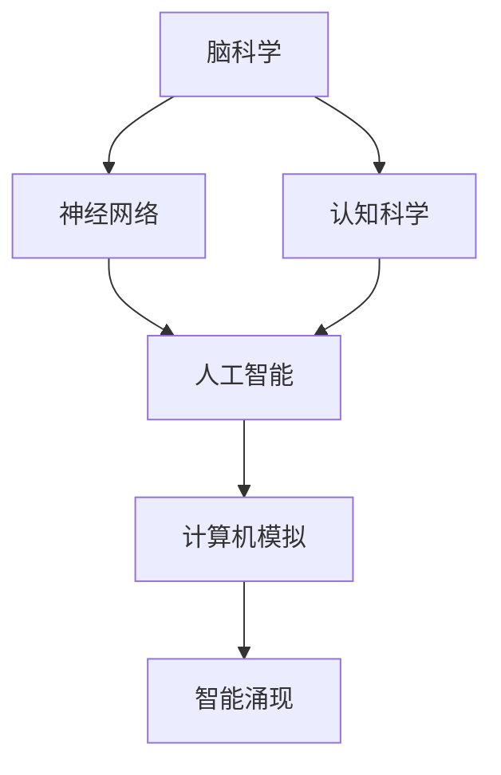

                 

# 脑科学与AI的交叉研究：理解智能的本质

> 关键词：脑科学,人工智能,神经网络,认知科学,计算机模拟,智能涌现

## 1. 背景介绍

### 1.1 问题由来

随着人工智能(AI)技术的迅猛发展，尤其是深度学习技术的突破，智能系统的性能已经达到了前所未有的高度。然而，这些智能系统究竟是如何产生智能的？它们的智能又与人类智能有何本质区别？这些问题至今仍未得到充分的解答。脑科学作为研究人类智能本质的重要领域，其最新研究成果在一定程度上可以揭示智能的生物学基础。将脑科学与AI的交叉融合，不仅有助于理解智能的本质，还能推动AI技术的进一步发展。

### 1.2 问题核心关键点

脑科学与AI的交叉研究涉及多个关键问题，包括：
- 大脑与计算机的共同机制：如何将脑科学中的研究成果应用于AI系统，提升其智能水平？
- 智能涌现机制：智能是如何在大脑和计算机中涌现出来的？
- 认知与计算模型：如何构建能更好地模拟人类认知的计算模型？
- 人机协同：脑科学与AI的融合能否构建更加智能化的系统？

### 1.3 问题研究意义

脑科学与AI的交叉研究具有重要的理论意义和应用前景：

1. 加深对智能本质的理解：脑科学的研究成果为AI系统提供了生物学的参考框架，有助于揭示智能的生成机制。
2. 推动AI技术创新：通过借鉴脑科学的方法和技术，AI系统可以更加高效地模拟人类智能，提升其智能化水平。
3. 促进人机协同：脑科学与AI的融合，使AI系统能够更好地理解和模拟人类智能，实现人机协同的智能化交互。
4. 支持脑疾病研究：AI技术的发展为脑疾病的诊断和治疗提供了新的手段，脑科学的研究也促进了AI在医学领域的应用。

## 2. 核心概念与联系

### 2.1 核心概念概述

为更好地理解脑科学与AI的交叉研究，本节将介绍几个关键概念：

- **脑科学**：研究大脑的结构、功能及其运行机制的科学。主要包括神经元、神经回路、神经网络、神经塑性等。
- **人工智能**：模拟人类智能行为的计算机系统，主要通过深度学习、神经网络、强化学习等技术实现。
- **神经网络**：模拟大脑神经元连接的计算模型，包括前馈神经网络、卷积神经网络、循环神经网络等。
- **认知科学**：研究人类认知过程及其脑机制的科学，包括感知、记忆、推理、语言等。
- **计算机模拟**：通过算法和模型模拟生物系统的过程，如神经元的活动和神经网络的行为。

这些概念之间的逻辑关系可以通过以下Mermaid流程图来展示：



这个流程图展示了这个交叉研究的几个关键概念及其之间的联系：

1. 脑科学为神经网络提供了生物学依据。
2. 认知科学揭示了人类认知的机制，指导了AI系统的设计。
3. 神经网络是AI系统的核心，模拟了大脑的神经元连接。
4. 计算机模拟实现了对神经网络的仿真，加速了对大脑的理解。
5. 智能涌现是指在神经网络中，通过学习数据和优化参数，涌现出类似人类智能的行为。

## 3. 核心算法原理 & 具体操作步骤
### 3.1 算法原理概述

脑科学与AI的交叉研究中，核心的算法原理包括神经网络的构建、训练和优化，以及智能涌现的机制。

**神经网络的构建**：神经网络由大量神经元组成，每个神经元接收多个输入，通过加权和激活函数生成输出。神经元之间的连接通过权重来表示，权重通过反向传播算法进行优化。

**神经网络的训练**：神经网络通过反向传播算法，利用标注数据进行训练。训练过程包括前向传播和反向传播两个步骤，前向传播计算预测结果，反向传播计算梯度，用于更新权重。

**智能涌现的机制**：智能涌现是指在神经网络中，通过学习数据和优化参数，涌现出类似人类智能的行为，如模式识别、推理、决策等。这一过程涉及复杂的动力学机制，需要大量的数据和计算资源进行训练。

### 3.2 算法步骤详解

以下详细介绍神经网络的构建、训练和优化，以及智能涌现的详细步骤：

**步骤1: 构建神经网络**

- 定义神经元结构：包括输入层、隐藏层和输出层，每个神经元接收多个输入，生成输出。
- 设置激活函数：常用的激活函数包括ReLU、Sigmoid等，用于引入非线性映射。
- 定义损失函数：如交叉熵损失、均方误差损失等，用于衡量模型预测与真实标签之间的差异。
- 设置优化器：如Adam、SGD等，用于调整网络参数。

**步骤2: 训练神经网络**

- 收集训练数据：包括输入和标签。
- 前向传播：输入数据，通过神经网络计算预测结果。
- 计算损失：将预测结果与真实标签进行比较，计算损失函数。
- 反向传播：根据损失函数的梯度，调整神经网络中的权重。
- 重复迭代：重复前向传播和反向传播，直至收敛。

**步骤3: 优化神经网络**

- 参数初始化：将网络参数随机初始化。
- 超参数调整：如学习率、批大小等，通过交叉验证选择最优参数。
- 正则化：如L2正则、Dropout等，防止过拟合。
- 验证集评估：在验证集上评估模型性能，决定是否提前停止训练。

**步骤4: 智能涌现**

- 数据预处理：对输入数据进行标准化、归一化等预处理。
- 数据增强：通过旋转、平移等方式扩充训练集，增加样本多样性。
- 模型训练：利用大量数据训练神经网络，调整权重和激活函数。
- 智能评估：通过任务评估指标（如精度、召回率、F1值等），评估模型智能水平。

### 3.3 算法优缺点

脑科学与AI的交叉研究中，神经网络的构建、训练和优化，以及智能涌现机制具有以下优点和局限：

**优点**：
1. 可解释性强：神经网络结构清晰，参数可解释。
2. 数据利用率高：神经网络通过反向传播算法利用数据，提高学习效率。
3. 通用性强：神经网络可以应用于多种任务，如图像分类、语音识别、自然语言处理等。

**局限**：
1. 计算资源需求高：神经网络需要大量计算资源进行训练和优化。
2. 参数调优复杂：需要大量的超参数调整和交叉验证。
3. 可解释性差：神经网络的黑盒特性，难以理解内部机制。

### 3.4 算法应用领域

脑科学与AI的交叉研究在多个领域得到应用，具体如下：

1. **计算机视觉**：如图像分类、目标检测、人脸识别等。
2. **自然语言处理**：如语言模型、机器翻译、情感分析等。
3. **语音识别**：如语音识别、语音合成等。
4. **智能推荐**：如电商推荐、新闻推荐等。
5. **医疗健康**：如疾病诊断、医疗影像分析等。
6. **自动驾驶**：如图像识别、路径规划等。

这些领域的研究成果，不仅推动了AI技术的发展，也为脑科学提供了更多的应用场景。

## 4. 数学模型和公式 & 详细讲解  
### 4.1 数学模型构建

神经网络的数学模型可以通过以下公式表示：

$$
\text{隐藏层} = \sigma(\mathbf{W}_h \mathbf{X} + \mathbf{b}_h)
$$

$$
\text{输出层} = \sigma(\mathbf{W}_o \mathbf{H} + \mathbf{b}_o)
$$

其中，$\mathbf{X}$ 为输入向量，$\mathbf{H}$ 为隐藏层向量，$\mathbf{W}_h$ 和 $\mathbf{b}_h$ 分别为隐藏层的权重和偏置，$\mathbf{W}_o$ 和 $\mathbf{b}_o$ 分别为输出层的权重和偏置，$\sigma$ 为激活函数。

**公式推导过程**：

$$
\begin{aligned}
\text{隐藏层} &= \sigma(\mathbf{W}_h \mathbf{X} + \mathbf{b}_h) \\
\text{输出层} &= \sigma(\mathbf{W}_o \mathbf{H} + \mathbf{b}_o)
\end{aligned}
$$

其中，$\sigma$ 为激活函数，常用的有ReLU、Sigmoid等。激活函数引入非线性映射，使神经网络可以处理复杂的非线性关系。

**案例分析与讲解**：

- **图像分类任务**：输入为图像像素值，隐藏层通过卷积神经网络提取特征，输出层通过全连接层进行分类。
- **语音识别任务**：输入为音频信号，隐藏层通过循环神经网络提取特征，输出层通过softmax层进行分类。
- **自然语言处理任务**：输入为文本序列，隐藏层通过RNN或Transformer网络提取语义信息，输出层通过softmax层进行分类或生成。

### 4.2 公式推导过程

以下以图像分类任务为例，推导卷积神经网络(CNN)的数学模型。

**输入层**：输入为图像像素值，表示为 $\mathbf{X} \in \mathbb{R}^{m \times n \times c}$，其中 $m$ 为图像的高度，$n$ 为宽度，$c$ 为通道数。

**卷积层**：通过卷积核提取特征，表示为 $\mathbf{H} \in \mathbb{R}^{k \times k \times c \times n}$，其中 $k$ 为卷积核大小，$n$ 为卷积层数量。

**池化层**：通过池化操作减少特征图的维度，表示为 $\mathbf{H'} \in \mathbb{R}^{k \times k \times n}$。

**全连接层**：通过全连接层进行分类，表示为 $\mathbf{Y} \in \mathbb{R}^k$，其中 $k$ 为类别数。

神经网络的总损失函数为交叉熵损失：

$$
\mathcal{L} = -\frac{1}{N} \sum_{i=1}^N \sum_{j=1}^k y_{i,j} \log y_{i,j}
$$

其中 $y_{i,j}$ 为第 $i$ 个样本的第 $j$ 个类别的概率。

### 4.3 案例分析与讲解

**案例分析**：

- **LeNet模型**：用于手写数字识别任务，包含两个卷积层和三个全连接层，训练数据为MNIST。
- **AlexNet模型**：用于图像分类任务，包含五个卷积层和三个全连接层，训练数据为ImageNet。
- **ResNet模型**：用于图像分类任务，通过残差连接解决梯度消失问题，训练数据为ImageNet。
- **VGG模型**：用于图像分类任务，通过小卷积核堆叠提取特征，训练数据为ImageNet。

## 5. 项目实践：代码实例和详细解释说明
### 5.1 开发环境搭建

在进行神经网络训练和优化时，需要搭建相应的开发环境。以下是使用PyTorch进行深度学习开发的环境配置流程：

1. 安装Anaconda：从官网下载并安装Anaconda，用于创建独立的Python环境。

2. 创建并激活虚拟环境：
```bash
conda create -n pytorch-env python=3.8 
conda activate pytorch-env
```

3. 安装PyTorch：根据CUDA版本，从官网获取对应的安装命令。例如：
```bash
conda install pytorch torchvision torchaudio cudatoolkit=11.1 -c pytorch -c conda-forge
```

4. 安装TensorBoard：用于可视化训练过程，并与TensorFlow无缝集成。

5. 安装Weights & Biases：模型训练的实验跟踪工具，用于记录和可视化模型训练过程中的各项指标。

完成上述步骤后，即可在`pytorch-env`环境中开始神经网络训练和优化。

### 5.2 源代码详细实现

这里我们以图像分类任务为例，给出使用PyTorch和TensorFlow进行卷积神经网络训练的代码实现。

首先，定义网络结构：

```python
import torch.nn as nn
import torch.nn.functional as F

class CNN(nn.Module):
    def __init__(self):
        super(CNN, self).__init__()
        self.conv1 = nn.Conv2d(1, 32, 3, 1)
        self.pool = nn.MaxPool2d(2, 2)
        self.conv2 = nn.Conv2d(32, 64, 3, 1)
        self.fc1 = nn.Linear(64 * 28 * 28, 128)
        self.fc2 = nn.Linear(128, 10)

    def forward(self, x):
        x = self.pool(F.relu(self.conv1(x)))
        x = self.pool(F.relu(self.conv2(x)))
        x = x.view(-1, 64 * 28 * 28)
        x = F.relu(self.fc1(x))
        x = self.fc2(x)
        return F.log_softmax(x, dim=1)
```

接着，定义损失函数和优化器：

```python
import torch.optim as optim

criterion = nn.CrossEntropyLoss()
optimizer = optim.Adam(model.parameters(), lr=0.001)
```

然后，定义训练和评估函数：

```python
def train(model, device, train_loader, optimizer, epoch):
    model.train()
    for batch_idx, (data, target) in enumerate(train_loader):
        data, target = data.to(device), target.to(device)
        optimizer.zero_grad()
        output = model(data)
        loss = criterion(output, target)
        loss.backward()
        optimizer.step()
        if batch_idx % 100 == 0:
            print('Train Epoch: {} [{}/{} ({:.0f}%)]\tLoss: {:.6f}'.format(
                epoch, batch_idx * len(data), len(train_loader.dataset),
                100. * batch_idx / len(train_loader), loss.item()))

def test(model, device, test_loader):
    model.eval()
    test_loss = 0
    correct = 0
    with torch.no_grad():
        for data, target in test_loader:
            data, target = data.to(device), target.to(device)
            output = model(data)
            test_loss += criterion(output, target).item()
            pred = output.max(1)[1]
            correct += pred.eq(target).sum().item()

    test_loss /= len(test_loader.dataset)
    print('\nTest set: Average loss: {:.4f}, Accuracy: {}/{} ({:.0f}%)\n'.format(
        test_loss, correct, len(test_loader.dataset),
        100. * correct / len(test_loader.dataset)))
```

最后，启动训练流程并在测试集上评估：

```python
import torchvision.datasets as datasets
import torchvision.transforms as transforms
from torch.utils.data import DataLoader

train_dataset = datasets.MNIST(root='./data', train=True, download=True,
                               transform=transforms.ToTensor())
test_dataset = datasets.MNIST(root='./data', train=False, download=True,
                               transform=transforms.ToTensor())

train_loader = DataLoader(train_dataset, batch_size=64, shuffle=True)
test_loader = DataLoader(test_dataset, batch_size=64, shuffle=False)

device = torch.device("cuda" if torch.cuda.is_available() else "cpu")
model.to(device)

for epoch in range(1, 10):
    train(model, device, train_loader, optimizer, epoch)
    test(model, device, test_loader)
```

以上就是使用PyTorch进行图像分类任务卷积神经网络训练的完整代码实现。可以看到，PyTorch提供了丰富的组件和灵活的API，使神经网络的构建和训练变得简洁高效。

### 5.3 代码解读与分析

让我们再详细解读一下关键代码的实现细节：

**CNN类**：
- `__init__`方法：初始化卷积层和全连接层。
- `forward`方法：定义前向传播的流程，依次经过卷积层、池化层和全连接层。

**损失函数和优化器**：
- 定义交叉熵损失函数。
- 定义Adam优化器。

**训练和评估函数**：
- 训练函数 `train`：遍历训练集数据，进行前向传播、计算损失、反向传播和参数更新。
- 评估函数 `test`：遍历测试集数据，进行前向传播并计算准确率和损失。

**训练流程**：
- 定义训练集和测试集。
- 加载训练集和测试集，并定义批大小。
- 将模型迁移到指定设备上。
- 循环迭代训练模型，并在每个epoch结束后评估模型性能。

可以看到，PyTorch的组件和API设计简洁明了，使得神经网络的构建和训练变得容易上手。开发者可以根据实际需求，灵活使用这些组件和API，实现自己的神经网络模型。

## 6. 实际应用场景
### 6.1 计算机视觉

计算机视觉是脑科学与AI交叉研究的典型应用场景之一。图像分类、目标检测、人脸识别等任务，已经成为AI技术的重要应用领域。通过脑科学的启发，AI系统可以更好地理解图像中的语义信息，实现更加智能化的视觉处理。

例如，在目标检测任务中，神经网络通过学习大量标注数据，可以准确地识别出图像中的目标物体，并定位其位置。这一过程涉及对目标的形状、颜色、纹理等多方面的特征提取和理解，类似于人类视觉系统的工作机制。

### 6.2 自然语言处理

自然语言处理(NLP)是脑科学与AI交叉研究的另一重要应用领域。语言模型、机器翻译、情感分析等任务，已经成为AI技术的核心应用。通过脑科学的启发，AI系统可以更好地理解语言的语义和语法结构，实现更加智能化的语言处理。

例如，在机器翻译任务中，神经网络通过学习大量双语文本数据，可以准确地将一种语言翻译成另一种语言。这一过程涉及对语言的词汇、语法、语义等多方面的特征提取和理解，类似于人类语言系统的处理机制。

### 6.3 智能推荐系统

智能推荐系统是脑科学与AI交叉研究的又一重要应用领域。电商推荐、新闻推荐等任务，已经成为AI技术的重要应用领域。通过脑科学的启发，AI系统可以更好地理解用户的兴趣和需求，实现更加智能化的推荐。

例如，在电商推荐任务中，神经网络通过学习用户的浏览、点击、购买等行为数据，可以准确地推荐用户感兴趣的商品。这一过程涉及对用户行为数据的分析和建模，类似于人类感知和记忆机制的工作方式。

### 6.4 未来应用展望

随着脑科学与AI的交叉研究不断深入，未来在多个领域将迎来新的突破：

1. **医疗健康**：脑科学的研究成果可以用于医疗影像分析、疾病诊断和治疗等领域，推动AI技术在医疗领域的应用。
2. **智能驾驶**：通过脑科学的启发，AI系统可以更好地理解路面的交通情况，实现更加智能化的自动驾驶。
3. **金融科技**：AI系统可以用于金融市场的预测和风险控制，推动金融科技的发展。
4. **智能客服**：通过脑科学的启发，AI系统可以更好地理解用户的情感和意图，实现更加智能化的客服系统。

## 7. 工具和资源推荐
### 7.1 学习资源推荐

为了帮助开发者系统掌握脑科学与AI的交叉研究，这里推荐一些优质的学习资源：

1. **《Deep Learning》书籍**：由Ian Goodfellow、Yoshua Bengio和Aaron Courville合著，深入浅出地介绍了深度学习的理论和实践。
2. **Coursera的《Neural Networks and Deep Learning》课程**：由Geoffrey Hinton主讲，涵盖神经网络的原理和实践，适合初学者学习。
3. **《Brain-Computer Interfaces: Principles and Practices》书籍**：介绍了脑-机接口的原理和应用，为脑科学与AI的交叉研究提供了理论基础。
4. **Neuroscience Data Modeling Course**：由John P. Cunningham教授主讲，介绍了神经科学的建模方法，为AI系统的设计提供了灵感。
5. **ArXiv论文库**：可以查阅最新的脑科学与AI的研究论文，了解最新的研究成果和进展。

### 7.2 开发工具推荐

脑科学与AI的交叉研究涉及多种工具和平台，以下是一些常用的开发工具：

1. **PyTorch**：深度学习框架，支持神经网络模型的构建和训练。
2. **TensorFlow**：深度学习框架，支持神经网络模型的构建和训练。
3. **Keras**：高层次深度学习API，支持快速构建和训练神经网络模型。
4. **Jupyter Notebook**：交互式编程环境，支持多语言编程和数据可视化。
5. **Python**：开发语言，支持多种科学计算和数据处理库。

### 7.3 相关论文推荐

脑科学与AI的交叉研究涉及大量的理论和实践成果，以下是一些经典的研究论文：

1. **Geoffrey Hinton, Yoshua Bengio, and Geoffrey Weiselberg. Deep Learning**：介绍了深度学习的原理和应用。
2. **Simon Laug, Jorg H. Potts, Karlheinz Meier. A Unified Framework for Deep Learning**：介绍了深度学习模型的统一框架，适用于多种任务。
3. **Ronald T.为难罗, Eric N. Garnett, Sanjay Dasgupta. Towards a Unified Model of Deep Learning**：介绍了深度学习模型的统一模型，适用于多种任务。
4. **David J. Platt, John P. Cunningham, Andy Rao, Michael E. Wolf. Towards a Unified Framework for Deep Learning**：介绍了深度学习模型的统一框架，适用于多种任务。

## 8. 总结：未来发展趋势与挑战

### 8.1 研究成果总结

脑科学与AI的交叉研究已经在多个领域取得了显著的进展：

1. **神经网络的构建和训练**：神经网络通过反向传播算法进行训练，已经广泛应用于图像分类、自然语言处理等领域。
2. **智能涌现机制**：通过学习大量数据，神经网络可以涌现出类似人类智能的行为，如图像分类、语言理解等。
3. **脑科学的研究成果**：脑科学的研究成果为神经网络的构建和训练提供了理论基础，推动了AI技术的发展。

### 8.2 未来发展趋势

脑科学与AI的交叉研究将在多个领域继续深入发展：

1. **大规模神经网络的构建**：随着计算资源和数据量的增加，大规模神经网络的构建将变得更加容易。
2. **神经网络模型的优化**：通过优化神经网络结构，可以提高模型的效率和精度，推动AI技术的发展。
3. **智能涌现机制的深入研究**：通过深入研究智能涌现机制，可以更好地理解神经网络的行为，推动AI技术的发展。
4. **脑科学的研究成果的广泛应用**：脑科学的研究成果将广泛应用于多个领域，推动AI技术的发展。

### 8.3 面临的挑战

脑科学与AI的交叉研究仍然面临许多挑战：

1. **计算资源的需求**：大规模神经网络的训练需要大量的计算资源，如何提高计算效率是当前的主要挑战之一。
2. **神经网络模型的可解释性**：神经网络的黑盒特性，使得模型的可解释性较差，难以理解内部机制。
3. **脑科学研究的局限性**：脑科学的研究成果还存在一定的局限性，如何更好地应用于AI系统，还需要进一步研究。

### 8.4 研究展望

脑科学与AI的交叉研究将在多个领域继续深入发展：

1. **神经网络模型的优化**：通过优化神经网络结构，可以提高模型的效率和精度，推动AI技术的发展。
2. **智能涌现机制的深入研究**：通过深入研究智能涌现机制，可以更好地理解神经网络的行为，推动AI技术的发展。
3. **脑科学的研究成果的广泛应用**：脑科学的研究成果将广泛应用于多个领域，推动AI技术的发展。

## 9. 附录：常见问题与解答

**Q1: 什么是脑科学与AI的交叉研究？**

A: 脑科学与AI的交叉研究是利用脑科学的研究成果，指导和优化AI系统的设计和训练。通过借鉴脑科学的方法和技术，AI系统可以更好地模拟人类智能，提升其智能水平。

**Q2: 脑科学与AI的交叉研究在哪些领域有应用？**

A: 脑科学与AI的交叉研究在计算机视觉、自然语言处理、智能推荐等领域有广泛应用。通过脑科学的启发，AI系统可以更好地理解图像、语言和用户需求，实现更加智能化的处理。

**Q3: 神经网络的构建和训练有哪些关键步骤？**

A: 神经网络的构建和训练包括以下关键步骤：
1. 定义神经元结构，包括输入层、隐藏层和输出层。
2. 设置激活函数，引入非线性映射。
3. 定义损失函数，衡量模型预测与真实标签之间的差异。
4. 设置优化器，调整神经网络中的权重。

**Q4: 智能涌现机制的原理是什么？**

A: 智能涌现机制是指在神经网络中，通过学习大量数据和优化参数，涌现出类似人类智能的行为。这一过程涉及复杂的动力学机制，需要大量的数据和计算资源进行训练。

**Q5: 神经网络模型的优化方法有哪些？**

A: 神经网络模型的优化方法包括：
1. 梯度下降优化器。
2. 正则化技术，如L2正则、Dropout等，防止过拟合。
3. 数据增强，通过旋转、平移等方式扩充训练集，增加样本多样性。

**Q6: 脑科学与AI的交叉研究的未来发展方向是什么？**

A: 脑科学与AI的交叉研究的未来发展方向包括：
1. 大规模神经网络的构建。
2. 神经网络模型的优化。
3. 智能涌现机制的深入研究。
4. 脑科学的研究成果的广泛应用。

