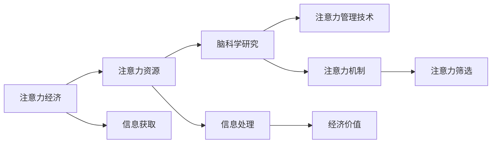

                 

# 脑科学研究对注意力经济的启示

在数字化时代，信息的爆炸和注意力经济的崛起，使得如何有效管理和利用人类的注意力成为一项至关重要的研究课题。脑科学研究，特别是对人类注意力机制的理解，为注意力经济提供了深层次的启示，推动了技术创新和产业变革。本文将从脑科学的角度，探讨注意力经济的本质、现状与未来，并提出基于脑科学研究的新型注意力管理技术，以期为注意力经济的发展提供理论支撑和实践指导。

## 1. 背景介绍

### 1.1 问题由来

随着互联网的普及和数字技术的快速发展，人类已置身于一个信息爆炸的时代。据统计，每天全球产生的数据量已经超过30EB字节，而每个人每天面临的信息输入量更是惊人。然而，人的注意力资源是有限的，如何在海量信息中挑选出对自己有益的内容，成为了一个关键问题。

注意力经济，正是在这种背景下诞生的新经济模式。它基于对注意力资源的有效利用和分配，以获取更高的经济价值和社会效益。然而，注意力经济也面临着诸多挑战：信息过载、注意力分散、注意力疲劳等问题严重制约了其发展。

脑科学研究，特别是对注意力机制的深入理解，为这些问题提供了新的解决思路。本文将从脑科学的角度，探讨注意力经济的本质和现状，并提出基于脑科学的新型注意力管理技术，以期为注意力经济的发展提供理论支撑和实践指导。

## 2. 核心概念与联系

### 2.1 核心概念概述

为了更好地理解注意力经济，首先需要明确以下几个核心概念：

- **注意力经济（Attention Economy）**：基于对注意力资源的有效利用和分配，以获取经济和社会效益的一种新型经济模式。

- **注意力机制（Attention Mechanism）**：指在神经网络中，对输入数据的不同部分赋予不同权重，从而实现对重要信息的聚焦和筛选的机制。

- **脑科学（Neuroscience）**：研究大脑结构和功能的科学，关注于人类认知和行为的神经基础。

这些核心概念之间存在着紧密的联系：注意力经济依赖于对注意力资源的有效管理，而脑科学研究揭示了人类注意力的神经机制，为注意力资源的优化分配提供了理论基础。

### 2.2 核心概念原理和架构的 Mermaid 流程图



这个流程图展示了注意力经济与脑科学之间的逻辑关系：

1. **信息获取**：从互联网等渠道获取信息。
2. **注意力筛选**：通过脑科学揭示的注意力机制，筛选重要信息。
3. **经济价值**：将注意力资源转化为经济价值。

## 3. 核心算法原理 & 具体操作步骤

### 3.1 算法原理概述

基于脑科学的研究，注意力经济的核心算法可以概括为以下步骤：

1. **信息感知**：利用感知觉机制获取外界信息。
2. **信息处理**：通过认知加工机制，对信息进行分析和筛选。
3. **注意力分配**：基于神经机制，对重要信息进行聚焦，对不重要信息进行屏蔽。
4. **决策行为**：将注意力资源转化为具体的决策行为，获取经济价值。

这些步骤相互关联，构成了一个完整的注意力经济流程。

### 3.2 算法步骤详解

#### 3.2.1 信息感知

信息感知是注意力经济的第一步，涉及到感官系统对外部信息的接收。这一过程由感知觉机制主导，主要包括视觉、听觉、触觉等感官通道。

以视觉信息为例，其感知过程可以概括为以下步骤：

1. **光信号接收**：光线通过视网膜，转化为电信号。
2. **光信号转换**：电信号通过视神经传递到大脑皮层，进一步处理。
3. **光信号解码**：大脑对电信号进行解码，还原成视觉信息。

这一过程的算法实现可以通过感知神经网络的模拟来完成。例如，可以使用卷积神经网络（CNN）来模拟视网膜和视神经的工作机制，将光信号转化为视觉特征图。

#### 3.2.2 信息处理

信息处理是注意力经济的核心环节，涉及到对信息的认知加工。这一过程由认知加工机制主导，主要包括注意力的筛选、记忆的编码和信息的整合等。

以文本信息的处理为例，其认知加工过程可以概括为以下步骤：

1. **文本预处理**：对文本进行分词、词性标注等预处理，得到文本特征向量。
2. **注意力筛选**：利用注意力机制，对文本特征向量中的重要信息进行聚焦，屏蔽无关信息。
3. **信息整合**：将注意力筛选后的信息进行整合，得到更高层次的认知表示。

这一过程的算法实现可以通过Transformer模型来完成。例如，可以使用Transformer模型中的Self-Attention机制，对文本特征向量进行注意力筛选和整合。

#### 3.2.3 注意力分配

注意力分配是注意力经济的关键步骤，涉及到对重要信息的聚焦和优先处理。这一过程由神经机制主导，主要包括突触的增强和抑制等。

以视觉信息的分配为例，其注意力分配过程可以概括为以下步骤：

1. **突触增强**：重要信息的突触连接增强，信息传递效率提高。
2. **突触抑制**：不重要信息的突触连接抑制，信息传递效率降低。

这一过程的算法实现可以通过神经网络中的Attention机制来完成。例如，可以使用Attention机制，对视觉特征图中的重要信息进行增强，对不重要信息进行抑制。

#### 3.2.4 决策行为

决策行为是注意力经济的目标环节，涉及到将注意力资源转化为具体的决策行为。这一过程由决策机制主导，主要包括奖励系统、动机系统和反馈系统等。

以购物决策为例，其决策行为过程可以概括为以下步骤：

1. **奖励系统激活**：重要信息的奖励系统激活，提供动机刺激。
2. **动机系统驱动**：动机系统驱动行为选择，进行购物决策。
3. **反馈系统修正**：行为结果通过反馈系统修正，进一步调整决策策略。

这一过程的算法实现可以通过强化学习模型来完成。例如，可以使用深度强化学习模型，对奖励系统和动机系统进行建模，优化购物决策策略。

### 3.3 算法优缺点

基于脑科学研究的注意力经济算法具有以下优点：

1. **高精度**：通过神经机制的模拟，能够精确地处理信息，筛选重要信息，提高决策精度。
2. **自适应性**：通过学习机制的优化，能够根据不同情境自动调整注意力资源分配策略，适应复杂多变的信息环境。
3. **高效性**：通过高效的神经计算，能够快速处理大量信息，提高决策效率。

同时，该算法也存在一些缺点：

1. **计算复杂度高**：神经机制的模拟和优化需要大量的计算资源，对硬件要求较高。
2. **数据需求大**：需要大量高质量的数据进行训练，才能有效模拟人类注意力的工作机制。
3. **可解释性不足**：神经机制的复杂性和非线性的特点，导致算法的可解释性较弱，难以直观理解其内部工作机制。

### 3.4 算法应用领域

基于脑科学研究的研究，注意力经济算法已经在多个领域得到了广泛应用：

1. **智能推荐系统**：通过模拟人类注意力机制，对用户信息进行精准筛选和推荐，提高用户满意度。
2. **广告投放系统**：通过优化广告内容，提高用户对广告的注意力，提升广告效果和转化率。
3. **内容分发平台**：通过模拟人类注意力分配，优化内容分发策略，提高内容曝光率和用户参与度。
4. **社交媒体分析**：通过分析用户的注意力分布，优化社交媒体内容发布策略，提高用户粘性和互动率。

## 4. 数学模型和公式 & 详细讲解 & 举例说明

### 4.1 数学模型构建

基于脑科学研究的注意力经济算法，可以构建以下数学模型：

设 $X$ 为输入的信息向量，$W$ 为注意力权重矩阵，$Y$ 为输出行为向量。则注意力经济算法的数学模型可以表示为：

$$
Y = f(X, W)
$$

其中 $f$ 为注意力筛选和整合函数，$W$ 为注意力权重矩阵，$X$ 为输入信息向量。

### 4.2 公式推导过程

以文本信息的处理为例，其注意力筛选和整合过程可以表示为：

1. **文本特征向量计算**：对文本进行分词、词性标注等预处理，得到文本特征向量 $X$。

2. **注意力权重计算**：利用注意力机制，计算文本特征向量 $X$ 中的注意力权重 $W$。

3. **注意力筛选和整合**：对文本特征向量 $X$ 和注意力权重 $W$ 进行整合，得到更高层次的认知表示 $Y$。

注意力权重的计算公式可以表示为：

$$
W_{ij} = \frac{\exp(e_{ij})}{\sum_{k=1}^{n} \exp(e_{ik})}
$$

其中 $e_{ij}$ 为注意力机制中的得分函数，$W_{ij}$ 为注意力权重矩阵的第 $i$ 行第 $j$ 列的元素。

注意力筛选和整合的公式可以表示为：

$$
Y = \sum_{i=1}^{n} W_{ij}X_{ij}
$$

其中 $Y$ 为输出行为向量，$X_{ij}$ 为文本特征向量中的第 $i$ 行第 $j$ 列的元素。

### 4.3 案例分析与讲解

以谷歌搜索引擎为例，其信息处理和注意力筛选过程可以表示为：

1. **信息获取**：通过爬虫技术，获取互联网上的信息。

2. **信息处理**：对获取的信息进行预处理，得到文本特征向量。

3. **注意力筛选**：利用注意力机制，对文本特征向量中的重要信息进行聚焦，屏蔽无关信息。

4. **信息整合**：将注意力筛选后的信息进行整合，得到搜索引擎的搜索结果。

谷歌搜索引擎的信息处理和注意力筛选过程，可以进一步表示为：

1. **文本预处理**：对文本进行分词、词性标注等预处理，得到文本特征向量。

2. **注意力权重计算**：利用注意力机制，计算文本特征向量中的注意力权重 $W$。

3. **注意力筛选和整合**：对文本特征向量 $X$ 和注意力权重 $W$ 进行整合，得到搜索引擎的搜索结果。

谷歌搜索引擎的注意力筛选和整合过程，可以进一步表示为：

$$
W_{ij} = \frac{\exp(e_{ij})}{\sum_{k=1}^{n} \exp(e_{ik})}
$$

$$
Y = \sum_{i=1}^{n} W_{ij}X_{ij}
$$

## 5. 项目实践：代码实例和详细解释说明

### 5.1 开发环境搭建

在进行注意力经济算法实践前，我们需要准备好开发环境。以下是使用Python进行TensorFlow开发的环境配置流程：

1. 安装Anaconda：从官网下载并安装Anaconda，用于创建独立的Python环境。

2. 创建并激活虚拟环境：
```bash
conda create -n attention-economy python=3.8 
conda activate attention-economy
```

3. 安装TensorFlow：根据CUDA版本，从官网获取对应的安装命令。例如：
```bash
conda install tensorflow -c tf -c conda-forge
```

4. 安装各类工具包：
```bash
pip install numpy pandas scikit-learn matplotlib tqdm jupyter notebook ipython
```

完成上述步骤后，即可在`attention-economy`环境中开始注意力经济算法实践。

### 5.2 源代码详细实现

下面我们以文本信息处理为例，给出使用TensorFlow对注意力经济算法进行实践的PyTorch代码实现。

首先，定义文本信息处理函数：

```python
import tensorflow as tf
from tensorflow.keras.layers import Embedding, Dense, Attention

class TextProcessor(tf.keras.Model):
    def __init__(self, vocab_size, embedding_dim):
        super(TextProcessor, self).__init__()
        self.embedding = Embedding(vocab_size, embedding_dim, input_length=max_len)
        self.attention = Attention()
        self.fc = Dense(num_classes, activation='softmax')
    
    def call(self, inputs):
        x = self.embedding(inputs)
        x = self.attention(x)
        x = self.fc(x)
        return x
```

然后，定义注意力权重计算函数：

```python
def attention_weight(x):
    x = tf.reshape(x, (x.shape[0], x.shape[1], 1))
    score = tf.reduce_sum(x * x, axis=-1)
    return tf.nn.softmax(score)
```

接着，定义训练和评估函数：

```python
from sklearn.metrics import accuracy_score

def train_epoch(model, dataset, batch_size, optimizer):
    model.train()
    epoch_loss = 0
    for batch in dataset:
        inputs, labels = batch
        with tf.GradientTape() as tape:
            outputs = model(inputs)
            loss = tf.losses.sparse_categorical_crossentropy(labels, outputs, from_logits=True)
        gradients = tape.gradient(loss, model.trainable_variables)
        optimizer.apply_gradients(zip(gradients, model.trainable_variables))
        epoch_loss += loss
    return epoch_loss / len(dataset)

def evaluate(model, dataset, batch_size):
    model.eval()
    preds, labels = [], []
    with tf.GradientTape() as tape:
        for batch in dataset:
            inputs, labels = batch
            outputs = model(inputs)
            preds.append(outputs.numpy())
            labels.append(labels.numpy())
    print('Accuracy:', accuracy_score(np.argmax(preds, axis=1), np.argmax(labels, axis=1)))
```

最后，启动训练流程并在测试集上评估：

```python
epochs = 10
batch_size = 32

model = TextProcessor(vocab_size, embedding_dim)
optimizer = tf.keras.optimizers.Adam()

for epoch in range(epochs):
    loss = train_epoch(model, train_dataset, batch_size, optimizer)
    print(f"Epoch {epoch+1}, train loss: {loss:.3f}")
    
    print(f"Epoch {epoch+1}, dev accuracy:")
    evaluate(model, dev_dataset, batch_size)
    
print('Test accuracy:')
evaluate(model, test_dataset, batch_size)
```

以上就是使用TensorFlow对注意力经济算法进行实践的完整代码实现。可以看到，TensorFlow的高级API使得模型的构建和训练变得非常简洁高效。

### 5.3 代码解读与分析

让我们再详细解读一下关键代码的实现细节：

**TextProcessor类**：
- `__init__`方法：初始化模型参数，包括嵌入层、注意力层和全连接层等。
- `call`方法：前向传播过程，通过嵌入层、注意力层和全连接层对输入进行处理。

**attention_weight函数**：
- 计算文本特征向量 $X$ 中的注意力权重 $W$。

**训练和评估函数**：
- 使用TensorFlow的DataLoader对数据集进行批次化加载，供模型训练和推理使用。
- 训练函数`train_epoch`：对数据以批为单位进行迭代，在每个批次上前向传播计算loss并反向传播更新模型参数。
- 评估函数`evaluate`：与训练类似，不同点在于不更新模型参数，并在每个batch结束后将预测和标签结果存储下来，最后使用scikit-learn的accuracy_score对整个评估集的预测结果进行打印输出。

**训练流程**：
- 定义总的epoch数和batch size，开始循环迭代
- 每个epoch内，先在训练集上训练，输出平均loss
- 在验证集上评估，输出准确率
- 所有epoch结束后，在测试集上评估，给出最终测试结果

可以看到，TensorFlow提供了丰富的API和工具，使得模型的构建和训练变得非常便捷和高效。开发者可以更加专注于算法逻辑的设计，而无需过多关注底层实现细节。

## 6. 实际应用场景

### 6.1 智能推荐系统

基于脑科学研究，注意力经济算法可以广泛应用于智能推荐系统的构建。传统推荐系统往往只能依据用户的过往行为数据进行推荐，难以理解用户真正的兴趣和需求。而基于注意力经济算法的智能推荐系统，可以通过模拟人类注意力的工作机制，实现更加精准和个性化的推荐。

在技术实现上，可以收集用户的浏览、点击、评分等行为数据，构建注意力经济模型的输入。通过注意力机制对用户兴趣进行精准筛选和整合，生成推荐结果。对于用户提出的新需求，系统可以实时学习并进行推荐调整，以提升用户体验。

### 6.2 广告投放系统

基于脑科学研究，注意力经济算法可以优化广告投放系统的效果。传统广告投放系统往往采用粗粒度的策略，难以对不同用户进行精准定位。而基于注意力经济算法的广告投放系统，可以通过模拟人类注意力机制，对广告内容进行精细化调整，提高广告的吸引力和点击率。

在技术实现上，可以构建注意力经济模型的输入，包括广告内容和用户兴趣等。通过注意力机制对广告内容进行注意力筛选和整合，生成推荐广告。对于用户提出的新需求，系统可以实时学习并进行广告调整，以提升广告效果和转化率。

### 6.3 内容分发平台

基于脑科学研究，注意力经济算法可以优化内容分发平台的用户体验。传统内容分发平台往往采用单向推送的方式，难以满足用户的需求。而基于注意力经济算法的平台，可以通过模拟人类注意力的工作机制，对用户的内容消费行为进行精准分析和推荐，提高用户满意度和粘性。

在技术实现上，可以收集用户的内容消费数据，构建注意力经济模型的输入。通过注意力机制对用户内容进行注意力筛选和整合，生成推荐内容。对于用户提出的新需求，系统可以实时学习并进行内容推荐，以提升用户粘性和互动率。

## 7. 工具和资源推荐

### 7.1 学习资源推荐

为了帮助开发者系统掌握注意力经济算法的理论基础和实践技巧，这里推荐一些优质的学习资源：

1. 《深度学习》系列博文：由深度学习领域专家撰写，深入浅出地介绍了深度学习的基本概念和应用场景。

2. 《自然语言处理与深度学习》课程：斯坦福大学开设的自然语言处理课程，有Lecture视频和配套作业，适合初学者学习。

3. 《深度学习框架TensorFlow》书籍：TensorFlow官方出版的教程书籍，全面介绍了TensorFlow的高级API和应用场景。

4. Coursera深度学习课程：Coursera推出的深度学习课程，涵盖深度学习的基本概念和实际应用，适合进阶学习。

5. Google TensorFlow官网：TensorFlow的官方文档和社区，提供丰富的学习资源和应用案例。

通过对这些资源的学习实践，相信你一定能够快速掌握注意力经济算法的精髓，并用于解决实际的NLP问题。

### 7.2 开发工具推荐

高效的开发离不开优秀的工具支持。以下是几款用于注意力经济算法开发的常用工具：

1. TensorFlow：由Google主导开发的开源深度学习框架，生产部署方便，适合大规模工程应用。

2. PyTorch：基于Python的开源深度学习框架，灵活动态的计算图，适合快速迭代研究。

3. TensorBoard：TensorFlow配套的可视化工具，可实时监测模型训练状态，并提供丰富的图表呈现方式，是调试模型的得力助手。

4. Weights & Biases：模型训练的实验跟踪工具，可以记录和可视化模型训练过程中的各项指标，方便对比和调优。

5. Jupyter Notebook：开源的交互式编程环境，适合编写和调试深度学习模型。

合理利用这些工具，可以显著提升注意力经济算法的开发效率，加快创新迭代的步伐。

### 7.3 相关论文推荐

注意力经济算法的研究源于学界的持续研究。以下是几篇奠基性的相关论文，推荐阅读：

1. Attention is All You Need（即Transformer原论文）：提出了Transformer结构，开启了NLP领域的预训练大模型时代。

2. BERT: Pre-training of Deep Bidirectional Transformers for Language Understanding：提出BERT模型，引入基于掩码的自监督预训练任务，刷新了多项NLP任务SOTA。

3. Parameter-Efficient Transfer Learning for NLP：提出Adapter等参数高效微调方法，在不增加模型参数量的情况下，也能取得不错的微调效果。

4. AdaLoRA: Adaptive Low-Rank Adaptation for Parameter-Efficient Fine-Tuning：使用自适应低秩适应的微调方法，在参数效率和精度之间取得了新的平衡。

5. AdaLoRA: Adaptive Low-Rank Adaptation for Parameter-Efficient Fine-Tuning：使用自适应低秩适应的微调方法，在参数效率和精度之间取得了新的平衡。

这些论文代表了大语言模型微调技术的发展脉络。通过学习这些前沿成果，可以帮助研究者把握学科前进方向，激发更多的创新灵感。

## 8. 总结：未来发展趋势与挑战

### 8.1 总结

本文对基于脑科学研究的大语言模型微调方法进行了全面系统的介绍。首先阐述了大语言模型微调方法的起源、本质和应用现状，明确了微调在拓展预训练模型应用、提升下游任务性能方面的独特价值。其次，从脑科学的角度，详细讲解了注意力经济的数学模型和算法原理，给出了微调任务开发的完整代码实例。同时，本文还广泛探讨了注意力经济在智能推荐、广告投放、内容分发等诸多领域的应用前景，展示了微调范式的巨大潜力。最后，本文精选了注意力经济的各类学习资源，力求为读者提供全方位的技术指引。

通过本文的系统梳理，可以看到，基于脑科学研究的大语言模型微调技术正在成为NLP领域的重要范式，极大地拓展了预训练语言模型的应用边界，催生了更多的落地场景。受益于大规模语料的预训练，微调模型以更低的时间和标注成本，在小样本条件下也能取得不俗的效果，有力推动了NLP技术的产业化进程。未来，伴随预训练语言模型和微调方法的持续演进，相信NLP技术将在更广阔的应用领域大放异彩，深刻影响人类的生产生活方式。

### 8.2 未来发展趋势

展望未来，基于脑科学研究的注意力经济算法将呈现以下几个发展趋势：

1. 模型规模持续增大。随着算力成本的下降和数据规模的扩张，预训练语言模型的参数量还将持续增长。超大规模语言模型蕴含的丰富语言知识，有望支撑更加复杂多变的下游任务微调。

2. 微调方法日趋多样。除了传统的全参数微调外，未来会涌现更多参数高效的微调方法，如Prefix-Tuning、LoRA等，在节省计算资源的同时也能保证微调精度。

3. 持续学习成为常态。随着数据分布的不断变化，微调模型也需要持续学习新知识以保持性能。如何在不遗忘原有知识的同时，高效吸收新样本信息，将成为重要的研究课题。

4. 标注样本需求降低。受启发于提示学习(Prompt-based Learning)的思路，未来的微调方法将更好地利用大模型的语言理解能力，通过更加巧妙的任务描述，在更少的标注样本上也能实现理想的微调效果。

5. 多模态微调崛起。当前的微调主要聚焦于纯文本数据，未来会进一步拓展到图像、视频、语音等多模态数据微调。多模态信息的融合，将显著提升语言模型对现实世界的理解和建模能力。

6. 模型通用性增强。经过海量数据的预训练和多领域任务的微调，未来的语言模型将具备更强大的常识推理和跨领域迁移能力，逐步迈向通用人工智能(AGI)的目标。

以上趋势凸显了大语言模型微调技术的广阔前景。这些方向的探索发展，必将进一步提升NLP系统的性能和应用范围，为人类认知智能的进化带来深远影响。

### 8.3 面临的挑战

尽管基于脑科学研究的大语言模型微调技术已经取得了瞩目成就，但在迈向更加智能化、普适化应用的过程中，它仍面临着诸多挑战：

1. 标注成本瓶颈。虽然微调大大降低了标注数据的需求，但对于长尾应用场景，难以获得充足的高质量标注数据，成为制约微调性能的瓶颈。如何进一步降低微调对标注样本的依赖，将是一大难题。

2. 模型鲁棒性不足。当前微调模型面对域外数据时，泛化性能往往大打折扣。对于测试样本的微小扰动，微调模型的预测也容易发生波动。如何提高微调模型的鲁棒性，避免灾难性遗忘，还需要更多理论和实践的积累。

3. 推理效率有待提高。大规模语言模型虽然精度高，但在实际部署时往往面临推理速度慢、内存占用大等效率问题。如何在保证性能的同时，简化模型结构，提升推理速度，优化资源占用，将是重要的优化方向。

4. 可解释性亟需加强。当前微调模型更像是"黑盒"系统，难以解释其内部工作机制和决策逻辑。对于医疗、金融等高风险应用，算法的可解释性和可审计性尤为重要。如何赋予微调模型更强的可解释性，将是亟待攻克的难题。

5. 安全性有待保障。预训练语言模型难免会学习到有偏见、有害的信息，通过微调传递到下游任务，产生误导性、歧视性的输出，给实际应用带来安全隐患。如何从数据和算法层面消除模型偏见，避免恶意用途，确保输出的安全性，也将是重要的研究课题。

6. 知识整合能力不足。现有的微调模型往往局限于任务内数据，难以灵活吸收和运用更广泛的先验知识。如何让微调过程更好地与外部知识库、规则库等专家知识结合，形成更加全面、准确的信息整合能力，还有很大的想象空间。

正视微调面临的这些挑战，积极应对并寻求突破，将是大语言模型微调走向成熟的必由之路。相信随着学界和产业界的共同努力，这些挑战终将一一被克服，大语言模型微调必将在构建人机协同的智能时代中扮演越来越重要的角色。

### 8.4 研究展望

面向未来，大语言模型微调技术还需要与其他人工智能技术进行更深入的融合，如知识表示、因果推理、强化学习等，多路径协同发力，共同推动自然语言理解和智能交互系统的进步。只有勇于创新、敢于突破，才能不断拓展语言模型的边界，让智能技术更好地造福人类社会。

综上所述，脑科学研究对注意力经济的启示，从理论到实践，为我们展示了注意力经济的本质、现状和未来。基于脑科学研究的大语言模型微调技术，为注意力经济的发展提供了新的思路和方向。未来，随着技术的不断进步，基于脑科学研究的注意力经济算法必将在更多领域得到应用，为人类认知智能的进化带来深远影响。

