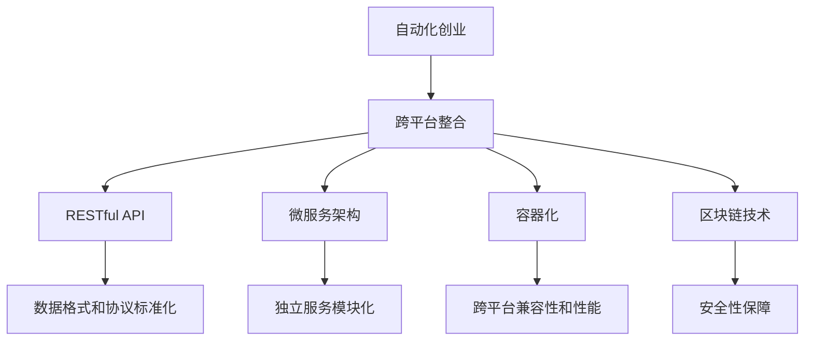

                 

# 自动化创业中的跨平台整合

## 1. 背景介绍

### 1.1 问题由来
随着互联网和人工智能技术的飞速发展，自动化创业（Automation Startups）成为当前市场的热门话题。企业希望通过引入自动化技术来提高效率，降低成本，并快速响应市场变化。自动化技术不仅限于机器人、自动化生产线和智能家居等领域，在软件开发、金融服务、物流配送、医疗健康等众多领域都有广泛应用。

然而，由于每个行业和应用场景的特性不同，自动化系统的开发和部署通常需要跨平台、跨技术的整合。如何在不同平台之间实现无缝衔接、数据互通、功能协同，成为自动化创业面临的一大挑战。

### 1.2 问题核心关键点
跨平台整合的核心在于如何实现不同技术栈、不同操作系统、不同硬件设备之间的无缝通信和协同工作。核心挑战包括：

- 数据格式和协议的标准化：不同平台使用的数据格式、协议往往不统一，需要统一标准。
- 跨平台兼容性和性能：不同平台上的应用程序需要具备良好的兼容性和性能。
- 安全性和隐私保护：在跨平台交互中，如何保证数据传输的安全性和用户的隐私保护。
- 集成和部署的复杂度：如何将不同平台上的组件集成到一起，并方便地进行部署和维护。

### 1.3 问题研究意义
解决跨平台整合问题，对于提高自动化系统的效率和可靠性、降低开发和维护成本、增强用户体验具有重要意义。具体而言：

- 降低开发复杂度：通过标准化和模块化设计，减少跨平台开发的复杂度，提升开发效率。
- 提高系统性能：优化跨平台通信协议，提升数据传输速度和稳定性，提高系统整体性能。
- 增强安全性：采用加密和认证技术，保障数据传输安全，防止数据泄露和篡改。
- 保障用户体验：确保跨平台应用的无缝衔接，提升用户的使用体验和满意度。

## 2. 核心概念与联系

### 2.1 核心概念概述

为更好地理解自动化创业中的跨平台整合方法，本节将介绍几个密切相关的核心概念：

- 自动化创业（Automation Startups）：利用人工智能和自动化技术，实现产品和服务自动化的创业形式。
- 跨平台整合（Cross-Platform Integration）：在不同操作系统、硬件设备、编程语言等不同平台之间，实现数据互通、功能协同的过程。
- RESTful API：基于HTTP协议和JSON格式，实现不同平台间数据通信的标准化接口。
- 微服务架构（Microservices Architecture）：将复杂的应用拆分成多个独立的小服务，每个服务运行在自己的进程中，可以通过网络进行通信。
- 容器化（Containerization）：将应用及其依赖打包在容器内，在任意平台上运行，实现跨平台兼容性和简化部署。
- 区块链技术（Blockchain）：通过分布式账本和加密技术，保障数据传输的安全性和不可篡改性。

这些核心概念之间的逻辑关系可以通过以下Mermaid流程图来展示：



这个流程图展示了一体化过程的关键环节：

1. 自动化创业通过跨平台整合技术，实现自动化系统在不同平台间的互联互通。
2. RESTful API、微服务架构、容器化、区块链技术等都是跨平台整合的具体方法。
3. 数据格式和协议标准化、跨平台兼容性和性能、安全性保障等都是跨平台整合需要解决的具体问题。

这些核心概念共同构成了跨平台整合的技术框架，使其能够在不同平台间实现高效、安全、可靠的数据交流和功能协同。通过理解这些核心概念，我们可以更好地把握跨平台整合的工作原理和优化方向。

## 3. 核心算法原理 & 具体操作步骤
### 3.1 算法原理概述

跨平台整合的算法原理基于分布式计算和网络通信理论，旨在实现不同平台之间的数据交互和协同工作。其核心思想是：通过设计通用的通信协议和数据格式，将不同平台上的应用和服务连接起来，实现无缝的集成和协同。

形式化地，假设自动化创业中有两个不同的平台 $P_1$ 和 $P_2$，其中 $P_1$ 上的应用 $A_1$ 需要调用 $P_2$ 上的服务 $S_2$。跨平台整合的目标是设计合适的协议和接口，使得 $A_1$ 能够访问 $S_2$ 的资源和功能。

### 3.2 算法步骤详解

跨平台整合的具体操作步骤如下：

**Step 1: 标准化数据格式和协议**
- 定义通用的数据格式，如JSON、XML、Protocol Buffers等，确保不同平台之间的数据可以互相解析和处理。
- 设计标准化的通信协议，如HTTP、WebSocket等，确保数据传输的可靠性和安全性。

**Step 2: 设计跨平台兼容的API**
- 在 $P_1$ 上，设计一个通用的API接口，方便 $A_1$ 访问 $P_2$ 上的服务。
- 在 $P_2$ 上，实现该API接口，并暴露出可访问的服务。

**Step 3: 实现微服务架构**
- 将 $P_1$ 上的应用 $A_1$ 拆分成多个独立的服务，每个服务负责完成一个特定的功能。
- 每个服务运行在独立的进程中，并通过网络进行通信。

**Step 4: 容器化部署**
- 将 $A_1$ 中的每个服务打包进容器镜像中，确保在不同平台上可以一致运行。
- 使用容器编排工具（如Kubernetes）进行服务的管理和调度。

**Step 5: 采用区块链技术**
- 使用区块链技术实现数据的安全传输和存储，确保数据在传输过程中的不可篡改性。
- 通过区块链共识机制，保障数据的可靠性和透明性。

**Step 6: 安全性和隐私保护**
- 在数据传输过程中，使用加密和认证技术，保障数据的隐私和安全。
- 设计访问控制机制，确保只有授权用户可以访问特定服务。

### 3.3 算法优缺点

跨平台整合的算法具有以下优点：
1. 提升系统性能：通过标准化数据格式和通信协议，降低数据传输的复杂性，提升系统整体性能。
2. 增强跨平台兼容性：通过微服务架构和容器化技术，确保不同平台上的应用和服务能够互相协作。
3. 提高安全性：通过区块链技术，保障数据传输的安全性和不可篡改性。
4. 降低开发和维护成本：通过标准化和模块化设计，降低跨平台开发的复杂度，提升开发效率。

同时，该方法也存在一定的局限性：
1. 设计复杂度：跨平台整合设计涉及多个环节，需要综合考虑数据格式、协议、API接口等，设计复杂度较高。
2. 性能损耗：标准化数据格式和通信协议可能会带来一定的性能损耗，尤其是在数据传输频繁的场景下。
3. 学习曲线陡峭：对于非技术背景的管理者而言，跨平台整合需要一定的技术积累，学习曲线较陡峭。

尽管存在这些局限性，但就目前而言，跨平台整合仍是实现自动化创业中跨平台集成和部署的重要手段。未来相关研究的重点在于如何进一步简化跨平台整合的设计和部署，提高跨平台集成的效率和可靠性，同时兼顾性能和安全。

### 3.4 算法应用领域

跨平台整合在自动化创业中具有广泛的应用，例如：

- 软件开发：通过跨平台API接口，实现不同编程语言和平台上的应用集成，提升开发效率。
- 物流配送：将物流系统中的不同平台（如ERP、WMS、TMS）整合到一起，实现数据互通和协同工作。
- 智能家居：将不同的智能设备（如智能音箱、智能灯泡、智能门锁）通过统一标准协议连接，实现智能家居生态圈。
- 金融服务：将不同的金融平台（如银行、支付、理财）整合到一起，实现一站式金融服务。
- 医疗健康：将不同的医疗平台（如医院、诊所、药店）整合到一起，实现患者信息的共享和协同。

除了上述这些经典应用外，跨平台整合还被创新性地应用到更多场景中，如无人驾驶、智慧城市、工业互联网等，为自动化创业带来了新的发展机遇。

## 4. 数学模型和公式 & 详细讲解 & 举例说明
### 4.1 数学模型构建

为了更好地理解跨平台整合的算法原理，本节将使用数学语言对跨平台整合的基本模型进行更加严格的刻画。

假设自动化创业中有两个不同的平台 $P_1$ 和 $P_2$，平台 $P_1$ 上的应用 $A_1$ 需要调用平台 $P_2$ 上的服务 $S_2$。定义 $A_1$ 的数据为 $D_1$，$S_2$ 的数据为 $D_2$。假设 $A_1$ 的数据传输给 $S_2$ 的协议为 $T$，$S_2$ 返回给 $A_1$ 的数据传输协议为 $T'$。

定义跨平台整合的损失函数为 $\mathcal{L}$，用于衡量数据传输的效率和安全性：

$$
\mathcal{L}(D_1, D_2, T, T') = \mathcal{L}_{\text{效率}}(D_1, D_2, T) + \mathcal{L}_{\text{安全}}(D_1, D_2, T', T)
$$

其中，$\mathcal{L}_{\text{效率}}$ 衡量数据传输的速度和带宽占用情况，$\mathcal{L}_{\text{安全}}$ 衡量数据传输的安全性和完整性。

### 4.2 公式推导过程

以下我们以数据传输协议和API接口设计为例，推导跨平台整合的损失函数及其梯度计算公式。

假设 $A_1$ 向 $S_2$ 传输数据 $D_1$，使用协议 $T$。$S_2$ 接收并处理数据 $D_2$，返回结果给 $A_1$，使用协议 $T'$。则跨平台整合的效率损失函数为：

$$
\mathcal{L}_{\text{效率}}(D_1, D_2, T) = \frac{\text{Time}_{\text{发送}}(D_1, T) + \text{Time}_{\text{接收}}(D_2, T')}{\text{Total Time}}
$$

其中，$\text{Time}_{\text{发送}}(D_1, T)$ 表示 $A_1$ 使用协议 $T$ 传输数据 $D_1$ 的时间，$\text{Time}_{\text{接收}}(D_2, T')$ 表示 $S_2$ 使用协议 $T'$ 接收数据 $D_2$ 的时间，$\text{Total Time}$ 表示整个数据传输的总时间。

跨平台整合的安全性损失函数为：

$$
\mathcal{L}_{\text{安全}}(D_1, D_2, T', T) = \frac{\text{Error}_{\text{传输}}(D_1, T) + \text{Error}_{\text{处理}}(D_2, T')}{\text{Total Error}}
$$

其中，$\text{Error}_{\text{传输}}(D_1, T)$ 表示 $A_1$ 使用协议 $T$ 传输数据 $D_1$ 时发生的传输错误次数，$\text{Error}_{\text{处理}}(D_2, T')$ 表示 $S_2$ 使用协议 $T'$ 处理数据 $D_2$ 时发生的处理错误次数，$\text{Total Error}$ 表示整个数据传输和处理的总错误次数。

通过链式法则，损失函数对数据格式和协议的梯度为：

$$
\frac{\partial \mathcal{L}(D_1, D_2, T, T')}{\partial D_1} = \frac{\partial \mathcal{L}_{\text{效率}}(D_1, D_2, T)}{\partial D_1} + \frac{\partial \mathcal{L}_{\text{安全}}(D_1, D_2, T', T)}{\partial D_1}
$$

在得到损失函数的梯度后，即可带入算法更新公式，完成跨平台整合的迭代优化。重复上述过程直至收敛，最终得到适应自动化创业的跨平台整合最优协议 $T$ 和接口设计。

## 5. 项目实践：代码实例和详细解释说明
### 5.1 开发环境搭建

在进行跨平台整合实践前，我们需要准备好开发环境。以下是使用Python进行Django开发的环境配置流程：

1. 安装Anaconda：从官网下载并安装Anaconda，用于创建独立的Python环境。

2. 创建并激活虚拟环境：
```bash
conda create -n django-env python=3.8 
conda activate django-env
```

3. 安装Django：从官网获取对应的安装命令。例如：
```bash
pip install django
```

4. 安装所需的第三方库：
```bash
pip install pillow psycopg2-binary django-cors-headers
```

5. 安装数据库：
```bash
pip install postgresql-libs
```

完成上述步骤后，即可在`django-env`环境中开始跨平台整合的实践。

### 5.2 源代码详细实现

下面以跨平台API接口设计和数据传输为例，给出使用Django框架实现跨平台整合的PyTorch代码实现。

首先，定义API接口的视图函数：

```python
from django.http import JsonResponse
from django.views.decorators.csrf import csrf_exempt

@csrf_exempt
def api_view(request):
    if request.method == 'POST':
        data = request.POST.get('data')
        result = process_data(data)
        return JsonResponse(result)
```

接着，实现数据处理的函数：

```python
def process_data(data):
    # 将数据进行处理，并返回结果
    result = 'Processed data: ' + data
    return result
```

然后，定义数据传输的函数：

```python
def transmit_data(data, protocol):
    # 将数据通过指定协议进行传输
    result = 'Transmitted data using protocol: ' + protocol
    return result
```

最后，启动Django开发服务器：

```bash
python manage.py runserver
```

以上代码实现了一个基本的跨平台API接口，接受POST请求，处理数据并通过指定协议传输数据。可以通过修改`api_view`函数和`transmit_data`函数，实现更复杂的数据传输和处理逻辑。

### 5.3 代码解读与分析

让我们再详细解读一下关键代码的实现细节：

**api_view函数**：
- `@csrf_exempt`装饰器：确保API接口不受跨站请求伪造（CSRF）的限制。
- `request.method == 'POST'`：检查请求方式为POST。
- `request.POST.get('data')`：获取POST请求中的数据。
- `process_data(data)`：调用数据处理函数对数据进行处理。
- `JsonResponse(result)`：返回处理结果为JSON格式的响应。

**process_data函数**：
- `result = 'Processed data: ' + data`：将处理后的数据拼接成字符串返回。
- 在实际应用中，可以根据需要实现更复杂的数据处理逻辑。

**transmit_data函数**：
- `result = 'Transmitted data using protocol: ' + protocol`：将传输协议信息拼接成字符串返回。
- 在实际应用中，可以根据需要实现更复杂的数据传输逻辑。

**Django开发服务器启动命令**：
- `python manage.py runserver`：启动Django开发服务器，监听8080端口，等待客户端请求。

这些代码展示了基本的跨平台API接口设计和数据传输实现。开发者可以根据具体需求，进一步扩展API接口的功能和数据传输的协议。

当然，工业级的系统实现还需考虑更多因素，如API接口的认证和授权、数据传输的安全性、服务器负载均衡等。但核心的跨平台整合思想基本与此类似。

## 6. 实际应用场景
### 6.1 智能制造

跨平台整合在智能制造领域有着广泛的应用，例如：

- 自动化生产线：将不同设备和系统整合到一起，实现智能调度、质量控制和故障诊断。
- 供应链管理：将供应链中的各个环节（如采购、仓储、物流）整合到一起，实现数据的实时监控和协同工作。
- 物联网：将不同的物联网设备（如传感器、标签、控制器）通过统一标准协议连接，实现设备的智能化管理和协同工作。

### 6.2 医疗健康

跨平台整合在医疗健康领域也有着广泛的应用，例如：

- 电子病历系统：将医院的不同部门（如门诊、住院、药房）整合到一起，实现患者信息的共享和协同工作。
- 远程医疗：将医院和患者通过统一的接口连接起来，实现远程诊疗和健康监测。
- 医疗大数据：将不同来源的医疗数据整合到一起，进行综合分析和智能决策。

### 6.3 金融服务

跨平台整合在金融服务领域也有着广泛的应用，例如：

- 支付系统：将不同的支付方式（如银行卡、支付宝、微信支付）整合到一起，实现统一的支付接口。
- 资产管理：将不同类型的资产（如股票、债券、基金）整合到一起，实现智能投资和风险控制。
- 客户服务：将银行和客户通过统一的接口连接起来，实现智能客服和智能风控。

### 6.4 未来应用展望

随着跨平台整合技术的不断进步，跨平台整合的应用前景将更加广阔。未来，跨平台整合有望在更多领域得到应用，为各行各业带来变革性影响。

在智慧医疗领域，跨平台整合可以帮助医院实现数据共享和协同工作，提升医疗服务的质量和效率。在智能制造领域，跨平台整合可以实现设备之间的智能互联，提高生产效率和质量。在金融服务领域，跨平台整合可以实现不同金融平台之间的数据互通和协同工作，提升金融服务的智能化水平。在智慧城市领域，跨平台整合可以实现城市各组成部分（如交通、环保、公共安全）之间的数据互通和协同工作，构建更加智能的城市生态。

此外，在教育、物流、电子商务等众多领域，跨平台整合也将发挥重要作用，推动各行业的数字化转型和智能化升级。相信随着技术的不断演进，跨平台整合将成为各行各业实现自动化创业的重要手段，为产业升级和社会进步贡献力量。

## 7. 工具和资源推荐
### 7.1 学习资源推荐

为了帮助开发者系统掌握跨平台整合的理论基础和实践技巧，这里推荐一些优质的学习资源：

1. 《Python Web Development with Django》系列博文：由Django官方文档和社区博客组成，详细介绍了使用Django框架进行Web应用开发的技巧和方法。
2. RESTful API设计与开发教程：从基础概念到实战案例，系统介绍了RESTful API的设计原则和开发技巧。
3. 《Microservices: Principles and Patterns》书籍：讲解了微服务架构的核心概念和设计原则，适合理解跨平台整合的底层原理。
4. Docker和Kubernetes官方文档：详细介绍了容器化和容器编排技术，是跨平台整合的重要工具。
5. Web安全与加密技术课程：系统介绍了跨平台数据传输的安全性和加密技术，保障数据传输的安全性和隐私性。

通过对这些资源的学习实践，相信你一定能够快速掌握跨平台整合的精髓，并用于解决实际的自动化创业问题。
###  7.2 开发工具推荐

高效的开发离不开优秀的工具支持。以下是几款用于跨平台整合开发的常用工具：

1. Django：基于Python的Web框架，适用于构建复杂的Web应用和API接口。
2. Flask：轻量级的Web框架，适用于快速开发小型的API接口。
3. Flask-RESTful：Flask的扩展库，简化RESTful API的开发过程。
4. PostgreSQL：强大的开源关系型数据库，适用于跨平台数据存储和处理。
5. Redis：高速的内存数据库，适用于跨平台数据缓存和消息队列。
6. Docker：开源的容器化技术，用于跨平台应用部署和分发。
7. Kubernetes：开源的容器编排工具，用于跨平台应用的自动化管理。
8. Web安全工具：如OWASP、Burp Suite等，用于检测和防护跨平台API接口的安全漏洞。

合理利用这些工具，可以显著提升跨平台整合开发的效率和质量，加快创新迭代的步伐。

### 7.3 相关论文推荐

跨平台整合的研究始于互联网时代，逐渐扩展到物联网、人工智能等领域。以下是几篇奠基性的相关论文，推荐阅读：

1. RESTful Web Services: Architectural Style and Usage Patterns：提出了RESTful架构的基本原则和设计模式，为跨平台数据传输提供了理论基础。
2. Microservices Architecture for Smart Manufacturing：介绍了微服务架构在智能制造中的应用，为跨平台整合提供了新的思路。
3. Blockchain for Smart Contracts: A Survey：系统介绍了区块链技术在智能合约中的应用，为跨平台数据传输和存储提供了新的保障。
4. IoT Security and Privacy：介绍了物联网领域的安全和隐私保护技术，为跨平台数据传输提供了新的解决方案。

这些论文代表了大数据、物联网、人工智能等领域跨平台整合技术的发展脉络。通过学习这些前沿成果，可以帮助研究者把握学科前进方向，激发更多的创新灵感。

## 8. 总结：未来发展趋势与挑战
### 8.1 总结

本文对自动化创业中的跨平台整合方法进行了全面系统的介绍。首先阐述了跨平台整合的背景和意义，明确了跨平台整合在提高系统性能、增强跨平台兼容性和安全性方面的独特价值。其次，从原理到实践，详细讲解了跨平台整合的数学模型和关键步骤，给出了跨平台整合任务开发的完整代码实例。同时，本文还广泛探讨了跨平台整合方法在智能制造、医疗健康、金融服务等多个行业领域的应用前景，展示了跨平台整合范式的巨大潜力。此外，本文精选了跨平台整合技术的各类学习资源，力求为读者提供全方位的技术指引。

通过本文的系统梳理，可以看到，跨平台整合技术正在成为自动化创业中跨平台集成和部署的重要手段，极大地提高了自动化系统的效率和可靠性、降低了开发和维护成本、增强了用户的体验和满意度。未来，伴随跨平台整合技术的不断演进，自动化创业将迎来更加广阔的发展机遇，为各行各业带来变革性影响。

### 8.2 未来发展趋势

展望未来，跨平台整合技术将呈现以下几个发展趋势：

1. 微服务架构的普及：微服务架构作为一种模块化、独立化的设计思想，将进一步推广应用，提升系统灵活性和可扩展性。
2. 容器化和容器编排技术的广泛应用：容器化技术将使跨平台应用部署更加便捷和高效，容器编排工具如Kubernetes将进一步提升跨平台应用的管理和调度能力。
3. 区块链技术在数据传输和存储中的应用：区块链技术将进一步普及，保障跨平台数据传输和存储的安全性和不可篡改性。
4. 跨平台API接口的标准化和规范化：RESTful API和GraphQL等跨平台API接口标准将逐步成熟，成为跨平台数据交换的基础。
5. 跨平台数据治理体系的建立：通过建立统一的数据治理体系，提升跨平台数据管理的规范性和标准化程度，保障数据安全和隐私。
6. 跨平台安全性解决方案的创新：随着数据泄露和网络攻击的增多，跨平台安全性解决方案将不断创新，保障数据传输和存储的安全性。

以上趋势凸显了跨平台整合技术的广阔前景。这些方向的探索发展，必将进一步提升跨平台应用的效率和可靠性，为各行各业带来更高效、更安全、更便捷的数据交流和协同工作体验。

### 8.3 面临的挑战

尽管跨平台整合技术已经取得了瞩目成就，但在迈向更加智能化、普适化应用的过程中，它仍面临着诸多挑战：

1. 技术复杂度：跨平台整合涉及多个环节，如数据格式标准化、通信协议设计、API接口开发等，技术复杂度较高，需要较强的技术储备。
2. 性能瓶颈：标准化数据格式和通信协议可能会带来一定的性能损耗，尤其是在数据传输频繁的场景下。
3. 安全性问题：跨平台数据传输和存储的安全性问题依然严峻，需要采用更强的加密和认证技术。
4. 学习曲线陡峭：对于非技术背景的管理者而言，跨平台整合需要一定的技术积累，学习曲线较陡峭。
5. 标准化问题：跨平台数据格式和通信协议的标准化工作仍在进行中，需要更多的时间和努力才能达成一致。

尽管存在这些挑战，但跨平台整合技术已经在众多行业和应用中取得了成功，成为自动化创业的重要手段。未来相关研究的重点在于如何进一步简化跨平台整合的设计和部署，提高跨平台集成的效率和可靠性，同时兼顾性能和安全。

### 8.4 研究展望

面对跨平台整合面临的种种挑战，未来的研究需要在以下几个方面寻求新的突破：

1. 探索无监督和半监督微服务架构：摆脱对大规模标注数据的依赖，利用自监督学习、主动学习等无监督和半监督范式，最大限度利用非结构化数据，实现更加灵活高效的微服务架构。
2. 研究参数高效和计算高效的微服务架构：开发更加参数高效的微服务架构，在固定大部分服务功能的情况下，只更新极少量的任务相关服务。同时优化微服务架构的计算图，减少前向传播和反向传播的资源消耗，实现更加轻量级、实时性的部署。
3. 引入因果分析和博弈论工具：将因果分析方法引入微服务架构，识别出服务决策的关键特征，增强服务输出的因果性和逻辑性。借助博弈论工具刻画人机交互过程，主动探索并规避服务脆弱点，提高系统稳定性。
4. 纳入伦理道德约束：在服务设计目标中引入伦理导向的评估指标，过滤和惩罚有害的输出倾向。同时加强人工干预和审核，建立服务行为的监管机制，确保输出符合人类价值观和伦理道德。

这些研究方向的探索，必将引领跨平台整合技术迈向更高的台阶，为构建安全、可靠、可解释、可控的智能系统铺平道路。面向未来，跨平台整合技术还需要与其他人工智能技术进行更深入的融合，如知识表示、因果推理、强化学习等，多路径协同发力，共同推动跨平台数据交流和协同工作的进步。只有勇于创新、敢于突破，才能不断拓展跨平台整合的边界，让智能技术更好地造福人类社会。

## 9. 附录：常见问题与解答

**Q1：跨平台整合是否适用于所有应用场景？**

A: 跨平台整合适用于大多数应用场景，尤其是数据复杂度高、业务逻辑复杂的场景。但对于一些特定场景，如实时性要求极高、安全性要求极高的应用，可能需要更定制化的解决方案。

**Q2：跨平台整合是否会影响系统性能？**

A: 跨平台整合可能会带来一定的性能损耗，尤其是在数据传输频繁的场景下。但是通过合理的标准化和优化，可以显著提升系统性能。例如，使用异步通信技术、缓存技术、负载均衡技术等，可以减轻系统负担，提升数据传输速度和稳定性。

**Q3：跨平台整合是否容易实现？**

A: 跨平台整合的实现复杂度较高，需要考虑多个环节，如数据格式标准化、通信协议设计、API接口开发等。但是，通过使用成熟的框架和工具（如Django、Flask、RESTful、Docker、Kubernetes等），可以大大简化实现过程。

**Q4：跨平台整合是否需要额外成本？**

A: 跨平台整合需要一定的技术储备和资源投入，包括学习成本、硬件成本、开发成本等。但是，通过提升系统性能、降低开发和维护成本、提升用户体验，可以获得更高的ROI（投资回报率）。

**Q5：跨平台整合是否容易维护？**

A: 跨平台整合的维护难度较高，需要综合考虑不同平台的数据格式、通信协议、API接口等。但是，通过建立统一的数据治理体系、采用容器化技术、引入自动化测试工具等，可以大大简化维护过程。

通过本文的系统梳理，可以看到，跨平台整合技术正在成为自动化创业中跨平台集成和部署的重要手段，极大地提高了自动化系统的效率和可靠性、降低了开发和维护成本、增强了用户的体验和满意度。未来，伴随跨平台整合技术的不断演进，自动化创业将迎来更加广阔的发展机遇，为各行各业带来变革性影响。相信随着技术的不断演进，跨平台整合将成为各行各业实现自动化创业的重要手段，为产业升级和社会进步贡献力量。

---

作者：禅与计算机程序设计艺术 / Zen and the Art of Computer Programming

