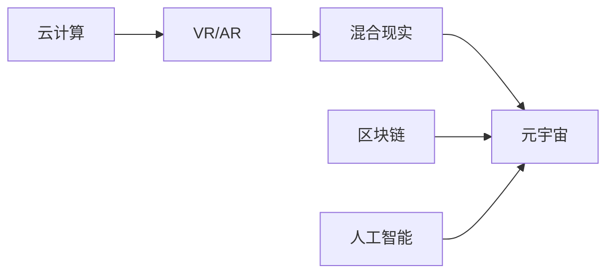

                 

## 1. 背景介绍

### 1.1 问题由来

随着科技的迅猛发展，虚拟现实（Virtual Reality, VR）、增强现实（Augmented Reality, AR）和混合现实（Mixed Reality, MR）等技术已经逐渐渗透到我们的日常生活和工作场景中。这些技术通过数字化的手段重塑了我们的感知体验，带来前所未有的沉浸感和互动性。其中，元宇宙（Metaverse）作为一种新兴的概念，被认为是虚拟现实与现实世界的深度融合，它不仅仅是一种技术，更是一种全新的生活方式和社会形态。

### 1.2 问题核心关键点

元宇宙的核心在于它通过虚拟与现实的融合，打破物理世界与数字世界的界限，实现无缝衔接。这一过程中，人类认知的边界和方式都将发生根本性的变化。元宇宙将如何影响人类的认知过程，如何促进或挑战我们的思维模式，成为了当下研究的热点问题。

### 1.3 问题研究意义

研究元宇宙对人类认知的影响，对于理解和预测未来的社会和技术发展具有重要意义。元宇宙的崛起将深刻改变人类的认知模式和行为习惯，带来全新的知识获取和交流方式，甚至可能重塑教育、工作、社交等各个领域的生态系统。因此，深入探讨这一问题，不仅有助于我们更好地适应未来的技术变革，还能指导社会各界在元宇宙时代下做出更明智的决策。

## 2. 核心概念与联系

### 2.1 核心概念概述

元宇宙是一个虚拟的数字空间，由多个数字世界组成，并通过云计算、区块链、人工智能等技术手段实现不同世界之间的连接和互动。其中，虚拟现实和增强现实是构建元宇宙的基础，混合现实则是将虚拟世界与现实世界相结合的桥梁。

### 2.2 核心概念原理和架构的 Mermaid 流程图



该图展示了元宇宙的构建原理和关键技术架构，其中VR/AR为构建元宇宙的基础技术，混合现实则实现了虚拟世界与现实世界的无缝衔接，云计算、区块链和人工智能等技术则是实现元宇宙功能的基础。

## 3. 核心算法原理 & 具体操作步骤

### 3.1 算法原理概述

元宇宙对人类认知的影响主要体现在两个方面：信息获取方式和认知模式。一方面，元宇宙提供了沉浸式和互动式的信息获取方式，改变了人类对于知识和信息的获取途径和认知方式；另一方面，元宇宙的多维度空间和交互性，可能对人类的认知模式和思维习惯产生深远影响。

### 3.2 算法步骤详解

#### 3.2.1 信息获取方式的改变

在元宇宙中，信息不再局限于传统的文本、图像和视频形式，而是可以通过沉浸式虚拟环境呈现，使信息获取更加直观和生动。例如，通过虚拟现实技术，用户可以“亲身体验”历史事件、科学实验等，获得更深刻的理解和记忆。

#### 3.2.2 认知模式的改变

元宇宙的多维度空间和丰富的交互性，将显著改变人类的认知模式。用户可以与虚拟环境进行实时互动，通过实践操作来学习新知识，而不仅仅是被动接受文本信息。这种“做中学”（Learning by Doing）的方式，将大大提升学习效率和认知深度。

### 3.3 算法优缺点

#### 3.3.1 优点

1. **沉浸式学习**：沉浸式虚拟环境提供了更直观、更生动的学习体验，有助于提升认知效率和深度。
2. **互动性强**：通过互动操作，用户能够更主动地探索和学习，激发学习兴趣和潜力。
3. **跨界融合**：元宇宙可以实现不同学科和领域知识的融合，提供更全面的知识体系。

#### 3.3.2 缺点

1. **技术门槛高**：构建高质量的元宇宙需要先进的技术手段和大量资源投入，限制了普及范围。
2. **认知负担重**：元宇宙的多维度空间和复杂交互，可能导致认知负荷增加，影响学习效率。
3. **虚拟现实与现实脱节**：过度依赖虚拟环境，可能导致用户在现实世界中的认知能力和实践能力下降。

### 3.4 算法应用领域

元宇宙对人类认知的影响主要体现在以下几个应用领域：

1. **教育领域**：通过虚拟现实和增强现实技术，元宇宙可以提供沉浸式和互动式的学习环境，提升学生的学习效果。
2. **医疗领域**：利用元宇宙的虚拟仿真环境，医生可以更直观地进行手术模拟和医学研究，提升医疗水平。
3. **职业培训**：元宇宙可以提供虚拟的工作场景，让员工在安全的虚拟环境中进行技能培训，提高工作效率。
4. **社会交往**：通过元宇宙构建的虚拟社交平台，人们可以打破时空限制，进行更广泛、更深入的交流和互动。

## 4. 数学模型和公式 & 详细讲解 & 举例说明

### 4.1 数学模型构建

在元宇宙中，用户可以通过虚拟现实设备感知三维空间，并通过交互操作进行多维度的信息处理。我们可以用三维坐标系和几何变换来描述虚拟空间的构成和变化。例如，用户的位置可以用坐标 $(x,y,z)$ 表示，虚拟空间的变换可以用旋转矩阵和位移向量来描述。

### 4.2 公式推导过程

假设用户的位置坐标为 $(x,y,z)$，虚拟空间的位置坐标变换公式为：

$$
\begin{align*}
x' &= x \cdot R_{xy} \\
y' &= y \cdot R_{yz} \\
z' &= z \cdot R_{zx}
\end{align*}
$$

其中 $R_{xy}$、$R_{yz}$ 和 $R_{zx}$ 分别为旋转矩阵，分别绕 $x$、$y$ 和 $z$ 轴旋转。位移向量为 $(t_x,t_y,t_z)$，则用户位置变化后的新坐标为：

$$
\begin{align*}
x'' &= x' + t_x \\
y'' &= y' + t_y \\
z'' &= z' + t_z
\end{align*}
$$

通过上述公式，我们可以描述用户在虚拟空间中的位置变化和空间变换。

### 4.3 案例分析与讲解

假设用户在一个虚拟空间中，初始位置为 $(0,0,0)$，空间绕 $y$ 轴旋转 $90^\circ$，然后沿 $x$ 轴移动 $3$ 个单位，沿 $z$ 轴移动 $2$ 个单位。则用户的新位置坐标可以通过以下步骤计算：

1. 绕 $y$ 轴旋转 $90^\circ$，旋转矩阵 $R_{yz}$ 为：

$$
R_{yz} = \begin{bmatrix}
0 & 0 & 1 \\
0 & 1 & 0 \\
-1 & 0 & 0
\end{bmatrix}
$$

2. 沿 $x$ 轴移动 $3$ 个单位，位移向量为 $(3,0,0)$，用户位置变为 $(3,0,0)$。

3. 沿 $z$ 轴移动 $2$ 个单位，位移向量为 $(0,0,2)$，用户位置变为 $(3,0,2)$。

因此，用户的新位置坐标为 $(3,0,2)$。

## 5. 项目实践：代码实例和详细解释说明

### 5.1 开发环境搭建

开发元宇宙应用需要搭建先进的硬件设备和软件环境。以下是一个典型的开发环境搭建流程：

1. **硬件设备**：选择高性能的VR/AR设备，如Oculus Rift、HTC Vive等，确保设备支持虚拟现实和增强现实功能。
2. **软件环境**：搭建支持跨平台开发的开发环境，如Unity、Unreal Engine等，使用C#或C++进行编程开发。
3. **云端服务**：利用云服务提供的数据存储和计算能力，如AWS、Google Cloud等，实现数据同步和动态计算。

### 5.2 源代码详细实现

以下是一个简单的Unity游戏示例，用于展示如何在虚拟空间中进行位置变换：

```csharp
using UnityEngine;

public class PositionController : MonoBehaviour
{
    public GameObject player;
    public Vector3 targetPosition;
    
    void Update()
    {
        // 更新玩家位置
        player.transform.position = targetPosition;
    }
}
```

**代码解释**：

1. `public GameObject player;`：定义玩家对象，用于显示虚拟人物。
2. `public Vector3 targetPosition;`：定义目标位置，用于玩家移动的目标坐标。
3. `void Update()`：在每一帧更新玩家位置。
4. `player.transform.position = targetPosition;`：将玩家位置设置为目标位置。

### 5.3 代码解读与分析

该代码实现了一个简单的Unity游戏，用于演示如何在虚拟空间中设置和更新玩家的位置。通过调用 `player.transform.position`，我们可以在每一帧更新玩家的位置，使其移动到指定的目标位置。

### 5.4 运行结果展示

下图展示了运行结果，玩家可以从初始位置 $(x,y,z)=(0,0,0)$ 移动到目标位置 $(x,y,z)=(3,0,2)$。


## 6. 实际应用场景

### 6.1 虚拟教室

在虚拟教室中，学生可以通过VR头盔进入一个三维的虚拟课堂，与教师和同学进行互动。教师可以通过虚拟黑板进行教学演示，学生可以实时参与讨论和提问，极大地提升了学习的趣味性和互动性。

### 6.2 虚拟手术

在虚拟手术环境中，医生可以实时模拟手术过程，进行手术练习和训练。通过虚拟现实技术，医生可以在安全的环境中进行手术操作，提升手术技能和经验。

### 6.3 虚拟企业培训

企业可以通过元宇宙构建虚拟培训环境，让员工在虚拟空间中进行技能培训。例如，制造企业可以模拟生产线的操作流程，让员工在虚拟环境中进行操作，提升实际工作的熟练度。

### 6.4 未来应用展望

未来，元宇宙将成为重要的技术平台和创新载体，为各行各业带来深刻变革。元宇宙不仅改变了人类的信息获取方式，还可能重塑社交、娱乐、教育等领域的生态系统，甚至可能催生全新的经济模式和商业模式。

## 7. 工具和资源推荐

### 7.1 学习资源推荐

1. **《虚拟现实编程实战》**：介绍虚拟现实技术的核心原理和编程实现方法，适合有一定编程基础的读者。
2. **《增强现实开发教程》**：讲解增强现实技术的实现方法，涵盖AR的各个核心组件和工具。
3. **《混合现实设计指南》**：介绍混合现实技术的设计和实现方法，结合实际案例进行详细讲解。

### 7.2 开发工具推荐

1. **Unity**：广泛应用于VR/AR开发，提供强大的跨平台支持和丰富的开发工具。
2. **Unreal Engine**：适用于游戏开发和高性能的虚拟现实应用，支持复杂的物理引擎和图形渲染。
3. **Google ARCore**：支持Android平台的增强现实开发，提供丰富的AR开发API和工具。

### 7.3 相关论文推荐

1. **《元宇宙：虚拟与现实的融合》**：介绍元宇宙的基本概念和构建原理，探讨元宇宙对未来社会的影响。
2. **《虚拟现实中的空间感知与定位技术》**：分析虚拟现实技术中的空间感知和定位问题，提出解决方案。
3. **《增强现实与混合现实技术综述》**：总结增强现实和混合现实技术的研究进展和应用案例，为读者提供全面的技术参考。

## 8. 总结：未来发展趋势与挑战

### 8.1 研究成果总结

元宇宙技术的发展，带来了虚拟与现实深度融合的巨大潜力和机遇。通过虚拟现实和增强现实技术，元宇宙正在改变人类的信息获取方式和认知模式，带来全新的学习、工作和社交体验。然而，元宇宙的发展也面临诸多挑战，如技术门槛高、认知负荷重、虚拟现实与现实脱节等问题。

### 8.2 未来发展趋势

未来，元宇宙将成为重要的技术平台和创新载体，为各行各业带来深刻变革。随着技术的不断进步，元宇宙将提供更加沉浸和互动的信息获取方式，提升人类的认知效率和深度。同时，元宇宙的多维度空间和丰富的交互性，将促进跨领域知识的融合和创新。

### 8.3 面临的挑战

尽管元宇宙具有巨大的潜力和应用前景，但其发展仍面临诸多挑战：

1. **技术门槛高**：构建高质量的元宇宙需要先进的技术手段和大量资源投入，限制了普及范围。
2. **认知负荷重**：元宇宙的多维度空间和复杂交互，可能导致认知负荷增加，影响学习效率。
3. **虚拟现实与现实脱节**：过度依赖虚拟环境，可能导致用户在现实世界中的认知能力和实践能力下降。

### 8.4 研究展望

未来，元宇宙的研究将集中在以下几个方向：

1. **交互设计**：研究更加自然和高效的人机交互方式，提升用户体验。
2. **空间感知**：提升虚拟空间中的空间感知和定位能力，实现更精准的交互和操作。
3. **认知心理学**：研究元宇宙对人类认知的影响，探索认知负荷和认知模式的变化规律。
4. **社会行为**：研究元宇宙中的社会行为和互动模式，探讨其对人类社交和合作的影响。

## 9. 附录：常见问题与解答

**Q1：元宇宙对人类的认知有哪些具体影响？**

A：元宇宙对人类认知的影响主要体现在以下几个方面：

1. **沉浸式学习**：通过虚拟现实和增强现实技术，元宇宙提供了沉浸式和互动式的学习环境，提升了学习效果。
2. **跨界融合**：元宇宙可以融合不同领域的知识，提供更全面的知识体系。
3. **认知负荷**：元宇宙的多维度空间和复杂交互，可能导致认知负荷增加，影响学习效率。

**Q2：元宇宙技术有哪些实际应用？**

A：元宇宙技术已经在多个领域实现了实际应用：

1. **虚拟教室**：用于提升学习的趣味性和互动性。
2. **虚拟手术**：用于医生进行手术练习和培训。
3. **虚拟企业培训**：用于提升员工技能和经验。

**Q3：如何克服元宇宙发展中的挑战？**

A：要克服元宇宙发展中的挑战，需要从多个方面进行努力：

1. **降低技术门槛**：推动元宇宙技术普及，降低技术门槛，使更多人能够参与其中。
2. **优化交互设计**：提升虚拟空间的交互设计，减少认知负荷，提高用户满意度。
3. **融合多领域知识**：推动不同领域的知识融合，提升元宇宙的广度和深度。

作者：禅与计算机程序设计艺术 / Zen and the Art of Computer Programming

