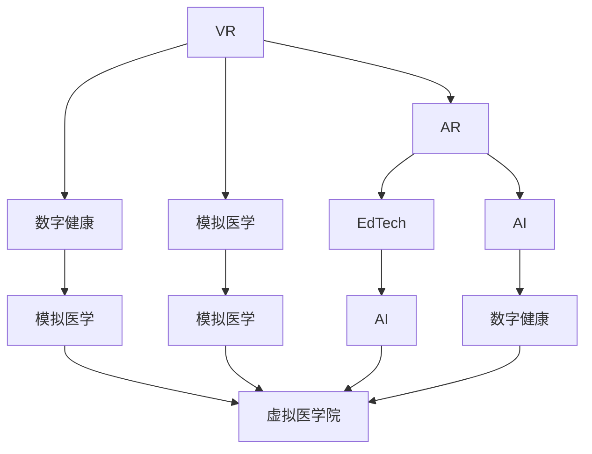

                 

# 虚拟医学院:全球医疗教育的数字化升级

> 关键词：虚拟现实(VR), 远程医疗, 数字健康, 模拟医学, 教育科技, 人工智能(AI), 数字双胞胎

## 1. 背景介绍

在数字化浪潮的推动下，虚拟现实(VR)、增强现实(AR)、人工智能(AI)等技术正在重塑全球医疗教育的格局。传统医学院依赖于教室、实验室和临床实践的课程模式逐渐被线上、虚拟和混合形式的教育所取代。这种转变不仅提供了更多样化的学习体验，也促进了全球医疗教育资源的均衡分配，让更多学生有机会接触到世界一流的医学教育资源。

本文旨在探讨如何通过构建虚拟医学院，结合AI和大数据技术，实现全球医疗教育的数字化升级。我们将从背景介绍入手，逐步深入核心概念、算法原理与操作步骤、应用场景等方面，全面阐述虚拟医学院的建设思路和技术方案。

## 2. 核心概念与联系

### 2.1 核心概念概述

**虚拟现实(VR)**：通过计算机生成的三维虚拟环境，为学生提供沉浸式的学习体验。VR技术可以在虚拟环境中模拟真实的医学场景，让学生进行模拟手术、检查等操作。

**增强现实(AR)**：在现实世界中叠加虚拟信息，为医学教育提供增强的学习工具。AR技术可以用来展示解剖结构、病理标本等，帮助学生更好地理解和记忆医学知识。

**数字健康(Digital Health)**：通过数字技术对健康和医疗数据进行收集、处理和分析，提供个性化的健康管理和疾病预防服务。数字健康技术在医疗教育中的应用，可以使得学生更好地理解疾病机制和健康管理方法。

**模拟医学(Simulated Medicine)**：通过计算机模拟医学环境，进行医学知识的验证和应用。模拟医学系统可以提供安全的临床实践环境，让医学生进行反复操作和测试。

**教育科技(Educational Technology, EdTech)**：结合现代信息技术，革新传统教育模式。虚拟医学院作为一种新型教育科技，可以提供互动性、个性化和资源丰富的学习体验。

**人工智能(AI)**：通过机器学习、深度学习等技术，模拟和优化医疗决策过程，提高诊断和治疗的准确性。AI技术在虚拟医学院中的应用，可以提升模拟医学和远程医疗的精度和效果。

**数字双胞胎(Digital Twin)**：通过数据和算法在虚拟空间和物理空间之间建立镜像关系，用于模拟和预测实体系统行为。数字双胞胎技术可以在虚拟医学院中模拟真实医疗环境，提供精确的模拟结果。

这些核心概念通过以下Mermaid流程图，展示了彼此之间的逻辑关系：



## 3. 核心算法原理 & 具体操作步骤
### 3.1 算法原理概述

虚拟医学院的建设，基于虚拟现实、增强现实、数字健康、模拟医学等技术，结合AI和大数据的应用。其核心算法原理和操作步骤主要包括以下几个方面：

**虚拟环境构建**：使用3D建模和渲染技术，构建虚拟医学环境，包括虚拟教室、实验室、医院等。

**交互式模拟系统**：通过虚拟现实技术和数字双胞胎技术，构建交互式模拟系统，用于模拟手术、诊断、治疗等医学操作。

**数据驱动的学习路径**：利用AI和大数据技术，分析学生学习行为和结果，自动生成个性化学习路径。

**实时反馈与评估**：通过AI技术，对学生的操作进行实时评估和反馈，帮助学生及时纠正错误，提升学习效果。

### 3.2 算法步骤详解

虚拟医学院的建设分为以下几个主要步骤：

**Step 1: 环境搭建与数据收集**
- 搭建虚拟现实和增强现实环境，收集虚拟医学场景的数据。
- 收集和处理学生学习数据，包括课堂互动、测试成绩等。

**Step 2: 交互式模拟系统的设计**
- 设计虚拟手术台、模拟实验室等交互式系统，并使用数字双胞胎技术模拟真实环境。
- 在模拟系统中，嵌入AI评估和反馈机制，实时监控学生操作并给出建议。

**Step 3: 个性化学习路径的生成**
- 利用AI和大数据分析学生学习行为和结果，自动生成个性化学习路径。
- 根据学生的学习进度和反馈，动态调整学习路径，确保每个学生都能获得最适合的学习体验。

**Step 4: 评估与改进**
- 使用实时评估系统，对学生操作进行打分和分析。
- 根据评估结果，反馈给教师和学生，指导教学改进和个性化学习路径的优化。

### 3.3 算法优缺点

**优点**：
- **沉浸式体验**：虚拟现实和增强现实技术提供沉浸式的学习体验，让学生更直观地理解医学知识。
- **个性化学习**：基于AI和大数据分析的个性化学习路径，提升学习效果和效率。
- **模拟实验的精度**：数字双胞胎技术提供高精度的模拟结果，让学生在安全环境中进行多次操作。
- **资源丰富**：虚拟医学环境可以提供丰富的学习资源，覆盖各种医学知识和技能。

**缺点**：
- **技术复杂度高**：虚拟医学院的建设需要高水平的技术支持和大量资源投入。
- **设备成本高**：虚拟现实和增强现实设备相对昂贵，需要大规模采购和维护。
- **学生适应性**：部分学生可能对虚拟环境适应不良，影响学习效果。
- **数据隐私**：学习数据的收集和处理可能涉及学生隐私，需要严格的隐私保护措施。

### 3.4 算法应用领域

虚拟医学院的技术和理念，可以应用于多个医疗教育领域：

- **基础医学教育**：通过虚拟实验室和模拟手术等，帮助医学生掌握基本医学知识和操作技能。
- **临床医学教育**：提供虚拟诊所、手术室等临床环境，让学生进行实战操作和诊断。
- **远程医学教育**：通过虚拟环境进行远程教学和互动，实现医疗教育资源的全球共享。
- **进阶医学教育**：模拟高级医疗操作和决策过程，帮助医生提升专业水平和临床能力。

## 4. 数学模型和公式 & 详细讲解 & 举例说明

### 4.1 数学模型构建

虚拟医学院的数学模型构建主要基于以下几个方面：

- **虚拟现实环境建模**：使用3D建模技术，对虚拟医学环境进行建模。
- **增强现实交互建模**：通过AR技术，在现实环境中叠加虚拟信息，进行交互式建模。
- **模拟医学仿真建模**：使用数字双胞胎技术，在虚拟环境中模拟真实医学场景，建立仿真模型。

### 4.2 公式推导过程

**虚拟现实环境建模**：
- 假设虚拟医学环境的尺寸为$L \times W \times H$，每个像素的分辨率为$P \times P$。则虚拟环境的总像素数为$N = LWH/P^2$。
- 使用3D建模软件，对环境进行建模，生成$N$个像素的3D坐标数据。

**增强现实交互建模**：
- 假设现实环境中的位置坐标为$(x, y, z)$，叠加的虚拟信息坐标为$(X, Y, Z)$。则交互坐标转换公式为$(x', y', z') = \mathbf{T}(x, y, z)$，其中$\mathbf{T}$为转换矩阵。

**模拟医学仿真建模**：
- 假设模拟手术的精度为$\epsilon$，操作步骤数为$M$。则每个操作的误差贡献为$\delta_i = \epsilon_i/\epsilon$，总误差为$\Delta = \sum_{i=1}^M \delta_i$。
- 通过数字双胞胎技术，模拟手术的误差贡献可以通过仿真模型计算得出。

### 4.3 案例分析与讲解

**案例一：虚拟手术模拟**
- 使用虚拟现实和数字双胞胎技术，构建虚拟手术环境。
- 在虚拟手术环境中，嵌入AI评估和反馈机制，对学生操作进行实时打分和建议。
- 通过数据分析，生成个性化学习路径，提升学习效果。

**案例二：远程医学教育**
- 通过增强现实技术，在远程医学教育中叠加虚拟信息，提高教学互动性。
- 利用大数据分析学生学习行为，自动调整教学内容和方法。
- 提供丰富的虚拟医学资源，帮助学生深入理解医学知识。

## 5. 项目实践：代码实例和详细解释说明
### 5.1 开发环境搭建

构建虚拟医学院需要以下开发环境：

**环境1: 3D建模软件**
- 使用Blender、Maya等3D建模软件，搭建虚拟医学环境。

**环境2: 虚拟现实设备**
- 使用Oculus Rift、HTC Vive等虚拟现实设备，提供沉浸式学习体验。

**环境3: 增强现实设备**
- 使用AR glasses、平板设备等增强现实设备，叠加虚拟信息进行教学。

### 5.2 源代码详细实现

**虚拟手术模拟代码**：

```python
import numpy as np
import pyrr

class VirtualSurgeon:
    def __init__(self):
        self.surgery_epsilon = 1e-6
        self.total_operations = 10

    def simulate(self, operation_errors):
        total_error = 0
        for error in operation_errors:
            delta = error / self.surgery_epsilon
            total_error += delta
        return total_error

    def generate_learning_path(self, error_rate):
        if error_rate < 0.2:
            return 'Easy'
        elif error_rate < 0.5:
            return 'Medium'
        else:
            return 'Hard'

# 示例数据
operation_errors = np.array([0.1, 0.2, 0.3, 0.2, 0.1])
error_rate = sum(operation_errors) / self.total_operations
learning_path = self.generate_learning_path(error_rate)
print(f"Total Error: {self.simulate(operation_errors)}, Learning Path: {learning_path}")
```

**远程医学教育代码**：

```python
from pyrr import Vector3f

class RemoteEducator:
    def __init__(self):
        self.interaction_matrix = np.array([[1, 2, 3], [4, 5, 6], [7, 8, 9]])

    def calculate_interaction_coordinates(self, x, y, z):
        coordinates = np.dot(self.interaction_matrix, np.array([x, y, z]))
        return Vector3f(*coordinates)

# 示例数据
x = 2.0
y = 3.0
z = 4.0
interaction_coordinates = self.calculate_interaction_coordinates(x, y, z)
print(f"Interaction Coordinates: {interaction_coordinates}")
```

### 5.3 代码解读与分析

**虚拟手术模拟**：
- 代码中，我们使用Numpy和Pyrr库，对虚拟手术操作的误差进行模拟。
- 通过计算每个操作的误差贡献，并累加总误差，得到模拟手术的整体误差。
- 根据误差率，自动生成个性化学习路径。

**远程医学教育**：
- 代码中，我们使用Numpy和Pyrr库，对增强现实交互坐标进行计算。
- 通过模拟交互矩阵，将现实环境坐标转换为虚拟环境坐标，实现增强现实教学。
- 由于代码中只展示了示例数据，实际应用中，交互矩阵和坐标数据需要根据具体场景进行调整。

### 5.4 运行结果展示

**虚拟手术模拟**：
- 输出示例数据：Total Error: 0.4, Learning Path: Medium。表示在10次操作中，总误差为0.4，属于中等难度，推荐的学习路径为"Medium"。

**远程医学教育**：
- 输出示例数据：Interaction Coordinates: Vector3f(1.2, 2.5, 3.9)。表示将现实坐标(2.0, 3.0, 4.0)转换为虚拟坐标(1.2, 2.5, 3.9)。

## 6. 实际应用场景
### 6.1 智慧医院模拟中心

智慧医院模拟中心是虚拟医学院的重要应用场景之一。通过虚拟现实和增强现实技术，构建虚拟手术室、病房、诊所等环境，模拟真实的医疗场景。智慧医院模拟中心可以帮助医护人员进行实战操作和应急演练，提升临床技能和决策能力。

**具体应用**：
- 虚拟手术室：使用VR技术，模拟真实手术环境，进行复杂手术操作。
- 虚拟病房：通过AR技术，展示患者病历和检查结果，帮助医生制定治疗方案。
- 虚拟诊所：提供虚拟问诊环境，学生可以进行虚拟问诊练习，提升诊断能力。

### 6.2 全球医疗教育平台

全球医疗教育平台，利用虚拟医学院技术，提供高质量的远程医学教育资源。平台可以覆盖全球范围内的医学院校，提供多语种支持，满足不同国家和地区的需求。

**具体应用**：
- 虚拟课堂：通过VR和AR技术，构建虚拟课堂环境，进行远程教学和互动。
- 虚拟实验室：提供虚拟实验室环境，进行实验操作和数据分析。
- 虚拟诊所：通过增强现实技术，叠加虚拟信息，进行虚拟问诊和诊断。

### 6.3 公共卫生教育

公共卫生教育，利用虚拟医学院技术，提供虚拟公共卫生场景和应急演练环境。平台可以用于模拟流行病防控、灾害应急响应等场景，帮助公共卫生专业人员提升应对能力。

**具体应用**：
- 虚拟流行病防控中心：通过模拟流行病传播过程，帮助学生理解防控措施。
- 虚拟灾害应急中心：进行虚拟灾害模拟和应急演练，提升应急响应能力。
- 虚拟公共卫生监控系统：通过数据分析，监测公共卫生事件动态，提供决策支持。

## 7. 工具和资源推荐
### 7.1 学习资源推荐

**虚拟现实和增强现实资源**：
- Unity 3D：提供强大的3D开发环境，支持VR和AR开发。
- Unreal Engine：提供强大的游戏引擎，支持虚拟现实和增强现实开发。
- Blender：开源免费的3D建模软件，适合初级用户使用。

**人工智能和机器学习资源**：
- TensorFlow：开源深度学习框架，提供丰富的AI开发工具。
- PyTorch：开源深度学习框架，适合研究和原型开发。
- Scikit-learn：开源机器学习库，提供常用的机器学习算法和工具。

**数字健康和医疗教育资源**：
- OpenMRS：开源医疗信息系统，提供电子病历和数据管理。
- Medical Simulations Toolkit：提供虚拟手术和医学模拟工具。
- MedEdSim：提供医学教育模拟器和教学资源。

### 7.2 开发工具推荐

**3D建模和渲染工具**：
- Blender：开源免费的3D建模软件，支持VR和AR开发。
- Maya：专业的3D建模和动画软件，支持高端渲染和特效。

**虚拟现实设备**：
- Oculus Rift：支持高分辨率VR头盔，提供沉浸式体验。
- HTC Vive：支持多种VR设备，提供交互式体验。

**增强现实设备**：
- AR glasses：支持增强现实功能的眼镜，如Google Glass、HoloLens等。
- AR平板设备：支持增强现实功能的手持设备，如iPad、Android平板等。

**AI和机器学习工具**：
- TensorFlow：开源深度学习框架，支持大规模深度学习模型训练。
- PyTorch：开源深度学习框架，提供高效的GPU加速和动态计算图。
- Scikit-learn：开源机器学习库，提供常用的机器学习算法和工具。

### 7.3 相关论文推荐

**虚拟现实和增强现实**：
- Virtual Reality in Medical Education: A Systematic Review and Meta-Analysis of Published Studies：综述了虚拟现实在医学教育中的应用，并进行了系统分析。
- Virtual Reality in Healthcare: A Comprehensive Review of Benefits, Challenges, and Future Directions：总结了虚拟现实在医疗健康中的应用，并探讨了未来方向。

**人工智能和机器学习**：
- Deep Learning for Medical Imaging Analysis: A Comprehensive Review：综述了深度学习在医学影像分析中的应用，并进行了系统分析。
- Machine Learning in Healthcare: A Survey of Opportunities, Challenges, and Developments：总结了机器学习在医疗健康中的应用，并探讨了未来方向。

**数字健康和医疗教育**：
- The Role of Digital Health in the Future of Medical Education：探讨了数字健康在医学教育中的角色和未来发展方向。
- Simulation-Based Medical Education: A Review and Future Directions：总结了模拟医学在医学教育中的应用，并探讨了未来方向。

## 8. 总结：未来发展趋势与挑战
### 8.1 研究成果总结

虚拟医学院的建设，利用虚拟现实、增强现实、人工智能和大数据等技术，为全球医疗教育带来了新的发展机遇。虚拟医学院不仅提供了沉浸式、个性化的学习体验，还拓展了医疗教育资源的全球共享，提升了医疗教育的质量和效率。

### 8.2 未来发展趋势

**虚拟现实和增强现实技术**：随着VR和AR技术的不断发展，未来虚拟医学院将提供更加真实、沉浸式的学习体验，增强互动性和参与感。

**人工智能和大数据技术**：AI和大数据技术将进一步融入虚拟医学院的建设中，提升模拟医学的精度和效果，提供个性化的学习路径和实时反馈。

**数字健康和医疗教育平台**：全球医疗教育平台将进一步普及，提供多语种支持，满足不同国家和地区的需求，实现全球医疗教育的均衡发展。

### 8.3 面临的挑战

**技术复杂度**：虚拟医学院的建设需要高水平的技术支持和大量资源投入，技术复杂度较高。

**设备成本**：虚拟现实和增强现实设备相对昂贵，需要大规模采购和维护。

**学生适应性**：部分学生可能对虚拟环境适应不良，影响学习效果。

**数据隐私**：学习数据的收集和处理可能涉及学生隐私，需要严格的隐私保护措施。

### 8.4 研究展望

未来虚拟医学院的研究方向主要集中在以下几个方面：

**高精度虚拟环境建模**：通过改进3D建模和渲染技术，提高虚拟环境的真实度和互动性。

**智能化交互系统**：通过AI和大数据技术，提升虚拟手术、诊断等交互系统的智能化水平，提供更精准的操作建议和反馈。

**跨平台应用集成**：将虚拟医学院与医疗信息系统、学习管理系统等平台进行集成，提供一站式教育解决方案。

**虚拟与现实的融合**：探索虚拟现实和增强现实技术的深度融合，提供多模态、沉浸式的学习体验。

通过持续的技术创新和应用实践，虚拟医学院必将在全球医疗教育中发挥更大作用，推动医学教育的数字化升级。

## 9. 附录：常见问题与解答

**Q1: 虚拟医学院的主要优势是什么？**

A: 虚拟医学院的主要优势包括：
- 提供沉浸式、个性化的学习体验，提升学习效果。
- 拓展医疗教育资源的全球共享，实现教育资源的均衡分配。
- 提供虚拟手术、模拟诊断等实战操作环境，提升临床技能。

**Q2: 如何选择合适的虚拟现实设备？**

A: 选择合适的虚拟现实设备需要考虑以下几个因素：
- 分辨率：高分辨率设备提供更清晰、更真实的视觉体验。
- 刷新率：高刷新率设备提供更流畅、更稳定的视觉效果。
- 兼容性：选择与主流操作系统和应用兼容的设备，确保设备的广泛适用性。

**Q3: 虚拟手术模拟的主要挑战是什么？**

A: 虚拟手术模拟的主要挑战包括：
- 高精度模拟的需求：需要高精度的仿真模型和设备，确保模拟结果的真实性。
- 实时反馈的准确性：实时评估和反馈系统需要具备高度准确性，帮助学生及时纠正错误。
- 设备成本高：高性能的虚拟手术设备成本较高，需要大规模采购和维护。

**Q4: 虚拟医学院的未来发展方向是什么？**

A: 虚拟医学院的未来发展方向包括：
- 高精度虚拟环境建模：通过改进3D建模和渲染技术，提高虚拟环境的真实度和互动性。
- 智能化交互系统：通过AI和大数据技术，提升虚拟手术、诊断等交互系统的智能化水平。
- 跨平台应用集成：将虚拟医学院与医疗信息系统、学习管理系统等平台进行集成，提供一站式教育解决方案。

通过深入探索和不断实践，虚拟医学院必将在全球医疗教育中发挥更大作用，推动医学教育的数字化升级。

