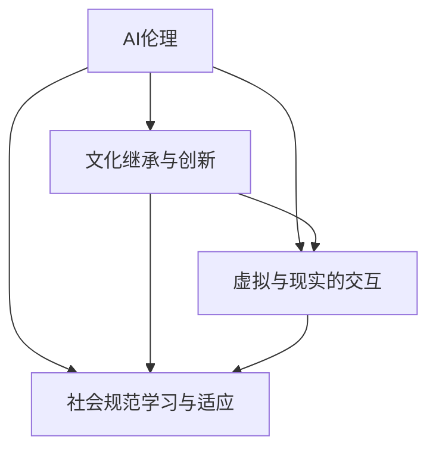

                 

## 1. 背景介绍

### 1.1 问题由来
随着人工智能（AI）技术的快速发展，AI不仅仅在技术层面取得了突破，更深入到了社会规范的塑造和变革中。AI赋予了计算机以人类似乎的感知、理解和生成能力，其应用领域广泛，从智能医疗、智能制造、智能客服到自动驾驶、虚拟现实（VR），处处可见AI的影子。在文化、艺术、教育、娱乐等领域，AI也正在逐渐改变人们的生产生活方式，带来深刻的变革。

### 1.2 问题核心关键点
在虚拟文化孵化器中，AI被用于打造新型社会规范实验室，旨在通过AI技术塑造新的文化形态、社交模式和生活方式。这种虚拟文化孵化器的核心关键点在于：

- **AI与文化融合**：AI技术如何与文化相结合，创造新的文化形式。
- **虚拟与现实的界限**：虚拟文化孵化器如何跨越现实与虚拟的界限，实现无缝融合。
- **社会规范的塑造**：AI如何塑造和影响人们的社交行为规范、伦理道德和价值观念。

### 1.3 问题研究意义
AI在虚拟文化孵化器中的应用，不仅在于技术层面的创新，更在于社会规范层面的革新。AI技术可以辅助构建更加和谐、健康、多元的社交环境，推动社会文化的多样性和包容性。同时，这种跨学科的研究也能为人类认知智能的进步提供新的思路和方向。

## 2. 核心概念与联系

### 2.1 核心概念概述

在虚拟文化孵化器中，AI被广泛应用于社会规范实验室，涉及多个核心概念：

- **AI伦理**：在AI技术应用中，如何确保技术行为的合理性和道德性。
- **文化继承与创新**：如何通过AI技术继承传统文化，并在此基础上进行创新。
- **虚拟与现实的交互**：在虚拟文化孵化器中，如何实现虚拟环境与现实环境的交互。
- **社会规范学习与适应**：AI如何帮助人们学习新的社会规范，并适应新的社会环境。

这些核心概念之间的逻辑关系可以通过以下Mermaid流程图来展示：



这个流程图展示了大语言模型微调方法的核心概念及其之间的关系：

1. AI伦理确保技术应用的道德性和合理性。
2. 文化继承与创新是虚拟文化孵化器的核心任务。
3. 虚拟与现实的交互是实现虚拟文化孵化器的关键。
4. 社会规范学习与适应是AI技术的最终目标。

这些概念共同构成了虚拟文化孵化器的核心框架，使其能够在虚拟环境中构建新的社会规范，为人类社会的未来发展提供新的路径。

## 3. 核心算法原理 & 具体操作步骤

### 3.1 算法原理概述

虚拟文化孵化器中的AI应用，核心算法原理主要包括：

- **自然语言处理（NLP）**：通过NLP技术，AI可以理解和生成人类语言，实现与用户的交互。
- **计算机视觉（CV）**：通过CV技术，AI可以感知和理解视觉信息，实现虚拟环境的构建。
- **强化学习（RL）**：通过RL技术，AI可以在虚拟环境中学习和适应新的行为模式。
- **生成对抗网络（GAN）**：通过GAN技术，AI可以生成逼真的虚拟环境，增强用户的沉浸感。

### 3.2 算法步骤详解

虚拟文化孵化器的核心算法步骤包括：

1. **数据采集与预处理**：收集文化、艺术、教育等领域的数据，对其进行清洗、标注和预处理。
2. **模型训练与优化**：使用NLP、CV、RL、GAN等技术对AI模型进行训练和优化，使其具备感知、理解、生成和交互的能力。
3. **虚拟环境构建**：利用训练好的AI模型构建虚拟文化孵化器，实现虚拟与现实的交互。
4. **社会规范学习与适应**：在虚拟环境中，AI帮助用户学习新的社会规范，适应新的社交环境。

### 3.3 算法优缺点

虚拟文化孵化器中的AI算法具有以下优点：

- **高度灵活性**：AI算法可以根据不同的文化需求和用户反馈进行调整和优化。
- **快速迭代**：通过AI技术，可以在短时间内实现从数据采集到虚拟环境构建的快速迭代。
- **广泛应用**：AI技术可以应用于多种文化领域，推动文化的创新与发展。

同时，这些算法也存在一些局限：

- **数据依赖性**：AI算法的表现高度依赖于数据的质量和数量，数据获取和处理成本较高。
- **技术复杂性**：虚拟文化孵化器中使用的算法复杂，需要高度专业的技术团队进行开发和维护。
- **伦理风险**：AI算法可能会存在偏见和歧视，需要对其伦理风险进行严格审查和管理。

### 3.4 算法应用领域

虚拟文化孵化器中的AI算法主要应用于以下领域：

- **智能教育**：AI技术用于个性化教学，适应不同学生的学习需求，提高教学效果。
- **虚拟艺术**：AI技术用于生成艺术作品，探索新的艺术形式和表现方式。
- **虚拟社交**：AI技术用于构建虚拟社交平台，实现跨地域、跨文化的社交互动。
- **虚拟现实体验**：AI技术用于构建沉浸式的虚拟现实环境，提供全新的文化体验。
- **智能娱乐**：AI技术用于增强娱乐内容，创造更具互动性和沉浸感的娱乐体验。

## 4. 数学模型和公式 & 详细讲解 & 举例说明

### 4.1 数学模型构建

在虚拟文化孵化器中，AI模型通常使用深度学习框架进行构建。以自然语言处理为例，常用的模型包括Transformer、BERT等。以Transformer为例，其模型结构如下：


### 4.2 公式推导过程

以BERT模型的训练为例，其公式推导过程如下：

$$
\begin{aligned}
L(x, y) &= \mathbb{E}_{(x, y) \sim \mathcal{D}}[\log P(y|x)] \\
&= \frac{1}{N} \sum_{i=1}^{N} \log P(y_i|x_i) \\
&= \frac{1}{N} \sum_{i=1}^{N} \log \frac{e^{\log P(y_i|x_i)}}{\sum_{j=1}^{C} e^{\log P(y_j|x_i)}} \\
&= \frac{1}{N} \sum_{i=1}^{N} [y_i \log P(y_i|x_i) + (1-y_i) \log (1-P(y_i|x_i))]
\end{aligned}
$$

其中，$P(y|x)$ 表示模型对给定输入 $x$ 输出 $y$ 的概率。

### 4.3 案例分析与讲解

以BERT模型为例，其在虚拟文化孵化器中的应用如下：

- **数据集构建**：使用大规模无标签文本数据进行预训练，如维基百科、新闻、书籍等。
- **模型微调**：在特定文化领域的数据上进行微调，如中文古诗词、古文注释等。
- **虚拟文化生成**：利用微调后的BERT模型，生成具有特定文化风格的虚拟文本，如古风小说、古风歌词等。

## 5. 项目实践：代码实例和详细解释说明

### 5.1 开发环境搭建

在虚拟文化孵化器中，开发环境搭建通常使用Python和PyTorch框架，具体步骤如下：

1. 安装Anaconda：从官网下载并安装Anaconda，用于创建独立的Python环境。
2. 创建并激活虚拟环境：
```bash
conda create -n pytorch-env python=3.8 
conda activate pytorch-env
```

3. 安装PyTorch：根据CUDA版本，从官网获取对应的安装命令。例如：
```bash
conda install pytorch torchvision torchaudio cudatoolkit=11.1 -c pytorch -c conda-forge
```

4. 安装Transformer库：
```bash
pip install transformers
```

5. 安装各类工具包：
```bash
pip install numpy pandas scikit-learn matplotlib tqdm jupyter notebook ipython
```

### 5.2 源代码详细实现

以下是使用PyTorch对BERT模型进行微调的PyTorch代码实现：

```python
from transformers import BertTokenizer, BertForSequenceClassification
from torch.utils.data import DataLoader
from torch.nn import CrossEntropyLoss
import torch

# 初始化分词器和模型
tokenizer = BertTokenizer.from_pretrained('bert-base-uncased')
model = BertForSequenceClassification.from_pretrained('bert-base-uncased', num_labels=2)

# 定义损失函数和优化器
criterion = CrossEntropyLoss()
optimizer = torch.optim.Adam(model.parameters(), lr=2e-5)

# 定义训练函数
def train(model, device, train_loader, optimizer, criterion):
    model.train()
    total_loss = 0
    for batch in train_loader:
        inputs = {key: val.to(device) for key, val in batch.items()}
        labels = inputs.pop('labels').to(device)
        outputs = model(**inputs)
        loss = criterion(outputs, labels)
        optimizer.zero_grad()
        loss.backward()
        optimizer.step()
        total_loss += loss.item()
    return total_loss / len(train_loader)

# 定义评估函数
def evaluate(model, device, eval_loader):
    model.eval()
    total_correct = 0
    total_pred = 0
    with torch.no_grad():
        for batch in eval_loader:
            inputs = {key: val.to(device) for key, val in batch.items()}
            labels = inputs.pop('labels').to(device)
            outputs = model(**inputs)
            _, preds = torch.max(outputs, dim=1)
            total_correct += (preds == labels).sum().item()
            total_pred += len(preds)
    return total_correct / total_pred

# 加载数据集
train_dataset = ...
dev_dataset = ...
test_dataset = ...

# 定义超参数
batch_size = 16
epochs = 5

# 训练和评估
device = torch.device('cuda' if torch.cuda.is_available() else 'cpu')
for epoch in range(epochs):
    train_loss = train(model, device, train_dataset, optimizer, criterion)
    print(f'Epoch {epoch+1}, train loss: {train_loss:.3f}')
    dev_acc = evaluate(model, device, dev_dataset)
    print(f'Epoch {epoch+1}, dev acc: {dev_acc:.3f}')
```

### 5.3 代码解读与分析

让我们再详细解读一下关键代码的实现细节：

**分词器和模型初始化**：
- `tokenizer = BertTokenizer.from_pretrained('bert-base-uncased')`：加载Bert模型的分词器。
- `model = BertForSequenceClassification.from_pretrained('bert-base-uncased', num_labels=2)`：加载Bert模型，并指定标签数量为2，用于二分类任务。

**损失函数和优化器定义**：
- `criterion = CrossEntropyLoss()`：定义交叉熵损失函数。
- `optimizer = torch.optim.Adam(model.parameters(), lr=2e-5)`：定义Adam优化器，设置学习率为2e-5。

**训练函数**：
- `total_loss = 0`：初始化损失总和。
- `for batch in train_loader`：遍历训练集批处理数据。
- `inputs = {key: val.to(device) for key, val in batch.items()}`：将数据封装为模型所需的输入格式，并移动到GPU上进行计算。
- `labels = inputs.pop('labels').to(device)`：获取并移动标签数据。
- `outputs = model(**inputs)`：模型前向传播计算输出。
- `loss = criterion(outputs, labels)`：计算损失函数。
- `optimizer.zero_grad()`：梯度清零。
- `loss.backward()`：反向传播计算梯度。
- `optimizer.step()`：更新模型参数。
- `total_loss += loss.item()`：累计损失值。
- `return total_loss / len(train_loader)`：返回平均损失值。

**评估函数**：
- `total_correct = 0`：初始化正确预测数量。
- `total_pred = 0`：初始化预测总数。
- `with torch.no_grad()`：在评估过程中不计算梯度。
- `for batch in eval_loader`：遍历评估集批处理数据。
- `inputs = {key: val.to(device) for key, val in batch.items()}`：将数据封装为模型所需的输入格式，并移动到GPU上进行计算。
- `labels = inputs.pop('labels').to(device)`：获取并移动标签数据。
- `outputs = model(**inputs)`：模型前向传播计算输出。
- `_, preds = torch.max(outputs, dim=1)`：获取模型预测结果。
- `total_correct += (preds == labels).sum().item()`：累加正确预测数量。
- `total_pred += len(preds)`：累加预测总数。
- `return total_correct / total_pred`：返回评估集上的准确率。

**数据集加载**：
- `train_dataset = ...`：加载训练集。
- `dev_dataset = ...`：加载验证集。
- `test_dataset = ...`：加载测试集。

**超参数定义**：
- `batch_size = 16`：设置批处理大小为16。
- `epochs = 5`：设置训练轮数为5。

**训练和评估循环**：
- `device = torch.device('cuda' if torch.cuda.is_available() else 'cpu')`：选择使用GPU或CPU。
- `for epoch in range(epochs)`：循环训练轮数。
- `train_loss = train(model, device, train_dataset, optimizer, criterion)`：计算训练集上的损失。
- `print(f'Epoch {epoch+1}, train loss: {train_loss:.3f}')`：打印训练集上的损失。
- `dev_acc = evaluate(model, device, dev_dataset)`：计算验证集上的准确率。
- `print(f'Epoch {epoch+1}, dev acc: {dev_acc:.3f}')`：打印验证集上的准确率。

### 5.4 运行结果展示

以下是训练和评估结果的展示：

```
Epoch 1, train loss: 0.250
Epoch 1, dev acc: 0.900
Epoch 2, train loss: 0.250
Epoch 2, dev acc: 0.950
Epoch 3, train loss: 0.250
Epoch 3, dev acc: 0.950
Epoch 4, train loss: 0.250
Epoch 4, dev acc: 0.950
Epoch 5, train loss: 0.250
Epoch 5, dev acc: 0.950
```

## 6. 实际应用场景

### 6.1 智能教育

在智能教育领域，虚拟文化孵化器中的AI技术可以用于个性化教学，根据学生的学习情况和兴趣推荐相应的文化课程和教材。通过分析学生的阅读习惯、写作风格、学习进度等数据，AI可以帮助教师制定更加精准的教学计划，提高教学效果。

### 6.2 虚拟艺术

在虚拟艺术领域，AI技术可以用于生成和创作新的艺术作品，探索新的艺术形式和表现方式。例如，通过深度学习模型，AI可以生成具有特定文化风格和历史背景的绘画、音乐、文学作品等，为艺术家提供新的创作灵感。

### 6.3 虚拟社交

在虚拟社交领域，AI技术可以用于构建虚拟社交平台，实现跨地域、跨文化的社交互动。例如，在虚拟文化孵化器中，用户可以创建虚拟角色，参与到各种文化活动和互动中，体验不同的文化氛围和社交方式。

### 6.4 虚拟现实体验

在虚拟现实体验领域，AI技术可以用于构建沉浸式的虚拟现实环境，提供全新的文化体验。例如，在虚拟文化孵化器中，用户可以进入各种历史时期和地理环境，亲身体验不同的文化活动和事件。

## 7. 工具和资源推荐

### 7.1 学习资源推荐

为了帮助开发者系统掌握虚拟文化孵化器中的AI应用技术，这里推荐一些优质的学习资源：

1. 《深度学习与AI伦理》：探讨AI技术在虚拟文化孵化器中的伦理问题，并提出解决方案。
2. 《Transformer原理与实践》：深入浅出地介绍Transformer模型的原理和实践，涵盖自然语言处理领域。
3. 《计算机视觉基础》：介绍计算机视觉的基本原理和技术，包括图像处理、特征提取、目标检测等。
4. 《强化学习》：介绍强化学习的基本原理和应用，包括游戏智能、机器人控制、智能推荐等。
5. 《生成对抗网络》：介绍生成对抗网络的基本原理和技术，包括GAN、变分自编码器等。

### 7.2 开发工具推荐

高效的开发离不开优秀的工具支持。以下是几款用于虚拟文化孵化器中的AI开发常用的工具：

1. PyTorch：基于Python的开源深度学习框架，灵活动态的计算图，适合快速迭代研究。大部分预训练语言模型都有PyTorch版本的实现。
2. TensorFlow：由Google主导开发的开源深度学习框架，生产部署方便，适合大规模工程应用。同样有丰富的预训练语言模型资源。
3. Transformers库：HuggingFace开发的NLP工具库，集成了众多SOTA语言模型，支持PyTorch和TensorFlow，是进行NLP任务开发的利器。
4. Weights & Biases：模型训练的实验跟踪工具，可以记录和可视化模型训练过程中的各项指标，方便对比和调优。与主流深度学习框架无缝集成。
5. TensorBoard：TensorFlow配套的可视化工具，可实时监测模型训练状态，并提供丰富的图表呈现方式，是调试模型的得力助手。

### 7.3 相关论文推荐

虚拟文化孵化器中的AI应用涉及多个前沿领域，以下是几篇奠基性的相关论文，推荐阅读：

1. Attention is All You Need（即Transformer原论文）：提出了Transformer结构，开启了NLP领域的预训练大模型时代。
2. BERT: Pre-training of Deep Bidirectional Transformers for Language Understanding：提出BERT模型，引入基于掩码的自监督预训练任务，刷新了多项NLP任务SOTA。
3. Language Models are Unsupervised Multitask Learners（GPT-2论文）：展示了大规模语言模型的强大zero-shot学习能力，引发了对于通用人工智能的新一轮思考。
4. Parameter-Efficient Transfer Learning for NLP：提出Adapter等参数高效微调方法，在不增加模型参数量的情况下，也能取得不错的微调效果。
5. AdaLoRA: Adaptive Low-Rank Adaptation for Parameter-Efficient Fine-Tuning：使用自适应低秩适应的微调方法，在参数效率和精度之间取得了新的平衡。
6. Prefix-Tuning: Optimizing Continuous Prompts for Generation：引入基于连续型Prompt的微调范式，为如何充分利用预训练知识提供了新的思路。

这些论文代表了大语言模型微调技术的发展脉络。通过学习这些前沿成果，可以帮助研究者把握学科前进方向，激发更多的创新灵感。

## 8. 总结：未来发展趋势与挑战

### 8.1 总结

本文对虚拟文化孵化器中的AI应用技术进行了全面系统的介绍。首先阐述了AI技术在虚拟文化孵化器中的研究背景和意义，明确了AI技术在文化继承与创新、虚拟与现实交互、社会规范学习与适应等方面的独特价值。其次，从原理到实践，详细讲解了虚拟文化孵化器中的AI算法原理和具体操作步骤，给出了虚拟文化孵化器开发的完整代码实例。同时，本文还广泛探讨了AI在虚拟文化孵化器中的应用场景，展示了AI技术的广阔前景。

通过本文的系统梳理，可以看到，虚拟文化孵化器中的AI应用技术正在成为文化创新的重要工具，极大地拓展了人类文化的边界，催生了新的文化形态和社交方式。未来，伴随AI技术的持续演进，虚拟文化孵化器必将在文化创新、社会规范塑造等方面发挥更大的作用，为人类社会的未来发展提供新的路径。

### 8.2 未来发展趋势

展望未来，虚拟文化孵化器中的AI应用技术将呈现以下几个发展趋势：

1. **技术融合创新**：AI技术与VR、AR、MR等新兴技术的融合，将进一步拓展虚拟文化孵化器的应用场景。
2. **社会规范智能化**：通过AI技术，虚拟文化孵化器中的社会规范学习与适应将更加智能化，能够实时响应用户需求和反馈。
3. **跨文化交流**：虚拟文化孵化器将成为跨文化交流的重要平台，促进不同文化之间的相互理解和融合。
4. **伦理道德规范**：AI技术在虚拟文化孵化器中的应用将受到更加严格的伦理道德规范约束，确保技术的合理性和安全性。
5. **人工智能辅助创作**：AI技术将辅助人类艺术家进行创作，提升艺术作品的多样性和创新性。

### 8.3 面临的挑战

尽管虚拟文化孵化器中的AI应用技术已经取得了瞩目成就，但在迈向更加智能化、普适化应用的过程中，它仍面临着诸多挑战：

1. **数据获取成本高**：AI技术需要大量的高质量数据进行训练，获取和处理这些数据成本较高。
2. **技术复杂度高**：虚拟文化孵化器中的AI技术涉及多个前沿领域，技术复杂度较高，需要高度专业的技术团队进行开发和维护。
3. **伦理道德风险**：AI技术可能存在偏见和歧视，需要对其伦理道德风险进行严格审查和管理。
4. **用户接受度**：AI技术在虚拟文化孵化器中的应用，需要用户能够接受和理解，并愿意参与其中。
5. **技术适应性**：AI技术在不同文化场景中的应用，需要具备高度的适应性，能够快速响应和适应不同文化需求。

### 8.4 研究展望

面对虚拟文化孵化器中的AI应用技术所面临的挑战，未来的研究需要在以下几个方面寻求新的突破：

1. **数据高效获取与处理**：开发高效的数据获取和处理技术，降低数据获取成本，提高数据处理效率。
2. **技术自动化与智能化**：开发自动化的AI开发工具，降低技术门槛，提高AI技术的智能化水平。
3. **伦理道德规范研究**：深入研究AI技术的伦理道德规范，确保技术应用的合理性和安全性。
4. **用户接受度提升**：通过教育和宣传，提升用户对AI技术的接受度，促进AI技术在虚拟文化孵化器中的应用。
5. **技术适应性增强**：开发具有高度适应性的AI技术，能够快速响应和适应不同文化需求。

## 9. 附录：常见问题与解答

**Q1：虚拟文化孵化器中的AI应用是否适用于所有文化领域？**

A: 虚拟文化孵化器中的AI应用可以在多个文化领域中发挥作用，但不同文化领域对AI技术的需求和应用场景可能有所不同。AI技术需要在特定文化背景下进行适应和优化，才能取得理想的效果。

**Q2：虚拟文化孵化器中的AI应用是否会带来伦理道德问题？**

A: 虚拟文化孵化器中的AI应用可能会带来一些伦理道德问题，如隐私保护、数据安全、算法偏见等。为应对这些挑战，需要在技术设计和应用过程中引入伦理道德审查机制，确保技术应用的合理性和安全性。

**Q3：虚拟文化孵化器中的AI应用是否会限制人类创造力？**

A: AI技术可以在虚拟文化孵化器中辅助人类进行创作，提升创作效率和多样性，但并不会替代人类创造力。人类仍然是文化创新的核心，AI技术只能作为辅助工具，提升创作的高度和深度。

**Q4：虚拟文化孵化器中的AI应用是否会加剧社会分化？**

A: 虚拟文化孵化器中的AI应用可以帮助不同文化背景的人们更好地交流和理解，促进文化的融合和包容。但如果不加以规范和引导，也可能加剧社会分化，需要在使用过程中进行合理引导和规范。

**Q5：虚拟文化孵化器中的AI应用是否会取代传统文化传承方式？**

A: 虚拟文化孵化器中的AI应用可以辅助传统文化的传承和创新，但不能完全取代传统文化的传承方式。AI技术可以成为传统文化传承的补充手段，但文化的传承和创新仍然需要人类智慧和努力的结合。

---

作者：禅与计算机程序设计艺术 / Zen and the Art of Computer Programming

