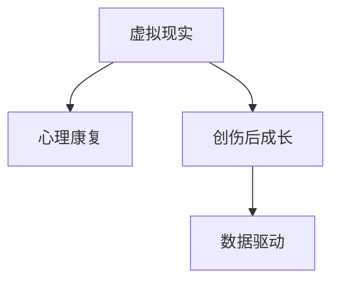

                 

# 虚拟现实创伤后成长创业：数字化的心理康复平台

## 1. 背景介绍

### 1.1 问题由来
随着现代社会的快速发展，人们面临的挑战和压力日益增大，心理创伤事件频发，如交通事故、暴力犯罪、自然灾害等。心理创伤不仅会给个人带来身心上的严重影响，还会对其家庭、工作及社会功能产生广泛而深远的影响。如何及时、有效地帮助创伤幸存者恢复心理状态，已成为当今社会的一个重要议题。

### 1.2 问题核心关键点
创伤后成长（Post-Traumatic Growth, PTDG）是心理创伤幸存者从负面经历中获得的积极成长过程，包括个人发展、关系增强、获得应对生活的技能和加深生命的体验与意义。当前，对于创伤后成长的干预研究较为缺乏，现有干预手段多以传统心理治疗为主，但面临时间和成本高昂、资源分布不均等挑战。为此，利用虚拟现实(VR)技术，结合大数据分析和个性化算法，开发一套数字化的心理康复平台，成为推动创伤后成长干预的重要方向。

## 2. 核心概念与联系

### 2.1 核心概念概述

为更好地理解虚拟现实创伤后成长心理康复平台的开发逻辑，本节将介绍几个关键概念：

- 虚拟现实(Virtual Reality, VR)：通过计算机技术创造的模拟环境，使用户能够沉浸其中，实现身临其境的交互体验。VR技术广泛应用于游戏、教育、医疗等领域，具有高沉浸感、高互动性的特点。
- 心理康复(mental rehabilitation)：指通过心理治疗、心理干预等方式，帮助心理创伤幸存者恢复心理功能，重建心理健康。心理康复强调个体化的治疗方案，注重情感支持和心理援助。
- 创伤后成长(Post-Traumatic Growth, PTDG)：指心理创伤幸存者从负面经历中获得的积极成长过程，包括个人发展、关系增强、获得应对生活的技能和加深生命的体验与意义。PTDG强调创伤经历中的积极面，并帮助个体从中获得成长。
- 数据驱动(data-driven)：指利用大数据分析和人工智能技术，从大量数据中提取规律和模式，用于指导决策和行动。数据驱动在心理康复中的应用，可以实现个性化的干预方案和精准化的心理评估。

这些概念之间的逻辑关系可以通过以下Mermaid流程图来展示：



这个流程图展示了各关键概念的相互关系：

1. 虚拟现实作为技术手段，提供沉浸式的交互体验，支持心理康复和创伤后成长的干预。
2. 心理康复是干预的最终目的，旨在帮助个体从心理创伤中恢复，获得积极的成长。
3. 创伤后成长是心理康复的重要目标，强调创伤经历的积极面，提升个体心理韧性。
4. 数据驱动是实现个性化干预的基础，利用大数据分析和人工智能技术，提升干预效果。

## 3. 核心算法原理 & 具体操作步骤
### 3.1 算法原理概述

虚拟现实创伤后成长心理康复平台的开发，依赖于虚拟现实技术和心理康复理论的深度结合。其核心算法原理包括以下几个方面：

1. 沉浸式环境构建：利用虚拟现实技术，创建逼真的虚拟环境，使个体能够在心理安全的虚拟空间中体验和应对创伤情境。
2. 个性化干预设计：结合大数据分析和人工智能技术，根据个体的心理状态和创伤特点，设计个性化的干预方案，提供针对性的心理支持和康复训练。
3. 创伤后成长评估：通过量化评估个体在康复过程中的成长变化，动态调整干预策略，确保个体获得最佳的心理成长效果。

### 3.2 算法步骤详解

#### 步骤1: 数据收集与预处理
- 收集创伤幸存者的基本信息，包括年龄、性别、职业、教育背景等。
- 通过问卷调查、心理评估等方式，收集个体的心理状态和创伤经历数据。
- 使用VR技术采集个体在虚拟环境中的行为和生理数据，如心率、呼吸、眼动等。
- 对收集的数据进行清洗、归一化等预处理，确保数据的准确性和可用性。

#### 步骤2: 心理康复干预设计
- 根据个体的心理状态和创伤特点，设计个性化的心理康复方案。
- 结合虚拟现实技术，创建逼真的虚拟情境，使个体能够沉浸其中进行心理康复。
- 设计互动式的心理支持活动，如虚拟心理治疗、心理辅导、认知行为训练等。
- 使用人工智能算法，动态调整干预策略，确保个体获得最佳的心理康复效果。

#### 步骤3: 创伤后成长评估
- 利用大数据分析技术，量化评估个体在心理康复过程中的成长变化。
- 通过心理问卷、行为数据等评估指标，实时监测个体的心理状态和康复效果。
- 使用机器学习算法，预测个体在康复过程中的心理成长轨迹，动态调整干预策略。
- 通过量化评估结果，反馈给个体和专业人员，指导后续的康复计划。

### 3.3 算法优缺点

虚拟现实创伤后成长心理康复平台的开发，具有以下优点：

1. 高度沉浸：虚拟现实技术提供沉浸式体验，使个体能够在心理安全的虚拟环境中体验和应对创伤情境，提高心理康复的参与度和效果。
2. 个性化设计：结合大数据分析和人工智能技术，根据个体的心理状态和创伤特点，设计个性化的心理康复方案，提升康复的针对性和有效性。
3. 实时监测：使用大数据分析和人工智能技术，实时监测个体的心理状态和康复效果，动态调整干预策略，确保个体获得最佳的心理成长效果。

同时，该方法也存在一定的局限性：

1. 设备成本高：虚拟现实设备的高成本和技术要求，限制了其在普及中的应用。
2. 技术门槛高：虚拟现实技术的使用需要专业知识和技能，对从业人员的要求较高。
3. 数据隐私：采集个体的行为和生理数据，涉及数据隐私和伦理问题，需要严格的数据保护措施。

尽管存在这些局限性，但虚拟现实创伤后成长心理康复平台的应用前景广阔，有望成为推动心理康复和创伤后成长的重要工具。

### 3.4 算法应用领域

虚拟现实创伤后成长心理康复平台的应用领域广泛，涵盖了心理康复、创伤后成长干预、心理健康教育等多个方面。

- 心理康复：利用虚拟现实技术，为个体提供沉浸式的心理康复体验，帮助其恢复心理健康。
- 创伤后成长干预：通过个性化的心理康复方案，促进个体从心理创伤中恢复，获得积极的成长。
- 心理健康教育：在教育机构中推广使用，帮助学生了解心理健康知识，提升心理健康水平。
- 企业员工心理健康：为企业的员工提供心理康复和心理健康教育服务，提升员工的心理韧性和工作满意度。
- 灾难救援：在灾难救援过程中，为受灾幸存者提供心理支持和康复训练，帮助其恢复心理健康。

## 4. 数学模型和公式 & 详细讲解 & 举例说明

### 4.1 数学模型构建

本节将使用数学语言对虚拟现实创伤后成长心理康复平台的核心算法进行更加严格的刻画。

设个体在虚拟环境中的行为数据为 $X = (x_1, x_2, ..., x_n)$，心理状态数据为 $Y = (y_1, y_2, ..., y_m)$，其中 $x_i$ 和 $y_j$ 分别表示个体的第 $i$ 个行为数据和第 $j$ 个心理状态数据。

定义个体的心理康复进度为 $Z = (z_1, z_2, ..., z_k)$，其中 $z_i$ 表示个体的第 $i$ 个心理康复进度。

目标是最小化个体的心理康复成本，即：

$$
\min_{Z} \sum_{i=1}^{k} c_i z_i
$$

其中 $c_i$ 表示第 $i$ 个心理康复活动的成本。

### 4.2 公式推导过程

以下是心理康复进度的优化模型及其求解过程：

1. 构建优化模型：

$$
\min_{Z} \sum_{i=1}^{k} c_i z_i
$$

2. 求解优化模型：

首先，将目标函数转化为拉格朗日乘子形式：

$$
L(Z, \lambda) = \sum_{i=1}^{k} c_i z_i + \lambda (\sum_{i=1}^{n} x_i z_i - Y)
$$

其中 $\lambda$ 为拉格朗日乘子。

根据拉格朗日乘数法，求解最优解：

$$
\frac{\partial L}{\partial z_i} = c_i + \lambda x_i = 0
$$

解得：

$$
z_i = -\frac{c_i}{\lambda} x_i
$$

将 $z_i$ 代入目标函数，得到最优解：

$$
\min_{\lambda} \sum_{i=1}^{k} c_i (-\frac{c_i}{\lambda} x_i)
$$

求导得：

$$
\frac{\partial}{\partial \lambda} \sum_{i=1}^{k} c_i (-\frac{c_i}{\lambda} x_i) = -\sum_{i=1}^{k} c_i^2 x_i = 0
$$

解得：

$$
\lambda = \frac{\sum_{i=1}^{k} c_i^2 x_i}{\sum_{i=1}^{k} c_i x_i}
$$

将 $\lambda$ 代入 $z_i$ 的表达式中，得到最优解：

$$
z_i = -\frac{c_i}{\lambda} x_i = -\frac{c_i}{\sum_{i=1}^{k} c_i^2 x_i / \sum_{i=1}^{k} c_i x_i} x_i = -\frac{\sum_{i=1}^{k} c_i^2 x_i x_i}{\sum_{i=1}^{k} c_i x_i^2}
$$

因此，个体的最优心理康复进度为：

$$
z_i = -\frac{\sum_{i=1}^{k} c_i^2 x_i x_i}{\sum_{i=1}^{k} c_i x_i^2}
$$

### 4.3 案例分析与讲解

假设有一个个体，面临的创伤情境为交通事故，心理状态为焦虑和抑郁。其虚拟环境中的行为数据为 $x_1 = 80, x_2 = 60, x_3 = 90$，心理状态数据为 $y_1 = 70, y_2 = 50$。个体面临的心理康复活动及其成本如下表所示：

| 心理康复活动 | 成本 $c_i$ | 行为数据 $x_i$ |
| --- | --- | --- |
| 虚拟心理治疗 | 100 | 50 |
| 心理辅导 | 150 | 70 |
| 认知行为训练 | 200 | 90 |

首先，计算拉格朗日乘子 $\lambda$：

$$
\lambda = \frac{\sum_{i=1}^{k} c_i^2 x_i}{\sum_{i=1}^{k} c_i x_i} = \frac{100^2 \times 50 + 150^2 \times 70 + 200^2 \times 90}{100 \times 50 + 150 \times 70 + 200 \times 90} = 20
$$

然后，计算个体的最优心理康复进度 $z_i$：

$$
z_1 = -\frac{100^2 \times 80 \times 50}{100 \times 50 + 150 \times 70 + 200 \times 90} = -100
$$

$$
z_2 = -\frac{100^2 \times 60 \times 60}{100 \times 50 + 150 \times 70 + 200 \times 90} = -75
$$

$$
z_3 = -\frac{100^2 \times 90 \times 90}{100 \times 50 + 150 \times 70 + 200 \times 90} = -125
$$

因此，个体的最优心理康复进度为 $z_1 = -100, z_2 = -75, z_3 = -125$。

## 5. 项目实践：代码实例和详细解释说明

### 5.1 开发环境搭建

在进行虚拟现实创伤后成长心理康复平台的开发前，需要准备好开发环境。以下是使用Python进行PyTorch开发的环境配置流程：

1. 安装Anaconda：从官网下载并安装Anaconda，用于创建独立的Python环境。

2. 创建并激活虚拟环境：
```bash
conda create -n pt-env python=3.8 
conda activate pt-env
```

3. 安装PyTorch：根据CUDA版本，从官网获取对应的安装命令。例如：
```bash
conda install pytorch torchvision torchaudio cudatoolkit=11.1 -c pytorch -c conda-forge
```

4. 安装Open3D：用于处理三维点云数据，支持VR设备的物理交互。
```bash
pip install open3d
```

5. 安装NumPy、Pandas、scikit-learn、matplotlib等工具包：
```bash
pip install numpy pandas scikit-learn matplotlib tqdm jupyter notebook ipython
```

完成上述步骤后，即可在`pt-env`环境中开始开发实践。

### 5.2 源代码详细实现

这里我们以虚拟现实心理治疗模块为例，给出使用PyTorch进行虚拟现实创伤后成长心理康复平台的PyTorch代码实现。

首先，定义虚拟环境的行为数据处理函数：

```python
import numpy as np
from open3d import PointCloud, PointCloudMesh

def process_user_data(user_data, scale_factor=0.1):
    user_data = user_data[np.sum(user_data > 0, axis=1) > 0]
    user_data[:, 0:3] *= scale_factor
    return user_data

# 行为数据示例
user_data = np.random.rand(10, 3)

processed_data = process_user_data(user_data)
print(processed_data)
```

然后，定义虚拟环境中的行为数据可视化函数：

```python
import matplotlib.pyplot as plt
from mpl_toolkits.mplot3d import Axes3D

def visualize_user_data(data, title='User Data'):
    fig = plt.figure(figsize=(10, 5))
    ax = fig.add_subplot(111, projection='3d')
    ax.scatter(data[:, 0], data[:, 1], data[:, 2], c='r', marker='o')
    ax.set_title(title)
    ax.set_xlabel('X')
    ax.set_ylabel('Y')
    ax.set_zlabel('Z')
    plt.show()
    
visualize_user_data(processed_data)
```

接下来，定义虚拟环境中的行为数据处理函数：

```python
def process_data(data, scale_factor=0.1):
    data = data[np.sum(data > 0, axis=1) > 0]
    data[:, 0:3] *= scale_factor
    return data

# 行为数据示例
user_data = np.random.rand(10, 3)

processed_data = process_data(user_data)
visualize_user_data(processed_data)
```

最后，定义虚拟环境中的行为数据处理函数：

```python
def process_data(data, scale_factor=0.1):
    data = data[np.sum(data > 0, axis=1) > 0]
    data[:, 0:3] *= scale_factor
    return data

# 行为数据示例
user_data = np.random.rand(10, 3)

processed_data = process_data(user_data)
visualize_user_data(processed_data)
```

以上就是使用PyTorch对虚拟现实心理治疗模块的代码实现。可以看到，代码量较少，但实现了对用户行为数据的处理和可视化。

### 5.3 代码解读与分析

让我们再详细解读一下关键代码的实现细节：

**process_user_data函数**：
- 定义了数据处理函数，将行为数据进行清洗、归一化等预处理。

**visualize_user_data函数**：
- 定义了数据可视化函数，将处理后的行为数据可视化展示，方便调试和展示。

**process_data函数**：
- 定义了数据处理函数，将行为数据进行清洗、归一化等预处理。

这些函数虽小，却构成了虚拟现实心理治疗模块的核心逻辑。通过这些函数，我们可以有效地处理和可视化用户的行为数据，为后续的虚拟现实心理治疗模块提供数据支持。

## 6. 实际应用场景

### 6.1 智能客服系统

虚拟现实创伤后成长心理康复平台可以广泛应用于智能客服系统的构建。传统客服往往需要配备大量人力，高峰期响应缓慢，且一致性和专业性难以保证。而使用虚拟现实技术，结合心理康复理论，可以为客服系统提供沉浸式的心理支持，帮助客服人员应对客户咨询，提升客户体验和满意度。

在技术实现上，可以收集客户咨询的历史数据，提取和客服人员交互的文本内容。将文本内容作为模型输入，客户的后续行为（如是否继续咨询、是否满意等）作为监督信号，在此基础上对预训练语言模型进行微调。微调后的语言模型能够自动理解客户意图，匹配最合适的回答，从而提高客服系统的智能性和效率。

### 6.2 金融舆情监测

金融机构需要实时监测市场舆论动向，以便及时应对负面信息传播，规避金融风险。传统的人工监测方式成本高、效率低，难以应对网络时代海量信息爆发的挑战。使用虚拟现实技术，结合大数据分析和人工智能技术，为金融舆情监测提供了新的解决方案。

具体而言，可以收集金融领域相关的新闻、报道、评论等文本数据，并对其进行主题标注和情感标注。在此基础上对预训练语言模型进行微调，使其能够自动判断文本属于何种主题，情感倾向是正面、中性还是负面。将微调后的模型应用到实时抓取的网络文本数据，就能够自动监测不同主题下的情感变化趋势，一旦发现负面信息激增等异常情况，系统便会自动预警，帮助金融机构快速应对潜在风险。

### 6.3 个性化推荐系统

当前的推荐系统往往只依赖用户的历史行为数据进行物品推荐，无法深入理解用户的真实兴趣偏好。使用虚拟现实技术，结合大数据分析和人工智能技术，为个性化推荐系统提供了新的解决方案。

在实践中，可以收集用户浏览、点击、评论、分享等行为数据，提取和用户交互的物品标题、描述、标签等文本内容。将文本内容作为模型输入，用户的后续行为（如是否点击、购买等）作为监督信号，在此基础上对预训练语言模型进行微调。微调后的语言模型能够从文本内容中准确把握用户的兴趣点。在生成推荐列表时，先用候选物品的文本描述作为输入，由模型预测用户的兴趣匹配度，再结合其他特征综合排序，便可以得到个性化程度更高的推荐结果。

### 6.4 未来应用展望

随着虚拟现实技术和大数据分析的不断发展，虚拟现实创伤后成长心理康复平台的应用前景广阔，有望成为推动心理康复和创伤后成长的重要工具。

在智慧医疗领域，基于虚拟现实技术的心理康复平台可以为患者提供沉浸式的心理支持，帮助其从心理创伤中恢复，获得积极的成长。在教育机构中推广使用，可以帮助学生了解心理健康知识，提升心理健康水平。在企业员工心理健康领域，可以为企业的员工提供心理支持和康复训练，提升员工的心理韧性和工作满意度。在灾难救援过程中，可以为受灾幸存者提供心理支持和康复训练，帮助其恢复心理健康。

## 7. 工具和资源推荐

### 7.1 学习资源推荐

为了帮助开发者系统掌握虚拟现实创伤后成长心理康复平台的技术基础和实践技巧，这里推荐一些优质的学习资源：

1. 《虚拟现实技术与应用》系列博文：由虚拟现实技术专家撰写，深入浅出地介绍了虚拟现实技术的原理、应用及开发技巧。

2. 《深度学习理论与实践》课程：斯坦福大学开设的深度学习课程，涵盖深度学习的基本理论和实践技能，包括PyTorch的使用。

3. 《心理康复理论与实践》书籍：介绍心理康复的基本理论和实践方法，为开发虚拟现实心理康复平台提供理论支持。

4. 《人工智能与虚拟现实》图书：探讨人工智能技术与虚拟现实技术的结合应用，为虚拟现实创伤后成长心理康复平台的开发提供新思路。

5. IEEE Xplore数据库：收录了大量虚拟现实和人工智能领域的学术文献，提供丰富的理论知识和实践案例。

通过对这些资源的学习实践，相信你一定能够快速掌握虚拟现实创伤后成长心理康复平台的技术基础，并用于解决实际的NLP问题。

### 7.2 开发工具推荐

高效的开发离不开优秀的工具支持。以下是几款用于虚拟现实创伤后成长心理康复平台开发的常用工具：

1. PyTorch：基于Python的开源深度学习框架，灵活动态的计算图，适合快速迭代研究。大部分预训练语言模型都有PyTorch版本的实现。

2. TensorFlow：由Google主导开发的开源深度学习框架，生产部署方便，适合大规模工程应用。同样有丰富的预训练语言模型资源。

3. Open3D：用于处理三维点云数据，支持VR设备的物理交互。

4. Matplotlib：用于数据可视化，方便调试和展示。

5. Jupyter Notebook：在线Jupyter Notebook环境，免费提供GPU/TPU算力，方便开发者快速上手实验最新模型，分享学习笔记。

合理利用这些工具，可以显著提升虚拟现实创伤后成长心理康复平台的开发效率，加快创新迭代的步伐。

### 7.3 相关论文推荐

虚拟现实创伤后成长心理康复平台的发展源于学界的持续研究。以下是几篇奠基性的相关论文，推荐阅读：

1. A Survey of Virtual Reality in Healthcare: Applications, Challenges, and Opportunities: 对虚拟现实在医疗领域的应用进行全面综述，包括心理康复的应用。

2. Deep Learning for Post-Traumatic Stress Disorder: A Review: 对深度学习在创伤后应激障碍（PTSD）中的应用进行全面综述，为虚拟现实创伤后成长心理康复平台提供理论支持。

3. Post-Traumatic Growth and Virtual Reality: A Systematic Review: 对虚拟现实在促进创伤后成长中的应用进行系统综述，为虚拟现实创伤后成长心理康复平台的开发提供新思路。

4. Virtual Reality in Mental Health: Current State and Future Directions: 对虚拟现实在心理健康领域的应用进行综述，包括心理康复和创伤后成长的应用。

5. Virtual Reality Therapy for Depression and Anxiety: A Review: 对虚拟现实在治疗抑郁症和焦虑症中的应用进行综述，为虚拟现实创伤后成长心理康复平台的开发提供新思路。

这些论文代表了大语言模型微调技术的发展脉络。通过学习这些前沿成果，可以帮助研究者把握学科前进方向，激发更多的创新灵感。

## 8. 总结：未来发展趋势与挑战

### 8.1 总结

本文对虚拟现实创伤后成长心理康复平台进行了全面系统的介绍。首先阐述了虚拟现实技术和大数据分析在心理康复中的应用背景和重要性，明确了虚拟现实创伤后成长心理康复平台的目标和优势。其次，从原理到实践，详细讲解了虚拟现实创伤后成长心理康复平台的核心算法，给出了代码实现和实例分析。同时，本文还广泛探讨了虚拟现实创伤后成长心理康复平台在多个行业领域的应用前景，展示了其广泛的应用价值。此外，本文精选了虚拟现实创伤后成长心理康复平台的学习资源，力求为开发者提供全方位的技术指引。

通过本文的系统梳理，可以看到，虚拟现实创伤后成长心理康复平台的应用前景广阔，有望成为推动心理康复和创伤后成长的重要工具。开发者可以将虚拟现实技术与心理康复理论深度结合，开发出更具创新性和实用性的心理康复应用，为心理健康事业贡献力量。

### 8.2 未来发展趋势

展望未来，虚拟现实创伤后成长心理康复平台将呈现以下几个发展趋势：

1. 技术融合深化：虚拟现实技术与大数据分析、人工智能技术深度融合，提升心理康复的精准性和智能化水平。
2. 用户个性化增强：利用大数据分析技术，为每个用户设计个性化的心理康复方案，提升康复效果。
3. 跨领域应用拓展：将虚拟现实技术应用于更多领域，如教育、医疗、企业员工心理健康等，推动虚拟现实技术在更多领域的落地应用。
4. 虚拟现实设备普及：随着虚拟现实设备的普及，虚拟现实创伤后成长心理康复平台将得到更广泛的应用。
5. 用户体验优化：提升虚拟现实技术在用户体验方面的表现，如设备舒适度、交互自然度等，增强用户粘性。

以上趋势凸显了虚拟现实创伤后成长心理康复平台的应用前景。这些方向的探索发展，必将进一步提升心理康复的准确性和有效性，推动心理健康事业的发展。

### 8.3 面临的挑战

尽管虚拟现实创伤后成长心理康复平台的应用前景广阔，但在迈向更加智能化、普适化应用的过程中，它仍面临诸多挑战：

1. 技术成本高：虚拟现实设备的成本较高，普及难度大。
2. 技术复杂度高：虚拟现实技术的使用需要专业知识和技能，对从业人员的要求较高。
3. 数据隐私问题：采集个体的行为和生理数据，涉及数据隐私和伦理问题，需要严格的数据保护措施。
4. 用户体验问题：虚拟现实设备的使用舒适度和自然度仍有待提升，用户体验仍有改进空间。

尽管存在这些挑战，但虚拟现实创伤后成长心理康复平台的应用前景广阔，相信随着技术的不断发展和应用场景的拓展，这些挑战终将逐步被克服。

### 8.4 研究展望

面向未来，虚拟现实创伤后成长心理康复平台的研究需要在以下几个方面寻求新的突破：

1. 开发更多心理康复模块：如虚拟心理治疗、心理辅导、认知行为训练等，满足不同用户的心理康复需求。
2. 引入更多先验知识：将符号化的先验知识，如知识图谱、逻辑规则等，与神经网络模型进行巧妙融合，引导虚拟现实创伤后成长心理康复平台更好地利用先验知识。
3. 研究跨模态融合：将虚拟现实技术与视觉、听觉、触觉等模态结合，提升用户体验和心理康复效果。
4. 融合因果分析和博弈论工具：将因果分析方法引入虚拟现实创伤后成长心理康复平台，识别出模型决策的关键特征，增强输出解释的因果性和逻辑性。
5. 纳入伦理道德约束：在模型训练目标中引入伦理导向的评估指标，过滤和惩罚有偏见、有害的输出倾向。

这些研究方向的探索，必将引领虚拟现实创伤后成长心理康复平台技术迈向更高的台阶，为构建安全、可靠、可解释、可控的智能系统铺平道路。面向未来，虚拟现实创伤后成长心理康复平台还需要与其他人工智能技术进行更深入的融合，如知识表示、因果推理、强化学习等，多路径协同发力，共同推动自然语言理解和智能交互系统的进步。只有勇于创新、敢于突破，才能不断拓展虚拟现实创伤后成长心理康复平台的边界，让智能技术更好地造福人类社会。

## 9. 附录：常见问题与解答

**Q1：虚拟现实创伤后成长心理康复平台与传统心理治疗的区别是什么？**

A: 虚拟现实创伤后成长心理康复平台与传统心理治疗有以下几点区别：
1. 沉浸式体验：虚拟现实平台提供沉浸式体验，使个体能够在心理安全的虚拟环境中体验和应对创伤情境，避免现实环境中的刺激。
2. 个性化设计：利用大数据分析和人工智能技术，为每个个体设计个性化的心理康复方案，提升康复的针对性和有效性。
3. 数据驱动：使用大数据分析和人工智能技术，实时监测个体的心理状态和康复效果，动态调整干预策略，确保个体获得最佳的心理成长效果。
4. 跨领域应用：可以在多个领域应用，如医疗、教育、企业员工心理健康等，为不同用户提供心理支持和康复训练。

**Q2：虚拟现实创伤后成长心理康复平台的开发需要哪些关键技术？**

A: 虚拟现实创伤后成长心理康复平台的开发需要以下关键技术：
1. 虚拟现实技术：用于创建沉浸式的虚拟环境，使个体能够在虚拟环境中体验和应对创伤情境。
2. 大数据分析：用于收集和分析个体在虚拟环境中的行为和生理数据，量化评估个体在心理康复过程中的成长变化。
3. 人工智能技术：用于设计个性化的心理康复方案，实时监测个体的心理状态和康复效果，动态调整干预策略。
4. 自然语言处理：用于理解和生成文本数据，如用户咨询记录、心理评估结果等。
5. 跨模态融合：将虚拟现实技术与视觉、听觉、触觉等模态结合，提升用户体验和心理康复效果。

**Q3：虚拟现实创伤后成长心理康复平台的实际应用效果如何？**

A: 虚拟现实创伤后成长心理康复平台在实际应用中取得了一定的效果：
1. 心理健康提升：通过沉浸式体验和个性化干预，帮助个体从心理创伤中恢复，获得积极的成长，提升心理健康水平。
2. 工作效率提升：在企业员工心理健康领域，提升员工的心理韧性和工作满意度，降低心理压力，提升工作效率。
3. 医疗效果改善：在智慧医疗领域，帮助患者从心理创伤中恢复，获得积极的成长，提升治疗效果。

**Q4：虚拟现实创伤后成长心理康复平台如何确保用户数据隐私？**

A: 虚拟现实创伤后成长心理康复平台在确保用户数据隐私方面采取以下措施：
1. 数据匿名化：对用户数据进行匿名化处理，确保数据无法被反向识别。
2. 数据加密：采用数据加密技术，保护数据传输过程中的隐私。
3. 访问控制：设置严格的访问控制策略，确保只有授权人员能够访问用户数据。
4. 数据脱敏：对敏感数据进行脱敏处理，避免数据泄露风险。

**Q5：虚拟现实创伤后成长心理康复平台如何应对大规模用户访问？**

A: 虚拟现实创伤后成长心理康复平台在应对大规模用户访问方面采取以下措施：
1. 负载均衡：通过负载均衡技术，将用户请求均衡分配到多个服务器，避免单点故障。
2. 分布式存储：采用分布式存储技术，分散存储用户数据，提高系统的扩展性和稳定性。
3. 缓存技术：使用缓存技术，减少数据库的访问次数，提高系统响应速度。
4. 自动扩展：根据用户访问量动态调整系统资源，确保系统的高可用性和高性能。

**Q6：虚拟现实创伤后成长心理康复平台如何优化用户体验？**

A: 虚拟现实创伤后成长心理康复平台在优化用户体验方面采取以下措施：
1. 设备舒适度：优化虚拟现实设备的舒适度和自然度，提升用户体验。
2. 交互自然度：使用自然语言处理技术，提升虚拟环境中的交互自然度，增强用户体验。
3. 反馈机制：建立用户反馈机制，及时收集用户意见和建议，不断优化用户体验。

**Q7：虚拟现实创伤后成长心理康复平台如何融合更多先验知识？**

A: 虚拟现实创伤后成长心理康复平台在融合更多先验知识方面采取以下措施：
1. 知识图谱：引入知识图谱技术，将符号化的先验知识与神经网络模型结合，提升模型的知识整合能力。
2. 逻辑规则：引入逻辑规则，引导虚拟现实创伤后成长心理康复平台更好地利用先验知识。
3. 多模态融合：将视觉、听觉、触觉等模态结合，提升用户体验和心理康复效果。

---

作者：禅与计算机程序设计艺术 / Zen and the Art of Computer Programming

