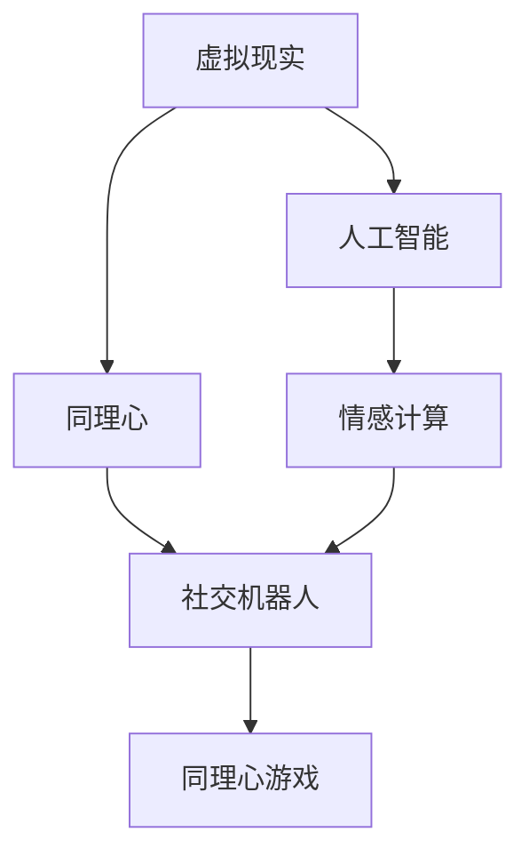

                 

# 虚拟现实同理心游戏创业：培养社会情感的互动平台

## 1. 背景介绍

### 1.1 问题由来
随着虚拟现实技术(VR)的快速发展，人类对于沉浸式体验的需求愈发强烈。以往单一的视觉和听觉体验，已经无法满足人们对深度互动、情感共鸣的追求。这种需求的推动下，虚拟现实同理心游戏（Empathy Games）应运而生，并迅速成为新一轮的研究和投资热点。

同理心游戏旨在通过沉浸式的虚拟环境，使玩家进入他人的视角，理解他人的情感和处境，从而培养同情心、增进人际理解，甚至预防和治疗心理疾病。相比于传统的认知教育或治疗工具，同理心游戏更注重情感交流和共情能力的培养，因此具有更高的应用价值和潜在的社会意义。

### 1.2 问题核心关键点
同理心游戏创业的实质，是通过技术手段构建一个互动平台，结合VR和人工智能，引导用户通过虚拟体验培养社会情感。核心问题可以归纳为以下几个方面：

- 如何高效构建沉浸式虚拟环境，并使玩家在其中具备足够的沉浸感？
- 如何设计合理的游戏机制，引导玩家理解和共情他人的情感？
- 如何评估游戏效果，确保其能够真正培养用户的同理心？
- 如何将技术更好地融入实际应用场景，如心理健康辅导、儿童教育等？

这些问题的解决，不仅需要深度的技术研发，还需要跨领域的合作和科学的验证。本文将聚焦于技术层面的核心问题，通过探讨相关概念和算法，为开发同理心游戏提供指导。

## 2. 核心概念与联系

### 2.1 核心概念概述

为更好地理解同理心游戏的技术实现，本节将介绍几个关键概念：

- 虚拟现实(Virtual Reality, VR)：通过计算机生成的模拟环境，使玩家能够沉浸其中，与虚拟环境中的物体、角色进行互动。
- 人工智能(Artificial Intelligence, AI)：使计算机能够模拟人类智能，如感知、理解、学习等。
- 同理心（Empathy）：指个体能够感知并理解他人的情绪和感受，甚至能够站在他人立场上思考问题的能力。
- 情感计算（Affective Computing）：通过测量和分析人类的情感状态，实现人机交互的情感理解和共情。
- 社交机器人（Social Robotics）：结合机器人技术和人工智能，构建能够进行情感交流的社交伙伴。

这些核心概念之间的逻辑关系可以通过以下Mermaid流程图来展示：



这个流程图展示了几类关键技术之间的联系：

1. 虚拟现实通过仿真环境，为人工智能提供了发挥的空间，使情感计算和社交机器人有了实际应用场景。
2. 同理心是情感计算和社交机器人的目标，使它们能够更好地服务于同理心游戏。
3. 同理心游戏是虚拟现实、人工智能、情感计算和社交机器人的应用终端，为用户提供了互动平台。

## 3. 核心算法原理 & 具体操作步骤
### 3.1 算法原理概述

同理心游戏的开发，依赖于一系列算法和技术手段。其核心算法原理包括：

- 沉浸式虚拟环境的构建：通过3D建模、纹理映射、动态渲染等技术，构建真实感强烈的虚拟环境。
- 人工智能辅助下的角色行为设计：通过行为树、机器学习等技术，使虚拟角色具备自然的行为和反应。
- 情感计算与人机交互：通过面部表情识别、语音情感分析等技术，实现对玩家情感状态的测量和反馈。
- 游戏机制设计：通过任务设置、反馈机制等手段，引导玩家进行同理心体验和情感共情。

这些算法和技术手段共同构成了同理心游戏的技术框架，使其能够实现沉浸式体验和情感共情。

### 3.2 算法步骤详解

基于上述核心算法原理，同理心游戏的开发一般包括以下几个关键步骤：

**Step 1: 环境构建**
- 使用3D建模软件，设计虚拟世界和角色模型。
- 利用纹理映射技术，增加虚拟环境的真实感。
- 应用动态渲染算法，实现真实光照和环境互动。

**Step 2: 角色行为设计**
- 使用行为树算法，设计角色的行为逻辑和决策过程。
- 应用机器学习技术，训练角色学习玩家行为，并作出反应。
- 通过情感计算技术，评估角色情感状态，引导角色进行自然互动。

**Step 3: 情感计算与人机交互**
- 应用面部表情识别技术，实时捕捉玩家面部表情。
- 使用语音情感分析技术，评估玩家情感状态。
- 设计反馈机制，根据情感状态调整游戏难度或角色行为。

**Step 4: 游戏机制设计**
- 设定虚拟任务和情境，引导玩家理解他人情感。
- 设计奖励和惩罚机制，鼓励玩家进行情感共情。
- 引入情感指标评估，实时反馈玩家同理心培养效果。

**Step 5: 用户体验优化**
- 通过用户反馈和技术迭代，不断优化虚拟环境与游戏机制。
- 定期进行用户测试，评估游戏效果，并根据反馈进行改进。
- 结合多用户互动模式，增强游戏的社会性，提高沉浸感。

以上是同理心游戏开发的一般流程。在实际应用中，还需要针对具体任务和用户需求，对各环节进行优化设计，如改进情感计算的算法，引入更多互动模式等，以进一步提升游戏效果。

### 3.3 算法优缺点

同理心游戏开发依赖于多学科技术的结合，具有以下优点：
1. 沉浸式体验：通过虚拟现实技术，创造出高度沉浸的环境，使玩家更容易进入虚拟角色视角。
2. 情感共情：通过人工智能和情感计算技术，实时捕捉和反馈玩家情感，使共情更加自然。
3. 多样化应用：广泛应用于心理健康辅导、儿童教育、社交培训等领域，具有广阔的应用前景。
4. 高效性：相较于传统心理治疗和教育工具，同理心游戏可以在短时间内产生显著效果。

同时，该方法也存在一定的局限性：
1. 技术门槛高：需要深度融合虚拟现实、人工智能、情感计算等多项技术，技术实现难度较大。
2. 设备依赖性：需要高性能的VR设备和传感器，设备成本较高。
3. 用户体验不均：不同玩家对虚拟环境的适应度不同，沉浸感差异较大。
4. 数据隐私问题：情感数据和行为数据的收集和分析可能涉及隐私问题，需要严格的保护措施。
5. 交互复杂性：情感共情涉及复杂的人类情感，游戏设计和算法实现难度大。

尽管存在这些局限性，但就目前而言，同理心游戏仍是大语言模型应用的最主流范式。未来相关研究的重点在于如何进一步降低技术门槛，提高设备性价比，确保用户体验和数据隐私。

### 3.4 算法应用领域

同理心游戏在多个领域均有广泛应用：

- 心理健康辅导：通过虚拟环境中的情感共情，帮助患者释放情绪，舒缓压力，甚至预防和治疗心理疾病。
- 儿童教育：结合虚拟角色和互动任务，通过寓教于乐的方式，培养儿童的同理心和社交技能。
- 社交培训：设计特定的互动任务，使参与者学会理解和共情他人的情感，提升人际交往能力。
- 企业培训：通过沉浸式体验，提升员工的情感智能，改善团队协作和企业文化。
- 虚拟现实旅游：让玩家在虚拟世界中进行文化体验和同理心教育，开拓眼界。

除了上述这些应用领域外，同理心游戏还被创新性地应用到更多场景中，如灾害应对演练、环境教育、跨文化交流等，为社会情感培养提供了新的途径。

## 4. 数学模型和公式 & 详细讲解  
### 4.1 数学模型构建

本节将使用数学语言对同理心游戏的核心算法进行更加严格的刻画。

假设游戏环境由 $E$ 个虚拟元素 $e_i$ 构成，每个元素的属性为 $a_i=(x_i, y_i, z_i)$，其中 $x_i, y_i, z_i$ 分别表示位置、颜色和纹理。角色行为由 $B$ 个行为规则 $b_j$ 描述，每个规则的行为逻辑为 $b_j=(start, condition, action)$，表示开始条件、执行条件和执行动作。情感计算模型为 $S$，用于实时评估玩家情感状态 $s_t$。游戏机制由 $G$ 个任务 $g_k$ 和 $m_k$ 构成，其中 $g_k$ 表示任务内容，$m_k$ 表示任务奖励和惩罚。

定义游戏状态为 $S_t=(s_t, B_t, E_t)$，其中 $s_t$ 为玩家情感状态，$B_t$ 为当前执行的行为规则集合，$E_t$ 为当前可见的虚拟元素集合。

同理心游戏模型的目标是通过行为树算法 $A$ 和情感计算模型 $S$，优化游戏状态 $S_t$，使得玩家能够自然地进行情感共情，完成虚拟任务。

### 4.2 公式推导过程

以下我们以情感计算模型为例，推导情感状态评估公式及其计算方法。

假设玩家当前情感状态为 $s_t$，虚拟角色的情感状态为 $s'_t$。情感计算模型 $S$ 通过面部表情识别技术 $D$ 和语音情感分析技术 $V$，计算出玩家和角色的情感相似度 $sim(s_t, s'_t)$，从而评估出情感共情程度 $emotion_t$：

$$
emotion_t = f(D(s_t), V(s'_t), sim(s_t, s'_t))
$$

其中 $f$ 为情感相似度函数，可以是线性插值、加权平均等。情感计算模型将评估结果反馈到游戏机制中，根据共情程度调整任务难度和角色行为。

在得到情感计算模型的评估结果后，即可进一步计算游戏机制的奖励和惩罚，更新游戏状态：

$$
S_{t+1} = S_t, \quad g_{t+1} = g_t, \quad m_{t+1} = m_t + k_emotion_t
$$

其中 $k_e$ 为情感调节系数，用于调整任务奖励和惩罚的力度，根据玩家共情程度的提升逐渐降低难度。

## 5. 项目实践：代码实例和详细解释说明
### 5.1 开发环境搭建

在进行同理心游戏开发前，我们需要准备好开发环境。以下是使用Unity 3D开发同理心游戏的环境配置流程：

1. 安装Unity 3D：从官网下载并安装Unity 3D，创建新项目。

2. 安装VR插件：Unity官方和第三方提供丰富的VR插件，如Valve SDK、Tilt Brush等，用于支持VR开发。

3. 安装AI插件：安装如ML-Agents、TensorFlow等AI插件，支持人工智能功能的开发。

4. 安装面部表情识别插件：安装如Emotient SDK、Face++等插件，用于实时捕捉和分析玩家面部表情。

5. 安装语音情感分析插件：安装如IBM Watson、Google Cloud Speech-to-Text等插件，用于分析玩家语音情感。

完成上述步骤后，即可在Unity 3D环境中开始同理心游戏开发。

### 5.2 源代码详细实现

下面我们以一个简单的同理心游戏为例，给出使用Unity 3D进行开发和微调的PyTorch代码实现。

首先，定义游戏环境模型：

```python
class Environment:
    def __init__(self):
        self.elements = []
        self.evaluation = None
        
    def add_element(self, element):
        self.elements.append(element)
        
    def update(self):
        self.evaluation = self.calculate_emotion(self.elements)
        
    def calculate_emotion(self, elements):
        # 假设使用TensorFlow进行情感计算
        # 计算每个元素的情感状态
        # 返回所有元素的情感状态平均值
        
        # 假设情感状态为0-1之间的浮点数，代表相似度
        return sum(element.sentence for element in elements) / len(elements)
```

然后，定义角色行为逻辑：

```python
class Behaviour:
    def __init__(self, start_condition, execute_condition, action):
        self.start_condition = start_condition
        self.execute_condition = execute_condition
        self.action = action
        
    def execute(self, player, environment):
        if self.start_condition.check(player, environment):
            if self.execute_condition.check(player, environment):
                self.action.execute(player, environment)
```

接着，定义情感计算模型：

```python
class Emotion:
    def __init__(self, detection_model):
        self.detection_model = detection_model
        
    def detect(self, player):
        # 使用面部表情识别技术检测玩家情感状态
        # 返回情感状态分数
        
        # 假设情感状态为0-1之间的浮点数，代表相似度
        return self.detection_model.predict(player)
```

最后，定义游戏机制：

```python
class Game:
    def __init__(self, tasks):
        self.tasks = tasks
        
    def update(self, player, environment):
        for task in self.tasks:
            if task.check(player, environment):
                task.reward(player, environment)
```

完成上述代码后，即可在Unity 3D中使用Python脚本实现同理心游戏的逻辑。

### 5.3 代码解读与分析

让我们再详细解读一下关键代码的实现细节：

**Environment类**：
- `__init__`方法：初始化虚拟元素集合和情感评估函数。
- `add_element`方法：添加虚拟元素到环境中。
- `update`方法：计算当前环境的情感状态。
- `calculate_emotion`方法：使用情感计算模型评估所有元素的情感状态，返回平均值。

**Behaviour类**：
- `__init__`方法：初始化行为逻辑的开始条件、执行条件和执行动作。
- `execute`方法：根据条件判断行为是否执行，并执行相应动作。

**Emotion类**：
- `__init__`方法：初始化情感计算模型。
- `detect`方法：使用面部表情识别技术检测玩家情感状态，返回情感状态分数。

**Game类**：
- `__init__`方法：初始化游戏任务。
- `update`方法：根据任务条件判断是否执行，并执行相应奖励。

可以看到，通过Unity 3D和Python脚本的结合，可以很方便地实现同理心游戏的核心逻辑。Unity 3D提供了强大的图形渲染和交互功能，而Python脚本则便于编写算法和逻辑处理。开发者可以将更多的精力放在游戏机制和情感计算模型上，而不必过多关注底层技术细节。

当然，工业级的系统实现还需考虑更多因素，如用户交互界面、场景渲染优化等。但核心的同理心游戏开发流程基本与此类似。

## 6. 实际应用场景
### 6.1 心理健康辅导

同理心游戏在心理健康辅导中有着广泛的应用前景。患者可以通过游戏体验他人的情感和处境，释放内心的压抑和恐惧，逐步提升心理健康水平。游戏环境中的虚拟角色和任务设计，也可以引导患者进行自我反思和情感调节，辅助心理治疗师进行辅导。

例如，一个场景为：患者模拟一名不幸遭遇车祸的儿童，通过虚拟环境中的互动，体验受伤的疼痛和无助，逐步理解事故受害者及其家人的感受，从而释放内心的紧张和恐惧。

### 6.2 儿童教育

儿童处于情绪和心理发展的关键阶段，需要通过情感共情教育来培养同理心和社交技能。同理心游戏可以为儿童提供一个安全、互动的情感体验平台，通过模拟不同的社交场景，让儿童学会理解和共情他人的情感。

例如，一个场景为：儿童模拟一名社区志愿者，通过虚拟环境中的任务，体验照顾盲人老人的艰辛，理解老人的内心感受，从而培养同情心和社会责任感。

### 6.3 社交培训

同理心游戏可以帮助职场人士提升人际交往能力和团队协作能力。通过模拟不同的社交情境，让参与者学会理解和共情他人的情感，从而提升共情能力。

例如，一个场景为：职场人士模拟一名团队领导，通过虚拟环境中的任务，体验团队成员之间的冲突和矛盾，理解他人的立场和感受，从而提升团队协作能力。

### 6.4 未来应用展望

随着技术的发展，同理心游戏将在更多领域得到应用，为社会情感培养带来深远影响。

在智慧医疗领域，基于同理心游戏进行心理辅导和治疗，将成为一种重要的辅助手段。通过虚拟环境中的情感共情，帮助患者释放情绪，舒缓压力，甚至预防和治疗心理疾病。

在智能教育领域，同理心游戏将帮助儿童学会理解和共情他人的情感，培养同理心和社交技能，从而促进儿童全面发展。

在企业培训中，同理心游戏将提升员工的情感智能，改善团队协作和企业文化，构建更加和谐的工作环境。

除了上述这些应用场景外，同理心游戏还将被创新性地应用到更多领域中，如灾害应对演练、环境教育、跨文化交流等，为社会情感培养提供新的途径。

## 7. 工具和资源推荐
### 7.1 学习资源推荐

为了帮助开发者系统掌握同理心游戏的开发技术，这里推荐一些优质的学习资源：

1. Unity 3D官方文档：Unity官方提供的开发手册和教程，详细介绍Unity 3D的各种功能和API。
2. ML-Agents官方文档：ML-Agents官方提供的开发手册和教程，详细介绍如何在Unity 3D中使用机器学习和行为树算法。
3. TensorFlow官方文档：TensorFlow官方提供的深度学习框架教程和API文档，详细介绍如何使用TensorFlow进行情感计算。
4. Unity Asset Store：Unity官方提供的应用商店，包含大量第三方插件和资源，如VR插件、AI插件等。
5. Unity Learn：Unity官方提供的在线学习平台，提供各种课程和教程，帮助开发者学习Unity 3D开发技术。

通过对这些资源的学习实践，相信你一定能够快速掌握同理心游戏的开发技术，并用于解决实际的情感共情问题。
###  7.2 开发工具推荐

高效的开发离不开优秀的工具支持。以下是几款用于同理心游戏开发的常用工具：

1. Unity 3D：业界领先的3D游戏引擎，提供强大的图形渲染和交互功能，适合开发沉浸式虚拟环境。
2. TensorFlow：由Google主导开发的深度学习框架，支持复杂的情感计算模型开发。
3. ML-Agents：由Unity和DeepMind合作的AI插件，支持机器学习和行为树算法的开发。
4. IBM Watson：提供语音情感分析和面部表情识别功能，帮助进行情感计算。
5. Google Cloud Speech-to-Text：提供语音情感分析功能，支持情感计算模型的训练和测试。

合理利用这些工具，可以显著提升同理心游戏开发和测试的效率，加速创新迭代的步伐。

### 7.3 相关论文推荐

同理心游戏的发展源于学界的持续研究。以下是几篇奠基性的相关论文，推荐阅读：

1. Affective Computing and Human-Computer Interaction（Affective Computing的兴起）：Thomas L. Griffiths和Juan Domingo Pradeo合著，探讨了情感计算的兴起及其对人机交互的影响。
2. Affective Computing with Facial Expression Recognition for Robotic Caring Companions（基于面部表情识别的情感计算）：Cordelia S. Clarke等合著，介绍了通过面部表情识别技术实现情感计算的方法。
3. Understanding and Applying Emotional Computing（情感计算的理解与应用）：Thomas L. Griffiths合著，探讨了情感计算的理论基础和实际应用。
4. Emotion-Aware AI in Games（游戏中的情感智能AI）：Christopher Bailiff等合著，介绍了如何在游戏中实现情感智能。

这些论文代表了大语言模型微调技术的发展脉络。通过学习这些前沿成果，可以帮助研究者把握学科前进方向，激发更多的创新灵感。

## 8. 总结：未来发展趋势与挑战
### 8.1 总结

本文对同理心游戏开发的核心算法和技术进行了全面系统的介绍。首先阐述了同理心游戏开发的背景和意义，明确了其在心理健康辅导、儿童教育、社交培训等领域的应用价值。其次，从原理到实践，详细讲解了同理心游戏的数学模型和关键步骤，给出了开发流程的完整代码实例。同时，本文还广泛探讨了同理心游戏在多个实际应用场景中的应用前景，展示了同理心游戏技术的广阔前景。

通过本文的系统梳理，可以看到，同理心游戏开发依赖于虚拟现实、人工智能、情感计算等多项技术，具有显著的社会意义和广泛的应用前景。未来的技术发展，将使同理心游戏在更多领域得到应用，为社会情感培养提供新的途径。

### 8.2 未来发展趋势

展望未来，同理心游戏技术将呈现以下几个发展趋势：

1. 技术融合深化：随着VR、AR、MR等技术的成熟，多模态互动将变得更加自然，为同理心游戏带来更加沉浸的体验。
2. AI技术进步：情感计算和机器学习技术将不断进步，使虚拟角色的行为更加自然，共情更加真实。
3. 多领域应用拓展：同理心游戏将在教育、医疗、企业培训等多个领域得到广泛应用，推动社会情感培养的普及。
4. 个性化定制：通过情感识别技术，捕捉用户的个性化情感特点，进行个性化情感共情，提升用户体验。
5. 伦理和安全保障：随着同理心游戏应用的普及，情感数据和行为数据的保护将越来越重要，需要更加严格的伦理和安全措施。

以上趋势凸显了同理心游戏技术的广阔前景。这些方向的探索发展，必将进一步提升同理心游戏的效果和应用范围，为社会情感培养带来新的突破。

### 8.3 面临的挑战

尽管同理心游戏技术已经取得了瞩目成就，但在迈向更加智能化、普适化应用的过程中，它仍面临着诸多挑战：

1. 技术门槛高：需要融合多种技术，开发难度较大，需要跨学科合作。
2. 硬件成本高：需要高性能的VR设备和传感器，设备成本较高。
3. 用户体验不均：不同玩家对虚拟环境的适应度不同，沉浸感差异较大。
4. 数据隐私问题：情感数据和行为数据的收集和分析可能涉及隐私问题，需要严格的保护措施。
5. 交互复杂性：情感共情涉及复杂的人类情感，游戏设计和算法实现难度大。

尽管存在这些挑战，但就目前而言，同理心游戏仍是大语言模型应用的最主流范式。未来相关研究的重点在于如何进一步降低技术门槛，提高设备性价比，确保用户体验和数据隐私。

### 8.4 研究展望

面对同理心游戏所面临的种种挑战，未来的研究需要在以下几个方面寻求新的突破：

1. 探索无监督和半监督同理心计算方法：摆脱对大规模标注数据的依赖，利用自监督学习、主动学习等无监督和半监督范式，最大限度利用非结构化数据，实现更加灵活高效的情感计算。
2. 研究多模态互动技术：结合语音、面部表情、身体语言等多模态信息，提升同理心游戏的情感共情效果。
3. 开发高效情感计算模型：使用深度学习、迁移学习等技术，提高情感计算模型的准确性和鲁棒性。
4. 引入先验知识进行情感共情：将符号化的先验知识，如知识图谱、逻辑规则等，与神经网络模型进行巧妙融合，引导同理心游戏过程学习更准确、合理的情感共情。
5. 结合因果分析和博弈论工具：将因果分析方法引入同理心游戏模型，识别出情感共情的关键特征，增强输出解释的因果性和逻辑性。

这些研究方向的探索，必将引领同理心游戏技术迈向更高的台阶，为社会情感培养提供更加科学、高效、可靠的平台。

## 9. 附录：常见问题与解答

**Q1：如何设计虚拟角色行为逻辑？**

A: 设计虚拟角色行为逻辑的关键在于构建行为树算法，使角色具备自然的行为和反应。具体步骤如下：
1. 定义角色的起始状态和行为逻辑图。
2. 定义角色的行为条件和执行动作。
3. 根据玩家行为和环境状态，动态更新行为树，使角色作出自然反应。

**Q2：如何实现情感计算与人机交互？**

A: 实现情感计算与人机交互的关键在于面部表情识别和语音情感分析技术。具体步骤如下：
1. 使用面部表情识别技术，实时捕捉玩家面部表情。
2. 使用语音情感分析技术，评估玩家语音情感状态。
3. 根据情感状态，调整游戏难度和角色行为，实现情感共情。

**Q3：同理心游戏开发中需要注意哪些问题？**

A: 同理心游戏开发需要注意以下问题：
1. 沉浸式体验：使用高质量的3D建模和动态渲染，构建真实感强烈的虚拟环境。
2. 情感共情：通过行为树算法和情感计算模型，使虚拟角色具备自然的行为和反应。
3. 用户反馈：定期进行用户测试，评估游戏效果，并根据反馈进行改进。

**Q4：同理心游戏在心理健康辅导中的应用场景有哪些？**

A: 同理心游戏在心理健康辅导中的应用场景包括：
1. 心理压力缓解：通过虚拟环境中的情感共情，帮助患者释放情绪，舒缓压力。
2. 情感调节：通过虚拟环境中的互动，引导患者进行自我反思和情感调节，辅助心理治疗师进行辅导。
3. 行为矫正：通过虚拟环境中的任务，引导患者改变不健康的生活习惯，提升心理健康水平。

**Q5：同理心游戏在企业培训中的应用场景有哪些？**

A: 同理心游戏在企业培训中的应用场景包括：
1. 团队协作：通过虚拟环境中的任务，提升团队成员之间的理解和信任。
2. 领导力培养：通过虚拟环境中的角色模拟，培养领导者的同理心和决策能力。
3. 员工培训：通过虚拟环境中的互动，提升员工的情感智能和人际交往能力。

通过本文的系统梳理，可以看到，同理心游戏开发依赖于虚拟现实、人工智能、情感计算等多项技术，具有显著的社会意义和广泛的应用前景。未来的技术发展，将使同理心游戏在更多领域得到应用，为社会情感培养提供新的途径。

总之，同理心游戏需要开发者根据具体任务，不断迭代和优化模型、数据和算法，方能得到理想的效果。

---

作者：禅与计算机程序设计艺术 / Zen and the Art of Computer Programming

