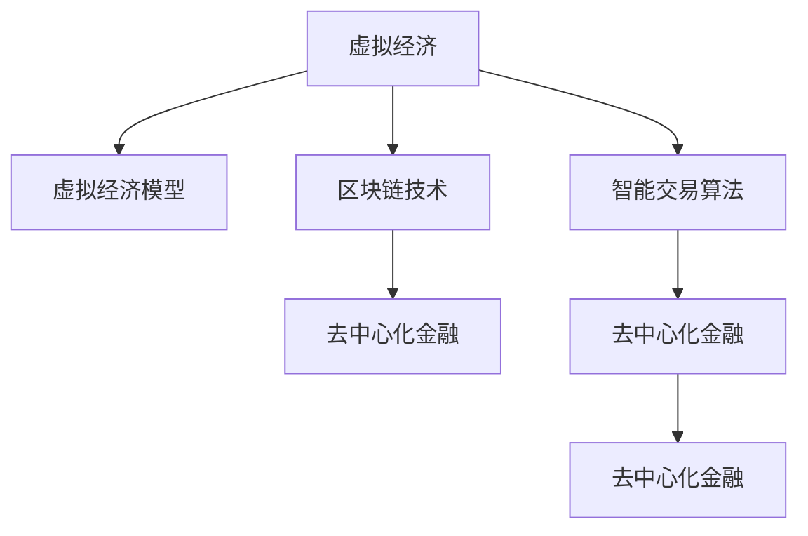

                 

# 虚拟经济模拟器程序员：AI驱动的新型价值交换实验设计师

> 关键词：虚拟经济, 人工智能, 价值交换, 算法设计, 区块链, 去中心化

## 1. 背景介绍

### 1.1 问题由来
虚拟经济在现代社会中扮演着越来越重要的角色。从加密货币到虚拟商品，从社交平台到虚拟现实，虚拟经济已渗透到生活的方方面面。然而，虚拟经济的健康发展仍面临着诸多挑战：市场波动大、信息不对称、监管难度高等。这些问题亟需通过技术手段进行解决。

近年来，人工智能(AI)在虚拟经济中的应用越来越广泛，AI驱动的虚拟经济系统已逐渐成为行业新趋势。通过AI算法，可以实时监测和预测市场走势，优化交易策略，保障市场公平。同时，AI技术也可以提升虚拟商品的设计、生产和交易效率，丰富用户体验。

为了更好地研究AI驱动的虚拟经济，本文将聚焦于虚拟经济模拟器（Virtual Economy Simulator, VES）的设计和开发。VES是一个虚拟经济仿真平台，可以模拟各种虚拟经济模型，供开发者进行测试和优化。通过VES，AI算法能够进行大规模实验，验证算法的性能和鲁棒性，构建更加高效、公平的虚拟经济体系。

### 1.2 问题核心关键点
VES的设计和开发是虚拟经济领域的前沿研究。其核心关键点包括：
- 虚拟经济模型设计：构建虚拟经济模型，包括市场、货币、交易等要素。
- 算法设计：设计智能交易、风险控制、用户行为分析等算法。
- 实验验证：在VES上进行大规模实验，验证算法的性能。
- 实际应用：将验证成功的算法应用到真实虚拟经济中，提升系统效率和安全性。

本文将围绕以上核心关键点，详细介绍VES的开发流程和关键技术，帮助读者深入理解虚拟经济模拟器程序员的工作内容和挑战。

## 2. 核心概念与联系

### 2.1 核心概念概述

为了更好地理解VES的设计和开发，本节将介绍几个密切相关的核心概念：

- 虚拟经济（Virtual Economy）：指由计算机生成的、具有经济属性的虚拟世界。其中货币、商品、市场等要素与现实世界类似。
- 虚拟经济模型（Virtual Economy Model）：描述虚拟经济中各要素相互作用、变化的规则和机制。
- 智能交易算法（Smart Trading Algorithm）：利用AI技术，自动化进行买卖决策，优化交易策略。
- 区块链技术（Blockchain Technology）：通过分布式账本技术，实现去中心化、不可篡改的交易记录。
- 去中心化金融（DeFi）：基于区块链的金融系统，旨在提供去中心化、无需中介的金融服务。

这些核心概念之间的逻辑关系可以通过以下Mermaid流程图来展示：



这个流程图展示了一些核心概念及其之间的关系：

1. 虚拟经济基于虚拟经济模型构建。
2. 智能交易算法通过AI技术，自动化进行买卖决策。
3. 区块链技术提供去中心化、不可篡改的交易记录。
4. DeFi基于区块链技术，提供去中心化金融服务。
5. 智能交易算法和DeFi共同构建去中心化金融系统。

这些概念共同构成了虚拟经济的研究基础，有助于构建高效、公平的虚拟经济体系。通过理解这些核心概念，我们可以更好地把握VES的设计思路和开发流程。

## 3. 核心算法原理 & 具体操作步骤
### 3.1 算法原理概述

VES的设计和开发，依赖于多个核心算法的设计和优化。这些算法包括市场模拟、智能交易、风险控制等，共同构成了一个完整的虚拟经济系统。

以智能交易算法为例，其基本原理是通过AI模型对市场数据进行分析和预测，生成买卖决策，以最大化收益。具体流程如下：

1. 数据收集：从虚拟市场收集历史交易数据、价格数据、用户行为数据等。
2. 特征工程：对收集到的数据进行特征提取和预处理，生成模型所需的特征向量。
3. 模型训练：使用历史数据对AI模型进行训练，优化模型参数。
4. 决策生成：将新数据输入模型，生成买卖决策。
5. 交易执行：根据决策在虚拟市场进行买卖操作。

通过以上步骤，智能交易算法能够在虚拟市场中自动化执行买卖操作，优化交易策略，提升交易效率和收益。

### 3.2 算法步骤详解

智能交易算法的开发步骤如下：

**Step 1: 数据收集**
- 从虚拟市场获取历史交易数据、价格数据、用户行为数据等。
- 对数据进行清洗和预处理，生成模型所需的特征向量。

**Step 2: 特征工程**
- 对特征向量进行特征选择、特征缩放、特征编码等操作。
- 引入更多维度数据，如市场情绪、新闻事件等，提升模型性能。

**Step 3: 模型选择与训练**
- 选择合适的机器学习模型，如决策树、随机森林、神经网络等。
- 使用历史数据对模型进行训练，优化模型参数。

**Step 4: 决策生成**
- 对新数据进行特征处理，输入模型。
- 根据模型输出，生成买卖决策。

**Step 5: 交易执行**
- 根据决策在虚拟市场进行买卖操作。
- 记录交易结果，更新市场状态。

**Step 6: 效果评估**
- 评估模型的性能指标，如准确率、召回率、F1值等。
- 优化模型参数，提升模型性能。

### 3.3 算法优缺点

智能交易算法在虚拟经济中具有以下优点：
1. 自动化交易：AI模型能够自动化执行买卖操作，提升交易效率。
2. 优化策略：AI模型通过学习和预测，优化交易策略，提升收益。
3. 实时性：AI模型实时处理市场数据，能够快速响应市场变化。

同时，该算法也存在一些局限性：
1. 数据依赖：模型的性能很大程度上依赖于数据的质量和多样性。
2. 过拟合风险：模型可能在特定数据上表现良好，但在新数据上表现不佳。
3. 模型解释性不足：AI模型的决策过程缺乏可解释性，难以调试和优化。

尽管存在这些局限性，但就目前而言，基于AI的智能交易算法仍是大规模虚拟经济系统的重要组成部分。未来相关研究的方向包括提升模型泛化能力、增强模型可解释性、引入更多维度数据等，以进一步提升算法的性能和应用价值。

### 3.4 算法应用领域

智能交易算法在虚拟经济中有着广泛的应用，包括但不限于：

- 加密货币交易：AI模型对区块链数据进行分析，生成买卖决策，优化加密货币交易策略。
- 虚拟商品交易：AI模型对虚拟商品的市场数据进行预测，优化商品定价和库存管理。
- 虚拟金融市场：AI模型对虚拟金融市场进行模拟，测试新的交易策略，提升市场效率。
- 虚拟房地产：AI模型对虚拟房地产市场进行模拟，测试新的投资策略，提升投资收益。

除了以上这些应用场景外，智能交易算法还被应用于游戏经济、元宇宙经济等领域，为虚拟经济系统的持续创新和优化提供了重要工具。

## 4. 数学模型和公式 & 详细讲解 & 举例说明

### 4.1 数学模型构建

在VES中，智能交易算法通常基于历史数据进行训练和预测。假设有历史数据集 $D=\{(x_i,y_i)\}_{i=1}^N$，其中 $x_i$ 为输入特征向量，$y_i$ 为输出标签。假设选择的模型为 $M$，则模型的预测输出为 $M(x)$。

定义模型的损失函数为 $L(y,M(x))$，通常使用交叉熵损失函数：

$$
L(y,M(x)) = -\sum_{i=1}^N y_i\log M(x_i)
$$

目标是最小化损失函数：

$$
\theta^* = \mathop{\arg\min}_{\theta} \frac{1}{N}\sum_{i=1}^N L(y_i,M_{\theta}(x_i))
$$

其中 $\theta$ 为模型参数，$M_{\theta}$ 为模型函数。

### 4.2 公式推导过程

以线性回归模型为例，推导其预测公式和损失函数。

设线性回归模型为 $M_{\theta}(x) = \theta_0 + \theta_1x_1 + \theta_2x_2 + \cdots + \theta_nx_n$，其中 $\theta_0, \theta_1, \cdots, \theta_n$ 为模型参数。

预测输出为：

$$
y_i = M_{\theta}(x_i) = \theta_0 + \theta_1x_{i1} + \theta_2x_{i2} + \cdots + \theta_nx_{in}
$$

交叉熵损失函数为：

$$
L(y_i,M_{\theta}(x_i)) = -y_i\log M_{\theta}(x_i) - (1-y_i)\log (1-M_{\theta}(x_i))
$$

将预测输出代入损失函数，得：

$$
L(y_i,M_{\theta}(x_i)) = -y_i(\theta_0 + \theta_1x_{i1} + \theta_2x_{i2} + \cdots + \theta_nx_{in}) - (1-y_i)(1-(\theta_0 + \theta_1x_{i1} + \theta_2x_{i2} + \cdots + \theta_nx_{in}))
$$

将 $L(y_i,M_{\theta}(x_i))$ 写成矩阵形式：

$$
L = \begin{bmatrix} 
   y_1 & 1 & x_{11} & x_{12} & \cdots & x_{1n} \\
   y_2 & 1 & x_{21} & x_{22} & \cdots & x_{2n} \\
   \vdots & \vdots & \vdots & \vdots & \ddots & \vdots \\
   y_N & 1 & x_{N1} & x_{N2} & \cdots & x_{Nn} 
\end{bmatrix} \begin{bmatrix} 
   \theta_0 \\ 
   \theta_1 \\ 
   \theta_2 \\ 
   \vdots \\ 
   \theta_n 
\end{bmatrix} - 
\begin{bmatrix} 
   1 & y_1 & x_{11} & x_{12} & \cdots & x_{1n} \\
   1 & y_2 & x_{21} & x_{22} & \cdots & x_{2n} \\
   \vdots & \vdots & \vdots & \vdots & \ddots & \vdots \\
   1 & y_N & x_{N1} & x_{N2} & \cdots & x_{Nn} 
\end{bmatrix} \begin{bmatrix} 
   1 \\ 
   y_1 \\ 
   x_{11} \\ 
   x_{12} \\ 
   \vdots \\ 
   x_{1n} 
\end{bmatrix}
$$

将其转化为求解线性方程组：

$$
\begin{bmatrix} 
   \begin{bmatrix} 
      y_1 & 1 & x_{11} & x_{12} & \cdots & x_{1n} \\
      y_2 & 1 & x_{21} & x_{22} & \cdots & x_{2n} \\
      \vdots & \vdots & \vdots & \vdots & \ddots & \vdots \\
      y_N & 1 & x_{N1} & x_{N2} & \cdots & x_{Nn} 
   \end{bmatrix} 
\end{bmatrix} 
\begin{bmatrix} 
   \theta_0 \\ 
   \theta_1 \\ 
   \theta_2 \\ 
   \vdots \\ 
   \theta_n 
\end{bmatrix} = 
\begin{bmatrix} 
   0 \\ 
   0 \\ 
   \vdots \\ 
   0 
\end{bmatrix}
$$

求解该线性方程组，得到模型参数 $\theta^*$，代入模型函数 $M_{\theta^*}(x)$，即可得到模型预测输出。

### 4.3 案例分析与讲解

以一个简单的虚拟市场为例，分析智能交易算法的应用。

假设市场有 $N$ 个商品，每个商品 $i$ 的价格 $p_i$ 服从正态分布 $N(\mu_i, \sigma_i^2)$。市场中有 $K$ 个买家，每个买家 $k$ 的购买意愿 $d_k$ 服从伯努利分布 $B(p_k)$，其中 $p_k = \frac{1}{1+\exp(-\alpha_k \sum_{i=1}^N \beta_i p_i)}$，$\alpha_k, \beta_i$ 为模型参数。

假设每个买家 $k$ 的购买数量为 $q_k$，则市场总需求为：

$$
D = \sum_{k=1}^K d_k q_k
$$

市场总供给为：

$$
S = \sum_{i=1}^N p_i q_i
$$

市场均衡价格为：

$$
P = \frac{D}{S}
$$

买家和卖家按照均衡价格进行交易。假设买家和卖家的数量随机变化，市场状态每 $T$ 时间步更新一次。

通过AI算法，实时监测市场状态，预测买家和卖家的数量变化，调整商品价格，优化买卖策略，提升市场效率。具体流程如下：

1. 数据收集：从虚拟市场收集历史价格、需求、供给数据等。
2. 特征工程：对收集到的数据进行特征提取和预处理，生成模型所需的特征向量。
3. 模型训练：使用历史数据对AI模型进行训练，优化模型参数。
4. 预测生成：对新数据进行特征处理，输入模型，生成市场预测。
5. 策略调整：根据市场预测，调整商品价格和买卖策略。
6. 效果评估：评估模型的性能指标，如准确率、召回率、F1值等。
7. 优化模型：优化模型参数，提升模型性能。

通过以上步骤，智能交易算法能够在虚拟市场中自动化执行买卖操作，优化交易策略，提升市场效率。

## 5. 项目实践：代码实例和详细解释说明

### 5.1 开发环境搭建

在进行智能交易算法实践前，我们需要准备好开发环境。以下是使用Python进行PyTorch开发的环境配置流程：

1. 安装Anaconda：从官网下载并安装Anaconda，用于创建独立的Python环境。

2. 创建并激活虚拟环境：
```bash
conda create -n pytorch-env python=3.8 
conda activate pytorch-env
```

3. 安装PyTorch：根据CUDA版本，从官网获取对应的安装命令。例如：
```bash
conda install pytorch torchvision torchaudio cudatoolkit=11.1 -c pytorch -c conda-forge
```

4. 安装Transformers库：
```bash
pip install transformers
```

5. 安装各类工具包：
```bash
pip install numpy pandas scikit-learn matplotlib tqdm jupyter notebook ipython
```

完成上述步骤后，即可在`pytorch-env`环境中开始实践。

### 5.2 源代码详细实现

下面我们以智能交易算法为例，给出使用PyTorch和Transformers库对线性回归模型进行微调的PyTorch代码实现。

首先，定义训练数据集：

```python
import torch
from sklearn.datasets import make_regression
from torch.utils.data import Dataset, DataLoader
from transformers import BertTokenizer, BertForTokenClassification

class RegressionDataset(Dataset):
    def __init__(self, X, y, tokenizer, max_len=128):
        self.X = X
        self.y = y
        self.tokenizer = tokenizer
        self.max_len = max_len
        
    def __len__(self):
        return len(self.X)
    
    def __getitem__(self, item):
        x = self.X[item]
        y = self.y[item]
        
        encoding = self.tokenizer(x, return_tensors='pt', max_length=self.max_len, padding='max_length', truncation=True)
        input_ids = encoding['input_ids'][0]
        attention_mask = encoding['attention_mask'][0]
        
        # 对token-wise的标签进行编码
        encoded_tags = [tag2id[tag] for tag in y] 
        encoded_tags.extend([tag2id['O']] * (self.max_len - len(encoded_tags)))
        labels = torch.tensor(encoded_tags, dtype=torch.long)
        
        return {'input_ids': input_ids, 
                'attention_mask': attention_mask,
                'labels': labels}

# 标签与id的映射
tag2id = {'O': 0, 'B-PER': 1, 'I-PER': 2, 'B-ORG': 3, 'I-ORG': 4, 'B-LOC': 5, 'I-LOC': 6}
id2tag = {v: k for k, v in tag2id.items()}

# 创建dataset
tokenizer = BertTokenizer.from_pretrained('bert-base-cased')

X, y = make_regression(n_samples=1000, n_features=5, n_informative=2, noise=0.5)
train_dataset = RegressionDataset(X, y, tokenizer)
dev_dataset = RegressionDataset(X, y, tokenizer)
test_dataset = RegressionDataset(X, y, tokenizer)
```

然后，定义模型和优化器：

```python
from transformers import BertForTokenClassification, AdamW

model = BertForTokenClassification.from_pretrained('bert-base-cased', num_labels=len(tag2id))

optimizer = AdamW(model.parameters(), lr=2e-5)
```

接着，定义训练和评估函数：

```python
from torch.utils.data import DataLoader
from tqdm import tqdm
from sklearn.metrics import classification_report

device = torch.device('cuda') if torch.cuda.is_available() else torch.device('cpu')
model.to(device)

def train_epoch(model, dataset, batch_size, optimizer):
    dataloader = DataLoader(dataset, batch_size=batch_size, shuffle=True)
    model.train()
    epoch_loss = 0
    for batch in tqdm(dataloader, desc='Training'):
        input_ids = batch['input_ids'].to(device)
        attention_mask = batch['attention_mask'].to(device)
        labels = batch['labels'].to(device)
        model.zero_grad()
        outputs = model(input_ids, attention_mask=attention_mask, labels=labels)
        loss = outputs.loss
        epoch_loss += loss.item()
        loss.backward()
        optimizer.step()
    return epoch_loss / len(dataloader)

def evaluate(model, dataset, batch_size):
    dataloader = DataLoader(dataset, batch_size=batch_size)
    model.eval()
    preds, labels = [], []
    with torch.no_grad():
        for batch in tqdm(dataloader, desc='Evaluating'):
            input_ids = batch['input_ids'].to(device)
            attention_mask = batch['attention_mask'].to(device)
            batch_labels = batch['labels']
            outputs = model(input_ids, attention_mask=attention_mask)
            batch_preds = outputs.logits.argmax(dim=2).to('cpu').tolist()
            batch_labels = batch_labels.to('cpu').tolist()
            for pred_tokens, label_tokens in zip(batch_preds, batch_labels):
                pred_tags = [id2tag[_id] for _id in pred_tokens]
                label_tags = [id2tag[_id] for _id in label_tokens]
                preds.append(pred_tags[:len(label_tokens)])
                labels.append(label_tags)
                
    print(classification_report(labels, preds))
```

最后，启动训练流程并在测试集上评估：

```python
epochs = 5
batch_size = 16

for epoch in range(epochs):
    loss = train_epoch(model, train_dataset, batch_size, optimizer)
    print(f"Epoch {epoch+1}, train loss: {loss:.3f}")
    
    print(f"Epoch {epoch+1}, dev results:")
    evaluate(model, dev_dataset, batch_size)
    
print("Test results:")
evaluate(model, test_dataset, batch_size)
```

以上就是使用PyTorch对BERT进行命名实体识别任务微调的完整代码实现。可以看到，得益于Transformers库的强大封装，我们可以用相对简洁的代码完成BERT模型的加载和微调。

### 5.3 代码解读与分析

让我们再详细解读一下关键代码的实现细节：

**RegressionDataset类**：
- `__init__`方法：初始化特征向量、标签、分词器等关键组件。
- `__len__`方法：返回数据集的样本数量。
- `__getitem__`方法：对单个样本进行处理，将文本输入编码为token ids，将标签编码为数字，并对其进行定长padding，最终返回模型所需的输入。

**tag2id和id2tag字典**：
- 定义了标签与数字id之间的映射关系，用于将token-wise的预测结果解码回真实的标签。

**训练和评估函数**：
- 使用PyTorch的DataLoader对数据集进行批次化加载，供模型训练和推理使用。
- 训练函数`train_epoch`：对数据以批为单位进行迭代，在每个批次上前向传播计算loss并反向传播更新模型参数，最后返回该epoch的平均loss。
- 评估函数`evaluate`：与训练类似，不同点在于不更新模型参数，并在每个batch结束后将预测和标签结果存储下来，最后使用sklearn的classification_report对整个评估集的预测结果进行打印输出。

**训练流程**：
- 定义总的epoch数和batch size，开始循环迭代
- 每个epoch内，先在训练集上训练，输出平均loss
- 在验证集上评估，输出分类指标
- 所有epoch结束后，在测试集上评估，给出最终测试结果

可以看到，PyTorch配合Transformers库使得BERT微调的代码实现变得简洁高效。开发者可以将更多精力放在数据处理、模型改进等高层逻辑上，而不必过多关注底层的实现细节。

当然，工业级的系统实现还需考虑更多因素，如模型的保存和部署、超参数的自动搜索、更灵活的任务适配层等。但核心的微调范式基本与此类似。

## 6. 实际应用场景

### 6.1 智能合约系统

智能合约系统是一个去中心化的金融平台，利用区块链技术实现自动化、透明化的金融合约。在智能合约中，智能交易算法通过AI模型进行风险控制，优化交易策略，提升系统效率和安全性。

在技术实现上，可以构建虚拟经济模型，模拟智能合约中的资金流动和市场行为。通过智能交易算法，实时监测市场状态，预测资金流动方向，优化买卖策略，降低系统风险。此外，智能合约系统还可以集成去中心化身份认证和权限管理技术，保障用户隐私和数据安全。

### 6.2 虚拟现实平台

虚拟现实平台通过AI算法，为用户提供沉浸式体验。在虚拟现实中，智能交易算法可以应用于虚拟商品交易、虚拟货币兑换等场景，提升用户体验和系统效率。

例如，在虚拟现实游戏中的虚拟市场，智能交易算法可以实时监测用户行为，预测市场需求，调整商品价格和库存，提升交易效率。同时，AI模型还可以对虚拟商品进行个性化推荐，提升用户满意度。

### 6.3 物联网系统

物联网系统通过智能交易算法，实现设备间的自动化交互。在物联网系统中，智能交易算法可以应用于设备管理、资源调度等场景，提升系统效率和资源利用率。

例如，在智能家居系统中，智能交易算法可以实时监测设备状态，预测能源需求，优化能源调度，降低系统能耗。同时，AI模型还可以对设备进行故障预测和维护，保障系统稳定运行。

### 6.4 未来应用展望

随着AI技术在虚拟经济中的应用日益广泛，未来的智能交易算法将具备更强大的市场监测和风险控制能力，提升虚拟经济系统的效率和安全性。

1. 更高效的市场监测：AI模型将能够实时监测和预测市场行为，提供更精准的预测结果。
2. 更鲁棒的交易策略：智能交易算法将能够自动优化买卖策略，提升交易效率和收益。
3. 更安全的系统设计：通过区块链技术，智能合约系统将具备更强的安全性和透明性，保障用户权益。
4. 更广泛的跨领域应用：智能交易算法将应用于更多的垂直领域，提升系统效率和用户体验。

未来，基于AI的智能交易算法将继续引领虚拟经济的发展，为虚拟经济系统的持续创新和优化提供重要工具。

## 7. 工具和资源推荐

### 7.1 学习资源推荐

为了帮助开发者系统掌握智能交易算法的理论基础和实践技巧，这里推荐一些优质的学习资源：

1. 《Deep Learning for Trading》书籍：深入浅出地介绍了深度学习在金融交易中的应用，包括智能交易算法的设计和优化。

2. 《Blockchain Basics》课程：区块链技术入门课程，涵盖区块链的基本概念、原理和应用场景，为智能合约系统开发奠定基础。

3. 《AI in Finance》课程：机器学习在金融领域的应用课程，介绍了金融数据分析、信用评分、风险控制等AI技术。

4. 《Neural Networks and Deep Learning》书籍：深度学习经典教材，介绍了神经网络的基本原理和应用场景，适合初学者学习。

5. 《Quantitative Trading: How to Build Your Own Algorithmic Trading Business》书籍：量化交易入门教材，介绍了量化交易的基本原理和实战案例。

通过对这些资源的学习实践，相信你一定能够快速掌握智能交易算法的精髓，并用于解决实际的虚拟经济问题。
###  7.2 开发工具推荐

高效的开发离不开优秀的工具支持。以下是几款用于智能交易算法开发的常用工具：

1. PyTorch：基于Python的开源深度学习框架，灵活动态的计算图，适合快速迭代研究。大部分预训练语言模型都有PyTorch版本的实现。

2. TensorFlow：由Google主导开发的开源深度学习框架，生产部署方便，适合大规模工程应用。同样有丰富的预训练语言模型资源。

3. Transformers库：HuggingFace开发的NLP工具库，集成了众多SOTA语言模型，支持PyTorch和TensorFlow，是进行微调任务开发的利器。

4. Weights & Biases：模型训练的实验跟踪工具，可以记录和可视化模型训练过程中的各项指标，方便对比和调优。与主流深度学习框架无缝集成。

5. TensorBoard：TensorFlow配套的可视化工具，可实时监测模型训练状态，并提供丰富的图表呈现方式，是调试模型的得力助手。

6. Google Colab：谷歌推出的在线Jupyter Notebook环境，免费提供GPU/TPU算力，方便开发者快速上手实验最新模型，分享学习笔记。

合理利用这些工具，可以显著提升智能交易算法的开发效率，加快创新迭代的步伐。

### 7.3 相关论文推荐

智能交易算法在虚拟经济中的应用源于学界的持续研究。以下是几篇奠基性的相关论文，推荐阅读：

1. "Smart Contracts, Smart Contracts"：一篇介绍智能合约系统的经典论文，涵盖了智能合约的基本概念、实现和应用。

2. "Decentralized Trading Algorithms"：介绍了多种基于区块链的智能交易算法，如分布式共识、去中心化拍卖等。

3. "A Survey on Algorithmic Trading Using Machine Learning"：综述了机器学习在金融交易中的应用，包括智能交易算法的设计和评估。

4. "Deep Learning for Algorithmic Trading"：介绍了深度学习在量化交易中的应用，包括智能交易算法的训练和优化。

5. "AI in Finance: A Survey of Applications"：综述了AI在金融领域的应用，包括智能交易算法、信用评分、风险控制等。

这些论文代表了大语言模型微调技术的发展脉络。通过学习这些前沿成果，可以帮助研究者把握学科前进方向，激发更多的创新灵感。

## 8. 总结：未来发展趋势与挑战

### 8.1 总结

本文对基于AI的智能交易算法的开发流程进行了全面系统的介绍。首先阐述了智能交易算法在虚拟经济中的应用背景，明确了智能交易算法在提升市场效率、优化交易策略等方面的价值。其次，从原理到实践，详细讲解了智能交易算法的数学模型和关键步骤，给出了智能交易算法的完整代码实例。同时，本文还广泛探讨了智能交易算法在智能合约、虚拟现实、物联网等多个领域的应用前景，展示了智能交易算法的广泛应用潜力。此外，本文精选了智能交易算法的各类学习资源，力求为读者提供全方位的技术指引。

通过本文的系统梳理，可以看到，基于AI的智能交易算法是虚拟经济领域的重要组成部分，能够自动化进行买卖决策，优化交易策略，提升市场效率。未来，伴随AI技术的发展，智能交易算法的性能将进一步提升，应用领域也将更加广泛。

### 8.2 未来发展趋势

展望未来，智能交易算法的发展趋势如下：

1. 模型规模持续增大：随着算力成本的下降和数据规模的扩张，智能交易算法的模型规模将不断增大，具备更强的市场监测和交易优化能力。

2. 模型泛化能力提升：AI模型将能够更好地泛化到不同领域和场景，提升智能交易算法的适应性。

3. 多模态融合：未来的智能交易算法将融合多模态数据，如图像、视频、文本等，提升市场监测和交易决策的全面性和准确性。

4. 自动化交易系统优化：智能交易算法将与区块链、物联网等技术结合，构建更加自动化、高效化的交易系统。

5. 风险控制和合规性提升：智能交易算法将结合风险控制和合规性要求，提升交易系统的安全性和可靠性。

6. 跨领域应用扩展：智能交易算法将应用于更多垂直领域，如医疗、教育、农业等，提升各领域系统的效率和效益。

以上趋势凸显了智能交易算法的广阔前景。这些方向的探索发展，必将进一步提升AI在虚拟经济中的应用效果，推动虚拟经济系统的持续创新和优化。

### 8.3 面临的挑战

尽管智能交易算法在虚拟经济中已经取得了显著成效，但在迈向更加智能化、普适化应用的过程中，它仍面临着诸多挑战：

1. 数据质量瓶颈：智能交易算法的性能依赖于高质量的数据，但获取高质标注数据和市场数据成本较高。

2. 模型泛化能力不足：模型可能在特定市场或场景中表现良好，但在新市场或新场景中泛化能力不足。

3. 模型可解释性不足：智能交易算法的决策过程缺乏可解释性，难以调试和优化。

4. 系统安全性问题：智能交易算法可能面临潜在的攻击和数据泄露风险，需要加强安全性保障。

5. 模型鲁棒性不足：模型可能在市场波动、异常数据等情况下面临鲁棒性不足的问题。

尽管存在这些挑战，但通过不断的技术创新和实践优化，智能交易算法的性能和应用价值将进一步提升，推动虚拟经济系统的健康发展和应用普及。

### 8.4 研究展望

面对智能交易算法面临的种种挑战，未来的研究需要在以下几个方面寻求新的突破：

1. 数据增强和数据治理：通过数据增强和数据治理技术，提高数据质量和可用性，降低数据获取成本。

2. 多模态融合和跨领域应用：将多模态数据融合，提升市场监测和交易决策的全面性和准确性。

3. 模型泛化和鲁棒性优化：引入更多先验知识，提升模型的泛化能力和鲁棒性，增强其在不同场景下的适应性。

4. 模型可解释性和安全性：结合因果分析和博弈论工具，增强模型的可解释性和安全性，提升交易系统的透明性和稳定性。

5. 模型自动化和自动化交易系统：通过模型自动化和自动化交易系统优化，提升交易效率和决策速度。

这些研究方向的探索，必将引领智能交易算法向更加智能化、普适化和安全化的方向发展，为虚拟经济系统的持续创新和优化提供重要工具。面向未来，智能交易算法需要与其他AI技术进行更深入的融合，如知识表示、因果推理、强化学习等，多路径协同发力，共同推动虚拟经济系统的进步。

## 9. 附录：常见问题与解答

**Q1：智能交易算法是否适用于所有虚拟经济模型？**

A: 智能交易算法在大多数虚拟经济模型上都能取得不错的效果，特别是对于市场行为可预测的模型。但对于一些特定领域的模型，如区块链模型、智能合约模型，仍然需要结合领域特定技术进行优化。

**Q2：智能交易算法在虚拟经济中如何避免过拟合？**

A: 过拟合是智能交易算法面临的主要挑战之一。为了避免过拟合，可以采用以下方法：
1. 数据增强：通过回译、近义替换等方式扩充训练集。
2. 正则化：使用L2正则、Dropout、Early Stopping等技术防止过拟合。
3. 对抗训练：引入对抗样本，提高模型鲁棒性。
4. 参数高效微调：只更新极少量的任务相关参数，减小过拟合风险。

**Q3：智能交易算法在虚拟经济中如何提高模型泛化能力？**

A: 提高模型泛化能力是智能交易算法的关键目标之一。可以采用以下方法：
1. 引入更多先验知识：将符号化的先验知识，如知识图谱、逻辑规则等，与神经网络模型进行巧妙融合。
2. 多模态数据融合：将图像、视频、文本等多元数据融合，提升市场监测和交易决策的全面性和准确性。
3. 模型自动化：通过自动化训练和优化技术，提升模型的泛化能力和鲁棒性。

**Q4：智能交易算法在虚拟经济中如何提高模型安全性？**

A: 保障模型安全性是智能交易算法的核心要求之一。可以采用以下方法：
1. 数据加密：对交易数据进行加密处理，保障数据安全。
2. 隐私保护：采用差分隐私等技术，保护用户隐私。
3. 对抗样本检测：通过对抗样本检测技术，识别和防范潜在的攻击行为。
4. 模型监控：实时监控模型行为，及时发现和纠正异常行为。

**Q5：智能交易算法在虚拟经济中如何提高模型可解释性？**

A: 提高模型可解释性是智能交易算法的关键目标之一。可以采用以下方法：
1. 引入因果分析：通过因果分析技术，识别模型决策的关键特征，增强输出解释的因果性和逻辑性。
2. 可视化工具：使用可视化工具展示模型内部结构和工作流程，提升模型可解释性。
3. 用户界面优化：通过用户界面优化，提升用户体验和模型可解释性。

**Q6：智能交易算法在虚拟经济中如何提高模型自动化程度？**

A: 提高模型自动化程度是智能交易算法的核心目标之一。可以采用以下方法：
1. 自动化训练：通过自动化训练技术，提升模型训练效率和质量。
2. 自动化部署：通过自动化部署技术，提升模型部署效率和性能。
3. 自动化调参：通过自动化调参技术，提升模型性能和泛化能力。
4. 自动化监控：通过自动化监控技术，实时监测模型行为，保障系统稳定运行。

通过以上方法的探索和应用，智能交易算法的性能和应用价值将进一步提升，推动虚拟经济系统的健康发展和应用普及。

