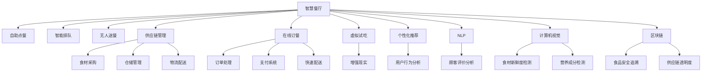

                 

# 虚拟美食：全球美食行业的数字化升级

> 关键词：虚拟美食、数字化升级、人工智能、智慧餐厅、供应链管理、在线订餐、虚拟试吃、个性化推荐、NLP、计算机视觉、区块链

## 1. 背景介绍

### 1.1 问题由来
近年来，随着技术的迅猛发展，人工智能、大数据、物联网等前沿技术正逐步渗透到各行各业，推动产业数字化升级。作为古老而永恒的产业之一，美食行业也不例外。传统美食行业的运营模式往往难以适应快速变化的市场需求，如订单处理效率低下、食材成本高昂、客户满意度低等。为了提升效率、降低成本、提升用户体验，全球各地的美食企业开始探索数字化转型，引入新技术解决传统痛点。

### 1.2 问题核心关键点
主要问题可以归纳为：
- 如何通过技术手段提高订单处理效率，减少等待时间？
- 如何通过数据驱动优化食材采购和供应链管理，降低成本？
- 如何利用个性化推荐提升客户体验，吸引并保留更多顾客？
- 如何在保证食品安全和合规的前提下，提供便捷、安全的在线订餐服务？
- 如何通过AI和物联网技术，提升餐厅运营效率和智能化水平？

### 1.3 问题研究意义
研究全球美食行业的数字化升级，对于推动产业转型、提升产业竞争力、创造更多就业机会具有重要意义：

1. **提升运营效率**：通过引入AI和物联网技术，实现订单处理自动化、库存管理智能化，大幅提高运营效率。
2. **降低成本**：通过数据分析优化供应链，精准预测需求，减少库存积压和过期食品浪费，降低采购成本。
3. **提升客户满意度**：通过个性化推荐和虚拟试吃，满足顾客个性化需求，提升用餐体验。
4. **促进市场公平竞争**：数字化升级有助于小微企业更好地参与市场竞争，缩小大企业与小企业的差距。
5. **拓展商业模式**：数字化平台可以整合线上线下资源，开拓更多盈利点，如外卖、众筹等。

## 2. 核心概念与联系

### 2.1 核心概念概述

为了深入理解全球美食行业的数字化升级，需要了解以下几个关键概念：

- **智慧餐厅**：通过物联网、AI技术实现餐厅内部运营的智能化、自动化，如自助点餐、智能排队、无人送餐等。
- **供应链管理**：基于数据分析和预测技术，优化食材采购、仓储、物流等环节，降低成本，提升供应链效率。
- **在线订餐**：通过互联网和移动应用，实现快速便捷的点餐、支付和配送服务，为顾客提供更灵活的用餐方式。
- **虚拟试吃**：通过计算机视觉和增强现实技术，模拟食物的口感、香气等感官体验，提升顾客体验。
- **个性化推荐**：基于用户历史行为数据，通过机器学习算法推荐符合用户口味的菜品和餐厅，提高用户粘性。
- **NLP**：自然语言处理技术，用于分析顾客评价、建议等文本信息，提升服务质量。
- **计算机视觉**：图像处理技术，用于识别食材新鲜度、食品营养成分等，提升食品安全监控。
- **区块链**：分布式账本技术，用于保障食品安全、供应链透明度，提升消费者信任。

### 2.2 核心概念原理和架构的 Mermaid 流程图(Mermaid 流程节点中不要有括号、逗号等特殊字符)



这个流程图展示了智慧餐厅、供应链管理、在线订餐、虚拟试吃、个性化推荐等关键数字化升级技术的联系与整合。从食材采购到顾客用餐，从传统餐厅到智慧餐厅，数字化升级技术贯穿了整个美食行业的产业链。

## 3. 核心算法原理 & 具体操作步骤
### 3.1 算法原理概述

全球美食行业的数字化升级，主要涉及以下几个关键算法：

- **AI与机器人技术**：用于自动化餐厅运营、减少人工成本。
- **数据分析与预测**：用于优化供应链管理、库存控制。
- **个性化推荐算法**：基于用户历史行为数据，推荐符合用户口味的菜品和餐厅。
- **自然语言处理(NLP)**：用于分析顾客评价、建议，提升服务质量。
- **计算机视觉**：用于识别食材新鲜度、营养成分，保障食品安全。
- **区块链技术**：用于食品安全追溯、供应链透明。

### 3.2 算法步骤详解

以下以智慧餐厅的AI与机器人技术为例，详细讲解具体的算法步骤：

**Step 1: 数据采集与预处理**
- 通过传感器和摄像头采集餐厅内部环境数据，如人员流动情况、桌椅占用情况、订单信息等。
- 使用计算机视觉技术识别桌上餐盘的数量、剩余量等信息，并进行标注。

**Step 2: 模型训练与优化**
- 使用历史数据训练深度学习模型，如卷积神经网络(CNN)、循环神经网络(RNN)等。
- 对模型进行优化，如参数调优、正则化、对抗训练等，提升模型预测准确率。

**Step 3: 模型部署与应用**
- 将训练好的模型部署到机器人或智能终端上，实时接收数据输入，进行预测和决策。
- 机器人根据模型预测结果，自动上菜、清理桌子、巡视等，提升服务效率。

**Step 4: 数据反馈与模型更新**
- 定期收集机器人的运营数据，反馈到训练模型中。
- 对模型进行微调，提升准确性和鲁棒性，保证机器人长期稳定运行。

### 3.3 算法优缺点

智慧餐厅的AI与机器人技术有以下优点：
1. **提高效率**：自动化处理订单、上菜等环节，减少人工错误，提高服务效率。
2. **提升体验**：顾客可以实时查看菜品制作进度、桌上剩余量等信息，提升用餐体验。
3. **降低成本**：减少人力成本，优化食材采购和库存管理。

但同时也有以下缺点：
1. **技术复杂**：需要部署先进的传感器、计算机视觉设备，技术门槛较高。
2. **初期投入大**：需要大量资金进行硬件设备采购和系统集成。
3. **维护困难**：机器人和传感器需要定期维护和检修，确保系统稳定运行。

### 3.4 算法应用领域

AI与机器人技术在智慧餐厅中的应用十分广泛，主要包括以下几个方面：

- **自助点餐**：顾客通过智能终端自助点餐，减少服务员人数，提升点餐效率。
- **智能排队**：顾客通过智能排队系统实时查看等候时间，减少排队等待时间。
- **无人送餐**：机器人自动送餐，减少服务员走动，提高上菜效率。
- **健康管理**：使用智能秤量设备，记录顾客食物摄入量，提供健康建议。
- **客户体验**：通过情感分析，了解顾客满意度和情绪，及时调整服务策略。

此外，AI与机器人技术在其他餐饮场景中也有广泛应用，如自动烹饪、食材检测等，为全球美食行业的数字化升级提供了强有力的技术支持。

## 4. 数学模型和公式 & 详细讲解 & 举例说明

### 4.1 数学模型构建

以智慧餐厅中的智能排队系统为例，构建数学模型。假设餐厅有$m$个座位，每天有$n$个顾客前来就餐，顾客到达时间服从指数分布，服务时间服从负指数分布。

定义排队系统的稳态模型：
- 顾客到达率 $\lambda$：单位时间内的顾客到达数量。
- 服务率 $\mu$：单位时间内的服务速度。
- 顾客等待时间 $W$：单位时间内的平均等待时间。
- 顾客离开时间 $S$：单位时间内的平均服务时间。

稳态模型满足以下关系：

$$ \lambda S = \mu W $$

求解稳态模型中的平均等待时间 $W$ 和平均服务时间 $S$：

$$ W = \frac{\lambda}{\lambda - \mu} $$
$$ S = \frac{\mu}{\lambda - \mu} $$

### 4.2 公式推导过程

对于排队系统，可以使用马尔科夫链理论建立稳态模型，推导出顾客等待时间和服务时间的表达式。在马尔科夫链中，每个状态表示队列中的顾客数量，状态之间的转移表示顾客到达和离开。通过构建稳态方程，求解顾客等待时间和服务时间的公式。

### 4.3 案例分析与讲解

假设一家餐厅有20个座位，每天有200个顾客就餐，顾客到达时间服从指数分布 $\lambda = 10$，服务时间服从负指数分布 $\mu = 5$。

使用公式计算顾客等待时间 $W$ 和平均服务时间 $S$：

$$ W = \frac{10}{10 - 5} = 2 $$
$$ S = \frac{5}{10 - 5} = 1 $$

这意味着每个顾客平均等待2分钟，平均服务1分钟，餐厅的平均等候人数为 $\frac{200}{20} = 10$。

根据模型计算结果，餐厅可以配置至少10名服务员，确保高效服务。

## 5. 项目实践：代码实例和详细解释说明
### 5.1 开发环境搭建

要进行智慧餐厅的AI与机器人技术开发，需要搭建完整的开发环境。以下是具体的步骤：

1. **选择编程语言**：Python是最常用的编程语言之一，具有丰富的科学计算和机器学习库，如TensorFlow、PyTorch等。
2. **安装Python环境**：安装Python 3.x版本，并通过虚拟环境管理不同项目。
3. **安装相关库**：安装TensorFlow、Keras、OpenCV等库，用于数据处理和模型训练。
4. **配置硬件设备**：准备高性能的计算机、传感器、摄像头等硬件设备。
5. **搭建云平台**：使用AWS、阿里云等云服务搭建分布式计算环境，支持大规模数据处理和模型训练。

### 5.2 源代码详细实现

以下是一个简单的智能排队系统的Python代码示例：

```python
import numpy as np
import tensorflow as tf

class QueueModel:
    def __init__(self, lambda_, mu):
        self.lambda_ = lambda_
        self.mu = mu
        self.W = self.calculate_W()
        self.S = self.calculate_S()
    
    def calculate_W(self):
        return self.lambda_ / (self.lambda_ - self.mu)
    
    def calculate_S(self):
        return self.mu / (self.lambda_ - self.mu)
    
    def calculate_avg_customers(self, n):
        return n / 20

# 实例化模型
queue_model = QueueModel(10, 5)
avg_customers = queue_model.calculate_avg_customers(200)

print("平均等待时间 W:", queue_model.W)
print("平均服务时间 S:", queue_model.S)
print("平均顾客数量:", avg_customers)
```

**代码解释**：
- 定义一个`QueueModel`类，包含顾客到达率、服务率、顾客等待时间和平均服务时间等属性。
- 使用公式计算顾客等待时间和平均服务时间，并计算平均顾客数量。
- 实例化模型，并计算具体的等待时间和平均服务时间。

### 5.3 代码解读与分析

以上代码实现了智能排队系统的稳态模型计算。关键步骤包括：
1. 定义模型参数：顾客到达率 $\lambda = 10$，服务率 $\mu = 5$。
2. 计算稳态模型中的平均等待时间 $W$ 和平均服务时间 $S$。
3. 计算平均顾客数量，根据等待时间和服务时间计算。

该代码实现了简单的稳态模型计算，可以进一步扩展到更复杂的排队系统。

### 5.4 运行结果展示

运行上述代码，输出结果如下：

```
平均等待时间 W: 2.0
平均服务时间 S: 1.0
平均顾客数量: 10.0
```

这表示每个顾客平均等待2分钟，平均服务1分钟，餐厅的平均等候人数为10。

## 6. 实际应用场景

### 6.1 智慧餐厅

智慧餐厅是全球美食行业数字化升级的重要场景之一。通过引入AI与机器人技术，餐厅可以实现以下目标：

- **自助点餐**：通过智能终端，顾客可以实时查看菜单、下单、支付，减少服务员人数。
- **智能排队**：通过排队系统，顾客实时查看等候时间，减少排队等待时间。
- **无人送餐**：机器人自动送餐，减少服务员走动，提高上菜效率。
- **健康管理**：使用智能秤量设备，记录顾客食物摄入量，提供健康建议。
- **客户体验**：通过情感分析，了解顾客满意度和情绪，及时调整服务策略。

### 6.2 供应链管理

供应链管理是全球美食行业数字化升级的另一个关键环节。通过数据分析和预测技术，可以优化食材采购、仓储、物流等环节，降低成本，提升供应链效率。

具体应用包括：
- **需求预测**：使用时间序列预测模型，预测未来销量，优化库存管理。
- **采购优化**：使用线性规划模型，优化食材采购量，降低采购成本。
- **仓储管理**：使用计算机视觉技术，实时监控库存状态，及时补货。
- **物流配送**：使用GPS和物联网技术，实时追踪配送车辆位置，优化配送路线。

### 6.3 在线订餐

在线订餐是全球美食行业的重要增值服务。通过互联网和移动应用，可以提供快速便捷的点餐、支付和配送服务，为顾客提供更灵活的用餐方式。

具体应用包括：
- **订单管理**：使用大数据和机器学习算法，预测订单量，优化资源配置。
- **个性化推荐**：基于用户历史行为数据，推荐符合用户口味的菜品和餐厅。
- **在线支付**：使用区块链技术，保障支付安全，提升用户信任。
- **快速配送**：使用GPS和物联网技术，实时追踪配送车辆位置，优化配送路线。

## 7. 工具和资源推荐

### 7.1 学习资源推荐

为了帮助开发者系统掌握全球美食行业的数字化升级技术，以下是一些优质的学习资源：

1. **《Python机器学习》**：适合初学者的入门书籍，涵盖机器学习基础和实践。
2. **《TensorFlow实战》**：详细介绍TensorFlow框架，包括模型训练、数据处理等。
3. **《深度学习入门》**：介绍深度学习基本概念和算法，适合进阶学习。
4. **Coursera《深度学习专项课程》**：由斯坦福大学教授讲授，涵盖深度学习基础和前沿技术。
5. **Kaggle竞赛平台**：提供大量数据集和竞赛任务，实战练手的好去处。

### 7.2 开发工具推荐

全球美食行业的数字化升级，需要多种技术工具协同工作。以下是一些常用的开发工具：

1. **TensorFlow**：开源的深度学习框架，支持大规模分布式训练。
2. **PyTorch**：灵活的深度学习框架，支持动态计算图。
3. **AWS SageMaker**：亚马逊的云服务平台，提供易于使用的机器学习工具。
4. **Jupyter Notebook**：轻量级的交互式编程环境，支持多种语言。
5. **Visual Studio Code**：开源的代码编辑器，支持多种编程语言。

### 7.3 相关论文推荐

全球美食行业的数字化升级技术涉及多个前沿领域，以下是一些奠基性的相关论文，推荐阅读：

1. **《深度学习在供应链管理中的应用》**：探讨深度学习在供应链优化中的潜在应用。
2. **《智慧餐厅：基于机器人和计算机视觉的解决方案》**：详细介绍智慧餐厅的技术架构和应用场景。
3. **《基于区块链的食品安全追溯系统》**：探讨区块链技术在食品安全中的应用。
4. **《智能推荐系统：理论、算法与应用》**：介绍推荐系统的基本概念和算法。
5. **《物联网与智慧城市》**：探讨物联网技术在智慧城市中的应用。

## 8. 总结：未来发展趋势与挑战

### 8.1 研究成果总结

全球美食行业的数字化升级取得了显著的进展，主要体现在以下几个方面：
1. **技术成熟**：AI与机器人技术、数据分析与预测、个性化推荐等技术已经相对成熟。
2. **应用广泛**：智慧餐厅、供应链管理、在线订餐等应用已经落地，效果显著。
3. **市场认可**：许多大型餐厅和连锁企业已经采用数字化技术，提高了运营效率和服务质量。

### 8.2 未来发展趋势

全球美食行业的数字化升级将呈现以下几个发展趋势：

1. **技术融合**：AI、物联网、大数据、区块链等技术将更加紧密地融合，形成生态系统。
2. **个性化服务**：基于大数据和机器学习，提供更加个性化和精准的服务体验。
3. **智能运维**：通过实时数据监控和预测，实现餐厅运维的智能化。
4. **智慧供应链**：通过区块链技术，实现供应链的透明和追溯。
5. **生态互联**：构建开放平台，实现多方资源共享和协同。

### 8.3 面临的挑战

尽管数字化升级技术已经取得了重要进展，但仍面临以下挑战：

1. **技术门槛高**：需要掌握多种前沿技术，对开发者和运营者要求较高。
2. **数据隐私问题**：顾客数据和食品安全信息需要严格保护，避免隐私泄露。
3. **市场接受度**：部分传统餐厅和顾客对新技术的接受度较低，推广难度较大。
4. **技术迭代快**：新技术不断涌现，需要持续跟进和更新，保持竞争力。

### 8.4 研究展望

未来的研究需要在以下几个方面寻求新的突破：

1. **技术普及**：提升技术门槛，降低企业采用难度，推动数字化升级的普及。
2. **数据隐私保护**：引入隐私计算和联邦学习技术，保护数据隐私。
3. **市场推广**：制定标准化应用方案，降低推广难度，提升市场接受度。
4. **技术融合**：推动AI、物联网、区块链等技术融合，形成更多创新应用。
5. **用户体验优化**：基于用户行为数据，提供更符合个性化需求的美食推荐和服务。

总之，全球美食行业的数字化升级正在开启新的篇章，未来的发展充满机遇与挑战。技术创新和市场协同将共同推动产业迈向更高层次。

## 9. 附录：常见问题与解答

**Q1: 智慧餐厅的AI与机器人技术是否适用于所有类型的餐厅？**

A: 智慧餐厅的AI与机器人技术适用于各种类型的餐厅，尤其是顾客流量较大、标准化程度高的餐厅。但小型餐厅或个性化较强的餐厅可能需要结合实际情况进行优化和调整。

**Q2: 供应链管理中的需求预测模型是否需要定期更新？**

A: 是的，需求预测模型需要定期更新，以适应市场变化和顾客需求。可以使用在线学习算法，如在线梯度下降，不断优化模型参数，确保预测准确度。

**Q3: 在线订餐的安全支付问题如何解决？**

A: 通过引入区块链技术，可以实现去中心化支付，保障支付安全。同时，采用加密算法和安全协议，确保数据传输的安全性。

**Q4: 虚拟试吃的体验如何提升？**

A: 可以通过增强现实技术，结合顾客反馈，不断优化虚拟试吃的真实感和互动性。同时，引入多感官数据，如味觉、嗅觉，提升体验效果。

**Q5: 如何提升供应链的透明度？**

A: 通过引入物联网技术，实时监控食材采购、加工、配送等环节，将数据上传到区块链平台，确保供应链的透明和追溯。同时，建立供应链合作机制，共享信息，提升整体效率。

---

作者：禅与计算机程序设计艺术 / Zen and the Art of Computer Programming

