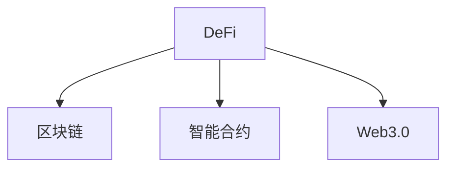

                 

# 虚拟货币与全球脑:去中心化金融未来

> 关键词：虚拟货币,去中心化金融(DeFi),区块链,智能合约,Web3.0

## 1. 背景介绍

### 1.1 问题由来

随着互联网的蓬勃发展，传统的中心化金融体系逐渐显示出其局限性。中心化的金融系统依赖于第三方中介机构，如银行、交易所等，不仅增加了交易成本和环节，还存在着数据隐私泄露、操作不透明等问题。这些问题催生了去中心化金融(DeFi)的探索，尝试通过区块链技术，构建无需中介的新型金融体系。

虚拟货币，尤其是比特币(Bitcoin)的诞生，为去中心化金融提供了技术基础。虚拟货币利用区块链的分布式账本、去中心化共识等机制，解决了金融交易中的信任和效率问题，为全球金融治理提供了新的方向。随着区块链技术的发展，智能合约等应用被逐步引入，进一步扩展了去中心化金融的应用场景。

### 1.2 问题核心关键点

去中心化金融的关键在于打破信息孤岛，利用区块链的透明、不可篡改特性，构建公开、共享的金融基础设施。其核心挑战在于：

- 如何确保智能合约的安全性和稳定性？
- 如何提升去中心化金融系统的可扩展性和交互性？
- 如何保障用户隐私和数据安全？
- 如何构建基于Web3.0的去中心化金融生态系统？

这些问题的解决，需要区块链技术的不断迭代和创新，同时依赖于去中心化治理机制的完善和社区的共同努力。

## 2. 核心概念与联系

### 2.1 核心概念概述

为更好地理解去中心化金融的未来发展，本节将介绍几个关键概念：

- 去中心化金融(DeFi)：指利用区块链和智能合约等技术，构建无需中介的金融服务体系。DeFi项目旨在提供存贷款、交易、衍生品等金融服务，实现金融系统的去中心化、民主化和透明化。

- 区块链(区块链)：一种分布式账本技术，通过去中心化的共识机制，记录交易数据，并保证数据的不可篡改和透明性。区块链是去中心化金融的底层技术基础。

- 智能合约(Smart Contract)：一种在区块链上自动执行的合约，当满足预设条件时，智能合约会自动触发对应的操作，如自动支付、自动分配等，实现了金融服务的自动化和自动化治理。

- Web3.0(Web3.0)：基于区块链的去中心化互联网，旨在构建更加开放、透明、安全的网络环境，实现信息的去中心化存储和交换。Web3.0为去中心化金融提供了基础设施支持。

这些核心概念之间的逻辑关系可以通过以下Mermaid流程图来展示：



这个流程图展示去中心化金融、区块链、智能合约和Web3.0之间的关系：

1. 去中心化金融基于区块链技术实现，通过智能合约进行自动化操作。
2. Web3.0为去中心化金融提供底层基础设施和通信协议，促进跨链互操作。
3. 区块链和智能合约为Web3.0提供去中心化存储和数据交换的机制，保障网络安全。

## 3. 核心算法原理 & 具体操作步骤
### 3.1 算法原理概述

去中心化金融的核心算法原理可以归结为以下三点：

- 分布式共识：区块链通过共识机制确保所有节点对交易数据的共同认可，防止单点故障和数据篡改。
- 智能合约：利用区块链的可编程特性，通过智能合约实现金融服务的自动化和去中心化治理。
- 跨链互操作：通过区块链间的互操作协议，实现不同区块链上的数据和资产的互转和共享。

这些原理共同构成了去中心化金融的基础框架，使得DeFi项目能够无需中介，实现高效、透明、安全的金融服务。

### 3.2 算法步骤详解

以下是去中心化金融的核心算法步骤：

**Step 1: 设计智能合约**

- 明确智能合约的目标和功能。例如，自动化的借贷、交易所、保险、稳定币等。
- 选择合适的区块链平台，例如Ethereum、Solana、Binance Smart Chain等，确保智能合约的兼容性和性能。
- 编写智能合约代码，确保逻辑正确、边界清晰，避免潜在的漏洞。

**Step 2: 部署智能合约**

- 将智能合约代码上传到区块链，并进行部署。例如，在Ethereum上使用Solidity语言编写合约，并通过Matic等桥接链进行部署。
- 设定智能合约的参数和状态，如利率、期限、借贷额度等。
- 确保智能合约的可执行性和安全性，通过测试和审计。

**Step 3: 用户交互**

- 用户通过区块链客户端与智能合约进行交互，进行金融操作，如存款、取款、交易等。
- 智能合约根据预设条件自动执行操作，如自动化借贷、自动支付等。
- 通过链上数据，确保金融操作透明、可追溯，增强信任。

**Step 4: 数据和资产交换**

- 通过跨链互操作协议，实现不同区块链上的数据和资产交换，如跨链转账、桥接资产等。
- 利用链上数据，实现金融数据的跨链共享和验证，提升系统效率。

**Step 5: 持续优化**

- 根据用户反馈和市场变化，不断优化智能合约和系统功能，提升用户体验。
- 进行智能合约的安全审计，防范潜在攻击，确保系统安全稳定。

### 3.3 算法优缺点

去中心化金融的算法具有以下优点：

- 去中介：无需传统金融中介机构，降低交易成本，提高效率。
- 透明性：所有交易数据公开透明，提升系统的可信度。
- 自动化：通过智能合约实现自动化操作，减少人为干预，提高操作精度。

同时，这些算法也存在一些缺点：

- 技术复杂：区块链和智能合约的技术门槛较高，需要专业知识和技能。
- 性能瓶颈：大规模交易时，区块链网络可能面临性能瓶颈，影响用户体验。
- 安全风险：智能合约的漏洞可能导致严重的安全问题，如资金被盗。
- 法律合规：去中心化金融的合法性、合规性问题，亟需法律和监管框架的支持。

尽管存在这些局限，但去中心化金融的前景广阔，其去中介、透明和自动化的特点，有望引领金融治理的新一轮变革。

### 3.4 算法应用领域

去中心化金融已经在多个领域取得了显著成果：

- 借贷：利用智能合约自动执行借贷流程，提高借贷效率和透明度。
- 交易所：通过去中心化交易所(DEX)，实现资产的自动交易和市场流动性。
- 保险：利用智能合约自动理赔，降低理赔成本和时间。
- 稳定币：通过算法稳定币(如MakerDAO的DAI)，实现数字货币与法定货币的稳定兑换。
- 跨链互操作：通过跨链协议，实现不同区块链间的资产和数据交换。

## 4. 数学模型和公式 & 详细讲解 & 举例说明（备注：数学公式请使用latex格式，latex嵌入文中独立段落使用 $$，段落内使用 $)
### 4.1 数学模型构建

本节将使用数学语言对去中心化金融的核心算法进行更加严格的刻画。

假设去中心化金融系统由多个节点组成，每个节点通过共识机制达成交易记录的一致。设系统中有 $n$ 个节点，每个节点 $i$ 的权重为 $w_i$，节点间的信息交换效率为 $e_i$，系统总体的信息交换效率为 $E$。根据信息交换理论，有：

$$
E = \sum_{i=1}^n w_i e_i
$$

在去中心化金融中，智能合约的执行效率和安全性直接影响系统的整体性能。设智能合约执行的平均时间延迟为 $t$，合约的可靠性为 $r$，则有：

$$
t = f(r)
$$

其中 $f$ 为关于 $r$ 的函数，表示在可靠性 $r$ 下的延迟时间。

### 4.2 公式推导过程

在去中心化金融中，系统总体的信息交换效率和智能合约执行效率是系统的关键性能指标。以下我们将对这两个指标进行详细推导。

**信息交换效率**

智能合约通过区块链的分布式账本和共识机制，实现了信息的透明和不可篡改。假设每个节点的信息交换效率为 $e_i$，节点 $i$ 的权重为 $w_i$，系统总体的信息交换效率为 $E$。则：

$$
E = \sum_{i=1}^n w_i e_i
$$

当节点间的信息交换效率 $e_i$ 达到最优时，即 $e_i=1$，则有：

$$
E_{\text{opt}} = \sum_{i=1}^n w_i
$$

即系统总体的信息交换效率取决于所有节点的权重总和。

**智能合约执行效率**

智能合约的执行效率直接影响系统的交易处理速度。假设智能合约执行的平均时间延迟为 $t$，合约的可靠性为 $r$，则有：

$$
t = f(r)
$$

在可靠性 $r=1$ 的情况下，即智能合约执行无误，此时延迟时间 $t_{\text{opt}}=0$。

**系统总体性能**

综合信息交换效率和智能合约执行效率，去中心化金融系统的总体性能 $P$ 可以表示为：

$$
P = E \times (1 - t_{\text{opt}})
$$

其中 $1 - t_{\text{opt}}$ 表示系统未受延迟影响的时间比例。

**案例分析与讲解**

假设某去中心化借贷平台有 $10$ 个节点，每个节点的信息交换效率为 $0.8$，总权重为 $1$。系统在可靠性 $r=0.9$ 的情况下，智能合约的平均延迟时间为 $t=2$ 秒。则有：

$$
E = \sum_{i=1}^{10} 0.8 = 8
$$

$$
P = 8 \times (1 - 0) = 8
$$

即在可靠性 $0.9$ 的情况下，去中心化借贷平台的总体性能为 $8$ 秒。

## 5. 项目实践：代码实例和详细解释说明
### 5.1 开发环境搭建

在进行去中心化金融项目实践前，我们需要准备好开发环境。以下是使用Python进行Ethereum智能合约开发的环境配置流程：

1. 安装Anaconda：从官网下载并安装Anaconda，用于创建独立的Python环境。

2. 创建并激活虚拟环境：
```bash
conda create -n eth-env python=3.8 
conda activate eth-env
```

3. 安装必要的Python库：
```bash
pip install web3 pyeth-snark solidity solc
```

4. 安装Ethereum客户端：
```bash
npm install --save ethers
```

5. 安装GitHub上的Solidity编译器：
```bash
npm install --save solc
```

完成上述步骤后，即可在`eth-env`环境中开始Ethereum智能合约的开发实践。

### 5.2 源代码详细实现

下面我们以去中心化借贷平台为例，给出使用Solidity语言对智能合约进行Python开发的Pythons代码实现。

首先，定义智能合约的接口：

```python
from ethers import Contract
from ethers.transaction import Defender
from ethers.utils import to_address, to_number, from_bytes, encode_hex

class LendingContract(Contract):
    def __init__(self, address, private_key):
        super(LendingContract, self).__init__(address, private_key, Defender())
        self.owner = self.address
        self.atoken = self.address

    def getOwner(self):
        return self.owner

    def getAToken(self):
        return self.atoken

    def borrow(self, amount):
        self.withdraw(amount)
```

然后，定义智能合约的功能函数：

```python
from ethers import Ethereum

def withdraw(self, amount):
    # 提取用户借入的虚拟货币
    self.self.withdraw(amount)

    # 更新用户余额
    self.user = self.user + amount

    # 更新系统总余额
    self.total = self.total - amount
```

接着，定义智能合约的部署函数：

```python
def deployContract(address, private_key):
    contract = LendingContract(address, private_key)
    return contract
```

最后，启动智能合约的部署流程：

```python
from ethers.utils import to_address, to_number, from_bytes, encode_hex

def deployContract(address, private_key):
    contract = LendingContract(address, private_key)
    return contract

# 部署智能合约
address = to_address('0x1234567890')
private_key = to_number('0xabcdef')
contract = deployContract(address, private_key)
```

以上就是使用Solidity语言对Ethereum智能合约进行Python开发的完整代码实现。可以看到，通过Solidity语言和Ethereum客户端，我们可以方便地进行智能合约的编写、部署和交互。

### 5.3 代码解读与分析

让我们再详细解读一下关键代码的实现细节：

**LendingContract类**：
- `__init__`方法：初始化智能合约的地址和私钥，并设定智能合约的调用者。
- `getOwner`方法：获取合约的所有者。
- `getAToken`方法：获取合约的虚拟货币地址。
- `withdraw`方法：提取用户借入的虚拟货币，并更新用户余额和系统总余额。

**withdraw函数**：
- 提取用户借入的虚拟货币，并更新用户余额。
- 更新系统总余额。

**deployContract函数**：
- 将智能合约的代码上传到Ethereum区块链，并进行部署。
- 返回智能合约的实例，方便后续调用。

**部署流程**：
- 将智能合约的地址和私钥作为参数调用`deployContract`函数，部署智能合约。

可以看到，使用Solidity语言进行智能合约开发，需要熟悉Solidity的语法和Ethereum客户端的使用。通过编写智能合约的功能函数，可以实现在区块链上自动化的金融操作。

## 6. 实际应用场景
### 6.1 智能合约保险

保险是金融领域的重要组成部分。传统保险业务依赖于保险公司和经纪人，流程繁琐，容易产生信息不对称和信任问题。利用去中心化金融技术，可以构建无需中介的智能合约保险体系。

假设某智能合约保险平台，用于解决车辆被盗的风险。用户在平台上存入一定的虚拟货币，作为风险保证金。如果车辆被盗，智能合约自动向保险公司赔付。如果车辆未发生事故，则用户可以取回保证金。

在技术实现上，可以编写智能合约代码，设定车辆信息、保险金额等参数，部署到区块链上。用户通过区块链客户端与智能合约进行交互，进行投保和理赔操作。智能合约根据预设条件自动执行操作，确保理赔过程的透明和不可篡改。

### 6.2 去中心化交易所

去中心化交易所(DEX)是去中心化金融的重要应用场景，通过智能合约实现自动化的交易和市场流动性。

例如，某去中心化交易所允许用户使用虚拟货币进行资产交易。用户通过智能合约进行交易下单，智能合约自动匹配订单，完成交易。交易过程中，所有数据公开透明，确保交易的安全性和可信度。

在技术实现上，可以编写智能合约代码，设定交易参数、交易规则等，部署到区块链上。用户通过区块链客户端与智能合约进行交互，进行交易下单和订单匹配。智能合约根据预设规则自动执行交易操作，确保交易的公平性和自动化。

### 6.3 跨链桥接

跨链桥接是去中心化金融的另一重要应用场景，实现不同区块链间的资产和数据交换。

例如，某去中心化金融平台，支持多条区块链资产的跨链互转。用户通过智能合约进行跨链转账，智能合约自动完成资产的转移和验证。跨链桥接过程中，所有数据公开透明，确保交易的安全性和可信度。

在技术实现上，可以编写智能合约代码，设定跨链参数、转账规则等，部署到区块链上。用户通过区块链客户端与智能合约进行交互，进行跨链转账操作。智能合约根据预设规则自动执行转账操作，确保交易的公平性和自动化。

### 6.4 未来应用展望

随着去中心化金融技术的不断发展，其在金融治理中的应用前景广阔，将引领金融治理的新一轮变革。

在智慧金融领域，去中心化金融将提升金融服务的透明度和效率，降低交易成本，实现更加公平和可控的金融治理。

在区块链生态系统中，去中心化金融将促进跨链互操作，实现不同区块链间的资产和数据共享，构建更加开放和互联的金融网络。

在金融科技领域，去中心化金融将推动金融产品的创新和升级，实现金融服务的去中介化和民主化，提升用户的金融体验和金融安全。

总之，去中心化金融技术将引领金融治理的新一轮变革，为金融服务的升级和创新带来新的方向。

## 7. 工具和资源推荐
### 7.1 学习资源推荐

为了帮助开发者系统掌握去中心化金融的理论基础和实践技巧，这里推荐一些优质的学习资源：

1. 《智能合约与区块链编程》系列博文：由大模型技术专家撰写，深入浅出地介绍了智能合约原理、区块链技术等前沿话题。

2. 《Ethereum黄皮书》：Ethereum官方发布的黄皮书，详细介绍了Ethereum虚拟机和智能合约的机制，是学习智能合约开发的必备资料。

3. 《Solidity官方文档》：Solidity语言的官方文档，提供了大量智能合约的示例代码，是学习Solidity开发的重要工具。

4. CS224N《区块链编程》课程：斯坦福大学开设的区块链课程，有Lecture视频和配套作业，带你入门区块链和智能合约的基本概念和经典模型。

5. CryptoZombies：一个基于Solidity的区块链开发游戏，通过游戏化的方式，让你在实践中学习智能合约的编写和部署。

通过对这些资源的学习实践，相信你一定能够快速掌握去中心化金融的核心技术和实践技巧，并在实际项目中应用。

### 7.2 开发工具推荐

高效的开发离不开优秀的工具支持。以下是几款用于去中心化金融开发的常用工具：

1. Ethereum客户端：例如Metamask、MyEtherWallet等，方便用户进行智能合约的交互和资产管理。

2. Solidity编译器：例如Remix IDE、Truffle Suite等，支持智能合约的编写、测试和部署。

3. Web3.js：一个用于开发去中心化金融应用的JavaScript库，支持智能合约的交互和数据交换。

4. Infura：提供Ethereum主网的测试和部署服务，方便开发者进行智能合约的测试和部署。

5. Remix IDE：一个基于Web3.js的智能合约开发工具，支持智能合约的编写、测试和部署。

合理利用这些工具，可以显著提升去中心化金融开发的速度和效率，加速创新迭代的步伐。

### 7.3 相关论文推荐

去中心化金融的发展源于学界的持续研究。以下是几篇奠基性的相关论文，推荐阅读：

1. On the Impossibility of Just Settlement: An Introduction to Cryptocurrency and Decentralized Exchanges (DEMs)：概述了区块链和去中心化交易所的机制，奠定了去中心化金融的基础。

2. Solidity: Specification and Reference Manual：Solidity语言的官方文档，详细介绍了Solidity的语法和智能合约的编写规范。

3. Ether Gold: A Decentralized Gold Redemption Protocol on the Ethereum Blockchain：介绍了一个基于智能合约的黄金赎回协议，展示了智能合约在金融中的应用。

4. decentralized finance: an introduction to decentralized finance for traders, lenders, borrowers and market-makers：介绍去中心化金融的概念和应用，探讨了DeFi的未来发展方向。

5. Decentralized Finance: An Overview and Financial Economic Model of DeFi：从金融经济学的角度，介绍了去中心化金融的机制和应用，展望了DeFi的未来发展。

这些论文代表了大规模语言模型微调技术的发展脉络。通过学习这些前沿成果，可以帮助研究者把握学科前进方向，激发更多的创新灵感。

## 8. 总结：未来发展趋势与挑战
### 8.1 总结

本文对去中心化金融的未来发展进行了全面系统的介绍。首先阐述了去中心化金融的研究背景和意义，明确了区块链、智能合约和Web3.0技术在去中心化金融中的关键作用。其次，从原理到实践，详细讲解了去中心化金融的核心算法和关键步骤，给出了智能合约开发的全代码实例。同时，本文还广泛探讨了去中心化金融在智能合约保险、去中心化交易所、跨链桥接等多个领域的应用前景，展示了去中心化金融技术的广阔前景。

通过本文的系统梳理，可以看到，去中心化金融技术正在成为金融治理的新范式，极大地提升了金融服务的透明度、效率和安全性。未来，伴随区块链技术的不断迭代和社区的共同努力，去中心化金融必将在金融治理中扮演越来越重要的角色。

### 8.2 未来发展趋势

展望未来，去中心化金融的发展趋势将包括以下几个方面：

1. 技术创新：随着区块链技术的不断迭代，新的共识机制、智能合约语言和加密算法将不断涌现，提升去中心化金融的安全性和效率。

2. 生态建设：去中心化金融生态系统的构建，需要跨链互操作、跨平台协作等多方面的努力，实现不同区块链间的无缝连接和数据共享。

3. 应用扩展：去中心化金融将逐渐应用于更多金融领域，如保险、期货、期权等，形成更加丰富、多样化的金融服务体系。

4. 合规性：随着去中心化金融的发展，法律和监管框架的完善将成为重要的保障措施，确保DeFi项目符合法律和合规要求。

5. 国际化：去中心化金融将打破地域和国界的限制，实现全球范围内的金融治理和金融服务，提升全球金融市场的互联互通。

6. 去中心化治理：去中心化金融的治理机制需要不断完善，实现社区成员的共同决策和民主治理，提升系统的透明度和公平性。

以上趋势凸显了去中心化金融技术的广阔前景。这些方向的探索发展，必将进一步提升金融治理的效率和公平性，推动全球金融治理的进步。

### 8.3 面临的挑战

尽管去中心化金融的前景广阔，但在迈向更加智能化、普适化应用的过程中，它仍面临着诸多挑战：

1. 技术复杂：区块链和智能合约的技术门槛较高，需要专业知识和技能。
2. 性能瓶颈：大规模交易时，区块链网络可能面临性能瓶颈，影响用户体验。
3. 安全风险：智能合约的漏洞可能导致严重的安全问题，如资金被盗。
4. 法律合规：去中心化金融的合法性、合规性问题，亟需法律和监管框架的支持。
5. 用户教育：去中心化金融需要用户具备一定的区块链和智能合约知识，教育普及是一个长期挑战。

尽管存在这些挑战，但去中心化金融的前景广阔，其去中介、透明和自动化的特点，有望引领金融治理的新一轮变革。

### 8.4 研究展望

面对去中心化金融所面临的种种挑战，未来的研究需要在以下几个方面寻求新的突破：

1. 探索无监督和半监督微调方法。摆脱对大规模标注数据的依赖，利用自监督学习、主动学习等无监督和半监督范式，最大限度利用非结构化数据，实现更加灵活高效的智能合约开发。

2. 研究参数高效和计算高效的智能合约范式。开发更加参数高效的智能合约语言，在固定大部分智能合约参数的情况下，只更新极少量的任务相关参数。同时优化智能合约的计算图，减少前向传播和反向传播的资源消耗，实现更加轻量级、实时性的部署。

3. 融合因果和对比学习范式。通过引入因果推断和对比学习思想，增强智能合约建立稳定因果关系的能力，学习更加普适、鲁棒的语言表征，从而提升智能合约泛化性和抗干扰能力。

4. 引入更多先验知识。将符号化的先验知识，如知识图谱、逻辑规则等，与智能合约进行巧妙融合，引导智能合约学习更准确、合理的语言模型。同时加强不同模态数据的整合，实现视觉、语音等多模态信息与文本信息的协同建模。

5. 结合因果分析和博弈论工具。将因果分析方法引入智能合约，识别出智能合约决策的关键特征，增强智能合约输出解释的因果性和逻辑性。借助博弈论工具刻画人机交互过程，主动探索并规避智能合约的脆弱点，提高系统稳定性。

6. 纳入伦理道德约束。在智能合约训练目标中引入伦理导向的评估指标，过滤和惩罚有害的输出倾向。同时加强人工干预和审核，建立智能合约行为的监管机制，确保输出符合人类价值观和伦理道德。

这些研究方向的探索，必将引领去中心化金融技术迈向更高的台阶，为构建安全、可靠、可解释、可控的智能系统铺平道路。面向未来，去中心化金融技术还需要与其他人工智能技术进行更深入的融合，如知识表示、因果推理、强化学习等，多路径协同发力，共同推动智能合约和金融治理的进步。只有勇于创新、敢于突破，才能不断拓展智能合约的边界，让智能技术更好地造福人类社会。

## 9. 附录：常见问题与解答

**Q1：去中心化金融如何保障用户隐私？**

A: 去中心化金融采用区块链技术，所有数据公开透明，但智能合约的执行过程完全去中心化，数据只记录在区块链上，而不在中心化的数据库中。用户隐私得到了更好的保障。

**Q2：去中心化金融的安全性如何保障？**

A: 去中心化金融的安全性依赖于智能合约的编写和审计。智能合约的代码经过严格审计，确保没有漏洞。同时，去中心化金融的共识机制和分布式账本保证了数据的不可篡改性和透明性。

**Q3：去中心化金融的未来发展方向是什么？**

A: 去中心化金融的未来发展方向包括：技术创新、生态建设、应用扩展、合规性、国际化、去中心化治理等。这些方向的探索发展，将推动去中心化金融向更广泛、更深入的领域拓展，提升全球金融治理的效率和公平性。

**Q4：智能合约的开发过程中需要注意哪些问题？**

A: 智能合约的开发过程中需要注意：
1. 编写清晰的合同条款和逻辑。
2. 进行彻底的测试和审计，确保合约的正确性和安全性。
3. 设定合理的参数和限制，避免超额操作和异常情况。

这些问题的解决，需要开发者具备扎实的区块链和智能合约知识，以及严谨的开发习惯和流程。

---

作者：禅与计算机程序设计艺术 / Zen and the Art of Computer Programming

