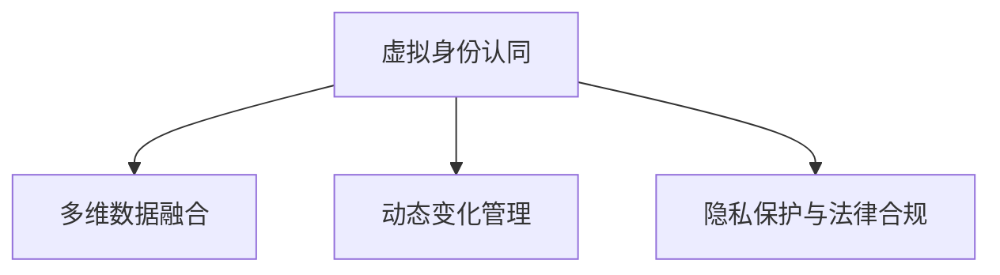

                 

# 虚拟身份认同：AI时代的自我探索

> 关键词：虚拟身份认同,AI时代,自我探索,技术发展,身份安全,隐私保护,未来展望

## 1. 背景介绍

### 1.1 问题由来
在数字化和网络化日益深入的今天，人们的虚拟身份认同变得日益重要。无论是社交媒体、电商平台还是智能家居，用户都通过虚拟身份与技术平台进行互动，形成了一种全新的存在方式。然而，这种虚拟身份并非静态不变，而是随着时间和使用习惯的积累而动态演变，如何科学有效地探索和利用这种动态的虚拟身份认同，成为当前AI时代的重要议题。

### 1.2 问题核心关键点
当前，虚拟身份认同的探索主要集中在以下几个关键点：

1. **数据驱动的模型构建**：通过用户的虚拟行为数据，构建用户画像模型，从而描绘出用户虚拟身份的轮廓。
2. **多维数据的融合**：融合不同维度的数据（如地理位置、时间、行为等），提升虚拟身份模型的准确性和全面性。
3. **动态变化的管理**：捕捉和分析用户虚拟身份随时间的变化，并根据变化调整模型。
4. **隐私保护与法律合规**：确保虚拟身份模型的构建和使用过程中，用户隐私得到充分保护，并遵守相关法律法规。

## 2. 核心概念与联系

### 2.1 核心概念概述

为了更好地理解虚拟身份认同，本节将介绍几个密切相关的核心概念：

- **虚拟身份认同（Virtual Identity Recognition）**：指通过用户的虚拟行为数据，构建用户画像模型，描绘出用户在虚拟空间中的身份特征和行为模式。
- **多维数据融合（Multi-dimensional Data Fusion）**：将地理位置、时间、行为等不同维度的数据进行综合，构建更全面、准确的虚拟身份模型。
- **动态变化管理（Dynamic Change Management）**：捕捉并分析用户在虚拟身份随时间的动态变化，及时调整虚拟身份模型以适应新的状态。
- **隐私保护与法律合规（Privacy Protection and Legal Compliance）**：在虚拟身份模型的构建和使用过程中，确保用户隐私得到充分保护，并遵守相关法律法规。

这些概念之间的逻辑关系可以通过以下Mermaid流程图来展示：



这个流程图展示了虚拟身份认同的构建过程及其核心组件之间的相互作用。

## 3. 核心算法原理 & 具体操作步骤
### 3.1 算法原理概述

虚拟身份认同的算法原理基于机器学习和数据分析技术。其核心思想是通过对用户虚拟行为数据的挖掘，构建虚拟身份模型，捕捉和分析用户在不同场景下的行为特征，从而实现对用户虚拟身份的准确识别和理解。

形式化地，假设用户虚拟行为数据为 $D=\{(x_i, y_i)\}_{i=1}^N$，其中 $x_i$ 表示用户在场景 $i$ 下的行为数据，$y_i$ 表示用户在场景 $i$ 下的标签（如“购物”、“浏览”、“社交”等）。虚拟身份模型的目标是找到一个函数 $f(x)$，使得对于新的行为数据 $x'$，模型能够准确预测其对应的虚拟身份标签 $y'$。

通过监督学习算法，如支持向量机、随机森林、神经网络等，可以训练出一个虚拟身份模型 $M$，其预测输出为：

$$
\hat{y} = M(x')
$$

其中 $\hat{y}$ 为模型预测的虚拟身份标签，$M$ 为训练得到的虚拟身份模型。

### 3.2 算法步骤详解

基于虚拟身份认同的算法主要包括以下几个关键步骤：

**Step 1: 数据收集与预处理**
- 收集用户在不同场景下的虚拟行为数据，包括浏览记录、购买记录、互动记录等。
- 对数据进行清洗和标注，去除无效数据，确保数据的质量和准确性。

**Step 2: 特征工程**
- 对行为数据进行特征提取，如统计浏览时间、点击次数、浏览路径等，构建用户虚拟行为特征向量。
- 将不同维度的数据进行融合，构建综合性的虚拟身份特征。

**Step 3: 模型训练与调优**
- 选择合适的机器学习算法，如随机森林、神经网络等，对虚拟身份模型进行训练。
- 对模型进行调优，选择合适的超参数，确保模型具有良好的泛化性能。

**Step 4: 动态更新与维护**
- 定期收集新的虚拟行为数据，对模型进行重新训练和更新，确保模型能够及时捕捉用户身份的动态变化。
- 设置模型自动更新机制，根据用户行为数据的变化，动态调整虚拟身份模型的参数。

**Step 5: 隐私保护与法律合规**
- 在数据收集和模型训练过程中，确保用户隐私得到充分保护，遵守相关法律法规。
- 采用匿名化、加密等技术，保护用户数据不被滥用。

以上是虚拟身份认同算法的核心步骤。在实际应用中，还需要针对具体任务和数据特点，对各个环节进行优化设计，如改进特征提取算法、引入更好的模型训练技术、优化动态更新机制等，以进一步提升模型性能。

### 3.3 算法优缺点

虚拟身份认同算法具有以下优点：
1. 可以实时捕捉用户虚拟身份的变化，提供动态的用户画像。
2. 通过多维数据融合，构建更全面、准确的虚拟身份模型。
3. 通过机器学习算法，提升模型的预测准确性和泛化性能。

同时，该算法也存在一定的局限性：
1. 依赖于高质量标注数据，数据收集和标注成本较高。
2. 算法复杂度较高，需要较强的计算资源支持。
3. 模型解释性不足，难以理解其内部决策逻辑。
4. 数据隐私保护和法律法规合规要求较高，需严格控制。

尽管存在这些局限性，但就目前而言，虚拟身份认同算法是实现用户虚拟身份识别和理解的最主流范式。未来相关研究的重点在于如何进一步降低数据依赖，提高模型可解释性，并确保隐私和法律合规。

### 3.4 算法应用领域

虚拟身份认同算法在多个领域得到了广泛的应用，例如：

- **电子商务**：通过用户虚拟身份模型，识别用户的购物偏好和行为模式，提供个性化的商品推荐。
- **社交媒体**：利用用户的虚拟行为数据，分析用户兴趣和社交关系，实现智能推荐和内容分发。
- **金融服务**：通过用户的虚拟身份模型，评估用户的信用风险和财务状况，提供个性化的金融服务。
- **智能家居**：通过用户的虚拟身份模型，理解用户的需求和行为习惯，实现智能化的家居控制和场景切换。

除了上述这些经典应用外，虚拟身份认同技术还在智能客服、安全监控、个性化广告等领域得到创新性的应用，为人们的生活带来便利和效率提升。

## 4. 数学模型和公式 & 详细讲解
### 4.1 数学模型构建

本节将使用数学语言对虚拟身份认同的算法过程进行更加严格的刻画。

假设用户虚拟行为数据为 $D=\{(x_i, y_i)\}_{i=1}^N$，其中 $x_i$ 表示用户在场景 $i$ 下的行为数据，$y_i$ 表示用户在场景 $i$ 下的标签。构建虚拟身份模型的目标是最小化经验风险，即找到一个函数 $f(x)$，使得对于新的行为数据 $x'$，模型能够准确预测其对应的虚拟身份标签 $y'$。

定义经验风险函数为：

$$
\mathcal{L}(f) = \frac{1}{N} \sum_{i=1}^N \ell(f(x_i), y_i)
$$

其中 $\ell$ 为损失函数，常用的损失函数包括交叉熵损失、均方误差损失等。

### 4.2 公式推导过程

以下我们以交叉熵损失函数为例，推导其计算公式。

假设模型 $M$ 在输入 $x_i$ 上的预测输出为 $\hat{y}_i = M(x_i)$，真实标签为 $y_i$，则交叉熵损失函数定义为：

$$
\ell(f(x_i), y_i) = -y_i \log \hat{y}_i - (1-y_i) \log (1-\hat{y}_i)
$$

将其代入经验风险函数，得：

$$
\mathcal{L}(f) = -\frac{1}{N} \sum_{i=1}^N [y_i \log \hat{y}_i + (1-y_i) \log (1-\hat{y}_i)]
$$

为了求解上述最优化问题，我们采用梯度下降等优化算法，对函数 $f(x)$ 的参数进行优化，最小化经验风险 $\mathcal{L}(f)$。

设模型参数为 $\theta$，则损失函数对参数 $\theta$ 的梯度为：

$$
\nabla_{\theta}\mathcal{L}(f) = \frac{\partial \mathcal{L}(f)}{\partial \theta}
$$

在得到损失函数的梯度后，即可带入梯度下降等优化算法，进行参数更新。重复上述过程直至收敛，最终得到适应用户虚拟身份模型的最优参数 $\theta^*$。

### 4.3 案例分析与讲解

以下是一个简单的虚拟身份模型构建案例：

假设某电商平台收集了用户的购物记录数据，包括商品ID、购买时间、购买次数等。我们将这些数据进行预处理，去除无效数据，对购买次数进行归一化处理。然后，构建用户的虚拟身份特征向量，如购物频率、购买金额等。最后，使用随机森林算法对虚拟身份模型进行训练，并对模型进行调优，最终得到一个虚拟身份模型 $M$。

在训练过程中，我们采用交叉验证等技术，评估模型的泛化性能，并进行参数调整。例如，我们可以尝试调整树的深度、节点分裂规则等，以找到最佳的模型配置。在训练完成后，我们可以使用新的购物行为数据对模型进行测试，评估模型的预测准确性。

## 5. 项目实践：代码实例和详细解释说明
### 5.1 开发环境搭建

在进行虚拟身份认同的开发实践前，我们需要准备好开发环境。以下是使用Python进行PyTorch开发的环境配置流程：

1. 安装Anaconda：从官网下载并安装Anaconda，用于创建独立的Python环境。

2. 创建并激活虚拟环境：
```bash
conda create -n pytorch-env python=3.8 
conda activate pytorch-env
```

3. 安装PyTorch：根据CUDA版本，从官网获取对应的安装命令。例如：
```bash
conda install pytorch torchvision torchaudio cudatoolkit=11.1 -c pytorch -c conda-forge
```

4. 安装相关库：
```bash
pip install numpy pandas scikit-learn torch
```

5. 安装多维数据融合库：
```bash
pip install pyhf
```

完成上述步骤后，即可在`pytorch-env`环境中开始虚拟身份认同的开发实践。

### 5.2 源代码详细实现

下面以用户虚拟身份模型的构建为例，给出使用PyTorch进行机器学习的完整代码实现。

首先，定义虚拟身份数据的处理函数：

```python
import pandas as pd
from sklearn.preprocessing import LabelEncoder

def process_data(data_path):
    # 读取数据
    data = pd.read_csv(data_path)
    
    # 处理缺失值
    data.fillna(method='ffill', inplace=True)
    
    # 数据转换
    y = data.pop('label')
    y = LabelEncoder().fit_transform(y)
    
    # 特征工程
    X = data.drop('label', axis=1)
    X = X.apply(lambda x: x.fillna(x.median()))
    
    return X, y
```

然后，定义模型和优化器：

```python
from sklearn.ensemble import RandomForestClassifier

class VirtualIdentityModel:
    def __init__(self, n_estimators=100, max_depth=None):
        self.model = RandomForestClassifier(n_estimators=n_estimators, max_depth=max_depth)
    
    def train(self, X_train, y_train):
        self.model.fit(X_train, y_train)
    
    def predict(self, X_test):
        return self.model.predict(X_test)
```

接着，定义训练和评估函数：

```python
from sklearn.model_selection import train_test_split
from sklearn.metrics import accuracy_score

def train_and_evaluate(X, y, test_size=0.2, batch_size=64):
    # 数据划分
    X_train, X_test, y_train, y_test = train_test_split(X, y, test_size=test_size)
    
    # 模型训练
    model = VirtualIdentityModel()
    model.train(X_train, y_train)
    
    # 模型评估
    y_pred = model.predict(X_test)
    accuracy = accuracy_score(y_test, y_pred)
    print(f"Accuracy: {accuracy:.2f}")
```

最后，启动训练流程并在测试集上评估：

```python
# 数据准备
X, y = process_data('data.csv')

# 模型训练和评估
train_and_evaluate(X, y)
```

以上就是使用PyTorch进行虚拟身份模型构建的完整代码实现。可以看到，得益于Scikit-learn的强大封装，我们可以用相对简洁的代码完成虚拟身份模型的构建。

### 5.3 代码解读与分析

让我们再详细解读一下关键代码的实现细节：

**VirtualIdentityModel类**：
- `__init__`方法：初始化虚拟身份模型，包括模型参数和模型结构。
- `train`方法：在训练集上训练模型。
- `predict`方法：在测试集上使用模型进行预测。

**train_and_evaluate函数**：
- 使用train_test_split对数据集进行划分，分成训练集和测试集。
- 训练随机森林模型，并评估其预测准确性。

**process_data函数**：
- 读取数据，处理缺失值。
- 使用LabelEncoder对标签进行编码，确保模型训练过程中标签是数值化的。
- 对特征进行归一化处理，去除异常值。

可以看出，PyTorch配合Scikit-learn库使得虚拟身份模型的开发变得简洁高效。开发者可以将更多精力放在数据处理、模型改进等高层逻辑上，而不必过多关注底层的实现细节。

当然，工业级的系统实现还需考虑更多因素，如模型的保存和部署、超参数的自动搜索、更灵活的任务适配层等。但核心的虚拟身份模型构建过程基本与此类似。

## 6. 实际应用场景
### 6.1 电子商务个性化推荐

虚拟身份认同技术在电子商务个性化推荐中具有广泛应用。电商平台通过用户的虚拟身份模型，可以实时捕捉用户购物偏好和行为模式的变化，从而提供个性化的商品推荐。

在技术实现上，可以收集用户的历史购物记录、浏览记录、点击记录等行为数据，构建用户的虚拟身份模型。模型能够根据用户的行为特征，实时调整推荐策略，为用户提供最适合的商品推荐。

### 6.2 社交媒体内容分发

社交媒体平台利用用户的虚拟身份模型，可以分析用户的兴趣和社交关系，实现智能化的内容分发。例如，Instagram可以根据用户的虚拟身份特征，推荐可能感兴趣的图片、视频和话题，提升用户的使用体验和平台粘性。

在具体实现中，社交媒体平台可以收集用户在不同平台上的互动数据，构建用户的虚拟身份模型。模型能够根据用户的行为特征，推荐可能感兴趣的内容，提升用户的活跃度和留存率。

### 6.3 金融风险控制

金融行业利用用户的虚拟身份模型，可以评估用户的信用风险和财务状况，提供个性化的金融服务。例如，银行可以根据用户的虚拟身份特征，评估其贷款申请的风险，提供更加精准的贷款审批和风险控制方案。

在实际应用中，银行可以收集用户的历史交易数据、信用记录等行为数据，构建用户的虚拟身份模型。模型能够根据用户的财务状况和行为特征，评估其贷款申请的风险，提供个性化的贷款审批和风险控制方案。

### 6.4 未来应用展望

随着虚拟身份认同技术的不断发展，其在更多领域得到应用，为各行各业带来变革性影响。

在智慧医疗领域，虚拟身份认同技术可以用于构建患者的虚拟身份模型，帮助医生了解患者的健康状况和历史行为，提升医疗服务的个性化和精准性。例如，患者可以通过穿戴设备上传健康数据，构建虚拟身份模型，医生可以实时获取患者的健康数据，提供个性化的诊疗方案。

在智能教育领域，虚拟身份认同技术可以用于构建学生的虚拟身份模型，帮助教师了解学生的学习情况和行为特征，提供个性化的教学方案。例如，学生可以通过学习平台上传学习记录，构建虚拟身份模型，教师可以实时获取学生的学习情况，提供个性化的教学建议。

在智慧城市治理中，虚拟身份认同技术可以用于构建市民的虚拟身份模型，提升城市管理的智能化水平。例如，市民可以通过智能设备上传行为数据，构建虚拟身份模型，城市管理部门可以实时获取市民的行为数据，提供个性化的城市服务。

除了上述这些应用外，虚拟身份认同技术还在企业生产、社会治理、文娱传媒等领域得到创新性的应用，为人们的生活带来便利和效率提升。

## 7. 工具和资源推荐
### 7.1 学习资源推荐

为了帮助开发者系统掌握虚拟身份认同的理论基础和实践技巧，这里推荐一些优质的学习资源：

1. 《机器学习》课程：由斯坦福大学Andrew Ng教授开设的机器学习经典课程，系统介绍了机器学习的基本概念和常用算法。

2. 《深度学习》课程：由吴恩达教授开设的深度学习课程，详细讲解了深度学习的基本原理和应用场景。

3. 《Python机器学习》书籍：斯坦福大学教授Christopher M. Bishop所著，全面介绍了机器学习在Python中的应用，包括数据预处理、模型训练、模型评估等。

4. Kaggle平台：数据科学和机器学习的竞赛平台，提供了大量公开数据集和竞赛任务，适合实战学习和技能提升。

5. PyTorch官方文档：PyTorch的官方文档，提供了丰富的示例代码和文档教程，是学习PyTorch的必备资料。

通过对这些资源的学习实践，相信你一定能够快速掌握虚拟身份认同的精髓，并用于解决实际的NLP问题。
###  7.2 开发工具推荐

高效的开发离不开优秀的工具支持。以下是几款用于虚拟身份认同开发的常用工具：

1. PyTorch：基于Python的开源深度学习框架，灵活动态的计算图，适合快速迭代研究。

2. TensorFlow：由Google主导开发的开源深度学习框架，生产部署方便，适合大规模工程应用。

3. Scikit-learn：Python机器学习库，提供了丰富的机器学习算法和工具，适合快速原型开发和实验验证。

4. Pandas：Python数据处理库，提供了高效的数据清洗、分析和可视化功能，适合数据预处理和特征工程。

5. Jupyter Notebook：交互式编程环境，适合实时展示和调试代码，便于快速迭代和实验验证。

合理利用这些工具，可以显著提升虚拟身份认同开发的效率，加快创新迭代的步伐。

### 7.3 相关论文推荐

虚拟身份认同技术的发展源于学界的持续研究。以下是几篇奠基性的相关论文，推荐阅读：

1. Generative Adversarial Networks (GANs) for Adversarial Robustness（生成对抗网络用于鲁棒性）：提出了生成对抗网络(GANs)，用于生成逼真的对抗样本，提升模型的鲁棒性。

2. Adversarial Robustness Meets Pruning: The Attack of Perturbation Quantization（对抗鲁棒性与剪枝：扰动量化攻击）：提出了一种基于剪枝的对抗鲁棒性方法，在保证模型精度的同时，提升了模型的鲁棒性。

3. Multi-view Generative Adversarial Networks for Adversarial Robustness（多视图生成对抗网络用于鲁棒性）：提出了一种多视图生成对抗网络，从多个角度提升模型的鲁棒性。

4. Towards General-Purpose Adversarial Training: Virtual Adversarial Perturbations and Self-Labelled Examples（通用对抗训练：虚拟对抗扰动和自标注示例）：提出了一种通用对抗训练方法，提升模型在多种攻击场景下的鲁棒性。

这些论文代表了大模型鲁棒性发展脉络。通过学习这些前沿成果，可以帮助研究者把握学科前进方向，激发更多的创新灵感。

## 8. 总结：未来发展趋势与挑战
### 8.1 总结

本文对虚拟身份认同的算法原理和实际操作进行了全面系统的介绍。首先阐述了虚拟身份认同的研究背景和意义，明确了其在AI时代的重要价值。其次，从原理到实践，详细讲解了虚拟身份认同的数学模型和关键步骤，给出了虚拟身份认同任务开发的完整代码实例。同时，本文还广泛探讨了虚拟身份认同技术在电子商务、社交媒体、金融服务等多个领域的应用前景，展示了其广阔的潜力。此外，本文精选了虚拟身份认同技术的各类学习资源，力求为读者提供全方位的技术指引。

通过本文的系统梳理，可以看到，虚拟身份认同技术正在成为AI时代的重要范式，极大地拓展了人工智能在用户行为分析、个性化推荐等方面的应用边界。受益于大规模数据和计算资源的支撑，虚拟身份认同技术有望进一步提升人工智能系统的性能和应用范围，为人类认知智能的进化带来深远影响。

### 8.2 未来发展趋势

展望未来，虚拟身份认同技术将呈现以下几个发展趋势：

1. **数据驱动的持续优化**：随着数据量的不断积累，虚拟身份认同技术将能够更加精细地刻画用户的虚拟身份特征，提供更精准的个性化服务。

2. **多维数据的深度融合**：未来的虚拟身份认同模型将融合更多维度的数据，如社交网络、地理位置、时间等，提供更加全面和准确的虚拟身份描述。

3. **动态变化的实时管理**：虚拟身份认同技术将能够实时捕捉用户的虚拟身份变化，提供动态的用户画像，满足用户的即时需求。

4. **隐私保护与法律合规**：随着法律法规的日益严格，虚拟身份认同技术将更加注重隐私保护和法律合规，确保用户数据的安全和合法使用。

5. **跨平台协同应用**：虚拟身份认同技术将在不同平台和设备上实现协同应用，提供统一的虚拟身份服务，提升用户体验和系统稳定性。

6. **人工智能与虚拟身份的深度融合**：虚拟身份认同技术将与其他人工智能技术进行更深入的融合，如知识图谱、深度学习、因果推理等，提升系统的智能化水平。

以上趋势凸显了虚拟身份认同技术的广阔前景。这些方向的探索发展，必将进一步提升虚拟身份认同系统的性能和应用范围，为人工智能技术在垂直行业的规模化落地提供新的驱动力。

### 8.3 面临的挑战

尽管虚拟身份认同技术已经取得了显著进展，但在迈向更加智能化、普适化应用的过程中，它仍面临着诸多挑战：

1. **数据质量与标注成本**：高质量标注数据的获取成本较高，数据质量和标注准确性对模型的性能有重要影响。如何在保证数据质量的同时降低成本，将是未来的重要课题。

2. **模型复杂度与资源消耗**：虚拟身份认同模型往往具有较高的计算复杂度，对计算资源和内存消耗较大。如何在保持模型性能的同时，降低资源消耗，需要进一步优化算法和模型结构。

3. **隐私保护与法律法规**：用户隐私保护和法律法规合规要求较高，需在模型构建和应用过程中充分考虑。如何平衡数据利用与隐私保护，是当前研究的难点。

4. **模型鲁棒性与泛化性能**：模型面对多种攻击和噪声时，鲁棒性和泛化性能有待提升。如何提高模型在不同场景下的鲁棒性和泛化能力，将是未来的研究方向。

5. **技术规范与标准化**：虚拟身份认同技术尚缺乏统一的技术规范和标准化，不同平台和设备之间的协同应用存在障碍。如何制定技术规范，实现跨平台协同应用，是未来的重要方向。

6. **伦理道德与社会影响**：虚拟身份认同技术的应用可能带来伦理道德和社会影响问题，如用户隐私泄露、数据滥用等。如何确保技术的伦理道德，避免负面社会影响，需要深入研究。

这些挑战需要学界和产业界的共同努力，通过技术创新和政策规范，推动虚拟身份认同技术的安全、可靠、可控发展。

### 8.4 研究展望

面对虚拟身份认同技术所面临的诸多挑战，未来的研究需要在以下几个方面寻求新的突破：

1. **数据增强与多源融合**：利用数据增强和多源数据融合技术，提升数据的质量和多样性，降低标注成本，提升模型的泛化性能。

2. **模型压缩与轻量化**：开发轻量级的虚拟身份认同模型，减少资源消耗，提升模型的实时性和可扩展性。

3. **隐私保护与法律法规**：引入隐私保护技术，如差分隐私、联邦学习等，确保用户数据的安全和合法使用。同时，制定统一的技术规范和标准，促进跨平台协同应用。

4. **鲁棒性提升与泛化性能**：采用鲁棒性提升技术，如对抗训练、生成对抗网络等，增强模型在不同场景下的鲁棒性和泛化能力。

5. **伦理道德与社会影响**：引入伦理道德和社会影响分析，确保技术应用的合法性和伦理性，避免负面社会影响。

这些研究方向的探索，必将引领虚拟身份认同技术迈向更高的台阶，为构建安全、可靠、可解释、可控的智能系统提供新的驱动力。面向未来，虚拟身份认同技术还需要与其他人工智能技术进行更深入的融合，如知识表示、因果推理、强化学习等，多路径协同发力，共同推动人工智能技术的进步。

## 9. 附录：常见问题与解答

**Q1：虚拟身份认同算法是否适用于所有应用场景？**

A: 虚拟身份认同算法适用于大部分应用场景，但在一些特殊场景下可能存在局限性。例如，对于高度机密的领域，如国家安全、军事等，用户行为数据的收集和利用受到严格限制，难以构建高质量的虚拟身份模型。此外，对于隐私保护要求极高的领域，如金融、医疗等，数据的收集和利用需要遵循严格的法律法规，数据收集成本较高。

**Q2：虚拟身份认同算法是否存在过拟合问题？**

A: 虚拟身份认同算法在数据量不足的情况下可能存在过拟合问题。为了避免过拟合，通常采用数据增强、正则化、早停等技术。例如，通过数据增强技术扩充训练集，引入更多的随机噪声，提升模型的泛化性能。正则化技术如L2正则、Dropout等，可以防止模型过度拟合训练数据。早停技术可以在模型在验证集上表现不佳时及时停止训练，防止过拟合。

**Q3：如何评估虚拟身份认同模型的性能？**

A: 评估虚拟身份认同模型的性能，通常使用准确率、召回率、F1值等指标。例如，使用测试集上的预测结果与真实标签进行比较，计算模型的准确率和召回率。还可以使用混淆矩阵、ROC曲线等工具，评估模型在不同场景下的性能表现。此外，还可以进行多模型集成，使用模型平均值或投票机制提升性能。

**Q4：虚拟身份认同算法在实际应用中需要注意哪些问题？**

A: 在实际应用中，需要注意以下问题：

1. 数据质量与标注成本：确保数据质量和标注数据的准确性，降低数据收集和标注成本。

2. 模型复杂度与资源消耗：选择合适的模型结构和算法，降低模型复杂度，优化计算资源的使用。

3. 隐私保护与法律法规：确保用户隐私得到充分保护，遵守相关法律法规。

4. 模型鲁棒性与泛化性能：增强模型在不同场景下的鲁棒性和泛化能力。

5. 跨平台协同应用：制定统一的技术规范和标准，实现跨平台协同应用。

6. 伦理道德与社会影响：确保技术应用的合法性和伦理性，避免负面社会影响。

综上所述，虚拟身份认同技术在AI时代具有广泛的应用前景和深远的影响力。未来，随着数据量的不断积累和技术的不断进步，虚拟身份认同技术将进一步提升其性能和应用范围，为人工智能技术在垂直行业的规模化落地提供新的驱动力。

---

作者：禅与计算机程序设计艺术 / Zen and the Art of Computer Programming

