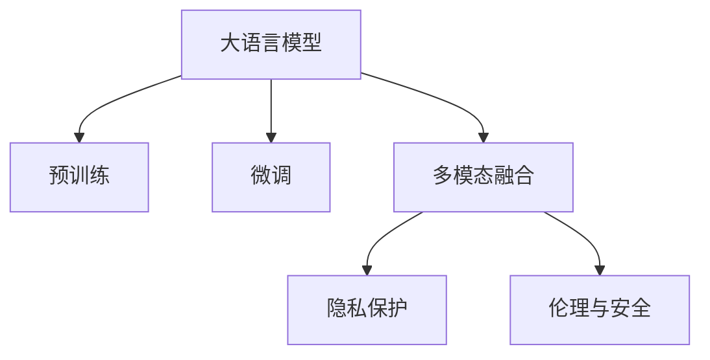

                 

# 虚拟身份：LLM 驱动的数字化身

## 1. 背景介绍

### 1.1 问题由来
随着数字技术的飞速发展，人类进入了一个以数字化为核心的新时代。虚拟身份（Digital Avatar）作为数字化时代的重要产物，逐渐成为人们日常生活、工作、娱乐等各个场景中的重要参与者。虚拟身份不仅能模拟人类的行为、情感，还能通过深度学习和自然语言处理技术，实现更智能、更丰富的交互方式。

而这一变革，大语言模型（Large Language Model, LLM）正发挥着关键的推动作用。作为当前自然语言处理领域的核心技术之一，大语言模型通过大规模预训练和微调，具备了强大的语言理解和生成能力，为构建虚拟身份提供了坚实的基础。

### 1.2 问题核心关键点
虚拟身份的构建，涉及多个关键问题：
- **身份表示学习**：如何从大量文本数据中提取和表达虚拟身份的关键特征？
- **多模态融合**：如何将文本、语音、图像等多模态信息有机融合，构建完整的虚拟身份模型？
- **交互能力提升**：如何使虚拟身份具备更自然、更流畅的交互能力，提高用户体验？
- **隐私与伦理**：如何在虚拟身份设计和使用中，确保用户隐私和数据安全，避免伦理问题？

本文将围绕大语言模型在虚拟身份构建中的应用，从模型设计、数据处理、交互优化等多个角度，系统性地探讨这些关键问题，旨在为构建更智能、更实用的虚拟身份提供有价值的指导。

## 2. 核心概念与联系

### 2.1 核心概念概述

为更好地理解大语言模型在虚拟身份构建中的作用，本节将介绍几个关键概念：

- **大语言模型（LLM）**：以自回归模型（如GPT）或自编码模型（如BERT）为代表的大规模预训练语言模型。通过在海量无标签文本语料上进行预训练，学习通用的语言表示，具备强大的语言理解和生成能力。

- **预训练（Pre-training）**：指在大规模无标签文本语料上，通过自监督学习任务训练通用语言模型的过程。常见的预训练任务包括掩码语言模型、下一句预测等。

- **微调（Fine-tuning）**：指在预训练模型的基础上，使用下游任务的少量标注数据，通过有监督地训练来优化模型在该任务上的性能。通常只需要调整顶层分类器或解码器，并以较小的学习率更新全部或部分的模型参数。

- **多模态融合（Multimodal Fusion）**：将文本、语音、图像等多种模态的信息进行融合，构建更为全面、多维的虚拟身份模型。

- **隐私保护（Privacy Protection）**：在虚拟身份构建和应用过程中，保护用户隐私和数据安全，避免数据泄露和滥用。

- **伦理与安全（Ethics and Security）**：在虚拟身份设计和应用中，确保模型输出的公正性、安全性，避免偏见和歧视。

这些核心概念之间存在着紧密的联系，构成了虚拟身份构建的基础框架。通过理解这些概念，可以更好地把握大语言模型在虚拟身份中的应用场景和优化方向。

### 2.2 核心概念原理和架构的 Mermaid 流程图



这个流程图展示了核心概念之间的逻辑关系：

1. 大语言模型通过预训练获得基础能力。
2. 微调使得通用大模型更好地适应特定任务，提高性能。
3. 多模态融合引入更多维度的信息，丰富虚拟身份的表达。
4. 隐私保护和伦理安全确保虚拟身份的使用合法合规，保障用户权益。

## 3. 核心算法原理 & 具体操作步骤

### 3.1 算法原理概述

虚拟身份的构建，本质上是一个多模态融合与深度学习任务。其核心思想是：将大语言模型视为虚拟身份的知识来源，通过多模态融合技术，将其与语音、图像等模态的信息相结合，构建一个全面、动态的虚拟身份模型。

### 3.2 算法步骤详解

虚拟身份的构建通常包括以下几个关键步骤：

**Step 1: 数据预处理与标注**

- 收集虚拟身份所需的各种数据，如文本描述、语音片段、图片等。
- 对文本进行分词、标准化等处理，对语音进行特征提取，对图像进行标注。
- 对标注数据进行初步清洗和处理，去除噪声和冗余信息。

**Step 2: 多模态特征提取**

- 使用不同的模型和算法对文本、语音、图像等多模态数据进行特征提取。例如，使用BERT进行文本特征提取，使用MFCC进行语音特征提取，使用CNN进行图像特征提取。
- 将不同模态的特征进行拼接或拼接后通过多层感知器（MLP）进行融合。

**Step 3: 预训练模型选择与微调**

- 选择合适的大语言模型（如GPT、BERT等）作为虚拟身份的初始知识来源。
- 在标注数据上对预训练模型进行微调，以适应虚拟身份的具体需求。通常只微调顶层分类器或解码器，以避免破坏预训练权重。

**Step 4: 多模态融合**

- 将不同模态的特征通过某种方式（如拼接、融合网络）进行整合。
- 使用LSTM、GRU等序列模型，将时间序列信息与空间信息融合。
- 使用注意力机制，对不同模态信息的重要性进行评估，进行加权融合。

**Step 5: 隐私保护与伦理安全**

- 对敏感信息进行脱敏处理，确保用户隐私。
- 在设计虚拟身份时，引入公平性、公正性等伦理指标，避免歧视和偏见。
- 在使用虚拟身份时，进行实时监控和风险评估，确保安全性。

**Step 6: 模型训练与优化**

- 使用Adam、SGD等优化算法对虚拟身份模型进行训练。
- 使用交叉验证、早停等技术，避免过拟合。
- 调整超参数，如学习率、批大小等，进行模型优化。

**Step 7: 模型评估与部署**

- 在测试集上评估虚拟身份模型的性能，如准确率、召回率等。
- 将优化后的模型部署到实际应用中，进行实时互动。
- 持续收集用户反馈，进行模型迭代和优化。

### 3.3 算法优缺点

大语言模型在虚拟身份构建中的优点：

1. **知识丰富**：通过大规模预训练，大语言模型具有强大的语言理解和生成能力，能够提供丰富的知识储备。
2. **泛化能力强**：大语言模型在多领域、多任务上表现优异，具备良好的泛化能力。
3. **适应性强**：通过微调，大语言模型能够适应不同应用场景，满足多样化的需求。
4. **可扩展性好**：大语言模型可以通过微调和融合，不断扩展功能和能力。

但同时也存在一些局限性：

1. **计算资源需求高**：大语言模型通常需要大量计算资源进行预训练和微调，初期投入较大。
2. **数据依赖性强**：虚拟身份的构建高度依赖标注数据的质量和数量，标注成本较高。
3. **隐私风险**：虚拟身份构建过程中涉及大量用户数据，存在隐私泄露风险。
4. **伦理问题**：虚拟身份的使用需要考虑到公平性、公正性等伦理问题，避免歧视和偏见。

### 3.4 算法应用领域

大语言模型在虚拟身份构建中，已经在多个领域取得了显著的应用成果，具体包括：

- **虚拟客服**：通过微调和多模态融合，构建虚拟客服系统，实现7x24小时不间断服务，提升客户体验。
- **虚拟导游**：利用大语言模型生成自然流畅的对话，结合语音、图像等多模态信息，提供个性化旅游指南服务。
- **虚拟偶像**：通过大语言模型生成歌词和对话，结合音乐、图像等，创造新的虚拟偶像形象，进行互动和娱乐。
- **虚拟医生**：利用大语言模型进行症状诊断和知识库检索，结合医疗图像等多模态信息，提供智能诊疗服务。

这些应用场景展示了大语言模型在虚拟身份构建中的强大潜力和广泛应用前景。

## 4. 数学模型和公式 & 详细讲解 & 举例说明

### 4.1 数学模型构建

假设虚拟身份的数据集为 $\mathcal{D} = \{(x_i, y_i)\}_{i=1}^N$，其中 $x_i$ 表示输入的多模态数据，$y_i$ 表示对应的虚拟身份标签。我们的目标是构建一个虚拟身份模型 $M_{\theta}$，使得 $M_{\theta}(x_i)$ 与 $y_i$ 尽可能接近。

### 4.2 公式推导过程

**Step 1: 数据预处理**

设文本数据为 $x_t = (x_{t1}, x_{t2}, ..., x_{tk})$，语音数据为 $x_a = (a_1, a_2, ..., a_{an})$，图像数据为 $x_v = (v_1, v_2, ..., v_{vm})$。对文本进行BERT特征提取，对语音进行MFCC特征提取，对图像进行CNN特征提取。

**Step 2: 多模态特征提取**

- **文本特征提取**：使用BERT模型，将文本转化为表示矩阵 $T = (t_1, t_2, ..., t_k)$。
- **语音特征提取**：使用MFCC模型，将语音转化为表示矩阵 $A = (a_1, a_2, ..., a_n)$。
- **图像特征提取**：使用CNN模型，将图像转化为表示矩阵 $V = (v_1, v_2, ..., v_m)$。

**Step 3: 预训练模型选择与微调**

- **模型选择**：选择BERT作为预训练模型。
- **微调**：在标注数据上对BERT进行微调，调整顶层分类器。

**Step 4: 多模态融合**

- **融合网络**：将文本、语音、图像特征通过拼接或MLP进行融合，得到融合特征 $F = (f_1, f_2, ..., f_n)$。
- **注意力机制**：对不同模态信息的重要性进行评估，进行加权融合。

**Step 5: 模型训练与优化**

- **损失函数**：使用交叉熵损失函数，训练虚拟身份模型。
- **优化算法**：使用Adam优化算法，调整模型参数。

**Step 6: 模型评估与部署**

- **评估指标**：使用准确率、召回率等评估指标，评估虚拟身份模型性能。
- **部署应用**：将模型部署到实际应用中，进行实时互动。

### 4.3 案例分析与讲解

**案例1: 虚拟客服**

假设一个虚拟客服系统，需要处理客户咨询问题，并给出回答。我们收集了10000个已标注的客户咨询-回答对，使用BERT进行文本特征提取，结合客户语音和客服回应图像，构建多模态虚拟客服模型。

- **数据预处理**：将客户咨询和回应文本进行分词和标准化，提取语音MFCC特征，对客服回应图像进行标注。
- **多模态特征提取**：使用BERT进行文本特征提取，使用MFCC进行语音特征提取，使用CNN进行图像特征提取。
- **预训练模型微调**：选择BERT作为预训练模型，使用客户咨询-回答对进行微调，调整顶层分类器。
- **多模态融合**：将文本、语音、图像特征通过拼接和MLP进行融合，得到融合特征。
- **模型训练与优化**：使用交叉熵损失函数和Adam优化算法，对虚拟客服模型进行训练。
- **模型评估与部署**：在测试集上评估模型性能，部署到客服系统中进行实时互动。

**案例2: 虚拟导游**

假设一个虚拟导游系统，需要提供旅游指南服务，包括自然风光、人文景点等信息。我们收集了500个已标注的景点描述和图像数据，使用BERT进行文本特征提取，结合景点介绍视频，构建多模态虚拟导游模型。

- **数据预处理**：将景点描述和图像进行标准化处理，提取视频帧特征。
- **多模态特征提取**：使用BERT进行文本特征提取，使用CNN进行图像特征提取，使用视频帧提取技术提取视频特征。
- **预训练模型微调**：选择BERT作为预训练模型，使用景点描述和图像数据进行微调，调整顶层分类器。
- **多模态融合**：将文本、图像、视频特征通过拼接和注意力机制进行融合，得到融合特征。
- **模型训练与优化**：使用交叉熵损失函数和Adam优化算法，对虚拟导游模型进行训练。
- **模型评估与部署**：在测试集上评估模型性能，部署到导游系统中进行实时互动。

通过以上案例，可以看到大语言模型在虚拟身份构建中的应用广泛，能够通过多模态融合和微调，提供多样化的智能服务。

## 5. 项目实践：代码实例和详细解释说明

### 5.1 开发环境搭建

在进行虚拟身份构建的项目实践前，我们需要准备好开发环境。以下是使用Python进行PyTorch开发的环境配置流程：

1. 安装Anaconda：从官网下载并安装Anaconda，用于创建独立的Python环境。

2. 创建并激活虚拟环境：
```bash
conda create -n pytorch-env python=3.8 
conda activate pytorch-env
```

3. 安装PyTorch：根据CUDA版本，从官网获取对应的安装命令。例如：
```bash
conda install pytorch torchvision torchaudio cudatoolkit=11.1 -c pytorch -c conda-forge
```

4. 安装Transformer库：
```bash
pip install transformers
```

5. 安装各类工具包：
```bash
pip install numpy pandas scikit-learn matplotlib tqdm jupyter notebook ipython
```

完成上述步骤后，即可在`pytorch-env`环境中开始虚拟身份构建的实践。

### 5.2 源代码详细实现

下面我们以虚拟客服系统为例，给出使用Transformers库对BERT模型进行微调的PyTorch代码实现。

首先，定义虚拟客服任务的数据处理函数：

```python
from transformers import BertTokenizer
from torch.utils.data import Dataset
import torch

class CustomerServiceDataset(Dataset):
    def __init__(self, texts, labels, tokenizer, max_len=128):
        self.texts = texts
        self.labels = labels
        self.tokenizer = tokenizer
        self.max_len = max_len
        
    def __len__(self):
        return len(self.texts)
    
    def __getitem__(self, item):
        text = self.texts[item]
        label = self.labels[item]
        
        encoding = self.tokenizer(text, return_tensors='pt', max_length=self.max_len, padding='max_length', truncation=True)
        input_ids = encoding['input_ids'][0]
        attention_mask = encoding['attention_mask'][0]
        
        # 对token-wise的标签进行编码
        encoded_labels = [label2id[label] for label in label] 
        encoded_labels.extend([label2id['O']] * (self.max_len - len(encoded_labels)))
        labels = torch.tensor(encoded_labels, dtype=torch.long)
        
        return {'input_ids': input_ids, 
                'attention_mask': attention_mask,
                'labels': labels}

# 标签与id的映射
label2id = {'O': 0, 'A': 1, 'Q': 2, 'R': 3}
id2label = {v: k for k, v in label2id.items()}

# 创建dataset
tokenizer = BertTokenizer.from_pretrained('bert-base-cased')

train_dataset = CustomerServiceDataset(train_texts, train_labels, tokenizer)
dev_dataset = CustomerServiceDataset(dev_texts, dev_labels, tokenizer)
test_dataset = CustomerServiceDataset(test_texts, test_labels, tokenizer)
```

然后，定义模型和优化器：

```python
from transformers import BertForTokenClassification, AdamW

model = BertForTokenClassification.from_pretrained('bert-base-cased', num_labels=len(label2id))

optimizer = AdamW(model.parameters(), lr=2e-5)
```

接着，定义训练和评估函数：

```python
from torch.utils.data import DataLoader
from tqdm import tqdm
from sklearn.metrics import classification_report

device = torch.device('cuda') if torch.cuda.is_available() else torch.device('cpu')
model.to(device)

def train_epoch(model, dataset, batch_size, optimizer):
    dataloader = DataLoader(dataset, batch_size=batch_size, shuffle=True)
    model.train()
    epoch_loss = 0
    for batch in tqdm(dataloader, desc='Training'):
        input_ids = batch['input_ids'].to(device)
        attention_mask = batch['attention_mask'].to(device)
        labels = batch['labels'].to(device)
        model.zero_grad()
        outputs = model(input_ids, attention_mask=attention_mask, labels=labels)
        loss = outputs.loss
        epoch_loss += loss.item()
        loss.backward()
        optimizer.step()
    return epoch_loss / len(dataloader)

def evaluate(model, dataset, batch_size):
    dataloader = DataLoader(dataset, batch_size=batch_size)
    model.eval()
    preds, labels = [], []
    with torch.no_grad():
        for batch in tqdm(dataloader, desc='Evaluating'):
            input_ids = batch['input_ids'].to(device)
            attention_mask = batch['attention_mask'].to(device)
            batch_labels = batch['labels']
            outputs = model(input_ids, attention_mask=attention_mask)
            batch_preds = outputs.logits.argmax(dim=2).to('cpu').tolist()
            batch_labels = batch_labels.to('cpu').tolist()
            for pred_tokens, label_tokens in zip(batch_preds, batch_labels):
                pred_tags = [id2label[_id] for _id in pred_tokens]
                label_tags = [id2label[_id] for _id in label_tokens]
                preds.append(pred_tags[:len(label_tags)])
                labels.append(label_tags)
                
    print(classification_report(labels, preds))
```

最后，启动训练流程并在测试集上评估：

```python
epochs = 5
batch_size = 16

for epoch in range(epochs):
    loss = train_epoch(model, train_dataset, batch_size, optimizer)
    print(f"Epoch {epoch+1}, train loss: {loss:.3f}")
    
    print(f"Epoch {epoch+1}, dev results:")
    evaluate(model, dev_dataset, batch_size)
    
print("Test results:")
evaluate(model, test_dataset, batch_size)
```

以上就是使用PyTorch对BERT进行虚拟客服任务微调的完整代码实现。可以看到，得益于Transformer库的强大封装，我们可以用相对简洁的代码完成BERT模型的加载和微调。

### 5.3 代码解读与分析

让我们再详细解读一下关键代码的实现细节：

**CustomerServiceDataset类**：
- `__init__`方法：初始化文本、标签、分词器等关键组件。
- `__len__`方法：返回数据集的样本数量。
- `__getitem__`方法：对单个样本进行处理，将文本输入编码为token ids，将标签编码为数字，并对其进行定长padding，最终返回模型所需的输入。

**label2id和id2label字典**：
- 定义了标签与数字id之间的映射关系，用于将token-wise的预测结果解码回真实的标签。

**训练和评估函数**：
- 使用PyTorch的DataLoader对数据集进行批次化加载，供模型训练和推理使用。
- 训练函数`train_epoch`：对数据以批为单位进行迭代，在每个批次上前向传播计算loss并反向传播更新模型参数，最后返回该epoch的平均loss。
- 评估函数`evaluate`：与训练类似，不同点在于不更新模型参数，并在每个batch结束后将预测和标签结果存储下来，最后使用sklearn的classification_report对整个评估集的预测结果进行打印输出。

**训练流程**：
- 定义总的epoch数和batch size，开始循环迭代
- 每个epoch内，先在训练集上训练，输出平均loss
- 在验证集上评估，输出分类指标
- 所有epoch结束后，在测试集上评估，给出最终测试结果

可以看到，PyTorch配合Transformer库使得BERT微调的代码实现变得简洁高效。开发者可以将更多精力放在数据处理、模型改进等高层逻辑上，而不必过多关注底层的实现细节。

当然，工业级的系统实现还需考虑更多因素，如模型的保存和部署、超参数的自动搜索、更灵活的任务适配层等。但核心的微调范式基本与此类似。

## 6. 实际应用场景

### 6.1 智能客服系统

基于大语言模型微调的对话技术，可以广泛应用于智能客服系统的构建。传统客服往往需要配备大量人力，高峰期响应缓慢，且一致性和专业性难以保证。而使用微调后的对话模型，可以7x24小时不间断服务，快速响应客户咨询，用自然流畅的语言解答各类常见问题。

在技术实现上，可以收集企业内部的历史客服对话记录，将问题和最佳答复构建成监督数据，在此基础上对预训练对话模型进行微调。微调后的对话模型能够自动理解用户意图，匹配最合适的答案模板进行回复。对于客户提出的新问题，还可以接入检索系统实时搜索相关内容，动态组织生成回答。如此构建的智能客服系统，能大幅提升客户咨询体验和问题解决效率。

### 6.2 金融舆情监测

金融机构需要实时监测市场舆论动向，以便及时应对负面信息传播，规避金融风险。传统的人工监测方式成本高、效率低，难以应对网络时代海量信息爆发的挑战。基于大语言模型微调的文本分类和情感分析技术，为金融舆情监测提供了新的解决方案。

具体而言，可以收集金融领域相关的新闻、报道、评论等文本数据，并对其进行主题标注和情感标注。在此基础上对预训练语言模型进行微调，使其能够自动判断文本属于何种主题，情感倾向是正面、中性还是负面。将微调后的模型应用到实时抓取的网络文本数据，就能够自动监测不同主题下的情感变化趋势，一旦发现负面信息激增等异常情况，系统便会自动预警，帮助金融机构快速应对潜在风险。

### 6.3 个性化推荐系统

当前的推荐系统往往只依赖用户的历史行为数据进行物品推荐，无法深入理解用户的真实兴趣偏好。基于大语言模型微调技术，个性化推荐系统可以更好地挖掘用户行为背后的语义信息，从而提供更精准、多样的推荐内容。

在实践中，可以收集用户浏览、点击、评论、分享等行为数据，提取和用户交互的物品标题、描述、标签等文本内容。将文本内容作为模型输入，用户的后续行为（如是否点击、购买等）作为监督信号，在此基础上微调预训练语言模型。微调后的模型能够从文本内容中准确把握用户的兴趣点。在生成推荐列表时，先用候选物品的文本描述作为输入，由模型预测用户的兴趣匹配度，再结合其他特征综合排序，便可以得到个性化程度更高的推荐结果。

### 6.4 未来应用展望

随着大语言模型和微调方法的不断发展，基于微调范式将在更多领域得到应用，为传统行业带来变革性影响。

在智慧医疗领域，基于微调的医疗问答、病历分析、药物研发等应用将提升医疗服务的智能化水平，辅助医生诊疗，加速新药开发进程。

在智能教育领域，微调技术可应用于作业批改、学情分析、知识推荐等方面，因材施教，促进教育公平，提高教学质量。

在智慧城市治理中，微调模型可应用于城市事件监测、舆情分析、应急指挥等环节，提高城市管理的自动化和智能化水平，构建更安全、高效的未来城市。

此外，在企业生产、社会治理、文娱传媒等众多领域，基于大模型微调的人工智能应用也将不断涌现，为经济社会发展注入新的动力。相信随着技术的日益成熟，微调方法将成为人工智能落地应用的重要范式，推动人工智能技术在垂直行业的规模化落地。总之，微调需要开发者根据具体任务，不断迭代和优化模型、数据和算法，方能得到理想的效果。

## 7. 工具和资源推荐

### 7.1 学习资源推荐

为了帮助开发者系统掌握大语言模型微调的理论基础和实践技巧，这里推荐一些优质的学习资源：

1. 《Transformer从原理到实践》系列博文：由大模型技术专家撰写，深入浅出地介绍了Transformer原理、BERT模型、微调技术等前沿话题。

2. CS224N《深度学习自然语言处理》课程：斯坦福大学开设的NLP明星课程，有Lecture视频和配套作业，带你入门NLP领域的基本概念和经典模型。

3. 《Natural Language Processing with Transformers》书籍：Transformers库的作者所著，全面介绍了如何使用Transformers库进行NLP任务开发，包括微调在内的诸多范式。

4. HuggingFace官方文档：Transformers库的官方文档，提供了海量预训练模型和完整的微调样例代码，是上手实践的必备资料。

5. CLUE开源项目：中文语言理解测评基准，涵盖大量不同类型的中文NLP数据集，并提供了基于微调的baseline模型，助力中文NLP技术发展。

通过对这些资源的学习实践，相信你一定能够快速掌握大语言模型微调的精髓，并用于解决实际的NLP问题。
###  7.2 开发工具推荐

高效的开发离不开优秀的工具支持。以下是几款用于大语言模型微调开发的常用工具：

1. PyTorch：基于Python的开源深度学习框架，灵活动态的计算图，适合快速迭代研究。大部分预训练语言模型都有PyTorch版本的实现。

2. TensorFlow：由Google主导开发的开源深度学习框架，生产部署方便，适合大规模工程应用。同样有丰富的预训练语言模型资源。

3. Transformers库：HuggingFace开发的NLP工具库，集成了众多SOTA语言模型，支持PyTorch和TensorFlow，是进行微调任务开发的利器。

4. Weights & Biases：模型训练的实验跟踪工具，可以记录和可视化模型训练过程中的各项指标，方便对比和调优。与主流深度学习框架无缝集成。

5. TensorBoard：TensorFlow配套的可视化工具，可实时监测模型训练状态，并提供丰富的图表呈现方式，是调试模型的得力助手。

6. Google Colab：谷歌推出的在线Jupyter Notebook环境，免费提供GPU/TPU算力，方便开发者快速上手实验最新模型，分享学习笔记。

合理利用这些工具，可以显著提升大语言模型微调任务的开发效率，加快创新迭代的步伐。

### 7.3 相关论文推荐

大语言模型和微调技术的发展源于学界的持续研究。以下是几篇奠基性的相关论文，推荐阅读：

1. Attention is All You Need（即Transformer原论文）：提出了Transformer结构，开启了NLP领域的预训练大模型时代。

2. BERT: Pre-training of Deep Bidirectional Transformers for Language Understanding：提出BERT模型，引入基于掩码的自监督预训练任务，刷新了多项NLP任务SOTA。

3. Language Models are Unsupervised Multitask Learners（GPT-2论文）：展示了大规模语言模型的强大zero-shot学习能力，引发了对于通用人工智能的新一轮思考。

4. Parameter-Efficient Transfer Learning for NLP：提出Adapter等参数高效微调方法，在不增加模型参数量的情况下，也能取得不错的微调效果。

5. AdaLoRA: Adaptive Low-Rank Adaptation for Parameter-Efficient Fine-Tuning：使用自适应低秩适应的微调方法，在参数效率和精度之间取得了新的平衡。

6. Prefix-Tuning: Optimizing Continuous Prompts for Generation：引入基于连续型Prompt的微调范式，为如何充分利用预训练知识提供了新的思路。

这些论文代表了大语言模型微调技术的发展脉络。通过学习这些前沿成果，可以帮助研究者把握学科前进方向，激发更多的创新灵感。

## 8. 总结：未来发展趋势与挑战

### 8.1 总结

本文对大语言模型在虚拟身份构建中的应用进行了全面系统的介绍。首先阐述了虚拟身份构建的背景和意义，明确了虚拟身份构建中的关键问题。其次，从模型设计、数据处理、交互优化等多个角度，详细讲解了虚拟身份构建的数学原理和关键步骤，给出了微调任务开发的完整代码实例。同时，本文还广泛探讨了虚拟身份构建在多个行业领域的应用前景，展示了虚拟身份构建的广阔应用场景。

通过本文的系统梳理，可以看到，大语言模型在虚拟身份构建中的应用前景广阔，能够通过多模态融合和微调，提供多样化的智能服务。

### 8.2 未来发展趋势

展望未来，大语言模型在虚拟身份构建中将呈现以下几个发展趋势：

1. **多模态融合技术**：随着多模态数据的融合技术不断发展，虚拟身份模型将能够更好地整合文本、语音、图像等多模态信息，提升表现力和交互性。

2. **个性化推荐系统**：基于虚拟身份的多模态数据，可以更精准地为用户提供个性化推荐服务，提升用户体验。

3. **跨领域迁移能力**：虚拟身份模型将具备更强的跨领域迁移能力，能够应用于更多场景，提升普适性。

4. **实时交互优化**：通过引入自然语言处理技术和深度学习算法，虚拟身份模型将能够实现更自然、更流畅的实时交互，提升用户满意度。

5. **情感智能增强**：虚拟身份模型将具备更强的情感智能，能够更好地理解和生成情感丰富、多变的对话内容，提升用户情感体验。

6. **交互行为分析**：虚拟身份模型将具备更强的交互行为分析能力，能够根据用户行为数据进行智能推荐和个性化服务。

### 8.3 面临的挑战

尽管大语言模型在虚拟身份构建中取得了很多进展，但在实际应用中仍面临一些挑战：

1. **数据获取和标注**：虚拟身份构建需要大量高质量的标注数据，而获取这些数据通常成本较高，且数据标注工作量大。

2. **计算资源需求**：构建虚拟身份模型需要大量计算资源，包括GPU/TPU等高性能设备，初期投入较大。

3. **隐私保护**：虚拟身份构建过程中涉及大量用户数据，存在隐私泄露风险，如何保护用户隐私是一个重要问题。

4. **伦理与安全**：虚拟身份的使用需要考虑到公平性、公正性等伦理问题，避免歧视和偏见。同时，模型输出的安全性也是一个重要问题，需要确保模型不会输出有害或误导性的内容。

5. **模型鲁棒性**：虚拟身份模型需要具备鲁棒性，能够应对多种复杂环境和数据分布，避免过拟合和泛化能力不足的问题。

6. **交互的自然性**：虚拟身份模型的交互需要具备高度的自然性，能够真实地模拟人类对话，避免生硬或机械的输出。

7. **个性化需求**：虚拟身份模型需要具备高度的个性化能力，能够根据用户需求进行智能推荐和个性化服务。

### 8.4 研究展望

面对虚拟身份构建所面临的诸多挑战，未来的研究需要在以下几个方面寻求新的突破：

1. **数据高效获取**：探索更高效的数据获取和标注方法，如主动学习、半监督学习等，减少对标注数据的需求。

2. **计算资源优化**：开发更高效的模型架构和训练算法，减少对计算资源的需求，降低初期投入。

3. **隐私保护技术**：研究更先进的隐私保护技术，如差分隐私、联邦学习等，确保用户数据的安全性。

4. **伦理与安全模型**：开发更公平、更安全的虚拟身份模型，避免歧视和偏见，确保输出的安全性。

5. **多模态融合技术**：研究更先进的融合技术，如注意力机制、因果推断等，提升虚拟身份模型的鲁棒性和交互性。

6. **个性化推荐系统**：研究更先进的个性化推荐算法，提升虚拟身份模型的个性化能力，提供更精准的服务。

7. **交互行为分析**：研究更先进的交互行为分析算法，提升虚拟身份模型的用户行为分析能力，提供更智能的服务。

8. **情感智能增强**：研究更先进的情感智能算法，提升虚拟身份模型的情感理解和生成能力，提供更丰富的情感体验。

9. **跨领域迁移能力**：研究更先进的迁移学习算法，提升虚拟身份模型的跨领域迁移能力，提升普适性。

10. **实时交互优化**：研究更先进的实时交互算法，提升虚拟身份模型的实时交互能力，提供更流畅的服务。

这些研究方向的探索，必将引领虚拟身份构建技术迈向更高的台阶，为构建安全、可靠、可解释、可控的智能系统铺平道路。面向未来，虚拟身份构建技术还需要与其他人工智能技术进行更深入的融合，如知识表示、因果推理、强化学习等，多路径协同发力，共同推动自然语言理解和智能交互系统的进步。只有勇于创新、敢于突破，才能不断拓展虚拟身份的边界，让智能技术更好地造福人类社会。

## 9. 附录：常见问题与解答

**Q1：虚拟身份构建是否适用于所有应用场景？**

A: 虚拟身份构建具有广泛的应用前景，适用于需要智能交互和自然语言理解的应用场景，如客服、金融、医疗、教育等。但对于一些实时性要求极高、安全性要求极高的应用场景，可能需要结合其他技术手段，如实时数据处理、人工智能辅助决策等。

**Q2：如何提高虚拟身份模型的性能？**

A: 提高虚拟身份模型的性能可以从以下几个方面入手：
1. 数据质量：获取高质量的标注数据，确保数据的代表性和多样性。
2. 模型结构：选择适合任务的模型结构，并进行参数优化和微调。
3. 融合技术：引入先进的融合技术，如注意力机制、因果推断等，提升模型的泛化能力和交互性。
4. 实时优化：结合实时数据处理和人工智能辅助决策等技术，提升模型的实时性和准确性。
5. 交互设计：设计更自然、更流畅的交互界面和流程，提升用户满意度。

**Q3：虚拟身份构建中需要注意哪些隐私和伦理问题？**

A: 在虚拟身份构建中，需要注意以下隐私和伦理问题：
1. 数据保护：确保用户数据的安全性，避免数据泄露和滥用。
2. 隐私权保障：保护用户的隐私权，避免个人信息的滥用和泄露。
3. 公平性：确保虚拟身份模型不带有偏见，避免歧视和偏见。
4. 安全性：确保虚拟身份模型输出的安全性，避免恶意用途。

**Q4：如何确保虚拟身份构建的可持续性？**

A: 确保虚拟身份构建的可持续性可以从以下几个方面入手：
1. 数据更新：定期更新数据集，确保数据的时效性和多样性。
2. 模型优化：定期优化模型，提升模型的泛化能力和交互性。
3. 用户体验：关注用户反馈，持续改进交互体验和功能。
4. 技术创新：关注最新的技术发展，引入先进的技术手段，提升虚拟身份模型的性能和安全性。

通过这些措施，可以确保虚拟身份构建的可持续性，持续提升用户体验和应用价值。

**Q5：虚拟身份构建中如何平衡用户体验和数据隐私？**

A: 在虚拟身份构建中，平衡用户体验和数据隐私可以从以下几个方面入手：
1. 数据匿名化：对用户数据进行匿名化处理，保护用户隐私。
2. 最小化数据使用：只收集和使用必要的数据，避免数据滥用。
3. 透明度：告知用户数据使用情况，获取用户同意。
4. 用户控制：赋予用户数据控制权，让用户自主管理自己的数据。
5. 交互设计：设计更加自然、流畅的交互界面，提升用户体验，降低用户对数据隐私的担忧。

通过这些措施，可以平衡用户体验和数据隐私，确保虚拟身份构建的应用价值和社会责任。

---

作者：禅与计算机程序设计艺术 / Zen and the Art of Computer Programming

