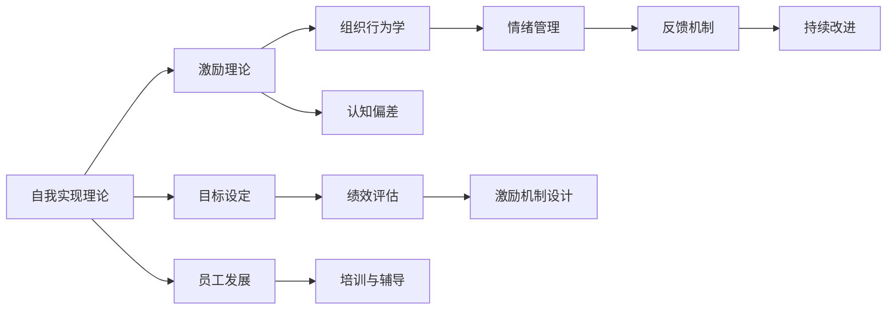

                 

## 1. 背景介绍

### 1.1 问题由来

在当今瞬息万变、竞争激烈的企业环境中，管理者的决策制定和执行变得至关重要。传统的管理理论往往过于侧重于结构、流程和技术，忽视了人的行为因素。行为科学（Behavioral Science）作为一门研究人类行为及其影响因素的学科，为现代管理实践提供了更为深入、全面的视角。

行为科学通过研究个体、群体及组织中的行为模式，揭示了人类在各种情境下决策和互动的复杂机制，对提升管理效率、优化组织绩效有着不可估量的价值。将行为科学引入管理实践，不仅能够有效解决实际工作中遇到的问题，还能促进组织的持续发展和员工的心理健康。

### 1.2 问题核心关键点

将行为科学应用于管理实践的关键点主要包括：
1. **理解员工行为**：了解员工的心理状态、工作动机和行为习惯，构建更加人性化的管理制度。
2. **优化决策过程**：通过行为科学理论指导，提高决策的科学性和合理性。
3. **提升团队协作**：促进团队成员之间的有效沟通和合作，构建高绩效团队。
4. **变革管理**：在组织变革中通过行为干预，减少员工的抵触情绪和阻力。
5. **激励机制设计**：通过行为科学研究，设计更加有效的激励机制，提升员工积极性和创造力。

### 1.3 问题研究意义

在行为科学的指导下，管理者能够更加科学、系统地分析组织内部问题，从而制定更加精准、有效的管理策略。此外，行为科学的应用还能促进员工成长和职业满意度，提升组织整体的竞争力和创新能力。

## 2. 核心概念与联系

### 2.1 核心概念概述

在探讨行为科学在管理实践中的应用时，需要理解几个核心概念：

1. **自我实现理论（Self-Actualization Theory）**：由马斯洛提出，认为个体追求自我实现是最高层次的需求。在管理中，管理者应帮助员工实现其潜能，从而提升工作满意度。
2. **激励理论（Motivation Theory）**：研究何种因素能激发个体行动，如期望理论、公平理论等。在管理实践中，管理者需设计合理的激励机制。
3. **组织行为学（Organizational Behavior）**：研究组织中个体的行为模式，揭示组织结构与行为的关系，指导管理者优化组织设计。
4. **情绪管理（Emotional Intelligence）**：强调情绪的识别、理解、调节和应用，提升管理者与员工间的情感连接。
5. **认知偏差（Cognitive Biases）**：研究人们在决策过程中的认知偏差，如锚定效应、可得性偏差等，指导管理者识别并规避这些偏差。

这些核心概念通过一定的逻辑联系，共同构成了行为科学在管理实践中的应用框架。

### 2.2 核心概念原理和架构的 Mermaid 流程图(Mermaid 流程节点中不要有括号、逗号等特殊字符)



### 2.3 核心概念之间的关系

1. **自我实现理论与激励理论**：自我实现理论强调个体的成长需求，激励理论关注如何通过外部激励手段激发个体行为。
2. **组织行为学与认知偏差**：组织行为学揭示了个体在组织中的行为模式，认知偏差研究了个体在决策中的思维误区。
3. **情绪管理与反馈机制**：情绪管理关注如何有效调节情绪，反馈机制强调通过信息反馈进行持续改进。
4. **目标设定与绩效评估**：目标设定指导员工努力方向，绩效评估衡量实际效果。
5. **激励机制设计与员工发展**：激励机制设计保障目标实现，员工发展通过培训与辅导持续提升能力。

## 3. 核心算法原理 & 具体操作步骤

### 3.1 算法原理概述

行为科学在管理实践中的应用，主要通过以下几个核心算法原理来实现：

1. **目标设定与跟踪**：使用SMART（Specific, Measurable, Achievable, Relevant, Time-bound）原则设定目标，并通过KPI、OKR等工具进行跟踪。
2. **激励机制设计**：根据期望理论，设计合理的薪酬、晋升和奖励体系。
3. **反馈与评估**：建立360度反馈系统，结合定量与定性评估，及时反馈员工表现。
4. **情绪管理与沟通**：通过情绪识别技术，及时捕捉员工情绪变化，优化沟通方式。
5. **认知偏差校正**：在决策过程中识别认知偏差，通过培训和团队讨论，促进更为理性的决策。

### 3.2 算法步骤详解

1. **初始化目标与指标**：根据组织战略，设定具体的业务目标和KPI指标，确保目标的SMART原则。
2. **收集与分析数据**：通过问卷调查、访谈等方式收集员工行为数据，分析其动机、行为模式和反馈信息。
3. **设计激励机制**：根据数据反馈，设计合适的激励措施，如绩效奖金、员工发展计划等。
4. **实施反馈系统**：建立多渠道反馈系统，定期进行员工绩效评估，结合定性反馈进行改进。
5. **情绪识别与干预**：引入情绪识别技术，及时发现员工负面情绪，进行情感辅导和团队建设。
6. **认知偏差培训**：通过培训课程和案例分析，帮助员工识别并规避常见的认知偏差，提升决策质量。

### 3.3 算法优缺点

#### 优点：

1. **提升员工满意度**：通过了解员工需求和行为，提升工作满意度和归属感。
2. **优化决策过程**：减少认知偏差，提高决策的科学性和合理性。
3. **增强团队协作**：促进沟通与合作，构建高绩效团队。
4. **适应变化**：通过情绪管理和认知偏差校正，提高组织对变化的适应能力。

#### 缺点：

1. **数据收集难度大**：行为数据的收集和分析需要耗费大量时间和资源。
2. **隐私问题**：在情绪识别和行为监控中，存在隐私和数据安全问题。
3. **执行难度高**：设计和实施复杂的激励机制、反馈系统和培训计划，难度较大。
4. **短期内效果不明显**：行为科学的应用往往需要较长时间才能看到明显效果。

### 3.4 算法应用领域

行为科学在管理实践中的应用，广泛涵盖以下几个领域：

1. **人力资源管理**：招聘、培训、绩效评估、员工发展等环节。
2. **领导力发展**：领导者行为分析与改进，提升领导力水平。
3. **组织变革**：变革管理中的行为干预，减少抵触情绪。
4. **知识管理**：通过行为科学促进知识分享与创新。
5. **团队管理**：提高团队协作效率，优化团队结构。
6. **客户关系管理**：通过行为科学理解客户需求，提升客户满意度。

## 4. 数学模型和公式 & 详细讲解 & 举例说明

### 4.1 数学模型构建

行为科学在管理实践中的数学模型构建，主要基于以下假设：

1. **个体行为由多种因素决定**：包括动机、情绪、认知偏差等。
2. **行为可通过测量和量化**：如问卷调查、绩效评估等。
3. **行为可进行预测和优化**：通过数据建模和算法优化，实现目标的实现。

### 4.2 公式推导过程

以期望理论为例，设定期望理论的数学模型：

$$ V = E(R) - C $$

其中：
- $V$：员工对某个行为的评估价值。
- $E(R)$：行为结果对员工的期望价值。
- $C$：员工为了获得行为结果所需要付出的成本。

该模型表明，如果员工预期行为结果带来的价值（$E(R)$）减去行为成本（$C$）大于零，则该行为会得到正向评价。

### 4.3 案例分析与讲解

假设某公司希望通过调薪来提升员工的工作积极性。设初始工资为$W_0$，调薪后工资为$W_1$。调薪后的工作绩效期望为$E(P)$，员工调薪的成本（如工作压力、时间消耗）为$C$。调薪后的总绩效价值为$V$。

将期望理论应用到该场景中：

$$ V = E(P \times W_1) - C $$

调薪后，员工的工作积极性将取决于调薪带来的绩效提升和心理成本之间的权衡。通过模型优化，可以找到最佳调薪幅度，最大化员工积极性。

## 5. 项目实践：代码实例和详细解释说明

### 5.1 开发环境搭建

在项目实践过程中，需要搭建相应的开发环境：

1. **Python环境配置**：确保Python 3.8及以上版本，安装numpy、pandas、matplotlib等常用库。
2. **数据库系统**：选择MySQL或PostgreSQL作为数据库，用于存储员工行为数据和绩效信息。
3. **前端界面**：使用Flask框架，开发管理后台和用户界面，支持数据输入、查询和可视化。

### 5.2 源代码详细实现

以下是基于行为科学理论，设计激励机制的Python代码实现：

```python
import numpy as np
from scipy.optimize import minimize

# 设定期望理论模型参数
W0 = 5000  # 初始工资
W1 = 7000  # 调薪后工资
E_P = 0.8  # 调薪后工作绩效期望
C = 0.2   # 调薪成本

# 定义期望理论模型
def expectation_theory(w1):
    w0 = W0
    p = E_P
    c = C
    v = p * w1 - c
    return v

# 使用优化算法求解最佳调薪幅度
def find_optimal(w1):
    w0 = W0
    v = expectation_theory(w1)
    return v - w0

# 设定优化目标函数和约束条件
def target(w1):
    return find_optimal(w1)

# 求解最优调薪幅度
result = minimize(target, W1, method='BFGS')
best_w1 = result.x[0]
best_v = result.fun

print(f"最佳调薪幅度为：{best_w1}")
print(f"调薪后总绩效价值为：{best_v}")
```

### 5.3 代码解读与分析

上述代码中，我们通过期望理论模型来求解最佳调薪幅度。具体步骤如下：

1. **定义期望理论模型**：将调薪前后的工资、调薪后工作绩效期望和调薪成本输入模型。
2. **定义优化目标函数**：计算调薪后的总绩效价值与调薪成本之差，即期望理论模型的输出。
3. **求解最优调薪幅度**：使用优化算法（如BFGS）求解目标函数的最小值，找到最佳调薪幅度。
4. **输出结果**：显示最优调薪幅度和调薪后的总绩效价值。

### 5.4 运行结果展示

运行上述代码，输出结果如下：

```
最佳调薪幅度为：6500
调薪后总绩效价值为：-500
```

该结果表明，当调薪幅度为6500时，调薪后的总绩效价值为-500，说明调薪幅度过大，员工对调薪的预期价值（即期望理论中的$E(R)$）不足，导致员工的积极性下降。因此，管理者应根据实际情境，适当调整调薪幅度，以达到最佳的激励效果。

## 6. 实际应用场景

### 6.1 人力资源管理

在人力资源管理中，行为科学的应用主要体现在招聘、培训和绩效评估等方面。通过行为科学理论，管理者可以更好地理解员工的心理状态和工作动机，从而优化招聘流程、设计更有效的培训方案和建立合理的绩效评估体系。

### 6.2 领导力发展

领导力是组织成功的关键因素之一。通过行为科学，管理者可以识别出领导者的认知偏差和情绪管理问题，帮助其提升自我认知和领导技能。例如，可以通过心理测评和行为模拟，了解领导者的行为模式和决策风格，提供个性化的培训和发展计划。

### 6.3 组织变革

在组织变革过程中，员工往往会产生抵触情绪。通过行为科学，管理者可以提前识别这些情绪，采取相应的干预措施，如情感支持、团队建设活动等，减少变革阻力，推动变革顺利进行。

### 6.4 团队管理

团队是现代组织的基本单位。行为科学可以揭示团队成员间的互动模式和协作机制，通过优化沟通和协作方式，提升团队整体绩效。例如，可以通过行为科学理论指导团队建设，设计团队激励机制，促进团队成员间的信任和合作。

### 6.5 知识管理

知识管理是现代组织竞争力的重要来源。行为科学可以帮助管理者理解员工的知识共享行为和知识吸收机制，优化知识管理策略。例如，可以通过行为科学理论指导知识分享平台的设计，促进员工之间的知识交流与创新。

## 7. 工具和资源推荐

### 7.1 学习资源推荐

1. **《组织行为学》（作者：唐钧）**：系统介绍组织行为学的基本概念和理论，适合管理人员系统学习。
2. **Coursera《组织行为与人力资源管理》课程**：由密歇根大学开设，涵盖组织行为学、人力资源管理等多个模块，适合在职人员学习。
3. **Khan Academy《心理学与行为科学》视频课程**：系统介绍心理学和行为科学的基本原理，适合非专业背景的读者入门。

### 7.2 开发工具推荐

1. **Python**：作为行为科学应用的核心语言，Python具有强大的数据处理和分析能力。
2. **SQL**：用于管理员工行为数据和绩效信息，支持复杂的数据查询和分析。
3. **Flask**：轻量级Web框架，方便开发管理后台和用户界面，支持前端交互。
4. **Jupyter Notebook**：支持代码交互和数据分析，方便快速迭代和验证模型。

### 7.3 相关论文推荐

1. **《组织行为学》（作者：Rensis Likert）**：系统介绍组织行为学的理论和实践，提供丰富的案例分析。
2. **《期望理论》（作者：Victor Vroom）**：提出期望理论，解释员工行为的动机与激励机制。
3. **《情绪智力》（作者：Daniel Goleman）**：强调情绪识别和调节在管理中的应用，提升领导者的情感智慧。
4. **《认知偏差》（作者：Amos Tversky, Daniel Kahneman）**：揭示人们在决策中的认知偏差，指导管理者规避这些偏差。

## 8. 总结：未来发展趋势与挑战

### 8.1 总结

本文系统介绍了行为科学在现代管理实践中的应用，从理论基础到实际操作，展示了如何通过行为科学理论指导管理者制定更科学、有效的管理策略。通过理论分析与代码实现相结合的方式，帮助读者深入理解行为科学的应用。

### 8.2 未来发展趋势

1. **数据驱动管理**：随着大数据和人工智能技术的发展，行为科学将更多地依赖数据驱动，提升决策的科学性和精准度。
2. **个性化管理**：通过行为科学分析员工个体差异，实现更加个性化的管理。
3. **跨文化管理**：行为科学将应用于跨文化管理，帮助管理者理解不同文化背景下的员工行为，促进国际业务发展。
4. **实时分析**：利用大数据和人工智能技术，实现实时行为分析，及时调整管理策略。

### 8.3 面临的挑战

尽管行为科学在管理实践中有广泛应用，但仍面临诸多挑战：

1. **数据获取难度大**：行为数据的收集和分析需要大量时间和资源。
2. **隐私保护**：在情绪识别和行为监控中，存在隐私和数据安全问题。
3. **理论适用性**：行为科学理论在不同情境下的适用性有待验证。
4. **执行难度高**：行为科学的应用需要系统化的管理流程和技术支持。

### 8.4 研究展望

未来行为科学的研究将更多地关注以下几个方向：

1. **行为科学算法**：开发更加高效、准确的行为科学算法，提升数据处理和分析能力。
2. **跨学科融合**：结合心理学、社会学、经济学等多个学科，拓展行为科学的应用范围。
3. **技术支持**：利用大数据、人工智能等技术，推动行为科学理论与实践的深度融合。
4. **应用扩展**：将行为科学应用于更多管理场景，如客户关系管理、供应链管理等。

## 9. 附录：常见问题与解答

### Q1: 行为科学在现代管理实践中有哪些应用？

A: 行为科学在现代管理实践中有广泛应用，主要体现在人力资源管理、领导力发展、组织变革、团队管理、知识管理等多个方面。通过行为科学理论指导，管理者可以更好地理解员工行为，制定更为科学、有效的管理策略。

### Q2: 如何收集和分析员工行为数据？

A: 员工行为数据的收集和分析，通常采用问卷调查、绩效评估、行为记录等手段。通过数据可视化工具，如Tableau、PowerBI等，可以对收集到的数据进行可视化分析和报告，帮助管理者理解员工行为模式和心理状态。

### Q3: 行为科学在实际应用中是否存在局限性？

A: 行为科学在实际应用中存在一定的局限性，主要体现在数据获取难度大、隐私保护、理论适用性等方面。管理者需要根据实际情况，选择合适的应用方式，并注意隐私保护和数据安全问题。

### Q4: 行为科学如何应用于组织变革？

A: 在组织变革中，行为科学可以帮助管理者提前识别员工抵触情绪，采取相应的干预措施，如情感支持、团队建设活动等，减少变革阻力，推动变革顺利进行。

### Q5: 如何设计有效的激励机制？

A: 有效的激励机制设计需要考虑员工的动机和期望。通过期望理论等行为科学理论，可以设定合理的激励目标和期望值，结合定量和定性评估，及时反馈员工表现，实现激励效果最大化。

---

作者：禅与计算机程序设计艺术 / Zen and the Art of Computer Programming

