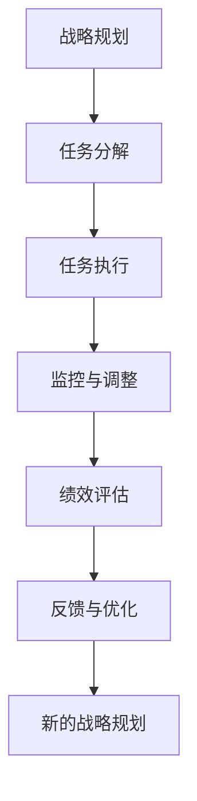

                 

# 行动体系:执行力的保障

在数字化转型的浪潮中，企业需要以敏捷、高效的执行力来实现业务目标，而这需要构建一个坚实的行动体系。本文将深入探讨行动体系的构建与执行，提供一套逻辑清晰、结构紧凑的技术指南，帮助企业实现从战略到行动的有效落地。

## 1. 背景介绍

### 1.1 问题由来

随着数字化转型加速，企业面临的市场环境日趋复杂多变，竞争日益激烈。传统计划、执行、反馈的循环周期长、效率低，难以适应快速变化的市场需求。为此，构建一个高效、敏捷的行动体系，成为企业成功转型的关键。

### 1.2 问题核心关键点

行动体系的核心在于实现企业战略的快速响应和高效执行。主要包括：
- **战略规划与分解**：将企业战略转化为可执行的任务和目标。
- **任务执行与监控**：在执行过程中，通过实时监控和调整确保任务按计划进行。
- **绩效反馈与优化**：对执行结果进行评估和反馈，优化执行策略和流程。

## 2. 核心概念与联系

### 2.1 核心概念概述

行动体系构建涉及多个核心概念：

- **战略规划（Strategy Planning）**：基于企业内外环境分析，制定长期和短期战略目标。
- **任务分解（Task Decomposition）**：将战略目标细化为具体的可执行任务。
- **任务执行（Task Execution）**：通过团队协作，高效完成任务。
- **监控与调整（Monitoring & Adjustment）**：实时监控任务进度，及时调整执行策略。
- **绩效评估（Performance Evaluation）**：通过指标体系评估任务完成情况，进行持续优化。

这些概念间的联系可通过以下Mermaid流程图来展示：



这个流程图展示了行动体系的各个环节和它们之间的相互作用。

## 3. 核心算法原理 & 具体操作步骤

### 3.1 算法原理概述

行动体系的构建和执行基于系统工程方法和项目管理原则，强调通过持续改进（Continuous Improvement）和迭代优化（Iterative Optimization）实现目标。核心算法原理包括：

- **目标设定与分解**：SMART原则（Specific, Measurable, Achievable, Relevant, Time-bound）指导任务设定。
- **进度监控与调整**：Kanban看板、Scrum框架等工具支持任务进度实时跟踪和调整。
- **绩效评估与反馈**：关键绩效指标（KPIs）、平衡计分卡（BSC）等方法帮助评估任务完成情况，并提供持续改进的依据。

### 3.2 算法步骤详解

行动体系的构建和执行通常分为以下几个关键步骤：

**Step 1: 战略规划与分解**
- 确定企业的愿景、使命和长期战略目标。
- 基于战略目标，识别关键成功因素（KSFs）和关键绩效指标（KPIs）。
- 将战略目标分解为可执行的短期目标和任务，明确责任人和时间表。

**Step 2: 任务执行与监控**
- 通过项目管理工具如JIRA、Trello等，创建任务清单和看板。
- 分配任务给团队成员，确保资源配置合理。
- 实施Scrum等敏捷管理方法，每周举行站会（Sprint），确保任务进度透明和及时调整。

**Step 3: 绩效评估与反馈**
- 定义KPIs和BSC指标，定期评估任务完成情况。
- 采用数据分析工具如Tableau、PowerBI等，实时监控任务进度和绩效。
- 基于评估结果，进行反馈和优化，形成持续改进的循环。

**Step 4: 反馈与优化**
- 定期回顾项目进展，识别问题和改进点。
- 采用PDCA（Plan-Do-Check-Act）循环，持续优化执行过程。
- 记录改进措施和结果，形成知识库，供未来项目参考。

### 3.3 算法优缺点

行动体系构建与执行的优势包括：
- **高效响应**：通过敏捷管理方法，快速响应市场变化，提升执行效率。
- **透明透明**：项目管理工具支持任务进度和绩效的实时监控，确保信息透明。
- **持续改进**：PDCA循环帮助不断优化执行策略，提升任务完成质量。

同时，行动体系也面临以下挑战：
- **复杂性高**：大规模、跨部门的行动体系设计复杂，需要多方协同。
- **资源投入高**：项目管理工具和数据分析工具的引入需要较高成本。
- **依赖个体**：执行效果依赖团队成员的积极性和能力。

### 3.4 算法应用领域

行动体系构建与执行在多个领域都有广泛应用，包括但不限于：

- **企业数字化转型**：通过敏捷管理方法，支持快速响应市场变化。
- **项目管理**：提升项目执行效率和质量，实现项目目标。
- **运营优化**：通过数据分析和持续改进，优化运营流程和效率。
- **人力资源管理**：通过目标设定和绩效评估，提升员工激励和绩效。

## 4. 数学模型和公式 & 详细讲解 & 举例说明

### 4.1 数学模型构建

行动体系构建和执行涉及多个子模型，如任务分解模型、进度监控模型、绩效评估模型等。以任务分解模型为例：

- **任务依赖关系图（Task Dependency Graph）**：描述任务之间的依赖关系，用于任务调度和执行顺序的确定。
- **任务时间估计模型（Task Time Estimation Model）**：通过历史数据，预测任务完成所需的时间。
- **资源分配模型（Resource Allocation Model）**：在考虑资源限制的前提下，优化资源分配方案。

### 4.2 公式推导过程

以任务依赖关系图为例，公式推导如下：

$$
G = (N, E)
$$

其中 $N$ 为任务集合，$E$ 为依赖关系集合。每个任务 $t_i$ 有一个唯一标识符，依赖关系 $e_{ij}$ 表示任务 $t_j$ 依赖于任务 $t_i$。

### 4.3 案例分析与讲解

假设某软件开发项目包含三个任务 $t_1, t_2, t_3$，其依赖关系如图：

```
t1 --> t2
t2 --> t3
```

则任务依赖关系图可表示为：

```
t1 -> t2
t2 -> t3
```

这表示任务 $t_2$ 依赖于 $t_1$，任务 $t_3$ 依赖于 $t_2$。在任务调度时，应先执行 $t_1$，再执行 $t_2$，最后执行 $t_3$。

## 5. 项目实践：代码实例和详细解释说明

### 5.1 开发环境搭建

开发行动体系的工具和平台多种多样，以下推荐一些主流工具：

- **项目管理工具**：JIRA、Trello、Asana
- **数据分析工具**：Tableau、PowerBI、Google Data Studio
- **敏捷管理工具**：ScrumAlliance、Agile Coach
- **协作平台**：Confluence、Slack、Microsoft Teams

### 5.2 源代码详细实现

以下是一个简单的行动体系构建与执行的Python代码示例：

```python
from typing import Dict, List
from datetime import datetime, timedelta

# 定义任务类
class Task:
    def __init__(self, id: str, name: str, start_date: datetime, end_date: datetime, dependencies: List[str]):
        self.id = id
        self.name = name
        self.start_date = start_date
        self.end_date = end_date
        self.dependencies = dependencies
        self.status = '待开始'
        self.progress = 0

# 定义项目类
class Project:
    def __init__(self, name: str, tasks: List[Task]):
        self.name = name
        self.tasks = tasks

    def add_task(self, task: Task):
        self.tasks.append(task)

    def update_task_status(self, task_id: str, status: str):
        for task in self.tasks:
            if task.id == task_id:
                task.status = status

# 创建项目和任务
project = Project('软件开发项目', [])
task1 = Task('t1', '需求分析', datetime(2023, 1, 1), datetime(2023, 1, 15), [])
task2 = Task('t2', '设计开发', datetime(2023, 1, 16), datetime(2023, 1, 30), ['t1'])
task3 = Task('t3', '测试部署', datetime(2023, 1, 31), datetime(2023, 2, 14), ['t2'])

project.add_task(task1)
project.add_task(task2)
project.add_task(task3)

# 输出项目任务列表
for task in project.tasks:
    print(task.name, task.start_date, task.end_date, task.dependencies, task.status, task.progress)
```

### 5.3 代码解读与分析

上述代码展示了如何定义任务和项目，并创建简单的任务依赖关系图。实际应用中，需要根据项目需求和规模，扩展任务的属性和方法，如任务时间估计、资源分配等。

## 6. 实际应用场景

### 6.1 企业数字化转型

在数字化转型过程中，企业需要构建敏捷、高效的行动体系，以快速响应市场变化。例如，某电子商务企业通过引入敏捷管理方法，将市场响应周期从原来的3个月缩短到1个月，显著提升了市场竞争力。

### 6.2 项目管理

项目管理中，行动体系通过实时监控和调整，确保项目按计划进行。例如，某大型IT项目通过引入JIRA和Scrum方法，显著提升了项目执行效率和质量，按时交付率提高了20%。

### 6.3 运营优化

运营优化中，行动体系通过数据分析和持续改进，优化运营流程和效率。例如，某制造企业通过数据分析和PDCA循环，优化了生产流程，生产效率提升了15%。

### 6.4 未来应用展望

未来，行动体系将在更多领域得到应用，为企业带来更大的价值：

- **供应链管理**：通过敏捷管理方法，实现供应链的高效协同和优化。
- **客户关系管理**：通过实时监控和反馈，提升客户满意度和忠诚度。
- **人力资源管理**：通过绩效评估和反馈，提升员工激励和绩效。

## 7. 工具和资源推荐

### 7.1 学习资源推荐

为了帮助开发者系统掌握行动体系构建与执行的理论基础和实践技巧，推荐以下学习资源：

1. **敏捷项目管理（Agile Project Management）**：《敏捷项目管理实践指南》、《Scrum Master权威指南》等书籍，系统介绍敏捷管理方法和实践。
2. **项目管理工具（Project Management Tools）**：JIRA、Trello、Asana等工具的使用手册和培训课程，提供工具操作指南。
3. **数据分析（Data Analysis）**：《Python数据分析实战》、《数据科学实战》等书籍，介绍数据分析和可视化工具的应用。
4. **持续改进（Continuous Improvement）**：《丰田生产方式》、《精益管理实战》等书籍，提供持续改进方法和案例。
5. **敏捷管理工具（Agile Management Tools）**：ScrumAlliance、Agile Coach等组织的培训课程和认证项目，提升敏捷管理技能。

### 7.2 开发工具推荐

开发行动体系的工具和平台多种多样，以下推荐一些主流工具：

1. **项目管理工具**：JIRA、Trello、Asana
2. **数据分析工具**：Tableau、PowerBI、Google Data Studio
3. **敏捷管理工具**：ScrumAlliance、Agile Coach
4. **协作平台**：Confluence、Slack、Microsoft Teams
5. **项目管理库**：Git、GitLab、Jenkins

### 7.3 相关论文推荐

行动体系构建与执行的研究源于学界的持续研究。以下是几篇奠基性的相关论文，推荐阅读：

1. **敏捷项目管理（Agile Project Management）**：《Agile Estimating and Planning》、《The Agile Manifesto》等论文，介绍敏捷管理方法和实践。
2. **项目管理工具（Project Management Tools）**：《JIRA 5.0: The Scrum of All Things》、《Trello for the Business Class》等书籍，提供工具操作指南和案例。
3. **数据分析（Data Analysis）**：《Python Data Science Handbook》、《Data Science on the Go》等书籍，介绍数据分析和可视化工具的应用。
4. **持续改进（Continuous Improvement）**：《Toyota Production System》、《Lean Management》等书籍，提供持续改进方法和案例。
5. **敏捷管理工具（Agile Management Tools）**：《Scrum for the Scrum Master》、《Agile Project Management with Scrum》等书籍，提升敏捷管理技能。

这些论文代表了大语言模型微调技术的发展脉络。通过学习这些前沿成果，可以帮助研究者把握学科前进方向，激发更多的创新灵感。

## 8. 总结：未来发展趋势与挑战

### 8.1 研究成果总结

本文对行动体系构建与执行方法进行了全面系统的介绍。首先阐述了行动体系构建与执行的研究背景和意义，明确了行动体系在提升企业执行力方面的独特价值。其次，从原理到实践，详细讲解了行动体系的构建方法、执行步骤和优化策略，给出了行动体系构建与执行的完整代码实例。同时，本文还探讨了行动体系在多个行业领域的应用前景，展示了行动体系构建与执行的广泛应用价值。最后，本文精选了行动体系构建与执行的技术资源，力求为读者提供全方位的技术指引。

通过本文的系统梳理，可以看到，行动体系构建与执行方法正在成为企业战略执行的重要范式，极大地提升了企业的执行效率和决策响应速度，推动了企业数字化转型的进程。未来，伴随行动体系构建与执行方法的不断演进，相信企业执行力将进一步提升，迈向更高的智能水平。

### 8.2 未来发展趋势

展望未来，行动体系构建与执行方法将呈现以下几个发展趋势：

1. **数字化转型加速**：随着数字化转型的不断深入，企业对敏捷执行体系的需求将更加迫切，行动体系构建与执行将进一步向数字化、智能化方向发展。
2. **多领域应用拓展**：行动体系构建与执行方法将进一步拓展到更多行业领域，如供应链管理、客户关系管理等，为企业带来更多价值。
3. **自动化和智能化**：借助AI和大数据技术，行动体系构建与执行将实现更加智能化和自动化，提升执行效率和决策质量。
4. **持续改进与优化**：基于实时监控和数据分析，行动体系将实现持续改进和优化，提升执行效果和业务绩效。

### 8.3 面临的挑战

尽管行动体系构建与执行方法已经取得了瞩目成就，但在迈向更加智能化、普适化应用的过程中，它仍面临着诸多挑战：

1. **数据质量和完整性**：行动体系构建与执行依赖高质量的数据，数据不完整或错误将导致执行效果不佳。
2. **系统复杂性**：行动体系构建与执行涉及多个系统模块和组件，系统复杂性高，需要多方协同。
3. **资源和成本**：行动体系构建与执行需要投入大量资源和成本，中小企业可能难以负担。
4. **团队协作与管理**：行动体系构建与执行依赖团队协作，团队管理和协同难度较大。
5. **持续改进与优化**：行动体系构建与执行需要持续改进和优化，过程中可能面临诸多挑战和困难。

### 8.4 研究展望

面对行动体系构建与执行方法面临的挑战，未来的研究需要在以下几个方面寻求新的突破：

1. **数据治理与质量管理**：加强数据治理和质量管理，确保行动体系构建与执行的数据基础可靠。
2. **系统架构设计**：设计更加简洁、高效的系统架构，降低系统复杂性。
3. **低成本解决方案**：开发低成本、易部署的行动体系解决方案，促进行动体系在中小企业中的应用。
4. **自动化工具和平台**：开发自动化工具和平台，降低团队协作与管理难度。
5. **持续改进与优化**：加强持续改进与优化方法的研究，提升行动体系构建与执行的执行效果和业务绩效。

这些研究方向的探索，必将引领行动体系构建与执行方法迈向更高的台阶，为构建高效、敏捷的执行体系铺平道路。面向未来，行动体系构建与执行方法还需要与其他管理技术进行更深入的融合，如OKR（Objectives and Key Results）、KPIs（Key Performance Indicators）等，多路径协同发力，共同推动企业执行力的提升。

## 9. 附录：常见问题与解答

**Q1：行动体系构建与执行是否适用于所有企业？**

A: 行动体系构建与执行适用于各种规模和类型的企业，特别是在复杂多变、竞争激烈的市场环境下，行动体系构建与执行将成为企业战略执行的重要保障。但需要注意的是，行动体系构建与执行需要企业内部协同，可能需要较高的投入和培训成本。

**Q2：行动体系构建与执行的资源投入如何？**

A: 行动体系构建与执行需要一定的资源投入，包括项目管理工具、数据分析工具、敏捷管理培训等。但相比于从头开发或逐步改进，行动体系的构建与执行通常能显著提升企业执行力，带来更高的投资回报。

**Q3：行动体系构建与执行的实施难点有哪些？**

A: 行动体系构建与执行的实施难点包括：
1. **数据质量管理**：确保行动体系构建与执行的数据基础可靠，需要加强数据治理和质量管理。
2. **系统复杂性管理**：设计简洁、高效的系统架构，降低系统复杂性。
3. **团队协作管理**：加强团队管理和协同，提升团队协作效率。
4. **持续改进与优化**：持续改进与优化需要方法论支持和实际数据，需要定期回顾和调整。

这些难点需要企业投入足够的资源和时间，确保行动体系构建与执行的顺利实施。

**Q4：行动体系构建与执行的成功关键是什么？**

A: 行动体系构建与执行的成功关键包括：
1. **明确战略目标**：确保行动体系构建与执行的目标与企业战略一致。
2. **数据质量管理**：确保行动体系构建与执行的数据基础可靠。
3. **系统设计合理**：设计简洁、高效的系统架构，降低系统复杂性。
4. **团队协作管理**：加强团队管理和协同，提升团队协作效率。
5. **持续改进与优化**：持续改进与优化需要方法论支持和实际数据，需要定期回顾和调整。

这些关键点需要企业全员参与，共同努力，才能实现行动体系构建与执行的成功。

**Q5：行动体系构建与执行的未来发展方向是什么？**

A: 行动体系构建与执行的未来发展方向包括：
1. **数字化转型加速**：随着数字化转型的不断深入，行动体系构建与执行将进一步向数字化、智能化方向发展。
2. **多领域应用拓展**：行动体系构建与执行方法将进一步拓展到更多行业领域，如供应链管理、客户关系管理等，为企业带来更多价值。
3. **自动化和智能化**：借助AI和大数据技术，行动体系构建与执行将实现更加智能化和自动化，提升执行效率和决策质量。
4. **持续改进与优化**：基于实时监控和数据分析，行动体系将实现持续改进和优化，提升执行效果和业务绩效。

这些发展方向将进一步推动行动体系构建与执行方法的创新和应用，为企业带来更大的价值。

---

作者：禅与计算机程序设计艺术 / Zen and the Art of Computer Programming

