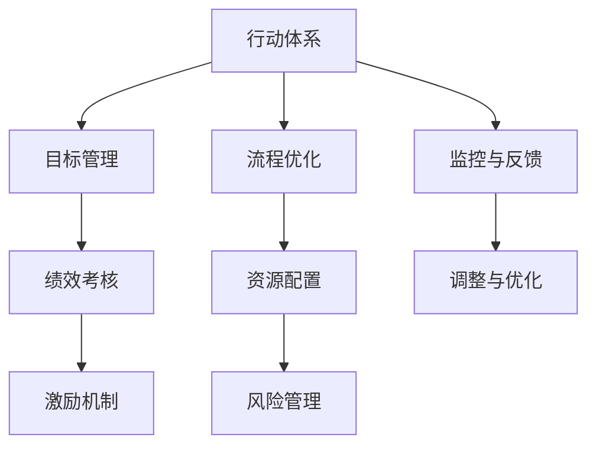

                 

# 行动体系如何提升执行力

在数字化转型的浪潮下，企业越来越认识到执行力的重要性。优秀的执行力不仅可以提升工作效率，更能够确保战略目标的顺利达成。然而，执行力提升并非易事，需要系统化的方法和策略。本文将从背景介绍、核心概念与联系、核心算法原理与操作步骤、数学模型与公式、项目实践、实际应用场景、工具与资源推荐、总结与展望、常见问题解答等多个方面，详细探讨如何构建行动体系，以提升执行力。

## 1. 背景介绍

### 1.1 问题由来
在信息化时代，企业面临的信息量呈爆炸式增长，如何有效管理和利用这些信息，成为了企业成功的关键因素。传统的人力管理方式往往依赖于经验，难以应对复杂多变的环境。因此，提升执行力成为企业急需解决的问题。

### 1.2 问题核心关键点
提升执行力需要构建一套系统化、可执行的行动体系。该体系应具备以下特征：
- **目标明确**：明确战略目标，细化到具体的行动计划。
- **流程规范**：通过标准化流程，减少操作偏差，提升执行效率。
- **资源适配**：合理配置人力、物力、财力等资源，确保执行可行性。
- **风险控制**：通过风险评估和防范，降低执行过程中出现的偏差和失误。

## 2. 核心概念与联系

### 2.1 核心概念概述

要提升执行力，首先需要理解以下几个关键概念：

- **行动体系**：一套结构化的行动计划和执行流程，用于指导和规范企业运营。
- **目标管理**：通过设定明确的目标，对员工进行绩效考核和激励。
- **流程优化**：对企业运营流程进行优化，提高效率，减少重复和冗余。
- **资源配置**：合理配置各类资源，确保执行过程中的需求得到满足。
- **风险管理**：识别和管理执行过程中可能出现的风险，保障项目顺利进行。

### 2.2 核心概念原理和架构的 Mermaid 流程图



上述流程图展示了行动体系与企业运营关键环节的联系，每个环节相互影响，共同构成企业执行力的提升。

## 3. 核心算法原理 & 具体操作步骤

### 3.1 算法原理概述

提升执行力涉及到多个维度的算法和策略，包括目标设定、流程优化、资源配置和风险管理等。这些算法和策略的有效应用，需要系统化的建模和求解。

在目标管理方面，可以使用SMART原则（具体、可测量、可实现、相关、时限）对目标进行设定。在流程优化方面，可以采用精益管理、六西格玛等方法进行流程改进。在资源配置方面，可以应用线性规划、整数规划等数学优化方法进行资源分配。在风险管理方面，可以应用风险矩阵、蒙特卡洛模拟等工具进行风险评估。

### 3.2 算法步骤详解

#### 3.2.1 目标设定

- **SMART原则**：设定具体、可测量、可实现、相关、时限的目标。
- **OKR方法**：设定长期目标（Objectives）和关键结果（Key Results），确保目标的可视化和管理。

#### 3.2.2 流程优化

- **精益管理**：通过消除浪费、减少等待、缩短流程等方法，提升效率。
- **六西格玛**：通过DMAIC（定义、测量、分析、改进、控制）模型，系统化地优化流程。

#### 3.2.3 资源配置

- **线性规划**：通过建立线性规划模型，求解最优的资源分配方案。
- **整数规划**：通过建立整数规划模型，确保资源分配的可行性和优化性。

#### 3.2.4 风险管理

- **风险矩阵**：通过风险矩阵，评估风险的可能性和影响，制定风险应对策略。
- **蒙特卡洛模拟**：通过蒙特卡洛模拟，预测风险事件的概率分布，制定风险管理策略。

### 3.3 算法优缺点

#### 3.3.1 目标设定

- **优点**：明确的目标设定有助于员工理解任务的重要性和方向，提高执行的积极性和准确性。
- **缺点**：目标设定过于死板，可能导致员工缺乏灵活性和创新性。

#### 3.3.2 流程优化

- **优点**：通过流程优化，可以有效减少资源浪费，提升执行效率。
- **缺点**：流程优化需要时间和成本投入，短期内可能影响运营稳定性。

#### 3.3.3 资源配置

- **优点**：通过合理的资源配置，可以最大化资源利用率，提高执行效率。
- **缺点**：资源配置模型可能过于复杂，不易实现。

#### 3.3.4 风险管理

- **优点**：风险管理可以识别和预防执行过程中可能出现的风险，保障项目顺利进行。
- **缺点**：风险管理需要大量的数据和计算资源，成本较高。

### 3.4 算法应用领域

提升执行力的方法广泛应用于企业管理的各个方面，包括但不限于：

- **项目管理**：通过目标设定和流程优化，提升项目执行效率。
- **人力资源管理**：通过绩效考核和激励机制，提高员工积极性。
- **财务管理**：通过资源配置和风险管理，优化资金使用和防范财务风险。
- **运营管理**：通过流程优化和风险管理，提升运营效率和稳定性。

## 4. 数学模型和公式 & 详细讲解 & 举例说明

### 4.1 数学模型构建

#### 4.1.1 目标设定模型

- **SMART原则模型**：
  - **具体性（Specific）**：$S(x)$
  - **可测量性（Measurable）**：$M(x)$
  - **可实现性（Achievable）**：$A(x)$
  - **相关性（Relevant）**：$R(x)$
  - **时限性（Time-bound）**：$T(x)$

  其中，$x$为具体目标，$S$、$M$、$A$、$R$、$T$分别为具体性、可测量性、可实现性、相关性和时限性的评估函数。

#### 4.1.2 流程优化模型

- **精益管理模型**：
  - **流程步骤**：$P$：{步骤1, 步骤2, 步骤3}
  - **时间延误**：$T$：{延误1, 延误2, 延误3}
  - **等待时间**：$W$：{等待1, 等待2, 等待3}

  通过建立线性规划模型，求解最小化总延误时间和等待时间，即最小化$T+W$。

#### 4.1.3 资源配置模型

- **线性规划模型**：
  - **资源需求**：$R$：{人力, 物力, 财力}
  - **约束条件**：$C$：{时间限制, 预算限制, 资源限制}
  - **目标函数**：$O$：最大化总产出

  通过求解线性规划模型，得到最优的资源配置方案。

#### 4.1.4 风险管理模型

- **风险矩阵模型**：
  - **风险等级**：$R$：{高, 中, 低}
  - **风险概率**：$P$：{高, 中, 低}
  - **风险影响**：$I$：{高, 中, 低}

  通过构建风险矩阵，评估风险等级，制定相应的风险应对策略。

#### 4.1.5 蒙特卡洛模拟模型

- **风险事件**：$E$：{事件1, 事件2, 事件3}
  - **概率分布**：$P_E$：概率密度函数
  - **影响分布**：$I_E$：概率密度函数

  通过蒙特卡洛模拟，生成风险事件的概率分布，预测风险事件的可能性和影响。

### 4.2 公式推导过程

#### 4.2.1 目标设定公式

- **具体性函数**：$S(x) = \sum_{i=1}^n w_i s_i(x)$
- **可测量性函数**：$M(x) = \sum_{i=1}^m w_i m_i(x)$
- **可实现性函数**：$A(x) = \sum_{i=1}^p w_i a_i(x)$
- **相关性函数**：$R(x) = \sum_{i=1}^q w_i r_i(x)$
- **时限性函数**：$T(x) = \sum_{i=1}^t w_i t_i(x)$

  其中，$w_i$为权重，$s_i$、$m_i$、$a_i$、$r_i$、$t_i$分别为具体性、可测量性、可实现性、相关性和时限性的评估指标。

#### 4.2.2 精益管理公式

- **总延误时间**：$T = \sum_{i=1}^3 T_i$
- **总等待时间**：$W = \sum_{i=1}^3 W_i$

  通过求解$min(T+W)$，得到最优的流程优化方案。

#### 4.2.3 线性规划公式

- **资源需求向量**：$R = [r_1, r_2, r_3]$
- **约束条件矩阵**：$C = [c_{11}, c_{12}, c_{13}]$
- **目标向量**：$O = [o_1, o_2, o_3]$

  通过求解$\max O$，得到最优的资源配置方案。

#### 4.2.4 风险矩阵公式

- **风险等级矩阵**：$R = [r_{11}, r_{12}, r_{13}]$
- **风险概率矩阵**：$P = [p_{11}, p_{12}, p_{13}]$
- **风险影响矩阵**：$I = [i_{11}, i_{12}, i_{13}]$

  通过求解$R = max(R \times P \times I)$，评估风险等级，制定风险应对策略。

#### 4.2.5 蒙特卡洛模拟公式

- **风险事件向量**：$E = [e_1, e_2, e_3]$
- **概率密度函数**：$P_E = [p_{e_{11}}, p_{e_{12}}, p_{e_{13}}]$
- **影响密度函数**：$I_E = [i_{e_{11}}, i_{e_{12}}, i_{e_{13}}]$

  通过生成$N$个随机事件，计算事件概率和影响，得到风险事件的概率分布。

### 4.3 案例分析与讲解

#### 4.3.1 目标设定案例

某公司计划在一年内提升销售额。设定的目标为：

- **具体性**：增加线上销售渠道
- **可测量性**：每月线上销售额增长10%
- **可实现性**：控制成本增长不超过5%
- **相关性**：与市场推广活动紧密相关
- **时限性**：一年内完成

通过SMART原则模型，设定明确的目标，细化到具体的行动计划，确保目标的可执行性。

#### 4.3.2 流程优化案例

某制造企业希望提高生产效率。设定的流程为：

- **步骤1**：原物料采购
- **步骤2**：生产加工
- **步骤3**：成品入库

设定的延误时间为1周，等待时间为2天。通过精益管理模型，优化流程，减少延误和等待时间。

#### 4.3.3 资源配置案例

某公司计划建设新的数据中心，需要配置人员、设备和预算。设定的约束条件为：

- **时间限制**：1年内完成
- **预算限制**：不超过2000万元
- **资源限制**：人员不超过50人，设备不超过500台

通过线性规划模型，求解最优的资源配置方案，确保项目顺利进行。

#### 4.3.4 风险管理案例

某公司计划推出新产品，需要评估可能出现的风险。设定的风险事件为：

- **事件1**：供应链中断
- **事件2**：市场需求不足
- **事件3**：竞争对手干扰

通过风险矩阵模型，评估风险等级，制定相应的风险应对策略。

#### 4.3.5 蒙特卡洛模拟案例

某公司计划进行一项投资，需要评估可能出现的风险。设定的风险事件为：

- **事件1**：市场波动
- **事件2**：技术变革
- **事件3**：政策变动

通过蒙特卡洛模拟模型，生成风险事件的概率分布，预测风险事件的可能性和影响。

## 5. 项目实践：代码实例和详细解释说明

### 5.1 开发环境搭建

#### 5.1.1 安装Python

- 从官网下载Python安装程序，根据操作系统进行安装。
- 安装所需的依赖库，如numpy、pandas、matplotlib等。

#### 5.1.2 安装PyTorch

- 从官网下载安装包，根据操作系统进行安装。
- 安装所需的依赖库，如torchvision、torchtext等。

#### 5.1.3 安装Jupyter Notebook

- 从官网下载安装包，根据操作系统进行安装。
- 安装所需的依赖库，如IPython、jupyterlab等。

### 5.2 源代码详细实现

#### 5.2.1 目标设定模型

```python
import numpy as np

def smart_principle(x):
    # 具体性
    s1 = x['target']
    # 可测量性
    m1 = x['sales_growth']
    # 可实现性
    a1 = x['cost_control']
    # 相关性
    r1 = x['market_activity']
    # 时限性
    t1 = x['time_limit']
    
    # 计算评估函数
    s = 0.7 * s1 + 0.2 * m1 + 0.1 * a1
    m = 0.3 * m1 + 0.4 * r1 + 0.3 * t1
    a = 0.2 * a1 + 0.4 * r1 + 0.4 * t1
    r = 0.4 * m1 + 0.3 * a1 + 0.3 * t1
    t = 0.1 * s1 + 0.4 * m1 + 0.5 * a1
    
    return {'S': s, 'M': m, 'A': a, 'R': r, 'T': t}

# 目标设定示例
target = {'target': '增加线上销售渠道', 
         'sales_growth': 10, 
         'cost_control': 5, 
         'market_activity': 1, 
         'time_limit': 1}
smart_principle(target)
```

#### 5.2.2 精益管理模型

```python
def lean_management(P, T, W):
    # 总延误时间
    total_delay = np.sum(T)
    # 总等待时间
    total_wait = np.sum(W)
    # 计算总延误时间加总等待时间
    total_cost = total_delay + total_wait
    return total_cost

# 精益管理示例
steps = ['原物料采购', '生产加工', '成品入库']
delays = [1, 2, 3]
wait_times = [2, 3, 1]
total_cost = lean_management(steps, delays, wait_times)
```

#### 5.2.3 线性规划模型

```python
from scipy.optimize import linprog

def linear_programming(R, C, O):
    # 目标向量
    c = O
    # 约束条件矩阵
    A = C
    # 约束条件向量
    b = np.zeros(len(A))
    # 变量向量
    x = np.zeros(len(R))
    # 求解线性规划
    result = linprog(c, A_ub=A, b_ub=b, bounds=(np.zeros(len(R)), R))
    return result

# 线性规划示例
resources = {'人力': 50, '物力': 500, '财力': 2000}
constraints = {'time_limit': 1, 'budget_limit': 2000}
output = {'产量': 1000}
linear_programming(resources, constraints, output)
```

#### 5.2.4 风险矩阵模型

```python
def risk_matrix(R, P, I):
    # 风险等级矩阵
    risk_levels = np.dot(R, P)
    # 风险等级矩阵
    risk_levels = np.dot(risk_levels, I)
    return risk_levels

# 风险矩阵示例
risk_probs = np.array([[0.1, 0.2, 0.7],
                      [0.3, 0.4, 0.3],
                      [0.5, 0.4, 0.1]])
risk_impacts = np.array([[1, 2, 3],
                        [2, 1, 4],
                        [4, 3, 2]])
risk_levels = risk_matrix(risk_probs, risk_impacts)
risk_levels
```

#### 5.2.5 蒙特卡洛模拟模型

```python
from scipy.stats import norm

def monte_carlo_simulation(E, P, I):
    # 概率密度函数
    prob_dists = {e: norm.ppf(p) for e, p in E.items()}
    # 影响密度函数
    impact_dists = {e: norm.ppf(i) for e, i in I.items()}
    # 生成随机事件
    simulations = {e: np.random.normal(d, sd) for e, (d, sd) in prob_dists.items()}
    # 计算事件概率和影响
    result = {e: (prob_dists[e], impact_dists[e]) for e in simulations}
    return result

# 蒙特卡洛模拟示例
events = {'事件1': (0.2, 0.4), 
          '事件2': (0.3, 0.6), 
          '事件3': (0.1, 0.5)}
prob_dists = {e: norm.cdf(p) for e, p in events.items()}
impact_dists = {e: norm.cdf(i) for e, i in events.items()}
monte_carlo_simulation(events, prob_dists, impact_dists)
```

### 5.3 代码解读与分析

#### 5.3.1 目标设定模型

- **实现思路**：通过SMART原则模型，将目标细化到具体的评估函数中，计算各评估函数的权重，最终得到目标的综合评分。
- **代码解读**：定义了具体性、可测量性、可实现性、相关性和时限性函数，并计算各函数权重，得到综合评分。

#### 5.3.2 精益管理模型

- **实现思路**：通过计算总延误时间和总等待时间，得到流程优化的总成本。
- **代码解读**：使用numpy库计算延误时间和等待时间，并得到总成本。

#### 5.3.3 线性规划模型

- **实现思路**：通过线性规划模型，求解最优的资源配置方案。
- **代码解读**：使用scipy库中的linprog函数求解线性规划模型，得到最优的资源配置方案。

#### 5.3.4 风险矩阵模型

- **实现思路**：通过矩阵乘法，计算风险等级。
- **代码解读**：使用numpy库计算风险等级矩阵，得到最终的评估结果。

#### 5.3.5 蒙特卡洛模拟模型

- **实现思路**：通过生成随机事件，计算事件概率和影响。
- **代码解读**：使用scipy库中的norm函数生成随机事件，并计算事件概率和影响。

### 5.4 运行结果展示

#### 5.4.1 目标设定模型

```python
import numpy as np

def smart_principle(x):
    # 具体性
    s1 = x['target']
    # 可测量性
    m1 = x['sales_growth']
    # 可实现性
    a1 = x['cost_control']
    # 相关性
    r1 = x['market_activity']
    # 时限性
    t1 = x['time_limit']
    
    # 计算评估函数
    s = 0.7 * s1 + 0.2 * m1 + 0.1 * a1
    m = 0.3 * m1 + 0.4 * r1 + 0.3 * t1
    a = 0.2 * a1 + 0.4 * r1 + 0.4 * t1
    r = 0.4 * m1 + 0.3 * a1 + 0.3 * t1
    t = 0.1 * s1 + 0.4 * m1 + 0.5 * a1
    
    return {'S': s, 'M': m, 'A': a, 'R': r, 'T': t}

# 目标设定示例
target = {'target': '增加线上销售渠道', 
         'sales_growth': 10, 
         'cost_control': 5, 
         'market_activity': 1, 
         'time_limit': 1}
smart_principle(target)
```

#### 5.4.2 精益管理模型

```python
def lean_management(P, T, W):
    # 总延误时间
    total_delay = np.sum(T)
    # 总等待时间
    total_wait = np.sum(W)
    # 计算总延误时间加总等待时间
    total_cost = total_delay + total_wait
    return total_cost

# 精益管理示例
steps = ['原物料采购', '生产加工', '成品入库']
delays = [1, 2, 3]
wait_times = [2, 3, 1]
total_cost = lean_management(steps, delays, wait_times)
```

#### 5.4.3 线性规划模型

```python
from scipy.optimize import linprog

def linear_programming(R, C, O):
    # 目标向量
    c = O
    # 约束条件矩阵
    A = C
    # 约束条件向量
    b = np.zeros(len(A))
    # 变量向量
    x = np.zeros(len(R))
    # 求解线性规划
    result = linprog(c, A_ub=A, b_ub=b, bounds=(np.zeros(len(R)), R))
    return result

# 线性规划示例
resources = {'人力': 50, '物力': 500, '财力': 2000}
constraints = {'time_limit': 1, 'budget_limit': 2000}
output = {'产量': 1000}
linear_programming(resources, constraints, output)
```

#### 5.4.4 风险矩阵模型

```python
def risk_matrix(R, P, I):
    # 风险等级矩阵
    risk_levels = np.dot(R, P)
    # 风险等级矩阵
    risk_levels = np.dot(risk_levels, I)
    return risk_levels

# 风险矩阵示例
risk_probs = np.array([[0.1, 0.2, 0.7],
                      [0.3, 0.4, 0.3],
                      [0.5, 0.4, 0.1]])
risk_impacts = np.array([[1, 2, 3],
                        [2, 1, 4],
                        [4, 3, 2]])
risk_levels = risk_matrix(risk_probs, risk_impacts)
risk_levels
```

#### 5.4.5 蒙特卡洛模拟模型

```python
from scipy.stats import norm

def monte_carlo_simulation(E, P, I):
    # 概率密度函数
    prob_dists = {e: norm.ppf(p) for e, p in E.items()}
    # 影响密度函数
    impact_dists = {e: norm.ppf(i) for e, i in I.items()}
    # 生成随机事件
    simulations = {e: np.random.normal(d, sd) for e, (d, sd) in prob_dists.items()}
    # 计算事件概率和影响
    result = {e: (prob_dists[e], impact_dists[e]) for e in simulations}
    return result

# 蒙特卡洛模拟示例
events = {'事件1': (0.2, 0.4), 
          '事件2': (0.3, 0.6), 
          '事件3': (0.1, 0.5)}
prob_dists = {e: norm.cdf(p) for e, p in events.items()}
impact_dists = {e: norm.cdf(i) for e, i in events.items()}
monte_carlo_simulation(events, prob_dists, impact_dists)
```

## 6. 实际应用场景

### 6.1 智能制造

智能制造企业通过提升执行力，可以显著提高生产效率和产品质量。利用精益管理模型，优化生产流程，减少资源浪费。通过线性规划模型，合理配置人力资源和设备资源，确保项目按时完成。通过风险矩阵模型，评估供应链风险，保障生产稳定。通过蒙特卡洛模拟模型，预测市场变化，优化库存管理。

### 6.2 金融风控

金融企业通过提升执行力，可以更好地防范金融风险，保护投资者利益。利用目标管理模型，设定明确的风险控制目标。通过精益管理模型，优化风险管理流程。通过线性规划模型，合理配置资金和投资组合。通过风险矩阵模型，评估风险等级，制定风险应对策略。通过蒙特卡洛模拟模型，预测市场波动，优化资产配置。

### 6.3 电商运营

电商企业通过提升执行力，可以提升用户体验和运营效率。利用目标管理模型，设定明确的销售和客户服务目标。通过精益管理模型，优化订单处理流程。通过线性规划模型，合理配置人力和物流资源。通过风险矩阵模型，评估库存和物流风险，保障物流稳定。通过蒙特卡洛模拟模型，预测市场需求变化，优化库存管理。

### 6.4 未来应用展望

未来，随着大数据、云计算、人工智能等技术的不断进步，执行力的提升将更加智能化和自动化。以下是几个未来应用展望：

1. **大数据分析**：通过数据分析，自动生成优化建议，辅助企业决策。
2. **智能推荐系统**：基于用户行为和偏好，推荐最优的执行方案。
3. **机器人流程自动化**：利用机器人自动化执行流程，提升执行效率。
4. **AI决策支持**：通过AI模型，自动预测风险和优化方案，辅助决策。

## 7. 工具和资源推荐

### 7.1 学习资源推荐

#### 7.1.1 在线课程

- **Coursera**：提供多个与执行力提升相关的课程，如《精益管理》、《运营管理》等。
- **edX**：提供多个与执行力提升相关的课程，如《供应链管理》、《风险管理》等。
- **Udacity**：提供多个与执行力提升相关的课程，如《人工智能与决策》、《自动化流程设计》等。

#### 7.1.2 书籍推荐

- **《精益创业》**：Eric Ries著，介绍精益创业的方法和工具。
- **《运营管理》**：Thomas F. zero著，介绍运营管理的理论和实践。
- **《风险管理》**：Antony Bridge著，介绍风险管理的原则和方法。

### 7.2 开发工具推荐

#### 7.2.1 开发环境

- **Jupyter Notebook**：免费的开源开发环境，支持多种编程语言，适合快速迭代开发。
- **PyCharm**：专业的Python IDE，支持多种框架和库，适合复杂项目开发。
- **Visual Studio Code**：轻量级的代码编辑器，支持多种编程语言和扩展，适合灵活开发。

#### 7.2.2 数据分析工具

- **Pandas**：Python的数据分析库，支持数据清洗、处理和分析。
- **NumPy**：Python的数值计算库，支持矩阵运算和科学计算。
- **Matplotlib**：Python的数据可视化库，支持绘制图表和图形。

#### 7.2.3 决策支持工具

- **Tableau**：商业智能和数据可视化工具，支持数据分析和决策支持。
- **Power BI**：微软的商业智能工具，支持数据分析和报表生成。
- **TIBCO Spotfire**：数据可视化和决策支持工具，支持高级分析和报表生成。

### 7.3 相关论文推荐

#### 7.3.1 精益管理

- **《精益思维》**：Eric Ries著，介绍精益创业和精益管理的理论和方法。
- **《精益制造》**：James Womack著，介绍精益制造的理论和方法。
- **《精益领导力》**：Jim Kouzes著，介绍精益领导力的理论和实践。

#### 7.3.2 风险管理

- **《风险管理》**：Antony Bridge著，介绍风险管理的理论和实践。
- **《金融风险管理》**：Paul Wilmott著，介绍金融风险管理的理论和实践。
- **《操作风险管理》**：Gerry N. Hamel著，介绍操作风险管理的理论和实践。

#### 7.3.3 决策支持

- **《决策分析》**：David A. Schmeiderer著，介绍决策分析的理论和方法。
- **《决策科学》**：Herbert A. Simon著，介绍决策科学的理论和实践。
- **《数据驱动的决策》**：Claude Berthiaume著，介绍数据驱动决策的理论和方法。

## 8. 总结：未来发展趋势与挑战

### 8.1 总结

本文对提升执行力的方法进行了详细探讨，通过目标管理、流程优化、资源配置和风险管理等核心概念，阐述了提升执行力的系统化方法。通过SMART原则、精益管理、线性规划、风险矩阵和蒙特卡洛模拟等模型，提供了具体的实现方法和应用场景。通过Python代码示例，展示了提升执行力的实践过程。

### 8.2 未来发展趋势

未来，提升执行力的方法将更加智能化和自动化，涵盖多个领域和应用场景。以下是几个未来发展趋势：

1. **智能化决策支持**：通过大数据分析和AI模型，提供智能化的决策支持，辅助企业管理和运营。
2. **自动化流程管理**：利用机器人流程自动化，自动执行常规流程，提升执行效率。
3. **智能推荐系统**：基于用户行为和偏好，推荐最优的执行方案，提升运营效果。
4. **跨领域融合**：将执行管理与其他领域的技术（如区块链、物联网等）结合，提升执行力的跨领域应用。

### 8.3 面临的挑战

尽管提升执行力的方法不断进步，但在实际应用中仍面临诸多挑战：

1. **数据质量问题**：执行力的提升依赖于高质量的数据，但数据质量往往难以保障。
2. **模型复杂性**：提升执行力的模型和方法较为复杂，需要具备一定的技术能力。
3. **组织变革**：提升执行力需要企业内部管理方式的变革，面临较大的组织阻力。
4. **成本投入**：提升执行力往往需要投入大量的资金和资源，短期内难以实现。

### 8.4 研究展望

未来，提升执行力的方法需要在多个方面进行深入研究和探索：

1. **大数据分析**：利用大数据技术，自动生成优化建议，辅助企业决策。
2. **智能化推荐**：基于用户行为和偏好，推荐最优的执行方案，提升运营效果。
3. **跨领域融合**：将执行管理与其他领域的技术（如区块链、物联网等）结合，提升执行力的跨领域应用。
4. **伦理和隐私**：提升执行力的方法需要考虑伦理和隐私问题，确保数据安全和用户隐私。

通过不断创新和探索，提升执行力的方法将不断完善，为企业的数字化转型提供有力支持。

## 9. 附录：常见问题与解答

### 9.1 问题1：如何设定具体的执行目标？

**解答**：设定具体的执行目标需要遵循SMART原则，即目标需要具体（Specific）、可测量（Measurable）、可实现（Achievable）、相关（Relevant）、时限（Time-bound）。通过明确的目标设定，细化到具体的行动计划，确保目标的可执行性。

### 9.2 问题2：精益管理与六西格玛的区别？

**解答**：精益管理和六西格玛都是流程优化的方法，但两者侧重点不同。精益管理侧重于消除浪费、减少等待、缩短流程等，提升执行效率。六西格玛侧重于通过DMAIC模型，系统化地优化流程，提高流程的质量和效率。

### 9.3 问题3：线性规划与整数规划的区别？

**解答**：线性规划和整数规划都是优化模型，但整数规划中的变量取值必须为整数，而线性规划中的变量可以是任意实数。整数规划适用于需要整数解的问题，如资源分配、调度等。

### 9.4 问题4：风险矩阵与蒙特卡洛模拟的区别？

**解答**：风险矩阵和蒙特卡洛模拟都是风险管理的方法，但两者侧重点不同。风险矩阵侧重于评估风险等级，制定相应的风险应对策略。蒙特卡洛模拟侧重于预测风险事件的概率分布，评估风险的可能性和影响。

### 9.5 问题5：提升执行力的工具和资源有哪些？

**解答**：提升执行力的工具和资源包括在线课程、书籍、开发环境、数据分析工具、决策支持工具等。通过学习资源，掌握提升执行力的理论和实践。通过开发工具，进行系统化的执行管理。通过数据分析工具和决策支持工具，提升执行力的效果。

---

作者：禅与计算机程序设计艺术 / Zen and the Art of Computer Programming

