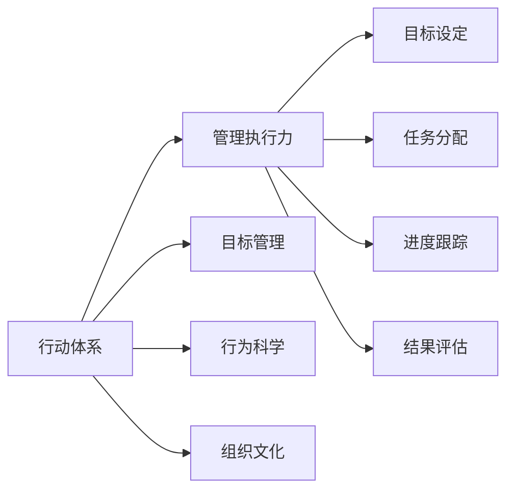

                 

# 行动体系对管理执行力的影响

> 关键词：行动体系, 管理执行力, 目标管理, 行为科学, 组织文化

## 1. 背景介绍

在现代企业中，管理执行力的强弱往往决定着企业的成败。一个高效的执行力体系能够确保企业战略、决策、资源的高效转化，从而在激烈的市场竞争中脱颖而出。然而，如何构建这样一个高效的执行力体系，一直是企业管理者面临的难题。本文将从行动体系的角度，探讨其对管理执行力提升的影响，并给出一些实用的建议。

## 2. 核心概念与联系

### 2.1 核心概念概述

#### 2.1.1 行动体系

行动体系是指通过一系列规范化的流程和工具，确保企业各级管理者和员工能够高效、准确地执行既定任务，达成目标的体系。其核心在于将复杂的管理过程分解为可操作的步骤，并明确每个步骤的责任和资源分配，从而提升执行效率和效果。

#### 2.1.2 管理执行力

管理执行力是指企业管理者将战略、计划、决策转化为具体行动，并确保这些行动得以贯彻实施的能力。它涉及到目标设定、任务分配、进度跟踪、结果评估等各个环节，是企业管理的核心竞争力之一。

#### 2.1.3 目标管理

目标管理是一种通过设定明确、可衡量的目标，并制定相应的行动计划来指导员工工作的管理方法。它通过将企业目标分解为各级目标，确保每个员工都清楚自己的工作方向和努力目标，从而提升执行效率。

#### 2.1.4 行为科学

行为科学是研究人类行为的规律和影响因素的学科。在企业管理中，行为科学被广泛应用于员工行为激励、团队协作、领导风格等方面，是构建行动体系的重要理论基础。

#### 2.1.5 组织文化

组织文化是指企业在长期发展过程中形成的共同价值观、行为规范和组织氛围。它对员工的工作态度、行为方式和团队合作都有深远影响。一个良好的组织文化能够增强员工的归属感和凝聚力，提升执行执行力。

### 2.2 核心概念原理和架构的 Mermaid 流程图



## 3. 核心算法原理 & 具体操作步骤

### 3.1 算法原理概述

行动体系的核心在于将复杂的任务和目标分解为具体的行动步骤，并确保这些行动得以高效执行。其原理主要基于以下几个方面：

1. **目标分解**：将企业战略、年度目标分解为季度、月度、周目标，直至具体的每日任务。
2. **任务分配**：根据员工的技能和岗位职责，将任务分配给相应的团队和个人。
3. **进度跟踪**：通过定期的报告和会议，跟踪任务进展，及时发现和解决执行中的问题。
4. **结果评估**：对任务完成情况进行评估，确保达成既定目标，并从中总结经验和教训，为未来的执行提供参考。

### 3.2 算法步骤详解

#### 3.2.1 目标分解

- **步骤1**：企业高层管理者根据战略规划，设定年度目标。
- **步骤2**：通过SMART原则（Specific, Measurable, Achievable, Relevant, Time-bound）将年度目标分解为季度、月度、周目标。
- **步骤3**：进一步将周目标分解为每日任务，确保每个任务都有明确的时间节点和责任人。

#### 3.2.2 任务分配

- **步骤1**：评估每个员工的技能和岗位职责，制定任务分配计划。
- **步骤2**：根据任务复杂度和资源需求，确定任务的具体执行人。
- **步骤3**：明确每个任务的输出成果和质量标准。

#### 3.2.3 进度跟踪

- **步骤1**：定期召开团队会议，收集任务进展情况。
- **步骤2**：使用项目管理工具（如JIRA、Trello等）记录任务状态和进展。
- **步骤3**：根据任务进展情况，及时调整资源和计划，确保任务按时完成。

#### 3.2.4 结果评估

- **步骤1**：对任务完成情况进行评估，对比目标和实际成果。
- **步骤2**：总结任务执行中的经验和教训，提出改进建议。
- **步骤3**：将改进建议反馈到下一次目标分解和任务分配中，形成持续改进机制。

### 3.3 算法优缺点

#### 3.3.1 优点

1. **目标明确**：通过系统化的目标分解，确保每个员工都清楚自己的工作方向和努力目标。
2. **责任明确**：明确每个任务的责任人，减少任务执行中的模糊和推诿。
3. **过程可控**：通过进度跟踪和结果评估，确保任务执行过程中的问题得到及时解决。
4. **结果可量化**：通过定量的目标和评估，确保执行效果可量化，便于总结和改进。

#### 3.3.2 缺点

1. **灵活性不足**：严格的流程和规范可能导致执行过程不够灵活，难以适应变化多端的市场需求。
2. **工作量较大**：目标分解和任务分配需要大量的时间和人力，增加了企业的管理成本。
3. **员工压力较大**：过细的目标分解和严格的进度跟踪可能给员工带来较大的压力，影响工作满意度。

### 3.4 算法应用领域

行动体系在多个领域都有广泛的应用，如：

- **项目管理**：通过目标分解、任务分配、进度跟踪和结果评估，确保项目按时完成，达成预期目标。
- **运营管理**：通过优化流程和资源配置，提升企业运营效率，减少浪费。
- **人力资源管理**：通过明确职责和评估员工绩效，提升员工的工作积极性和职业发展。
- **财务管理**：通过规范化的预算和成本控制，确保企业财务目标的实现。

## 4. 数学模型和公式 & 详细讲解 & 举例说明

### 4.1 数学模型构建

行动体系的核心模型主要基于目标分解和任务分配，其数学模型可以表示为：

$$
\text{目标} = \sum_{i=1}^n \text{子目标}_i \times \text{权重}_i
$$

其中，$n$表示目标的子目标数量，$\text{子目标}_i$表示第$i$个子目标，$\text{权重}_i$表示第$i$个子目标的权重。

### 4.2 公式推导过程

以项目管理的行动体系为例，可以将目标分解为多个子目标，并通过加权求和的方式计算整体目标完成情况。设项目总目标为$T$，子目标为$T_1, T_2, ..., T_n$，权重为$w_1, w_2, ..., w_n$，则整体目标完成度$R$可以表示为：

$$
R = \frac{1}{T} \sum_{i=1}^n \frac{T_i}{w_i}
$$

其中，$T_i$表示第$i$个子目标的实际完成情况，$w_i$表示第$i$个子目标的权重。

### 4.3 案例分析与讲解

假设一个企业设定了一个年度目标$T = 1000$万元，并将其分解为四个子目标$T_1, T_2, T_3, T_4$，每个子目标的权重分别为$w_1 = 0.3, w_2 = 0.2, w_3 = 0.2, w_4 = 0.3$。如果四个子目标的实际完成情况分别为$T_1 = 700, T_2 = 600, T_3 = 800, T_4 = 900$，则整体目标完成度$R$计算如下：

$$
R = \frac{1}{1000} \left( \frac{700}{0.3} + \frac{600}{0.2} + \frac{800}{0.2} + \frac{900}{0.3} \right) = 0.9
$$

这意味着整体目标完成度为90%，未达成的目标差距为10%。企业可以根据这个结果进行针对性的调整和改进。

## 5. 项目实践：代码实例和详细解释说明

### 5.1 开发环境搭建

1. **安装Python**：确保系统安装了Python 3.x版本。
2. **安装相关库**：安装必要的库，如numpy、pandas、matplotlib等。
3. **安装JIRA API库**：使用JIRA API库获取项目进度和任务状态。

### 5.2 源代码详细实现

以下是使用Python和JIRA API进行目标管理和进度跟踪的代码实现：

```python
import jira
import time
import pandas as pd
import matplotlib.pyplot as plt

# 连接JIRA
jira_url = 'https://your-jira-instance.com'
jira_auth = ('username', 'password')
jira = jira.JIRA(jira_url, auth=(jira_auth))

# 获取项目和子目标信息
project_key = 'PROJ-1'
issue_type = 'Task'
subgoals = {
    'T1': 'Subgoal 1',
    'T2': 'Subgoal 2',
    'T3': 'Subgoal 3',
    'T4': 'Subgoal 4'
}

# 定义目标分解和任务分配函数
def goal_decomposition(project_key):
    # 获取项目中所有任务
    issues = jira.search_jql(f"project={project_key} and type={issue_type}")
    
    # 计算每个子目标的完成情况和权重
    subgoal完成的 = {}
    subgoal权重 = {}
    for issue in issues:
        subgoal完成的[subgoals[issue.fields['summary']]] = issue.fields['status']['name']
        subgoal权重[subgoals[issue.fields['summary']]] = float(issue.fields['customfield_10002'] or 0)
    
    # 计算整体目标完成度
    goal_completed = sum(float(v) / w for v, w in subgoal完成的.items())
    goal_completed /= sum(subgoal权重.values())
    
    # 输出结果
    print(f'整体目标完成度: {goal_completed:.2f}')
    return subgoal完成的, subgoal权重

# 定期获取进度并绘制图表
def track_progress(subgoals, weights):
    plt.figure(figsize=(10, 6))
    plt.title('目标完成度追踪')
    plt.xlabel('时间')
    plt.ylabel('目标完成度')
    
    for subgoal, completed in subgoals.items():
        x = [i for i in range(len(completed))]
        plt.plot(x, completed, label=subgoal)
    
    plt.legend()
    plt.show()

# 主函数
if __name__ == '__main__':
    while True:
        completed, weight = goal_decomposition(project_key)
        track_progress(completed, weight)
        time.sleep(86400)  # 每隔24小时检查一次进度
```

### 5.3 代码解读与分析

1. **JIRA连接**：通过JIRA API库连接到企业JIRA实例，获取项目和任务信息。
2. **目标分解和任务分配**：定义目标分解和任务分配函数，使用JIRA API获取项目中所有任务，并计算每个子目标的完成情况和权重。
3. **进度跟踪**：通过绘制图表的方式，实时展示各个子目标的完成情况和整体目标完成度。
4. **循环执行**：使用while循环，每隔24小时检查一次进度，确保目标管理过程持续进行。

## 6. 实际应用场景

### 6.1 智能制造

在智能制造领域，行动体系可以帮助企业优化生产流程，提高生产效率。通过目标分解和任务分配，企业可以明确每个生产环节的目标和责任，确保各个环节的顺畅衔接。

### 6.2 金融服务

在金融服务领域，行动体系可以帮助银行和保险公司提高服务质量和客户满意度。通过明确每个服务环节的目标和责任，确保服务流程的高效运转和客户反馈的及时响应。

### 6.3 医疗健康

在医疗健康领域，行动体系可以帮助医院和诊所提高诊疗效率和患者满意度。通过目标分解和任务分配，确保每个诊疗环节的高效执行，提升患者的就医体验。

### 6.4 未来应用展望

未来的行动体系将更加智能化和自动化，通过机器学习和数据分析，实现对执行过程的实时监控和优化。通过智能化的目标分解和任务分配，可以更好地适应变化多端的市场需求，提升企业的竞争力。

## 7. 工具和资源推荐

### 7.1 学习资源推荐

1. **《行动体系与管理执行力》一书**：深入讲解行动体系的概念和应用，是管理者不可多得的参考资料。
2. **《目标管理与绩效提升》课程**：通过在线课程，系统学习目标管理和绩效提升的理论与实践。
3. **《行为科学与管理实践》课程**：通过行为科学理论，提升管理者和员工的执行力。

### 7.2 开发工具推荐

1. **JIRA**：项目管理工具，支持目标分解、任务分配、进度跟踪等功能。
2. **Trello**：团队协作工具，通过看板形式管理任务和进度。
3. **Microsoft Project**：项目管理软件，支持复杂的项目计划和资源配置。

### 7.3 相关论文推荐

1. **《行动体系对管理执行力的影响研究》**：系统研究行动体系的概念和应用，为企业管理者提供理论支持。
2. **《目标管理与绩效提升的实证研究》**：通过实证研究，验证目标管理对员工绩效的影响。
3. **《行为科学与管理执行力的关系》**：研究行为科学对员工行为和执行力的影响，提出改进建议。

## 8. 总结：未来发展趋势与挑战

### 8.1 研究成果总结

本文系统探讨了行动体系对管理执行力提升的影响，给出了具体的操作流程和实现方法。通过目标分解、任务分配、进度跟踪和结果评估，确保企业战略和决策得到高效执行。

### 8.2 未来发展趋势

未来的行动体系将更加智能化和自动化，通过机器学习和数据分析，实现对执行过程的实时监控和优化。通过智能化的目标分解和任务分配，可以更好地适应变化多端的市场需求，提升企业的竞争力。

### 8.3 面临的挑战

虽然行动体系在企业管理中具有重要价值，但也面临着一些挑战：

1. **复杂性高**：目标分解和任务分配需要高度的管理能力和经验，难度较大。
2. **数据质量**：依赖准确、完整的数据进行分析和决策，数据质量直接影响行动体系的效果。
3. **文化差异**：不同企业和管理者的行为习惯和文化背景不同，需要个性化的调整。

### 8.4 研究展望

未来的研究将更多关注以下方面：

1. **智能化与自动化**：开发更加智能化的工具，提升行动体系的管理效率。
2. **大数据与AI融合**：利用大数据和AI技术，提升行动体系的决策准确性和执行效率。
3. **个性化与定制化**：根据企业特点和员工需求，设计个性化的行动体系方案。

## 9. 附录：常见问题与解答

### 9.1 问题与解答

**Q1: 什么是行动体系？**

A: 行动体系是指通过一系列规范化的流程和工具，确保企业各级管理者和员工能够高效、准确地执行既定任务，达成目标的体系。

**Q2: 如何构建行动体系？**

A: 构建行动体系需要明确目标、分解任务、分配责任、跟踪进度和评估结果。具体流程包括目标分解、任务分配、进度跟踪和结果评估。

**Q3: 行动体系对管理执行力有何影响？**

A: 行动体系通过目标分解和任务分配，明确每个任务的责任和执行标准，确保任务的顺利完成，从而提升管理执行力。

**Q4: 行动体系在实际应用中需要注意哪些问题？**

A: 行动体系在实际应用中需要注意数据质量、执行过程中的灵活性和员工的心理压力等问题。

**Q5: 如何提升行动体系的智能化水平？**

A: 可以通过引入AI和大数据分析技术，实现对执行过程的实时监控和优化，提升行动体系的智能化水平。

总之，行动体系在企业管理中具有重要作用，通过规范化的流程和工具，确保企业的战略和决策得到高效执行，提升企业的竞争力和管理执行力。未来，随着技术的进步和应用场景的扩展，行动体系将不断优化和升级，为企业管理带来更多价值。

