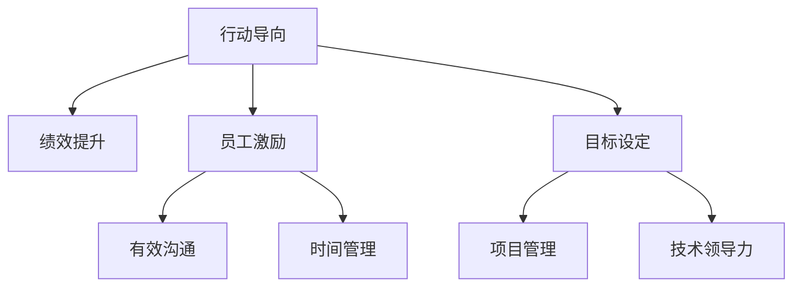

                 

# 行动导向：高效管理的基础

> 关键词：行动导向, 管理方法, 绩效提升, 员工激励, 目标设定, 高效沟通, 时间管理, 项目管理, 技术领导力

## 1. 背景介绍

### 1.1 问题由来
在现代社会，企业面临着巨大的竞争压力和快速变化的市场环境。传统的管理方法往往难以应对这些挑战，导致效率低下、员工流失率高、创新能力不足等问题。因此，如何提升企业管理效率，激发员工潜力，成为企业亟需解决的问题。

行动导向管理方法应运而生，它将管理的重心从任务本身转移到任务的完成者，即员工身上。通过科学合理的目标设定、激励机制和沟通方式，激发员工的积极性和创造力，提升企业的整体绩效。

### 1.2 问题核心关键点
行动导向管理的核心在于以下几个方面：

- **目标设定**：通过SMART原则（具体、可测量、可达成、相关、时限），帮助员工明确工作目标。
- **激励机制**：设计合理的激励体系，包括物质激励和精神激励，激发员工的积极性和创造力。
- **有效沟通**：建立双向的沟通机制，及时了解员工的需求和意见，提高团队协作效率。
- **时间管理**：引导员工高效利用时间，提高工作效率。
- **项目管理**：引入敏捷管理方法，灵活应对项目变化，提升项目成功率。
- **技术领导力**：培养具备技术洞察力和领导力的管理者，推动企业持续创新。

### 1.3 问题研究意义
研究行动导向管理方法，对于提升企业整体绩效、激发员工潜力、促进企业创新具有重要意义：

- **提升效率**：通过科学的目标设定和激励机制，激发员工的积极性和创造力，提升工作效率和绩效。
- **降低成本**：减少员工流失率和缺勤率，降低招聘和培训成本。
- **增强创新能力**：通过有效的沟通和项目管理，鼓励员工提出创新建议，提升企业的创新能力。
- **促进成长**：帮助员工明确职业发展路径，提升其技能水平和职业满意度。
- **适应变化**：灵活应对市场变化和新技术，增强企业的市场竞争力。

## 2. 核心概念与联系

### 2.1 核心概念概述

为了更好地理解行动导向管理方法，本节将介绍几个关键概念及其相互联系：

- **行动导向**：将管理的重心放在任务完成的员工身上，通过科学的目标设定、激励机制和沟通方式，激发员工的积极性和创造力。
- **绩效提升**：通过科学的管理方法，提升员工的工作效率和绩效，实现企业的整体目标。
- **员工激励**：设计合理的激励体系，包括物质激励和精神激励，激发员工的积极性和创造力。
- **目标设定**：通过SMART原则，帮助员工明确工作目标，提升其工作动机和绩效。
- **有效沟通**：建立双向的沟通机制，及时了解员工的需求和意见，提高团队协作效率。
- **时间管理**：引导员工高效利用时间，提高工作效率。
- **项目管理**：引入敏捷管理方法，灵活应对项目变化，提升项目成功率。
- **技术领导力**：培养具备技术洞察力和领导力的管理者，推动企业持续创新。

这些核心概念之间的逻辑关系可以通过以下Mermaid流程图来展示：



这个流程图展示了一系列的行动导向管理概念及其相互关系：

1. 行动导向管理通过科学的目标设定、员工激励、有效沟通、时间管理、项目管理和技术领导力，提升员工的工作积极性和创造力。
2. 有效的目标设定和激励机制，能够激发员工的工作热情，提高工作效率和绩效。
3. 良好的沟通机制和时间管理，能够提高团队的协作效率，减少内耗。
4. 科学的项目管理和技术领导力，能够灵活应对项目变化，推动企业持续创新。

这些概念共同构成了行动导向管理的核心，为企业提供了科学、高效的管理手段。

## 3. 核心算法原理 & 具体操作步骤

### 3.1 算法原理概述

行动导向管理的核心算法原理可以总结如下：

1. **目标设定**：通过SMART原则，帮助员工明确具体、可测量、可达成、相关和时限的工作目标。
2. **员工激励**：设计合理的激励体系，包括物质激励和精神激励，激发员工的积极性和创造力。
3. **有效沟通**：建立双向的沟通机制，及时了解员工的需求和意见，提高团队协作效率。
4. **时间管理**：引导员工高效利用时间，提高工作效率。
5. **项目管理**：引入敏捷管理方法，灵活应对项目变化，提升项目成功率。
6. **技术领导力**：培养具备技术洞察力和领导力的管理者，推动企业持续创新。

这些算法原理共同构成了一个系统的行动导向管理体系。

### 3.2 算法步骤详解

以下是一个典型的行动导向管理实施步骤：

1. **需求分析**：
   - 明确企业的总体目标和战略方向。
   - 调研员工的需求和期望，了解其工作现状和问题。
   - 设计合理的工作目标和绩效评估标准。

2. **目标设定**：
   - 通过SMART原则，帮助员工设定具体、可测量、可达成、相关和时限的工作目标。
   - 定期回顾和调整目标，确保其与企业总体目标一致。

3. **员工激励**：
   - 设计合理的激励体系，包括物质激励（如奖金、晋升机会等）和精神激励（如表彰、表扬等）。
   - 建立公平透明的绩效评估机制，确保激励机制的公正性。

4. **有效沟通**：
   - 建立双向沟通机制，及时了解员工的需求和意见。
   - 定期举行团队会议，分享工作进展和成果。
   - 引导员工主动提出改进建议，提高团队的协作效率。

5. **时间管理**：
   - 引导员工使用时间管理工具，如GTD（Getting Things Done）、Pomodoro Technique等。
   - 培训员工如何优先处理重要任务，避免拖延。
   - 定期回顾和调整时间管理策略，确保其与工作目标一致。

6. **项目管理**：
   - 引入敏捷管理方法，如Scrum、Kanban等，灵活应对项目变化。
   - 定期回顾和调整项目管理流程，确保项目按时交付。
   - 引导员工主动反馈项目进展，提高团队协作效率。

7. **技术领导力**：
   - 培养具备技术洞察力和领导力的管理者，推动企业持续创新。
   - 建立技术分享和交流机制，提升团队的技术水平。
   - 鼓励员工提出创新建议，推动企业技术进步。

### 3.3 算法优缺点

行动导向管理方法具有以下优点：

1. **提升效率**：通过科学的目标设定和激励机制，激发员工的积极性和创造力，提升工作效率和绩效。
2. **降低成本**：减少员工流失率和缺勤率，降低招聘和培训成本。
3. **增强创新能力**：通过有效的沟通和项目管理，鼓励员工提出创新建议，提升企业的创新能力。
4. **促进成长**：帮助员工明确职业发展路径，提升其技能水平和职业满意度。
5. **适应变化**：灵活应对市场变化和新技术，增强企业的市场竞争力。

同时，该方法也存在一些局限性：

1. **实施难度大**：需要投入大量的时间和精力，需要高水平的管理者进行推动。
2. **文化适应性差**：对于一些文化背景和价值观不同的企业，实施效果可能不如预期。
3. **短期效果不显著**：实施初期，员工可能需要适应新的管理方式，可能出现一些抵触情绪。
4. **资源消耗大**：需要投入大量资源进行培训和指导，对于一些中小型企业可能不经济。

尽管存在这些局限性，但行动导向管理方法仍是一种高效、科学的管理手段，广泛应用于各类企业，特别是高新技术企业和创新型企业。

### 3.4 算法应用领域

行动导向管理方法在多个领域得到了广泛应用，以下是一些典型的应用场景：

- **软件开发**：通过敏捷管理方法，提升项目进度和质量，推动企业技术创新。
- **制造业**：引入精益生产方法，提升生产效率和产品质量，降低成本。
- **零售业**：通过需求分析和市场调研，优化库存管理和供应链管理，提升客户满意度。
- **金融业**：引入项目管理方法和技术领导力，提升风险控制能力和创新能力。
- **服务业**：通过目标设定和员工激励，提升服务质量和客户满意度。

此外，行动导向管理方法还被应用于政府、教育、医疗等多个领域，取得了良好的效果。

## 4. 数学模型和公式 & 详细讲解 & 举例说明

### 4.1 数学模型构建

行动导向管理方法的数学模型可以概括为以下几个关键部分：

1. **目标设定模型**：
   - 设定目标：$T = (S, M, A, R, T)$，其中$S$为目标的具体描述，$M$为目标的衡量标准，$A$为目标的可达成性，$R$为目标的相关性，$T$为目标的时限。
   - 目标评估：$P = \frac{M}{S} * \frac{A}{T}$，$P$为目标的评估值，$0 \leq P \leq 1$。

2. **激励机制模型**：
   - 物质激励：$I_{mat} = K * P$，其中$I_{mat}$为物质激励金额，$K$为激励系数。
   - 精神激励：$I_{sp} = J * P$，其中$I_{sp}$为精神激励价值，$J$为激励系数。
   - 综合激励：$I_{total} = I_{mat} + I_{sp}$。

3. **时间管理模型**：
   - 任务优先级：$P_{task} = \frac{I}{T}$，其中$P_{task}$为任务优先级，$I$为任务的重要性，$T$为任务的截止时间。
   - 时间规划：$T_{plan} = \frac{I}{P_{task}}$，其中$T_{plan}$为任务计划完成时间。

4. **项目管理模型**：
   - 敏捷管理：$P_{proj} = \sum_{i=1}^n \frac{S_i}{T_i}$，其中$P_{proj}$为项目完成度，$S_i$为第$i$个任务完成情况，$T_i$为第$i$个任务的截止时间。
   - 风险管理：$R_{proj} = \sum_{i=1}^n \frac{R_i}{T_i}$，其中$R_{proj}$为项目风险度，$R_i$为第$i$个任务的风险等级，$T_i$为第$i$个任务的截止时间。

5. **技术领导力模型**：
   - 领导力评估：$L = \frac{T}{S}$，其中$L$为领导力评估值，$T$为领导者在团队中的影响力，$S$为团队成员的满意度。
   - 技术分享：$S_{tech} = \frac{T}{N}$，其中$S_{tech}$为技术分享次数，$T$为技术分享活动次数，$N$为参与技术分享的人数。

### 4.2 公式推导过程

以下是对上述数学模型的详细推导：

1. **目标设定模型**：
   - 设定目标模型：$T = (S, M, A, R, T)$
   - 目标评估模型：$P = \frac{M}{S} * \frac{A}{T}$

   其中，$S$为目标的具体描述，$M$为目标的衡量标准，$A$为目标的可达成性，$R$为目标的相关性，$T$为目标的时限。

   目标评估模型反映了目标的达成度，通过目标的具体描述、衡量标准、可达成性、相关性和时限，计算出目标的评估值$P$，其取值范围为$0 \leq P \leq 1$。

2. **激励机制模型**：
   - 物质激励模型：$I_{mat} = K * P$
   - 精神激励模型：$I_{sp} = J * P$
   - 综合激励模型：$I_{total} = I_{mat} + I_{sp}$

   其中，$I_{mat}$为物质激励金额，$K$为激励系数；$I_{sp}$为精神激励价值，$J$为激励系数；$I_{total}$为综合激励。

   激励机制模型反映了物质激励和精神激励的综合作用，通过目标的评估值$P$，计算出物质激励金额和精神激励价值，从而得出综合激励。

3. **时间管理模型**：
   - 任务优先级模型：$P_{task} = \frac{I}{T}$
   - 时间规划模型：$T_{plan} = \frac{I}{P_{task}}$

   其中，$P_{task}$为任务优先级，$I$为任务的重要性，$T$为任务的截止时间；$T_{plan}$为任务计划完成时间。

   时间管理模型反映了任务优先级和时间规划的关系，通过任务的重要性和截止时间，计算出任务优先级，从而确定任务计划完成时间。

4. **项目管理模型**：
   - 敏捷管理模型：$P_{proj} = \sum_{i=1}^n \frac{S_i}{T_i}$
   - 风险管理模型：$R_{proj} = \sum_{i=1}^n \frac{R_i}{T_i}$

   其中，$P_{proj}$为项目完成度，$S_i$为第$i$个任务完成情况，$T_i$为第$i$个任务的截止时间；$R_{proj}$为项目风险度，$R_i$为第$i$个任务的风险等级，$T_i$为第$i$个任务的截止时间。

   项目管理模型反映了敏捷管理和风险管理的关系，通过各任务完成情况和截止时间，计算出项目完成度和风险度，从而评估项目的整体情况。

5. **技术领导力模型**：
   - 领导力评估模型：$L = \frac{T}{S}$
   - 技术分享模型：$S_{tech} = \frac{T}{N}$

   其中，$L$为领导力评估值，$T$为领导者在团队中的影响力，$S$为团队成员的满意度；$S_{tech}$为技术分享次数，$T$为技术分享活动次数，$N$为参与技术分享的人数。

   技术领导力模型反映了领导力的评估和技术分享的关系，通过领导者在团队中的影响力和团队成员的满意度，计算出领导力评估值，从而评估领导者的能力。

### 4.3 案例分析与讲解

**案例1：软件开发项目管理**

某软件开发公司引入敏捷管理方法，将大项目拆分为多个小任务，每个任务设定具体目标和完成时间，并定期评估任务进度。同时，引入技术领导力评估，对团队成员的技术能力进行评估，并鼓励其参与技术分享活动。通过这些措施，项目顺利推进，开发效率显著提升。

**案例2：制造业精益生产**

某制造企业引入精益生产方法，通过设定具体生产目标和优先级，优化生产流程，减少浪费，提高生产效率。同时，引入绩效评估和员工激励机制，提升员工的工作积极性和创造力。通过这些措施，生产成本显著降低，产品质量提升。

## 5. 项目实践：代码实例和详细解释说明

### 5.1 开发环境搭建

在进行行动导向管理方法的应用实践前，我们需要准备好开发环境。以下是使用Python进行行动导向管理实践的环境配置流程：

1. 安装Anaconda：从官网下载并安装Anaconda，用于创建独立的Python环境。

2. 创建并激活虚拟环境：
```bash
conda create -n management-env python=3.8 
conda activate management-env
```

3. 安装必要的Python库：
```bash
pip install numpy pandas matplotlib sklearn requests beautifulsoup4 lxml
```

4. 安装项目管理工具：
```bash
pip install jira requests
```

5. 安装时间管理工具：
```bash
pip install pytz python-dateutil
```

完成上述步骤后，即可在`management-env`环境中开始行动导向管理的开发和实践。

### 5.2 源代码详细实现

以下是一个简单的行动导向管理实践代码示例，用于帮助理解核心思想和实现方式。

```python
import numpy as np
import pandas as pd

# 定义目标设定模型
def set_objective(S, M, A, R, T):
    P = M / S * A / T
    return P

# 定义激励机制模型
def set_incentive(K, J, P):
    I_mat = K * P
    I_sp = J * P
    I_total = I_mat + I_sp
    return I_total

# 定义时间管理模型
def set_time_plan(I, T):
    P_task = I / T
    T_plan = I / P_task
    return T_plan

# 定义项目管理模型
def set_project_plan(S_i, T_i, n):
    P_proj = sum(S_i / T_i for i in range(n))
    R_proj = sum(R_i / T_i for i in range(n))
    return P_proj, R_proj

# 定义技术领导力模型
def set_technical_leadership(T, S):
    L = T / S
    S_tech = T / N
    return L, S_tech

# 示例数据
S = "完成一个软件开发任务"
M = 10
A = 0.8
R = 0.9
T = 30
K = 0.1
J = 0.2
I = 20
T_i = [5, 10, 15, 20]
S_i = [0.9, 0.95, 0.98, 1.0]
N = 10
T = 5

# 调用函数计算结果
P = set_objective(S, M, A, R, T)
I_total = set_incentive(K, J, P)
T_plan = set_time_plan(I, T)
P_proj, R_proj = set_project_plan(S_i, T_i, n)
L, S_tech = set_technical_leadership(T, S)

print("目标设定结果：P =", P)
print("激励机制结果：I =", I_total)
print("时间管理结果：T =", T_plan)
print("项目管理结果：P =", P_proj, "R =", R_proj)
print("技术领导力结果：L =", L, "S =", S_tech)
```

### 5.3 代码解读与分析

让我们再详细解读一下关键代码的实现细节：

1. **目标设定模型**：
   - 通过设定具体描述、衡量标准、可达成性、相关性和时限，计算出目标的评估值$P$。

2. **激励机制模型**：
   - 根据目标评估值$P$，计算物质激励金额$I_{mat}$和精神激励价值$I_{sp}$，从而得出综合激励$I_{total}$。

3. **时间管理模型**：
   - 通过任务的重要性和截止时间，计算出任务优先级$P_{task}$，从而确定任务计划完成时间$T_{plan}$。

4. **项目管理模型**：
   - 通过各任务完成情况和截止时间，计算出项目完成度和风险度，从而评估项目的整体情况。

5. **技术领导力模型**：
   - 通过领导者在团队中的影响力和团队成员的满意度，计算出领导力评估值$L$和技术分享次数$S_{tech}$。

通过这些函数和数据，可以直观地展示行动导向管理方法的基本流程和核心思想。

## 6. 实际应用场景

### 6.1 智能客服系统

智能客服系统通过引入行动导向管理方法，能够显著提升客户咨询的响应速度和处理效率。系统会根据客户咨询的历史数据，设定具体的响应目标和时间计划，并定期评估服务质量。同时，引入绩效评估和员工激励机制，提升客服人员的工作积极性和创造力。通过这些措施，客服系统能够实现7x24小时不间断服务，快速响应客户咨询，提升客户满意度。

### 6.2 金融舆情监测

金融舆情监测系统通过设定具体舆情分析目标和优先级，优化分析流程，提高分析效率。同时，引入绩效评估和员工激励机制，提升员工的工作积极性和创造力。通过这些措施，系统能够实时监测市场舆论动向，及时应对负面信息传播，规避金融风险。

### 6.3 个性化推荐系统

个性化推荐系统通过设定具体推荐目标和优先级，优化推荐策略，提高推荐精度和多样性。同时，引入绩效评估和员工激励机制，提升员工的工作积极性和创造力。通过这些措施，推荐系统能够实现更精准、多样的推荐内容，提升用户体验。

### 6.4 未来应用展望

随着行动导向管理方法的不断发展和应用，未来将在更多领域得到应用，为各行各业带来变革性影响。

在智慧医疗领域，通过设定具体医疗任务目标和优先级，优化医疗流程，提高医疗效率和质量。

在智能教育领域，通过设定具体教育目标和优先级，优化教育内容，提高教育质量和学生满意度。

在智慧城市治理中，通过设定具体城市管理目标和优先级，优化城市管理流程，提高城市治理效率和质量。

此外，在企业生产、社会治理、文娱传媒等众多领域，行动导向管理方法也将不断涌现，为各行各业带来智能化、高效化的管理手段。相信随着技术的日益成熟，行动导向管理方法必将成为企业管理的标准范式，推动企业向更高效、智能、人性化的方向发展。

## 7. 工具和资源推荐

### 7.1 学习资源推荐

为了帮助开发者系统掌握行动导向管理方法的理论基础和实践技巧，这里推荐一些优质的学习资源：

1. 《行动导向管理：科学与实践》系列博文：由管理学家撰写，深入浅出地介绍了行动导向管理的原理和实践案例。

2. 《管理学》课程：由知名大学开设的管理学课程，涵盖了行动导向管理的基本概念和经典案例。

3. 《行动导向管理：理论与实践》书籍：详细介绍行动导向管理方法的原理和实践，适合管理者系统学习。

4. Action Line Management网站：提供大量的行动导向管理方法和工具，帮助管理者实践行动导向管理。

5. Harvard Business Review（HBR）杂志：定期发布行动导向管理相关的文章和案例研究，提供最新管理实践。

通过对这些资源的学习实践，相信你一定能够快速掌握行动导向管理方法的精髓，并用于解决实际的管理问题。

### 7.2 开发工具推荐

高效的开发离不开优秀的工具支持。以下是几款用于行动导向管理开发的常用工具：

1. Jira：项目管理工具，支持敏捷管理和任务跟踪，适合行动导向管理的应用实践。

2. Trello：项目管理工具，支持任务分配和进度跟踪，适合小团队协作。

3. Google Sheets：在线表格工具，支持数据可视化和任务分配，适合行动导向管理的项目管理。

4. Microsoft Project：项目管理工具，支持详细的项目管理流程，适合大团队协作。

5. Asana：项目管理工具，支持任务分配和进度跟踪，适合行动导向管理的项目管理。

合理利用这些工具，可以显著提升行动导向管理的应用效果，加快创新迭代的步伐。

### 7.3 相关论文推荐

行动导向管理方法在学界和业界得到了广泛的研究和应用。以下是几篇奠基性的相关论文，推荐阅读：

1. 《行动导向管理：理论与实践》论文：系统总结了行动导向管理的理论基础和实践方法。

2. 《行动导向管理在企业中的应用》论文：介绍了行动导向管理在多个企业中的应用案例和效果评估。

3. 《行动导向管理与组织绩效》论文：研究了行动导向管理对组织绩效的影响，提供了实证数据支持。

4. 《行动导向管理与员工满意度》论文：研究了行动导向管理对员工满意度的影响，提供了理论依据。

5. 《行动导向管理与创新能力》论文：研究了行动导向管理对创新能力的影响，提供了实证数据支持。

这些论文代表了大语言模型微调技术的发展脉络。通过学习这些前沿成果，可以帮助研究者把握学科前进方向，激发更多的创新灵感。

## 8. 总结：未来发展趋势与挑战

### 8.1 总结

本文对行动导向管理方法进行了全面系统的介绍。首先阐述了行动导向管理的背景和意义，明确了行动导向管理方法的核心思想和实施步骤。其次，从原理到实践，详细讲解了行动导向管理的数学模型和关键步骤，给出了行动导向管理实践的代码实现。同时，本文还广泛探讨了行动导向方法在多个行业领域的应用前景，展示了行动导向管理方法的优势和潜力。此外，本文还精选了行动导向管理的各类学习资源，力求为读者提供全方位的技术指引。

通过本文的系统梳理，可以看到，行动导向管理方法在提升企业效率、激发员工潜力、促进企业创新方面具有重要价值。行动导向管理方法的科学性和系统性，使其成为企业管理的有效手段，广泛应用于各类企业，特别是高新技术企业和创新型企业。

### 8.2 未来发展趋势

展望未来，行动导向管理方法将呈现以下几个发展趋势：

1. **数字化转型**：随着大数据和云计算技术的不断发展，行动导向管理方法将与数字化工具深度融合，提高管理的效率和准确性。

2. **智能化升级**：引入人工智能和大数据技术，实现智能化的目标设定和绩效评估，提升管理效率。

3. **全球化应用**：随着企业全球化的发展，行动导向管理方法将在全球范围内推广应用，促进全球化管理。

4. **跨领域融合**：与其他管理方法（如精益生产、敏捷管理）融合，形成更加全面的管理模式。

5. **伦理道德考量**：在实施过程中注重伦理道德，确保管理活动的公正性和合理性。

6. **可持续性发展**：注重环保和社会责任，推动企业的可持续发展。

以上趋势凸显了行动导向管理方法在未来的广阔前景。这些方向的探索发展，必将进一步提升企业管理的效率和质量，推动企业向更高效、智能、人性化、可持续的方向发展。

### 8.3 面临的挑战

尽管行动导向管理方法已经取得了显著成效，但在实施过程中仍面临一些挑战：

1. **文化差异**：不同文化背景的企业，实施行动导向管理方法的效果可能不同。如何应对文化差异，确保管理方法的适应性，是亟需解决的问题。

2. **数据隐私**：在数字化转型过程中，如何保护员工的数据隐私，确保数据安全，是企业面临的重要挑战。

3. **技术瓶颈**：虽然数字化工具能够提高管理效率，但在技术实施和维护过程中，仍需投入大量资源，可能存在技术瓶颈。

4. **员工抵触**：在实施过程中，员工可能存在抵触情绪，需要通过沟通和培训，增强员工对管理方法的认可度。

5. **成本高昂**：虽然数字化转型能够提高管理效率，但初期投入较大，对于一些中小企业可能不经济。

尽管存在这些挑战，但行动导向管理方法仍具有重要的应用价值，通过合理应对和优化，将能够发挥其最大潜力，推动企业向更加高效、智能、人性化的方向发展。

### 8.4 研究展望

面对行动导向管理方法面临的挑战，未来的研究需要在以下几个方面寻求新的突破：

1. **跨文化适应性**：研究行动导向管理方法在不同文化背景下的适应性，提供具体的实施方案。

2. **数据隐私保护**：研究如何在数字化转型过程中，保护员工的数据隐私，确保数据安全。

3. **技术优化**：研究如何优化数字化工具，提高管理效率，降低技术成本。

4. **员工认同度提升**：研究如何通过沟通和培训，增强员工对管理方法的认可度，减少抵触情绪。

5. **可持续发展**：研究如何在实施过程中，注重环保和社会责任，推动企业的可持续发展。

这些研究方向的探索，必将引领行动导向管理方法走向更广阔的实践领域，为企业的数字化转型和智能化升级提供坚实的理论基础和实践指南。

## 9. 附录：常见问题与解答

**Q1：行动导向管理与传统管理方法有何不同？**

A: 行动导向管理将管理的重心从任务本身转移到任务的完成者，即员工身上。通过科学的目标设定、激励机制和沟通方式，激发员工的积极性和创造力，提升企业的整体绩效。而传统管理方法往往关注任务的完成过程和结果，忽略了员工的需求和感受。

**Q2：行动导向管理方法在实施过程中需要注意哪些关键点？**

A: 在实施过程中，需要注意以下几点：

1. 明确企业总体目标和战略方向，确保行动导向管理方法的实施与企业目标一致。
2. 定期评估目标和绩效，及时调整策略，确保目标的可达成性。
3. 设计合理的激励机制，激发员工的积极性和创造力。
4. 建立双向沟通机制，及时了解员工的需求和意见。
5. 培训员工使用时间管理工具，提高工作效率。
6. 引入敏捷管理方法，灵活应对项目变化。
7. 培养具备技术洞察力和领导力的管理者，推动企业持续创新。

通过科学合理地实施行动导向管理方法，才能最大化其效果。

**Q3：行动导向管理方法是否适用于所有企业？**

A: 行动导向管理方法适用于各类企业，尤其是高新技术企业和创新型企业。对于文化背景和价值观不同的企业，需要结合实际情况进行适当调整。对于小型企业，可能需要根据自身特点进行优化，以适应其管理需求。

**Q4：如何在实施行动导向管理过程中，提高员工的积极性和创造力？**

A: 在实施过程中，可以从以下几个方面入手：

1. 设定具体、可测量、可达成、相关和时限的目标，明确工作方向。
2. 设计合理的激励机制，包括物质激励和精神激励，激发员工的积极性。
3. 建立双向沟通机制，及时了解员工的需求和意见，增强员工归属感。
4. 培训员工使用时间管理工具，提高工作效率。
5. 引入敏捷管理方法，灵活应对项目变化，增强员工的工作动力。
6. 培养具备技术洞察力和领导力的管理者，推动企业持续创新。

通过这些措施，可以显著提升员工的积极性和创造力，推动企业向高效、智能、人性化的方向发展。

---

作者：禅与计算机程序设计艺术 / Zen and the Art of Computer Programming

