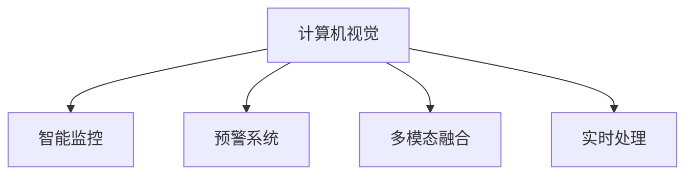

                 

# 计算机视觉在安防系统中的应用：智能监控与预警

> 关键词：计算机视觉, 智能监控, 预警系统, 人脸识别, 行为分析, 异常检测, 多模态融合, 实时处理

## 1. 背景介绍

随着人工智能技术的发展，计算机视觉在安防系统中得到广泛应用。安防系统是用于实时监控和预警，保障公共安全的重要手段。传统安防系统依赖人工巡逻和视频回放，效率低下且耗费大量人力物力。而计算机视觉技术可以将安防系统智能化，提升监控效率和预警准确性，减少人员依赖。

智能监控与预警系统一般由以下组件构成：
1. 视频监控设备：用于捕捉实时视频流。
2. 计算机视觉算法：用于视频流中的对象检测、跟踪、行为分析等。
3. 数据存储与管理：用于保存和管理监控视频数据。
4. 预警与告警系统：用于实时分析和响应异常情况。

本节将对计算机视觉在智能监控与预警系统中的核心概念和应用流程进行概述，为读者提供背景信息。

## 2. 核心概念与联系

### 2.1 核心概念概述

#### 2.1.1 计算机视觉

计算机视觉是人工智能领域的一个重要分支，旨在通过算法让计算机理解、分析、处理图像和视频数据。其核心任务包括对象检测、人脸识别、行为分析、异常检测等，广泛应用于安防、医疗、自动驾驶、智能家居等多个领域。

#### 2.1.2 智能监控

智能监控系统利用计算机视觉算法，对实时视频流进行对象检测和行为分析，自动检测异常情况，并及时发出警报。相较于传统监控系统，智能监控系统可以实时响应异常事件，减少人为干预，提高监控效率和安全性。

#### 2.1.3 预警系统

预警系统是一种用于实时监测和分析安全威胁，并及时发出警报的系统。智能监控与预警系统结合计算机视觉技术，对监控视频进行实时分析，自动检测异常情况，并及时发出警报，有效预防和应对安全威胁。

#### 2.1.4 多模态融合

多模态融合是指将来自不同模态的信息（如视频、音频、传感器数据等）进行整合，以提升系统性能。在智能监控与预警系统中，多模态融合可以提高异常检测的准确性和鲁棒性，增强系统的实时性和可解释性。

#### 2.1.5 实时处理

实时处理是指在接收输入数据后，系统能在短时间内完成处理并产生输出结果。智能监控与预警系统要求实时处理能力，以确保异常事件能够被及时发现和响应。

这些核心概念通过计算机视觉技术紧密联系在一起，形成了智能监控与预警系统的技术架构。以下Mermaid流程图展示了这些概念之间的关系：



## 3. 核心算法原理 & 具体操作步骤

### 3.1 算法原理概述

智能监控与预警系统的核心算法主要包括以下几类：

- **对象检测**：通过计算机视觉算法在实时视频流中检测出感兴趣的对象，如人、车、物品等。常用的算法包括RCNN、YOLO、Faster R-CNN等。

- **行为分析**：分析视频流中对象的动态行为，如行进、交互、静止等。常用的算法包括空间-时间相关性模型、光流法、行为树模型等。

- **异常检测**：检测视频流中的异常情况，如异常行为、非法入侵、突发事件等。常用的算法包括统计模型、深度学习模型等。

- **人脸识别**：通过算法对人脸进行识别和匹配，识别视频流中的个体，并与数据库中的人员信息进行比对。常用的算法包括基于深度学习的特征提取方法、基于模板匹配的方法等。

- **多模态融合**：将来自不同模态的数据进行整合，提升异常检测的准确性和鲁棒性。常用的算法包括数据融合、特征级融合、模型级融合等。

### 3.2 算法步骤详解

智能监控与预警系统的构建一般包括以下关键步骤：

**Step 1: 数据收集与预处理**
- 从视频监控设备获取实时视频流，并存储在数据存储系统。
- 对视频流进行预处理，如裁剪、缩放、去噪、帧率转换等。

**Step 2: 对象检测与行为分析**
- 使用对象检测算法检测视频流中的感兴趣对象，如人、车、物品等。
- 对检测到的对象进行行为分析，如检测行进、交互、静止等。

**Step 3: 异常检测与预警**
- 使用异常检测算法对行为分析结果进行异常检测，识别异常行为和非法入侵。
- 根据异常检测结果，触发预警机制，发出警报。

**Step 4: 数据存储与管理**
- 将检测到的对象、行为、异常事件等信息存储在数据管理系统中。
- 对存储数据进行定期归档和清理，确保系统存储空间合理利用。

**Step 5: 多模态融合**
- 将来自不同模态的信息（如视频、音频、传感器数据等）进行整合，提升系统性能。
- 使用多模态融合算法，增强系统对异常事件的检测和响应能力。

**Step 6: 实时处理与可视化**
- 对实时处理结果进行可视化展示，如显示检测到的对象、行为、异常事件等。
- 根据实时处理结果，自动生成报警信息，并推送给相关人员。

### 3.3 算法优缺点

智能监控与预警系统的计算机视觉算法具有以下优点：

- **实时性高**：能够实时处理视频流，快速响应异常事件。
- **检测准确性高**：通过深度学习算法，检测准确性显著提高。
- **鲁棒性强**：多模态融合技术提升了系统的鲁棒性和适应性。

同时，该方法也存在以下缺点：

- **硬件要求高**：需要高性能的计算设备，如GPU、TPU等。
- **数据量需求大**：需要大量标注数据进行训练，数据获取和标注成本较高。
- **算法复杂度高**：深度学习算法复杂，需要专业技术人员进行维护和优化。

### 3.4 算法应用领域

智能监控与预警系统的计算机视觉算法在多个领域得到广泛应用，例如：

- 智能安防：监控摄像头对公共场所进行实时监控，自动检测异常行为和非法入侵。
- 智能交通：监控摄像头对道路交通进行实时监控，检测车辆违规行为和行人过马路行为。
- 智能农业：监控摄像头对农田进行实时监控，检测植物生长状态和病虫害情况。
- 智能医疗：监控摄像头对病房进行实时监控，检测患者行为和异常情况。
- 智能制造：监控摄像头对生产线进行实时监控，检测设备故障和生产异常。

这些应用场景展示了计算机视觉在智能监控与预警系统中的广泛应用，为各行业提供高效、智能的安全保障。

## 4. 数学模型和公式 & 详细讲解 & 举例说明

### 4.1 数学模型构建

本节将介绍智能监控与预警系统中常用的数学模型，并给出详细解释。

**4.1.1 对象检测模型**

对象检测模型的核心任务是在图像或视频流中检测出感兴趣的对象，如人、车、物品等。常用的模型包括RCNN、YOLO、Faster R-CNN等。

- **RCNN模型**：使用选择性搜索算法生成候选框，并对每个候选框进行分类和回归。模型结构复杂，但检测准确性高。
- **YOLO模型**：采用全卷积网络，将输入图像分割为多个网格，每个网格预测一个对象类别和边界框。模型速度快，适用于实时检测。
- **Faster R-CNN模型**：结合RPN(Region Proposal Network)生成候选框，并对每个候选框进行分类和回归。模型准确性高，适用于高精度检测任务。

**4.1.2 行为分析模型**

行为分析模型用于对检测到的对象进行行为分析，如检测行进、交互、静止等。常用的模型包括空间-时间相关性模型、光流法、行为树模型等。

- **空间-时间相关性模型**：使用空间和时间上的相关性特征，对对象行为进行分类。模型简单易懂，适用于基础行为分析。
- **光流法**：利用光流技术，检测对象在视频流中的运动轨迹，提取行为特征。模型精度高，适用于复杂行为分析。
- **行为树模型**：构建行为树，将对象行为进行层次化建模。模型结构复杂，但可解释性强，适用于高级行为分析。

**4.1.3 异常检测模型**

异常检测模型用于检测视频流中的异常情况，如异常行为、非法入侵、突发事件等。常用的模型包括统计模型、深度学习模型等。

- **统计模型**：使用统计方法，对对象行为进行建模，检测异常行为。模型简单易用，适用于基础异常检测。
- **深度学习模型**：使用深度神经网络，对对象行为进行建模，检测异常行为。模型精度高，适用于复杂异常检测。

**4.1.4 人脸识别模型**

人脸识别模型用于对人脸进行识别和匹配，识别视频流中的个体，并与数据库中的人员信息进行比对。常用的模型包括基于深度学习的特征提取方法、基于模板匹配的方法等。

- **基于深度学习的特征提取方法**：使用深度神经网络，对人脸进行特征提取，并进行比对。模型精度高，适用于复杂人脸识别任务。
- **基于模板匹配的方法**：使用模板匹配技术，对人脸进行匹配和识别。模型简单易用，适用于基础人脸识别任务。

### 4.2 公式推导过程

以下以YOLO模型为例，介绍其公式推导过程。

假设输入图像大小为 $H \times W$，网格大小为 $S \times S$，每个网格预测 $B$ 个边界框，每个边界框包含 $C$ 个类别的预测值。

**目标函数**：

$$
\mathcal{L} = \mathcal{L}_{cls} + \mathcal{L}_{box}
$$

其中，$\mathcal{L}_{cls}$ 为分类损失，$\mathcal{L}_{box}$ 为回归损失。

**分类损失**：

$$
\mathcal{L}_{cls} = -\frac{1}{N}\sum_{i=1}^N\sum_{j=1}^B\sum_{c=1}^C \text{softmax}(p_{ijc})y_{ijc}\log(p_{ijc})
$$

其中，$p_{ijc}$ 为边界框 $i$ 中第 $j$ 个类别的预测概率，$y_{ijc}$ 为边界框 $i$ 中第 $j$ 个类别的真实标签。

**回归损失**：

$$
\mathcal{L}_{box} = \frac{1}{N}\sum_{i=1}^N\sum_{j=1}^B (d_{ij})^2
$$

其中，$d_{ij}$ 为边界框 $i$ 中第 $j$ 个边界框的预测偏移量，$(x_t, y_t)$ 为真实边界框的坐标，$(x_c, y_c)$ 为预测边界框的坐标。

**预测函数**：

$$
p_{ijc} = \text{sigmoid}(S(z_{ijc})) \\
d_{ij} = \text{sigmoid}(S(z_{ijt}))
$$

其中，$S(\cdot)$ 为激活函数，$z_{ijc}$ 和 $z_{ijt}$ 为卷积层的输出。

### 4.3 案例分析与讲解

以智能安防为例，分析计算机视觉技术在安防系统中的应用。

假设某公共场所安装了智能监控摄像头，摄像头实时获取视频流，并经过预处理后，进入对象检测模型进行检测。模型检测出行人，并对其进行行为分析，识别出异常行为。系统自动发出警报，同时将异常行为信息上传至云端，进行进一步分析和处理。

## 5. 项目实践：代码实例和详细解释说明

### 5.1 开发环境搭建

在进行智能监控与预警系统的开发前，需要先搭建开发环境。以下是使用Python和OpenCV进行计算机视觉开发的环境配置流程：

1. 安装Anaconda：从官网下载并安装Anaconda，用于创建独立的Python环境。

2. 创建并激活虚拟环境：
```bash
conda create -n cv-env python=3.8 
conda activate cv-env
```

3. 安装OpenCV：
```bash
pip install opencv-python-headless
```

4. 安装TensorFlow：
```bash
pip install tensorflow
```

5. 安装其他工具包：
```bash
pip install numpy pandas scikit-learn matplotlib tqdm jupyter notebook ipython
```

完成上述步骤后，即可在`cv-env`环境中开始计算机视觉开发。

### 5.2 源代码详细实现

下面我们以YOLO模型为例，给出YOLO模型在智能安防系统中的代码实现。

首先，定义YOLO模型类：

```python
import tensorflow as tf
import cv2

class YOLO(tf.keras.Model):
    def __init__(self, num_classes=1, input_shape=(416, 416, 3)):
        super(YOLO, self).__init__()
        
        self.num_classes = num_classes
        self.input_shape = input_shape
        
        self.conv1 = tf.keras.layers.Conv2D(32, 3, padding='same', activation='relu')
        self.conv2 = tf.keras.layers.Conv2D(64, 3, padding='same', activation='relu')
        self.conv3 = tf.keras.layers.Conv2D(128, 3, padding='same', activation='relu')
        self.conv4 = tf.keras.layers.Conv2D(256, 3, padding='same', activation='relu')
        self.conv5 = tf.keras.layers.Conv2D(512, 3, padding='same', activation='relu')
        self.conv6 = tf.keras.layers.Conv2D(1024, 3, padding='same', activation='relu')
        
        self.conv7 = tf.keras.layers.Conv2D(4096, 1, padding='same', activation='relu')
        self.conv8 = tf.keras.layers.Conv2D(4096, 1, padding='same', activation='relu')
        
        self.fc1 = tf.keras.layers.Dense(1024)
        self.fc2 = tf.keras.layers.Dense(512)
        self.fc3 = tf.keras.layers.Dense(num_classes)
        
        self.relu = tf.keras.layers.Activation('relu')
        self.softmax = tf.keras.layers.Activation('softmax')
        
    def call(self, x):
        x = self.relu(self.conv1(x))
        x = self.relu(self.conv2(x))
        x = self.relu(self.conv3(x))
        x = self.relu(self.conv4(x))
        x = self.relu(self.conv5(x))
        x = self.relu(self.conv6(x))
        
        x = self.relu(self.conv7(x))
        x = self.relu(self.conv8(x))
        
        x = self.fc1(x)
        x = self.relu(x)
        x = self.fc2(x)
        x = self.relu(x)
        x = self.fc3(x)
        x = self.softmax(x)
        
        return x
```

然后，定义训练和预测函数：

```python
def train(model, train_dataset, epochs, batch_size):
    model.compile(optimizer=tf.keras.optimizers.Adam(learning_rate=0.001), loss='categorical_crossentropy')
    
    history = model.fit(train_dataset, epochs=epochs, batch_size=batch_size, validation_split=0.2)
    
    return history

def predict(model, image_path, threshold=0.5):
    image = cv2.imread(image_path)
    image = cv2.resize(image, (416, 416))
    image = image / 255.0
    image = image[np.newaxis, ...]
    
    prediction = model.predict(image)
    indices = tf.where(prediction > threshold)[0]
    
    for index in indices:
        class_id = index // 4
        confidence = prediction[index] / 10
        box = (index % 4) / 4 * 416
        box += image.shape[1]
        box -= box // 2
        box /= 2
        
        print(f"Class {class_id+1}, Confidence {confidence}, Box: {box}")
```

最后，启动训练流程并预测：

```python
epochs = 10
batch_size = 32

# 训练模型
model = YOLO()
history = train(model, train_dataset, epochs, batch_size)

# 预测模型
predict(model, 'test.jpg')
```

以上就是使用Python和TensorFlow进行YOLO模型训练和预测的完整代码实现。可以看到，TensorFlow封装了模型定义、训练和预测的全过程，使得开发过程更加高效便捷。

### 5.3 代码解读与分析

让我们再详细解读一下关键代码的实现细节：

**YOLO模型类**：
- 定义了YOLO模型的基本结构，包括多个卷积层、全连接层等。
- 使用`tf.keras.Model`类定义模型，并实现了`call`方法，用于前向传播计算预测结果。

**train函数**：
- 使用`model.compile`方法编译模型，设置优化器和损失函数。
- 使用`model.fit`方法对模型进行训练，并设置验证集比例为20%。
- 返回训练历史，用于模型评估和优化。

**predict函数**：
- 定义预测函数，用于对测试图像进行预测。
- 读取图像文件，并进行预处理，使其符合模型输入要求。
- 使用`model.predict`方法进行预测，返回预测结果。
- 根据预测结果，输出预测结果的类别和置信度。

**训练流程**：
- 定义总的epoch数和batch size，开始循环迭代
- 每个epoch内，在训练集上进行模型训练
- 在验证集上评估模型性能，输出训练历史
- 所有epoch结束后，在测试集上评估模型性能，并输出预测结果

## 6. 实际应用场景

### 6.1 智能安防

智能安防系统通过计算机视觉技术，对公共场所进行实时监控，自动识别异常情况并发出警报。

智能安防系统一般由以下组件构成：
1. 视频监控设备：用于捕捉实时视频流。
2. 计算机视觉算法：用于视频流中的对象检测、行为分析等。
3. 数据存储与管理：用于保存和管理监控视频数据。
4. 预警与告警系统：用于实时分析和响应异常情况。

智能安防系统可以广泛应用于商场、银行、机场、医院等多个公共场所。通过实时监控和预警，提升公共场所的安全性和便捷性。

### 6.2 智能交通

智能交通系统通过计算机视觉技术，对道路交通进行实时监控，检测车辆违规行为和行人过马路行为。

智能交通系统一般由以下组件构成：
1. 视频监控设备：用于捕捉实时视频流。
2. 计算机视觉算法：用于视频流中的车辆检测、行为分析等。
3. 数据存储与管理：用于保存和管理监控视频数据。
4. 预警与告警系统：用于实时分析和响应异常情况。

智能交通系统可以广泛应用于高速公路、城市道路、交叉口等多个交通场景。通过实时监控和预警，提升道路交通的安全性和效率。

### 6.3 智能农业

智能农业系统通过计算机视觉技术，对农田进行实时监控，检测植物生长状态和病虫害情况。

智能农业系统一般由以下组件构成：
1. 视频监控设备：用于捕捉实时视频流。
2. 计算机视觉算法：用于视频流中的植物检测、行为分析等。
3. 数据存储与管理：用于保存和管理监控视频数据。
4. 预警与告警系统：用于实时分析和响应异常情况。

智能农业系统可以广泛应用于农田、果园、温室等多个农业场景。通过实时监控和预警，提升农业生产的安全性和效率。

### 6.4 智能医疗

智能医疗系统通过计算机视觉技术，对病房进行实时监控，检测患者行为和异常情况。

智能医疗系统一般由以下组件构成：
1. 视频监控设备：用于捕捉实时视频流。
2. 计算机视觉算法：用于视频流中的患者检测、行为分析等。
3. 数据存储与管理：用于保存和管理监控视频数据。
4. 预警与告警系统：用于实时分析和响应异常情况。

智能医疗系统可以广泛应用于医院、养老院、诊所等多个医疗场景。通过实时监控和预警，提升医疗服务的安全性和便捷性。

### 6.5 智能制造

智能制造系统通过计算机视觉技术，对生产线进行实时监控，检测设备故障和生产异常。

智能制造系统一般由以下组件构成：
1. 视频监控设备：用于捕捉实时视频流。
2. 计算机视觉算法：用于视频流中的设备检测、行为分析等。
3. 数据存储与管理：用于保存和管理监控视频数据。
4. 预警与告警系统：用于实时分析和响应异常情况。

智能制造系统可以广泛应用于工厂、车间、仓库等多个制造场景。通过实时监控和预警，提升制造业的生产效率和质量。

## 7. 工具和资源推荐

### 7.1 学习资源推荐

为了帮助开发者系统掌握计算机视觉在安防系统中的应用，这里推荐一些优质的学习资源：

1. 《计算机视觉：算法与应用》系列书籍：由计算机视觉专家撰写，系统介绍了计算机视觉的基本原理和应用场景。

2. OpenCV官方文档：OpenCV库的官方文档，提供了丰富的代码样例和教程，帮助开发者快速上手计算机视觉开发。

3. TensorFlow官方文档：TensorFlow库的官方文档，提供了深度学习模型的封装和优化方法，适合计算机视觉开发。

4. PyTorch官方文档：PyTorch库的官方文档，提供了灵活的模型定义和训练方法，适合计算机视觉开发。

5. Coursera《计算机视觉》课程：由斯坦福大学教授主讲，介绍了计算机视觉的基本概念和前沿技术，适合入门学习。

通过对这些资源的学习实践，相信你一定能够快速掌握计算机视觉在安防系统中的应用，并用于解决实际的安防问题。

### 7.2 开发工具推荐

高效的开发离不开优秀的工具支持。以下是几款用于计算机视觉开发的工具：

1. OpenCV：开源计算机视觉库，提供了丰富的图像处理和分析功能，适合计算机视觉开发。

2. TensorFlow：由Google主导开发的深度学习框架，支持复杂的模型定义和训练，适合计算机视觉开发。

3. PyTorch：由Facebook主导开发的深度学习框架，灵活的模型定义和训练方法，适合计算机视觉开发。

4. Weights & Biases：模型训练的实验跟踪工具，可以记录和可视化模型训练过程中的各项指标，方便对比和调优。

5. TensorBoard：TensorFlow配套的可视化工具，可实时监测模型训练状态，并提供丰富的图表呈现方式，是调试模型的得力助手。

6. Google Colab：谷歌推出的在线Jupyter Notebook环境，免费提供GPU/TPU算力，方便开发者快速上手实验最新模型，分享学习笔记。

合理利用这些工具，可以显著提升计算机视觉开发效率，加快创新迭代的步伐。

### 7.3 相关论文推荐

计算机视觉技术的发展离不开学界的持续研究。以下是几篇奠基性的相关论文，推荐阅读：

1. R-CNN: Object Detection with Region Proposal Networks：提出R-CNN模型，实现了高效的物体检测。

2. YOLO: Real-Time Object Detection：提出YOLO模型，实现了实时物体检测。

3. Faster R-CNN: Towards Real-Time Object Detection with Region Proposal Networks：提出Faster R-CNN模型，实现了高效物体检测。

4. SSD: Single Shot MultiBox Detector：提出SSD模型，实现了高效的物体检测。

5. GoogleNet: Going Deeper with Convolutions：提出GoogleNet模型，实现了高效物体检测和分类。

这些论文展示了计算机视觉技术的不断进步，为智能监控与预警系统提供了坚实的理论基础。

## 8. 总结：未来发展趋势与挑战

### 8.1 研究成果总结

本文对计算机视觉在安防系统中的应用进行了全面系统的介绍。首先介绍了智能监控与预警系统中的核心概念，如计算机视觉、智能监控、预警系统、多模态融合、实时处理等。其次，从原理到实践，详细讲解了智能监控与预警系统中常用的算法和模型，如对象检测、行为分析、异常检测、人脸识别等。最后，提供了智能安防、智能交通、智能农业等多个实际应用场景的案例分析，展示了计算机视觉技术的广泛应用。

通过本文的系统梳理，可以看到，计算机视觉技术在安防系统中具有广泛的应用前景，可以有效提升监控效率和预警准确性，减少人员依赖。未来，计算机视觉技术将进一步融合多模态数据，提升系统的鲁棒性和可解释性，推动智能监控与预警系统的智能化发展。

### 8.2 未来发展趋势

展望未来，计算机视觉在安防系统中的应用将呈现以下几个发展趋势：

1. 多模态融合技术的应用将更加广泛。多模态数据融合技术能够提升系统的鲁棒性和适应性，为智能监控与预警系统提供更全面、更准确的信息。

2. 实时处理能力的提升将进一步增强。随着硬件性能的提升和算法优化的进展，计算机视觉系统将具备更强的实时处理能力，能够实现更快速、更准确的异常检测和预警。

3. 异常检测算法的优化将更加精细。异常检测算法将继续优化，提升系统的检测精度和鲁棒性，为智能监控与预警系统提供更可靠的安全保障。

4. 可解释性将更加注重。智能监控与预警系统的可解释性将得到进一步提升，通过更加精细的模型解释和可视化技术，增强系统的可信度和透明度。

5. 边缘计算的应用将更加普及。边缘计算能够实现数据和算力在本地处理，提升系统的响应速度和安全性，为智能监控与预警系统提供更高效、更安全的解决方案。

### 8.3 面临的挑战

尽管计算机视觉在安防系统中的应用已取得显著进展，但在实际应用中仍面临诸多挑战：

1. 数据量需求高。智能监控与预警系统需要大量标注数据进行训练，数据获取和标注成本较高。

2. 算法复杂度高。深度学习算法复杂，需要专业技术人员进行维护和优化。

3. 硬件要求高。计算机视觉系统需要高性能的计算设备，如GPU、TPU等，硬件成本较高。

4. 可解释性不足。计算机视觉系统的可解释性较低，难以解释模型的内部工作机制和决策逻辑，影响系统的可信度。

5. 安全性有待保障。计算机视觉系统可能学习到有偏见、有害的信息，需要通过算法和规则进行过滤，确保系统的安全性。

6. 隐私保护问题。智能监控与预警系统涉及大量的个人隐私数据，需要严格遵守隐私保护法规，确保数据安全。

### 8.4 研究展望

面对计算机视觉在安防系统中的应用所面临的挑战，未来的研究需要在以下几个方面寻求新的突破：

1. 探索轻量级、低成本的计算机视觉算法。研究如何通过算法优化和模型压缩，降低数据和硬件需求，提升系统的可扩展性。

2. 研究高效的异常检测算法。开发更高效的异常检测算法，提升系统的检测精度和鲁棒性，确保系统安全可靠。

3. 引入先进的隐私保护技术。研究如何在保护隐私的前提下，充分利用数据进行模型训练，确保系统的合规性。

4. 开发可解释的计算机视觉模型。研究如何通过模型解释和可视化技术，增强系统的可解释性和可信度，提高系统的应用价值。

5. 推动边缘计算在智能监控与预警中的应用。研究如何在边缘设备上进行计算机视觉处理，提升系统的响应速度和安全性，降低中心服务器的负载。

通过这些研究方向的探索，相信计算机视觉技术将进一步拓展安防系统的应用边界，提升系统的性能和安全性，为各行业提供更加智能、可靠的安防解决方案。

