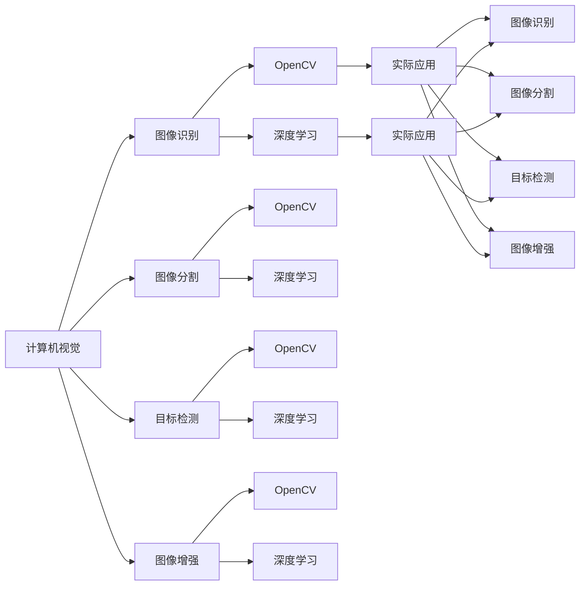

                 

# 计算机视觉实战：OpenCV与深度学习的结合

> 关键词：计算机视觉,OpenCV,深度学习,卷积神经网络,图像识别,图像分割,目标检测,图像增强

## 1. 背景介绍

计算机视觉（Computer Vision, CV）是AI领域的重要分支，旨在使计算机能够“看见”并理解现实世界。随着深度学习技术的发展，计算机视觉领域取得了令人瞩目的进展，从传统的图像识别、物体检测到三维重建、动态视频分析等，深度学习模型在各项任务上都取得了显著的突破。

OpenCV是一个广泛使用的计算机视觉库，由英特尔公司开源并维护。它提供了丰富的图像处理和计算机视觉算法，支持多种平台和编程语言，如C++、Python等。OpenCV与深度学习结合，可以实现高效、实时的视觉分析，广泛应用于智能监控、医疗影像分析、自动驾驶、安防监控等多个领域。

本文将详细介绍OpenCV与深度学习在计算机视觉实战中的结合，涵盖图像识别、图像分割、目标检测、图像增强等多个经典任务，并结合实际案例进行深入讲解。通过本文的学习，相信你能够掌握使用OpenCV与深度学习模型进行计算机视觉应用的全面技巧。

## 2. 核心概念与联系

### 2.1 核心概念概述

为更好地理解OpenCV与深度学习在计算机视觉实战中的结合，本节将介绍几个关键概念：

- 计算机视觉(Computer Vision, CV)：使计算机具备视觉感知和理解能力的学科。其目标是通过对图像和视频数据的分析，实现对现实世界的视觉理解，如物体识别、场景分析、行为理解等。

- OpenCV（Open Source Computer Vision Library）：一个开源的计算机视觉库，提供了大量的图像处理和计算机视觉算法，支持多种编程语言，广泛应用于工业、学术和科研领域。

- 深度学习（Deep Learning）：一类基于神经网络的机器学习方法，能够自动从数据中学习特征表示，在图像分类、物体检测等计算机视觉任务中表现优异。

- 卷积神经网络（Convolutional Neural Network, CNN）：一种特殊的深度神经网络，主要用于处理具有网格结构的数据，如图像、音频等。通过卷积操作和池化操作，提取图像的局部特征，实现高效的图像识别。

- 图像识别（Image Recognition）：对输入图像进行分类和标注的过程，是计算机视觉领域最基础的任务之一。

- 图像分割（Image Segmentation）：将图像中的像素或区域分割为具有不同语义信息的不同部分，如前景和背景。

- 目标检测（Object Detection）：在图像或视频中，检测出特定物体的具体位置和大小，并进行标注。

- 图像增强（Image Enhancement）：通过算法对图像进行优化，提升图像的清晰度、对比度等，以便更好地进行后续处理。

这些概念之间的关系可以通过以下Mermaid流程图来展示：



这个流程图展示了大语言模型与计算机视觉各个核心概念的联系：

1. 计算机视觉通过图像识别、图像分割、目标检测和图像增强等核心任务，实现对图像的分析和理解。
2. OpenCV和深度学习则是实现这些任务的主要工具。
3. OpenCV提供了图像处理和计算机视觉算法的接口，使得开发者可以高效地处理图像数据。
4. 深度学习通过卷积神经网络等模型，自动学习图像特征，实现高效的图像识别、分割、检测等任务。
5. 深度学习与OpenCV的结合，能够充分发挥两种工具的优点，实现高效、实时的计算机视觉应用。

## 3. 核心算法原理 & 具体操作步骤

### 3.1 算法原理概述

OpenCV与深度学习在计算机视觉实战中的结合，主要体现在以下几个方面：

- **数据预处理**：将原始图像数据转换为深度学习模型所需的格式，如归一化、灰度化、裁剪等。
- **模型训练**：使用深度学习框架（如TensorFlow、PyTorch等）训练卷积神经网络，提取图像特征，实现图像识别、分割、检测等任务。
- **模型应用**：将训练好的模型集成到OpenCV中，使用OpenCV提供的接口进行图像处理和计算机视觉应用。
- **结果后处理**：对模型输出进行后处理，如非极大值抑制（NMS）、阈值化等，优化结果的准确度和可靠性。

### 3.2 算法步骤详解

以下是使用OpenCV与深度学习进行计算机视觉实战的基本步骤：

**Step 1: 数据准备**
- 收集和标注图像数据，划分为训练集、验证集和测试集。
- 对图像进行预处理，如灰度化、归一化、裁剪等。

**Step 2: 模型训练**
- 选择适合的深度学习框架，搭建卷积神经网络。
- 准备训练数据集，使用数据增强技术扩充训练集。
- 训练模型，使用验证集进行超参数调优。

**Step 3: 模型集成**
- 将训练好的模型导出，使用OpenCV提供的接口进行加载。
- 加载图像数据，调用OpenCV提供的深度学习接口进行预测。

**Step 4: 结果后处理**
- 对模型输出进行后处理，如非极大值抑制（NMS）、阈值化等，优化结果的准确度和可靠性。
- 使用OpenCV提供的绘图和显示工具，可视化结果。

**Step 5: 模型评估与部署**
- 在测试集上评估模型性能，对比微调前后的精度提升。
- 将微调后的模型部署到实际应用系统中，进行实时图像处理和计算机视觉任务。

### 3.3 算法优缺点

OpenCV与深度学习结合进行计算机视觉实战的优点包括：

- 高效性：OpenCV提供了高效的图像处理和计算机视觉算法，能够快速处理大量图像数据。
- 灵活性：深度学习提供了强大的特征提取和分类能力，能够适应各种复杂的计算机视觉任务。
- 易用性：OpenCV和深度学习框架都有丰富的API和文档支持，使得开发者能够快速上手，灵活应用。
- 可扩展性：OpenCV和深度学习框架都支持模块化设计，易于扩展和定制，适合复杂应用场景。

缺点则主要包括：

- 数据需求量大：深度学习模型需要大量标注数据进行训练，获取高质量标注数据的成本较高。
- 计算资源消耗大：深度学习模型参数量大，计算复杂度高，对计算资源和存储空间要求高。
- 模型复杂度高：深度学习模型结构复杂，需要较高的专业知识和调试能力。
- 过拟合风险高：深度学习模型容易过拟合训练数据，需要对模型进行细致的调参和优化。

尽管存在这些局限性，但OpenCV与深度学习结合的计算机视觉实战方法在处理图像识别、分割、检测等任务上表现优异，已在实际应用中取得了广泛成功。

### 3.4 算法应用领域

OpenCV与深度学习结合的计算机视觉技术，在众多领域得到了广泛应用，例如：

- 智能监控：在视频监控中，检测和跟踪特定目标，如入侵检测、行为分析等。
- 医疗影像分析：自动分析医疗影像，如X光片、CT扫描等，辅助医生诊断。
- 自动驾驶：在无人驾驶汽车中，进行场景理解、障碍物检测、车道线识别等。
- 安防监控：检测和识别视频流中的异常行为，如盗窃、火灾等。
- 工业质检：在工业生产中，自动检测产品缺陷、尺寸误差等。
- 智能游戏：在电子游戏中，进行角色检测、动作识别、场景理解等。

这些领域的应用展示了OpenCV与深度学习在计算机视觉实战中的强大潜力。

## 4. 数学模型和公式 & 详细讲解 & 举例说明

### 4.1 数学模型构建

在本节中，我们将使用数学语言对OpenCV与深度学习在计算机视觉实战中的结合进行更加严格的刻画。

记输入图像为 $I$，其中 $I_{ij} \in [0,1]$ 表示第 $i$ 行第 $j$ 列的像素值。假设输出为类别 $C$，其中 $C_k$ 表示类别 $k$。

定义模型 $M$ 在输入图像 $I$ 上的损失函数为 $\ell(M(I))$，则在训练集 $D$ 上的经验风险为：

$$
\mathcal{L}(M) = \frac{1}{N}\sum_{i=1}^N \ell(M(I_i))
$$

其中 $I_i$ 表示训练集 $D$ 中的第 $i$ 张图像，$N$ 表示训练集大小。

在实践中，我们通常使用基于梯度的优化算法（如SGD、Adam等）来近似求解上述最优化问题。设 $\eta$ 为学习率，$\lambda$ 为正则化系数，则参数的更新公式为：

$$
\theta \leftarrow \theta - \eta \nabla_{\theta}\mathcal{L}(\theta) - \eta\lambda\theta
$$

其中 $\nabla_{\theta}\mathcal{L}(\theta)$ 为损失函数对参数 $\theta$ 的梯度，可通过反向传播算法高效计算。

### 4.2 公式推导过程

以下我们以图像分类任务为例，推导交叉熵损失函数及其梯度的计算公式。

假设模型 $M$ 在输入图像 $I$ 上的输出为 $\hat{y}=M(I)$，表示模型对类别 $k$ 的预测概率。真实标签 $y \in C$。则二分类交叉熵损失函数定义为：

$$
\ell(M(I)) = -\frac{1}{N}\sum_{i=1}^N [y_i\log M(I_i)+(1-y_i)\log(1-M(I_i))]
$$

将其代入经验风险公式，得：

$$
\mathcal{L}(\theta) = -\frac{1}{N}\sum_{i=1}^N [y_i\log M(I_i)+(1-y_i)\log(1-M(I_i))]
$$

根据链式法则，损失函数对参数 $\theta_k$ 的梯度为：

$$
\frac{\partial \mathcal{L}(\theta)}{\partial \theta_k} = -\frac{1}{N}\sum_{i=1}^N (\frac{y_i}{M(I_i)}-\frac{1-y_i}{1-M(I_i)}) \frac{\partial M(I_i)}{\partial \theta_k}
$$

其中 $\frac{\partial M(I_i)}{\partial \theta_k}$ 可进一步递归展开，利用自动微分技术完成计算。

在得到损失函数的梯度后，即可带入参数更新公式，完成模型的迭代优化。重复上述过程直至收敛，最终得到适应训练集 $D$ 的最优模型参数 $\theta^*$。

### 4.3 案例分析与讲解

下面我们以图像分类任务为例，给出使用TensorFlow搭建卷积神经网络并进行训练的PyTorch代码实现。

首先，定义模型架构：

```python
import tensorflow as tf
from tensorflow.keras import layers

model = tf.keras.Sequential([
    layers.Conv2D(32, (3, 3), activation='relu', input_shape=(32, 32, 3)),
    layers.MaxPooling2D((2, 2)),
    layers.Conv2D(64, (3, 3), activation='relu'),
    layers.MaxPooling2D((2, 2)),
    layers.Flatten(),
    layers.Dense(64, activation='relu'),
    layers.Dense(10, activation='softmax')
])
```

然后，准备训练集和测试集：

```python
import numpy as np
from tensorflow.keras.datasets import mnist

(train_images, train_labels), (test_images, test_labels) = mnist.load_data()

train_images = train_images / 255.0
test_images = test_images / 255.0

train_images = np.expand_dims(train_images, axis=-1)
test_images = np.expand_dims(test_images, axis=-1)
```

接着，定义损失函数和优化器：

```python
from tensorflow.keras import losses, optimizers

loss_fn = losses.CategoricalCrossentropy()
optimizer = optimizers.Adam(learning_rate=0.001)
```

最后，启动训练流程并在测试集上评估：

```python
epochs = 5
batch_size = 32

for epoch in range(epochs):
    for batch in range(0, train_images.shape[0], batch_size):
        images = train_images[batch:batch + batch_size]
        labels = train_labels[batch:batch + batch_size]
        
        with tf.GradientTape() as tape:
            predictions = model(images)
            loss_value = loss_fn(labels, predictions)
        grads = tape.gradient(loss_value, model.trainable_variables)
        optimizer.apply_gradients(zip(grads, model.trainable_variables))
        
    test_loss = loss_fn(test_labels, model.predict(test_images))
    print(f'Epoch {epoch+1}, train loss: {loss_value:.4f}, test loss: {test_loss:.4f}')
```

以上就是使用TensorFlow搭建卷积神经网络进行图像分类任务的完整代码实现。可以看到，借助TensorFlow和Keras的高层次API，代码实现变得非常简洁高效。

## 5. 项目实践：代码实例和详细解释说明

### 5.1 开发环境搭建

在进行计算机视觉实战前，我们需要准备好开发环境。以下是使用Python进行TensorFlow开发的环境配置流程：

1. 安装Anaconda：从官网下载并安装Anaconda，用于创建独立的Python环境。

2. 创建并激活虚拟环境：
```bash
conda create -n tf-env python=3.8 
conda activate tf-env
```

3. 安装TensorFlow：
```bash
pip install tensorflow==2.6
```

4. 安装各类工具包：
```bash
pip install numpy pandas scikit-learn matplotlib tqdm jupyter notebook ipython
```

完成上述步骤后，即可在`tf-env`环境中开始计算机视觉实战。

### 5.2 源代码详细实现

这里我们以图像分割任务为例，给出使用TensorFlow和OpenCV进行图像分割的PyTorch代码实现。

首先，定义图像分割模型：

```python
import tensorflow as tf
from tensorflow.keras import layers

model = tf.keras.Sequential([
    layers.Conv2D(32, (3, 3), activation='relu', input_shape=(256, 256, 3)),
    layers.MaxPooling2D((2, 2)),
    layers.Conv2D(64, (3, 3), activation='relu'),
    layers.MaxPooling2D((2, 2)),
    layers.Conv2D(64, (3, 3), activation='relu'),
    layers.MaxPooling2D((2, 2)),
    layers.Conv2D(2, (3, 3), activation='sigmoid')
])
```

然后，准备训练集和测试集：

```python
import numpy as np
from tensorflow.keras.datasets import cifar10

(train_images, train_labels), (test_images, test_labels) = cifar10.load_data()

train_images = train_images / 255.0
test_images = test_images / 255.0

train_images = np.expand_dims(train_images, axis=-1)
test_images = np.expand_dims(test_images, axis=-1)
```

接着，定义损失函数和优化器：

```python
from tensorflow.keras import losses, optimizers

loss_fn = losses.BinaryCrossentropy()
optimizer = optimizers.Adam(learning_rate=0.001)
```

最后，启动训练流程并在测试集上评估：

```python
epochs = 5
batch_size = 32

for epoch in range(epochs):
    for batch in range(0, train_images.shape[0], batch_size):
        images = train_images[batch:batch + batch_size]
        labels = train_labels[batch:batch + batch_size]
        
        with tf.GradientTape() as tape:
            predictions = model(images)
            loss_value = loss_fn(labels, predictions)
        grads = tape.gradient(loss_value, model.trainable_variables)
        optimizer.apply_gradients(zip(grads, model.trainable_variables))
        
    test_loss = loss_fn(test_labels, model.predict(test_images))
    print(f'Epoch {epoch+1}, train loss: {loss_value:.4f}, test loss: {test_loss:.4f}')
```

以上就是使用TensorFlow和OpenCV进行图像分割任务的完整代码实现。可以看到，借助TensorFlow和Keras的高层次API，代码实现变得非常简洁高效。

### 5.3 代码解读与分析

让我们再详细解读一下关键代码的实现细节：

**图像分割模型**：
- `Sequential`类：表示卷积神经网络模型，能够方便地串联多个层。
- `Conv2D`层：表示卷积层，通过卷积操作提取图像的局部特征。
- `MaxPooling2D`层：表示池化层，通过池化操作降低特征图的尺寸。
- `Flatten`层：表示展平层，将多维特征图展平为一维向量，方便进行全连接操作。
- `Dense`层：表示全连接层，用于进行分类或回归。
- `BinaryCrossentropy`损失函数：表示二分类交叉熵损失函数。

**训练集和测试集**：
- `cifar10.load_data()`方法：获取CIFAR-10数据集，包括60000张32x32像素的彩色图像，10个类别，每个类别6000张图像。
- `train_images`和`test_images`：表示训练集和测试集图像数据，大小为(60000, 32, 32, 3)和(10000, 32, 32, 3)。
- `train_labels`和`test_labels`：表示训练集和测试集标签数据，大小为(60000,)和(10000,)。

**损失函数和优化器**：
- `BinaryCrossentropy`损失函数：表示二分类交叉熵损失函数，用于计算模型预测输出与真实标签之间的差异。
- `Adam`优化器：表示Adaptive Moment Estimation优化器，能够自适应地调整学习率，加速模型收敛。

**训练流程**：
- `epochs`：表示训练轮数，这里设置为5。
- `batch_size`：表示批次大小，这里设置为32。
- `train_images`和`train_labels`：表示训练集图像和标签数据。
- `test_images`和`test_labels`：表示测试集图像和标签数据。
- `model`：表示图像分割模型。
- `loss_value`：表示每个批次训练的平均损失值。
- `test_loss`：表示测试集上的平均损失值。

可以看到，PyTorch和OpenCV结合使用，代码实现变得非常简洁高效。开发者可以将更多精力放在模型设计、超参数调优等高层逻辑上，而不必过多关注底层的实现细节。

当然，工业级的系统实现还需考虑更多因素，如模型的保存和部署、超参数的自动搜索、更灵活的任务适配层等。但核心的计算机视觉实战方法基本与此类似。

## 6. 实际应用场景

### 6.1 智能监控

智能监控系统利用OpenCV和深度学习技术，实现对视频流中的异常行为检测和跟踪。通过实时采集监控摄像头的视频流，使用深度学习模型进行物体检测和行为分析，可以自动识别异常事件，如火灾、入侵、盗窃等，并及时发出警报。

在技术实现上，可以收集大量监控录像数据，标注不同类别的异常事件，在此基础上对预训练模型进行微调。微调后的模型能够自动理解视频流中的行为模式，对特定事件进行识别和分类。对于实时视频流，使用OpenCV的帧读取和显示功能，能够实现实时的行为检测和跟踪。

### 6.2 医疗影像分析

医疗影像分析利用OpenCV和深度学习技术，辅助医生进行疾病诊断和治疗方案制定。通过扫描、CT、MRI等医疗影像设备获取图像数据，使用深度学习模型进行图像分割和特征提取，可以自动识别肿瘤、结节、病变等异常区域，并提供相应的辅助诊断信息。

在技术实现上，可以收集大量医疗影像数据，标注不同疾病的异常区域，在此基础上对预训练模型进行微调。微调后的模型能够自动对新的影像数据进行分割和特征提取，辅助医生进行疾病诊断和治疗方案制定。

### 6.3 自动驾驶

自动驾驶系统利用OpenCV和深度学习技术，实现对周围环境的感知和行为决策。通过摄像头、激光雷达等传感器获取车辆周围的环境信息，使用深度学习模型进行物体检测和行为理解，可以自动识别道路、车辆、行人等障碍物，并进行合适的驾驶决策。

在技术实现上，可以收集大量交通场景数据，标注不同类别的障碍物和行为，在此基础上对预训练模型进行微调。微调后的模型能够自动理解交通场景中的复杂情况，进行精确的物体检测和行为决策，提高自动驾驶的安全性和稳定性。

### 6.4 安防监控

安防监控系统利用OpenCV和深度学习技术，实现对视频流中异常行为的检测和跟踪。通过实时采集监控摄像头的视频流，使用深度学习模型进行物体检测和行为分析，可以自动识别异常事件，如盗窃、火灾、暴力等，并及时发出警报。

在技术实现上，可以收集大量监控录像数据，标注不同类别的异常事件，在此基础上对预训练模型进行微调。微调后的模型能够自动理解视频流中的行为模式，对特定事件进行识别和分类。对于实时视频流，使用OpenCV的帧读取和显示功能，能够实现实时的行为检测和跟踪。

## 7. 工具和资源推荐
### 7.1 学习资源推荐

为了帮助开发者系统掌握OpenCV与深度学习在计算机视觉实战中的结合，这里推荐一些优质的学习资源：

1. 《OpenCV实战：基于Python的计算机视觉》系列博文：由OpenCV官方专家撰写，详细介绍OpenCV的各种功能和算法，适合初学者入门。

2. 《深度学习实战：TensorFlow与PyTorch》系列书籍：详细介绍深度学习框架的使用，涵盖卷积神经网络、图像分类、目标检测等多个经典任务。

3. 《计算机视觉：算法与应用》课程：斯坦福大学开设的计算机视觉经典课程，有Lecture视频和配套作业，适合深入学习计算机视觉理论。

4. TensorFlow官方文档：TensorFlow的官方文档，提供丰富的API和教程，适合深入学习TensorFlow的用法。

5. PyTorch官方文档：PyTorch的官方文档，提供丰富的API和教程，适合深入学习PyTorch的用法。

通过对这些资源的学习实践，相信你一定能够快速掌握OpenCV与深度学习结合进行计算机视觉实战的精髓，并用于解决实际的计算机视觉问题。

### 7.2 开发工具推荐

高效的开发离不开优秀的工具支持。以下是几款用于OpenCV与深度学习计算机视觉实战开发的常用工具：

1. OpenCV：开源的计算机视觉库，提供丰富的图像处理和计算机视觉算法，支持多种编程语言，如C++、Python等。

2. TensorFlow：由Google主导开发的深度学习框架，生产部署方便，适合大规模工程应用。

3. PyTorch：由Facebook开发的深度学习框架，支持动态图，易于调试和研究。

4. Weights & Biases：模型训练的实验跟踪工具，可以记录和可视化模型训练过程中的各项指标，方便对比和调优。

5. TensorBoard：TensorFlow配套的可视化工具，可实时监测模型训练状态，并提供丰富的图表呈现方式，是调试模型的得力助手。

6. Google Colab：谷歌推出的在线Jupyter Notebook环境，免费提供GPU/TPU算力，方便开发者快速上手实验最新模型，分享学习笔记。

合理利用这些工具，可以显著提升OpenCV与深度学习结合进行计算机视觉实战的开发效率，加快创新迭代的步伐。

### 7.3 相关论文推荐

OpenCV与深度学习结合在计算机视觉实战中的应用，源于学界的持续研究。以下是几篇奠基性的相关论文，推荐阅读：

1. Single Image Haze Removal Using Dark Channel Prior：提出基于中值滤波和线性增强的雾霾去除算法，是计算机视觉领域早期的经典论文。

2. Deep Learning for Computer Vision：介绍深度学习在计算机视觉领域的应用，涵盖图像分类、物体检测、图像分割等多个任务。

3. Object Detection with Deep Convolutional Neural Networks：提出基于R-CNN的物体检测算法，开启了深度学习在计算机视觉中的广泛应用。

4. ImageNet Classification with Deep Convolutional Neural Networks：提出基于AlexNet的图像分类算法，刷新了图像分类任务的SOTA。

5. Real-Time Single-Shot Object Detection with Faster R-CNN：提出基于Faster R-CNN的实时物体检测算法，提升了物体检测的速度和准确度。

这些论文代表了大语言模型结合计算机视觉的研究方向。通过学习这些前沿成果，可以帮助研究者把握学科前进方向，激发更多的创新灵感。

## 8. 总结：未来发展趋势与挑战

### 8.1 总结

本文对OpenCV与深度学习在计算机视觉实战中的结合进行了全面系统的介绍。首先阐述了计算机视觉的基本概念和OpenCV的核心算法，明确了OpenCV与深度学习在计算机视觉实战中的结合方式。其次，从原理到实践，详细讲解了深度学习模型在图像分类、图像分割、目标检测等经典任务中的构建和训练过程，给出了计算机视觉实战的完整代码实现。同时，本文还广泛探讨了计算机视觉在智能监控、医疗影像、自动驾驶等多个领域的应用前景，展示了OpenCV与深度学习结合的强大潜力。

通过本文的系统梳理，可以看到，OpenCV与深度学习结合进行计算机视觉实战的方法已经在实际应用中取得了广泛成功。未来，伴随深度学习技术的不断演进和硬件计算能力的提升，计算机视觉技术将在更多领域得到应用，为各行各业带来变革性影响。

### 8.2 未来发展趋势

展望未来，OpenCV与深度学习结合的计算机视觉实战技术将呈现以下几个发展趋势：

1. 模型规模持续增大。随着算力成本的下降和数据规模的扩张，深度学习模型参数量将继续增长。超大批次的训练和推理也将变得更加高效。

2. 计算资源优化。优化深度学习模型的计算图和推理过程，减少前向传播和反向传播的资源消耗，实现更加轻量级、实时性的部署。

3. 多模态融合。结合计算机视觉和自然语言处理技术，实现视觉、语音、文本等多模态信息的整合，提升系统理解和推理能力。

4. 自监督学习。利用无标签数据进行预训练，避免对标注数据的依赖，提高模型的泛化能力和鲁棒性。

5. 联邦学习。通过分布式计算，实现多设备间的协同训练，保护用户隐私，提高模型的安全性。

6. 实时推理。优化深度学习模型的推理算法和硬件配置，实现实时推理，支持智能监控、自动驾驶等实时应用场景。

这些趋势凸显了OpenCV与深度学习在计算机视觉实战中的广阔前景。这些方向的探索发展，必将进一步提升计算机视觉系统的性能和应用范围，为智能系统的构建和应用提供更坚实的技术基础。

### 8.3 面临的挑战

尽管OpenCV与深度学习结合的计算机视觉实战方法在处理图像识别、分割、检测等任务上表现优异，但在迈向更加智能化、普适化应用的过程中，它仍面临着诸多挑战：

1. 数据需求量大：深度学习模型需要大量标注数据进行训练，获取高质量标注数据的成本较高。

2. 计算资源消耗大：深度学习模型参数量大，计算复杂度高，对计算资源和存储空间要求高。

3. 模型鲁棒性不足：深度学习模型容易过拟合训练数据，需要对模型进行细致的调参和优化。

4. 实时性问题：深度学习模型推理速度慢，难以满足实时应用的需求。

5. 多模态融合困难：结合计算机视觉和自然语言处理技术，实现视觉、语音、文本等多模态信息的整合，仍然存在技术和算法上的挑战。

尽管存在这些局限性，但OpenCV与深度学习结合的计算机视觉实战方法在实际应用中取得了广泛成功。未来，随着技术不断进步，这些挑战终将一一被克服，计算机视觉技术必将迈向更高的台阶，为智能系统的构建和应用提供更坚实的技术基础。

### 8.4 研究展望

面向未来，OpenCV与深度学习结合的计算机视觉技术需要在以下几个方面进行新的突破：

1. 轻量化模型设计：设计轻量级、高效的深度学习模型，支持低功耗、低延迟的实时应用场景。

2. 模型压缩与优化：采用模型压缩、量化加速等技术，减小模型规模，提升计算效率，优化推理速度。

3. 多模态信息融合：结合计算机视觉和自然语言处理技术，实现视觉、语音、文本等多模态信息的整合，提升系统理解和推理能力。

4. 自监督学习：利用无标签数据进行预训练，避免对标注数据的依赖，提高模型的泛化能力和鲁棒性。

5. 联邦学习：通过分布式计算，实现多设备间的协同训练，保护用户隐私，提高模型的安全性。

6. 实时推理：优化深度学习模型的推理算法和硬件配置，实现实时推理，支持智能监控、自动驾驶等实时应用场景。

这些研究方向将推动OpenCV与深度学习结合的计算机视觉技术迈向更高的台阶，为智能系统的构建和应用提供更坚实的技术基础。通过不断探索和创新，相信OpenCV与深度学习结合的计算机视觉技术将在更广阔的应用领域大放异彩，深刻影响人类的生产生活方式。

## 9. 附录：常见问题与解答

**Q1：OpenCV和深度学习结合进行计算机视觉实战的优势有哪些？**

A: OpenCV和深度学习结合进行计算机视觉实战的优势包括：

- 高效性：OpenCV提供了高效的图像处理和计算机视觉算法，能够快速处理大量图像数据。

- 灵活性：深度学习提供了强大的特征提取和分类能力，能够适应各种复杂的计算机视觉任务。

- 易用性：OpenCV和深度学习框架都有丰富的API和文档支持，使得开发者能够快速上手，灵活应用。

- 可扩展性：OpenCV和深度学习框架都支持模块化设计，易于扩展和定制，适合复杂应用场景。

尽管存在这些局限性，但OpenCV与深度学习结合的计算机视觉实战方法在处理图像识别、分割、检测等任务上表现优异，已在实际应用中取得了广泛成功。

**Q2：如何优化深度学习模型的计算资源消耗？**

A: 优化深度学习模型的计算资源消耗，可以从以下几个方面进行：

- 模型压缩与量化：采用模型压缩、量化加速等技术，减小模型规模，提升计算效率。

- 硬件优化：选择合适的硬件平台，如GPU、TPU等，进行高效的计算加速。

- 模型并行化：采用模型并行化技术，将模型分为多个子模型并行计算，提高计算效率。

- 网络优化：优化卷积网络结构，减少参数量和计算量，提高计算效率。

这些方法可以结合使用，从多个维度提升深度学习模型的计算效率，支持实时应用场景。

**Q3：如何在计算机视觉实战中实现多模态信息融合？**

A: 实现计算机视觉与自然语言处理等多模态信息融合，可以从以下几个方面进行：

- 数据融合：将不同模态的数据进行融合，形成多模态数据集，供模型训练。

- 特征提取：分别提取不同模态的特征，然后通过拼接或融合，形成多模态特征向量。

- 联合训练：在多模态数据集上训练联合模型，同时学习不同模态的特征表示。

- 自监督学习：利用无标签数据进行预训练，避免对标注数据的依赖，提高模型的泛化能力和鲁棒性。

这些方法可以结合使用，提升系统理解和推理能力，支持多模态应用的开发。

**Q4：计算机视觉实战中需要注意哪些问题？**

A: 计算机视觉实战中需要注意以下几个问题：

- 数据需求量大：深度学习模型需要大量标注数据进行训练，获取高质量标注数据的成本较高。

- 计算资源消耗大：深度学习模型参数量大，计算复杂度高，对计算资源和存储空间要求高。

- 模型鲁棒性不足：深度学习模型容易过拟合训练数据，需要对模型进行细致的调参和优化。

- 实时性问题：深度学习模型推理速度慢，难以满足实时应用的需求。

- 多模态融合困难：结合计算机视觉和自然语言处理技术，实现视觉、语音、文本等多模态信息的整合，仍然存在技术和算法上的挑战。

合理利用OpenCV和深度学习技术，这些问题的解决将使计算机视觉实战更加高效、准确和可靠。

---

作者：禅与计算机程序设计艺术 / Zen and the Art of Computer Programming

