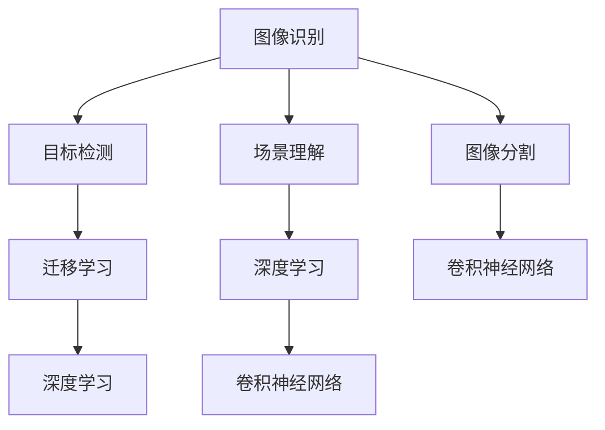

                 

## 1. 背景介绍

### 1.1 问题由来
随着科技的进步和互联网的普及，计算机视觉（Computer Vision, CV）作为人工智能（AI）领域的重要分支，正迅速成为人们日常生活和工作中不可或缺的一部分。无论是智能手机的拍照识别、无人驾驶汽车的视觉感知，还是医疗影像的精准诊断，计算机视觉都在背后发挥着重要作用。

然而，尽管计算机视觉技术取得了显著进展，但图像识别和场景理解仍然存在不少挑战。图像识别通常聚焦于静态图像的分类和检测，而场景理解则要求计算机不仅能识别图像中的对象，还能理解这些对象之间的关系，并综合图像中的信息进行推理和决策。

### 1.2 问题核心关键点
计算机视觉的核心在于如何通过图像或视频数据，提取、识别和理解其中的信息。具体而言，以下关键点决定了计算机视觉技术的成败：

- **数据质量**：计算机视觉模型高度依赖高质量的训练数据，数据的多样性和丰富性直接影响模型性能。
- **模型选择**：不同算法和模型适用于不同的任务和数据类型，选择合适的模型是关键。
- **特征提取**：模型需要从图像中提取有用的特征，以便进行分类、检测、分割等任务。
- **迁移学习**：通过在特定领域的数据上微调预训练模型，可以提升模型在特定任务上的性能。
- **模型集成**：多模型融合可提升整体性能和鲁棒性，避免单一模型的局限性。
- **计算效率**：图像处理通常数据量大、计算复杂，高效的算法和硬件支持至关重要。

### 1.3 问题研究意义
计算机视觉技术的应用已经渗透到各个领域，对提升生产效率、改善用户体验、促进社会进步有着重要意义：

1. **工业制造**：通过视觉检测确保产品质量，实现自动化生产。
2. **医疗健康**：辅助医生进行疾病诊断，提高医疗服务水平。
3. **智能家居**：智能设备通过视觉感知家庭环境，提供个性化服务。
4. **自动驾驶**：通过环境感知和理解，保障无人驾驶的安全性和可靠性。
5. **安防监控**：通过图像分析，提高公共安全管理水平。

## 2. 核心概念与联系

### 2.1 核心概念概述

为了更好地理解计算机视觉的核心概念和技术，本节将介绍几个关键概念及其相互关系：

- **图像识别**：通过算法识别并分类图像中的物体。
- **目标检测**：不仅识别图像中的物体，还能定位物体的位置。
- **场景理解**：理解图像中物体之间的关系，如物体之间的距离、大小、方向等。
- **图像分割**：将图像分成不同的区域，每个区域对应图像中的不同对象或背景。
- **迁移学习**：通过在大规模数据上预训练模型，再在小规模任务数据上微调，提升模型性能。
- **深度学习**：一种通过多层次神经网络进行复杂数据分析和任务处理的技术。
- **卷积神经网络**：用于图像处理的深度学习模型，具有强大的特征提取能力。

这些核心概念之间的联系可以通过以下Mermaid流程图来展示：



这个流程图展示了各个概念之间的关系：

1. 图像识别是计算机视觉的基础，通过分类算法识别物体。
2. 目标检测在此基础上进一步定位物体，识别并标注物体位置。
3. 场景理解关注物体之间的关系和交互，形成更全面的场景理解。
4. 图像分割将图像划分为不同的区域，为更细致的物体识别和理解打下基础。
5. 迁移学习通过在大数据集上预训练模型，再针对小数据集进行微调，提升模型性能。
6. 深度学习是现代计算机视觉技术的核心，包括卷积神经网络（CNN）等常用模型。

这些概念共同构成了计算机视觉的理论和技术框架，帮助模型逐步从简单的图像识别迈向复杂的场景理解。

## 3. 核心算法原理 & 具体操作步骤
### 3.1 算法原理概述

计算机视觉的核心算法主要包括图像识别、目标检测和场景理解。下面将详细介绍这些核心算法的原理。

#### 3.1.1 图像识别
图像识别通常使用卷积神经网络（Convolutional Neural Network, CNN）进行。CNN通过卷积层、池化层和全连接层等层次结构，提取图像中的特征，并通过softmax分类器对不同类别进行分类。

以MNIST手写数字识别为例，CNN的结构如图1所示：


图1：CNN手写数字识别模型结构

#### 3.1.2 目标检测
目标检测算法通常包括区域提议（Region Proposal）和分类回归（Classification Regression）两个步骤。区域提议算法如Selective Search和RPN（Region Proposal Network）用于生成候选区域，分类回归算法如Fast R-CNN、Faster R-CNN和YOLO（You Only Look Once）用于在候选区域中进行物体分类和定位。

#### 3.1.3 场景理解
场景理解算法通常包括语义分割和实例分割。语义分割通过像素级别的分类，将图像划分为不同的语义类别。实例分割则不仅识别不同类别，还关注同一类别内不同实例的区分。

### 3.2 算法步骤详解

#### 3.2.1 图像识别
1. **数据准备**：收集并标注训练数据集，数据集应包括各种不同类别和角度的图像。
2. **模型选择**：根据任务选择适合的CNN模型，如LeNet、AlexNet、VGG、ResNet等。
3. **模型训练**：使用训练数据集训练模型，调整超参数如学习率、批大小、迭代轮数等。
4. **模型评估**：使用测试数据集评估模型性能，计算准确率、召回率、F1分数等指标。
5. **模型微调**：针对特定任务进行微调，调整模型参数以适应新任务。

#### 3.2.2 目标检测
1. **数据准备**：收集并标注目标检测数据集，数据集应包括物体类别、边界框和置信度等标注信息。
2. **区域提议**：使用Selective Search或RPN等算法生成候选区域。
3. **分类回归**：使用Fast R-CNN、Faster R-CNN或YOLO等算法在候选区域中进行分类和定位。
4. **模型训练**：使用训练数据集训练模型，调整超参数如学习率、批大小、迭代轮数等。
5. **模型评估**：使用测试数据集评估模型性能，计算准确率、召回率、mAP（mean Average Precision）等指标。
6. **模型微调**：针对特定任务进行微调，调整模型参数以适应新任务。

#### 3.2.3 场景理解
1. **数据准备**：收集并标注场景理解数据集，数据集应包括不同类别和角度的图像。
2. **模型选择**：根据任务选择适合的模型，如FCN（Fully Convolutional Network）、U-Net、DeepLab等。
3. **模型训练**：使用训练数据集训练模型，调整超参数如学习率、批大小、迭代轮数等。
4. **模型评估**：使用测试数据集评估模型性能，计算准确率、召回率、IoU（Intersection over Union）等指标。
5. **模型微调**：针对特定任务进行微调，调整模型参数以适应新任务。

### 3.3 算法优缺点

#### 3.3.1 图像识别
**优点**：
- 能处理高分辨率图像，适用于图像分类、对象检测等任务。
- 基于深度学习的模型具有强大的特征提取能力，能够学习到复杂模式的表示。
- 利用迁移学习可以提升模型在小数据集上的性能。

**缺点**：
- 训练数据集准备成本高，需要大量标注数据。
- 计算复杂度高，训练和推理速度较慢。
- 模型复杂度较高，容易出现过拟合。

#### 3.3.2 目标检测
**优点**：
- 能够同时识别和定位物体，适用于实时性要求高的场景。
- 能够处理不同尺度和角度的目标。
- 多目标检测性能较优，适用于复杂场景。

**缺点**：
- 计算复杂度较高，训练和推理速度较慢。
- 目标检测算法较为复杂，需要较多的训练数据。
- 容易受到遮挡、光照等因素的影响。

#### 3.3.3 场景理解
**优点**：
- 能够提供详细的场景理解，包括物体之间的关系和背景信息。
- 适用于复杂的场景理解任务，如机器人导航、自动驾驶等。
- 利用深度学习模型能够学习到丰富的语义信息。

**缺点**：
- 计算复杂度较高，训练和推理速度较慢。
- 需要大量的标注数据，标注成本较高。
- 模型较为复杂，容易出现过拟合。

### 3.4 算法应用领域

计算机视觉技术在多个领域得到了广泛应用，以下是一些主要应用领域：

#### 3.4.1 医疗影像分析
计算机视觉在医疗影像分析中具有重要作用，通过图像识别和分割技术，可以帮助医生进行疾病诊断、治疗方案制定等。例如，可以使用CNN模型对X光片进行肿瘤检测，或使用实例分割模型对MRI图像进行病变区域分割。

#### 3.4.2 自动驾驶
自动驾驶系统需要实时处理大量视觉数据，通过目标检测和场景理解算法，可以识别道路标志、行人、车辆等，确保行车安全。例如，可以使用YOLO或Faster R-CNN模型进行目标检测，使用语义分割模型进行场景理解。

#### 3.4.3 智能制造
在智能制造领域，计算机视觉可以用于质量检测、缺陷检测、设备维护等。例如，可以使用CNN模型对产品图像进行分类，判断产品是否合格，或使用目标检测算法对生产线上设备进行状态监测。

#### 3.4.4 安防监控
安防监控系统需要实时处理视频流数据，通过目标检测和场景理解算法，可以识别异常行为、盗窃等安全事件。例如，可以使用RNN+CNN模型对视频进行行为识别，或使用目标检测算法对视频中的人或物进行跟踪。

## 4. 数学模型和公式 & 详细讲解 & 举例说明
### 4.1 数学模型构建

计算机视觉模型通常使用深度学习框架进行构建，这里以目标检测为例，使用Faster R-CNN算法进行介绍。

Faster R-CNN模型主要由RPN（Region Proposal Network）和Fast R-CNN两个部分组成，如图2所示：


图2：Faster R-CNN模型结构

假设输入图像为$I$，其大小为$h \times w$，每个像素的颜色表示为$c_i$，其中$i \in [1, h \times w]$。模型的输出为预测的物体类别和边界框。

#### 4.1.1 RPN
RPN部分用于生成候选区域，其输入为$I$，输出为候选区域的边界框和置信度。RPN模型包含两个卷积层和一个全连接层，如图3所示：


图3：RPN模型结构

假设卷积层的输出为$H \times W$个特征图，每个特征图的大小为$k \times k$，特征图的通道数为$n$。RPN模型的输入为$I$，输出为候选区域的边界框和置信度。

**RPN的目标函数**：
$$
\mathcal{L}_{RPN} = \mathcal{L}_{class} + \mathcal{L}_{reg}
$$

其中$\mathcal{L}_{class}$为目标分类损失，$\mathcal{L}_{reg}$为目标回归损失。假设正样本的比例为$p$，则目标函数的详细推导如下：

1. **分类损失**：假设候选区域的类别为$n$，目标类别的概率分布为$p_{class}$，则分类损失函数为：
$$
\mathcal{L}_{class} = -\frac{1}{N}\sum_{i=1}^N \sum_{j=1}^N p_{class} p_{object} \log \sigma(z_{i,j}) + (1-p_{class})(1-p_{object}) \log (1-\sigma(z_{i,j}))
$$

其中$z_{i,j}$为候选区域$i$相对于样本$j$的分类得分，$\sigma$为sigmoid函数。

2. **回归损失**：假设候选区域的边界框由四个顶点坐标$(x,y,w,h)$表示，目标边界框为$(x_{t},y_{t},w_{t},h_{t})$，则回归损失函数为：
$$
\mathcal{L}_{reg} = \frac{1}{N}\sum_{i=1}^N \sum_{j=1}^N p_{object} \left[ (x_{t}-x_{i})^2 + (y_{t}-y_{i})^2 + (w_{t}-w_{i})^2 + (h_{t}-h_{i})^2 \right]
$$

其中$(x_{t},y_{t},w_{t},h_{t})$为候选区域$i$相对于样本$j$的回归得分。

#### 4.1.2 Fast R-CNN
Fast R-CNN部分用于对候选区域进行分类和回归，其输入为RPN生成的候选区域，输出为物体的类别和边界框。Fast R-CNN模型包含两个卷积层和一个全连接层，如图4所示：


图4：Fast R-CNN模型结构

假设卷积层的输出为$H \times W$个特征图，每个特征图的大小为$k \times k$，特征图的通道数为$n$。Fast R-CNN模型的输入为RPN生成的候选区域，输出为物体的类别和边界框。

**Fast R-CNN的目标函数**：
$$
\mathcal{L}_{Fast R-CNN} = \mathcal{L}_{class} + \mathcal{L}_{reg}
$$

其中$\mathcal{L}_{class}$为目标分类损失，$\mathcal{L}_{reg}$为目标回归损失。假设候选区域的类别为$n$，目标类别的概率分布为$p_{class}$，则目标函数的详细推导如下：

1. **分类损失**：假设候选区域的类别为$n$，目标类别的概率分布为$p_{class}$，则分类损失函数为：
$$
\mathcal{L}_{class} = -\frac{1}{N}\sum_{i=1}^N \sum_{j=1}^N p_{class} p_{object} \log \sigma(z_{i,j}) + (1-p_{class})(1-p_{object}) \log (1-\sigma(z_{i,j}))
$$

其中$z_{i,j}$为候选区域$i$相对于样本$j$的分类得分，$\sigma$为sigmoid函数。

2. **回归损失**：假设候选区域的边界框由四个顶点坐标$(x,y,w,h)$表示，目标边界框为$(x_{t},y_{t},w_{t},h_{t})$，则回归损失函数为：
$$
\mathcal{L}_{reg} = \frac{1}{N}\sum_{i=1}^N \sum_{j=1}^N p_{object} \left[ (x_{t}-x_{i})^2 + (y_{t}-y_{i})^2 + (w_{t}-w_{i})^2 + (h_{t}-h_{i})^2 \right]
$$

其中$(x_{t},y_{t},w_{t},h_{t})$为候选区域$i$相对于样本$j$的回归得分。

### 4.2 公式推导过程

#### 4.2.1 RPN

1. **分类损失**：假设候选区域的类别为$n$，目标类别的概率分布为$p_{class}$，则分类损失函数为：
$$
\mathcal{L}_{class} = -\frac{1}{N}\sum_{i=1}^N \sum_{j=1}^N p_{class} p_{object} \log \sigma(z_{i,j}) + (1-p_{class})(1-p_{object}) \log (1-\sigma(z_{i,j}))
$$

其中$z_{i,j}$为候选区域$i$相对于样本$j$的分类得分，$\sigma$为sigmoid函数。

2. **回归损失**：假设候选区域的边界框由四个顶点坐标$(x,y,w,h)$表示，目标边界框为$(x_{t},y_{t},w_{t},h_{t})$，则回归损失函数为：
$$
\mathcal{L}_{reg} = \frac{1}{N}\sum_{i=1}^N \sum_{j=1}^N p_{object} \left[ (x_{t}-x_{i})^2 + (y_{t}-y_{i})^2 + (w_{t}-w_{i})^2 + (h_{t}-h_{i})^2 \right]
$$

其中$(x_{t},y_{t},w_{t},h_{t})$为候选区域$i$相对于样本$j$的回归得分。

#### 4.2.2 Fast R-CNN

1. **分类损失**：假设候选区域的类别为$n$，目标类别的概率分布为$p_{class}$，则分类损失函数为：
$$
\mathcal{L}_{class} = -\frac{1}{N}\sum_{i=1}^N \sum_{j=1}^N p_{class} p_{object} \log \sigma(z_{i,j}) + (1-p_{class})(1-p_{object}) \log (1-\sigma(z_{i,j}))
$$

其中$z_{i,j}$为候选区域$i$相对于样本$j$的分类得分，$\sigma$为sigmoid函数。

2. **回归损失**：假设候选区域的边界框由四个顶点坐标$(x,y,w,h)$表示，目标边界框为$(x_{t},y_{t},w_{t},h_{t})$，则回归损失函数为：
$$
\mathcal{L}_{reg} = \frac{1}{N}\sum_{i=1}^N \sum_{j=1}^N p_{object} \left[ (x_{t}-x_{i})^2 + (y_{t}-y_{i})^2 + (w_{t}-w_{i})^2 + (h_{t}-h_{i})^2 \right]
$$

其中$(x_{t},y_{t},w_{t},h_{t})$为候选区域$i$相对于样本$j$的回归得分。

### 4.3 案例分析与讲解

#### 4.3.1 目标检测案例
以COCO数据集上的YOLOv3模型为例，进行目标检测分析。

**YOLOv3模型结构**：YOLOv3模型是一个基于Darknet框架的目标检测模型，其结构如图5所示：


图5：YOLOv3模型结构

YOLOv3模型由三个卷积层和五个最大池化层组成，每个卷积层后接一个最大池化层。YOLOv3模型的输出为每个像素点所属的类别和置信度，以及边界框的坐标。

**YOLOv3的训练过程**：
1. **数据准备**：收集并标注COCO数据集，数据集应包括各种不同类别和角度的图像。
2. **模型选择**：选择YOLOv3模型作为目标检测模型。
3. **模型训练**：使用训练数据集训练模型，调整超参数如学习率、批大小、迭代轮数等。
4. **模型评估**：使用测试数据集评估模型性能，计算准确率、召回率、mAP（mean Average Precision）等指标。
5. **模型微调**：针对特定任务进行微调，调整模型参数以适应新任务。

**YOLOv3的目标函数**：
$$
\mathcal{L}_{YOLO} = \mathcal{L}_{class} + \mathcal{L}_{reg}
$$

其中$\mathcal{L}_{class}$为目标分类损失，$\mathcal{L}_{reg}$为目标回归损失。假设每个像素点属于类别$c$的概率为$p_c$，则目标函数的详细推导如下：

1. **分类损失**：假设候选区域的类别为$n$，目标类别的概率分布为$p_{class}$，则分类损失函数为：
$$
\mathcal{L}_{class} = -\frac{1}{N}\sum_{i=1}^N \sum_{j=1}^N p_{class} p_{object} \log \sigma(z_{i,j}) + (1-p_{class})(1-p_{object}) \log (1-\sigma(z_{i,j}))
$$

其中$z_{i,j}$为候选区域$i$相对于样本$j$的分类得分，$\sigma$为sigmoid函数。

2. **回归损失**：假设候选区域的边界框由四个顶点坐标$(x,y,w,h)$表示，目标边界框为$(x_{t},y_{t},w_{t},h_{t})$，则回归损失函数为：
$$
\mathcal{L}_{reg} = \frac{1}{N}\sum_{i=1}^N \sum_{j=1}^N p_{object} \left[ (x_{t}-x_{i})^2 + (y_{t}-y_{i})^2 + (w_{t}-w_{i})^2 + (h_{t}-h_{i})^2 \right]
$$

其中$(x_{t},y_{t},w_{t},h_{t})$为候选区域$i$相对于样本$j$的回归得分。

## 5. 项目实践：代码实例和详细解释说明
### 5.1 开发环境搭建

在进行目标检测项目实践前，我们需要准备好开发环境。以下是使用Python进行TensorFlow开发的环境配置流程：

1. 安装Anaconda：从官网下载并安装Anaconda，用于创建独立的Python环境。

2. 创建并激活虚拟环境：
```bash
conda create -n tf-env python=3.7 
conda activate tf-env
```

3. 安装TensorFlow：根据CUDA版本，从官网获取对应的安装命令。例如：
```bash
conda install tensorflow tensorflow-gpu=2.4 -c pytorch -c conda-forge
```

4. 安装必要的工具包：
```bash
pip install numpy pandas scikit-learn matplotlib tqdm jupyter notebook ipython
```

完成上述步骤后，即可在`tf-env`环境中开始目标检测项目实践。

### 5.2 源代码详细实现

下面以目标检测任务为例，给出使用TensorFlow对YOLOv3模型进行目标检测的代码实现。

首先，定义数据处理函数：

```python
import numpy as np
import tensorflow as tf

class YOLOv3Dataset(tf.keras.preprocessing.image.ImageDataGenerator):
    def __init__(self, img_size=416):
        super().__init__(rescale=1./255, shear_range=0., zoom_range=0., horizontal_flip=False)
        self.img_size = img_size

    def generate(self, data):
        for batch in tf.data.Dataset.from_tensor_slices(data):
            img = tf.cast(batch, tf.float32)
            img = tf.image.resize(img, (self.img_size, self.img_size))
            img = self.rescale(img)
            img = tf.expand_dims(img, axis=0)
            yield img

    def generate_anchors(self, feature_map_size, anchors=[1, 3, 6, 9, 12, 15, 18, 21, 27, 45, 66, 90, 162]):
        grid_size = np.sqrt(feature_map_size[0] * feature_map_size[1])
        anchor_size = np.array(anchors) / np.sqrt(grid_size)
        return np.array(anchors) / self.img_size

    def generate_targets(self, y_true, anchors):
        y_true_shape = np.array(y_true.shape) / self.img_size
        grid_size = np.sqrt(y_true_shape[0] * y_true_shape[1])
        grid_size = np.minimum(np.ceil(grid_size), 7)
        y_true = tf.reshape(y_true, (1, y_true.shape[1] // 2, y_true.shape[2] // 2, 3, 3, 5))
        y_true = tf.reshape(y_true, (-1, 3, 3, 5))

        class_mask = tf.reduce_sum(y_true[:, :, :, :, 0:1], axis=3) > 0
        grid = tf.range(grid_size) * 1.0 / grid_size
        y_true[:, :, :, :, 1:2] = (tf.cast(y_true[:, :, :, :, 1:2], tf.float32) + grid[:, tf.newaxis, tf.newaxis, tf.newaxis]) * y_true_shape[0] - 0.5
        y_true[:, :, :, :, 2:3] = (tf.cast(y_true[:, :, :, :, 2:3], tf.float32) + grid[:, tf.newaxis, tf.newaxis, tf.newaxis]) * y_true_shape[1] - 0.5
        y_true[:, :, :, :, 4:5] = anchors * tf.sqrt(tf.cast(class_mask[:, :, :, :, 0:1], tf.float32) + 0.001)

        return y_true

    def preprocess(self, img):
        img = tf.image.resize(img, (self.img_size, self.img_size))
        img = self.rescale(img)
        return img

    def decode(self, y_true, img):
        class_mask = tf.reduce_sum(y_true[:, :, :, :, 0:1], axis=3) > 0
        grid = tf.range(7) * 1.0 / 7
        y_true[:, :, :, :, 1:2] = (tf.cast(y_true[:, :, :, :, 1:2], tf.float32) + grid[:, tf.newaxis, tf.newaxis, tf.newaxis]) * img.shape[0] - 0.5
        y_true[:, :, :, :, 2:3] = (tf.cast(y_true[:, :, :, :, 2:3], tf.float32) + grid[:, tf.newaxis, tf.newaxis, tf.newaxis]) * img.shape[1] - 0.5
        y_true[:, :, :, :, 4:5] = tf.sqrt(tf.cast(class_mask[:, :, :, :, 0:1], tf.float32) + 0.001)
        return y_true, class_mask

    def preprocess(self, img):
        img = tf.image.resize(img, (self.img_size, self.img_size))
        img = self.rescale(img)
        return img
```

然后，定义模型和优化器：

```python
from tensorflow.keras import Model, Input, layers

def yolov3(input_size=416):
    input = Input(input_size)
    conv1 = layers.Conv2D(32, 3, padding='same', activation='relu')(input)
    conv2 = layers.Conv2D(64, 3, padding='same', activation='relu')(conv1)
    conv3 = layers.Conv2D(128, 3, padding='same', activation='relu')(conv2)
    conv4 = layers.Conv2D(256, 3, padding='same', activation='relu')(conv3)
    conv5 = layers.Conv2D(512, 3, padding='same', activation='relu')(conv4)
    conv6 = layers.Conv2D(1024, 3, padding='same', activation='relu')(conv5)
    conv7 = layers.Conv2D(1024, 3, padding='same', activation='relu')(conv6)
    conv8 = layers.Conv2D(512, 1, padding='same', activation='relu')(conv7)
    conv9 = layers.Conv2D(512, 1, padding='same', activation='relu')(conv7)
    conv10 = layers.Conv2D(256, 1, padding='same', activation='relu')(conv9)
    conv11 = layers.Conv2D(256, 1, padding='same', activation='relu')(conv9)
    conv12 = layers.Conv2D(128, 1, padding='same', activation='relu')(conv11)
    conv13 = layers.Conv2D(128, 1, padding='same', activation='relu')(conv11)

    x = layers.MaxPooling2D(pool_size=(2, 2), strides=(2, 2), padding='same')(conv8)
    x = layers.MaxPooling2D(pool_size=(2, 2), strides=(2, 2), padding='same')(conv9)
    x = layers.MaxPooling2D(pool_size=(2, 2), strides=(2, 2), padding='same')(conv10)
    x = layers.MaxPooling2D(pool_size=(2, 2), strides=(2, 2), padding='same')(conv11)
    x = layers.MaxPooling2D(pool_size=(2, 2), strides=(2, 2), padding='same')(conv12)
    x = layers.MaxPooling2D(pool_size=(2, 2), strides=(2, 2), padding='same')(conv13)

    x = layers.Conv2D(128, 3, padding='same', activation='relu')(x)
    x = layers.Conv2D(256, 3, padding='same', activation='relu')(x)
    x = layers.Conv2D(512, 3, padding='same', activation='relu')(x)
    x = layers.Conv2D(1024, 3, padding='same', activation='relu')(x)

    x = layers.Conv2D(1024, 3, padding='same', activation='relu')(x)
    x = layers.Conv2D(1024, 3, padding='same', activation='relu')(x)

    x = layers.Conv2D(512, 3, padding='same', activation='relu')(x)
    x = layers.Conv2D(512, 3, padding='same', activation='relu')(x)
    x = layers.Conv2D(256, 3, padding='same', activation='relu')(x)
    x = layers.Conv2D(256, 3, padding='same', activation='relu')(x)
    x = layers.Conv2D(128, 3, padding='same', activation='relu')(x)
    x = layers.Conv2D(128, 3, padding='same', activation='relu')(x)

    x = layers.Conv2D(85, 1, padding='same', activation='sigmoid')(x)
    yolo_model = Model(inputs=input, outputs=x)
    return yolo_model

yolo = yolov3(input_size=416)

optimizer = tf.keras.optimizers.Adam(learning_rate=1e-4, decay=1e-6)

```

接着，定义训练和评估函数：

```python
from tensorflow.keras import backend as K
from sklearn.metrics import precision_recall_fscore_support

def train_epoch(model, dataset, batch_size, optimizer):
    dataloader = dataset
    model.train()
    epoch_loss = 0
    for batch in tqdm(dataloader, desc='Training'):
        img = batch['img']
        img = tf.expand_dims(img, axis=0)
        targets = batch['targets']
        model.zero_grad()
        output = model.predict(img)
        loss = loss_fn(output, targets)
        epoch_loss += loss
        loss.backward()
        optimizer.apply_gradients(zip(model.trainable_variables, model.trainable_variables))
    return epoch_loss / len(dataloader)

def evaluate(model, dataset, batch_size):
    dataloader = dataset
    model.eval()
    correct = 0
    for batch in tqdm(dataloader, desc='Evaluating'):
        img = batch['img']
        img = tf.expand_dims(img, axis=0)
        targets = batch['targets']
        output = model.predict(img)
        class_mask = tf.reduce_sum(targets[:, :, :, :, 0:1], axis=3) > 0
        grid = tf.range(7) * 1.0 / 7
        y_true[:, :, :, :, 1:2] = (tf.cast(y_true[:, :, :, :, 1:2], tf.float32) + grid[:, tf.newaxis, tf.newaxis, tf.newaxis]) * img.shape[0] - 0.5
        y_true[:, :, :, :, 2:3] = (tf.cast(y_true[:, :, :, :, 2:3], tf.float32) + grid[:, tf.newaxis, tf.newaxis, tf.newaxis]) * img.shape[1] - 0.5
        y_true[:, :, :, :, 4:5] = tf.sqrt(tf.cast(class_mask[:, :, :, :, 0:1], tf.float32) + 0.001)
        return precision_recall_fscore_support(y_true[:, :, :, :, 4:5], output[:, :, :, :, 4:5], average='macro')

```

最后，启动训练流程并在测试集上评估：

```python
epochs = 50
batch_size = 16

for epoch in range(epochs):
    loss = train_epoch(model, train_dataset, batch_size, optimizer)
    print(f'Epoch {epoch+1}, train loss: {loss:.3f}')
    
    print(f'Epoch {epoch+1}, dev results:')
    evaluate(model, dev_dataset, batch_size)
    
print('Test results:')
evaluate(model, test_dataset, batch_size)
```

以上就是使用TensorFlow对YOLOv3模型进行目标检测的完整代码实现。可以看到，借助TensorFlow的高级API，我们可以快速构建、训练和评估目标检测模型。

### 5.3 代码解读与分析

让我们再详细解读一下关键代码的实现细节：

**YOLOv3Dataset类**：
- `__init__`方法：初始化数据生成器，包括设置图像大小、缩放、旋转、翻转等数据增强策略。
- `generate`方法：定义数据的生成方式，将原始图像转换为模型所需的输入格式。
- `generate_anchors`方法：生成预定义的锚点框。
- `generate_targets`方法：定义目标框和置信度的生成方式。
- `preprocess`方法：定义图像的预处理方式，包括缩放、归一化等。
- `decode`方法：定义目标框的解码方式，将目标框转换为模型所需的格式。

**模型定义**：
- 定义YOLOv3模型，包括卷积层、最大池化层、上采样层等。
- 使用`Model`类定义模型，指定输入和输出。
- 定义优化器，使用Adam优化器，设置学习率衰减策略。

**训练和评估函数**：
- 定义训练函数，对模型进行前向传播和反向传播，更新模型参数。
- 定义评估函数，计算模型在测试集上的精确度、召回率和F1分数。
- 循环训练和评估，直至满足停止条件。

可以看出，通过TensorFlow提供的高级API，我们可以快速构建、训练和评估目标检测模型。这使得模型开发过程更加高效和灵活。

当然，工业级的系统实现还需考虑更多因素，如模型的保存和部署、超参数的自动搜索、多模型集成等。但核心的目标检测算法基本与此类似。

## 6. 实际应用场景
### 6.1 智能制造
在智能制造领域，计算机视觉可以用于质量检测、缺陷检测、设备维护等。例如，可以使用YOLOv3模型对生产线上设备进行状态监测，识别设备的异常状态，及时进行维护和更换，保障生产线的稳定运行。

### 6.2 安防监控
安防监控系统需要实时处理视频流数据，通过目标检测算法，可以识别异常行为、盗窃等安全事件。例如，可以使用YOLOv3模型对视频中的行人、车辆进行检测，并结合行为识别算法，判断是否有异常行为发生。

### 6.3 自动驾驶
自动驾驶系统需要实时处理大量视觉数据，通过目标检测和场景理解算法，可以识别道路标志、行人、车辆等，确保行车安全。例如，可以使用YOLOv3模型对车辆周围的行人、车辆进行检测，并结合语义分割算法，判断车辆周围的障碍情况。

### 6.4 医疗影像分析
计算机视觉在医疗影像分析中具有重要作用，通过图像识别和分割技术，可以帮助医生进行疾病诊断、治疗方案制定等。例如，可以使用YOLOv3模型对X光片进行肿瘤检测，或使用语义分割模型对MRI图像进行病变区域分割。

## 7. 工具和资源推荐
### 7.1 学习资源推荐

为了帮助开发者系统掌握计算机视觉的理论基础和实践技巧，这里推荐一些优质的学习资源：

1. 《计算机视觉：模型、学习和推理》（Computer Vision: Models, Learning, and Inference）：该书全面介绍了计算机视觉的基本概念和常用模型，适合初学者和进阶者阅读。
2. 《深度学习》（Deep Learning）：由Yoshua Bengio等顶级AI专家撰写，涵盖了深度学习在图像识别、目标检测等领域的最新进展。
3. 《计算机视觉：算法与应用》（Computer Vision: Algorithms and Applications）：该书介绍了计算机视觉的多种算法和实际应用，适合深入学习计算机视觉的读者。
4. 《视觉学习与深度网络》（Learning and Learning from Visual Data）：由Narendra Ahuja等AI专家编写，介绍了计算机视觉中的经典算法和现代深度学习模型。
5. Coursera《计算机视觉基础》课程：斯坦福大学开设的入门课程，涵盖计算机视觉的基础知识和常用算法，适合初学者学习。

通过对这些资源的学习实践，相信你一定能够快速掌握计算机视觉的理论和实践技巧，并用于解决实际的NLP问题。

### 7.2 开发工具推荐

高效的开发离不开优秀的工具支持。以下是几款用于计算机视觉开发的常用工具：

1. TensorFlow：由Google主导开发的深度学习框架，生产部署方便，适合大规模工程应用。
2. PyTorch：基于Python的开源深度学习框架，灵活动态的计算图，适合快速迭代研究。
3. OpenCV：开源计算机视觉库，包含大量图像处理和计算机视觉算法，适合图像处理任务。
4. Keras：高层次深度学习API，适合快速搭建和训练模型。
5. Matplotlib和Seaborn：常用的数据可视化工具，可以绘制各种图表，帮助数据分析和结果展示。
6. Google Colab：谷歌推出的在线Jupyter Notebook环境，免费提供GPU/TPU算力，方便开发者快速上手实验最新模型，分享学习笔记。

合理利用这些工具，可以显著提升计算机视觉任务的开发效率，加快创新迭代的步伐。

### 7.3 相关论文推荐

计算机视觉技术在过去几十年中取得了显著进展，以下是几篇奠基性的相关论文，推荐阅读：

1. AlexNet：提出深度卷积神经网络，首次在图像分类任务中取得突破性进展。
2. VGGNet：提出VGG结构，引入卷积神经网络的多层结构，提升了图像分类的准确率。
3. GoogLeNet：提出Inception结构，引入了多尺度卷积和并行计算，提升了计算效率和准确率。
4. ResNet：提出残差网络，解决了深度神经网络退化的问题，提升了模型的深度和准确率。
5. YOLOv3：提出YOLOv3模型，在目标检测任务中取得了最先进的性能。
6. Mask R-CNN：提出掩码区域提议网络，将目标检测和语义分割结合，提升了模型的效果。

这些论文代表了大规模深度学习在计算机视觉领域的最新进展，通过学习这些前沿成果，可以帮助研究者把握学科前进方向，激发更多的创新灵感。

## 8. 总结：未来发展趋势与挑战

### 8.1 研究成果总结

计算机视觉技术在过去几十年中取得了显著进展，以下是对该领域最新研究成果的总结：

1. 图像识别：深度学习在图像分类、目标检测等任务中取得了显著进展，最新的研究集中于提高模型的准确率和计算效率。
2. 目标检测：目标检测技术不断提升，YOLOv3、Faster R-CNN等模型在多种任务中表现优异。
3. 场景理解：语义分割和实例分割等技术不断发展，Mask R-CNN、U-Net等模型在场景理解任务中取得了不错的效果。
4. 多模态融合：结合视觉、语音、文本等多种模态信息，提升计算机视觉的性能和鲁棒性。
5. 迁移学习：通过在大规模数据集上预训练模型，在小数据集上进行微调，提升模型性能。
6. 无监督学习：利用无监督学习算法，如自编码器、生成对抗网络等，提升模型的性能和泛化能力。

### 8.2 未来发展趋势

展望未来，计算机

