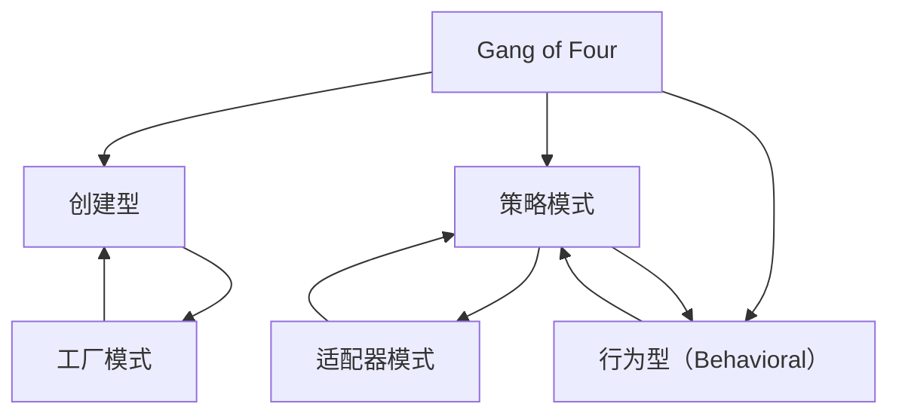

                 

## 1. 背景介绍

### 1.1 问题由来

在软件开发过程中，为了解决特定问题，开发人员往往会设计出不同的代码结构，而这些结构往往是经过长期实践和测试验证的。这些结构性的解决方案，就是所谓的“设计模式”。设计模式本质上是一种被广泛认可的、通用的设计思路和解决方案，能够被重复使用，从而提高开发效率和代码质量。

### 1.2 问题核心关键点

设计模式的分类和应用是软件开发中一个重要且复杂的课题。不同的设计模式适用于不同的场景，并能解决不同的问题。因此，掌握设计模式的分类、原理、优缺点及其应用场景，对于软件开发人员来说至关重要。

## 2. 核心概念与联系

### 2.1 核心概念概述

- **设计模式（Design Pattern）**：一种在软件设计中可被重复使用的代码结构，能够解决特定问题，提高代码的可维护性和可复用性。
- **Gang of Four（GoF）设计模式**：经典的设计模式集，由《设计模式》一书的作者Erich Gamma等人在其著作中总结和提出，共分为23种设计模式，分为创建型（Creational Patterns）、结构型（Structural Patterns）和行为型（Behavioral Patterns）三大类。
- **创建型模式**：与对象的创建相关，用于创建新的对象，包括工厂模式、单例模式、建造者模式等。
- **结构型模式**：关注对象之间的结构关系，包括适配器模式、桥接模式、装饰器模式等。
- **行为型模式**：关注对象之间的交互和行为，包括策略模式、观察者模式、状态模式等。

### 2.2 核心概念原理和架构的 Mermaid 流程图



上述流程图展示了GoF设计模式的三大类别及其主要模式。创建型模式通过不同的方式创建对象，结构型模式调整对象之间的关系，行为型模式则关注对象之间的交互和行为。

## 3. 核心算法原理 & 具体操作步骤

### 3.1 算法原理概述

设计模式的原理通常基于以下几个原则：

- **开闭原则（Open-Closed Principle, OCP）**：对象应该对扩展开放，对修改关闭。即在不改变现有代码的前提下，新增功能应通过扩展而不是修改现有代码实现。
- **单一职责原则（Single Responsibility Principle, SRP）**：一个类应该只有一个引起它变化的原因，即只负责一个职责。
- **里氏替换原则（Liskov Substitution Principle, LSP）**：子类可以替换父类并使用其父类对象的位置，不会引起程序错误。
- **合成复用原则（Composite Reuse Principle, CRP）**：尽量使用组合/聚合关系，而不是通过继承关系实现代码复用。

设计模式的应用通常遵循以下步骤：

1. **分析问题**：识别需求中的共性问题，分析问题的本质。
2. **选择模式**：根据问题类型，选择适合的GoF设计模式。
3. **实现模式**：设计模式的实现代码通常分为接口和具体实现类，接口定义了模式的行为，具体实现类则提供了具体的实现。
4. **测试与优化**：在实际应用中测试模式的正确性和性能，并根据需要进行优化调整。

### 3.2 算法步骤详解

以工厂模式为例，展示如何从需求到实现设计模式：

1. **分析问题**：需要一种方式，在运行时动态地创建不同类型的产品对象，而不需要在编译时指定具体的产品类型。
2. **选择模式**：工厂模式（Factory Pattern）适用于创建产品对象，根据不同的产品类型，动态创建对应的产品对象。
3. **实现模式**：设计一个工厂类，该类根据参数决定创建哪个产品对象。工厂类定义了接口，具体的产品实现类实现接口并返回具体的对象。
4. **测试与优化**：在实际应用中测试工厂类的正确性，调整参数和实现，以确保生成的产品符合预期。

### 3.3 算法优缺点

#### 3.3.1 工厂模式

- **优点**：
  - 实现了解耦和接口，降低了代码的耦合度。
  - 提供了灵活的扩展点，方便添加新的产品实现。
  - 隔离了具体实现，简化了客户端代码。

- **缺点**：
  - 增加了新的类和方法，可能会增加代码的复杂度。
  - 如果设计不当，可能会导致对象的生命周期管理问题。

#### 3.3.2 单例模式

- **优点**：
  - 确保了类只有一个实例，简化了对象的创建和管理。
  - 提供了全局访问点，方便单例类对其他类的控制。

- **缺点**：
  - 全局只有一个实例，可能会影响系统的性能。
  - 单例类的扩展性较差，不易维护。

### 3.4 算法应用领域

设计模式被广泛应用于软件开发中的各个方面，以下是几个典型应用领域：

- **企业级应用**：设计模式在企业级应用中广泛应用，如Spring框架中的IoC（Inversion of Control）模式、AOP（Aspect Oriented Programming）模式等。
- **Web开发**：设计模式在Web开发中也非常常见，如MVC（Model-View-Controller）模式、观察者模式等。
- **移动开发**：设计模式在移动开发中也有应用，如适配器模式、观察者模式等。
- **游戏开发**：设计模式在游戏开发中也有应用，如状态模式、策略模式等。

## 4. 数学模型和公式 & 详细讲解 & 举例说明

### 4.1 数学模型构建

设计模式的数学模型通常基于对象间的关系和行为，不涉及复杂的数学运算。

### 4.2 公式推导过程

设计模式的公式推导主要关注行为模式的交互模型，如状态模式中的状态转移矩阵、策略模式中的策略选择规则等。以状态模式为例：

$$
T(s_i,s_j) = 
\begin{cases}
s_j, & \text{if } s_i \rightarrow s_j \text{ is valid} \\
s_k, & \text{if } s_i \rightarrow s_k \text{ is valid and } s_k \rightarrow s_j \text{ is valid}
\end{cases}
$$

其中，$T$ 表示状态转移矩阵，$s_i$ 和 $s_j$ 表示状态，$k$ 为中间状态。

### 4.3 案例分析与讲解

以适配器模式为例，分析其在实际应用中的作用和实现方法：

适配器模式用于将一个类的接口转换成客户希望的另一个接口，使得原本不兼容的接口能够协同工作。例如，假设有一个老式的矩形接口，现需将其适配成正方形接口，以便于与新系统兼容。

```java
public interface Shape {
    void draw();
}

public class Square implements Shape {
    @Override
    public void draw() {
        System.out.println("Drawing square");
    }
}

public class Adapter implements Shape {
    private Shape shape;

    public Adapter(Shape shape) {
        this.shape = shape;
    }

    @Override
    public void draw() {
        shape.draw();
    }
}

public class Client {
    public static void main(String[] args) {
        Shape square = new Square();
        Shape adapterSquare = new Adapter(square);
        adapterSquare.draw(); // Drawing square
    }
}
```

上述代码展示了适配器模式的实现方法，将老式的矩形接口转换为正方形接口，使得客户代码可以统一调用。

## 5. 项目实践：代码实例和详细解释说明

### 5.1 开发环境搭建

搭建开发环境需要以下步骤：

1. 安装Java开发环境（如JDK 11）。
2. 安装IDE（如IntelliJ IDEA或Eclipse）。
3. 创建新项目，配置依赖库（如Maven或Gradle）。
4. 下载和配置设计模式相关的库和框架（如Spring、Hibernate等）。

### 5.2 源代码详细实现

以单例模式为例，展示如何在Java中实现单例模式：

```java
public class Singleton {
    private static Singleton instance = null;

    private Singleton() {}

    public static Singleton getInstance() {
        if (instance == null) {
            instance = new Singleton();
        }
        return instance;
    }

    public void doSomething() {
        System.out.println("Doing something");
    }
}

public class Client {
    public static void main(String[] args) {
        Singleton singleton = Singleton.getInstance();
        singleton.doSomething();
    }
}
```

### 5.3 代码解读与分析

- **静态变量**：使用静态变量 `instance` 保存单例实例，确保实例在程序运行期间只有一个。
- **私有构造函数**：私有化构造函数，防止外部直接创建单例实例。
- **获取实例的方法**：使用 `getInstance()` 方法获取单例实例，如果实例不存在，则创建新的单例实例。
- **公共方法**：提供公共方法 `doSomething()`，用于执行单例实例的行为。

### 5.4 运行结果展示

运行上述代码，输出结果为：

```
Doing something
```

## 6. 实际应用场景

### 6.1 企业级应用

设计模式在企业级应用中广泛应用，如Spring框架中的IoC模式、AOP模式等。这些模式通过解耦、代理、拦截等方式，提高了系统的可维护性和可扩展性。

### 6.2 Web开发

Web开发中常用的设计模式包括MVC模式、观察者模式、策略模式等。MVC模式将模型、视图和控制器分离开来，提高了代码的可读性和可维护性。观察者模式用于发布-订阅机制，提高了系统的灵活性和可扩展性。策略模式用于动态选择算法，提高了系统的灵活性。

### 6.3 移动开发

在移动开发中，适配器模式、观察者模式等也有广泛应用。适配器模式用于适配不同的平台和框架，观察者模式用于事件驱动机制，提高了系统的响应速度和灵活性。

### 6.4 游戏开发

游戏开发中常用的设计模式包括状态模式、策略模式等。状态模式用于管理游戏对象的状态，策略模式用于动态选择游戏策略，提高了系统的灵活性和可扩展性。

## 7. 工具和资源推荐

### 7.1 学习资源推荐

- **《设计模式：可复用面向对象软件的基础》**：经典的设计模式书籍，总结了23种GoF设计模式，并详细讲解了每个模式的原理和应用场景。
- **《Head First 设计模式》**：以图解的方式介绍设计模式，适合初学者快速入门。
- **Udemy上的GoF设计模式课程**：系统讲解GoF设计模式，结合实例进行深入讲解。
- **Stack Overflow上的设计模式问答**：提供丰富的设计模式应用案例，供开发者参考。

### 7.2 开发工具推荐

- **Eclipse**：强大的Java IDE，支持插件扩展，提供了丰富的设计模式开发工具。
- **IntelliJ IDEA**：现代化的Java IDE，支持设计模式分析和重构，提高了开发效率。
- **Visual Studio Code**：轻量级的代码编辑器，支持多种语言和框架，适合快速原型开发。
- **NetBeans**：开源的Java IDE，提供了丰富的设计模式开发工具和插件。

### 7.3 相关论文推荐

- **“Design Patterns: Elements of Reusable Object-Oriented Software”**：GoF的经典书籍，详细介绍了23种设计模式及其应用。
- **“Refactoring: Improving the Design of Existing Code”**：Martin Fowler的著作，介绍了设计模式的改进和重构技巧。
- **“Pattern-Oriented Software Architecture”**：GoF的后续著作，介绍了如何将设计模式应用于大型软件架构。

## 8. 总结：未来发展趋势与挑战

### 8.1 研究成果总结

设计模式作为软件开发的基石，经过多年的实践和发展，已经形成了较为完善的理论体系和应用实践。GoF设计模式作为经典的设计模式集，被广泛应用于各种软件架构中，提高了系统的可维护性、可扩展性和可重用性。

### 8.2 未来发展趋势

设计模式在未来的发展趋势主要包括以下几个方面：

- **跨平台应用**：设计模式将逐渐应用于跨平台开发中，如移动端、Web端和桌面端等。
- **微服务架构**：设计模式将与微服务架构结合，提高微服务间的协同和通信效率。
- **人工智能**：设计模式将与人工智能技术结合，解决复杂的决策和推理问题。

### 8.3 面临的挑战

尽管设计模式具有诸多优点，但在实际应用中也面临一些挑战：

- **模式滥用**：过度使用设计模式可能导致代码复杂度增加，降低开发效率。
- **模式冲突**：不同的设计模式之间可能会存在冲突，导致系统设计复杂度增加。
- **性能问题**：设计模式可能会导致性能问题，如适配器模式中的额外开销。

### 8.4 研究展望

未来的设计模式研究将主要关注以下几个方面：

- **新的设计模式**：随着技术的不断发展，可能会涌现出新的设计模式，以适应新的技术需求。
- **设计模式的演化**：现有的设计模式可能会随着技术的发展进行演化，以适应新的应用场景。
- **设计模式的自动化**：随着自动化工具的发展，设计模式的自动化实现将成为可能，提高开发效率和代码质量。

## 9. 附录：常见问题与解答

**Q1: 什么是设计模式？**

A: 设计模式是一种被广泛认可的、通用的设计思路和解决方案，能够解决特定问题，提高代码的可维护性和可复用性。

**Q2: 设计模式的分类是什么？**

A: GoF设计模式分为创建型（Creational Patterns）、结构型（Structural Patterns）和行为型（Behavioral Patterns）三大类，每种类型下包含多个具体模式。

**Q3: 设计模式的优势和劣势是什么？**

A: 设计模式的优势包括解耦、代码复用、易于扩展等。劣势包括过度设计、代码复杂度增加、性能问题等。

**Q4: 设计模式如何应用于实际项目？**

A: 设计模式的实际应用通常遵循以下步骤：分析问题、选择模式、实现模式、测试与优化。根据具体问题，选择适合的GoF设计模式，设计并实现相应的模式，并进行测试和优化。

**Q5: 设计模式有哪些典型应用？**

A: 设计模式在企业级应用、Web开发、移动开发、游戏开发等多个领域都有广泛应用。

---

作者：禅与计算机程序设计艺术 / Zen and the Art of Computer Programming

