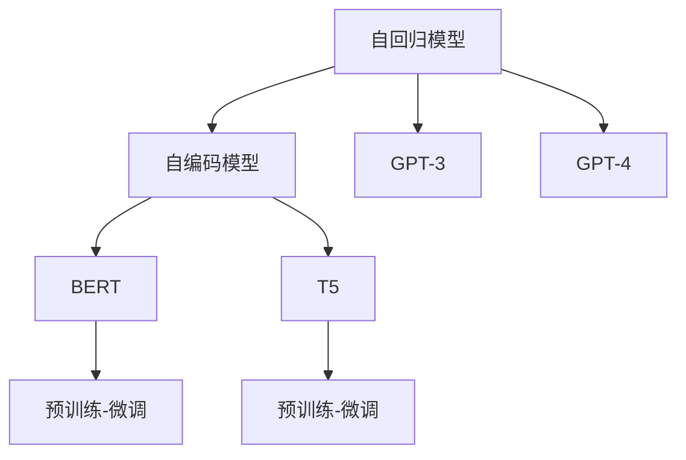

                 

# 语言模型对标：GPT 家族对比

> 关键词：GPT-3, GPT-4, GPT-J, BERT, T5, 语言模型对标

## 1. 背景介绍

### 1.1 问题由来

自2018年BERT发布以来，预训练语言模型(Pre-trained Language Model, PLM)迅速成为自然语言处理(Natural Language Processing, NLP)领域的热点。当前主流的大语言模型主要分为两类：自回归模型如GPT-3、GPT-4等，自编码模型如BERT、T5等。这些模型通过在大量无标签数据上预训练，学习语言表示，然后在特定任务上进行微调，可以显著提升下游任务的性能。

然而，不同模型之间的性能差异、应用场景适用性及参数规模等不同，给实际应用带来了一定的选择困难。如何理解这些模型的特点，找到合适的模型对标，对于NLP应用的效率和效果至关重要。本文将从原理、性能、应用场景等多个角度，对GPT家族的几个主流模型进行对比，帮助开发者选择最合适的模型进行应用。

## 2. 核心概念与联系

### 2.1 核心概念概述

为更好地理解GPT家族模型的对标，我们首先概述几个核心概念：

- **自回归模型**：如GPT-3、GPT-4等，这类模型在生成文本时，按照单词顺序，预测下一个单词的概率，具有"回溯"的特点，即能够利用已生成部分信息进行下一轮预测。

- **自编码模型**：如BERT、T5等，这类模型在预训练时，通过掩码语言模型、下一句预测等任务，学习文本表示，然后通过微调适应特定任务。

- **参数量**：不同模型之间的参数量差异较大，GPT-3参数量达1750亿，而BERT的参数量约1.17亿，参数量的大小直接影响到模型的推理速度和计算成本。

- **训练数据**：BERT是使用大规模无标签的英文维基百科数据进行预训练的，而GPT家族则是使用大规模的文本语料进行预训练，数据规模和语种的选择对模型的性能有着显著影响。

- **微调方式**：GPT家族的微调通常只需要调整顶层分类器或解码器，而BERT则需要微调整个模型。

这些核心概念构成了GPT家族模型的基本框架，其间的逻辑关系可以用以下Mermaid流程图来展示：



这个流程图展示了自回归模型和自编码模型之间的相互关系，以及GPT家族和BERT/T5之间的对标和微调差异。

## 3. 核心算法原理 & 具体操作步骤

### 3.1 算法原理概述

GPT家族的算法原理基于Transformer模型，其核心在于自回归或自编码的注意力机制。以GPT-3为例，其预训练过程主要包括语言建模任务，通过大量文本数据的自回归预测，学习语言规律。在微调过程中，通过特定任务的训练数据，对预训练模型进行微调，使其能够适应新的任务需求。

具体而言，GPT-3的微调步骤包括以下几个关键环节：

1. 加载预训练模型和微调数据集。
2. 选择微调的目标任务，如问答、文本分类、摘要生成等。
3. 添加任务适配层，如分类头、解码器等。
4. 设置微调超参数，如学习率、批大小、迭代轮数等。
5. 执行梯度训练，不断优化模型参数，直至收敛。
6. 在测试集上评估微调后的模型性能。

### 3.2 算法步骤详解

#### 3.2.1 加载预训练模型和微调数据集

```python
from transformers import GPT3LMHeadModel
from datasets import load_dataset

# 加载预训练模型
model = GPT3LMHeadModel.from_pretrained('gpt3-medium')

# 加载微调数据集
dataset = load_dataset('path/to/dataset', split='train')
```

#### 3.2.2 选择微调的目标任务

以文本分类为例，微调的任务是判断输入文本属于哪个类别：

```python
from transformers import AutoTokenizer, AutoConfig

# 加载微调任务相关的tokenizer和config
tokenizer = AutoTokenizer.from_pretrained('path/to/dataset')
config = AutoConfig.from_pretrained('path/to/dataset')

# 设置分类头的层数和输出大小
config.num_labels = len(set([label for sample in dataset['train'] for label in sample['labels']]))
config.return_dict = True

# 加载模型并设置头层
model = GPT3LMHeadModel.from_pretrained('gpt3-medium', config=config)
```

#### 3.2.3 添加任务适配层

在微调时，通常需要添加一个分类头，用于输出分类概率：

```python
# 加载模型并设置头层
model = GPT3LMHeadModel.from_pretrained('gpt3-medium', config=config)

# 将tokenizer和模型保存到预训练目录
tokenizer.save_pretrained('path/to/saved_model')
model.save_pretrained('path/to/saved_model')
```

#### 3.2.4 设置微调超参数

```python
from transformers import AdamW

# 设置优化器和学习率
optimizer = AdamW(model.parameters(), lr=5e-5)

# 设置迭代轮数和批大小
epochs = 3
batch_size = 16
```

#### 3.2.5 执行梯度训练

```python
# 设置验证集
validation_set = load_dataset('path/to/validation', split='train')

# 执行梯度训练
for epoch in range(epochs):
    model.train()
    for batch in tqdm(dataset, total=len(dataset)):
        input_ids = batch['input_ids']
        attention_mask = batch['attention_mask']
        labels = batch['labels']
        outputs = model(input_ids, attention_mask=attention_mask, labels=labels)
        loss = outputs.loss
        loss.backward()
        optimizer.step()
        model.zero_grad()
        
    # 在验证集上评估模型性能
    validation_loss = model.eval(validation_set)
    print(f"Epoch {epoch+1}, validation loss: {validation_loss:.3f}")
```

#### 3.2.6 测试和部署

在测试集上评估微调后的模型性能，并使用微调后的模型进行推理预测：

```python
# 在测试集上评估模型性能
test_dataset = load_dataset('path/to/test', split='train')
test_loss = model.eval(test_dataset)
print(f"Test loss: {test_loss:.3f}")

# 使用微调后的模型进行推理预测
model = GPT3LMHeadModel.from_pretrained('path/to/saved_model')
input_text = "Hello, world!"
input_ids = tokenizer(input_text, return_tensors='pt').input_ids
output = model(input_ids)
print(output)
```

### 3.3 算法优缺点

GPT家族的算法优点包括：

1. 生成能力强大：自回归模型在生成文本时具有很强的连贯性和逻辑性，生成的文本流畅自然，语言模型效果优越。
2. 参数高效微调：通过添加任务适配层，只需微调顶层，参数量大幅减小，提高微调效率。
3. 应用广泛：可用于多种下游任务，包括文本生成、摘要、对话、问答等。

缺点包括：

1. 数据依赖性强：GPT家族依赖于大规模预训练数据，数据量和语种的选择对模型效果影响大。
2. 计算资源消耗高：参数量大，推理速度慢，计算成本高。
3. 模型过拟合风险：仅微调顶层可能导致模型过拟合。

### 3.4 算法应用领域

GPT家族的模型在文本生成、摘要、对话系统、自然语言推理、翻译等诸多NLP任务上表现优异，其生成能力在机器翻译、创意写作、对话生成等应用中尤为重要。

- 机器翻译：GPT家族模型通过大量文本数据的预训练，具备很强的语言转换能力，可用于多种语言的翻译任务。
- 对话系统：自回归模型的生成能力使得GPT家族在对话系统构建中具有独特优势，能够生成自然流畅的对话内容。
- 摘要生成：通过微调GPT家族模型，可自动生成文本摘要，提升信息检索和整理的效率。
- 自然语言推理：模型在理解自然语言逻辑和推理方面表现优异，可用于文本的逻辑分析和判断。
- 创意写作：通过微调模型，可以自动生成具有一定文学性的文本，辅助创作和编辑。

## 4. 数学模型和公式 & 详细讲解 & 举例说明

### 4.1 数学模型构建

GPT-3的数学模型主要基于Transformer模型。其核心在于自回归的注意力机制，通过将目标序列的每个单词与所有源序列单词进行注意力计算，预测下一个单词的概率。以GPT-3为例，其数学模型构建如下：

1. 输入文本表示：
   \[
   \mathbf{X} = \{\mathbf{x}_1, \mathbf{x}_2, ..., \mathbf{x}_n\}
   \]
2. 自回归注意力计算：
   \[
   \mathbf{A} = \{\mathbf{a}_i\}_{i=1}^{n}
   \]
3. 输出概率计算：
   \[
   p(\mathbf{x}_{i+1}|\mathbf{x}_1, \mathbf{x}_2, ..., \mathbf{x}_i) = \frac{\exp(\mathbf{v}^T \mathbf{a}_i)}{\sum_{j=1}^n \exp(\mathbf{v}^T \mathbf{a}_j)}
   \]

其中，\(\mathbf{x}_i\) 表示输入序列的第 \(i\) 个单词，\(\mathbf{a}_i\) 表示第 \(i\) 个单词与所有源序列单词的注意力分数，\(\mathbf{v}\) 表示输出概率计算的向量。

### 4.2 公式推导过程

GPT-3的生成过程可以视为序列到序列的建模任务，目标函数为：
\[
\mathcal{L} = -\sum_{i=1}^{n} \log p(\mathbf{x}_{i+1}|\mathbf{x}_1, \mathbf{x}_2, ..., \mathbf{x}_i)
\]

其中，\(\mathbf{x}_{i+1}\) 表示下一个要预测的单词，\(\mathbf{x}_1, \mathbf{x}_2, ..., \mathbf{x}_i\) 表示已生成的部分单词。

通过对目标函数求导，可以得到损失函数对模型参数的梯度，从而进行模型参数的更新。具体的计算过程可以通过自动微分技术高效完成。

### 4.3 案例分析与讲解

以GPT-3的微调为例，假设我们希望在电影评论数据上微调模型，生成电影评分的概率分布。具体步骤如下：

1. 加载预训练模型和微调数据集。
2. 添加分类头，将模型的输出转换为评分。
3. 设置优化器和学习率，开始训练。
4. 在验证集上评估模型性能，调整超参数。
5. 在测试集上评估最终性能。

### 5. 项目实践：代码实例和详细解释说明

#### 5.1 开发环境搭建

开发环境搭建主要包括PyTorch和HuggingFace库的安装和配置。以下是一个基本的开发环境配置流程：

1. 安装Anaconda：
   ```bash
   conda create -n pytorch-env python=3.8
   conda activate pytorch-env
   ```

2. 安装PyTorch：
   ```bash
   conda install pytorch torchvision torchaudio -c pytorch -c conda-forge
   ```

3. 安装HuggingFace库：
   ```bash
   pip install transformers datasets
   ```

4. 配置Python环境：
   ```python
   import torch
   print(torch.cuda.is_available())
   ```

#### 5.2 源代码详细实现

以下是使用HuggingFace库对GPT-3进行电影评论评分微调的PyTorch代码实现。

```python
from transformers import GPT3LMHeadModel, GPT3Tokenizer
from datasets import load_dataset

# 加载预训练模型和tokenizer
model = GPT3LMHeadModel.from_pretrained('gpt3-medium')
tokenizer = GPT3Tokenizer.from_pretrained('gpt3-medium')

# 加载微调数据集
dataset = load_dataset('movie_reviews', split='train')

# 添加分类头
model = GPT3LMHeadModel.from_pretrained('gpt3-medium', config=GPT3LMHeadModelConfig(num_labels=5))
tokenizer = GPT3Tokenizer.from_pretrained('gpt3-medium')

# 设置优化器和学习率
optimizer = AdamW(model.parameters(), lr=1e-5)

# 设置迭代轮数和批大小
epochs = 3
batch_size = 32

# 执行梯度训练
for epoch in range(epochs):
    model.train()
    for batch in tqdm(dataset, total=len(dataset)):
        input_ids = batch['input_ids']
        attention_mask = batch['attention_mask']
        labels = batch['labels']
        outputs = model(input_ids, attention_mask=attention_mask, labels=labels)
        loss = outputs.loss
        loss.backward()
        optimizer.step()
        model.zero_grad()
        
    # 在验证集上评估模型性能
    validation_loss = model.eval(validation_set)
    print(f"Epoch {epoch+1}, validation loss: {validation_loss:.3f}")

# 在测试集上评估模型性能
test_loss = model.eval(test_dataset)
print(f"Test loss: {test_loss:.3f}")
```

#### 5.3 代码解读与分析

以上代码实现了对GPT-3的微调过程，具体解读如下：

- 使用GPT3LMHeadModel类加载预训练模型和tokenizer。
- 加载微调数据集，添加分类头，设置优化器和学习率。
- 在训练集上执行梯度训练，每次迭代更新模型参数。
- 在验证集上评估模型性能，调整超参数。
- 在测试集上评估最终性能。

#### 5.4 运行结果展示

运行上述代码后，可以得到模型在验证集和测试集上的损失值，从而评估微调效果。

## 6. 实际应用场景

### 6.1 智能客服系统

智能客服系统是GPT家族模型的一个重要应用场景。通过微调，GPT家族模型可以生成自然流畅的对话内容，解决用户提出的各种问题，提升客户咨询体验和问题解决效率。

具体而言，智能客服系统可以分为三个部分：
1. 数据收集和预处理：收集客户咨询记录，提取问题和答案对，进行清洗和标注。
2. 模型训练和微调：使用微调后的GPT家族模型，生成对话回复，进行标注。
3. 系统部署和监控：将微调后的模型部署到生产环境中，实时处理客户咨询请求，监控系统运行状态。

### 6.2 金融舆情监测

金融舆情监测是大模型在金融领域的重要应用。通过微调GPT家族模型，可以实时监测市场舆论动向，及时应对负面信息传播，规避金融风险。

具体而言，金融舆情监测可以分为三个部分：
1. 数据收集和预处理：收集金融领域相关的新闻、报道、评论等文本数据，进行清洗和标注。
2. 模型训练和微调：使用微调后的GPT家族模型，判断文本的情感倾向，进行标注。
3. 系统部署和监控：将微调后的模型部署到金融系统中，实时监测舆情变化，生成报告，供决策参考。

### 6.3 个性化推荐系统

个性化推荐系统是GPT家族模型在电商、内容推荐等领域的重要应用。通过微调，GPT家族模型可以生成个性化推荐内容，提升用户体验。

具体而言，个性化推荐系统可以分为三个部分：
1. 数据收集和预处理：收集用户浏览、点击、评论、分享等行为数据，提取文本信息。
2. 模型训练和微调：使用微调后的GPT家族模型，生成推荐内容，进行用户画像分析。
3. 系统部署和监控：将微调后的模型部署到推荐系统中，实时生成推荐列表，监控系统性能。

### 6.4 未来应用展望

未来，GPT家族模型在NLP领域的应用前景将更加广阔。除了现有的应用场景，还有以下趋势：

1. 跨领域迁移学习：GPT家族模型在跨领域任务上的迁移能力将不断增强，能够更好地适应不同领域的数据分布。
2. 多模态融合：GPT家族模型将更多地与其他模态（如图像、语音等）进行融合，实现多模态信息的协同建模，提升任务处理能力。
3. 数据增强和数据扩充：通过数据增强和数据扩充技术，提升模型的泛化能力和鲁棒性。
4. 动态微调和模型更新：根据实时数据变化，动态调整模型参数，保持模型的时效性和准确性。

## 7. 工具和资源推荐

### 7.1 学习资源推荐

为了帮助开发者系统掌握GPT家族模型的微调技术，这里推荐一些优质的学习资源：

1. 《Transformer from Scratch》系列博文：由GPT家族模型专家撰写，深入浅出地介绍了Transformer原理、微调技术等前沿话题。
2. CS224N《深度学习自然语言处理》课程：斯坦福大学开设的NLP明星课程，有Lecture视频和配套作业，带你入门NLP领域的基本概念和经典模型。
3. 《Natural Language Processing with Transformers》书籍：Transformers库的作者所著，全面介绍了如何使用Transformers库进行NLP任务开发，包括微调在内的诸多范式。
4. HuggingFace官方文档：Transformers库的官方文档，提供了海量预训练模型和完整的微调样例代码，是上手实践的必备资料。
5. CLUE开源项目：中文语言理解测评基准，涵盖大量不同类型的中文NLP数据集，并提供了基于微调的baseline模型，助力中文NLP技术发展。

通过对这些资源的学习实践，相信你一定能够快速掌握GPT家族模型的微调精髓，并用于解决实际的NLP问题。

### 7.2 开发工具推荐

高效的开发离不开优秀的工具支持。以下是几款用于GPT家族模型微调开发的常用工具：

1. PyTorch：基于Python的开源深度学习框架，灵活动态的计算图，适合快速迭代研究。大部分预训练语言模型都有PyTorch版本的实现。
2. TensorFlow：由Google主导开发的开源深度学习框架，生产部署方便，适合大规模工程应用。同样有丰富的预训练语言模型资源。
3. Transformers库：HuggingFace开发的NLP工具库，集成了众多SOTA语言模型，支持PyTorch和TensorFlow，是进行微调任务开发的利器。
4. Weights & Biases：模型训练的实验跟踪工具，可以记录和可视化模型训练过程中的各项指标，方便对比和调优。与主流深度学习框架无缝集成。
5. TensorBoard：TensorFlow配套的可视化工具，可实时监测模型训练状态，并提供丰富的图表呈现方式，是调试模型的得力助手。
6. Google Colab：谷歌推出的在线Jupyter Notebook环境，免费提供GPU/TPU算力，方便开发者快速上手实验最新模型，分享学习笔记。

合理利用这些工具，可以显著提升GPT家族模型微调任务的开发效率，加快创新迭代的步伐。

### 7.3 相关论文推荐

GPT家族模型和微调技术的发展源于学界的持续研究。以下是几篇奠基性的相关论文，推荐阅读：

1. Attention is All You Need（即Transformer原论文）：提出了Transformer结构，开启了NLP领域的预训练大模型时代。
2. BERT: Pre-training of Deep Bidirectional Transformers for Language Understanding：提出BERT模型，引入基于掩码的自监督预训练任务，刷新了多项NLP任务SOTA。
3. Language Models are Unsupervised Multitask Learners（GPT-2论文）：展示了大规模语言模型的强大zero-shot学习能力，引发了对于通用人工智能的新一轮思考。
4. Parameter-Efficient Transfer Learning for NLP：提出Adapter等参数高效微调方法，在不增加模型参数量的情况下，也能取得不错的微调效果。
5. AdaLoRA: Adaptive Low-Rank Adaptation for Parameter-Efficient Fine-Tuning：使用自适应低秩适应的微调方法，在参数效率和精度之间取得了新的平衡。
6. Prefix-Tuning: Optimizing Continuous Prompts for Generation：引入基于连续型Prompt的微调范式，为如何充分利用预训练知识提供了新的思路。

这些论文代表了大模型微调技术的发展脉络。通过学习这些前沿成果，可以帮助研究者把握学科前进方向，激发更多的创新灵感。

## 8. 总结：未来发展趋势与挑战

### 8.1 总结

本文对GPT家族模型的微调技术进行了全面系统的介绍。首先阐述了GPT家族模型的背景和重要性，明确了微调在拓展预训练模型应用、提升下游任务性能方面的独特价值。其次，从原理到实践，详细讲解了GPT家族模型的微调过程，给出了微调任务开发的完整代码实例。同时，本文还广泛探讨了GPT家族模型在智能客服、金融舆情、个性化推荐等多个行业领域的应用前景，展示了微调范式的巨大潜力。此外，本文精选了微调技术的各类学习资源，力求为读者提供全方位的技术指引。

通过本文的系统梳理，可以看到，GPT家族模型的微调技术已经广泛应用于NLP领域，且在不断演进和优化，拓展了预训练语言模型的应用边界，催生了更多的落地场景。GPT家族模型的强大生成能力，使其在文本生成、对话生成、文本摘要等任务上表现出众。未来，随着模型的不断升级和微调技术的持续改进，GPT家族模型必将在更多的领域中大放异彩，推动NLP技术的发展和应用。

### 8.2 未来发展趋势

展望未来，GPT家族模型的微调技术将呈现以下几个发展趋势：

1. 模型规模持续增大。随着算力成本的下降和数据规模的扩张，GPT家族模型的参数量还将持续增长。超大规模语言模型蕴含的丰富语言知识，有望支撑更加复杂多变的下游任务微调。
2. 微调方法日趋多样。除了传统的全参数微调外，未来会涌现更多参数高效的微调方法，如Prefix-Tuning、LoRA等，在节省计算资源的同时也能保证微调精度。
3. 持续学习成为常态。随着数据分布的不断变化，微调模型也需要持续学习新知识以保持性能。如何在不遗忘原有知识的同时，高效吸收新样本信息，将成为重要的研究课题。
4. 标注样本需求降低。受启发于提示学习(Prompt-based Learning)的思路，未来的微调方法将更好地利用GPT家族模型的语言理解能力，通过更加巧妙的任务描述，在更少的标注样本上也能实现理想的微调效果。
5. 多模态微调崛起。当前的微调主要聚焦于纯文本数据，未来会进一步拓展到图像、视频、语音等多模态数据微调。多模态信息的融合，将显著提升语言模型对现实世界的理解和建模能力。
6. 模型通用性增强。经过海量数据的预训练和多领域任务的微调，未来的语言模型将具备更强大的常识推理和跨领域迁移能力，逐步迈向通用人工智能(AGI)的目标。

以上趋势凸显了GPT家族模型微调技术的广阔前景。这些方向的探索发展，必将进一步提升NLP系统的性能和应用范围，为人类认知智能的进化带来深远影响。

### 8.3 面临的挑战

尽管GPT家族模型的微调技术已经取得了瞩目成就，但在迈向更加智能化、普适化应用的过程中，它仍面临着诸多挑战：

1. 标注成本瓶颈。虽然微调大大降低了标注数据的需求，但对于长尾应用场景，难以获得充足的高质量标注数据，成为制约微调性能的瓶颈。如何进一步降低微调对标注样本的依赖，将是一大难题。
2. 模型鲁棒性不足。当前微调模型面对域外数据时，泛化性能往往大打折扣。对于测试样本的微小扰动，微调模型的预测也容易发生波动。如何提高微调模型的鲁棒性，避免灾难性遗忘，还需要更多理论和实践的积累。
3. 推理效率有待提高。超大参数量的GPT家族模型虽然精度高，但在实际部署时往往面临推理速度慢、内存占用大等效率问题。如何在保证性能的同时，简化模型结构，提升推理速度，优化资源占用，将是重要的优化方向。
4. 可解释性亟需加强。当前微调模型更像是"黑盒"系统，难以解释其内部工作机制和决策逻辑。对于医疗、金融等高风险应用，算法的可解释性和可审计性尤为重要。如何赋予微调模型更强的可解释性，将是亟待攻克的难题。
5. 安全性有待保障。预训练语言模型难免会学习到有偏见、有害的信息，通过微调传递到下游任务，产生误导性、歧视性的输出，给实际应用带来安全隐患。如何从数据和算法层面消除模型偏见，避免恶意用途，确保输出的安全性，也将是重要的研究课题。
6. 知识整合能力不足。现有的微调模型往往局限于任务内数据，难以灵活吸收和运用更广泛的先验知识。如何让微调过程更好地与外部知识库、规则库等专家知识结合，形成更加全面、准确的信息整合能力，还有很大的想象空间。

正视GPT家族模型微调面临的这些挑战，积极应对并寻求突破，将是大模型微调走向成熟的必由之路。相信随着学界和产业界的共同努力，这些挑战终将一一被克服，GPT家族模型微调必将在构建人机协同的智能时代中扮演越来越重要的角色。

### 8.4 研究展望

面向未来，GPT家族模型的微调技术需要在以下几个方向进行深入研究：

1. 探索无监督和半监督微调方法。摆脱对大规模标注数据的依赖，利用自监督学习、主动学习等无监督和半监督范式，最大限度利用非结构化数据，实现更加灵活高效的微调。
2. 研究参数高效和计算高效的微调范式。开发更加参数高效的微调方法，在固定大部分预训练参数的同时，只更新极少量的任务相关参数。同时优化微调模型的计算图，减少前向传播和反向传播的资源消耗，实现更加轻量级、实时性的部署。
3. 融合因果和对比学习范式。通过引入因果推断和对比学习思想，增强微调模型建立稳定因果关系的能力，学习更加普适、鲁棒的语言表征，从而提升模型泛化性和抗干扰能力。
4. 引入更多先验知识。将符号化的先验知识，如知识图谱、逻辑规则等，与神经网络模型进行巧妙融合，引导微调过程学习更准确、合理的语言模型。同时加强不同模态数据的整合，实现视觉、语音等多模态信息与文本信息的协同建模。
5. 结合因果分析和博弈论工具。将因果分析方法引入微调模型，识别出模型决策的关键特征，增强输出解释的因果性和逻辑性。借助博弈论工具刻画人机交互过程，主动探索并规避模型的脆弱点，提高系统稳定性。
6. 纳入伦理道德约束。在模型训练目标中引入伦理导向的评估指标，过滤和惩罚有偏见、有害的输出倾向。同时加强人工干预和审核，建立模型行为的监管机制，确保输出符合人类价值观和伦理道德。

这些研究方向的探索，必将引领GPT家族模型微调技术迈向更高的台阶，为构建安全、可靠、可解释、可控的智能系统铺平道路。面向未来，GPT家族模型微调技术还需要与其他人工智能技术进行更深入的融合，如知识表示、因果推理、强化学习等，多路径协同发力，共同推动自然语言理解和智能交互系统的进步。只有勇于创新、敢于突破，才能不断拓展语言模型的边界，让智能技术更好地造福人类社会。

## 9. 附录：常见问题与解答

**Q1：GPT-3和GPT-4的参数量有何差异？**

A: GPT-3的参数量约为1750亿，而GPT-4的参数量更是突破了3000亿。这种巨大的参数量差异直接影响到模型的推理速度和计算成本。因此，GPT-4在实际应用中需要更强大的硬件资源支持，才能保证高性能的推理性能。

**Q2：微调GPT家族模型时如何选择超参数？**

A: 超参数的选择通常需要根据具体任务和数据集进行调优。常见的超参数包括学习率、批大小、迭代轮数等。建议从较小的学习率开始，逐步增加到预设值，同时进行早停策略，避免过拟合。

**Q3：GPT家族模型在微调时如何处理多模态数据？**

A: GPT家族模型通常用于处理文本数据，如果需要处理多模态数据，可以在模型输入中增加额外的特征向量，如图像特征、音频特征等。通过多模态数据融合技术，可以增强模型的泛化能力和鲁棒性。

**Q4：GPT家族模型在微调时如何处理长文本数据？**

A: GPT家族模型在微调时，通常需要对输入文本进行分词和截断处理，以控制模型输入的长度。长文本数据可以通过分块、分词等方式进行处理，保证模型可以处理任意长度的文本。

**Q5：GPT家族模型在微调时如何避免过拟合？**

A: 避免过拟合的方法包括数据增强、正则化、早停等。数据增强可以通过回译、近义词替换等方式扩充训练集。正则化可以通过L2正则、Dropout等技术防止模型过度拟合。早停策略可以在模型在验证集上性能不再提升时停止训练，避免过拟合。

---

作者：禅与计算机程序设计艺术 / Zen and the Art of Computer Programming

