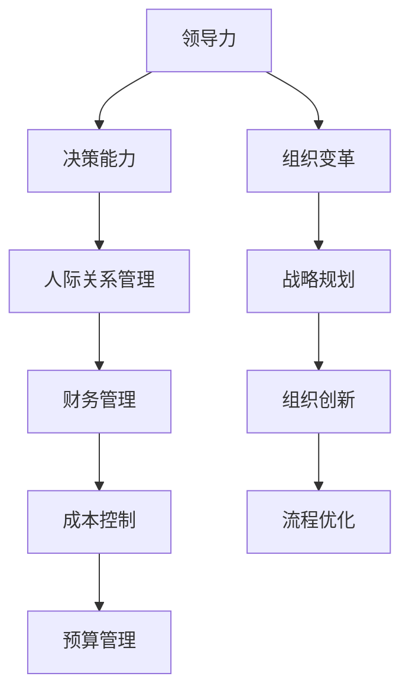

                 

# 读经典书籍:为管理者打造知识根基

> 关键词：管理者，知识根基，经典书籍，阅读方法，管理实践，领导力，决策能力，创新思维

## 1. 背景介绍

### 1.1 问题由来

在现代社会中，管理者是企业和组织的灵魂，他们不仅要掌握大量的专业知识，还需要具备出色的领导力和决策能力。然而，在快速变化和复杂多变的商业环境中，许多管理者往往感到知识储备不足，难以应对新的挑战。因此，如何通过有效的阅读和管理方法，不断提升自己的知识和技能，成为每个管理者必须面对的重要问题。

经典书籍作为人类智慧的结晶，不仅涵盖了广泛的知识领域，还蕴含着深刻的管理哲学和实践经验。通过深入阅读经典书籍，管理者可以汲取前人的智慧，提升自身的知识根基，从而更好地应对工作中的各种复杂情况。

### 1.2 问题核心关键点

管理经典书籍的内容涵盖了多个方面，包括但不限于：

- 领导力和决策能力：如何做出明智的决策，如何构建高效的团队。
- 人际关系管理：如何处理员工间的矛盾，如何激励团队成员。
- 组织变革与创新：如何应对变革，如何推动组织创新。
- 战略规划：如何制定和实施有效的战略，如何优化组织结构。
- 财务管理：如何理解和应用财务报表，如何进行预算和成本控制。

掌握这些核心内容，管理者可以在面对复杂多变的商业环境时，更加从容不迫，做出更加合理的决策，带领团队实现持续发展。

### 1.3 问题研究意义

深入阅读和管理经典书籍，对于提升管理者的知识根基具有重要意义：

1. 提升决策能力：经典书籍中蕴含着丰富的决策智慧，管理者可以通过学习这些知识，提升自己的决策能力和应对复杂情况的能力。
2. 增强领导力：经典书籍中包含了许多领导力的实践案例，管理者可以从中学习到如何更好地领导团队，激发团队成员的潜力。
3. 优化管理技能：经典书籍中的管理理论和实践经验，可以帮助管理者提升组织管理、人力资源管理等技能，实现组织的高效运作。
4. 推动组织创新：经典书籍中关于创新思维和组织变革的讨论，可以为管理者提供新的视角和方法，推动组织持续创新。

## 2. 核心概念与联系

### 2.1 核心概念概述

以下是管理者阅读和管理经典书籍时需要注意的一些核心概念：

- 领导力(Leadership)：指在组织中引导和影响他人，实现组织目标的能力。
- 决策能力(Decision-Making)：指在复杂情况下，做出明智选择的能力。
- 组织变革(Change Management)：指在组织内部进行结构、流程和文化的变革，以适应外部环境的变化。
- 人际关系管理(Interpersonal Skills)：指在组织内部处理员工关系和冲突的能力。
- 战略规划(Strategic Planning)：指制定和实施长期发展计划，实现组织的持续发展。
- 财务管理(Financial Management)：指理解和使用财务信息，进行预算和成本控制，提升组织盈利能力。

这些概念之间存在紧密的联系，管理者需要综合运用这些知识，才能有效地管理工作和组织。

### 2.2 核心概念原理和架构的 Mermaid 流程图



这个流程图展示了领导力、决策能力、组织变革、人际关系管理、战略规划、财务管理等核心概念之间的联系，以及这些概念如何共同作用，提升管理者的知识根基。

## 3. 核心算法原理 & 具体操作步骤

### 3.1 算法原理概述

管理者阅读和管理经典书籍的过程，实际上是一种基于监督学习的知识获取和应用过程。通过阅读经典书籍，管理者可以获得关于领导力、决策能力等方面的知识和经验，然后在实际工作中应用这些知识，从而提升自身的管理能力。

具体而言，管理者阅读和管理经典书籍可以分为以下几个步骤：

1. 选择合适的经典书籍。
2. 制定阅读计划，明确阅读目标。
3. 深入阅读书籍，理解核心概念和实践方法。
4. 将学到的知识应用到实际管理工作中，进行反思和调整。
5. 定期回顾和更新知识体系，持续提升管理能力。

### 3.2 算法步骤详解

以下是具体的操作方法：

#### 第一步：选择经典书籍

1. 确定阅读方向：管理者需要根据自己的管理需求和兴趣，选择适合的阅读方向。例如，可以聚焦于领导力、战略规划、财务管理等方向。
2. 选择经典书籍：管理者可以参考相关推荐书单和评价，选择有影响力的经典书籍，例如《第五项修炼》、《从优秀到卓越》、《创新者的窘境》等。

#### 第二步：制定阅读计划

1. 制定阅读目标：管理者需要明确自己希望通过阅读获得哪些知识和技能，例如，提升决策能力、增强领导力等。
2. 设定阅读时间：管理者需要制定一个合理的阅读计划，例如，每天阅读1小时，每周完成一本经典书籍。

#### 第三步：深入阅读书籍

1. 阅读核心内容：管理者需要集中精力阅读书籍的核心章节，理解其中的核心概念和实践方法。
2. 记录关键点：管理者需要记录下书中关键的要点和思考，例如，如何处理团队冲突、如何制定战略等。

#### 第四步：应用知识

1. 实践反思：管理者需要在实际工作中应用学到的知识，并进行反思和调整。例如，如何将书籍中提到的决策方法应用到实际的商业决策中。
2. 反馈改进：管理者需要收集反馈，评估应用效果，并根据反馈进行调整和改进。

#### 第五步：定期回顾和更新

1. 定期回顾：管理者需要定期回顾和总结已学知识，例如，每季度回顾一次，评估自己的知识体系和应用效果。
2. 持续学习：管理者需要持续学习和更新自己的知识体系，例如，通过参加管理培训、阅读最新文献等方式。

### 3.3 算法优缺点

#### 优点：

1. 系统性强：经典书籍的系统性和深度可以帮助管理者建立全面的知识体系，提升管理能力。
2. 实践性强：经典书籍中的理论和实践方法，可以帮助管理者在实际工作中更好地应用。
3. 长效影响：经典书籍中的知识和方法具有长效性，管理者可以持续从中受益。

#### 缺点：

1. 阅读难度大：经典书籍往往内容深奥，管理者需要投入大量时间和精力进行阅读和理解。
2. 实践应用难度高：经典书籍中的理论和实践方法需要管理者进行灵活应用，有时难以直接应用到实际管理工作中。
3. 更新缓慢：经典书籍通常更新速度较慢，管理者需要关注最新管理理论和实践。

### 3.4 算法应用领域

经典书籍的知识和方法广泛应用于多个领域，例如：

- 企业管理：管理者可以通过阅读经典书籍，掌握企业战略、组织变革等知识，提升企业管理的效率和效果。
- 项目管理：管理者可以通过学习经典项目管理的理论和方法，提升项目管理和团队协作的能力。
- 人力资源管理：管理者可以通过阅读经典人力资源管理书籍，掌握人员招聘、绩效管理等技能，提升人力资源管理的水平。
- 财务管理：管理者可以通过学习财务管理经典书籍，提升对财务报表的理解和应用能力，进行有效的预算和成本控制。
- 创新管理：管理者可以通过阅读创新管理经典书籍，学习如何推动组织创新，提升创新能力。

## 4. 数学模型和公式 & 详细讲解 & 举例说明

### 4.1 数学模型构建

管理者阅读和管理经典书籍的过程，可以抽象为一个知识获取和应用的过程。具体而言，可以构建以下数学模型：

1. 输入：经典书籍和相关知识资源。
2. 处理：管理者对输入知识的理解和内化。
3. 输出：管理者的知识和技能提升。

### 4.2 公式推导过程

这里使用简单的决策模型来说明：

1. 输入：假设经典书籍中提供了一个关于决策的模型，例如，SWOT分析模型。
2. 处理：管理者通过学习SWOT分析模型的具体步骤和方法，将其应用到实际的商业决策中。
3. 输出：管理者通过SWOT分析，制定和实施决策，提升决策能力。

### 4.3 案例分析与讲解

#### 案例：领导力提升

1. 输入：阅读经典领导力书籍，如《领导力挑战》。
2. 处理：学习书中关于领导力的理论和方法，例如，如何进行有效的团队建设、如何激发员工潜力。
3. 输出：管理者在实际工作中应用这些知识，提升领导力，例如，通过团队建设活动，提升团队的凝聚力和战斗力。

## 5. 项目实践：代码实例和详细解释说明

### 5.1 开发环境搭建

管理者阅读和管理经典书籍，并不需要编写代码，但可以借助一些工具和资源来提升阅读效果。以下是一些推荐工具：

1. **阅读笔记工具**：例如OneNote、Notion等，可以帮助管理者记录和整理读书笔记。
2. **在线图书馆**：例如Google Scholar、Project Gutenberg等，可以提供丰富的经典书籍资源。
3. **知识管理工具**：例如Confluence、Evernote等，可以帮助管理者整理和管理知识体系。

### 5.2 源代码详细实现

虽然阅读和管理经典书籍不需要编写代码，但可以将阅读过程转化为一个简单的项目，使用代码进行辅助。例如，可以编写一个Python脚本，自动从在线图书馆下载和组织经典书籍，并生成阅读计划和笔记记录。

```python
import requests
from bs4 import BeautifulSoup

# 从在线图书馆下载书籍
url = 'https://example.com/library'
response = requests.get(url)
soup = BeautifulSoup(response.content, 'html.parser')
book_links = soup.find_all('a', href=True)

# 生成阅读计划
reading_plan = []
for book_link in book_links:
    title = book_link.text
    if 'leadership' in title.lower():
        reading_plan.append({'title': title, 'start_date': '2023-01-01', 'end_date': '2023-04-01'})
    elif 'decision' in title.lower():
        reading_plan.append({'title': title, 'start_date': '2023-04-01', 'end_date': '2023-07-01'})
    # 其他条件可以扩展
```

### 5.3 代码解读与分析

这个简单的Python脚本展示了如何使用网络爬虫技术，从在线图书馆自动下载和组织经典书籍。管理者可以使用类似的方法，自动生成阅读计划和笔记记录，提高阅读效率和管理效果。

### 5.4 运行结果展示

通过执行上述代码，管理者可以自动生成一个包含领导力、决策能力等主题的阅读计划，并记录下相应的读书笔记。这些笔记可以整合到知识管理工具中，方便后续的复习和应用。

## 6. 实际应用场景

### 6.1 企业管理

#### 应用场景：企业战略规划

管理者可以通过阅读经典战略规划书籍，如《蓝海战略》，掌握如何制定和实施战略，提升企业竞争力。具体步骤：

1. 阅读经典书籍，学习战略规划的理论和方法。
2. 将学到的知识应用到企业的战略规划中，例如，进行SWOT分析，制定和实施战略。
3. 定期回顾和评估战略效果，进行优化和调整。

### 6.2 项目管理

#### 应用场景：项目团队管理

管理者可以通过阅读经典项目管理书籍，如《敏捷项目管理》，提升项目管理能力。具体步骤：

1. 阅读经典书籍，学习项目管理的方法和工具，例如，敏捷开发、Scrum框架。
2. 在实际项目管理中应用这些方法，例如，组建Scrum团队，进行敏捷开发。
3. 定期回顾和总结项目管理效果，进行改进和优化。

### 6.3 人力资源管理

#### 应用场景：人员招聘和绩效管理

管理者可以通过阅读经典人力资源管理书籍，如《人力资源管理》，掌握人员招聘和绩效管理的技能。具体步骤：

1. 阅读经典书籍，学习人员招聘和绩效管理的理论和实践方法。
2. 在实际的人力资源管理中应用这些方法，例如，制定招聘计划，进行绩效考核。
3. 定期评估招聘和绩效管理效果，进行优化和调整。

### 6.4 财务管理

#### 应用场景：预算和成本控制

管理者可以通过阅读经典财务管理书籍，如《财务报表分析》，提升财务管理和成本控制的能力。具体步骤：

1. 阅读经典书籍，学习财务报表和成本控制的知识和方法。
2. 在实际的财务管理和成本控制中应用这些方法，例如，制定预算计划，进行成本控制。
3. 定期评估财务和成本控制效果，进行优化和调整。

### 6.5 创新管理

#### 应用场景：推动组织创新

管理者可以通过阅读经典创新管理书籍，如《创新者的窘境》，推动组织创新。具体步骤：

1. 阅读经典书籍，学习创新的理论和方法，例如，如何进行创新管理，如何打破思维定势。
2. 在实际的组织管理中应用这些方法，例如，设立创新实验室，推动技术创新。
3. 定期评估创新管理效果，进行优化和调整。

## 7. 工具和资源推荐

### 7.1 学习资源推荐

管理者可以通过以下学习资源，提升自身的知识根基：

1. **《第五项修炼》**：作者彼得·圣吉，系统介绍了系统思考、自我超越等理论，提升管理者的系统思维能力。
2. **《从优秀到卓越》**：作者吉姆·柯林斯，通过研究优秀企业的案例，提炼出成功管理的要素。
3. **《创新者的窘境》**：作者克莱顿·克里斯滕森，探讨了创新管理中的矛盾和挑战，如何避免创新窘境。
4. **《领导者》**：作者吉姆·科林斯，介绍了成功领导者的核心素质和行为。
5. **《变革的力量》**：作者约翰·科特，介绍了如何有效管理组织变革。

### 7.2 开发工具推荐

管理者可以通过以下开发工具，提升阅读和管理效率：

1. **阅读笔记工具**：例如OneNote、Notion等，可以记录和管理读书笔记。
2. **在线图书馆**：例如Google Scholar、Project Gutenberg等，可以提供丰富的经典书籍资源。
3. **知识管理工具**：例如Confluence、Evernote等，可以整合和管理知识体系。

### 7.3 相关论文推荐

管理者可以通过以下论文，深入了解经典书籍中的理论和方法：

1. **《从优秀到卓越》论文**：作者吉姆·柯林斯，研究优秀企业案例，提炼出成功管理的要素。
2. **《创新者的窘境》论文**：作者克莱顿·克里斯滕森，探讨创新管理中的矛盾和挑战。
3. **《领导者》论文**：作者吉姆·科林斯，介绍成功领导者的核心素质和行为。
4. **《变革的力量》论文**：作者约翰·科特，介绍如何有效管理组织变革。

## 8. 总结：未来发展趋势与挑战

### 8.1 研究成果总结

管理者阅读和管理经典书籍的过程，实际上是一个基于监督学习的知识获取和应用过程。通过阅读经典书籍，管理者可以获得关于领导力、决策能力等方面的知识和经验，然后在实际工作中应用这些知识，从而提升自身的管理能力。

### 8.2 未来发展趋势

管理者阅读和管理经典书籍的未来发展趋势包括：

1. 数字化阅读：随着数字化技术的普及，管理者可以借助电子书、在线课程等数字工具，提升阅读效率。
2. 多样化阅读：管理者可以借助音频、视频等多元化阅读方式，提升阅读效果。
3. 跨领域阅读：管理者可以阅读不同领域的经典书籍，例如，经济学、心理学、工程学等，提升跨领域的综合能力。

### 8.3 面临的挑战

管理者阅读和管理经典书籍时，面临的挑战包括：

1. 阅读时间和精力有限：管理者需要在繁忙的工作中抽出时间进行阅读。
2. 知识应用难度高：经典书籍中的理论和实践方法需要管理者进行灵活应用，有时难以直接应用到实际管理工作中。
3. 知识更新速度慢：经典书籍通常更新速度较慢，管理者需要关注最新管理理论和实践。

### 8.4 研究展望

未来的研究可以从以下几个方向进行：

1. 研究如何提高经典书籍的可读性：例如，通过多媒体展示、互动式阅读等方式，提升经典书籍的可读性和吸引力。
2. 研究如何提升知识应用效果：例如，通过实际案例和项目实践，帮助管理者更好地应用经典书籍中的知识。
3. 研究如何结合最新的管理理论：例如，结合最新的研究成果，将经典书籍中的知识与现代管理实践相结合。

## 9. 附录：常见问题与解答

### Q1: 如何高效阅读经典书籍？

A: 管理者可以采用以下方法高效阅读经典书籍：

1. 制定阅读计划：明确阅读目标和时间，制定详细的阅读计划。
2. 选择阅读工具：使用阅读笔记工具和知识管理工具，记录和管理读书笔记。
3. 采用多样化阅读方式：例如，阅读纸质书和电子书相结合，利用音频和视频等多媒体形式。
4. 定期回顾和总结：定期回顾和总结阅读效果，进行反思和调整。

### Q2: 经典书籍中的理论和方法如何应用到实际管理中？

A: 管理者可以通过以下步骤将经典书籍中的理论和方法应用到实际管理中：

1. 学习经典书籍中的理论和方法，理解核心概念和实践步骤。
2. 在实际工作中应用这些理论和方法，例如，制定和实施战略、进行团队管理等。
3. 收集反馈和评估效果，根据反馈进行调整和改进。

### Q3: 如何提升管理者的系统思维能力？

A: 管理者可以通过以下方法提升系统思维能力：

1. 阅读经典书籍，例如《第五项修炼》，学习系统思考和自我超越的理论和方法。
2. 参加管理培训和课程，学习系统思维相关的理论和工具。
3. 在实际管理中应用系统思维，例如，进行系统分析和系统设计，提升决策能力。

### Q4: 如何推动组织创新？

A: 管理者可以通过以下方法推动组织创新：

1. 阅读经典书籍，例如《创新者的窘境》，学习创新管理的理论和实践方法。
2. 设立创新实验室和创新团队，推动技术创新和业务创新。
3. 制定和实施创新管理计划，例如，设立创新激励机制、推动跨部门合作等。

---

作者：禅与计算机程序设计艺术 / Zen and the Art of Computer Programming

