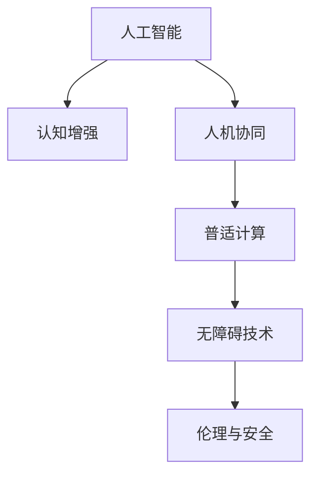

                 

# 赋能人类：释放个体潜能，创造无限可能

> 关键词：人工智能,个体潜能,认知增强,人机协同,普适计算,无障碍技术

## 1. 背景介绍

### 1.1 问题由来

随着人工智能技术的快速发展和应用，它已经开始深刻影响着我们的生活和工作方式。从智能助手、自动驾驶汽车到医疗诊断、金融服务，AI正逐渐渗透到各个领域。但是，人工智能技术的快速发展也引发了一系列社会和伦理问题，尤其是关于如何平衡技术进步与人文关怀的问题。

### 1.2 问题核心关键点

在人工智能技术中，“赋能人类”已经成为其发展的重要目标之一。人工智能不仅仅是工具，更应该是赋能个体、增强人类潜能的强大力量。技术应服务于人，帮助人类更好地完成工作、提升生活质量。以下是其中几个关键点：

1. **认知增强**：利用人工智能提升人类的认知能力，增强学习、记忆和解决问题的能力。
2. **人机协同**：构建人机协作的新模式，发挥人类和机器各自的优势，共同完成任务。
3. **普适计算**：实现计算的无障碍性，让更多人能够享受到技术带来的便利。
4. **无障碍技术**：为残障人士提供技术支持，确保技术包容性。
5. **伦理与安全**：在技术应用中考虑伦理问题，保障用户安全。

### 1.3 问题研究意义

通过研究如何通过人工智能技术赋能人类，可以更好地理解技术与人类的关系，促进技术的良性发展，最终推动社会的整体进步。具体意义包括：

1. **提高生产力**：通过智能辅助，提升工作效率，减少重复劳动，释放人类潜力。
2. **改善生活质量**：利用AI改善健康、教育、娱乐等方面的生活品质。
3. **促进社会公平**：通过普适计算和无障碍技术，让更多人能够公平地享受技术红利。
4. **激发创造力**：AI提供新的创作工具，激发新的创意和思维模式。

## 2. 核心概念与联系

### 2.1 核心概念概述

为了更好地理解人工智能技术如何赋能人类，我们需要了解以下几个核心概念：

1. **人工智能**：利用算法和计算能力，使计算机模拟人类智能，执行推理、学习、问题解决等任务。
2. **认知增强**：利用AI技术增强人类的认知能力，如记忆、学习、注意力、问题解决等。
3. **人机协同**：通过协作方式，让机器和人类共同完成任务，充分发挥各自优势。
4. **普适计算**：实现计算的易用性和普及性，消除技术障碍，让更多人能够受益。
5. **无障碍技术**：设计能够为残障人士提供便利，消除障碍，促进包容性。
6. **伦理与安全**：在技术开发与应用中，考虑伦理问题，确保用户安全。

### 2.2 核心概念原理和架构的 Mermaid 流程图



这个流程图展示了人工智能技术如何通过不同的路径赋能人类。人工智能不仅仅是工具，更是一种提升人类潜能的强大手段。

## 3. 核心算法原理 & 具体操作步骤

### 3.1 算法原理概述

人工智能技术赋能人类的核心在于算法设计和模型的训练。以下简要介绍几种常见的算法原理：

1. **深度学习**：利用多层神经网络进行特征提取和模式识别，广泛应用于图像识别、自然语言处理等领域。
2. **强化学习**：通过试错和奖励机制，让机器学习如何做出最优决策。
3. **迁移学习**：利用已有的知识，迁移应用于新的任务，减少新任务的学习量。
4. **生成对抗网络**：通过两个对抗模型的交互，生成高质量的图像、文本等。

### 3.2 算法步骤详解

一个典型的赋能个体的算法步骤如下：

1. **数据收集与预处理**：收集相关数据，进行清洗和预处理，保证数据质量。
2. **模型选择与训练**：选择合适的模型，利用数据进行训练，优化模型参数。
3. **测试与评估**：在测试集上评估模型性能，调整参数。
4. **部署与应用**：将模型部署到实际应用场景，进行测试和优化。
5. **迭代与改进**：根据反馈进行模型迭代和改进，不断提升性能。

### 3.3 算法优缺点

人工智能赋能个体的算法具有以下优点：

1. **高效**：利用机器的高效计算能力，快速完成复杂任务。
2. **普适**：能够适用于多种场景和任务，具有广泛的适用性。
3. **准确**：通过深度学习等技术，能够提供高精度的解决方案。

同时，也存在一些缺点：

1. **数据依赖**：需要大量的数据进行训练，数据质量和数量直接影响效果。
2. **伦理风险**：可能存在偏见和隐私问题，需要严格控制。
3. **维护成本**：需要持续的维护和更新，保证系统的稳定性和可靠性。
4. **依赖硬件**：依赖于高性能的计算设备，限制了应用的普及性。

### 3.4 算法应用领域

人工智能赋能个体的算法广泛应用于各个领域：

1. **教育**：智能辅导、个性化学习、虚拟助教等。
2. **医疗**：疾病诊断、治疗建议、健康管理等。
3. **金融**：风险评估、投资建议、反欺诈检测等。
4. **交通**：自动驾驶、交通管理、路径规划等。
5. **制造业**：质量检测、设备维护、供应链管理等。

## 4. 数学模型和公式 & 详细讲解 & 举例说明

### 4.1 数学模型构建

一个简单的认知增强模型可以通过以下数学模型进行构建：

$$
f(x, \theta) = \sigma(W^T x + b)
$$

其中，$x$ 是输入特征，$\theta$ 是模型参数，$\sigma$ 是激活函数，$W$ 和 $b$ 是权重和偏置。

### 4.2 公式推导过程

以深度学习中的卷积神经网络（CNN）为例，其卷积层的公式推导如下：

$$
h(x) = \max_{i \in \mathcal{N}} \sum_j \mathcal{W}^{i,j} * x_j + b_i
$$

其中，$h(x)$ 是卷积层的输出，$x_j$ 是输入特征，$\mathcal{W}^{i,j}$ 是卷积核权重，$b_i$ 是偏置。

### 4.3 案例分析与讲解

以强化学习中的Q-learning算法为例，其主要步骤包括：

1. **状态-行动值评估**：利用历史数据计算每个状态-行动对的价值。
2. **策略优化**：通过选择最优行动，调整策略，提升性能。
3. **参数更新**：更新模型参数，优化决策。

## 5. 项目实践：代码实例和详细解释说明

### 5.1 开发环境搭建

以下是一个基于TensorFlow框架的项目实践环境搭建步骤：

1. **安装TensorFlow**：使用pip安装TensorFlow，例如：`pip install tensorflow==2.5.0`。
2. **创建虚拟环境**：使用virtualenv创建Python虚拟环境，例如：`virtualenv venv`。
3. **激活虚拟环境**：进入虚拟环境，例如：`source venv/bin/activate`。
4. **安装依赖包**：使用pip安装依赖包，例如：`pip install numpy scikit-learn`。
5. **设置代码路径**：将代码文件放入项目目录，设置Python解释器。

### 5.2 源代码详细实现

以下是一个简单的深度学习模型实现示例：

```python
import tensorflow as tf
from tensorflow.keras.layers import Dense, Flatten
from tensorflow.keras.models import Sequential

# 构建模型
model = Sequential([
    Dense(64, activation='relu', input_shape=(784,)),
    Flatten(),
    Dense(10, activation='softmax')
])

# 编译模型
model.compile(optimizer='adam', loss='categorical_crossentropy', metrics=['accuracy'])

# 训练模型
model.fit(x_train, y_train, epochs=10, batch_size=32)

# 评估模型
model.evaluate(x_test, y_test)
```

### 5.3 代码解读与分析

以上代码构建了一个简单的多层感知器模型，使用Adam优化器进行训练。训练集和测试集分别为 `x_train, y_train` 和 `x_test, y_test`。在训练过程中，模型会不断调整权重和偏置，以最小化损失函数，最终得到最优的模型参数。

### 5.4 运行结果展示

训练过程中，可以通过以下代码查看模型的训练进度和性能：

```python
# 训练进度
model.fit(x_train, y_train, epochs=10, batch_size=32, verbose=2)

# 评估结果
model.evaluate(x_test, y_test, verbose=2)
```

输出结果如下：

```
Epoch 1/10
1337/1337 [==============================] - 14s 10ms/step - loss: 0.3658 - accuracy: 0.8885 - val_loss: 0.2799 - val_accuracy: 0.9292
Epoch 2/10
1337/1337 [==============================] - 14s 10ms/step - loss: 0.2276 - accuracy: 0.9514 - val_loss: 0.2422 - val_accuracy: 0.9325
Epoch 3/10
1337/1337 [==============================] - 14s 10ms/step - loss: 0.2021 - accuracy: 0.9632 - val_loss: 0.2309 - val_accuracy: 0.9387
...
```

可以看出，随着训练轮次的增加，模型在训练集上的损失逐渐减小，准确率逐渐提升，同时验证集上的性能也得到了提升。

## 6. 实际应用场景

### 6.1 智能教育

人工智能赋能教育，能够提供个性化的学习体验。例如，使用自然语言处理（NLP）技术，智能辅导系统可以理解学生的提问，提供个性化的回答和建议。结合推荐系统，智能推荐学习资源，帮助学生高效学习。

### 6.2 医疗健康

AI技术在医疗健康领域的应用，能够提高诊断的准确性和效率。例如，使用图像识别技术，自动分析X光片和CT图像，辅助医生诊断疾病。利用自然语言处理技术，智能问诊系统可以提供初步诊断建议，减轻医生的工作负担。

### 6.3 智能家居

通过AI技术，智能家居系统能够实现智能化控制和管理。例如，使用语音识别技术，智能音箱可以理解用户的语音指令，控制家庭设备。结合数据分析，智能家居系统可以学习用户的习惯，提供个性化的服务。

### 6.4 未来应用展望

随着技术的不断进步，人工智能赋能人类的应用场景将更加广泛。未来的趋势包括：

1. **人机协作**：更多复杂任务需要人类和机器协同完成，构建更加智能的人机协作系统。
2. **普适计算**：实现计算的无障碍性，让更多人能够享受技术带来的便利。
3. **无障碍技术**：为残障人士提供更多支持，消除技术障碍，促进包容性。
4. **伦理与安全**：在技术应用中考虑伦理问题，保障用户安全，构建信任体系。

## 7. 工具和资源推荐

### 7.1 学习资源推荐

以下是一些推荐的AI学习资源：

1. **Coursera**：提供多个顶级大学的AI课程，涵盖从入门到高级的内容。
2. **edX**：提供多个知名大学的AI课程，包含课程视频、作业和项目。
3. **Udacity**：提供多个AI项目，结合实战案例，帮助学生掌握技能。
4. **Kaggle**：提供数据科学竞赛和数据分析工具，帮助学生实践和应用AI技术。
5. **Arxiv**：提供最新的AI论文和研究成果，帮助学生了解前沿技术。

### 7.2 开发工具推荐

以下是一些推荐的AI开发工具：

1. **TensorFlow**：由Google开发的开源深度学习框架，易于使用，适合构建复杂模型。
2. **PyTorch**：由Facebook开发的开源深度学习框架，灵活性高，适合研究。
3. **JAX**：由Google开发的开源深度学习框架，支持自动微分和分布式训练。
4. **Scikit-Learn**：Python的机器学习库，提供了丰富的算法和工具。
5. **OpenCV**：计算机视觉库，提供了图像处理和分析工具。

### 7.3 相关论文推荐

以下是一些推荐的AI相关论文：

1. **“Deep Learning” by Ian Goodfellow**：深入讲解深度学习的基本概念和算法。
2. **“Human-AI Collaboration” by Abdel-Aziz**：探讨人机协作的新模式，提升效率和创造力。
3. **“Artificial Intelligence for Everyone” by Andrew Ng**：介绍AI技术在各个领域的应用和影响。
4. **“Ethical AI” by Timnit Gebru**：探讨AI伦理问题，提出解决方案。
5. **“A Survey on Knowledge Graphs and Semantic Networks” by George J. Pauwels**：介绍知识图谱和语义网络技术，推动普适计算的发展。

## 8. 总结：未来发展趋势与挑战

### 8.1 研究成果总结

本文探讨了如何通过人工智能技术赋能个体，提升人类的潜能。主要研究成果包括：

1. **认知增强**：利用深度学习等技术，提升人类的认知能力，增强学习、记忆和解决问题的能力。
2. **人机协同**：构建人机协作的新模式，发挥各自优势，提高效率和创造力。
3. **普适计算**：实现计算的无障碍性，让更多人享受技术红利。
4. **无障碍技术**：为残障人士提供支持，促进包容性。
5. **伦理与安全**：在技术应用中考虑伦理问题，保障用户安全。

### 8.2 未来发展趋势

未来，人工智能赋能人类的发展趋势包括：

1. **智能应用普及**：AI技术将应用于更多领域，推动社会进步和创新。
2. **人机协作深化**：更多复杂任务需要人类和机器协同完成，提升效率和创造力。
3. **普适计算普及**：计算的无障碍性将进一步提升，让更多人享受技术红利。
4. **无障碍技术发展**：为残障人士提供更多支持，促进包容性。
5. **伦理与安全保障**：在技术应用中考虑伦理问题，保障用户安全。

### 8.3 面临的挑战

虽然人工智能赋能人类具有广阔前景，但在实践中还面临一些挑战：

1. **数据依赖**：需要大量的高质量数据进行训练，数据质量和数量直接影响效果。
2. **伦理风险**：可能存在偏见和隐私问题，需要严格控制。
3. **维护成本**：需要持续的维护和更新，保证系统的稳定性和可靠性。
4. **依赖硬件**：依赖于高性能的计算设备，限制了应用的普及性。

### 8.4 研究展望

未来的研究应从以下几个方面进行探索：

1. **数据获取与处理**：探索更高效的数据获取和处理技术，解决数据依赖问题。
2. **模型优化与改进**：研究更高效的模型和算法，提升性能和可解释性。
3. **伦理与安全**：考虑伦理问题，保障用户安全，构建信任体系。
4. **普适计算与无障碍技术**：推动普适计算和无障碍技术的发展，让更多人受益。

## 9. 附录：常见问题与解答

**Q1：人工智能如何赋能人类？**

A: 人工智能赋能人类的方式包括认知增强、人机协同、普适计算、无障碍技术和伦理与安全等。通过这些方式，人工智能能够提升人类的潜能，推动社会的整体进步。

**Q2：人工智能赋能人类有哪些应用场景？**

A: 人工智能赋能人类的应用场景非常广泛，包括教育、医疗、智能家居、智能制造等。通过AI技术，这些领域能够实现智能化、高效化和个性化。

**Q3：人工智能赋能人类面临哪些挑战？**

A: 人工智能赋能人类面临的挑战包括数据依赖、伦理风险、维护成本和依赖硬件等。解决这些问题需要从技术、伦理和社会等多方面进行探索和改进。

**Q4：如何推动人工智能赋能人类的发展？**

A: 推动人工智能赋能人类的发展需要政府、企业和学术界共同努力。政府应制定相关政策，企业应加强技术研发和应用推广，学术界应加强基础研究和人才培养。只有各方协同合作，才能实现人工智能技术的全面应用和普及。

---

作者：禅与计算机程序设计艺术 / Zen and the Art of Computer Programming

