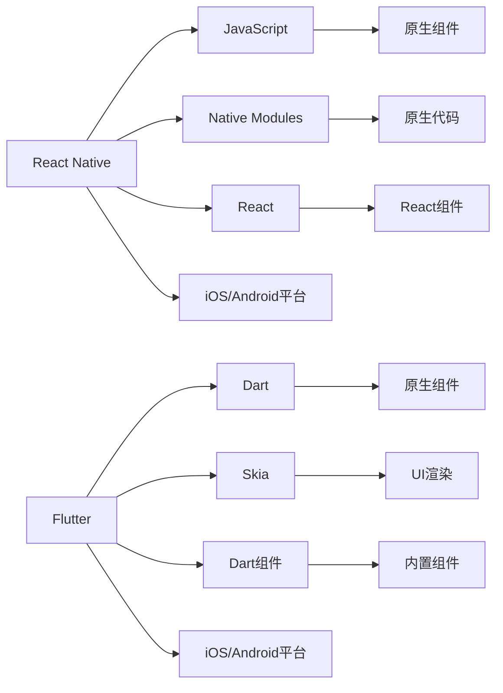

                 

# 跨平台移动开发：React Native vs Flutter

## 1. 背景介绍

随着移动端应用的飞速发展，企业对跨平台移动应用的需求越来越强烈。跨平台移动开发可以帮助企业实现一次开发，多端部署，大大减少开发成本和时间，提高开发效率。React Native和Flutter是目前跨平台移动开发的两大主流框架，但它们的技术栈和实现方式各有不同，性能和应用场景也有所差异。本文将从技术原理、优缺点、应用场景等多个方面对React Native和Flutter进行详细对比分析，帮助开发者选择最适合自身的跨平台开发框架。

## 2. 核心概念与联系

### 2.1 核心概念概述

#### React Native

React Native是由Facebook开发的一个开源框架，用于构建跨平台移动应用。它允许开发者使用React的技术栈进行移动应用的开发，支持iOS和Android平台。React Native通过JavaScript代码和本地模块（Native Modules）的交互来实现跨平台功能。React Native的核心组件是原生组件和自定义组件。开发者可以通过React Native提供的API来调用原生组件和系统API，从而实现复杂的用户界面和功能。

#### Flutter

Flutter是由Google开发的开源框架，用于构建跨平台移动应用。Flutter使用Dart语言进行开发，支持iOS和Android平台。与React Native不同，Flutter使用自己的渲染引擎——Skia，来渲染UI界面。Flutter的组件库是基于Skia的，因此可以实现高精度的UI渲染效果。Flutter还提供了许多内置组件和库，使得开发者可以快速构建复杂的应用程序。

### 2.2 核心概念联系

React Native和Flutter都致力于实现一次开发，多端部署，但它们的技术栈和实现方式有所不同。React Native基于React技术栈，使用原生组件和JavaScript进行开发，性能较低但开发效率较高。而Flutter使用自己的渲染引擎Skia，可以实现高精度的UI渲染效果，但开发效率相对较低。

以下是一个简化的Mermaid流程图，展示了React Native和Flutter的核心组件和技术栈：

## 3. 核心算法原理 & 具体操作步骤

### 3.1 算法原理概述

#### React Native

React Native的算法原理主要基于React的技术栈，通过将JavaScript代码转换为原生代码来实现跨平台功能。React Native使用原生组件和系统API来构建用户界面，因此可以实现与原生应用程序相同的性能。React Native还支持热重载（Hot Reloading）和动态加载模块，使得开发者可以实时查看代码更改并快速迭代开发。

#### Flutter

Flutter的算法原理基于Dart语言和Skia渲染引擎，使用自己的组件库来构建用户界面。Flutter通过将Dart代码编译为原生代码来实现跨平台功能。Flutter还支持高性能的图形渲染和动画效果，可以实现流畅的动画过渡和响应式UI。Flutter还提供了一个名为“组件树”的概念，使得开发者可以构建复杂的UI结构和动画效果。

### 3.2 算法步骤详解

#### React Native

1. 使用React Native的API和组件构建应用程序的用户界面。
2. 使用JavaScript代码编写应用程序的业务逻辑。
3. 通过原生模块（Native Modules）来调用原生组件和系统API。
4. 通过热重载（Hot Reloading）实时查看代码更改并快速迭代开发。

#### Flutter

1. 使用Dart语言编写应用程序的业务逻辑和UI结构。
2. 通过Skia渲染引擎将Dart代码编译为原生代码。
3. 使用内置组件和库构建复杂的UI结构和动画效果。
4. 通过组件树（Component Tree）管理应用程序的UI结构和组件关系。

### 3.3 算法优缺点

#### React Native

**优点：**

1. 开发效率高。使用JavaScript和React技术栈进行开发，上手容易，可以快速迭代开发。
2. 兼容性好。支持iOS和Android平台，可以使用原生组件和系统API，实现复杂的用户界面和功能。
3. 社区活跃。React Native有一个活跃的社区，可以获取到大量的插件和组件库。

**缺点：**

1. 性能较低。JavaScript代码转换为原生代码存在一定的性能损失，无法达到原生应用程序的性能水平。
2. 热重载影响用户体验。热重载会导致应用程序在修改代码时出现闪烁和卡顿现象，影响用户体验。

#### Flutter

**优点：**

1. 性能高。使用Skia渲染引擎，可以实现高精度的UI渲染效果和流畅的动画过渡。
2. 开发效率高。使用Dart语言和Flutter的组件库进行开发，可以构建复杂的UI结构和动画效果。
3. 代码可复用。Flutter的代码可以跨平台使用，减少了开发成本。

**缺点：**

1. 学习曲线陡峭。Dart语言和Flutter技术栈较为复杂，需要一定的学习成本。
2. 热重载效率较低。Flutter的热重载效率不如React Native，开发迭代速度较慢。
3. 插件库较少。Flutter的插件库相对较少，需要使用原生代码来实现复杂的业务逻辑。

### 3.4 算法应用领域

#### React Native

React Native适用于需要快速迭代开发和原型设计的应用程序。例如，快速开发移动应用的原型，快速上线推广等。React Native也适用于对性能要求不高的应用程序，例如简单的游戏、社交网络等。

#### Flutter

Flutter适用于对性能和UI效果要求较高的应用程序。例如，电商、游戏、教育等需要复杂UI和动画效果的应用程序。Flutter还适用于需要构建高性能图形界面的应用程序，例如AR、VR等。

## 4. 数学模型和公式 & 详细讲解

### 4.1 数学模型构建

#### React Native

React Native的数学模型主要基于React技术栈，通过JavaScript代码和原生模块的交互来实现跨平台功能。React Native使用组件树来管理UI结构和组件关系，通过原生模块来调用原生组件和系统API。

#### Flutter

Flutter的数学模型基于Dart语言和Skia渲染引擎，使用自己的组件库来构建用户界面。Flutter通过将Dart代码编译为原生代码来实现跨平台功能。Flutter还支持高性能的图形渲染和动画效果，可以实现流畅的动画过渡和响应式UI。

### 4.2 公式推导过程

#### React Native

React Native的公式推导过程主要基于React技术栈，使用原生组件和系统API来构建用户界面。React Native使用组件树来管理UI结构和组件关系，通过原生模块来调用原生组件和系统API。

#### Flutter

Flutter的公式推导过程基于Dart语言和Skia渲染引擎，使用自己的组件库来构建用户界面。Flutter通过将Dart代码编译为原生代码来实现跨平台功能。Flutter还支持高性能的图形渲染和动画效果，可以实现流畅的动画过渡和响应式UI。

### 4.3 案例分析与讲解

#### React Native

React Native的案例分析包括构建一个简单的跨平台移动应用，例如一个电商应用程序。开发者可以使用React Native的API和组件构建用户界面，使用JavaScript代码编写应用程序的业务逻辑，通过原生模块（Native Modules）来调用原生组件和系统API。

#### Flutter

Flutter的案例分析包括构建一个复杂的跨平台移动应用，例如一个游戏应用程序。开发者可以使用Dart语言编写应用程序的业务逻辑和UI结构，通过Skia渲染引擎将Dart代码编译为原生代码，使用内置组件和库构建复杂的UI结构和动画效果。

## 5. 项目实践：代码实例和详细解释说明

### 5.1 开发环境搭建

#### React Native

React Native的开发环境搭建包括安装Node.js、React Native CLI、Android Studio和Xcode等工具。开发者需要安装Android Studio和Xcode来构建和运行Android和iOS应用程序。

#### Flutter

Flutter的开发环境搭建包括安装Dart SDK、Flutter CLI和Android Studio或Xcode等工具。开发者需要安装Android Studio或Xcode来构建和运行Android和iOS应用程序。

### 5.2 源代码详细实现

#### React Native

React Native的源代码实现包括编写JavaScript代码、使用React Native的API和组件构建用户界面，使用原生模块（Native Modules）来调用原生组件和系统API。开发者可以使用React Native的示例代码和官方文档来快速上手。

#### Flutter

Flutter的源代码实现包括编写Dart代码、使用Flutter的API和组件库构建用户界面，通过Skia渲染引擎将Dart代码编译为原生代码。开发者可以使用Flutter的官方文档和示例代码来快速上手。

### 5.3 代码解读与分析

#### React Native

React Native的代码解读包括理解React Native的组件树、原生模块和热重载机制。开发者可以阅读React Native的官方文档和代码示例，了解这些机制的工作原理和使用方法。

#### Flutter

Flutter的代码解读包括理解Flutter的组件树、Skia渲染引擎和性能优化。开发者可以阅读Flutter的官方文档和代码示例，了解这些机制的工作原理和使用方法。

### 5.4 运行结果展示

#### React Native

React Native的运行结果展示包括调试应用程序、查看热重载效果和运行应用程序等。开发者可以使用React Native的调试工具和热重载功能，实时查看代码更改并快速迭代开发。

#### Flutter

Flutter的运行结果展示包括调试应用程序、查看热重载效果和运行应用程序等。开发者可以使用Flutter的调试工具和热重载功能，实时查看代码更改并快速迭代开发。

## 6. 实际应用场景

### 6.1 跨平台应用开发

React Native和Flutter都适用于跨平台应用开发。React Native适用于快速开发和原型设计，例如快速开发移动应用的原型，快速上线推广等。Flutter适用于对性能和UI效果要求较高的应用程序，例如电商、游戏、教育等需要复杂UI和动画效果的应用程序。

### 6.2 高性能图形界面

Flutter适用于需要构建高性能图形界面的应用程序，例如AR、VR等。Flutter的图形渲染和动画效果非常出色，可以实现流畅的动画过渡和响应式UI。

## 7. 工具和资源推荐

### 7.1 学习资源推荐

#### React Native

1. React Native官方文档：React Native官方文档是学习React Native的最佳资源，提供了详细的API文档、组件库和使用指南。
2. React Native课程：Udemy、Coursera等平台上有许多React Native的在线课程，可以帮助开发者快速上手。

#### Flutter

1. Flutter官方文档：Flutter官方文档是学习Flutter的最佳资源，提供了详细的API文档、组件库和使用指南。
2. Flutter课程：Udemy、Coursera等平台上有许多Flutter的在线课程，可以帮助开发者快速上手。

### 7.2 开发工具推荐

#### React Native

1. Android Studio和Xcode：用于构建和运行Android和iOS应用程序。
2. React Native CLI：用于管理React Native项目和构建应用程序。

#### Flutter

1. Android Studio和Xcode：用于构建和运行Android和iOS应用程序。
2. Flutter CLI：用于管理Flutter项目和构建应用程序。

### 7.3 相关论文推荐

#### React Native

1. React Native技术白皮书：React Native官方发布的白皮书，详细介绍了React Native的技术栈和实现方式。
2. React Native性能优化：关于React Native性能优化的多篇论文，包括原生组件优化、热重载优化等。

#### Flutter

1. Flutter技术白皮书：Flutter官方发布的白皮书，详细介绍了Flutter的技术栈和实现方式。
2. Flutter性能优化：关于Flutter性能优化的多篇论文，包括Skia渲染引擎优化、组件树优化等。

## 8. 总结：未来发展趋势与挑战

### 8.1 研究成果总结

React Native和Flutter是目前跨平台移动开发的两大主流框架，具有各自的优点和缺点。React Native适用于快速开发和原型设计，性能较低但开发效率较高。Flutter适用于对性能和UI效果要求较高的应用程序，可以实现高精度的UI渲染效果。

### 8.2 未来发展趋势

React Native和Flutter的未来发展趋势包括：

1. 提高性能：React Native和Flutter都在不断优化性能，使得应用程序可以接近原生应用的性能水平。
2. 提高开发效率：React Native和Flutter都在不断优化开发工具和插件库，使得开发者可以更快速地开发和迭代应用程序。
3. 支持更多平台：React Native和Flutter都在不断拓展支持的平台，例如Web、桌面等。

### 8.3 面临的挑战

React Native和Flutter都面临一些挑战：

1. 性能瓶颈：React Native和Flutter都需要优化性能，使得应用程序可以接近原生应用的性能水平。
2. 学习曲线：React Native和Flutter都需要一定的学习成本，需要开发者有一定的编程经验和知识储备。
3. 插件库不足：React Native和Flutter的插件库相对较少，需要使用原生代码来实现复杂的业务逻辑。

### 8.4 研究展望

React Native和Flutter的未来研究展望包括：

1. 进一步提高性能：React Native和Flutter需要进一步优化性能，使得应用程序可以接近原生应用的性能水平。
2. 支持更多平台：React Native和Flutter需要拓展支持的平台，例如Web、桌面等。
3. 引入新特性：React Native和Flutter需要引入新特性，例如AR、VR等。

## 9. 附录：常见问题与解答

### Q1: React Native和Flutter哪个更适合跨平台开发？

A: 选择React Native还是Flutter，取决于开发需求和团队技术栈。React Native适用于快速开发和原型设计，开发效率较高。Flutter适用于对性能和UI效果要求较高的应用程序，可以实现高精度的UI渲染效果。

### Q2: React Native和Flutter的性能差异是什么？

A: React Native使用JavaScript代码和原生模块的交互来实现跨平台功能，性能较低但开发效率较高。Flutter使用Dart语言和Skia渲染引擎，可以实现高精度的UI渲染效果和流畅的动画过渡。

### Q3: React Native和Flutter的优缺点是什么？

A: React Native的优点是开发效率高、兼容性好、社区活跃。缺点是性能较低、热重载影响用户体验。Flutter的优点是性能高、开发效率高、代码可复用。缺点是学习曲线陡峭、热重载效率较低、插件库较少。

### Q4: React Native和Flutter各自的应用场景是什么？

A: React Native适用于快速开发和原型设计，例如快速开发移动应用的原型，快速上线推广等。Flutter适用于对性能和UI效果要求较高的应用程序，例如电商、游戏、教育等需要复杂UI和动画效果的应用程序。

### Q5: React Native和Flutter的代码实现方式是什么？

A: React Native使用JavaScript代码和原生模块的交互来实现跨平台功能，使用组件树来管理UI结构和组件关系。Flutter使用Dart语言和Skia渲染引擎，将Dart代码编译为原生代码，使用组件树来管理UI结构和组件关系。

