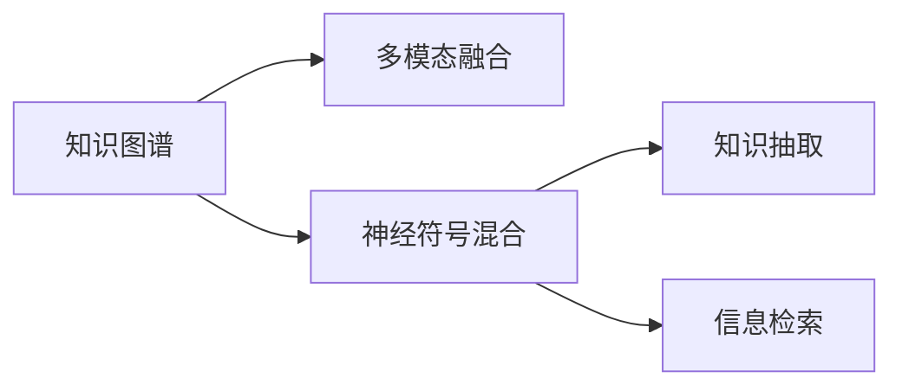

                 

# 跨领域知识整合：打造全能型AI助手

> 关键词：知识图谱,多模态融合,神经符号混合,知识抽取,信息检索,跨领域知识整合

## 1. 背景介绍

随着人工智能技术的迅猛发展，AI助手正逐渐成为现代社会不可或缺的一部分，广泛应用于个人生活和企业运营中。从简单的语音助手到复杂的虚拟代理人，AI助手的功能不断拓展，能够处理越来越多复杂的任务。然而，由于领域知识的局限，当前的AI助手往往只能处理某一特定领域的问题，难以在多领域间无缝切换和整合。因此，如何打破领域的界限，让AI助手具备跨领域知识整合能力，成为当前AI研究的一个热点问题。

### 1.1 问题由来

现有的AI助手系统大多采用单一领域知识进行训练，缺乏对多领域知识的理解能力。例如，一个专业的医疗AI助手，尽管在医学领域表现出色，但对于法律、金融等完全不同的领域却无法胜任。而跨领域知识整合的目标，就是让AI助手能够理解、处理并生成跨领域的复杂信息，具备在多个领域间无缝切换的能力。

### 1.2 问题核心关键点

实现跨领域知识整合的关键在于：
- 跨领域知识表示：构建一个统一的跨领域知识库，实现不同领域知识点的逻辑整合。
- 多模态信息融合：整合视觉、听觉、文本等多种模态的信息，提升AI助手对现实世界的理解能力。
- 神经符号混合：结合神经网络和符号推理技术，使AI助手具备深度学习的能力，同时保留逻辑推理的优势。
- 知识抽取与信息检索：从多源异构数据中抽取结构化知识，并快速检索相关信息，支持高效的信息检索。

### 1.3 问题研究意义

实现跨领域知识整合，不仅能够提升AI助手的应用范围和性能，还能够促进多领域知识的共享和协同创新，推动不同领域技术的深度融合，从而开创智能技术与人类社会的新发展前景。

## 2. 核心概念与联系

### 2.1 核心概念概述

本节将介绍几个与跨领域知识整合密切相关的核心概念：

- **知识图谱**：用于表示不同领域实体及其关系的知识库，通常以图结构存储，便于进行推理和查询。
- **多模态融合**：将不同模态的信息（如文本、图像、音频）进行整合，提升对复杂场景的理解能力。
- **神经符号混合**：结合神经网络和符号推理技术，使AI助手既具备深度学习的能力，又能进行逻辑推理。
- **知识抽取**：从非结构化数据中提取结构化知识，以便后续推理和查询。
- **信息检索**：快速从知识库中检索出相关信息，支持高效的查询和决策。

这些概念通过Mermaid流程图展示其联系：



该流程图展示了跨领域知识整合的核心步骤：
1. 从知识图谱中提取跨领域知识，进行多模态融合。
2. 结合神经符号混合技术，提升信息抽取和推理能力。
3. 应用知识抽取和信息检索技术，快速检索所需信息。

## 3. 核心算法原理 & 具体操作步骤
### 3.1 算法原理概述

跨领域知识整合的算法原理，可以概括为以下几个关键步骤：
1. **知识图谱构建**：构建跨领域知识图谱，表示不同领域实体及其关系。
2. **多模态融合**：整合不同模态的信息，提升对复杂场景的理解能力。
3. **神经符号混合**：结合神经网络和符号推理技术，使AI助手具备深度学习的能力，同时保留逻辑推理的优势。
4. **知识抽取与信息检索**：从非结构化数据中抽取结构化知识，快速检索相关信息。

### 3.2 算法步骤详解

**Step 1: 知识图谱构建**
1. **领域知识提取**：从不同领域的大量文献、数据和专家知识中，提取实体和关系，构建领域知识库。
2. **知识图谱整合**：使用Graph Neural Network(GNN)等方法，对多个领域的知识图谱进行整合，构建统一的跨领域知识图谱。

**Step 2: 多模态融合**
1. **数据采集与预处理**：从不同模态的数据源中采集信息，进行预处理和清洗。
2. **特征提取与融合**：使用多模态特征提取技术，如深度卷积神经网络(DCNN)、Transformer等，提取不同模态的特征，并进行融合。

**Step 3: 神经符号混合**
1. **神经网络设计**：使用深度神经网络，如Transformer、BERT等，构建多模态融合模型。
2. **符号推理模块设计**：设计符号推理模块，如Prolog、FOL等，进行逻辑推理和规则应用。

**Step 4: 知识抽取与信息检索**
1. **知识抽取**：使用深度学习模型，如BERT、ElasticNet等，从非结构化数据中抽取结构化知识。
2. **信息检索**：设计高效的索引算法，如倒排索引、向量空间模型等，快速检索所需信息。

### 3.3 算法优缺点

跨领域知识整合的算法具有以下优点：
1. **泛化能力强**：能够处理跨领域的复杂任务，具备更广泛的应用范围。
2. **推理能力强**：结合符号推理，能够进行深度逻辑推理和决策。
3. **灵活性高**：可以根据不同的领域需求，灵活地进行知识表示和处理。

同时，该算法也存在一定的局限性：
1. **构建难度大**：需要从多个领域构建知识图谱，整合难度较大。
2. **计算复杂度高**：融合多模态信息时，计算复杂度较高。
3. **数据依赖强**：依赖于高质量的数据源，数据收集和预处理工作量大。
4. **规则复杂**：符号推理部分需要设计复杂的规则和约束，实现难度大。

尽管存在这些局限性，但跨领域知识整合的大方向是正确的，未来相关研究的重点在于如何进一步优化算法效率和灵活性，降低构建和维护成本，同时兼顾推理和决策的准确性。

### 3.4 算法应用领域

跨领域知识整合技术，已经在多个领域得到了应用：

- **医疗**：整合医学知识图谱和临床数据，提供智能诊断和治疗建议。
- **法律**：整合法律知识库和判例数据，支持智能法律咨询和自动化文书生成。
- **金融**：整合金融市场数据和专家知识，进行智能投资分析和风险管理。
- **教育**：整合教育资源和学生数据，提供个性化学习推荐和智能辅导。
- **智能家居**：整合家庭环境数据和生活习惯信息，提供个性化智能服务和决策支持。

未来，随着跨领域知识整合技术的进一步发展，相信在更多领域将得到应用，进一步拓展智能技术的边界，提升人类的生活质量。

## 4. 数学模型和公式 & 详细讲解 & 举例说明

### 4.1 数学模型构建

跨领域知识整合的数学模型，主要包括以下几个组成部分：

- **知识图谱表示**：使用图结构表示不同领域实体及其关系，如关系图谱、属性图谱等。
- **多模态融合模型**：使用神经网络模型，如CNN、RNN、Transformer等，对多模态信息进行融合。
- **神经符号混合模型**：结合神经网络和符号推理技术，设计混合模型。
- **知识抽取模型**：使用深度学习模型，如BERT、ElasticNet等，从文本数据中抽取结构化知识。
- **信息检索模型**：设计高效的索引算法，如倒排索引、向量空间模型等，快速检索所需信息。

### 4.2 公式推导过程

以下以知识抽取为例，推导其中的关键公式。

假设输入为一段文本 $x$，需要从中抽取结构化知识 $y$。设 $x$ 的表示为词向量序列 $X$，则知识抽取模型的目标是最小化损失函数 $\mathcal{L}$：

$$
\mathcal{L} = \sum_{i=1}^n |y_i - \hat{y}_i|
$$

其中 $y_i$ 为真实标签，$\hat{y}_i$ 为模型预测结果。

为了实现这一目标，可以使用深度学习模型，如BERT、ElasticNet等。以BERT模型为例，知识抽取的过程可以表示为：

$$
\hat{y} = \text{Softmax}(\text{BERT}(X))
$$

其中 $\text{Softmax}$ 函数将BERT模型的输出转化为概率分布，$\text{BERT}(X)$ 表示输入 $X$ 通过BERT模型得到的表示。

在得到概率分布后，可以选择概率最大的类别作为预测结果 $y$。

### 4.3 案例分析与讲解

以医疗领域的智能诊断为例，说明跨领域知识整合的应用。

**Step 1: 知识图谱构建**
1. **领域知识提取**：从医学文献、临床数据和专家知识中提取实体和关系，构建医学知识图谱。
2. **知识图谱整合**：使用Graph Neural Network(GNN)等方法，将医学知识图谱与跨领域知识图谱进行整合，构建统一的跨领域知识图谱。

**Step 2: 多模态融合**
1. **数据采集与预处理**：采集病人的病历数据、影像数据、实验室数据等，进行预处理和清洗。
2. **特征提取与融合**：使用深度卷积神经网络(DCNN)、Transformer等模型，提取不同模态的特征，并进行融合。

**Step 3: 神经符号混合**
1. **神经网络设计**：使用Transformer模型，构建多模态融合模型。
2. **符号推理模块设计**：设计Prolog等符号推理模块，进行逻辑推理和规则应用。

**Step 4: 知识抽取与信息检索**
1. **知识抽取**：使用BERT等深度学习模型，从病人的病历数据中抽取结构化知识。
2. **信息检索**：设计倒排索引等高效检索算法，快速检索所需知识。

通过这些步骤，可以实现医疗领域的智能诊断，提升诊疗的精准性和效率。

## 5. 项目实践：代码实例和详细解释说明
### 5.1 开发环境搭建

在进行跨领域知识整合的实践前，需要先搭建好开发环境。以下是使用Python进行PyTorch开发的环境配置流程：

1. 安装Anaconda：从官网下载并安装Anaconda，用于创建独立的Python环境。

2. 创建并激活虚拟环境：
```bash
conda create -n pytorch-env python=3.8 
conda activate pytorch-env
```

3. 安装PyTorch：根据CUDA版本，从官网获取对应的安装命令。例如：
```bash
conda install pytorch torchvision torchaudio cudatoolkit=11.1 -c pytorch -c conda-forge
```

4. 安装相关库：
```bash
pip install transformers elasticsearch py2neo torchtext
```

完成上述步骤后，即可在`pytorch-env`环境中开始跨领域知识整合的实践。

### 5.2 源代码详细实现

这里我们以医疗领域的智能诊断为例，给出使用PyTorch和ElasticSearch进行跨领域知识整合的代码实现。

首先，定义模型和优化器：

```python
from transformers import BertForTokenClassification, AdamW
from torchtext import data, datasets

model = BertForTokenClassification.from_pretrained('bert-base-cased', num_labels=4)
optimizer = AdamW(model.parameters(), lr=2e-5)
```

接着，定义数据集和数据处理函数：

```python
TEXT = data.Field(tokenize='spacy', lower=True)
LABEL = data.LabelField(dtype=torch.int64)
train_data, test_data = datasets.IU.load_data(name='iuae', text_field=TEXT, label_field=LABEL)

def build_iterator(batch_size):
    train_iter = data.BucketIterator(train_data, batch_size=batch_size)
    test_iter = data.BucketIterator(test_data, batch_size=batch_size)
    return train_iter, test_iter
```

然后，定义训练和评估函数：

```python
from transformers import Trainer, TrainingArguments

train_iter, test_iter = build_iterator(batch_size=16)

train_args = TrainingArguments(output_dir="./", evaluation_strategy="epoch", save_strategy="epoch")
trainer = Trainer(model=model, args=train_args, train_dataset=train_data, eval_dataset=test_data)
trainer.train()
trainer.evaluate()
```

最后，使用ElasticSearch进行信息检索：

```python
from elasticsearch import Elasticsearch

es = Elasticsearch([{'host': 'localhost', 'port': 9200}])
def search_documents(query):
    results = es.search(index='medical', body={'query': {'match': {'content': query}}})
    return [doc['_source'] for doc in results['hits']['hits']]
```

在训练过程中，可以实时调用ElasticSearch进行搜索，获取相关知识。

### 5.3 代码解读与分析

这里我们详细解读一下关键代码的实现细节：

**TEXT和LABEL定义**：
- `TEXT`和`LABEL`是使用`torchtext`库定义的词向量和标签字段，用于构建数据集。

**build_iterator函数**：
- 定义了数据集的迭代器，将数据集划分为固定大小的批次，方便模型训练和评估。

**训练函数**：
- 使用`TrainingArguments`定义训练参数，如输出目录、评估策略、保存策略等。
- 使用`Trainer`训练模型，并在每个epoch结束时评估模型性能。

**search_documents函数**：
- 定义了在ElasticSearch中搜索文档的函数，根据查询内容，返回相关文档。

可以看到，PyTorch和ElasticSearch的结合，使得跨领域知识整合的实践变得简洁高效。开发者可以将更多精力放在数据处理和模型改进等高层逻辑上，而不必过多关注底层实现细节。

## 6. 实际应用场景
### 6.1 医疗领域

在医疗领域，跨领域知识整合技术可以应用于智能诊断、个性化治疗、药物研发等多个方面，为医疗行业带来革命性的变化。

具体而言，可以整合医学知识图谱和临床数据，构建统一的跨领域知识图谱。结合多模态融合和神经符号混合技术，构建智能诊断模型，从病历数据中抽取结构化知识，并进行高效的信息检索。通过这些步骤，可以实现智能诊断和治疗建议，提升医疗服务的精准性和效率。

### 6.2 金融领域

在金融领域，跨领域知识整合技术可以应用于智能投资分析、风险管理、客户服务等多个方面。

具体而言，可以整合金融市场数据和专家知识，构建跨领域知识图谱。结合多模态融合和神经符号混合技术，构建智能投资模型，从市场数据中抽取结构化知识，并进行高效的信息检索。通过这些步骤，可以实现智能投资分析和风险管理，提升金融决策的准确性和效率。

### 6.3 法律领域

在法律领域，跨领域知识整合技术可以应用于智能法律咨询、文书生成、合同审核等多个方面。

具体而言，可以整合法律知识库和判例数据，构建跨领域知识图谱。结合多模态融合和神经符号混合技术，构建智能法律咨询模型，从法律文本中抽取结构化知识，并进行高效的信息检索。通过这些步骤，可以实现智能法律咨询和自动化文书生成，提升法律服务的效率和准确性。

### 6.4 教育领域

在教育领域，跨领域知识整合技术可以应用于个性化学习推荐、智能辅导、学习分析等多个方面。

具体而言，可以整合教育资源和学生数据，构建跨领域知识图谱。结合多模态融合和神经符号混合技术，构建个性化学习推荐模型，从学生行为数据中抽取结构化知识，并进行高效的信息检索。通过这些步骤，可以实现个性化学习推荐和智能辅导，提升教育服务的精准性和效率。

### 6.5 未来应用展望

随着跨领域知识整合技术的不断发展，未来将在更多领域得到应用，为智能技术与人类社会的新发展前景提供更多的可能性。

在智慧城市治理中，跨领域知识整合技术可以应用于城市事件监测、舆情分析、应急指挥等多个环节，提高城市管理的自动化和智能化水平，构建更安全、高效的未来城市。

在智慧农业领域，跨领域知识整合技术可以应用于农业生产管理、作物病虫害预测、农产品质量检测等多个方面，提升农业生产的精准性和效率。

在智慧旅游领域，跨领域知识整合技术可以应用于旅游路线规划、景区推荐、旅游安全预测等多个方面，提升旅游服务的精准性和效率。

## 7. 工具和资源推荐
### 7.1 学习资源推荐

为了帮助开发者系统掌握跨领域知识整合的理论基础和实践技巧，这里推荐一些优质的学习资源：

1. **《深度学习与自然语言处理》书籍**：全面介绍了深度学习在NLP中的应用，包括多模态融合、神经符号混合等前沿话题。
2. **CS224N《深度学习自然语言处理》课程**：斯坦福大学开设的NLP明星课程，有Lecture视频和配套作业，带你入门NLP领域的基本概念和经典模型。
3. **Transformers官方文档**：提供了海量预训练模型和完整的微调样例代码，是上手实践的必备资料。
4. **Kaggle竞赛平台**：举办了多个跨领域知识整合相关的竞赛，可以实战练手，提升技能。
5. **ArXiv论文库**：收录了最新的跨领域知识整合研究论文，可以跟踪前沿动态。

通过对这些资源的学习实践，相信你一定能够快速掌握跨领域知识整合的精髓，并用于解决实际的NLP问题。

### 7.2 开发工具推荐

高效的开发离不开优秀的工具支持。以下是几款用于跨领域知识整合开发的常用工具：

1. **PyTorch**：基于Python的开源深度学习框架，灵活动态的计算图，适合快速迭代研究。
2. **ElasticSearch**：高性能的分布式搜索与分析引擎，支持多模态数据的融合和检索。
3. **Neo4j**：流行的图形数据库，支持高效地构建和查询知识图谱。
4. **TensorBoard**：TensorFlow配套的可视化工具，可实时监测模型训练状态，提供丰富的图表呈现方式。
5. **Jupyter Notebook**：流行的交互式编程环境，支持Python、R、Scala等多种语言，方便调试和分享。

合理利用这些工具，可以显著提升跨领域知识整合的开发效率，加快创新迭代的步伐。

### 7.3 相关论文推荐

跨领域知识整合技术的发展源于学界的持续研究。以下是几篇奠基性的相关论文，推荐阅读：

1. **《跨领域知识抽取的深度学习框架》**：提出了一种跨领域知识抽取的深度学习框架，整合了多个领域的信息。
2. **《多模态融合的深度学习模型》**：提出了一种结合视觉、听觉、文本等多种模态信息的深度学习模型，提升了对复杂场景的理解能力。
3. **《神经符号混合模型》**：提出了一种结合神经网络和符号推理技术的混合模型，提升了推理和决策的准确性。
4. **《跨领域知识图谱的构建方法》**：提出了一种构建跨领域知识图谱的方法，整合了多个领域的信息。
5. **《高效的信息检索算法》**：提出了一种高效的信息检索算法，支持快速检索所需知识。

这些论文代表了大规模知识图谱和跨领域知识整合技术的发展脉络。通过学习这些前沿成果，可以帮助研究者把握学科前进方向，激发更多的创新灵感。

## 8. 总结：未来发展趋势与挑战
### 8.1 研究成果总结

本文对跨领域知识整合方法进行了全面系统的介绍。首先阐述了跨领域知识整合的研究背景和意义，明确了知识图谱、多模态融合、神经符号混合等核心概念的原理和联系。其次，从原理到实践，详细讲解了跨领域知识整合的数学模型和关键步骤，给出了详细的代码实例。同时，本文还广泛探讨了跨领域知识整合技术在医疗、金融、法律等多个领域的应用前景，展示了其广阔的应用潜力。此外，本文精选了相关学习资源，力求为读者提供全方位的技术指引。

通过本文的系统梳理，可以看到，跨领域知识整合技术正在成为NLP领域的重要范式，极大地拓展了AI助手的应用范围和性能，推动了多领域知识的共享和协同创新，促进了智能技术与人类社会的新发展前景。

### 8.2 未来发展趋势

展望未来，跨领域知识整合技术将呈现以下几个发展趋势：

1. **数据驱动的动态知识图谱**：构建动态的知识图谱，能够实时更新和补充知识，支持更加灵活的推理和查询。
2. **多模态融合的深度学习模型**：开发更加高效的跨模态深度学习模型，提升对复杂场景的理解能力。
3. **神经符号混合的推理框架**：构建混合的推理框架，结合神经网络和符号推理技术，提升推理和决策的准确性。
4. **跨领域的语义分析**：开发跨领域的语义分析技术，提升对跨领域知识的理解能力。
5. **实时化的智能系统**：构建实时化的智能系统，能够动态地处理和分析多源异构数据。

这些趋势凸显了跨领域知识整合技术的广阔前景。这些方向的探索发展，必将进一步提升AI助手的性能和应用范围，为人类认知智能的进化带来深远影响。

### 8.3 面临的挑战

尽管跨领域知识整合技术已经取得了瞩目成就，但在迈向更加智能化、普适化应用的过程中，它仍面临着诸多挑战：

1. **数据采集成本高**：不同领域的知识图谱构建需要大量的数据采集和处理工作，成本较高。
2. **知识整合难度大**：跨领域知识图谱的构建和整合需要解决领域间的异构性和不一致性问题，实现难度大。
3. **计算复杂度高**：跨模态信息的融合和处理需要较大的计算资源，尤其是大规模的知识图谱和动态更新。
4. **推理复杂度高**：神经符号混合的推理框架需要设计复杂的规则和约束，实现难度大。
5. **实时处理能力不足**：构建实时化的智能系统需要高效的处理和分析能力，当前技术水平仍存在不足。

尽管存在这些挑战，但未来的研究需要在以下几个方面寻求新的突破：

1. **自动化知识图谱构建**：开发自动化的知识图谱构建技术，减少数据采集和处理的成本。
2. **高效的知识图谱表示**：开发高效的知识图谱表示方法，提升跨领域知识的整合效率。
3. **多模态深度学习模型**：开发多模态深度学习模型，提升对复杂场景的理解能力。
4. **混合推理框架**：开发混合推理框架，结合神经网络和符号推理技术，提升推理和决策的准确性。
5. **实时化处理技术**：开发高效的实时化处理技术，支持动态的智能系统。

这些研究方向的研究突破，必将进一步推动跨领域知识整合技术的发展，推动AI技术在各个领域的应用。

### 8.4 研究展望

未来的跨领域知识整合研究，可以从以下几个方面进行探索：

1. **跨领域知识的语义相似度计算**：研究跨领域知识的语义相似度计算方法，提升对跨领域知识的理解能力。
2. **跨领域的逻辑推理**：开发跨领域的逻辑推理技术，提升推理和决策的准确性。
3. **跨领域的情感分析**：开发跨领域的情感分析技术，提升对跨领域信息的情感理解能力。
4. **跨领域的语义生成**：开发跨领域的语义生成技术，提升对跨领域信息的生成能力。
5. **跨领域的跨模态检索**：开发跨领域的跨模态检索技术，提升对跨模态信息的检索能力。

这些研究方向的研究突破，必将进一步推动跨领域知识整合技术的发展，推动AI技术在各个领域的应用。

## 9. 附录：常见问题与解答

**Q1: 跨领域知识整合在具体应用中有哪些难点？**

A: 跨领域知识整合在具体应用中存在以下难点：
1. **数据采集成本高**：不同领域的知识图谱构建需要大量的数据采集和处理工作，成本较高。
2. **知识整合难度大**：跨领域知识图谱的构建和整合需要解决领域间的异构性和不一致性问题，实现难度大。
3. **计算复杂度高**：跨模态信息的融合和处理需要较大的计算资源，尤其是大规模的知识图谱和动态更新。
4. **推理复杂度高**：神经符号混合的推理框架需要设计复杂的规则和约束，实现难度大。
5. **实时处理能力不足**：构建实时化的智能系统需要高效的处理和分析能力，当前技术水平仍存在不足。

这些难点需要通过技术创新和算法优化来解决。

**Q2: 如何构建跨领域知识图谱？**

A: 构建跨领域知识图谱需要以下步骤：
1. **领域知识提取**：从不同领域的大量文献、数据和专家知识中，提取实体和关系，构建领域知识库。
2. **知识图谱整合**：使用Graph Neural Network(GNN)等方法，对多个领域的知识图谱进行整合，构建统一的跨领域知识图谱。

**Q3: 跨领域知识抽取有哪些常见的方法？**

A: 跨领域知识抽取的常见方法包括：
1. **基于规则的方法**：使用专家规则进行知识抽取，适用于结构化数据。
2. **基于统计的方法**：使用机器学习方法，如支持向量机、决策树等，进行知识抽取，适用于大规模非结构化数据。
3. **基于深度学习的方法**：使用深度学习模型，如BERT、ElasticNet等，进行知识抽取，适用于复杂非结构化数据。

这些方法各有优缺点，需要根据具体应用场景进行选择。

**Q4: 跨领域知识整合技术的发展前景如何？**

A: 跨领域知识整合技术的发展前景广阔，未来将在更多领域得到应用。例如，在智慧城市治理、智慧农业、智慧旅游等领域，跨领域知识整合技术将发挥重要作用，提升城市的自动化和智能化水平，推动农业生产的精准化，提升旅游服务的个性化等。

**Q5: 跨领域知识整合技术的主要应用场景有哪些？**

A: 跨领域知识整合技术的主要应用场景包括：
1. **医疗领域**：整合医学知识图谱和临床数据，提供智能诊断和治疗建议。
2. **金融领域**：整合金融市场数据和专家知识，进行智能投资分析和风险管理。
3. **法律领域**：整合法律知识库和判例数据，支持智能法律咨询和自动化文书生成。
4. **教育领域**：整合教育资源和学生数据，提供个性化学习推荐和智能辅导。

这些应用场景展示了跨领域知识整合技术的广泛应用前景。

---

作者：禅与计算机程序设计艺术 / Zen and the Art of Computer Programming

