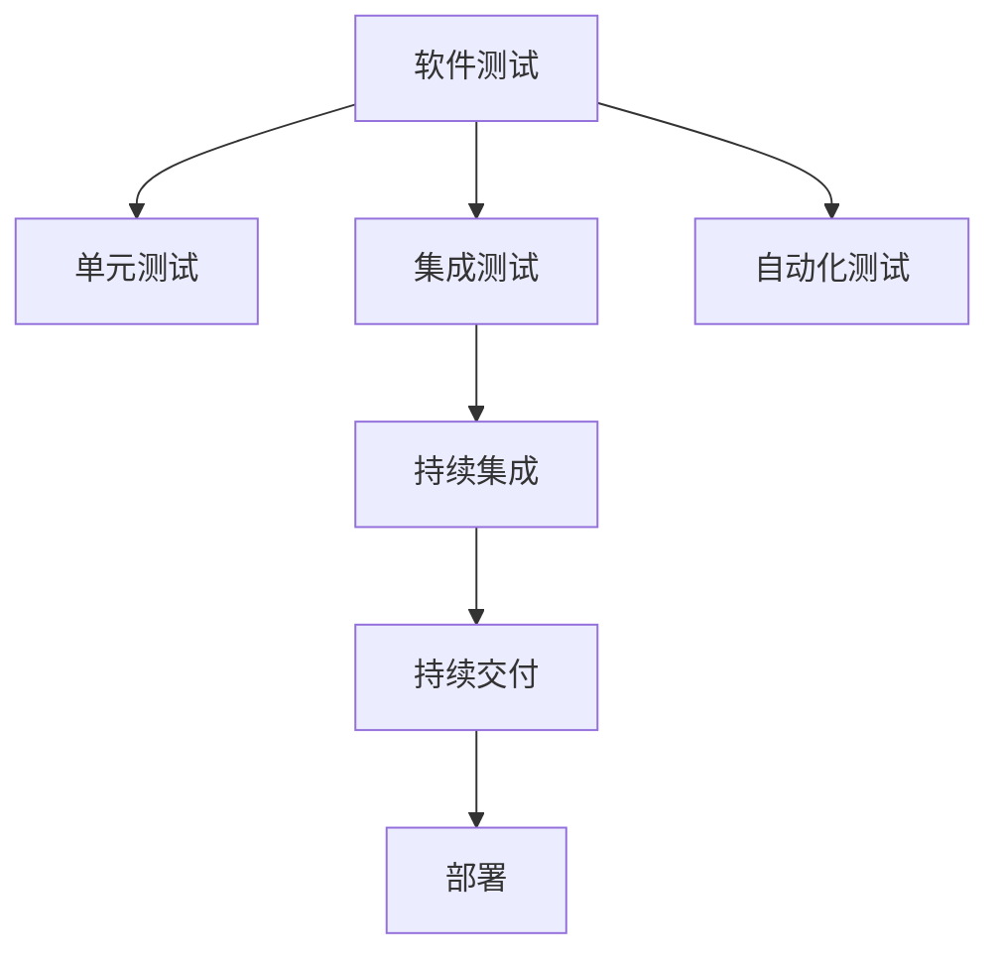

                 

# 软件测试自动化：提高代码质量和效率

> 关键词：软件测试自动化, 代码质量, 代码效率, 单元测试, 集成测试, 持续集成(CI), 持续交付(CD)

## 1. 背景介绍

### 1.1 问题由来
随着软件行业的快速发展，企业对软件质量和交付效率的要求不断提高。传统的手工测试方法耗时长、成本高，容易引入人为错误，已经难以满足企业的需求。因此，自动化测试技术应运而生，成为提升软件质量与效率的重要手段。

### 1.2 问题核心关键点
软件测试自动化的核心目标是提高测试效率和代码质量，通过自动化手段代替人工测试，确保软件的稳定性和可靠性。自动化测试主要分为单元测试、集成测试和持续集成/持续交付（CI/CD）三个层次，每个层次都有其特定的技术实现和应用场景。

### 1.3 问题研究意义
自动化测试技术不仅能显著提高软件的测试效率和质量，还能缩短软件开发周期，加速产品迭代。通过测试自动化，企业可以更快速地发现和修复软件缺陷，减少后期维护成本，提升用户体验。同时，自动化测试也能够支持持续交付和持续集成，使软件开发更加敏捷、高效。

## 2. 核心概念与联系

### 2.1 核心概念概述

为更好地理解软件测试自动化的工作原理和优化方向，本节将介绍几个关键概念：

- 软件测试：验证软件功能是否符合预期，发现并修复软件缺陷的过程。
- 自动化测试：使用自动化工具和方法，代替人工进行软件测试的技术。
- 单元测试：对软件中的最小可测试单元进行测试，通常是函数或方法。
- 集成测试：测试多个模块之间的交互，确保系统功能正确无误。
- 持续集成（CI）：将代码频繁集成到共享的代码库中，并通过自动化测试来验证其正确性。
- 持续交付（CD）：在持续集成的基础上，自动部署代码到生产环境，加速软件交付速度。

这些概念之间的逻辑关系可以通过以下Mermaid流程图来展示：



这个流程图展示了一系列测试技术的相互关系：

1. 自动化测试技术将手动测试转化为自动化的过程，大大提高了测试效率。
2. 单元测试是自动化测试的基础，通过测试最小单元，确保代码的正确性。
3. 集成测试基于单元测试，进一步验证多个模块的协同工作。
4. 持续集成将代码频繁集成到共享库中，并通过自动化测试快速反馈。
5. 持续交付在此基础上，自动部署到生产环境，加速软件交付。
6. 自动化测试贯穿软件开发生命周期，是软件质量保证的重要手段。

## 3. 核心算法原理 & 具体操作步骤
### 3.1 算法原理概述

软件测试自动化的核心算法包括自动化测试框架、测试脚本编写和执行、测试结果分析等。这些算法的主要目标是提升测试效率和质量，确保软件功能的正确性和稳定性。

### 3.2 算法步骤详解

#### 3.2.1 选择测试工具和框架

选择合适的测试工具和框架是自动化测试的第一步。目前常用的测试工具包括JUnit、TestNG、Selenium、Jest等，框架则有Spring、JUnit、TestNG等。这些工具和框架各有特点，应根据项目需求选择合适的工具。

#### 3.2.2 编写测试脚本

编写测试脚本是自动化测试的核心步骤。测试脚本应覆盖所有关键功能点，并尽量简洁高效。测试脚本的编写可以参考单元测试、集成测试和持续集成/持续交付（CI/CD）等不同的测试层次。

#### 3.2.3 执行测试脚本

执行测试脚本是将测试脚本转化为实际测试过程的步骤。使用测试工具和框架，将编写的测试脚本运行起来，验证软件的各项功能是否符合预期。

#### 3.2.4 分析测试结果

分析测试结果是自动化测试的最终步骤。通过分析测试结果，可以发现软件缺陷，并及时进行修复。常用的测试结果分析工具包括JUnit、TestNG、Allure等，它们可以生成详细的测试报告，帮助开发人员快速定位问题。

### 3.3 算法优缺点

软件测试自动化的优点：
1. 提高测试效率：通过自动化测试，可以大幅提高测试效率，减少测试人员的工作量。
2. 提升测试质量：自动化测试可以覆盖更多的测试点，发现更多的软件缺陷，提升测试质量。
3. 支持持续交付：自动化测试支持持续交付，可以频繁集成代码，加速软件交付。
4. 降低人力成本：自动化测试可以降低人力成本，通过工具和框架，实现测试的标准化和规范化。

软件测试自动化的缺点：
1. 初始投资较高：选择和配置测试工具和框架，需要进行一定的初始投资。
2. 技术要求高：自动化测试需要一定的技术背景，开发和维护测试脚本需要技术支持。
3. 测试结果依赖：测试结果依赖测试工具和框架，不同的工具和框架可能产生不同的测试结果。
4. 测试脚本维护：测试脚本需要频繁维护和更新，以保证其正确性和时效性。

### 3.4 算法应用领域

软件测试自动化在各个软件开发生命周期阶段都有广泛应用，具体包括：

- 单元测试：在开发过程中，对代码的最小可测试单元进行测试，确保代码的正确性。
- 集成测试：在集成过程中，测试多个模块之间的交互，确保系统功能的正确性。
- 持续集成：在开发过程中，频繁集成代码，并通过自动化测试快速反馈，加速软件开发。
- 持续交付：在持续集成的基础上，自动部署代码到生产环境，加速软件交付。
- 自动化回归测试：在软件维护阶段，自动化回归测试可以及时发现新引入的缺陷。

这些应用领域展示了自动化测试在软件开发生命周期中的重要性，为提升软件质量和效率提供了有力支持。

## 4. 数学模型和公式 & 详细讲解 & 举例说明

### 4.1 数学模型构建

软件测试自动化的数学模型可以表示为：

$$
\text{测试效果} = \text{测试效率} \times \text{测试质量}
$$

其中，测试效果是软件质量的保证，测试效率是测试时间成本的衡量，测试质量是测试覆盖面和缺陷发现的准确性。

### 4.2 公式推导过程

测试效率可以表示为：

$$
\text{测试效率} = \frac{\text{测试用例数量}}{\text{测试时间}}
$$

测试质量可以通过测试覆盖率和缺陷率来衡量：

$$
\text{测试质量} = \text{测试覆盖率} \times \left(1 - \text{缺陷率}\right)
$$

其中，测试覆盖率表示测试用例覆盖代码的比例，缺陷率表示测试过程中发现的缺陷数量占代码数量的比例。

### 4.3 案例分析与讲解

假设某个软件系统有1000行代码，测试人员手动测试需要100小时，而使用自动化测试工具可以在10小时内完成相同数量的测试用例。假设测试工具能够覆盖95%的代码，缺陷率为0.1%。则测试效果计算如下：

$$
\text{测试效果} = \frac{1000}{10} \times 0.95 \times \left(1 - 0.001\right) \approx 950
$$

这个例子展示了自动化测试在提高测试效率和质量方面的显著优势。

## 5. 项目实践：代码实例和详细解释说明
### 5.1 开发环境搭建

在进行软件测试自动化实践前，我们需要准备好开发环境。以下是使用Python进行JUnit和Selenium开发的环境配置流程：

1. 安装Java：从官网下载并安装Java Development Kit（JDK），确保测试工具能够正常运行。
2. 安装JUnit：使用Maven或Gradle等构建工具安装JUnit。
3. 安装Selenium：使用Maven或Gradle等构建工具安装Selenium WebDriver。
4. 配置项目：创建Java项目，并在pom.xml中添加JUnit和Selenium的依赖。

完成上述步骤后，即可在项目环境中开始自动化测试实践。

### 5.2 源代码详细实现

这里我们以JUnit和Selenium实现Web应用的自动化测试为例，给出代码实现。

```java
import org.junit.Test;
import org.openqa.selenium.By;
import org.openqa.selenium.WebDriver;
import org.openqa.selenium.WebElement;
import org.openqa.selenium.chrome.ChromeDriver;

public class AutomationTest {

    @Test
    public void testLogin() {
        WebDriver driver = new ChromeDriver();
        driver.get("https://example.com/login");
        WebElement username = driver.findElement(By.id("username"));
        username.sendKeys("testuser");
        WebElement password = driver.findElement(By.id("password"));
        password.sendKeys("testpass");
        WebElement loginButton = driver.findElement(By.id("login-btn"));
        loginButton.click();
        // 添加更多的测试用例
        driver.quit();
    }
}
```

在这个例子中，我们通过JUnit测试框架，使用Selenium WebDriver实现了Web应用的自动化测试。具体步骤如下：

1. 创建一个JUnit测试类，并标注Test注解。
2. 在测试方法中，通过ChromeDriver启动浏览器，并访问指定URL。
3. 使用Selenium的By类定位页面元素，并输入用户名和密码。
4. 点击登录按钮，完成登录操作。
5. 在测试方法中添加更多的测试用例，如页面元素验证、数据录入、表单提交等。

### 5.3 代码解读与分析

这个代码例子展示了JUnit和Selenium的简单用法。通过这个例子，可以看到：

1. JUnit框架提供了Test注解，用于标记测试方法。
2. Selenium WebDriver提供了打开浏览器、访问URL、定位元素、输入文本、点击按钮等方法。
3. 测试方法可以包含多个测试用例，每个用例测试一个功能点。
4. 测试方法可以在最后添加清理操作，如关闭浏览器。

在实际开发中，可以根据项目需求编写更加复杂的测试用例，覆盖更多功能点。同时，需要注意测试用例的设计要尽量简单、易维护，以提升测试效率和质量。

### 5.4 运行结果展示

在执行自动化测试时，可以通过JUnit提供的测试报告来展示测试结果。测试报告可以包括测试用例的覆盖率、通过率、失败原因等关键信息，帮助开发人员快速定位问题。

## 6. 实际应用场景
### 6.1 智能客服系统

基于软件测试自动化的智能客服系统，可以自动化地测试客服应用的功能性和稳定性，提升用户体验和响应速度。在测试过程中，可以模拟用户输入和操作，验证客服系统能否正确处理各类常见问题，如查询、投诉、反馈等。通过自动化测试，可以及时发现和修复系统漏洞，提升系统的稳定性和可靠性。

### 6.2 金融交易系统

金融交易系统的高并发和数据敏感性要求其必须具备极高的稳定性和可靠性。通过软件测试自动化，可以频繁集成代码，并通过自动化测试快速反馈，确保新功能在上线前通过严格测试，防止因系统漏洞导致的资金损失。同时，自动化测试还可以在生产环境中进行持续监控，及时发现和修复系统问题。

### 6.3 电商平台

电商平台对商品上架、订单处理、支付等功能的稳定性和效率要求极高。通过软件测试自动化，可以覆盖电商平台的各个功能模块，及时发现和修复系统缺陷，确保平台的高效运行。同时，自动化测试还可以支持持续集成和持续交付，加速产品迭代和上线速度。

### 6.4 未来应用展望

随着软件测试自动化技术的不断发展，未来将在更多领域得到应用，为软件开发带来更大的效率提升和质量保障。

在智慧医疗领域，自动化测试可以应用于医学影像分析、电子病历管理、药物研发等，提升医疗系统的智能化水平，保障医疗数据的准确性和安全性。

在智能制造领域，自动化测试可以应用于工业机器人、智能设备、智能控制系统等，提升生产线的稳定性和可靠性，加速工业自动化转型。

在智慧城市治理中，自动化测试可以应用于城市交通管理、环境监测、安全监控等，提升城市管理的自动化和智能化水平，构建更安全、高效的未来城市。

此外，在教育、物流、旅游等多个领域，自动化测试也将发挥重要作用，为各行业的数字化转型提供技术支持。相信随着自动化测试技术的不断进步，软件开发过程将更加高效、可靠，加速行业创新与发展。

## 7. 工具和资源推荐
### 7.1 学习资源推荐

为了帮助开发者系统掌握软件测试自动化的理论基础和实践技巧，这里推荐一些优质的学习资源：

1. 《软件测试的艺术》系列书籍：由著名软件测试专家撰写，全面介绍了软件测试的各种技术和管理方法。
2. CS208《软件测试基础》课程：斯坦福大学开设的软件测试课程，提供系统的理论知识和实践案例。
3. Udacity《软件测试工程》课程：提供系统的软件测试课程，覆盖自动化测试、持续集成、持续交付等前沿技术。
4. 《Selenium WebDriver》书籍：详细介绍Selenium WebDriver的使用方法和最佳实践，帮助开发者高效使用Selenium进行Web测试。

通过对这些资源的学习实践，相信你一定能够快速掌握软件测试自动化的精髓，并用于解决实际的软件问题。

### 7.2 开发工具推荐

高效的开发离不开优秀的工具支持。以下是几款用于软件测试自动化的常用工具：

1. JUnit：Java平台上的测试框架，支持单元测试、集成测试和持续集成。
2. TestNG：Java平台上的测试框架，支持测试注解、测试依赖、测试报告等功能。
3. Selenium：用于Web应用测试的自动化测试工具，支持多种浏览器和平台。
4. Appium：用于移动应用测试的自动化测试工具，支持iOS和Android平台。
5. Jenkins：持续集成/持续交付（CI/CD）工具，支持自动化测试、部署和监控。
6. Docker：容器化技术，支持软件测试环境的快速部署和迁移。

合理利用这些工具，可以显著提升软件测试自动化的开发效率，加快创新迭代的步伐。

### 7.3 相关论文推荐

软件测试自动化技术的发展源于学界的持续研究。以下是几篇奠基性的相关论文，推荐阅读：

1. "Measuring Program Performance" by Parnas and Rusakov：介绍了软件测试和程序性能评估的理论基础。
2. "Software Testing: From Test Design to Test Execution" by Bell and Petrenko：全面介绍了软件测试的流程和方法。
3. "Continuous Testing: A Survey" by Hadler and Zheng：综述了持续集成/持续交付（CI/CD）的最新研究进展。
4. "Selenium WebDriver: The Complete Guide" by Danhof：详细介绍了Selenium WebDriver的使用方法和最佳实践。
5. "JUnit 5: The New Test Framework" by Wuerthner：介绍了JUnit 5的新特性和使用方法。

这些论文代表了大规模软件测试自动化的发展脉络。通过学习这些前沿成果，可以帮助研究者把握学科前进方向，激发更多的创新灵感。

## 8. 总结：未来发展趋势与挑战
### 8.1 总结

本文对软件测试自动化的工作原理和优化方向进行了全面系统的介绍。首先阐述了软件测试自动化的研究背景和意义，明确了自动化在提升软件质量和效率方面的独特价值。其次，从原理到实践，详细讲解了自动化测试的数学模型和关键步骤，给出了自动化测试任务开发的完整代码实例。同时，本文还探讨了自动化测试在智能客服、金融交易、电商平台等多个行业领域的应用前景，展示了自动化测试技术的广阔前景。最后，本文精选了测试自动化的各类学习资源，力求为读者提供全方位的技术指引。

通过本文的系统梳理，可以看到，软件测试自动化正在成为软件开发的重要范式，极大地提升软件开发过程的效率和质量。未来，伴随测试自动化技术的不断演进，软件开发过程将更加高效、可靠，加速行业创新与发展。

### 8.2 未来发展趋势

展望未来，软件测试自动化的发展趋势将呈现以下几个方向：

1. 自动化测试工具的智能化。未来的自动化测试工具将更注重智能化，通过机器学习、自然语言处理等技术，提升测试用例的生成和优化能力。
2. 自动化测试的云化部署。通过云计算技术，自动化测试可以在更灵活、更高效的环境中进行，支持分布式测试和资源弹性伸缩。
3. 自动化测试的持续集成/持续交付（CI/CD）。未来的自动化测试将更紧密地与CI/CD流程集成，实现测试的自动化、连续化、可视化。
4. 自动化测试的数据驱动。未来的自动化测试将更注重数据驱动，通过大数据分析和人工智能技术，提升测试用例的设计和优化。
5. 自动化测试的弹性扩展。未来的自动化测试将更注重弹性扩展，支持大规模、高并发的测试场景，提升测试效率和稳定性。

以上趋势凸显了软件测试自动化的广阔前景。这些方向的探索发展，必将进一步提升软件测试的效率和质量，为软件开发过程带来更大的创新和突破。

### 8.3 面临的挑战

尽管软件测试自动化技术已经取得了瞩目成就，但在迈向更加智能化、普适化应用的过程中，它仍面临诸多挑战：

1. 初始投资较高。选择和配置自动化测试工具和框架，需要进行一定的初始投资，特别是在大企业中，测试工具的引入和配置成本较高。
2. 技术要求高。自动化测试需要一定的技术背景，开发和维护测试脚本需要技术支持，对于非技术团队可能存在一定的难度。
3. 测试结果依赖。测试结果依赖测试工具和框架，不同的工具和框架可能产生不同的测试结果，测试结果的一致性需要确保。
4. 测试脚本维护。测试脚本需要频繁维护和更新，以保证其正确性和时效性，对于开发人员来说是一项额外的工作负担。

尽管存在这些挑战，但自动化测试的优点仍然显著，通过合理的工具选择和技术支持，可以克服这些挑战，提升测试效率和质量。

### 8.4 研究展望

面对自动化测试面临的种种挑战，未来的研究需要在以下几个方面寻求新的突破：

1. 探索智能化测试用例生成技术。通过机器学习、自然语言处理等技术，自动化生成更加合理、全面的测试用例。
2. 研究云化测试环境的优化。通过云计算技术，提升测试环境的灵活性、可扩展性和弹性。
3. 开发更高效的测试工具和框架。研发更智能、更高效、更易用的自动化测试工具和框架，提升测试效率和质量。
4. 探索持续集成/持续交付（CI/CD）的优化。通过自动化测试与CI/CD的紧密集成，提升开发和交付的效率和质量。
5. 研究弹性扩展测试的算法。探索新的算法和架构，支持大规模、高并发的测试场景，提升测试效率和稳定性。

这些研究方向的探索，必将引领软件测试自动化技术迈向更高的台阶，为软件开发过程带来更大的创新和突破。面向未来，软件测试自动化技术还需要与其他软件工程技术进行更深入的融合，如代码重构、持续集成、持续交付等，多路径协同发力，共同推动软件工程的发展。只有勇于创新、敢于突破，才能不断拓展软件测试自动化的边界，让自动化测试技术更好地服务于软件开发。

## 9. 附录：常见问题与解答

**Q1：如何选择合适的自动化测试工具？**

A: 选择合适的自动化测试工具需要考虑以下几个因素：
1. 项目需求：根据项目需求选择合适的测试工具，如JUnit用于Java测试，Selenium用于Web测试。
2. 技术栈：根据技术栈选择合适的测试工具，如Spring与JUnit结合，Jest用于JavaScript测试。
3. 开发成本：考虑工具的引入成本，如Selenium需要浏览器驱动，Appium需要移动设备驱动，这些驱动可能会增加开发成本。
4. 测试效果：通过对比测试效果，选择最适合的测试工具，如JUnit和TestNG的覆盖率、稳定性等。

**Q2：如何设计高效的软件测试用例？**

A: 设计高效的软件测试用例需要考虑以下几个因素：
1. 全面覆盖：覆盖所有关键功能点，包括正常情况、异常情况、边界情况等。
2. 简单易懂：测试用例设计要尽量简洁、易懂，便于开发人员理解和执行。
3. 独立性：测试用例之间要独立，避免相互依赖，确保测试结果的准确性。
4. 可维护性：测试用例设计要便于维护和更新，随着项目变化及时调整。
5. 数据驱动：测试用例设计要注重数据驱动，通过不同的测试数据组合，验证更多功能点。

**Q3：如何评估自动化测试的效果？**

A: 评估自动化测试的效果需要考虑以下几个指标：
1. 测试覆盖率：测试覆盖率表示测试用例覆盖代码的比例，越高表示测试效果越好。
2. 缺陷率：测试过程中发现的缺陷数量占代码数量的比例，越低表示测试效果越好。
3. 测试效率：测试用例的数量和测试时间，测试效率越高表示测试效果越好。
4. 测试结果一致性：测试结果的一致性，不同的测试工具和框架可能产生不同的结果，需要确保结果一致。

**Q4：如何处理自动化测试中的异常情况？**

A: 处理自动化测试中的异常情况需要考虑以下几个步骤：
1. 定位异常：通过日志和异常信息，定位测试过程中的异常情况，找出问题所在。
2. 分析原因：分析异常原因，找出测试工具、框架、代码等因素导致的异常。
3. 修复问题：修复发现的异常问题，确保测试环境稳定、可靠。
4. 验证修复：通过重新执行测试用例，验证问题的修复情况，确保异常不再出现。

这些方法可以帮助开发者更好地处理自动化测试中的异常情况，保证测试结果的准确性和可靠性。

---

作者：禅与计算机程序设计艺术 / Zen and the Art of Computer Programming

