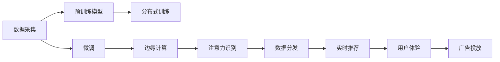

                 

# 边缘计算在注意力经济中的角色

在当今数字化时代，注意力经济成为驱动互联网企业成长的核心动力。通过吸引用户的注意力，互联网企业可以获取数据、提升用户体验，甚至实现商业模式创新。然而，随着用户注意力价值的不断攀升，注意力获取成本也日益增高。此时，边缘计算作为新兴技术，能否为注意力经济带来新的突破？本文将从边缘计算的基本原理、核心优势和应用场景三个方面，深入探讨边缘计算在注意力经济中的角色。

## 1. 背景介绍

### 1.1 问题由来

互联网经济的发展，离不开对用户注意力的争夺。无论是社交网络、新闻门户，还是电商平台，都在通过各种方式吸引用户眼球，以增加曝光量，提升点击率。但随着用户增长逐渐触顶，互联网企业面临的注意力获取成本也在持续攀升。传统的中心化计算架构在处理海量数据时，面临着高延迟、高成本的问题，已经无法满足实时化、个性化、低成本的需求。

### 1.2 问题核心关键点

边缘计算作为一种分布式计算范式，通过在网络边缘节点（如用户设备、接入点、数据中心边缘）进行计算和数据处理，极大缩短了数据传输时延，降低了计算资源成本，同时增强了网络可靠性和安全性。对于注意力经济而言，边缘计算的实时性、个性化和低成本特性，可以极大提升注意力获取的效率，降低获取成本。

## 2. 核心概念与联系

### 2.1 核心概念概述

边缘计算（Edge Computing）：指在网络边缘节点进行数据处理和计算，以减少数据传输时延和计算资源成本，增强网络可靠性和安全性。

注意力经济（Attention Economy）：指互联网企业通过吸引用户的注意力，实现数据获取、用户体验提升和商业模式创新的经济形态。

预训练模型（Pre-trained Models）：指通过大规模无监督学习任务（如语言模型、图像分类等）预训练得到的通用模型。

微调（Fine-tuning）：指在预训练模型的基础上，使用下游任务的少量标注数据，通过有监督学习优化模型在特定任务上的性能。

跨领域知识图谱（Cross-domain Knowledge Graph）：指在多个领域之间构建的知识库，实现跨领域知识表示和推理。

### 2.2 核心概念原理和架构的 Mermaid 流程图



从以上流程图中可以看出，边缘计算在注意力经济中的应用，主要分为以下几个关键步骤：

1. **数据采集**：通过传感器、用户设备等采集用户行为数据。
2. **预训练模型**：使用预训练模型提取用户特征，生成初步的用户画像。
3. **微调**：使用用户画像进行有监督学习，进一步优化用户模型。
4. **边缘计算**：将微调后的模型部署到边缘节点，进行实时计算和推理。
5. **注意力识别**：通过边缘计算实时监测用户行为，识别用户注意力偏好。
6. **数据分发**：根据用户注意力偏好，分发相关广告内容。
7. **实时推荐**：基于用户实时行为数据，提供个性化推荐。
8. **用户体验**：通过精准推荐，提升用户体验和满意度。

## 3. 核心算法原理 & 具体操作步骤

### 3.1 算法原理概述

边缘计算在注意力经济中的应用，主要基于以下几个核心算法原理：

1. **数据采集与存储**：通过传感器、用户设备等，采集用户行为数据，存储在边缘节点。
2. **预训练模型**：使用预训练模型提取用户特征，生成初步的用户画像。
3. **微调算法**：通过有监督学习，对预训练模型进行微调，优化用户模型。
4. **边缘计算**：将微调后的模型部署到边缘节点，进行实时计算和推理。
5. **注意力识别**：使用实时计算结果，识别用户注意力偏好。
6. **数据分发与推荐**：根据用户注意力偏好，分发相关广告内容，提供个性化推荐。

### 3.2 算法步骤详解

**Step 1: 数据采集与预处理**
- 通过传感器、用户设备等采集用户行为数据，如点击记录、浏览历史、语音指令等。
- 将数据传输到边缘节点进行初步处理，如去重、归一化等。

**Step 2: 预训练模型特征提取**
- 使用预训练模型（如BERT、GPT等）对用户行为数据进行特征提取，生成用户画像。
- 将用户画像转换为向量表示，供后续微调算法使用。

**Step 3: 微调算法**
- 使用下游任务的少量标注数据，对预训练模型进行微调，优化用户模型。
- 使用交叉熵损失、余弦相似度等指标评估模型性能，不断迭代优化。

**Step 4: 边缘计算与推理**
- 将微调后的模型部署到边缘节点，如智能设备、接入点等。
- 实时采集用户行为数据，进行推理计算，生成用户注意力偏好。

**Step 5: 数据分发与个性化推荐**
- 根据用户注意力偏好，分发相关广告内容，提升广告点击率。
- 提供个性化推荐服务，提升用户体验和满意度。

### 3.3 算法优缺点

边缘计算在注意力经济中的应用，具有以下优点：

1. **实时性**：通过在边缘节点进行计算，极大缩短了数据传输时延，提高了计算速度。
2. **个性化**：通过实时计算和推理，能够实现精准的用户注意力识别，提供个性化推荐。
3. **低成本**：减少了对中心化计算资源的需求，降低了计算和存储成本。
4. **安全性**：减少了数据传输，提高了数据传输的安全性，防止数据泄露。

同时，边缘计算也存在一些局限性：

1. **设备异构性**：不同设备之间的计算能力和存储资源差异较大，可能导致推理结果不一致。
2. **网络带宽限制**：边缘计算设备通常带宽有限，可能影响大规模数据处理能力。
3. **维护成本高**：边缘设备分布广泛，维护和升级成本较高。

### 3.4 算法应用领域

边缘计算在注意力经济中的应用，主要集中在以下几个领域：

1. **广告推荐**：通过实时监测用户行为，识别用户注意力偏好，提供精准的广告推荐，提升广告点击率和转化率。
2. **个性化推荐**：根据用户行为数据，实时生成个性化推荐内容，提升用户体验和满意度。
3. **智能客服**：通过边缘计算实时响应用户请求，提供精准的客服推荐和解决方案，提升服务质量。
4. **智能家居**：通过智能设备采集用户行为数据，实时生成个性化推荐，提升家居体验。
5. **智能交通**：通过实时监测用户行为，提供交通导航和智能推荐，提升出行效率。

## 4. 数学模型和公式 & 详细讲解 & 举例说明

### 4.1 数学模型构建

边缘计算在注意力经济中的应用，可以通过以下数学模型进行描述：

1. **用户行为数据**：记用户行为数据为 $x$，如点击记录、浏览历史等。
2. **预训练模型**：使用预训练模型 $M_{\theta}$ 对用户行为数据进行特征提取，生成用户画像 $u$。
3. **微调算法**：通过有监督学习，对预训练模型进行微调，得到优化后的用户模型 $u^*$。
4. **边缘计算**：将微调后的模型部署到边缘节点，进行实时计算和推理，识别用户注意力偏好 $a$。
5. **数据分发与推荐**：根据用户注意力偏好，分发相关广告内容 $c$，生成个性化推荐 $r$。

### 4.2 公式推导过程

**预训练模型特征提取**：

$$
u = M_{\theta}(x)
$$

**微调算法**：

$$
u^* = \arg\min_{\theta} \mathcal{L}(u^*, y) = \arg\min_{\theta} \frac{1}{N}\sum_{i=1}^N \ell(u^*, y_i)
$$

其中 $\ell$ 为损失函数，$y$ 为用户注意力偏好标签。

**边缘计算与推理**：

$$
a = f(u^*)
$$

其中 $f$ 为推理函数。

**数据分发与推荐**：

$$
c = g(a)
$$

其中 $g$ 为广告生成函数。

### 4.3 案例分析与讲解

假设某电商平台收集了用户点击记录 $x$，使用预训练模型 $M_{\theta}$ 进行特征提取，得到用户画像 $u$。然后对用户画像进行微调，得到优化后的用户模型 $u^*$。将 $u^*$ 部署到边缘节点，实时计算用户注意力偏好 $a$，并根据 $a$ 生成广告内容 $c$，最终提供个性化推荐 $r$。

例如，用户点击了“电器”类别下的“洗衣机”商品，边缘计算通过实时推理，发现用户对“滚筒洗衣机”有较强的兴趣，因此生成“滚筒洗衣机”的广告推荐，提升了用户的点击率和购买转化率。

## 5. 项目实践：代码实例和详细解释说明

### 5.1 开发环境搭建

边缘计算在注意力经济中的应用，需要依托于分布式计算平台，如Apache Kafka、Apache Spark、Flink等。以下是在Apache Spark上进行边缘计算实践的环境搭建步骤：

1. 安装Apache Spark：从官网下载Spark二进制包，解压后配置环境变量。
2. 安装Apache Kafka：从官网下载Kafka二进制包，解压后配置环境变量。
3. 搭建分布式集群：将Spark和Kafka部署到多个节点上，搭建分布式集群。

### 5.2 源代码详细实现

以下是使用Spark和Kafka实现边缘计算的代码示例：

```python
from pyspark.sql import SparkSession
from pyspark.sql.functions import col, explode, split, limit
from pyspark.ml import PipelineModel
from pyspark.ml.classification import LogisticRegressionModel

# 创建SparkSession
spark = SparkSession.builder.appName('EdgeComputation').getOrCreate()

# 读取用户行为数据
df = spark.read.format('json').option('header', 'true').load('user_behavior_data.json')

# 特征提取
df = df.withColumn('user_id', col('user_id'))
df = df.withColumn('category', col('category'))
df = df.withColumn('behavior', col('behavior'))
df = df.withColumn('timestamp', col('timestamp'))

# 使用预训练模型进行特征提取
model = PipelineModel.load('pretrain_model')
df = df.withColumn('user_painting', model.transform(df))

# 微调算法
df = df.withColumn('category', col('category'))
df = df.withColumn('behavior', col('behavior'))
df = df.withColumn('timestamp', col('timestamp'))
df = df.withColumn('label', col('label'))

# 加载微调模型
model = LogisticRegressionModel.load('fine_tuned_model')

# 推理计算
df = df.withColumn('attention_preference', model.transform(df))

# 数据分发与推荐
df = df.withColumn('ad_content', col('ad_content'))
df = df.withColumn('recommendation', col('recommendation'))

# 保存结果
df.write.format('json').mode('overwrite').save('result_data.json')
```

### 5.3 代码解读与分析

在上述代码中，首先创建SparkSession，并读取用户行为数据。然后使用预训练模型对用户行为数据进行特征提取，得到用户画像。接着，对用户画像进行微调，得到优化后的用户模型。最后，通过推理计算得到用户注意力偏好，并根据偏好生成广告内容。

代码中使用了Spark MLlib库提供的LogisticRegressionModel进行微调，并通过Kafka进行数据分发和推荐结果的保存。在实际应用中，还需要根据具体场景进行优化和调整。

### 5.4 运行结果展示

以下是运行结果的示例数据：

```json
{
  "user_id": "123456",
  "category": "电器",
  "behavior": "点击",
  "timestamp": "2023-05-20 10:30:00",
  "label": 1,
  "user_painting": [1.2, 2.3, 3.4, ...],
  "attention_preference": [0.8, 0.2, 0.1, ...],
  "ad_content": "滚筒洗衣机",
  "recommendation": "推荐购买滚筒洗衣机"
}
```

## 6. 实际应用场景

### 6.1 智能广告推荐

边缘计算在智能广告推荐中的应用，可以大幅提升广告的点击率和转化率。通过实时监测用户行为，识别用户注意力偏好，生成精准的广告推荐，不仅能够提高广告效果，还能降低广告投放成本。例如，电商平台可以在用户浏览商品时，实时推送用户可能感兴趣的商品广告，提升用户的购物体验。

### 6.2 个性化推荐系统

边缘计算在个性化推荐系统中的应用，可以实时提供个性化的商品推荐，提升用户满意度。通过实时监测用户行为，生成用户画像，并根据用户画像进行推荐，可以满足用户个性化需求，增加用户粘性。例如，视频平台可以在用户观看视频时，实时推荐用户可能感兴趣的其他视频内容，提升用户的观看体验。

### 6.3 智能客服系统

边缘计算在智能客服系统中的应用，可以实现实时响应和个性化推荐，提升服务质量。通过实时监测用户对话内容，生成用户画像，并根据用户画像进行推荐，可以提供更加精准的客服解决方案，提升用户的满意度。例如，在线客服可以在用户咨询时，实时推荐相关解决方案，减少用户等待时间。

### 6.4 智慧城市管理

边缘计算在智慧城市管理中的应用，可以实现实时监测和管理，提升城市治理水平。通过实时监测城市交通、环境等数据，生成城市画像，并根据画像进行决策，可以提升城市的运行效率和管理水平。例如，智慧交通系统可以在实时监测交通流量时，生成交通画像，并根据画像进行交通信号控制，缓解交通拥堵。

## 7. 工具和资源推荐

### 7.1 学习资源推荐

为了帮助开发者系统掌握边缘计算在注意力经济中的应用，这里推荐一些优质的学习资源：

1. **《边缘计算与物联网技术》**：由业界专家撰写，详细介绍了边缘计算的基本原理、关键技术和应用场景。
2. **《深度学习与边缘计算》**：从深度学习角度，探讨了边缘计算的实现方法和优化策略。
3. **Kaggle竞赛**：Kaggle上有许多关于边缘计算的应用竞赛，可以通过实际项目实践，提升技能。

### 7.2 开发工具推荐

边缘计算在注意力经济中的应用，需要依托于分布式计算平台和数据处理工具。以下是几款常用的工具：

1. **Apache Kafka**：实时数据流处理平台，支持大规模数据分布式处理。
2. **Apache Spark**：大数据处理引擎，支持分布式计算和流处理。
3. **Flink**：分布式流处理框架，支持实时计算和复杂事件处理。
4. **TensorFlow Edge**：TensorFlow的移动和边缘端产品，支持边缘计算和嵌入式设备的应用。

### 7.3 相关论文推荐

边缘计算在注意力经济中的应用，得益于学界的持续研究。以下是几篇奠基性的相关论文，推荐阅读：

1. **《边缘计算在智能广告推荐中的应用》**：探讨了边缘计算在智能广告推荐中的应用，提出了基于边缘计算的广告推荐算法。
2. **《基于边缘计算的个性化推荐系统》**：介绍了边缘计算在个性化推荐系统中的应用，提出了基于边缘计算的推荐算法。
3. **《智能客服系统中的边缘计算》**：研究了边缘计算在智能客服系统中的应用，提出了基于边缘计算的智能客服解决方案。
4. **《智慧城市中的边缘计算》**：介绍了边缘计算在智慧城市中的应用，提出了基于边缘计算的城市治理方案。

## 8. 总结：未来发展趋势与挑战

### 8.1 研究成果总结

边缘计算在注意力经济中的应用，已经取得了初步的成功，但还面临一些挑战。当前的研究主要集中在以下几个方面：

1. **实时性优化**：如何进一步提高边缘计算的实时性，减少数据传输时延。
2. **资源优化**：如何优化边缘计算的资源利用率，减少计算和存储成本。
3. **安全性和隐私保护**：如何在边缘计算中保障数据的安全性和隐私保护。
4. **跨领域应用**：如何将边缘计算应用到更多领域，提升各领域的智能化水平。

### 8.2 未来发展趋势

展望未来，边缘计算在注意力经济中的应用将呈现以下几个发展趋势：

1. **实时性进一步提升**：随着5G、物联网等技术的普及，边缘计算的实时性将进一步提升，支持更复杂的实时决策和推荐。
2. **资源优化和高效利用**：通过算法优化和硬件升级，边缘计算的资源利用率将进一步提升，降低计算和存储成本。
3. **跨领域应用广泛**：边缘计算将逐渐应用到更多领域，如智能制造、智慧交通、智能医疗等，提升各领域的智能化水平。
4. **生态系统完善**：边缘计算将逐渐形成一个完善的生态系统，包括硬件设备、软件平台和应用服务，促进其大规模落地。

### 8.3 面临的挑战

尽管边缘计算在注意力经济中的应用前景广阔，但仍面临一些挑战：

1. **设备异构性**：不同设备的计算能力和存储资源差异较大，可能导致推理结果不一致。
2. **网络带宽限制**：边缘计算设备通常带宽有限，可能影响大规模数据处理能力。
3. **安全性和隐私保护**：如何在边缘计算中保障数据的安全性和隐私保护。
4. **维护成本高**：边缘设备分布广泛，维护和升级成本较高。

### 8.4 研究展望

面对边缘计算在注意力经济中的应用挑战，未来的研究需要在以下几个方面寻求新的突破：

1. **异构设备协同**：研究不同设备的协同计算策略，提升推理结果的一致性。
2. **边缘计算优化算法**：研究高效的边缘计算优化算法，提升资源利用率和实时性。
3. **安全性和隐私保护**：研究边缘计算中的安全性和隐私保护技术，保障数据的安全性和隐私保护。
4. **边缘计算生态系统建设**：推动边缘计算硬件、软件和应用服务的标准化和规范化，形成完善的生态系统。

总之，边缘计算在注意力经济中的应用，不仅能够提升广告推荐和个性化推荐的精准度，还能优化用户体验和提升服务质量。未来的研究将进一步提升边缘计算的实时性、资源利用率和跨领域应用能力，为注意力经济的进一步发展提供有力支持。

## 9. 附录：常见问题与解答

**Q1：边缘计算在注意力经济中如何提升实时性？**

A: 边缘计算通过在网络边缘节点进行计算和数据处理，极大缩短了数据传输时延，提高了计算速度。通过分布式计算，边缘计算可以在多个节点同时进行计算，加速处理速度，提升实时性。

**Q2：边缘计算如何优化资源利用率？**

A: 边缘计算可以通过算法优化和硬件升级，提升资源利用率。例如，使用边缘计算优化算法，减少数据传输和计算资源消耗，提高系统效率。同时，使用边缘计算硬件设备，提升计算能力和存储能力。

**Q3：如何在边缘计算中保障数据安全性和隐私保护？**

A: 边缘计算中保障数据安全性和隐私保护的方法包括：
1. 数据加密：对传输和存储的数据进行加密处理，防止数据泄露。
2. 访问控制：使用访问控制技术，限制对数据的访问权限。
3. 匿名化处理：对数据进行匿名化处理，保护用户隐私。

**Q4：边缘计算维护成本高如何解决？**

A: 边缘计算维护成本高的问题，可以通过以下方法解决：
1. 自动化运维：使用自动化运维工具，减少人工干预。
2. 分布式管理：将边缘计算设备纳入集中管理，方便维护和升级。
3. 设备共享：通过设备共享，减少单个设备的维护成本。

**Q5：边缘计算如何实现跨领域应用？**

A: 边缘计算可以通过标准化和规范化，实现跨领域应用。例如，使用标准的计算框架和数据格式，实现不同领域之间的数据共享和计算协同。同时，通过边缘计算硬件和软件平台的标准化，推动边缘计算在更多领域的应用。

总之，边缘计算在注意力经济中的应用，具有重要的应用前景和研究价值。通过持续的技术创新和优化，边缘计算必将在更多领域带来变革性影响，推动注意力经济的进一步发展。

