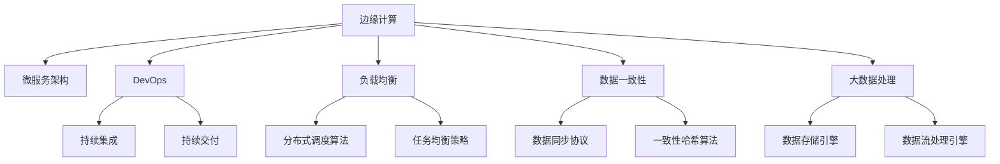

                 

# 边缘计算管理：优化分布式计算资源

> 关键词：边缘计算,分布式计算,资源优化,计算负载均衡,微服务架构,DevOps,大数据处理,云计算

## 1. 背景介绍

### 1.1 问题由来

在数字化时代，数据量的爆炸式增长和计算需求的日益复杂化，推动了计算资源从中心集中式向边缘分布式转变。边缘计算（Edge Computing）作为云计算的补充和延伸，通过将计算能力部署在靠近数据源的边缘设备上，能够有效缓解网络延迟、数据安全、带宽限制等难题，成为云计算与物联网（IoT）、5G、人工智能（AI）等前沿技术结合的重要方式。然而，边缘计算管理仍面临诸多挑战，包括资源优化、负载均衡、数据一致性等问题。

### 1.2 问题核心关键点

边缘计算管理的主要目标是确保高效利用计算资源，提升系统性能和可靠性，同时降低成本和复杂性。关键点包括：

- **资源优化**：根据不同应用场景和数据特征，合理分配计算资源，避免资源浪费。
- **负载均衡**：动态调整任务分布，使各边缘节点负载均衡，避免性能瓶颈。
- **数据一致性**：保证边缘节点间的数据一致性，减少数据冗余和重复计算。
- **安全与隐私**：确保边缘计算的数据安全，保护用户隐私。

### 1.3 问题研究意义

研究边缘计算管理技术，对于推动边缘计算的普及应用、提升计算资源利用效率、构建更加智能的物联网系统具有重要意义：

1. **提升系统效率**：通过合理分配计算资源，能够显著提升系统性能和响应速度。
2. **降低成本**：避免不必要的资源浪费，减少数据传输和存储成本。
3. **增强安全性**：数据在本地处理，降低了数据传输和存储过程中的安全风险。
4. **支持智能化**：边缘计算的高实时性、低延迟特性，为实时数据分析、智能决策等应用提供了技术保障。

## 2. 核心概念与联系

### 2.1 核心概念概述

为更好地理解边缘计算管理方法，本节将介绍几个核心概念：

- **边缘计算（Edge Computing）**：通过在网络边缘的设备上运行应用和数据处理，降低数据传输延迟，提高系统响应速度。
- **微服务架构（Microservices Architecture）**：将应用程序拆分成多个独立、可互操作的小服务，通过组合和编排实现复杂的业务逻辑。
- **DevOps（Development and Operations）**：结合软件开发和运维管理，持续集成和交付，以提高软件交付效率和质量。
- **负载均衡（Load Balancing）**：通过算法和策略，合理分配请求到多个计算节点，避免单点故障和性能瓶颈。
- **数据一致性（Data Consistency）**：确保数据在不同节点间的一致性和同步，避免数据冗余和丢失。
- **大数据处理（Big Data Processing）**：通过分布式计算框架处理海量数据，实现高效的数据存储、检索和分析。

这些核心概念之间的逻辑关系可以通过以下Mermaid流程图来展示：



这个流程图展示了一些关键概念及其相互关系：

1. 边缘计算通过微服务架构、DevOps等方法进行软件部署和管理。
2. 负载均衡和数据一致性是边缘计算管理的重要组成部分，确保系统的高可用性和数据一致性。
3. 大数据处理为边缘计算提供了海量数据的处理能力，支持复杂的数据分析和机器学习应用。

这些概念共同构成了边缘计算管理的理论基础，为构建高效、可靠、智能的边缘计算系统提供了理论指导。

## 3. 核心算法原理 & 具体操作步骤

### 3.1 算法原理概述

边缘计算管理涉及多种算法和策略，主要包括：

- **负载均衡算法**：通过算法将请求和任务合理分配到各个边缘节点，确保资源利用最大化。
- **数据一致性协议**：确保边缘节点间的数据一致性和同步，避免数据冗余和丢失。
- **容错与恢复机制**：在节点故障或网络中断时，自动恢复或重新分配任务，保证系统连续性。
- **数据隐私保护**：采用加密、匿名化等技术，确保数据在本地处理时的安全。

这些算法的核心思想是通过算法和策略优化资源分配，提升系统性能和可靠性。

### 3.2 算法步骤详解

基于边缘计算管理的目标和挑战，边缘计算管理算法大致可以分为以下几个步骤：

**Step 1: 资源探测与收集**
- 通过监控工具实时收集各边缘节点的计算资源信息，包括CPU利用率、内存使用、网络带宽等。
- 定期扫描应用负载情况，分析任务分布和资源需求。

**Step 2: 负载均衡与调度**
- 根据资源探测结果和任务需求，选择合适的负载均衡算法。常见的负载均衡算法包括：
  - **轮询算法（Round Robin）**：按顺序依次将请求分配到各个节点。
  - **最小连接数算法（Least Connections）**：将请求分配到连接数最少的节点。
  - **最少响应时间算法（Least Response Time）**：将请求分配到响应时间最短的节点。
- 动态调整任务分布，使各边缘节点负载均衡。

**Step 3: 数据一致性维护**
- 设计数据同步协议，确保边缘节点间的数据一致性。常见的数据同步协议包括：
  - **主从同步（Master-Slave Synchronization）**：选择一个主节点负责数据同步，其他节点定期向主节点同步数据。
  - **分布式一致性协议（Distributed Consensus Protocol）**：如Paxos、Raft等，通过共识算法保证数据一致性。
- 在数据传输和处理过程中，采用加密、压缩等技术保护数据隐私。

**Step 4: 容错与恢复**
- 设计容错机制，如冗余计算、任务重试等，确保系统在高可用性条件下持续运行。
- 在节点故障时，自动将任务重新分配到其他节点，保持系统连续性。

**Step 5: 性能监控与调优**
- 实时监控系统性能指标，如响应时间、吞吐量、错误率等。
- 根据监控结果，动态调整负载均衡策略和数据同步协议，优化系统性能。

### 3.3 算法优缺点

边缘计算管理算法具有以下优点：

- **提升系统效率**：通过负载均衡和资源优化，提高系统性能和响应速度。
- **降低成本**：避免不必要的资源浪费，减少数据传输和存储成本。
- **增强安全性**：数据在本地处理，降低了数据传输和存储过程中的安全风险。
- **支持智能化**：实时数据分析和智能决策为复杂应用场景提供了技术保障。

同时，这些算法也存在一些局限性：

- **复杂度高**：算法设计和实现较为复杂，需要综合考虑多方面因素。
- **通信开销大**：数据同步和任务调度需要频繁通信，增加了网络延迟和带宽消耗。
- **资源限制**：对计算资源的需求较大，边缘节点资源有限的情况下，难以支持大规模应用。

### 3.4 算法应用领域

边缘计算管理算法广泛应用于多个领域，如智能制造、智慧城市、医疗健康、金融服务等。以下是几个典型应用场景：

- **智能制造**：通过边缘计算管理，优化生产车间设备的资源分配和任务调度，提高生产效率和设备利用率。
- **智慧城市**：管理城市中的传感器和智能设备，实时处理交通、环境、安全等数据，提升城市管理水平。
- **医疗健康**：在边缘计算节点上运行医疗数据分析和机器学习模型，提高疾病诊断和治疗效率。
- **金融服务**：在边缘节点上处理交易数据和实时分析，保障金融系统的稳定性和安全性。

这些应用场景展示了边缘计算管理的广泛应用前景和实际价值。

## 4. 数学模型和公式 & 详细讲解 & 举例说明

### 4.1 数学模型构建

边缘计算管理的数学模型主要涉及资源分配和任务调度。以任务调度的轮询算法为例，构建如下数学模型：

设系统中有 $n$ 个边缘节点，每个节点处理速率 $c_i$，任务到达速率 $\lambda$，任务处理时间 $T$。任务在节点 $i$ 上的等待时间为 $W_i$。

令 $\delta$ 为轮询间隔，$\Delta$ 为时间增量，$t$ 为时间。轮询算法的过程如下：

1. 从时间 $t=0$ 开始，任务依次在节点 $1, 2, \ldots, n$ 上处理，每个节点处理时间均为 $T$。
2. 每隔 $\delta$ 时间，轮询节点处理任务，直到所有任务处理完毕。

任务在节点 $i$ 上的等待时间 $W_i$ 可以表示为：

$$ W_i = \sum_{j=1}^{\infty} \mathbb{P}(\text{任务在节点 }i\text{ 上处理}) \cdot \mathbb{E}(\text{处理时间}) $$

其中，$\mathbb{P}(\text{任务在节点 }i\text{ 上处理})$ 为任务在节点 $i$ 上处理的概率，$\mathbb{E}(\text{处理时间})$ 为任务处理时间的期望值。

### 4.2 公式推导过程

在轮询算法中，每个节点 $i$ 上的处理时间 $T$ 的期望值可以通过以下公式计算：

$$ \mathbb{E}(T) = \sum_{j=1}^{\infty} \mathbb{P}(\text{任务在节点 }i\text{ 上处理}) \cdot T $$

代入轮询间隔 $\delta$，得到：

$$ W_i = \frac{T}{\delta} \cdot \sum_{j=1}^{\infty} \mathbb{P}(\text{任务在节点 }i\text{ 上处理}) $$

根据任务到达速率 $\lambda$ 和节点处理速率 $c_i$，可以得到任务在节点 $i$ 上处理的概率：

$$ \mathbb{P}(\text{任务在节点 }i\text{ 上处理}) = \frac{\lambda \delta}{c_i + \lambda \delta} $$

代入 $W_i$ 公式，得到：

$$ W_i = \frac{T \lambda \delta}{\delta(c_i + \lambda \delta)} $$

### 4.3 案例分析与讲解

以智能制造为例，分析轮询算法在边缘计算管理中的应用：

假设系统中有 $n=3$ 个边缘节点，每个节点的处理速率 $c_i=10$，任务到达速率 $\lambda=5$，任务处理时间 $T=2$。轮询间隔 $\delta=1$。

根据公式计算每个节点的等待时间 $W_i$：

- 节点 1 的等待时间 $W_1 = \frac{2 \cdot 5 \cdot 1}{1(10 + 5 \cdot 1)} = \frac{10}{15} = \frac{2}{3}$ 秒。
- 节点 2 的等待时间 $W_2 = \frac{2 \cdot 5 \cdot 1}{2(10 + 5 \cdot 1)} = \frac{10}{20} = \frac{1}{2}$ 秒。
- 节点 3 的等待时间 $W_3 = \frac{2 \cdot 5 \cdot 1}{3(10 + 5 \cdot 1)} = \frac{10}{30} = \frac{1}{3}$ 秒。

可以看到，在轮询算法下，各个节点的任务处理时间与处理速率成正比，实现了资源的均衡分配。

## 5. 项目实践：代码实例和详细解释说明

### 5.1 开发环境搭建

在进行边缘计算管理实践前，我们需要准备好开发环境。以下是使用Python进行Kubernetes容器编排的开发环境配置流程：

1. 安装Kubernetes：从官网下载并安装Kubernetes集群，如Minikube、Rancher等。
2. 配置集群：安装并配置Kubernetes节点，如安装kubectl命令行工具。
3. 安装Python：安装Python 3.x版本，推荐使用Anaconda或Pyenv进行管理。
4. 安装相关库：安装Django、Flask、Kubernetes API等库。
5. 编写代码：使用Python编写边缘计算管理的监控、调度、负载均衡等应用代码。

### 5.2 源代码详细实现

这里以Kubernetes集群上部署微服务应用为例，给出边缘计算管理实践的代码实现。

首先，创建Django应用，用于监控和调度边缘节点资源：

```python
from django.http import JsonResponse
import kubernetes

class ResourceMonitor:
    def __init__(self, k8s_api):
        self.k8s_api = k8s_api
        self.resource_info = {}
        self.load_resource_info()

    def load_resource_info(self):
        self.resource_info = self.get_resource_info()
        print(self.resource_info)

    def get_resource_info(self):
        node_api = self.k8s_api.node_v1_api()
        nodes = node_api.list_node()
        node_resource = {}
        for node in nodes.items:
            node_resource[node.metadata.name] = self.get_node_resource(node)
        return node_resource

    def get_node_resource(self, node):
        node_api = self.k8s_api.node_v1_api()
        cpu = node_api.retrieve_resource(node.metadata.name, 'cpu')
        memory = node_api.retrieve_resource(node.metadata.name, 'memory')
        return {'cpu': cpu, 'memory': memory}

    def get_load_info(self):
        load_info = {}
        for node in self.resource_info.values():
            load_info[node['name']] = self.get_load(node['name'])
        return load_info

    def get_load(self, node_name):
        node_api = self.k8s_api.node_v1_api()
        pod_api = self.k8s_api.pod_v1_api()
        load = {}
        pods = pod_api.list_pod_for_all_nodes(node_name)
        for pod in pods.items:
            container = pod.spec.containers[0]
            load[container.name] = self.get_container_load(pod)
        return load

    def get_container_load(self, pod):
        pod_api = self.k8s_api.pod_v1_api()
        container_api = self.k8s_api.container_v1_api()
        pod = pod_api.read_namespaced_pod(pod.metadata.name, pod.metadata.namespace)
        container = container_api.read_container(pod.spec.containers[0].name)
        load = container.stat
        return load
```

然后，编写Flask应用，用于接收请求并调度任务：

```python
from flask import Flask, request
import kubernetes

app = Flask(__name__)

@app.route('/task/schedule', methods=['POST'])
def task_schedule():
    data = request.get_json()
    task_name = data['task_name']
    node_name = data['node_name']
    node_api = k8s_api.node_v1_api()
    pod_api = k8s_api.pod_v1_api()
    pod = pod_api.create_pod(name=task_name, namespace='default', node_selector={node_name: '1'})
    print(f'Task {task_name} scheduled on node {node_name}')
    return JsonResponse({'success': True})

if __name__ == '__main__':
    k8s_api = kubernetes.client.CoreV1Api()
    ResourceMonitor(k8s_api).run()
```

最后，启动Flask应用并监控边缘节点资源：

```python
if __name__ == '__main__':
    k8s_api = kubernetes.client.CoreV1Api()
    ResourceMonitor(k8s_api).run()
```

### 5.3 代码解读与分析

让我们再详细解读一下关键代码的实现细节：

**ResourceMonitor类**：
- `__init__`方法：初始化Kubernetes API和资源信息。
- `load_resource_info`方法：加载并更新边缘节点的资源信息。
- `get_resource_info`方法：通过API获取节点资源信息。
- `get_node_resource`方法：获取节点资源的具体信息，如CPU、内存使用情况。
- `get_load_info`方法：获取各个边缘节点的负载信息。
- `get_load`方法：通过API获取特定节点上的任务负载情况。
- `get_container_load`方法：获取容器负载信息。

**Flask应用**：
- `task_schedule`方法：接收任务调度请求，并调用Kubernetes API创建Pod进行任务调度。

可以看到，通过Python和Kubernetes API，我们可以方便地实现边缘计算管理系统的监控和调度功能。开发者可以在此基础上进一步扩展其他功能，如数据同步、容错机制、性能监控等，以构建完整的边缘计算管理系统。

## 6. 实际应用场景

### 6.1 智能制造

在智能制造中，边缘计算管理可以优化生产车间设备的资源分配和任务调度。通过实时监控设备状态和任务负载，合理分配计算资源，提高生产效率和设备利用率。例如，通过轮询算法将生产任务分配到不同设备上，避免单一设备过度负载。

### 6.2 智慧城市

在智慧城市中，边缘计算管理可以优化城市中的传感器和智能设备，实时处理交通、环境、安全等数据。通过负载均衡算法，合理分配数据处理任务到各个边缘节点，提升系统响应速度和数据处理能力。例如，在交通管理系统中，将摄像头数据处理任务分布到边缘节点上，实现实时交通监控和分析。

### 6.3 医疗健康

在医疗健康中，边缘计算管理可以优化医疗数据分析和机器学习模型的部署和运行。通过负载均衡算法，将医疗数据分布到不同边缘节点上，提高数据处理和模型训练的速度。例如，在远程医疗系统中，将患者数据和医疗影像处理任务分布到边缘节点上，实时处理和分析患者数据，提升诊断和治疗效率。

### 6.4 未来应用展望

随着边缘计算技术的不断发展和应用场景的不断丰富，边缘计算管理技术也将呈现出更加广阔的前景。未来，边缘计算管理技术将在以下几个方面取得突破：

1. **边缘计算资源池化**：构建统一的资源管理平台，实现边缘计算资源池化，提升资源利用效率。
2. **多云融合**：实现边缘计算和云资源的协同管理，提供更灵活的资源调度和分配。
3. **实时数据分析**：在边缘节点上部署实时数据分析系统，实现数据即时处理和智能决策。
4. **边缘智能**：通过人工智能技术，提升边缘节点的自主决策和智能处理能力。
5. **边缘安全**：加强边缘计算的安全防护，保障数据和系统的安全。

## 7. 工具和资源推荐

### 7.1 学习资源推荐

为了帮助开发者系统掌握边缘计算管理的理论基础和实践技巧，这里推荐一些优质的学习资源：

1. **Kubernetes官方文档**：详细介绍了Kubernetes的部署、管理和调度机制，是学习边缘计算管理的重要资料。
2. **微服务架构设计**：深入讲解微服务架构的设计原则和实践经验，适合深入理解微服务在边缘计算中的应用。
3. **DevOps实践指南**：提供了丰富的DevOps实践案例和工具推荐，帮助开发者实现持续集成和交付。
4. **边缘计算技术手册**：全面介绍了边缘计算技术的概念、架构和应用场景，适合深入了解边缘计算的发展方向。

通过对这些资源的学习实践，相信你一定能够快速掌握边缘计算管理的精髓，并用于解决实际的系统问题。

### 7.2 开发工具推荐

高效的开发离不开优秀的工具支持。以下是几款用于边缘计算管理开发的常用工具：

1. **Kubernetes**：开源的容器编排平台，提供资源调度、负载均衡等功能。
2. **Django**：Python的Web框架，适合快速开发监控和调度应用。
3. **Flask**：轻量级的Web框架，适合快速开发API接口。
4. **kubectl**：Kubernetes的命令行工具，方便进行集群管理和资源调优。
5. **Prometheus**：开源的监控系统，支持多维度实时监控和报警。
6. **Grafana**：开源的可视化工具，支持数据可视化和仪表盘构建。

合理利用这些工具，可以显著提升边缘计算管理系统的开发效率，加快创新迭代的步伐。

### 7.3 相关论文推荐

边缘计算管理技术的研究始于学界的持续探索，以下是几篇奠基性的相关论文，推荐阅读：

1. **Edge Computing: A survey**：综述了边缘计算的概念、架构和应用，为边缘计算管理提供了理论基础。
2. **Edge Computing Management in IoT Systems**：介绍了边缘计算在物联网系统中的应用和管理策略。
3. **Load Balancing in Edge Computing**：探讨了边缘计算中的负载均衡算法，为边缘计算管理提供了实际解决方案。
4. **Edge Computing with Kubernetes**：介绍了在Kubernetes上部署和管理边缘计算应用的最佳实践。
5. **Big Data in Edge Computing**：探讨了大数据处理在边缘计算中的应用和挑战。

这些论文代表了大边缘计算管理技术的发展脉络，通过学习这些前沿成果，可以帮助研究者把握学科前进方向，激发更多的创新灵感。

## 8. 总结：未来发展趋势与挑战

### 8.1 总结

本文对边缘计算管理技术进行了全面系统的介绍。首先阐述了边缘计算管理的背景和意义，明确了优化分布式计算资源的核心目标。其次，从原理到实践，详细讲解了负载均衡、数据一致性等关键算法，给出了边缘计算管理的代码实现和性能分析。同时，本文还探讨了边缘计算管理的广泛应用场景，展示了其在智能制造、智慧城市、医疗健康等领域的实际价值。

通过本文的系统梳理，可以看到，边缘计算管理技术在提升计算资源利用效率、构建高效可靠的系统方面具有重要作用。未来，伴随边缘计算技术的不断发展，边缘计算管理技术也将进一步成熟和完善，为构建更加智能、高效、安全的边缘计算系统提供坚实的基础。

### 8.2 未来发展趋势

展望未来，边缘计算管理技术将呈现以下几个发展趋势：

1. **边缘计算资源池化**：构建统一的资源管理平台，实现边缘计算资源池化，提升资源利用效率。
2. **多云融合**：实现边缘计算和云资源的协同管理，提供更灵活的资源调度和分配。
3. **实时数据分析**：在边缘节点上部署实时数据分析系统，实现数据即时处理和智能决策。
4. **边缘智能**：通过人工智能技术，提升边缘节点的自主决策和智能处理能力。
5. **边缘安全**：加强边缘计算的安全防护，保障数据和系统的安全。

以上趋势凸显了边缘计算管理技术的广阔前景。这些方向的探索发展，必将进一步提升边缘计算系统的性能和可靠性，为构建智能化的物联网系统提供坚实保障。

### 8.3 面临的挑战

尽管边缘计算管理技术已经取得了显著成果，但在迈向更加智能化、普适化应用的过程中，它仍面临诸多挑战：

1. **复杂度高**：算法设计和实现较为复杂，需要综合考虑多方面因素。
2. **通信开销大**：数据同步和任务调度需要频繁通信，增加了网络延迟和带宽消耗。
3. **资源限制**：对计算资源的需求较大，边缘节点资源有限的情况下，难以支持大规模应用。
4. **安全风险**：边缘计算中存在数据泄露、设备攻击等风险，需加强安全防护。
5. **系统稳定性**：边缘节点故障或网络中断时，需保证系统连续性和容错性。

### 8.4 研究展望

面对边缘计算管理面临的挑战，未来的研究需要在以下几个方面寻求新的突破：

1. **简化算法设计**：开发更简洁高效的算法，降低实现复杂度。
2. **优化通信机制**：通过数据压缩、边缘缓存等技术，减少通信开销。
3. **增强资源弹性**：设计可扩展的资源调度策略，支持大规模应用。
4. **提升安全防护**：引入加密、匿名化等技术，保障数据安全。
5. **增强系统可靠性**：设计容错机制和自动恢复策略，提升系统稳定性。

这些研究方向的探索，必将引领边缘计算管理技术迈向更高的台阶，为构建安全、可靠、智能的物联网系统提供坚实保障。面向未来，边缘计算管理技术还需要与其他人工智能技术进行更深入的融合，如知识表示、因果推理、强化学习等，多路径协同发力，共同推动边缘计算技术的发展。只有勇于创新、敢于突破，才能不断拓展边缘计算技术的边界，让智能技术更好地造福人类社会。

## 9. 附录：常见问题与解答

**Q1：边缘计算和传统云计算有何不同？**

A: 边缘计算和传统云计算的主要区别在于计算资源的分布和处理方式。云计算将计算资源集中部署在数据中心，通过互联网提供服务，处理量大且集中；而边缘计算将计算资源部署在靠近数据源的边缘设备上，处理量较小且分散。边缘计算能够降低网络延迟，提高数据处理速度，但资源管理和调度更加复杂。

**Q2：边缘计算管理中，如何平衡任务负载？**

A: 边缘计算管理中，任务负载均衡可以通过以下方法实现：
1. 轮询算法：按顺序依次将请求分配到各个节点。
2. 最小连接数算法：将请求分配到连接数最少的节点。
3. 最少响应时间算法：将请求分配到响应时间最短的节点。
通过动态调整任务分布，使各边缘节点负载均衡，避免性能瓶颈。

**Q3：边缘计算管理中，如何保障数据一致性？**

A: 边缘计算管理中，数据一致性可以通过以下方法实现：
1. 主从同步算法：选择一个主节点负责数据同步，其他节点定期向主节点同步数据。
2. 分布式一致性协议：如Paxos、Raft等，通过共识算法保证数据一致性。
通过在数据传输和处理过程中，采用加密、压缩等技术保护数据隐私。

**Q4：边缘计算管理中，如何提升系统安全性？**

A: 边缘计算管理中，系统安全性可以通过以下方法实现：
1. 数据加密：在数据传输和存储过程中，采用加密技术保护数据安全。
2. 访问控制：限制节点和用户对资源的访问权限，防止未授权访问。
3. 监控审计：实时监控系统运行状态，记录和分析日志，发现并应对安全威胁。

**Q5：边缘计算管理中，如何优化资源使用？**

A: 边缘计算管理中，资源优化可以通过以下方法实现：
1. 资源探测与收集：实时收集各边缘节点的计算资源信息，优化资源分配。
2. 任务调度算法：通过轮询算法、最小连接数算法等，合理分配任务。
3. 负载均衡策略：动态调整任务分布，使各边缘节点负载均衡。
通过以上方法，可以显著提升资源利用效率，降低成本和能耗。

通过本文的系统梳理，可以看到，边缘计算管理技术在提升计算资源利用效率、构建高效可靠的系统方面具有重要作用。未来，伴随边缘计算技术的不断发展，边缘计算管理技术也将进一步成熟和完善，为构建智能化的物联网系统提供坚实的基础。面向未来，边缘计算管理技术还需要与其他人工智能技术进行更深入的融合，如知识表示、因果推理、强化学习等，多路径协同发力，共同推动边缘计算技术的发展。只有勇于创新、敢于突破，才能不断拓展边缘计算技术的边界，让智能技术更好地造福人类社会。

---

作者：禅与计算机程序设计艺术 / Zen and the Art of Computer Programming

