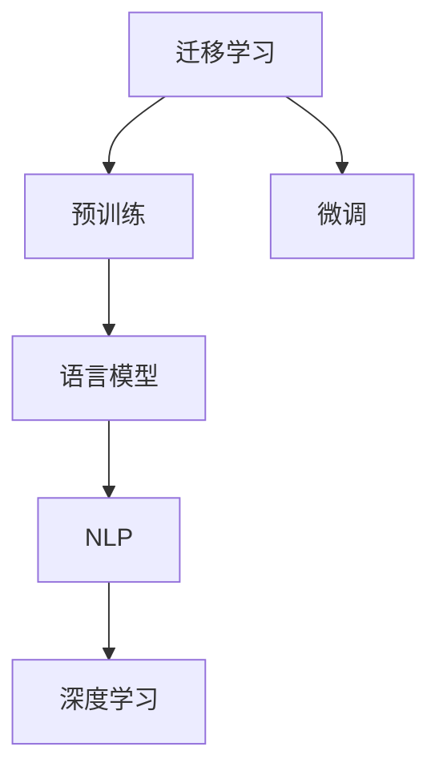

                 

# 迁移学习在NLP中的应用：从预训练到微调

> 关键词：迁移学习, NLP, 预训练, 微调, 自然语言处理(NLP), 语言模型, 深度学习, 模型迁移

## 1. 背景介绍

### 1.1 问题由来
自然语言处理（Natural Language Processing，NLP）是人工智能（AI）领域中最重要的分支之一，它旨在使计算机能够理解、解释和生成人类语言。随着深度学习技术的发展，大规模预训练语言模型（Large Language Models，LLMs），如BERT、GPT系列等，通过在海量无标签文本数据上进行预训练，学习到丰富的语言知识和常识，成为NLP任务的重要基础。然而，由于这些通用模型在特定领域的泛化能力有限，如何高效利用预训练模型提升其在特定任务上的性能，成为了当前NLP研究的热点。

### 1.2 问题核心关键点
迁移学习（Transfer Learning）是解决这一问题的关键技术，它通过将预训练模型应用于新任务，减少在新任务上的学习时间，提升模型性能。具体来说，迁移学习包括两个阶段：预训练和微调。预训练是在大规模无标签数据上训练模型，使其学习到通用的语言表示；微调则是将预训练模型应用于特定任务，通过少量有标签数据调整模型参数，使得模型能够在新任务上表现优异。

迁移学习的核心在于如何选择合适的预训练模型，以及如何通过微调，将预训练模型在新任务上得到良好的泛化能力。这一过程需要考虑预训练模型的通用性和任务的具体需求，同时要避免过拟合和保持模型的泛化性能。

## 2. 核心概念与联系

### 2.1 核心概念概述

为更好地理解迁移学习在NLP中的应用，本节将介绍几个关键概念及其之间的联系：

- 迁移学习：通过已有知识在新任务上的迁移，减少学习时间，提升模型性能。
- 预训练：在大规模无标签数据上训练模型，学习到通用的语言表示。
- 微调：将预训练模型应用于新任务，通过少量有标签数据调整模型参数，使其在新任务上表现优异。
- 自然语言处理（NLP）：使计算机能够理解、解释和生成人类语言的技术。
- 语言模型：通过大量文本数据训练得到的模型，用于预测给定文本序列的概率。
- 深度学习：基于多层神经网络的机器学习技术，用于复杂数据处理和模式识别。

这些概念之间的联系可以通过以下Mermaid流程图来展示：



这个流程图展示了迁移学习在NLP领域中的应用过程：预训练使得模型学习到通用的语言表示，微调则在特定任务上调整模型参数，最终通过NLP技术实现对人类语言的理解和生成，并在深度学习框架下进行模型训练。

## 3. 核心算法原理 & 具体操作步骤

### 3.1 算法原理概述

迁移学习在NLP中的核心原理是通过将预训练模型的知识迁移到特定任务上，提升模型在新任务上的性能。具体来说，预训练模型通过在大规模无标签数据上进行训练，学习到通用的语言表示，这些表示可以迁移到特定任务上，通过少量有标签数据微调模型，使得模型在新任务上能够表现得更好。

在预训练阶段，模型通常使用自监督学习任务（如掩码语言模型、下一句预测等）在大规模语料上训练，学习到对语言结构的深刻理解。在微调阶段，模型通过在特定任务上的少量有标签数据上进行训练，调整模型参数，使其在新任务上能够进行有效的推理和生成。

### 3.2 算法步骤详解

迁移学习在NLP中的应用包括以下几个关键步骤：

**Step 1: 准备预训练模型和数据集**
- 选择合适的预训练模型，如BERT、GPT系列等。
- 准备新任务的标注数据集，划分为训练集、验证集和测试集。

**Step 2: 微调超参数设置**
- 确定微调的优化算法及其参数，如Adam、SGD等，设置学习率、批大小、迭代轮数等。
- 设置正则化技术及强度，包括权重衰减、Dropout、Early Stopping等。
- 确定冻结预训练参数的策略，如仅微调顶层，或全部参数都参与微调。

**Step 3: 执行梯度训练**
- 将训练集数据分批次输入模型，前向传播计算损失函数。
- 反向传播计算参数梯度，根据设定的优化算法和学习率更新模型参数。
- 周期性在验证集上评估模型性能，根据性能指标决定是否触发Early Stopping。
- 重复上述步骤直到满足预设的迭代轮数或Early Stopping条件。

**Step 4: 测试和部署**
- 在测试集上评估微调后模型，对比微调前后的精度提升。
- 使用微调后的模型对新样本进行推理预测，集成到实际的应用系统中。
- 持续收集新的数据，定期重新微调模型，以适应数据分布的变化。

### 3.3 算法优缺点

迁移学习在NLP中的应用具有以下优点：
1. 提升模型性能：通过将预训练模型的知识迁移到特定任务上，可以显著提升模型在新任务上的性能。
2. 减少标注数据需求：由于预训练模型已经学习到了通用的语言表示，因此微调所需的标注数据相对较少。
3. 加速模型训练：通过微调，模型可以在相对较短的时间内适应新任务，提高训练效率。
4. 提高泛化能力：由于预训练模型在大规模数据上进行了训练，因此其在特定任务上的泛化能力较强。

同时，迁移学习也存在一些局限性：
1. 数据偏差问题：预训练模型可能受到数据偏差的影响，从而在特定任务上表现不佳。
2. 模型鲁棒性：预训练模型可能对输入的噪声和变化敏感，导致微调模型泛化性能下降。
3. 过拟合风险：尽管微调所需的标注数据较少，但微调过程中仍需注意避免过拟合。
4. 模型可解释性：预训练模型的决策过程通常缺乏可解释性，难以对其推理逻辑进行分析和调试。

尽管存在这些局限性，迁移学习在NLP中的应用仍具有重要意义。未来相关研究的重点在于如何进一步提高模型的泛化能力，降低对标注数据的依赖，以及提高模型的可解释性和鲁棒性。

### 3.4 算法应用领域

迁移学习在NLP中的应用非常广泛，涵盖了以下几个领域：

- 文本分类：如情感分析、主题分类、意图识别等。通过微调使得模型学习文本-标签映射。
- 命名实体识别：识别文本中的人名、地名、机构名等特定实体。通过微调使模型掌握实体边界和类型。
- 关系抽取：从文本中抽取实体之间的语义关系。通过微调使模型学习实体-关系三元组。
- 问答系统：对自然语言问题给出答案。将问题-答案对作为微调数据，训练模型学习匹配答案。
- 机器翻译：将源语言文本翻译成目标语言。通过微调使模型学习语言-语言映射。
- 文本摘要：将长文本压缩成简短摘要。将文章-摘要对作为微调数据，使模型学习抓取要点。
- 对话系统：使机器能够与人自然对话。将多轮对话历史作为上下文，微调模型进行回复生成。

除了上述这些经典任务外，迁移学习还被创新性地应用到更多场景中，如可控文本生成、常识推理、代码生成、数据增强等，为NLP技术带来了全新的突破。

## 4. 数学模型和公式 & 详细讲解 & 举例说明

### 4.1 数学模型构建

迁移学习在NLP中的应用涉及多个数学模型和算法，以下是一些核心模型的构建：

- 掩码语言模型（Masked Language Modeling, MLM）：用于训练预训练模型，目标是根据上下文预测缺失的单词。模型接收一个序列 $x=\{x_1,x_2,...,x_n\}$，其中 $x_i$ 表示第 $i$ 个单词，目标为预测 $m$ 个随机位置上的单词，即 $\hat{x}=\{x_{i_1},x_{i_2},...,x_{i_m}\}$。

- 下一句预测（Next Sentence Prediction, NSP）：用于训练预训练模型，目标是根据两个句子是否连续来判断其关系。模型接收两个句子 $s_1$ 和 $s_2$，目标为预测它们是否连续，即 $\hat{y} \in \{0,1\}$，其中 $0$ 表示两个句子不连续，$1$ 表示两个句子连续。

- 跨领域迁移学习（Cross-Domain Transfer Learning）：用于将预训练模型从一个领域迁移到另一个领域。假设原始领域为 $D_1$，目标领域为 $D_2$，其中 $D_1$ 和 $D_2$ 分别包含 $n_1$ 和 $n_2$ 个样本，目标为在目标领域 $D_2$ 上进行微调，使得模型在目标领域上表现优异。

### 4.2 公式推导过程

以下我们以文本分类任务为例，推导掩码语言模型的损失函数及其梯度的计算公式。

假设模型 $M_{\theta}$ 在输入 $x$ 上的输出为 $\hat{y}=M_{\theta}(x) \in [0,1]$，表示样本属于正类的概率。真实标签 $y \in \{0,1\}$。则二分类交叉熵损失函数定义为：

$$
\ell(M_{\theta}(x),y) = -[y\log \hat{y} + (1-y)\log (1-\hat{y})]
$$

将其代入经验风险公式，得：

$$
\mathcal{L}(\theta) = -\frac{1}{N}\sum_{i=1}^N [y_i\log M_{\theta}(x_i)+(1-y_i)\log(1-M_{\theta}(x_i))]
$$

在预训练阶段，掩码语言模型通常以预测 $m$ 个随机位置上的单词作为训练目标。假设输入序列 $x$ 的长度为 $n$，随机位置为 $p=\{p_1,p_2,...,p_m\}$，其中 $p_i \in \{1,2,...,n\}$，表示位置 $i$ 上的单词被随机掩码。则掩码语言模型的损失函数可以表示为：

$$
\mathcal{L}_{MLM}(\theta) = -\frac{1}{n}\sum_{i=1}^n \sum_{j=1}^m [y_j\log M_{\theta}(x_{p_j})+(1-y_j)\log(1-M_{\theta}(x_{p_j}))]
$$

在微调阶段，模型通过在特定任务上的少量有标签数据上进行训练，调整模型参数。假设任务为文本分类，目标为预测文本的类别。假设模型接收输入 $x$，输出 $y$，其中 $y \in \{0,1\}$，表示样本属于正类的概率。则文本分类的交叉熵损失函数为：

$$
\mathcal{L}_{CLS}(\theta) = -\frac{1}{N}\sum_{i=1}^N [y_i\log M_{\theta}(x_i)+(1-y_i)\log(1-M_{\theta}(x_i))]
$$

在得到损失函数的梯度后，即可带入参数更新公式，完成模型的迭代优化。重复上述过程直至收敛，最终得到适应下游任务的最优模型参数 $\theta^*$。

### 4.3 案例分析与讲解

以下是一个基于BERT模型进行情感分析的微调案例。

假设我们需要对电影评论进行情感分类，将正面评论标记为 $1$，负面评论标记为 $0$。我们准备了100条有标签的评论，将其分为训练集、验证集和测试集。

**Step 1: 准备预训练模型和数据集**
- 使用预训练的BERT模型作为初始化参数，如BERT-base。
- 准备训练集、验证集和测试集，划分为文本和标签两部分。

**Step 2: 微调超参数设置**
- 确定优化算法及其参数，如Adam、学习率为 $2e-5$。
- 设置正则化技术及强度，包括权重衰减 $0.01$、Dropout $0.1$。
- 确定冻结预训练参数的策略，如仅微调顶部分类器。

**Step 3: 执行梯度训练**
- 将训练集数据分批次输入模型，前向传播计算损失函数。
- 反向传播计算参数梯度，根据设定的优化算法和学习率更新模型参数。
- 周期性在验证集上评估模型性能，根据性能指标决定是否触发Early Stopping。
- 重复上述步骤直到满足预设的迭代轮数或Early Stopping条件。

**Step 4: 测试和部署**
- 在测试集上评估微调后模型，对比微调前后的精度提升。
- 使用微调后的模型对新样本进行推理预测，集成到实际的应用系统中。
- 持续收集新的数据，定期重新微调模型，以适应数据分布的变化。

这个案例展示了迁移学习在NLP中的实际应用。通过将BERT模型的知识迁移到情感分析任务上，可以显著提升模型在新任务上的性能。

## 5. 项目实践：代码实例和详细解释说明

### 5.1 开发环境搭建

在进行迁移学习实践前，我们需要准备好开发环境。以下是使用Python进行PyTorch开发的环境配置流程：

1. 安装Anaconda：从官网下载并安装Anaconda，用于创建独立的Python环境。

2. 创建并激活虚拟环境：
```bash
conda create -n pytorch-env python=3.8 
conda activate pytorch-env
```

3. 安装PyTorch：根据CUDA版本，从官网获取对应的安装命令。例如：
```bash
conda install pytorch torchvision torchaudio cudatoolkit=11.1 -c pytorch -c conda-forge
```

4. 安装Transformers库：
```bash
pip install transformers
```

5. 安装各类工具包：
```bash
pip install numpy pandas scikit-learn matplotlib tqdm jupyter notebook ipython
```

完成上述步骤后，即可在`pytorch-env`环境中开始迁移学习实践。

### 5.2 源代码详细实现

下面我们以情感分析任务为例，给出使用Transformers库对BERT模型进行迁移学习的PyTorch代码实现。

首先，定义情感分析任务的数据处理函数：

```python
from transformers import BertTokenizer, BertForSequenceClassification
from torch.utils.data import Dataset
import torch

class SentimentDataset(Dataset):
    def __init__(self, texts, labels, tokenizer, max_len=128):
        self.texts = texts
        self.labels = labels
        self.tokenizer = tokenizer
        self.max_len = max_len
        
    def __len__(self):
        return len(self.texts)
    
    def __getitem__(self, item):
        text = self.texts[item]
        label = self.labels[item]
        
        encoding = self.tokenizer(text, return_tensors='pt', max_length=self.max_len, padding='max_length', truncation=True)
        input_ids = encoding['input_ids'][0]
        attention_mask = encoding['attention_mask'][0]
        
        # 将标签转换为独热编码
        labels = torch.tensor(label2id[label], dtype=torch.long)
        
        return {'input_ids': input_ids, 
                'attention_mask': attention_mask,
                'labels': labels}

# 标签与id的映射
label2id = {'negative': 0, 'positive': 1}
id2label = {v: k for k, v in label2id.items()}

# 创建dataset
tokenizer = BertTokenizer.from_pretrained('bert-base-cased')

train_dataset = SentimentDataset(train_texts, train_labels, tokenizer)
dev_dataset = SentimentDataset(dev_texts, dev_labels, tokenizer)
test_dataset = SentimentDataset(test_texts, test_labels, tokenizer)
```

然后，定义模型和优化器：

```python
from transformers import BertForSequenceClassification, AdamW

model = BertForSequenceClassification.from_pretrained('bert-base-cased', num_labels=len(label2id))

optimizer = AdamW(model.parameters(), lr=2e-5)
```

接着，定义训练和评估函数：

```python
from torch.utils.data import DataLoader
from tqdm import tqdm
from sklearn.metrics import classification_report

device = torch.device('cuda') if torch.cuda.is_available() else torch.device('cpu')
model.to(device)

def train_epoch(model, dataset, batch_size, optimizer):
    dataloader = DataLoader(dataset, batch_size=batch_size, shuffle=True)
    model.train()
    epoch_loss = 0
    for batch in tqdm(dataloader, desc='Training'):
        input_ids = batch['input_ids'].to(device)
        attention_mask = batch['attention_mask'].to(device)
        labels = batch['labels'].to(device)
        model.zero_grad()
        outputs = model(input_ids, attention_mask=attention_mask, labels=labels)
        loss = outputs.loss
        epoch_loss += loss.item()
        loss.backward()
        optimizer.step()
    return epoch_loss / len(dataloader)

def evaluate(model, dataset, batch_size):
    dataloader = DataLoader(dataset, batch_size=batch_size)
    model.eval()
    preds, labels = [], []
    with torch.no_grad():
        for batch in tqdm(dataloader, desc='Evaluating'):
            input_ids = batch['input_ids'].to(device)
            attention_mask = batch['attention_mask'].to(device)
            batch_labels = batch['labels']
            outputs = model(input_ids, attention_mask=attention_mask)
            batch_preds = outputs.logits.argmax(dim=2).to('cpu').tolist()
            batch_labels = batch_labels.to('cpu').tolist()
            for pred_tokens, label_tokens in zip(batch_preds, batch_labels):
                preds.append(pred_tokens)
                labels.append(label_tokens)
                
    print(classification_report(labels, preds))
```

最后，启动训练流程并在测试集上评估：

```python
epochs = 5
batch_size = 16

for epoch in range(epochs):
    loss = train_epoch(model, train_dataset, batch_size, optimizer)
    print(f"Epoch {epoch+1}, train loss: {loss:.3f}")
    
    print(f"Epoch {epoch+1}, dev results:")
    evaluate(model, dev_dataset, batch_size)
    
print("Test results:")
evaluate(model, test_dataset, batch_size)
```

以上就是使用PyTorch对BERT进行情感分析任务迁移学习的完整代码实现。可以看到，得益于Transformers库的强大封装，我们可以用相对简洁的代码完成BERT模型的加载和迁移学习。

### 5.3 代码解读与分析

让我们再详细解读一下关键代码的实现细节：

**SentimentDataset类**：
- `__init__`方法：初始化文本、标签、分词器等关键组件。
- `__len__`方法：返回数据集的样本数量。
- `__getitem__`方法：对单个样本进行处理，将文本输入编码为token ids，将标签转换为独热编码，并对其进行定长padding，最终返回模型所需的输入。

**label2id和id2label字典**：
- 定义了标签与数字id之间的映射关系，用于将标签转换为模型可以理解的格式。

**训练和评估函数**：
- 使用PyTorch的DataLoader对数据集进行批次化加载，供模型训练和推理使用。
- 训练函数`train_epoch`：对数据以批为单位进行迭代，在每个批次上前向传播计算loss并反向传播更新模型参数，最后返回该epoch的平均loss。
- 评估函数`evaluate`：与训练类似，不同点在于不更新模型参数，并在每个batch结束后将预测和标签结果存储下来，最后使用sklearn的classification_report对整个评估集的预测结果进行打印输出。

**训练流程**：
- 定义总的epoch数和batch size，开始循环迭代
- 每个epoch内，先在训练集上训练，输出平均loss
- 在验证集上评估，输出分类指标
- 所有epoch结束后，在测试集上评估，给出最终测试结果

可以看到，PyTorch配合Transformers库使得BERT迁移学习的代码实现变得简洁高效。开发者可以将更多精力放在数据处理、模型改进等高层逻辑上，而不必过多关注底层的实现细节。

当然，工业级的系统实现还需考虑更多因素，如模型的保存和部署、超参数的自动搜索、更灵活的任务适配层等。但核心的迁移学习范式基本与此类似。

## 6. 实际应用场景

### 6.1 智能客服系统

基于预训练模型进行迁移学习，可以广泛应用于智能客服系统的构建。传统客服往往需要配备大量人力，高峰期响应缓慢，且一致性和专业性难以保证。使用迁移学习后的对话模型，可以7x24小时不间断服务，快速响应客户咨询，用自然流畅的语言解答各类常见问题。

在技术实现上，可以收集企业内部的历史客服对话记录，将问题和最佳答复构建成监督数据，在此基础上对预训练对话模型进行迁移学习。迁移学习后的对话模型能够自动理解用户意图，匹配最合适的答案模板进行回复。对于客户提出的新问题，还可以接入检索系统实时搜索相关内容，动态组织生成回答。如此构建的智能客服系统，能大幅提升客户咨询体验和问题解决效率。

### 6.2 金融舆情监测

金融机构需要实时监测市场舆论动向，以便及时应对负面信息传播，规避金融风险。传统的人工监测方式成本高、效率低，难以应对网络时代海量信息爆发的挑战。基于预训练模型进行迁移学习的文本分类和情感分析技术，为金融舆情监测提供了新的解决方案。

具体而言，可以收集金融领域相关的新闻、报道、评论等文本数据，并对其进行主题标注和情感标注。在此基础上对预训练语言模型进行迁移学习，使其能够自动判断文本属于何种主题，情感倾向是正面、中性还是负面。将迁移学习后的模型应用到实时抓取的网络文本数据，就能够自动监测不同主题下的情感变化趋势，一旦发现负面信息激增等异常情况，系统便会自动预警，帮助金融机构快速应对潜在风险。

### 6.3 个性化推荐系统

当前的推荐系统往往只依赖用户的历史行为数据进行物品推荐，无法深入理解用户的真实兴趣偏好。基于预训练模型进行迁移学习，个性化推荐系统可以更好地挖掘用户行为背后的语义信息，从而提供更精准、多样的推荐内容。

在实践中，可以收集用户浏览、点击、评论、分享等行为数据，提取和用户交互的物品标题、描述、标签等文本内容。将文本内容作为模型输入，用户的后续行为（如是否点击、购买等）作为监督信号，在此基础上迁移学习预训练语言模型。迁移学习后的模型能够从文本内容中准确把握用户的兴趣点。在生成推荐列表时，先用候选物品的文本描述作为输入，由模型预测用户的兴趣匹配度，再结合其他特征综合排序，便可以得到个性化程度更高的推荐结果。

### 6.4 未来应用展望

随着预训练模型和迁移学习方法的发展，基于迁移学习范式将在更多领域得到应用，为传统行业带来变革性影响。

在智慧医疗领域，基于迁移学习的多模态模型能够结合病历、影像、基因等多种数据源，提升对病情的理解和治疗方案的推荐，辅助医生诊疗，加速新药开发进程。

在智能教育领域，迁移学习可应用于作业批改、学情分析、知识推荐等方面，因材施教，促进教育公平，提高教学质量。

在智慧城市治理中，迁移学习模型可应用于城市事件监测、舆情分析、应急指挥等环节，提高城市管理的自动化和智能化水平，构建更安全、高效的未来城市。

此外，在企业生产、社会治理、文娱传媒等众多领域，基于预训练模型的迁移学习应用也将不断涌现，为经济社会发展注入新的动力。相信随着技术的日益成熟，迁移学习技术将成为人工智能落地应用的重要范式，推动人工智能技术在垂直行业的规模化落地。总之，迁移学习需要开发者根据具体任务，不断迭代和优化模型、数据和算法，方能得到理想的效果。

## 7. 工具和资源推荐

### 7.1 学习资源推荐

为了帮助开发者系统掌握预训练模型和迁移学习在NLP中的应用，这里推荐一些优质的学习资源：

1. 《深度学习》系列课程：由斯坦福大学等顶级高校开设的深度学习课程，涵盖从基础到高级的深度学习知识，包括预训练模型和迁移学习等内容。

2. 《自然语言处理综述》系列文章：由著名NLP专家Yoshua Bengio、Ian Goodfellow等人撰写，详细介绍了NLP领域的前沿技术，包括预训练模型和迁移学习。

3. 《自然语言处理》系列书籍：涵盖了从理论到实践的NLP知识，包括预训练模型和迁移学习在内的多种技术。

4. HuggingFace官方文档：Transformer库的官方文档，提供了海量预训练模型和完整的迁移学习样例代码，是上手实践的必备资料。

5. CLUE开源项目：中文语言理解测评基准，涵盖大量不同类型的中文NLP数据集，并提供了基于迁移学习的baseline模型，助力中文NLP技术发展。

通过对这些资源的学习实践，相信你一定能够快速掌握预训练模型和迁移学习在NLP中的应用，并用于解决实际的NLP问题。

### 7.2 开发工具推荐

高效的开发离不开优秀的工具支持。以下是几款用于预训练模型和迁移学习开发的常用工具：

1. PyTorch：基于Python的开源深度学习框架，灵活动态的计算图，适合快速迭代研究。大部分预训练语言模型都有PyTorch版本的实现。

2. TensorFlow：由Google主导开发的开源深度学习框架，生产部署方便，适合大规模工程应用。同样有丰富的预训练语言模型资源。

3. Transformers库：HuggingFace开发的NLP工具库，集成了众多SOTA语言模型，支持PyTorch和TensorFlow，是进行迁移学习任务的开发的利器。

4. Weights & Biases：模型训练的实验跟踪工具，可以记录和可视化模型训练过程中的各项指标，方便对比和调优。与主流深度学习框架无缝集成。

5. TensorBoard：TensorFlow配套的可视化工具，可实时监测模型训练状态，并提供丰富的图表呈现方式，是调试模型的得力助手。

6. Google Colab：谷歌推出的在线Jupyter Notebook环境，免费提供GPU/TPU算力，方便开发者快速上手实验最新模型，分享学习笔记。

合理利用这些工具，可以显著提升预训练模型和迁移学习任务的开发效率，加快创新迭代的步伐。

### 7.3 相关论文推荐

预训练模型和迁移学习的发展源于学界的持续研究。以下是几篇奠基性的相关论文，推荐阅读：

1. Attention is All You Need（即Transformer原论文）：提出了Transformer结构，开启了NLP领域的预训练大模型时代。

2. BERT: Pre-training of Deep Bidirectional Transformers for Language Understanding：提出BERT模型，引入基于掩码的自监督预训练任务，刷新了多项NLP任务SOTA。

3. Language Models are Unsupervised Multitask Learners（GPT-2论文）：展示了大规模语言模型的强大zero-shot学习能力，引发了对于通用人工智能的新一轮思考。

4. Adaptation for Multilingual Pretrained Models: Pretraining, Finetuning, and Testing of Cross-lingual Multilingual Multitask Language Models：提出多语言预训练模型，通过迁移学习在不同语言上取得良好效果。

5. AdaLoRA: Adaptive Low-Rank Adaptation for Parameter-Efficient Fine-Tuning：使用自适应低秩适应的迁移学习方法，在参数效率和精度之间取得了新的平衡。

这些论文代表了大语言模型迁移学习的发展脉络。通过学习这些前沿成果，可以帮助研究者把握学科前进方向，激发更多的创新灵感。

## 8. 总结：未来发展趋势与挑战

### 8.1 总结

本文对预训练模型和迁移学习在NLP中的应用进行了全面系统的介绍。首先阐述了预训练模型和迁移学习的背景和意义，明确了其在NLP领域的重要价值。其次，从原理到实践，详细讲解了预训练和微调的全过程，给出了迁移学习任务开发的完整代码实例。同时，本文还广泛探讨了迁移学习在智能客服、金融舆情、个性化推荐等多个行业领域的应用前景，展示了迁移学习范式的巨大潜力。此外，本文精选了预训练模型和迁移学习的各类学习资源，力求为读者提供全方位的技术指引。

通过本文的系统梳理，可以看到，预训练模型和迁移学习在NLP中的应用，通过将已有知识迁移到新任务上，极大地提升了模型在新任务上的性能。得益于大规模语料的预训练，迁移学习模型以更低的时间和标注成本，在小样本条件下也能取得不错的效果，有力推动了NLP技术的产业化进程。未来，伴随预训练语言模型和迁移学习方法的不懈努力，预训练模型和迁移学习必将在更广阔的应用领域大放异彩，深刻影响人类的生产生活方式。

### 8.2 未来发展趋势

展望未来，预训练模型和迁移学习技术将呈现以下几个发展趋势：

1. 模型规模持续增大。随着算力成本的下降和数据规模的扩张，预训练模型和迁移学习模型的参数量还将持续增长。超大模型蕴含的丰富语言知识，有望支撑更加复杂多变的下游任务。

2. 迁移学习方法日趋多样。除了传统的迁移学习外，未来会涌现更多迁移学习方法，如零样本学习、自监督学习等，进一步提升模型在新任务上的泛化能力。

3. 持续学习成为常态。随着数据分布的不断变化，预训练模型和迁移学习模型也需要持续学习新知识以保持性能。如何在不遗忘原有知识的同时，高效吸收新样本信息，将成为重要的研究课题。

4. 少样本和零样本学习崛起。受启发于提示学习(Prompt-based Learning)的思路，未来的迁移学习方法将更好地利用预训练模型强大的语言理解能力，通过更加巧妙的任务描述，在更少的标注样本上也能实现理想的迁移学习效果。

5. 多模态迁移学习崛起。当前的迁移学习主要聚焦于纯文本数据，未来会进一步拓展到图像、视频、语音等多模态数据迁移学习。多模态信息的融合，将显著提升迁移学习模型对现实世界的理解和建模能力。

6. 模型通用性增强。经过海量数据的预训练和多领域任务的迁移学习，未来的预训练模型和迁移学习模型将具备更强大的常识推理和跨领域迁移能力，逐步迈向通用人工智能(AGI)的目标。

以上趋势凸显了预训练模型和迁移学习技术的广阔前景。这些方向的探索发展，必将进一步提升NLP系统的性能和应用范围，为人类认知智能的进化带来深远影响。

### 8.3 面临的挑战

尽管预训练模型和迁移学习技术已经取得了瞩目成就，但在迈向更加智能化、普适化应用的过程中，它仍面临着诸多挑战：

1. 数据偏差问题。预训练模型可能受到数据偏差的影响，从而在特定任务上表现不佳。如何设计更加平衡的训练数据集，减少数据偏差，仍然是一个难题。

2. 模型鲁棒性。预训练模型和迁移学习模型可能对输入的噪声和变化敏感，导致模型泛化性能下降。如何提高模型的鲁棒性，避免灾难性遗忘，还需要更多理论和实践的积累。

3. 推理效率有待提高。大规模预训练模型虽然在精度上很高，但在实际部署时往往面临推理速度慢、内存占用大等效率问题。如何在保证性能的同时，简化模型结构，提升推理速度，优化资源占用，将是重要的优化方向。

4. 模型可解释性亟需加强。预训练模型和迁移学习模型的决策过程通常缺乏可解释性，难以对其推理逻辑进行分析和调试。对于医疗、金融等高风险应用，算法的可解释性和可审计性尤为重要。如何赋予预训练模型和迁移学习模型更强的可解释性，将是亟待攻克的难题。

5. 安全性有待保障。预训练模型和迁移学习模型难免会学习到有偏见、有害的信息，通过迁移学习传递到下游任务，产生误导性、歧视性的输出，给实际应用带来安全隐患。如何从数据和算法层面消除模型偏见，避免恶意用途，确保输出的安全性，也将是重要的研究课题。

6. 知识整合能力不足。现有的预训练模型和迁移学习模型往往局限于任务内数据，难以灵活吸收和运用更广泛的先验知识。如何让预训练模型和迁移学习过程更好地与外部知识库、规则库等专家知识结合，形成更加全面、准确的信息整合能力，还有很大的想象空间。

正视预训练模型和迁移学习所面临的这些挑战，积极应对并寻求突破，将是大规模预训练模型和迁移学习技术走向成熟的必由之路。相信随着学界和产业界的共同努力，这些挑战终将一一被克服，预训练模型和迁移学习必将在构建人机协同的智能时代中扮演越来越重要的角色。

### 8.4 研究展望

面对预训练模型和迁移学习所面临的种种挑战，未来的研究需要在以下几个方面寻求新的突破：

1. 探索无监督和半监督预训练方法。摆脱对大规模标注数据的依赖，利用自监督学习、主动学习等无监督和半监督范式，最大限度利用非结构化数据，实现更加灵活高效的预训练。

2. 研究参数高效和计算高效的迁移学习范式。开发更加参数高效的迁移学习方法，在固定大部分预训练参数的同时，只更新极少量的任务相关参数。同时优化迁移学习模型的计算图，减少前向传播和反向传播的资源消耗，实现更加轻量级、实时性的部署。

3. 引入更多先验知识。将符号化的先验知识，如知识图谱、逻辑规则等，与神经网络模型进行巧妙融合，引导预训练和迁移学习过程学习更准确、合理的语言模型。同时加强不同模态数据的整合，实现视觉、语音等多模态信息与文本信息的协同建模。

4. 结合因果分析和博弈论工具。将因果分析方法引入预训练和迁移学习模型，识别出模型决策的关键特征，增强输出解释的因果性和逻辑性。借助博弈论工具刻画人机交互过程，主动探索并规避模型的脆弱点，提高系统稳定性。

5. 纳入伦理道德约束。在预训练和迁移学习目标中引入伦理导向的评估指标，过滤和惩罚有偏见、有害的输出倾向。同时加强人工干预和审核，建立模型行为的监管机制，确保输出符合人类价值观和伦理道德。

这些研究方向的探索，必将引领预训练模型和迁移学习技术迈向更高的台阶，为构建安全、可靠、可解释、可控的智能系统铺平道路。面向未来，预训练模型和迁移学习技术还需要与其他人工智能技术进行更深入的融合，如知识表示、因果推理、强化学习等，多路径协同发力，共同推动自然语言理解和智能交互系统的进步。只有勇于创新、敢于突破，才能不断拓展语言模型的边界，让智能技术更好地造福人类社会。

## 9. 附录：常见问题与解答

**Q1：预训练模型和迁移学习是否适用于所有NLP任务？**

A: 预训练模型和迁移学习在大多数NLP任务上都能取得不错的效果，特别是对于数据量较小的任务。但对于一些特定领域的任务，如医学、法律等，仅仅依靠通用语料预训练的模型可能难以很好地适应。此时需要在特定领域语料上进一步预训练，再进行迁移学习，才能获得理想效果。此外，对于一些需要时效性、个性化很强的任务，如对话、推荐等，迁移学习方法也需要针对性的改进优化。

**Q2：选择预训练模型时需要注意什么？**

A: 选择合适的预训练模型是预训练和迁移学习成功的前提。一般而言，应选择与目标任务相似度较高的模型，如在中文情感分析任务中，可以使用中文版的BERT模型。同时，需要关注模型的预训练任务、参数量、训练数据等特性，以确保其在目标任务上具有较好的泛化能力。

**Q3：如何缓解预训练和迁移学习过程中的过拟合问题？**

A: 过拟合是预训练和迁移学习面临的主要挑战之一。缓解过拟合的方法包括数据增强、正则化、对抗训练等。数据增强可以通过回译、近义替换等方式扩充训练集。正则化包括L2正则、Dropout等，可以防止模型过度适应小规模训练集。对抗训练可以加入对抗样本，提高模型鲁棒性，从而减少过拟合风险。

**Q4：预训练模型和迁移学习在落地部署时需要注意什么？**

A: 将预训练模型和迁移学习模型转化为实际应用，还需要考虑以下因素：
1. 模型裁剪：去除不必要的层和参数，减小模型尺寸，加快推理速度。
2. 量化加速：将浮点模型转为定点模型，压缩存储空间，提高计算效率。
3. 服务化封装：将模型封装为标准化服务接口，便于集成调用。
4. 弹性伸缩：根据请求流量动态调整资源配置，平衡服务质量和成本。
5. 监控告警：实时采集系统指标，设置异常告警阈值，确保服务稳定性。
6. 安全防护：采用访问鉴权、数据脱敏等措施，保障数据和模型安全。

预训练模型和迁移学习为NLP应用开启了广阔的想象空间，但如何将强大的性能转化为稳定、高效、安全的业务价值，还需要工程实践的不断打磨。唯有从数据、算法、工程、业务等多个维度协同发力，才能真正实现人工智能技术在垂直行业的规模化落地。总之，预训练模型和迁移学习需要开发者根据具体任务，不断迭代和优化模型、数据和算法，方能得到理想的效果。

---

作者：禅与计算机程序设计艺术 / Zen and the Art of Computer Programming

