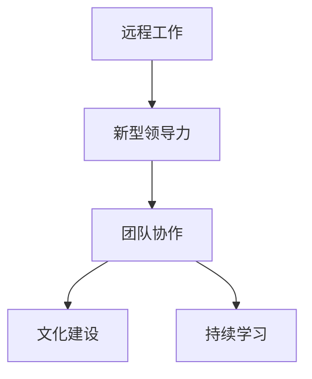

                 

# 远程团队管理：数字时代的新型领导力

> 关键词：远程工作,新型领导力,团队协作,数字时代,技术驱动

## 1. 背景介绍

### 1.1 问题由来
随着全球化和技术进步，远程工作已经成为一种新的工作模式。新冠疫情的爆发进一步推动了远程办公的普及，使得越来越多的公司转向混合办公模式。然而，远程工作带来的挑战也不容忽视，包括沟通困难、协作效率低下、团队凝聚力减弱等问题。因此，如何在远程工作环境中高效地管理团队，提升团队协作效率和凝聚力，成为企业管理者面临的重要课题。

### 1.2 问题核心关键点
远程团队管理的核心问题在于如何在数字时代背景下，利用技术手段解决传统面对面管理中存在的问题，建立新型领导力，以实现高效、灵活、可持续的团队协作。关键点包括：

- **沟通与协作**：建立高效的沟通机制，确保信息透明和及时传达。
- **目标管理**：明确团队目标和角色分工，确保任务执行力。
- **绩效评估**：建立科学的绩效评估体系，确保公平、公正。
- **文化建设**：营造积极向上的团队文化，提升团队凝聚力。
- **持续学习**：推动团队成员不断学习新技术、新知识，提升团队整体能力。

### 1.3 问题研究意义
远程团队管理的研究对于提升企业数字化转型效率，推动企业可持续发展具有重要意义。研究新型领导力对于帮助企业在数字时代获得竞争优势具有重要价值。

- **提升效率**：通过新型领导力，可以在远程工作环境下提升团队协作效率，减少沟通成本，实现任务高效执行。
- **增强凝聚力**：通过文化建设，可以增强团队成员的归属感和凝聚力，减少因远程工作带来的孤立感。
- **推动变革**：新型领导力可以帮助企业管理者更好地应对数字化变革，实现从传统管理向新型管理模式的转变。

## 2. 核心概念与联系

### 2.1 核心概念概述

为更好地理解远程团队管理的方法，本节将介绍几个密切相关的核心概念：

- **远程工作**：员工不固定地到公司工作，而是通过网络平台进行工作。
- **新型领导力**：在远程工作环境中，通过技术手段实现领导力的新型表现形式，包括透明沟通、目标导向、灵活管理等。
- **团队协作**：通过技术手段促进团队成员间的有效协作，提高团队效率。
- **文化建设**：通过建立积极向上的团队文化，提升团队凝聚力。
- **持续学习**：通过技术手段推动团队成员不断学习新知识和技能，提升团队整体能力。

这些核心概念之间的逻辑关系可以通过以下Mermaid流程图来展示：



这个流程图展示了我文章的核心概念及其之间的关系：

1. 远程工作是新型领导力发挥的基础。
2. 新型领导力通过透明沟通、目标导向、灵活管理等手段，提升团队协作效率。
3. 团队协作和持续学习是新型领导力的具体体现。
4. 文化建设是提升团队凝聚力的重要手段。

## 3. 核心算法原理 & 具体操作步骤
### 3.1 算法原理概述

远程团队管理本质上是一种基于新型领导力的团队协作方法，其核心思想是通过技术手段实现透明沟通、目标导向、灵活管理等新型领导力特征，以提升团队协作效率和凝聚力。

形式化地，假设一个远程团队由 $n$ 个成员 $M_1, M_2, ..., M_n$ 组成，团队的目标为 $T$，团队协作的算法为 $A$。团队管理的优化目标是最小化团队协作成本，即：

$$
\mathop{\arg\min}_{A} \sum_{i=1}^n C(M_i, A)
$$

其中 $C(M_i, A)$ 表示成员 $M_i$ 在算法 $A$ 下的协作成本。协作成本包括沟通成本、任务执行成本、文化建设成本等。

### 3.2 算法步骤详解

远程团队管理的算法步骤主要包括：

**Step 1: 确定目标和角色分工**

- 明确团队目标 $T$，包括团队整体目标和各成员的分目标。
- 根据成员技能和兴趣，进行角色分工，确保每个成员都有明确的职责和任务。

**Step 2: 选择沟通工具**

- 选择合适的沟通工具（如Slack、Microsoft Teams、Zoom等），确保信息的透明传递和及时性。

**Step 3: 建立透明沟通机制**

- 定期召开团队会议，确保信息的透明和及时传达。
- 使用在线协作平台（如Trello、Jira等）进行任务跟踪和进展汇报。

**Step 4: 设计灵活管理策略**

- 采用自组织管理方式，赋予成员更多的自主权和灵活性。
- 设计科学的绩效评估体系，确保公平、公正。

**Step 5: 营造积极向上的团队文化**

- 通过在线团队建设活动、共享成功案例等方式，增强团队凝聚力。
- 鼓励成员参与社区讨论，促进知识共享和学习。

**Step 6: 推动持续学习**

- 使用在线学习平台（如Coursera、Udemy等）进行技能培训。
- 定期举行知识分享会，鼓励成员交流新知识和新技能。

### 3.3 算法优缺点

远程团队管理的新型领导力方法具有以下优点：

1. **灵活高效**：远程工作环境下，新型领导力通过技术手段实现了高效的团队协作，减少了沟通成本，提高了任务执行效率。
2. **透明公正**：透明沟通机制和科学绩效评估体系确保了信息透明和公平公正，增强了团队信任和凝聚力。
3. **文化建设**：通过在线团队建设活动和知识共享，营造积极向上的团队文化，提升了团队凝聚力。
4. **持续学习**：在线学习平台和知识分享会推动了团队成员不断学习新知识和技能，提升了团队整体能力。

同时，该方法也存在一些局限性：

1. **技术依赖性**：远程团队管理高度依赖技术工具，一旦技术工具出现故障，可能影响团队协作效率。
2. **文化差异**：不同文化背景的团队成员可能对远程管理方式存在不同理解和适应程度。
3. **信息过载**：在线沟通工具和协作平台的信息量巨大，可能导致信息过载，影响工作效率。
4. **自主性挑战**：过度自主权可能导致团队成员对工作目标和职责的模糊不清，影响任务执行效果。

尽管存在这些局限性，但就目前而言，基于新型领导力的远程团队管理方法仍是最主流范式。未来相关研究的重点在于如何进一步降低技术依赖，提高文化适应性，优化信息管理和自主权平衡，以实现更加高效、可持续的团队协作。

### 3.4 算法应用领域

远程团队管理的新型领导力方法在多个领域得到了广泛的应用，包括但不限于：

- **软件开发**：如远程开发团队、开源项目协作等。
- **金融服务**：如远程金融客服、在线理财顾问等。
- **教育培训**：如远程在线课程、混合式学习等。
- **市场营销**：如远程市场团队、社交媒体运营等。
- **医疗健康**：如远程医疗咨询、在线健康管理等。

除了上述这些经典应用外，远程团队管理的新型领导力方法也将被创新性地应用到更多场景中，如远程办公、远程项目管理、跨文化团队协作等，为各类企业的数字化转型提供新的解决方案。

## 4. 数学模型和公式 & 详细讲解 & 举例说明

### 4.1 数学模型构建

本节将使用数学语言对远程团队管理的方法进行更加严格的刻画。

假设一个远程团队由 $n$ 个成员 $M_1, M_2, ..., M_n$ 组成，团队的目标为 $T$，团队协作的算法为 $A$。团队管理的优化目标是最小化团队协作成本，即：

$$
\mathop{\arg\min}_{A} \sum_{i=1}^n C(M_i, A)
$$

其中 $C(M_i, A)$ 表示成员 $M_i$ 在算法 $A$ 下的协作成本。协作成本可以分解为沟通成本 $C_{comm}$、任务执行成本 $C_{task}$、文化建设成本 $C_{culture}$ 等。

### 4.2 公式推导过程

以沟通成本为例，假设每次沟通的平均时长为 $t$，每次沟通涉及的成员数量为 $k$，则总沟通成本为：

$$
C_{comm} = k \times n \times t
$$

对于任务执行成本，假设每个任务需要 $c$ 个工作单元，每个成员每天的工作时间为 $T$，则总任务执行成本为：

$$
C_{task} = c \times T \times n
$$

对于文化建设成本，假设每次文化活动的平均成本为 $f$，每次活动参与的成员数量为 $m$，则总文化建设成本为：

$$
C_{culture} = f \times m \times n
$$

将这些成本加权求和，即可得到总协作成本：

$$
C(M_i, A) = w_{comm} \times C_{comm} + w_{task} \times C_{task} + w_{culture} \times C_{culture}
$$

其中 $w_{comm}, w_{task}, w_{culture}$ 为各成本的权重系数，反映了不同成本对团队协作效率的影响程度。

### 4.3 案例分析与讲解

假设一个由10名成员组成的远程软件开发团队，目标为开发一个新的移动应用。假设每次沟通的平均时长为30分钟，每次沟通涉及的成员数量为5，每个任务需要3个工作单元，每个成员每天的工作时间为8小时，每次文化活动的平均成本为1000元，每次活动参与的成员数量为8。根据上述公式，可以计算出团队的总协作成本：

- 沟通成本：$C_{comm} = 5 \times 10 \times 0.5 \times 60 = 1500$
- 任务执行成本：$C_{task} = 3 \times 8 \times 10 = 240$
- 文化建设成本：$C_{culture} = 1000 \times 8 \times 10 = 80000$

总协作成本为：

$$
C(M_i, A) = 0.7 \times 1500 + 0.2 \times 240 + 0.1 \times 80000 = 84600
$$

优化目标即为最小化 $C(M_i, A)$。

## 5. 项目实践：代码实例和详细解释说明
### 5.1 开发环境搭建

在进行远程团队管理项目实践前，我们需要准备好开发环境。以下是使用Python进行远程团队管理的开发环境配置流程：

1. 安装Anaconda：从官网下载并安装Anaconda，用于创建独立的Python环境。

2. 创建并激活虚拟环境：
```bash
conda create -n remote-work-env python=3.8 
conda activate remote-work-env
```

3. 安装Python相关的库：
```bash
pip install pandas numpy matplotlib scikit-learn
```

4. 安装远程团队管理相关的库：
```bash
pip install slack-sdk microsoftteams python-zoom-api
```

5. 安装在线协作管理工具：
```bash
pip install trello-jira
```

完成上述步骤后，即可在`remote-work-env`环境中开始远程团队管理项目的开发。

### 5.2 源代码详细实现

下面我们以远程软件开发团队为例，给出使用Python实现远程团队管理的代码实例。

首先，定义远程团队成员的沟通成本、任务执行成本、文化建设成本等参数：

```python
import pandas as pd
import numpy as np

# 定义成员数量和任务信息
n_members = 10
tasks = {
    'task1': 3, 'task2': 2, 'task3': 4,
    'task4': 1, 'task5': 5, 'task6': 3,
    'task7': 2, 'task8': 4, 'task9': 1, 'task10': 2
}

# 定义沟通成本参数
t_comm = 0.5  # 每次沟通平均时长（小时）
k_comm = 5  # 每次沟通涉及的成员数量

# 定义任务执行成本参数
c_task = 3  # 每个任务需要的工作单元
T_work = 8  # 每个成员每天的工作时间（小时）

# 定义文化建设成本参数
f_culture = 1000  # 每次文化活动的平均成本
m_culture = 8  # 每次文化活动的参与成员数量
```

然后，定义远程团队管理的优化目标函数：

```python
def remote_team_cost(w_comm, w_task, w_culture):
    """
    计算远程团队管理的总协作成本
    """
    c_comm = k_comm * n_members * t_comm
    c_task = c_task * T_work * n_members
    c_culture = f_culture * m_culture * n_members
    
    total_cost = w_comm * c_comm + w_task * c_task + w_culture * c_culture
    return total_cost
```

接着，定义优化算法的目标函数：

```python
from scipy.optimize import minimize

def objective_function(w):
    """
    定义优化算法的目标函数
    """
    cost = remote_team_cost(w[0], w[1], w[2])
    return cost

# 设置初始参数和约束条件
initial_guess = np.array([0.7, 0.2, 0.1])
constraints = {'type': 'eq', 'fun': lambda w: 1.0 - (w[0] + w[1] + w[2])}
```

最后，进行优化求解：

```python
# 进行优化求解
result = minimize(objective_function, initial_guess, constraints=constraints)
print("优化后的协作成本：", result.fun)
```

以上代码实现了基于数学模型构建的远程团队管理优化求解。在实际应用中，我们还需要考虑更多现实因素，如成员的技能差异、任务优先级、文化活动的效果评估等，以进一步提升优化效果。

### 5.3 代码解读与分析

让我们再详细解读一下关键代码的实现细节：

**远程团队成本计算**：
- `remote_team_cost`函数：计算远程团队管理的总协作成本，包括沟通成本、任务执行成本和文化建设成本。
- 沟通成本：每次沟通的平均时长乘以每次沟通涉及的成员数量，再乘以成员总数。
- 任务执行成本：每个任务需要的工作单元乘以每个成员每天的工作时间，再乘以成员总数。
- 文化建设成本：每次文化活动的平均成本乘以每次文化活动的参与成员数量，再乘以成员总数。

**优化算法**：
- `minimize`函数：使用Scipy库中的优化算法，求解目标函数的最小值。
- `initial_guess`：设置初始参数，包括沟通成本、任务执行成本和文化建设成本的权重系数。
- `constraints`：设置约束条件，确保所有权重系数之和为1，即每个成本的权重系数都在0到1之间。

**结果输出**：
- `result`：优化算法的输出结果，包含优化后的协作成本。
- `print`函数：输出优化后的协作成本，供进一步分析使用。

可以看到，通过数学模型和优化算法，我们可以在远程团队管理中实现成本的最小化，从而提升团队协作效率。

## 6. 实际应用场景
### 6.1 软件开发

在软件开发团队中，远程团队管理的新型领导力方法可以有效提升团队协作效率和任务执行力。

具体而言，可以采用以下措施：

- **透明沟通**：使用Slack等即时通讯工具，确保信息透明和及时传达。
- **任务分配**：使用Trello等任务管理工具，明确任务分配和进展跟踪。
- **文化建设**：通过在线团队建设活动和知识分享会，增强团队凝聚力。
- **持续学习**：使用Coursera等在线学习平台，推动团队成员不断学习新知识和技能。

### 6.2 金融服务

在金融服务团队中，远程团队管理的新型领导力方法可以帮助提升团队协作效率和响应速度。

具体而言，可以采用以下措施：

- **透明沟通**：使用Microsoft Teams等沟通工具，确保信息透明和及时传达。
- **任务分配**：使用Jira等项目管理工具，明确任务分配和进展跟踪。
- **文化建设**：通过在线团队建设活动和客户满意度调查，增强团队凝聚力。
- **持续学习**：使用在线培训平台，推动团队成员学习新金融知识和技能。

### 6.3 教育培训

在教育培训团队中，远程团队管理的新型领导力方法可以有效提升教学质量和学生参与度。

具体而言，可以采用以下措施：

- **透明沟通**：使用Zoom等视频会议工具，确保信息透明和及时传达。
- **任务分配**：使用Trello等任务管理工具，明确任务分配和进展跟踪。
- **文化建设**：通过在线团队建设活动和学生反馈调查，增强团队凝聚力。
- **持续学习**：使用Khan Academy等在线学习平台，推动教师和学生不断学习新知识和技能。

### 6.4 未来应用展望

随着远程团队管理技术的不断发展和完善，其应用前景将更加广阔。

未来，远程团队管理的新型领导力方法将在以下领域得到更广泛的应用：

- **医疗健康**：如远程医疗团队协作、在线健康咨询等。
- **制造业**：如远程制造团队协作、在线设备监控等。
- **农业**：如远程农业团队协作、在线农业咨询等。
- **创意设计**：如远程创意团队协作、在线设计分享等。

随着数字化转型的深入推进，远程团队管理的新型领导力方法将成为各行各业的重要工具，帮助企业提升工作效率和创新能力。

## 7. 工具和资源推荐
### 7.1 学习资源推荐

为了帮助开发者系统掌握远程团队管理的方法，这里推荐一些优质的学习资源：

1. 《远程工作最佳实践指南》书籍：详细介绍了远程工作的各种实践经验和技术手段，包括沟通、协作、文化建设等。
2. 《敏捷管理》课程：介绍敏捷管理方法在远程团队中的应用，如何通过Scrum等敏捷框架进行任务管理和团队协作。
3. 《远程团队建设》课程：介绍如何通过在线活动和工具，建设高效的远程团队文化。
4. 《团队协作工具大全》博客：汇总了多种远程团队协作工具的使用方法和最佳实践。
5. 《数字化转型》在线课程：介绍企业数字化转型的各个方面，包括远程团队管理、数字化运营等。

通过对这些资源的学习实践，相信你一定能够快速掌握远程团队管理的精髓，并用于解决实际的团队协作问题。

### 7.2 开发工具推荐

高效的开发离不开优秀的工具支持。以下是几款用于远程团队管理开发的常用工具：

1. Slack：即时通讯工具，支持团队沟通、信息透明。
2. Microsoft Teams：团队协作工具，支持即时通讯、视频会议、项目管理等。
3. Zoom：视频会议工具，支持团队远程协作、在线培训等。
4. Trello：任务管理工具，支持任务分配、进展跟踪等。
5. Jira：项目管理工具，支持任务分配、进展跟踪、故障排查等。

合理利用这些工具，可以显著提升远程团队管理的效率，加快创新迭代的步伐。

### 7.3 相关论文推荐

远程团队管理技术的发展源于学界的持续研究。以下是几篇奠基性的相关论文，推荐阅读：

1. 《远程团队协作研究综述》论文：对远程团队协作的各种方法和技术进行了全面综述，提供了丰富的理论支持和实际案例。
2. 《敏捷方法在远程团队中的应用》论文：探讨了敏捷方法在远程团队中的应用，如何通过Scrum等敏捷框架进行任务管理和团队协作。
3. 《数字化转型的挑战与应对》论文：探讨了数字化转型的各个方面，包括远程团队管理、数字化运营等。
4. 《远程团队文化建设的研究》论文：介绍了远程团队文化建设的理论和方法，如何通过在线活动和工具建设高效的团队文化。
5. 《团队协作工具的评价与选择》论文：对多种远程团队协作工具进行了评价和比较，提供了选择合适工具的参考依据。

这些论文代表了大语言模型微调技术的发展脉络。通过学习这些前沿成果，可以帮助研究者把握学科前进方向，激发更多的创新灵感。

## 8. 总结：未来发展趋势与挑战
### 8.1 总结

本文对远程团队管理的新型领导力方法进行了全面系统的介绍。首先阐述了远程团队管理的背景和意义，明确了新型领导力在远程工作环境下的重要性。其次，从原理到实践，详细讲解了远程团队管理的数学模型和优化算法，给出了远程团队管理项目的完整代码实例。同时，本文还广泛探讨了远程团队管理方法在多个行业领域的应用前景，展示了远程团队管理技术的广阔前景。最后，本文精选了远程团队管理的各类学习资源，力求为读者提供全方位的技术指引。

通过本文的系统梳理，可以看到，远程团队管理的新型领导力方法在远程工作环境下具有重要的应用价值，可以显著提升团队协作效率和凝聚力，推动企业的数字化转型。未来，随着技术手段的不断进步，远程团队管理将会在更多行业得到广泛应用，为各类企业的数字化转型提供新的解决方案。

### 8.2 未来发展趋势

展望未来，远程团队管理的新型领导力方法将呈现以下几个发展趋势：

1. **技术手段的不断进步**：随着AI技术、大数据技术的不断进步，远程团队管理的工具和手段将更加智能化、自动化。例如，基于AI的沟通建议系统、自动化任务分配系统等，将进一步提升团队协作效率。
2. **文化建设的多样化**：远程团队管理的文化建设将更加多元化，结合在线活动、虚拟现实等新兴技术，营造更加丰富多彩的团队文化。
3. **团队协作的全球化**：远程团队管理将更加全球化，结合不同国家和地区的文化和语言差异，设计更加灵活的团队协作方式。
4. **持续学习的自动化**：通过智能推荐系统和知识图谱，推动团队成员的持续学习，提升团队整体能力。
5. **团队评估的实时化**：基于实时数据分析和反馈机制，实时评估团队绩效，及时调整管理策略，提升团队协作效率。

这些趋势凸显了远程团队管理技术的前景，为实现高效、灵活、可持续的团队协作提供了新的技术手段和实践方法。

### 8.3 面临的挑战

尽管远程团队管理的新型领导力方法已经取得了一定的进展，但在迈向更加智能化、全球化、持续化的过程中，它仍面临着诸多挑战：

1. **技术依赖性**：远程团队管理高度依赖技术工具，一旦技术工具出现故障，可能影响团队协作效率。
2. **文化差异**：不同文化背景的团队成员可能对远程管理方式存在不同理解和适应程度。
3. **信息过载**：在线沟通工具和协作平台的信息量巨大，可能导致信息过载，影响工作效率。
4. **自主性挑战**：过度自主权可能导致团队成员对工作目标和职责的模糊不清，影响任务执行效果。
5. **隐私与安全**：远程团队管理中涉及大量的个人信息和敏感数据，需要建立严格的数据隐私和安全机制。

这些挑战需要在未来的研究中不断克服，才能使远程团队管理技术更加成熟和完善。

### 8.4 研究展望

未来的研究需要在以下几个方面寻求新的突破：

1. **智能推荐系统**：通过智能推荐系统，提高团队成员的学习效率和知识共享，推动持续学习的自动化。
2. **全球化协作框架**：结合不同国家和地区的文化和语言差异，设计灵活的全球化协作框架，提升团队的全球化协作能力。
3. **自动化任务分配**：通过自动化任务分配系统，提高任务执行效率，减少人工干预。
4. **实时数据分析与反馈**：基于实时数据分析和反馈机制，实时评估团队绩效，及时调整管理策略，提升团队协作效率。
5. **隐私与安全保护**：建立严格的数据隐私和安全机制，保护团队成员的个人隐私和敏感数据。

这些研究方向的探索，必将引领远程团队管理技术迈向更高的台阶，为构建安全、可靠、高效、可持续的团队协作提供新的技术手段和实践方法。总之，远程团队管理的新型领导力方法需要在技术手段、文化建设、团队协作等方面进行深入研究，才能更好地适应数字化转型的需求，推动企业的高质量发展。

## 9. 附录：常见问题与解答

**Q1：如何平衡远程团队的自主性和任务执行力？**

A: 在远程团队管理中，平衡自主性和任务执行力是一个重要问题。可以通过以下措施实现：

- **明确任务目标**：确保每个成员对任务目标和职责有清晰的认识，避免自主性过强导致的任务执行力不足。
- **灵活任务分配**：根据成员的技能和兴趣，灵活分配任务，提高任务执行效率。
- **定期检查进展**：通过定期的进展汇报和检查，及时发现问题并调整任务分配和执行策略。
- **激励机制**：建立科学的绩效评估体系和激励机制，激发成员的工作积极性，提升任务执行力。

**Q2：如何应对远程团队中的信息过载？**

A: 信息过载是远程团队管理中的常见问题，可以通过以下措施应对：

- **信息分类管理**：将信息进行分类管理，确保重要信息及时传达，非重要信息可以晚些处理。
- **使用自动化工具**：利用自动化工具（如自动回复、邮件分类器等），减少人工处理信息的工作量。
- **限制信息量**：通过信息筛选和过滤，减少无用的信息，提升信息质量。
- **定期沟通**：通过定期的团队会议和沟通，集中讨论和处理重要信息，避免信息过载。

**Q3：远程团队管理中的文化建设如何实现？**

A: 远程团队管理中的文化建设可以通过以下措施实现：

- **在线团队建设活动**：组织在线团队建设活动，如虚拟团队午餐、在线游戏等，增强团队凝聚力。
- **知识共享平台**：建立在线知识共享平台，鼓励成员分享成功案例、经验教训等，促进知识共享和学习。
- **团队协作工具**：使用在线协作工具（如Trello、Jira等），促进团队成员间的有效协作，增强团队凝聚力。
- **激励机制**：建立科学的绩效评估体系和激励机制，鼓励成员积极参与文化建设活动，提升团队凝聚力。

这些措施可以帮助远程团队建立积极向上的团队文化，增强团队成员的归属感和凝聚力。

---

作者：禅与计算机程序设计艺术 / Zen and the Art of Computer Programming

