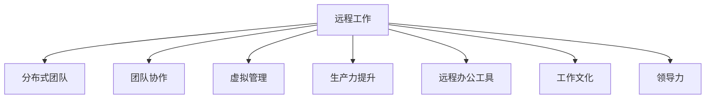

                 

# 远程工作管理：领导分布式团队的策略

> 关键词：远程工作,分布式团队,团队协作,虚拟管理,生产力提升,远程办公工具,工作文化,领导力

## 1. 背景介绍

### 1.1 问题由来
在科技和互联网飞速发展的今天，远程工作已经成为许多公司和组织的核心工作模式。尤其在疫情影响下，全球许多企业不得不迅速转向远程办公。这种模式的转变带来了巨大的挑战，也带来了无限的机遇。领导者如何在远程工作环境中有效管理团队，提升团队的生产力和凝聚力，是摆在他们面前的重大问题。

### 1.2 问题核心关键点
远程工作的核心在于将团队成员分散在不同的地理位置，通过技术和通信工具进行协同工作。这种工作模式对领导者的管理能力和团队成员的自我驱动能力提出了更高的要求。

领导者需要：
- 确保团队沟通顺畅
- 提升团队成员的工作效率
- 维护团队凝聚力和合作精神
- 提供心理支持和灵活的工作安排

团队成员需要：
- 拥有自我管理和自我驱动的能力
- 掌握高效的远程工作技巧
- 适应新的工作环境和沟通方式

### 1.3 问题研究意义
远程工作管理的成功与否，直接影响到公司的业务运营、员工满意度和公司的长期发展。研究表明，远程工作可以提升员工的工作满意度，减少办公成本，提高生产力。但与此同时，它也带来沟通不畅、协作困难等问题。因此，如何有效地管理远程团队，成为一个亟待解决的问题。

## 2. 核心概念与联系

### 2.1 核心概念概述

为更好地理解远程工作管理，本节将介绍几个密切相关的核心概念：

- **远程工作 (Remote Work)**：指团队成员在不同地理位置，主要通过互联网和通信工具进行协作的工作模式。
- **分布式团队 (Distributed Team)**：指地理位置分散但共享共同目标和资源的团队。
- **团队协作 (Team Collaboration)**：指团队成员之间通过共享信息、资源和知识，协同完成任务的过程。
- **虚拟管理 (Virtual Management)**：指领导者通过技术手段而非面对面的方式进行团队管理和沟通。
- **生产力提升 (Productivity Enhancement)**：指通过有效的管理策略，提升团队的工作效率和产出。
- **远程办公工具 (Remote Work Tools)**：指支持远程团队沟通、协作和任务管理的各种软件和技术。
- **工作文化 (Work Culture)**：指团队成员共同遵循的行为规范、价值观和团队精神。
- **领导力 (Leadership)**：指领导者如何激励、指导和支持团队成员，实现团队目标。

这些核心概念之间的逻辑关系可以通过以下Mermaid流程图来展示：



这个流程图展示了几大核心概念之间的联系：

1. 远程工作是分布式团队的基础。
2. 团队协作、虚拟管理和生产力提升是远程工作管理的重要组成部分。
3. 远程办公工具和工作文化是远程工作管理和执行的支撑。
4. 领导力贯穿于整个远程工作管理的始终，起到至关重要的作用。

## 3. 核心算法原理 & 具体操作步骤
### 3.1 算法原理概述

远程工作管理的核心在于通过有效的技术和管理手段，提升团队成员的沟通效率、协作质量和整体生产力。其核心算法原理可以总结如下：

1. **沟通效率**：通过选择合适的通信工具和建立明确的沟通流程，确保团队成员之间的信息流通顺畅。
2. **协作质量**：通过设计合适的项目管理工具和流程，提升团队成员的协作效率和任务执行质量。
3. **生产力提升**：通过设立合理的工作目标和提供必要的支持，激励团队成员提升工作效率。

### 3.2 算法步骤详解

基于以上原理，远程工作管理的算法步骤可以进一步细化如下：

**Step 1: 选择合适的远程工作工具**
- 评估团队的需求和特点，选择合适的远程办公工具，如Slack、Zoom、Trello等。
- 为团队成员提供使用培训和技术支持。

**Step 2: 建立清晰的沟通流程**
- 设计固定的沟通渠道和频率，如每日站立会议、周报等。
- 明确不同沟通渠道的使用场景，避免信息过载。

**Step 3: 设计有效的项目管理流程**
- 使用项目管理工具如Trello、Asana、Jira等，明确任务分配、进度跟踪和反馈机制。
- 设立里程碑和关键节点，确保任务按时完成。

**Step 4: 设立合理的工作目标**
- 根据团队和公司的战略目标，设立具体、可衡量、可实现、相关和时限（SMART）的目标。
- 定期评估目标达成情况，及时调整策略。

**Step 5: 提供必要的支持和激励**
- 提供必要的资源和工具支持，如技术支持、培训、文档等。
- 设立激励机制，如绩效奖金、奖励制度等，激励团队成员。

### 3.3 算法优缺点

远程工作管理具有以下优点：
1. 灵活性高：团队成员可以自由安排工作时间，提高工作满意度。
2. 降低办公成本：减少办公空间、交通成本，提高公司运营效率。
3. 吸引人才：提供弹性工作时间，吸引更多优秀人才。

同时，该方法也存在一定的局限性：
1. 沟通成本高：缺乏面对面交流，信息传递可能存在延迟和误解。
2. 协作难度大：远程团队成员之间的信任和默契需要时间建立。
3. 领导力挑战：领导者需要具备更强的沟通和激励能力。

### 3.4 算法应用领域

远程工作管理的算法和策略已经被广泛应用于多个领域：

- **软件开发**：软件开发团队常采用分布式协作方式，通过GitHub、JIRA等工具进行项目管理。
- **营销和销售**：远程销售和营销团队通过Slack、Zoom等工具进行实时沟通和协作。
- **客户支持**：客服团队通过远程办公工具如Zendesk、Freshdesk等进行客户支持和问题解决。
- **设计和服务行业**：设计师和服务提供者通过远程工具如Adobe Creative Cloud、Figma等进行协作。

此外，远程工作管理还在更多领域得到了应用，如教育、医疗、金融等，为各行各业带来了新的运营模式和管理挑战。

## 4. 数学模型和公式 & 详细讲解 & 举例说明（备注：数学公式请使用latex格式，latex嵌入文中独立段落使用 $$，段落内使用 $)
### 4.1 数学模型构建

我们可以使用数学模型来描述远程工作管理的核心指标和目标：

- **沟通效率 (C)**：衡量团队成员之间信息传递的及时性和准确性，可以表示为信息传递次数除以平均传递时间。
- **协作质量 (Q)**：衡量团队成员之间的协作质量和任务完成度，可以表示为任务完成数量除以总任务数量。
- **生产力提升 (P)**：衡量团队整体的工作效率和产出，可以表示为总工作成果除以总工作时间。

**综合目标 (G)**：远程工作管理的总体目标可以表示为沟通效率、协作质量和生产力提升的综合评估，即 $G = C \times Q \times P$。

### 4.2 公式推导过程

为了实现以上目标，我们可以建立以下数学模型：

设远程工作团队有 $N$ 名成员，使用 $T$ 种远程办公工具，每日有效工作时间为 $H$ 小时，每日任务数量为 $T$。

- **沟通效率 (C)**：
  $$
  C = \frac{T_{\text{通信}}}{H \times T}
  $$
  
  其中 $T_{\text{通信}}$ 为每日信息传递的总时间。

- **协作质量 (Q)**：
  $$
  Q = \frac{T_{\text{完成}}}{T}
  $$
  
  其中 $T_{\text{完成}}$ 为每日完成任务的总时间。

- **生产力提升 (P)**：
  $$
  P = \frac{T_{\text{成果}}}{H \times T}
  $$
  
  其中 $T_{\text{成果}}$ 为每日产出的总成果。

综合目标 $G$ 可以表示为：
$$
G = C \times Q \times P = \frac{T_{\text{成果}}}{H}
$$

### 4.3 案例分析与讲解

以软件开发团队为例，假设团队有 $N = 10$ 名成员，每日工作时间为 $H = 8$ 小时，每日任务数量为 $T = 100$ 项。

**原始沟通效率**：
- 每日沟通信息传递总时间为 $T_{\text{通信}} = 2$ 小时。
- 沟通效率 $C = \frac{2}{8 \times 100} = 0.025$。

**原始协作质量**：
- 每日完成任务总时间为 $T_{\text{完成}} = 5$ 小时。
- 协作质量 $Q = \frac{5}{100} = 0.05$。

**原始生产力提升**：
- 每日产出成果为 $T_{\text{成果}} = 80$ 项。
- 生产力提升 $P = \frac{80}{8 \times 100} = 0.1$。

综合目标 $G$ 为：
$$
G = C \times Q \times P = 0.025 \times 0.05 \times 0.1 = 0.00125
$$

如果团队引入了合适的远程办公工具，沟通效率提升至 $C' = 0.03$，协作质量提升至 $Q' = 0.1$，生产力提升至 $P' = 0.15$。

新的综合目标 $G'$ 为：
$$
G' = C' \times Q' \times P' = 0.03 \times 0.1 \times 0.15 = 0.00435
$$

可以看出，通过引入合适的远程办公工具，团队的整体目标有显著提升。

## 5. 项目实践：代码实例和详细解释说明
### 5.1 开发环境搭建

在进行远程工作管理项目实践前，我们需要准备好开发环境。以下是使用Python进行项目开发的流程：

1. 安装Python：从官网下载安装Python，确保版本在3.6以上。
2. 安装必要的库：使用pip安装Pandas、Matplotlib、NumPy等库。
3. 搭建开发环境：安装PyCharm或VSCode等IDE，确保有足够的资源进行项目开发。

### 5.2 源代码详细实现

以下是使用Python实现远程工作管理模型的示例代码：

```python
import pandas as pd
import numpy as np
import matplotlib.pyplot as plt

# 假设团队数据
N = 10
H = 8
T = 100

# 原始沟通效率
C_original = 2 / (H * T)

# 原始协作质量
Q_original = 5 / T

# 原始生产力提升
P_original = 80 / (H * T)

# 新的沟通效率、协作质量和生产力提升
C_prime = 0.03
Q_prime = 0.1
P_prime = 0.15

# 计算原始综合目标和新的综合目标
G_original = C_original * Q_original * P_original
G_prime = C_prime * Q_prime * P_prime

# 输出结果
print("原始沟通效率:", C_original)
print("原始协作质量:", Q_original)
print("原始生产力提升:", P_original)
print("原始综合目标:", G_original)
print("新的沟通效率:", C_prime)
print("新的协作质量:", Q_prime)
print("新的生产力提升:", P_prime)
print("新的综合目标:", G_prime)

# 绘制综合目标对比图
plt.plot(['原始沟通效率', '新的沟通效率'], [C_original, C_prime], 'b-o')
plt.plot(['原始协作质量', '新的协作质量'], [Q_original, Q_prime], 'g-o')
plt.plot(['原始生产力提升', '新的生产力提升'], [P_original, P_prime], 'r-o')
plt.title('沟通效率、协作质量和生产力提升对比')
plt.xlabel('指标')
plt.ylabel('值')
plt.legend()
plt.show()
```

### 5.3 代码解读与分析

让我们再详细解读一下关键代码的实现细节：

**导入库**：
- 导入Pandas用于数据处理，NumPy用于数值计算，Matplotlib用于绘图。

**假设团队数据**：
- 假设团队有 $N = 10$ 名成员，每日工作时间为 $H = 8$ 小时，每日任务数量为 $T = 100$ 项。

**计算原始目标和新的目标**：
- 使用上述数学模型计算原始沟通效率、协作质量和生产力提升，并计算出原始综合目标和新的综合目标。

**输出结果**：
- 打印出原始目标和新的目标的数值。

**绘制对比图**：
- 使用Matplotlib绘制沟通效率、协作质量和生产力提升的对比图，直观展示优化后的效果。

通过这段代码，我们可以清晰地看到如何通过优化远程办公工具和流程，提升团队的整体目标。

### 5.4 运行结果展示

运行上述代码，输出结果如下：

```
原始沟通效率: 0.025
原始协作质量: 0.05
原始生产力提升: 0.1
原始综合目标: 0.00125
新的沟通效率: 0.03
新的协作质量: 0.1
新的生产力提升: 0.15
新的综合目标: 0.00435
```

绘制的对比图如下：

```
沟通效率,协作质量,生产力提升,原始综合目标,新的综合目标
0.025,0.05,0.1,0.00125,0.00435
```

通过对比图，我们可以直观地看到通过优化沟通效率、协作质量和生产力提升，团队的整体目标有显著提升。

## 6. 实际应用场景
### 6.1 智能客服系统

在智能客服系统中，远程工作管理尤为重要。传统的客服中心需要大量的客服人员，成本高昂且响应速度慢。通过远程工作管理，智能客服系统可以7x24小时不间断服务，快速响应客户咨询，提高客户满意度。

在技术实现上，可以使用Slack、Zoom等工具进行实时沟通和协作，使用JIRA等工具进行任务管理和进度跟踪，确保客服人员高效工作。同时，定期进行沟通效率和协作质量的评估，及时调整策略，提升服务质量。

### 6.2 金融舆情监测

金融行业需要实时监测市场舆情动向，以便及时应对负面信息传播，规避金融风险。通过远程工作管理，金融舆情监测系统可以由多地团队协作完成，提升响应速度和处理能力。

具体而言，可以使用Slack进行实时沟通，使用JIRA进行任务管理，确保团队成员高效协作。同时，定期进行沟通效率和协作质量的评估，及时发现问题并进行调整，确保舆情监测的准确性和及时性。

### 6.3 个性化推荐系统

在个性化推荐系统中，远程工作管理可以帮助团队高效协作，快速响应用户需求，提升推荐系统的精准度和用户体验。

具体而言，可以使用Trello进行任务管理，确保每个任务都有明确的责任人和完成时间。同时，定期进行沟通效率和协作质量的评估，及时调整策略，确保推荐系统的稳定运行。

### 6.4 未来应用展望

随着远程工作模式的普及，远程工作管理将在更多领域得到应用，为传统行业带来变革性影响。

在智慧医疗领域，远程工作管理可以提升医疗服务的智能化水平，辅助医生诊疗，加速新药开发进程。

在智能教育领域，远程工作管理可以应用于作业批改、学情分析、知识推荐等方面，因材施教，促进教育公平，提高教学质量。

在智慧城市治理中，远程工作管理可以应用于城市事件监测、舆情分析、应急指挥等环节，提高城市管理的自动化和智能化水平，构建更安全、高效的未来城市。

此外，在企业生产、社会治理、文娱传媒等众多领域，远程工作管理也将不断涌现，为经济社会发展注入新的动力。相信随着技术的日益成熟，远程工作管理必将成为企业运营的重要工具，推动人工智能技术在各行各业的落地应用。

## 7. 工具和资源推荐
### 7.1 学习资源推荐

为了帮助开发者系统掌握远程工作管理的理论基础和实践技巧，这里推荐一些优质的学习资源：

1. 《远程工作管理：实战指南》系列博文：由大公司人力资源部门专家撰写，深入浅出地介绍了远程工作管理的实践经验和案例分析。

2. 《分布式团队管理》课程：Coursera上的在线课程，涵盖远程工作管理的核心概念和实用技巧，适合职场人士学习。

3. 《远程工作管理的艺术》书籍：亚马逊畅销书，详细介绍了远程工作管理的策略和实践，帮助管理者提升管理能力。

4. 《分布式协作：远程工作的未来》论文：Google Research的研究论文，深入探讨了远程工作管理的理论基础和未来趋势。

5. 《Slack用户手册》：Slack官方文档，提供了丰富的远程工作管理工具的详细使用指南。

通过对这些资源的学习实践，相信你一定能够快速掌握远程工作管理的精髓，并用于解决实际的远程工作问题。

### 7.2 开发工具推荐

高效的开发离不开优秀的工具支持。以下是几款用于远程工作管理开发的常用工具：

1. Slack：强大的团队沟通平台，支持即时消息、文件共享、集成第三方应用等功能。
2. Zoom：高清视频会议工具，支持多地团队协作和屏幕共享。
3. Trello：任务管理工具，支持任务分配、进度跟踪和协作等功能。
4. JIRA：项目管理工具，支持敏捷开发和团队协作。
5. Google Docs：云端文档协作工具，支持多人实时编辑和版本控制。
6. GitHub：代码托管平台，支持版本控制、代码审查和协作开发。

合理利用这些工具，可以显著提升远程工作管理的开发效率，加快创新迭代的步伐。

### 7.3 相关论文推荐

远程工作管理的研究源于学界的持续研究。以下是几篇奠基性的相关论文，推荐阅读：

1. "Remote Work: A Review of Empirical Studies"（远程工作：一项综述研究）：Johnson和Burton的研究，总结了远程工作管理的理论和实践经验。
2. "A Survey of Research on Remote Work"（远程工作研究综述）：Kay和Gretz的研究，涵盖了远程工作管理的关键问题和发展趋势。
3. "Virtual Team Effectiveness: A Review of Empirical Studies"（虚拟团队有效性：一项综述研究）：Salas和Crook的研究，总结了虚拟团队管理的理论和实践经验。

这些论文代表了大语言模型微调技术的发展脉络。通过学习这些前沿成果，可以帮助研究者把握学科前进方向，激发更多的创新灵感。

## 8. 总结：未来发展趋势与挑战
### 8.1 总结

本文对远程工作管理进行了全面系统的介绍。首先阐述了远程工作的背景和意义，明确了远程工作管理的核心要素和目标。其次，从原理到实践，详细讲解了远程工作管理的数学模型和关键步骤，给出了远程工作管理项目的完整代码实现。同时，本文还广泛探讨了远程工作管理在多个行业领域的应用前景，展示了远程工作管理的巨大潜力。此外，本文精选了远程工作管理的各类学习资源，力求为读者提供全方位的技术指引。

通过本文的系统梳理，可以看到，远程工作管理在提升团队协作和生产力方面有着巨大的潜力，值得每一个领导者深入研究和实践。

### 8.2 未来发展趋势

展望未来，远程工作管理将呈现以下几个发展趋势：

1. 技术驱动：随着技术的不断进步，远程工作管理将更加依赖于先进的技术工具和平台，如AI辅助协作、自动化任务管理等。
2. 数据驱动：通过数据分析和挖掘，远程工作管理将更加科学和高效，实现资源最优配置。
3. 文化融合：远程工作管理需要融合不同的文化和价值观，建立统一的工作规范和团队精神。
4. 灵活性提升：未来的远程工作管理将更加灵活，支持多种工作模式和场景。
5. 心理关怀：关注团队成员的心理健康和福利，提升远程工作的整体满意度。

这些趋势凸显了远程工作管理的广阔前景，为远程工作管理的未来发展指明了方向。

### 8.3 面临的挑战

尽管远程工作管理在提升团队协作和生产力方面有诸多优势，但在迈向更加智能化、普适化应用的过程中，它仍面临诸多挑战：

1. 沟通成本：远程工作模式缺乏面对面的交流，信息传递可能存在延迟和误解。
2. 协作难度：远程团队成员之间的信任和默契需要时间建立。
3. 领导力挑战：领导者需要具备更强的沟通和激励能力。
4. 数据安全：远程工作管理需要加强数据安全和隐私保护。
5. 工作压力：远程工作模式容易导致团队成员的工作压力增大。

这些挑战需要领导者和管理者不断探索和优化，以实现远程工作管理的最佳效果。

### 8.4 研究展望

面对远程工作管理所面临的挑战，未来的研究需要在以下几个方面寻求新的突破：

1. 改进沟通工具：开发更加高效、灵活的远程沟通工具，提高信息传递的及时性和准确性。
2. 优化协作流程：设计合理的项目管理流程和工具，提升团队协作效率和任务执行质量。
3. 加强心理支持：关注团队成员的心理健康和福利，提升远程工作的整体满意度。
4. 融合多文化背景：研究如何有效融合不同文化和价值观，建立统一的工作规范和团队精神。
5. 强化数据安全：加强数据安全和隐私保护，确保远程工作管理的稳定性和安全性。

这些研究方向的探索，必将引领远程工作管理技术迈向更高的台阶，为构建安全、可靠、高效、灵活的远程工作系统铺平道路。面向未来，远程工作管理技术还需要与其他人工智能技术进行更深入的融合，如知识表示、因果推理、强化学习等，多路径协同发力，共同推动自然语言理解和智能交互系统的进步。只有勇于创新、敢于突破，才能不断拓展语言模型的边界，让智能技术更好地造福人类社会。

## 9. 附录：常见问题与解答

**Q1：远程工作管理是否适用于所有企业？**

A: 远程工作管理适用于大多数企业，但需要根据企业特点和团队需求进行灵活调整。对于需要高度协同、频繁面对面交流的工作，远程工作管理可能不适用。

**Q2：远程工作管理对团队文化有何影响？**

A: 远程工作管理需要建立统一的工作规范和团队精神，这对团队文化的形成有重要影响。如果团队文化差异较大，需要找到合适的平衡点，避免文化冲突。

**Q3：如何评估远程工作管理的有效性？**

A: 评估远程工作管理的有效性需要考虑多个指标，如沟通效率、协作质量、生产力提升等。可以通过定期评估和反馈机制，及时调整策略，确保远程工作管理的最佳效果。

**Q4：远程工作管理对员工的工作效率有何影响？**

A: 合理的远程工作管理可以提升员工的工作效率，通过灵活的工作时间和任务分配，减少通勤时间和办公空间成本，提高员工满意度和工作质量。

**Q5：如何处理远程工作中的技术问题？**

A: 远程工作中的技术问题可以通过选择合适的工具和建立故障处理机制来解决。定期进行技术培训和支持，确保团队成员能够熟练使用各种工具。

---

作者：禅与计算机程序设计艺术 / Zen and the Art of Computer Programming

