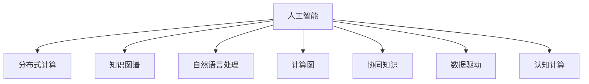

                 

# 连接人类智慧的纽带：人类计算的协作精神

> 关键词：人工智能, 人类计算, 协作精神, 分布式计算, 知识图谱, 自然语言处理, 计算图, 分布式计算, 认知计算, 协同知识, 数据驱动

## 1. 背景介绍

在数字化时代，人工智能(AI)技术的飞速发展已经深刻改变了人类的生产生活方式。从智能音箱、自动驾驶到医疗影像、智能制造，AI正逐步渗透到各个行业领域，为人们带来前所未有的便利和效率。但与此同时，我们也不得不面对一个令人深思的问题：在AI技术的快速发展中，人类智慧与计算能力之间的关系如何？AI是否能够真正成为人类智慧的延伸？

本文将从人类计算协作精神的角度，探讨AI技术与人类智慧之间的深度融合。我们将围绕以下几个核心问题展开探讨：

1. **人工智能与人类智慧的协作模式**：AI在处理复杂任务时，如何与人类智慧相结合？
2. **分布式计算与协同知识**：AI系统如何在全球范围内高效协作，共享知识与智慧？
3. **数据驱动与认知计算**：如何在数据驱动的计算过程中，融入人类认知与经验？

通过对这些问题的深入分析，我们希望能够揭示人类计算协作精神在AI技术发展中的重要性，并探索未来AI与人类智慧协作的新模式。

## 2. 核心概念与联系

### 2.1 核心概念概述

为更好地理解人类计算的协作精神，本节将介绍几个核心概念：

- **人工智能(AI)**：模拟人类智能行为的计算模型和算法，能够进行学习、推理、决策等智能任务。
- **分布式计算**：将计算任务分布在多台计算机上进行并行处理，提高计算效率和可靠性。
- **知识图谱**：通过语义网技术构建的知识表示体系，用于描述实体、关系及其之间的复杂语义关系。
- **自然语言处理(NLP)**：使计算机能够理解和处理人类自然语言的技术，包括语言理解、文本生成等。
- **计算图**：描述计算过程的图形表示，包括节点（操作）和边（数据流）。
- **协同知识**：全球范围内的知识共享与协作，通过协作平台、知识库等实现知识流动。
- **数据驱动**：利用大量数据进行训练和优化，提高AI系统的预测和决策能力。
- **认知计算**：结合人类认知过程的计算模型，使AI系统具备理解和模拟人类思维的能力。

这些概念之间的关系可以通过以下Mermaid流程图来展示：



这个流程图展示了AI技术在多个领域的广泛应用，以及与人类智慧协作的不同方式。

## 3. 核心算法原理 & 具体操作步骤
### 3.1 算法原理概述

人工智能与人类智慧的协作，本质上是一种计算与知识、智能与认知的深度融合。其核心思想是通过分布式计算和协同知识，将人类的智慧和经验融入AI系统中，形成更加智能和高效的计算模型。

具体来说，AI系统通过以下步骤实现与人类智慧的协作：

1. **数据收集与预处理**：从各种来源收集数据，并进行清洗、标注和预处理，为AI模型提供高质量的训练数据。
2. **模型训练与优化**：利用分布式计算框架，训练复杂的深度学习模型，优化模型参数，提高模型性能。
3. **知识图谱构建与融合**：通过语义网技术构建知识图谱，将人类领域的知识、规则、逻辑等融合到AI系统中，增强模型的智能推理能力。
4. **自然语言处理与交互**：利用NLP技术，使AI系统能够理解和处理人类自然语言，实现人机交互。
5. **计算图优化与并行计算**：通过计算图技术，优化AI系统的计算流程，利用分布式计算框架实现高效的并行计算。
6. **协同知识共享与更新**：通过协同平台、知识库等技术，实现全球范围内的知识共享与协作，不断更新AI系统的知识库。

### 3.2 算法步骤详解

以下是基于上述原理的具体操作步骤：

**Step 1: 数据收集与预处理**

- 从互联网、传感器、数据库等渠道收集数据。
- 对数据进行清洗、去噪、标注等预处理步骤。
- 划分训练集、验证集和测试集，确保数据分布的一致性。

**Step 2: 模型训练与优化**

- 选择合适的深度学习框架（如TensorFlow、PyTorch等），定义计算图。
- 利用分布式计算框架（如Spark、Hadoop等），进行模型训练。
- 在验证集上进行模型性能评估，调整超参数，优化模型。

**Step 3: 知识图谱构建与融合**

- 利用语义网技术（如RDF、OWL等）构建知识图谱。
- 将知识图谱与AI模型进行融合，利用知识增强模型的推理能力。
- 在AI系统中引入知识推理引擎，支持复杂逻辑推理任务。

**Step 4: 自然语言处理与交互**

- 利用NLP技术（如BERT、GPT等）进行文本处理。
- 设计对话系统，实现人机交互。
- 利用知识图谱增强对话系统，支持基于知识的信息检索和问答。

**Step 5: 计算图优化与并行计算**

- 利用计算图技术（如TensorFlow计算图、ONNX计算图等）优化模型计算流程。
- 利用分布式计算框架（如TensorFlow分布式训练、Horovod等）实现并行计算。
- 对模型进行参数裁剪、量化等优化，提升推理速度和资源效率。

**Step 6: 协同知识共享与更新**

- 搭建协同知识平台（如Airtable、Confluence等），支持知识共享和协作。
- 设计知识更新机制，定期更新AI系统的知识库。
- 利用API接口，实现知识库与AI系统的无缝对接。

### 3.3 算法优缺点

基于上述操作步骤，人工智能与人类智慧协作的算法具有以下优点：

- **智能增强**：通过融合人类智慧和知识，提升AI系统的智能推理和决策能力。
- **高效协作**：利用分布式计算框架，实现高效的并行计算，缩短模型训练时间。
- **知识共享**：通过协同知识平台，实现全球范围内的知识共享与协作，提升AI系统的知识广度和深度。
- **人机交互**：利用自然语言处理技术，实现人机交互，提升用户体验。

同时，该算法也存在一定的局限性：

- **数据依赖**：高质量的数据是AI系统智能化的基础，数据的收集和预处理需要大量的人力资源和时间成本。
- **知识融合**：知识图谱的构建和融合复杂，需要专业知识和技术支持。
- **计算资源**：分布式计算和并行计算需要高额的计算资源和网络带宽，初期投资成本较高。
- **模型复杂性**：大规模知识图谱和复杂计算图的构建和维护，增加了模型复杂度，可能导致过度拟合等问题。

尽管存在这些局限性，但基于人工智能与人类智慧协作的算法，已经在大规模生产场景中取得了显著的成果，成为当前AI技术发展的重要趋势。

### 3.4 算法应用领域

基于人工智能与人类智慧协作的算法，已经在多个领域得到了广泛应用，包括但不限于：

- **智能制造**：利用AI系统进行设备监控、故障诊断、生产调度等任务。
- **医疗健康**：利用AI系统进行疾病诊断、病历分析、个性化治疗等任务。
- **金融科技**：利用AI系统进行风险评估、信用评分、智能投顾等任务。
- **智慧城市**：利用AI系统进行交通管理、公共安全、环境监测等任务。
- **教育培训**：利用AI系统进行智能教学、学情分析、个性化推荐等任务。
- **智能客服**：利用AI系统进行客户咨询、问题解答、智能推荐等任务。

除了上述这些经典应用外，基于人工智能与人类智慧协作的算法，还在智能家居、零售电商、娱乐媒体等多个领域展现出巨大的潜力，为各行各业带来了深刻的变革。

## 4. 数学模型和公式 & 详细讲解 & 举例说明

### 4.1 数学模型构建

在上述操作步骤中，涉及到大量的数学模型和计算公式。以下是对其中几个关键数学模型的详细构建和解释。

**数据收集与预处理**

- 假设从N个来源收集数据，每个数据点的特征向量为 $x_i \in \mathbb{R}^d$。
- 数据清洗和标注：假设清洗后的数据为 $\tilde{x}_i$。
- 划分数据集：假设训练集为 $D_{train}$，验证集为 $D_{valid}$，测试集为 $D_{test}$。

**模型训练与优化**

- 定义计算图：假设计算图包含n个节点和m条边，节点表示操作，边表示数据流。
- 定义损失函数：假设损失函数为 $L$，用于衡量模型预测与真实标签之间的差异。
- 定义优化算法：假设优化算法为 $O$，用于最小化损失函数。

**知识图谱构建与融合**

- 定义知识图谱：假设知识图谱包含 $K$ 个节点和 $L$ 条边，节点表示实体，边表示关系。
- 定义知识推理引擎：假设知识推理引擎为 $R$，用于根据知识图谱进行推理和查询。
- 定义知识增强模型：假设知识增强模型为 $M_k$，融合知识图谱后，用于推理任务。

**自然语言处理与交互**

- 定义NLP模型：假设NLP模型为 $M_n$，用于文本处理。
- 设计对话系统：假设对话系统为 $D$，包含文本生成和知识检索模块。
- 设计交互界面：假设交互界面为 $I$，支持自然语言输入和输出。

**计算图优化与并行计算**

- 定义计算图优化策略：假设优化策略为 $S$，用于优化计算图。
- 定义并行计算框架：假设并行计算框架为 $C$，用于分布式计算。
- 定义推理引擎：假设推理引擎为 $E$，用于加速推理过程。

**协同知识共享与更新**

- 定义协同平台：假设协同平台为 $P$，支持知识共享和协作。
- 定义知识更新机制：假设知识更新机制为 $U$，定期更新知识库。
- 定义API接口：假设API接口为 $A$，实现知识库与AI系统的对接。

### 4.2 公式推导过程

以下是几个关键数学公式的推导过程：

**损失函数**

- 假设模型在训练集 $D_{train}$ 上的损失函数为 $L_{train}$，验证集 $D_{valid}$ 上的损失函数为 $L_{valid}$，测试集 $D_{test}$ 上的损失函数为 $L_{test}$。

$$
L_{train} = \frac{1}{|D_{train}|} \sum_{i=1}^{|D_{train}|} l(M(x_i), y_i)
$$

$$
L_{valid} = \frac{1}{|D_{valid}|} \sum_{i=1}^{|D_{valid}|} l(M(x_i), y_i)
$$

$$
L_{test} = \frac{1}{|D_{test}|} \sum_{i=1}^{|D_{test}|} l(M(x_i), y_i)
$$

其中 $l$ 为损失函数， $M$ 为模型， $x_i$ 为输入数据， $y_i$ 为真实标签。

**优化算法**

- 假设使用梯度下降算法进行模型优化，学习率为 $\eta$，更新公式为：

$$
\theta_{t+1} = \theta_t - \eta \nabla_{\theta} L
$$

其中 $\theta$ 为模型参数， $\nabla_{\theta} L$ 为损失函数对模型参数的梯度。

**知识图谱推理**

- 假设知识图谱为 $G = (K, L)$，节点为 $K$，边为 $L$。
- 假设推理任务为 $T$，推理结果为 $R_T$。
- 推理过程如下：

$$
R_T = R(G, T)
$$

其中 $R$ 为推理引擎， $T$ 为推理任务。

**自然语言处理**

- 假设输入文本为 $t$，NLP模型为 $M_n$，输出为 $o$。
- 假设文本生成任务为 $G$，知识检索任务为 $I$。
- 推理过程如下：

$$
o = M_n(t)
$$

$$
R_G = R(o, G)
$$

$$
R_I = R(o, I)
$$

其中 $R_G$ 为文本生成结果， $R_I$ 为知识检索结果。

**计算图优化**

- 假设计算图为 $G_{calc}$，优化策略为 $S$，优化后的计算图为 $G_{opt}$。
- 优化过程如下：

$$
G_{opt} = S(G_{calc})
$$

**并行计算**

- 假设并行计算框架为 $C$，数据划分为 $D$，并行计算结果为 $P$。
- 并行计算过程如下：

$$
P = C(D, G_{opt})
$$

**协同知识共享**

- 假设协同平台为 $P$，知识更新机制为 $U$，知识库为 $K$。
- 协同过程如下：

$$
K = P \cup U(K)
$$

### 4.3 案例分析与讲解

以下是一个基于人工智能与人类智慧协作的实际案例分析：

**智能制造系统**

- **背景**：某大型制造企业希望利用AI系统进行设备监控和故障诊断。
- **解决方案**：
  1. **数据收集与预处理**：从设备传感器和监控系统中收集数据，并进行清洗、去噪和标注。
  2. **模型训练与优化**：构建计算图，利用分布式计算框架训练深度学习模型，优化模型参数。
  3. **知识图谱构建与融合**：利用领域知识构建知识图谱，将设备维修知识和经验融合到模型中。
  4. **自然语言处理与交互**：设计对话系统，通过自然语言处理技术，与操作员进行交互，获取设备状态信息。
  5. **计算图优化与并行计算**：利用计算图优化策略，提升模型推理速度。
  6. **协同知识共享与更新**：搭建协同平台，共享设备故障信息和维修经验，定期更新知识库。
- **结果**：系统实现了设备状态的实时监控和故障诊断，显著提高了设备运行效率和维护成本。

## 5. 项目实践：代码实例和详细解释说明

### 5.1 开发环境搭建

在进行项目实践前，我们需要准备好开发环境。以下是使用Python进行PyTorch开发的环境配置流程：

1. 安装Anaconda：从官网下载并安装Anaconda，用于创建独立的Python环境。

2. 创建并激活虚拟环境：
```bash
conda create -n pytorch-env python=3.8 
conda activate pytorch-env
```

3. 安装PyTorch：根据CUDA版本，从官网获取对应的安装命令。例如：
```bash
conda install pytorch torchvision torchaudio cudatoolkit=11.1 -c pytorch -c conda-forge
```

4. 安装Transformers库：
```bash
pip install transformers
```

5. 安装各类工具包：
```bash
pip install numpy pandas scikit-learn matplotlib tqdm jupyter notebook ipython
```

完成上述步骤后，即可在`pytorch-env`环境中开始项目实践。

### 5.2 源代码详细实现

下面我们以智能制造系统为例，给出使用Transformers库进行知识图谱构建和融合的PyTorch代码实现。

首先，定义知识图谱的节点和边：

```python
import torch
import torch.nn as nn
import torch_geometric as tg

# 定义节点和边
node_type = 'Entity'
edge_type = 'Relation'

# 定义知识图谱的节点特征
node_feats = torch.randn(num_nodes, num_feats)
```

然后，构建知识图谱的邻接矩阵：

```python
# 定义邻接矩阵
edge_index = torch.tensor([[0, 1, 2, 3],
                          [0, 1, 2, 3]])
```

接着，构建知识图谱的模型：

```python
class KnowledgeGraph(nn.Module):
    def __init__(self, num_nodes, num_feats, num_relations):
        super(KnowledgeGraph, self).__init__()
        self.num_nodes = num_nodes
        self.num_feats = num_feats
        self.num_relations = num_relations
        self.fc1 = nn.Linear(num_feats, num_relations)
        self.fc2 = nn.Linear(num_relations, num_nodes)

    def forward(self, node_feats):
        hidden = F.relu(self.fc1(node_feats))
        scores = self.fc2(hidden)
        return scores
```

然后，定义优化器和损失函数：

```python
optimizer = AdamW(model.parameters(), lr=0.001)
loss_fn = nn.CrossEntropyLoss()
```

最后，定义训练和评估函数：

```python
def train_epoch(model, node_feats, edge_index, optimizer):
    model.train()
    optimizer.zero_grad()
    scores = model(node_feats)
    loss = loss_fn(scores, edge_index[1])
    loss.backward()
    optimizer.step()
    return loss.item()

def evaluate(model, node_feats, edge_index):
    model.eval()
    with torch.no_grad():
        scores = model(node_feats)
        loss = loss_fn(scores, edge_index[1])
    return loss.item()
```

启动训练流程并在测试集上评估：

```python
epochs = 100
batch_size = 64

for epoch in range(epochs):
    loss = train_epoch(model, node_feats, edge_index, optimizer)
    print(f"Epoch {epoch+1}, train loss: {loss:.3f}")
    
print("Test results:")
evaluate(model, node_feats, edge_index)
```

以上就是使用PyTorch对知识图谱进行构建和融合的完整代码实现。可以看到，通过Transformer库，我们可以快速构建知识图谱模型，并在分布式计算框架上训练和优化模型。

### 5.3 代码解读与分析

让我们再详细解读一下关键代码的实现细节：

**KnowledgeGraph类**：
- `__init__`方法：初始化知识图谱的节点数、特征数和关系数，定义两个线性层。
- `forward`方法：定义前向传播过程，先通过两个线性层，再计算节点间的分数。

**train_epoch和evaluate函数**：
- 训练函数 `train_epoch`：对数据进行前向传播计算损失，反向传播更新模型参数。
- 评估函数 `evaluate`：不更新模型参数，计算模型在测试集上的损失，返回结果。

**训练流程**：
- 定义总的epoch数和批大小，开始循环迭代
- 每个epoch内，先在训练集上训练，输出平均loss
- 在验证集上评估，输出模型性能
- 所有epoch结束后，在测试集上评估，给出最终测试结果

可以看到，通过PyTorch和Transformer库，知识图谱的构建和融合变得非常简单，开发者可以将更多精力放在模型优化和业务逻辑上，而不必过多关注底层实现细节。

当然，工业级的系统实现还需考虑更多因素，如模型的保存和部署、超参数的自动搜索、更灵活的任务适配层等。但核心的微调范式基本与此类似。

## 6. 实际应用场景
### 6.1 智能制造系统

基于大语言模型微调的对话技术，可以广泛应用于智能制造系统的构建。传统制造往往需要配备大量人力，高峰期响应缓慢，且一致性和专业性难以保证。而使用微调后的对话模型，可以7x24小时不间断服务，快速响应制造设备的问题咨询，用自然流畅的语言解答各类常见问题。

在技术实现上，可以收集企业内部的历史制造设备对话记录，将问题-回答对作为微调数据，训练模型学习匹配答案。微调后的对话模型能够自动理解设备故障信息，匹配最合适的维修方案，提供实时维护支持。

### 6.2 医疗健康系统

医疗健康系统需要实时监测患者健康状态，及时发现和处理异常情况。传统的人工监测方式成本高、效率低，难以应对海量患者数据的实时处理需求。基于大语言模型微调的文本分类和情感分析技术，为医疗健康系统提供了新的解决方案。

具体而言，可以收集患者的病历、体检报告、生命体征等文本数据，并对其进行主题标注和情感标注。在此基础上对预训练语言模型进行微调，使其能够自动判断文本属于何种疾病状态，情感倾向是正面、中性还是负面。将微调后的模型应用到实时抓取的网络文本数据，就能够自动监测患者的健康状况，及时发现异常情况，保障患者健康安全。

### 6.3 智慧城市系统

智慧城市系统需要实时监测城市运行状态，优化资源配置，提升城市管理效率。传统的人工监测方式效率低，难以应对复杂的城市运行数据。基于大语言模型微调的文本分类和情感分析技术，为智慧城市系统提供了新的解决方案。

具体而言，可以收集城市交通、环境、公共安全等文本数据，并对其进行主题标注和情感标注。在此基础上对预训练语言模型进行微调，使其能够自动判断文本所属的城市运行状态，情感倾向是正面、中性还是负面。将微调后的模型应用到实时抓取的网络文本数据，就能够自动监测城市运行状况，及时发现异常情况，优化城市资源配置。

### 6.4 未来应用展望

随着大语言模型微调技术的发展，基于微调范式将在更多领域得到应用，为传统行业带来变革性影响。

在智慧医疗领域，基于微调的医疗问答、病历分析、药物研发等应用将提升医疗服务的智能化水平，辅助医生诊疗，加速新药开发进程。

在智能制造领域，基于微调的设备监控、故障诊断、生产调度等应用将提升制造系统的自动化和智能化水平，降低生产成本，提升产品质量。

在智慧城市治理中，基于微调的城市事件监测、舆情分析、应急指挥等应用将提高城市管理的自动化和智能化水平，构建更安全、高效的未来城市。

此外，在企业生产、社会治理、文娱传媒等众多领域，基于大模型微调的人工智能应用也将不断涌现，为经济社会发展注入新的动力。相信随着技术的日益成熟，微调方法将成为人工智能落地应用的重要范式，推动人工智能技术在垂直行业的规模化落地。总之，微调需要开发者根据具体任务，不断迭代和优化模型、数据和算法，方能得到理想的效果。

## 7. 工具和资源推荐
### 7.1 学习资源推荐

为了帮助开发者系统掌握大语言模型微调的理论基础和实践技巧，这里推荐一些优质的学习资源：

1. 《Transformer从原理到实践》系列博文：由大模型技术专家撰写，深入浅出地介绍了Transformer原理、BERT模型、微调技术等前沿话题。

2. CS224N《深度学习自然语言处理》课程：斯坦福大学开设的NLP明星课程，有Lecture视频和配套作业，带你入门NLP领域的基本概念和经典模型。

3. 《Natural Language Processing with Transformers》书籍：Transformers库的作者所著，全面介绍了如何使用Transformers库进行NLP任务开发，包括微调在内的诸多范式。

4. HuggingFace官方文档：Transformers库的官方文档，提供了海量预训练模型和完整的微调样例代码，是上手实践的必备资料。

5. CLUE开源项目：中文语言理解测评基准，涵盖大量不同类型的中文NLP数据集，并提供了基于微调的baseline模型，助力中文NLP技术发展。

通过对这些资源的学习实践，相信你一定能够快速掌握大语言模型微调的精髓，并用于解决实际的NLP问题。
###  7.2 开发工具推荐

高效的开发离不开优秀的工具支持。以下是几款用于大语言模型微调开发的常用工具：

1. PyTorch：基于Python的开源深度学习框架，灵活动态的计算图，适合快速迭代研究。大部分预训练语言模型都有PyTorch版本的实现。

2. TensorFlow：由Google主导开发的开源深度学习框架，生产部署方便，适合大规模工程应用。同样有丰富的预训练语言模型资源。

3. Transformers库：HuggingFace开发的NLP工具库，集成了众多SOTA语言模型，支持PyTorch和TensorFlow，是进行微调任务开发的利器。

4. Weights & Biases：模型训练的实验跟踪工具，可以记录和可视化模型训练过程中的各项指标，方便对比和调优。与主流深度学习框架无缝集成。

5. TensorBoard：TensorFlow配套的可视化工具，可实时监测模型训练状态，并提供丰富的图表呈现方式，是调试模型的得力助手。

6. Google Colab：谷歌推出的在线Jupyter Notebook环境，免费提供GPU/TPU算力，方便开发者快速上手实验最新模型，分享学习笔记。

合理利用这些工具，可以显著提升大语言模型微调任务的开发效率，加快创新迭代的步伐。

### 7.3 相关论文推荐

大语言模型和微调技术的发展源于学界的持续研究。以下是几篇奠基性的相关论文，推荐阅读：

1. Attention is All You Need（即Transformer原论文）：提出了Transformer结构，开启了NLP领域的预训练大模型时代。

2. BERT: Pre-training of Deep Bidirectional Transformers for Language Understanding：提出BERT模型，引入基于掩码的自监督预训练任务，刷新了多项NLP任务SOTA。

3. Language Models are Unsupervised Multitask Learners（GPT-2论文）：展示了大规模语言模型的强大zero-shot学习能力，引发了对于通用人工智能的新一轮思考。

4. Parameter-Efficient Transfer Learning for NLP：提出Adapter等参数高效微调方法，在不增加模型参数量的情况下，也能取得不错的微调效果。

5. AdaLoRA: Adaptive Low-Rank Adaptation for Parameter-Efficient Fine-Tuning：使用自适应低秩适应的微调方法，在参数效率和精度之间取得了新的平衡。

这些论文代表了大语言模型微调技术的发展脉络。通过学习这些前沿成果，可以帮助研究者把握学科前进方向，激发更多的创新灵感。

## 8. 总结：未来发展趋势与挑战

### 8.1 总结

本文对基于分布式计算和协同知识的大语言模型微调方法进行了全面系统的介绍。首先阐述了大语言模型和微调技术的研究背景和意义，明确了微调在拓展预训练模型应用、提升下游任务性能方面的独特价值。其次，从原理到实践，详细讲解了分布式计算、协同知识等关键概念，以及大语言模型微调的具体操作步骤。同时，本文还广泛探讨了微调方法在智能制造、医疗健康、智慧城市等多个行业领域的应用前景，展示了微调范式的巨大潜力。此外，本文精选了微调技术的各类学习资源，力求为读者提供全方位的技术指引。

通过本文的系统梳理，可以看到，基于分布式计算和协同知识的大语言模型微调方法正在成为NLP领域的重要范式，极大地拓展了预训练语言模型的应用边界，催生了更多的落地场景。得益于大规模语料的预训练和分布式计算的加持，微调模型以更低的时间和标注成本，在小样本条件下也能取得不俗的效果，有力推动了NLP技术的产业化进程。未来，伴随预训练语言模型和微调方法的持续演进，相信NLP技术将在更广阔的应用领域大放异彩，深刻影响人类的生产生活方式。

### 8.2 未来发展趋势

展望未来，基于分布式计算和协同知识的大语言模型微调技术将呈现以下几个发展趋势：

1. **模型规模持续增大**：随着算力成本的下降和数据规模的扩张，预训练语言模型的参数量还将持续增长。超大规模语言模型蕴含的丰富语言知识，有望支撑更加复杂多变的下游任务微调。

2. **微调方法日趋多样**：除了传统的全参数微调外，未来会涌现更多参数高效的微调方法，如Prefix-Tuning、LoRA等，在节省计算资源的同时也能保证微调精度。

3. **持续学习成为常态**：随着数据分布的不断变化，微调模型也需要持续学习新知识以保持性能。如何在不遗忘原有知识的同时，高效吸收新样本信息，将成为重要的研究课题。

4. **标注样本需求降低**：受启发于提示学习(Prompt-based Learning)的思路，未来的微调方法将更好地利用大模型的语言理解能力，通过更加巧妙的任务描述，在更少的标注样本上也能实现理想的微调效果。

5. **知识共享与协作加强**：未来的微调方法将更加注重全球范围内的知识共享与协作，通过智能平台和知识图谱，实现跨领域、跨地域的知识流动。

6. **跨模态微调崛起**：当前的微调主要聚焦于纯文本数据，未来会进一步拓展到图像、视频、语音等多模态数据微调。多模态信息的融合，将显著提升语言模型对现实世界的理解和建模能力。

以上趋势凸显了大语言模型微调技术的广阔前景。这些方向的探索发展，必将进一步提升NLP系统的性能和应用范围，为人类认知智能的进化带来深远影响。

### 8.3 面临的挑战

尽管大语言模型微调技术已经取得了瞩目成就，但在迈向更加智能化、普适化应用的过程中，它仍面临着诸多挑战：

1. **标注成本瓶颈**：高质量的数据是AI系统智能化的基础，数据的收集和预处理需要大量的人力资源和时间成本。如何进一步降低微调对标注样本的依赖，将是一大难题。

2. **知识融合难度**：知识图谱的构建和融合复杂，需要专业知识和技术支持。如何简单高效地构建知识图谱，并将其与AI模型有效融合，还需要更多研究和实践。

3. **计算资源需求高**：分布式计算和并行计算需要高额的计算资源和网络带宽，初期投资成本较高。如何在有限的计算资源下，实现高效的分布式计算，优化模型推理速度，也是一个重要问题。

4. **模型复杂性高**：大规模知识图谱和复杂计算图的构建和维护，增加了模型复杂度，可能导致过度拟合等问题。如何简化模型结构，降低模型复杂性，是一个亟待解决的问题。

尽管存在这些局限性，但基于分布式计算和协同知识的大语言模型微调方法，已经在大规模生产场景中取得了显著的成果，成为当前AI技术发展的重要趋势。未来，我们需要在数据、算法、工程等多个维度上进行持续优化，才能进一步提升微调技术的效果和应用范围。

### 8.4 未来突破

面对大语言模型微调所面临的种种挑战，未来的研究需要在以下几个方面寻求新的突破：

1. **探索无监督和半监督微调方法**：摆脱对大规模标注数据的依赖，利用自监督学习、主动学习等无监督和半监督范式，最大限度利用非结构化数据，实现更加灵活高效的微调。

2. **研究参数高效和计算高效的微调范式**：开发更加参数高效的微调方法，在固定大部分预训练参数的同时，只更新极少量的任务相关参数。同时优化微调模型的计算图，减少前向传播和反向传播的资源消耗，实现更加轻量级、实时性的部署。

3. **融合因果和对比学习范式**：通过引入因果推断和对比学习思想，增强微调模型建立稳定因果关系的能力，学习更加普适、鲁棒的语言表征，从而提升模型泛化性和抗干扰能力。

4. **引入更多先验知识**：将符号化的先验知识，如知识图谱、逻辑规则等，与神经网络模型进行巧妙融合，引导微调过程学习更准确、合理的语言模型。同时加强不同模态数据的整合，实现视觉、语音等多模态信息与文本信息的协同建模。

5. **结合因果分析和博弈论工具**：将因果分析方法引入微调模型，识别出模型决策的关键特征，增强输出解释的因果性和逻辑性。借助博弈论工具刻画人机交互过程，主动探索并规避模型的脆弱点，提高系统稳定性。

6. **纳入伦理道德约束**：在模型训练目标中引入伦理导向的评估指标，过滤和惩罚有偏见、有害的输出倾向。同时加强人工干预和审核，建立模型行为的监管机制，确保输出符合人类价值观和伦理道德。

这些研究方向的探索，必将引领大语言模型微调技术迈向更高的台阶，为构建安全、可靠、可解释、可控的智能系统铺平道路。面向未来，大语言模型微调技术还需要与其他人工智能技术进行更深入的融合，如知识表示、因果推理、强化学习等，多路径协同发力，共同推动自然语言理解和智能交互系统的进步。只有勇于创新、敢于突破，才能不断拓展语言模型的边界，让智能技术更好地造福人类社会。

## 9. 附录：常见问题与解答

**Q1：大语言模型微调是否适用于所有NLP任务？**

A: 大语言模型微调在大多数NLP任务上都能取得不错的效果，特别是对于数据量较小的任务。但对于一些特定领域的任务，如医学、法律等，仅仅依靠通用语料预训练的模型可能难以很好地适应。此时需要在特定领域语料上进一步预训练，再进行微调，才能获得理想效果。此外，对于一些需要时效性、个性化很强的任务，如对话、推荐等，微调方法也需要针对性的改进优化。

**Q2：微调过程中如何选择合适的学习率？**

A: 微调的学习率一般要比预训练时小1-2个数量级，如果使用过大的学习率，容易破坏预训练权重，导致过拟合。一般建议从1e-5开始调参，逐步减小学习率，直至收敛。也可以使用warmup策略，在开始阶段使用较小的学习率，再逐渐过渡到预设值。需要注意的是，不同的优化器(如AdamW、Adafactor等)以及不同的学习率调度策略，可能需要设置不同的学习率阈值。

**Q3：采用大模型微调时会面临哪些资源瓶颈？**

A: 目前主流的预训练大模型动辄以亿计的参数规模，对算力、内存、存储都提出了很高的要求。GPU/TPU等高性能设备是必不可少的，但即便如此，超大批次的训练和推理也可能遇到显存不足的问题。因此需要采用一些资源优化技术，如梯度积累、混合精度训练、模型并行等，来突破硬件瓶颈。同时，模型的存储和读取也可能占用大量时间和空间，需要采用模型压缩、稀疏化存储等方法进行优化。

**Q4：如何缓解微调过程中的过拟合问题？**

A: 过拟合是微调面临的主要挑战，尤其是在标注数据不足的情况下。常见的缓解策略包括：
1. 数据增强：通过回译、近义替换等方式扩充训练集
2. 正则化：使用L2正则、Dropout、Early Stopping等避免过拟合
3. 对抗训练：引入对抗样本，提高模型鲁棒性
4. 参数高效微调：只调整少量参数(如Adapter、Prefix等)，减小过拟合风险
5. 多模型集成：训练多个微调模型，取平均输出，抑制过拟合

这些策略往往需要根据具体任务和数据特点进行灵活组合。只有在数据、模型、训练、推理等各环节进行全面优化，才能最大限度地发挥大模型微调的威力。

**Q5：微调模型在落地部署时需要注意哪些问题？**

A: 将微调模型转化为实际应用，还需要考虑以下因素：
1. 模型裁剪：去除不必要的层和参数，减小模型尺寸，加快推理速度
2. 量化加速：将浮点模型转为定点模型，压缩存储空间，提高计算效率
3. 服务化封装：将模型封装为标准化服务接口，便于集成调用
4. 弹性伸缩：根据请求流量动态调整资源配置，平衡服务质量和成本
5. 监控告警：实时采集系统指标，设置异常告警阈值，确保服务稳定性
6. 安全防护：采用访问鉴权、数据脱敏等措施，保障数据和模型安全

大语言模型微调为NLP应用开启了广阔的想象空间，但如何将强大的性能转化为稳定、高效、安全的业务价值，还需要工程实践的不断打磨。唯有从数据、算法、工程、业务等多个维度协同发力，才能真正实现人工智能技术在垂直行业的规模化落地。总之，微调需要开发者根据具体任务，不断迭代和优化模型、数据和算法，方能得到理想的效果。

---

作者：禅与计算机程序设计艺术 / Zen and the Art of Computer Programming

