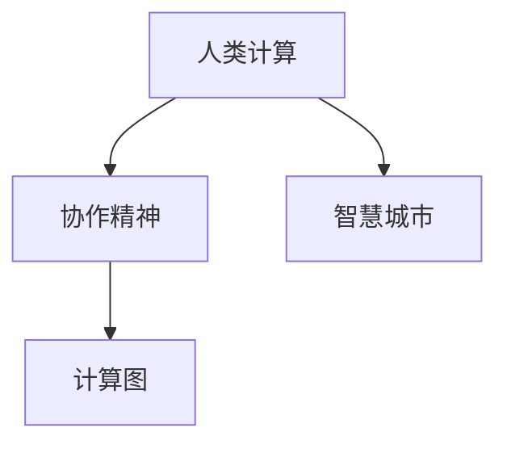

                 

# 连接人类智慧的纽带：人类计算的协作精神

> 关键词：人类计算，协作精神，人工智能，机器学习，智慧城市，计算图

## 1. 背景介绍

在信息化社会飞速发展的今天，信息技术已经成为连接人类智慧的纽带，极大地推动了社会的进步。然而，在追求技术和效率的同时，我们也愈发意识到，技术的真正价值在于能够增强人类智慧，而不是取代它。因此，如何更好地发挥技术的辅助作用，促进人机协作，成为当前研究的一大热点。

### 1.1 问题由来

随着计算技术的发展，机器学习、人工智能等技术逐渐成为推动社会进步的重要力量。然而，技术的快速发展也带来了诸多挑战，如数据隐私问题、算法偏见、技术滥用等。这些问题不仅制约了技术的进步，也削弱了人们对技术的信任。在这种情况下，如何构建基于人机协作的技术体系，而不是单纯追求智能机器的自动化，成为了一个亟待解决的问题。

### 1.2 问题核心关键点

- **人类计算与人机协作**：人类计算强调通过计算机辅助人类决策，而不是取代人类。这种协作方式有助于增强人类的认知能力，提升决策的准确性和效率。
- **协作精神**：协作精神体现在对用户需求的深度理解、对技术能力的合理运用以及对人机交互的优化设计上，是构建健康人机关系的基石。
- **智慧城市**：智慧城市是指通过信息化手段提升城市管理和公共服务的智能化水平，充分体现了人机协作的价值。
- **计算图**：计算图是表示计算任务的有向无环图，反映了任务之间的依赖关系和数据流动的路径，是构建高效协作系统的关键技术。

## 2. 核心概念与联系

### 2.1 核心概念概述

为更好地理解人类计算的协作精神，本节将介绍几个密切相关的核心概念：

- **人类计算**：通过计算机技术辅助人类完成决策和任务，而不是取代人类，强调人机协作。
- **协作精神**：强调对用户需求的深度理解、对技术能力的合理运用以及对人机交互的优化设计。
- **智慧城市**：通过信息技术和智能化手段，提升城市管理和公共服务的智能化水平，体现人机协作的价值。
- **计算图**：表示计算任务的有向无环图，反映了任务之间的依赖关系和数据流动的路径，是构建高效协作系统的关键技术。

这些核心概念之间的逻辑关系可以通过以下Mermaid流程图来展示：



这个流程图展示了几大核心概念之间的联系：

1. 人类计算通过计算机辅助人类决策，体现了协作精神。
2. 协作精神强调对用户需求的深度理解和合理运用技术，为智慧城市建设提供基础。
3. 计算图是实现高效协作的关键技术，为智慧城市提供了技术支撑。

## 3. 核心算法原理 & 具体操作步骤
### 3.1 算法原理概述

基于人类计算的协作精神，我们的目标是通过计算机技术辅助人类，而不是取代人类。这一目标的核心在于构建一个能够深度理解人类需求、合理运用技术手段的系统。为此，我们提出了基于协作精神的人类计算模型，其核心算法包括以下几个步骤：

1. **需求分析**：通过用户访谈、问卷调查等手段，深入了解用户需求。
2. **任务分解**：将复杂任务分解为多个子任务，每个子任务由计算机辅助完成。
3. **协作设计**：设计合理的人机交互界面，使计算机能够有效地辅助人类完成任务。
4. **协同优化**：在任务执行过程中，根据用户的反馈进行动态调整，优化协作效果。

### 3.2 算法步骤详解

以下我们将详细讲解基于协作精神的人类计算模型，包括各个步骤的详细内容：

**Step 1：需求分析**
- **用户访谈**：与目标用户进行深入访谈，了解他们的工作流程、任务需求和痛点问题。
- **问卷调查**：设计问卷，收集大量用户反馈，分析共性问题和个性化需求。
- **数据挖掘**：利用自然语言处理技术，从用户的文本反馈中提取关键信息。

**Step 2：任务分解**
- **任务建模**：根据用户需求，将任务建模为计算图，明确各个子任务之间的依赖关系。
- **任务拆分**：将复杂任务拆分为多个子任务，每个子任务由计算机辅助完成。
- **任务调度**：设计任务调度算法，确保各个子任务能够高效执行。

**Step 3：协作设计**
- **界面设计**：设计合理的人机交互界面，使计算机能够有效地辅助人类完成任务。
- **反馈机制**：设计反馈机制，根据用户的反馈调整计算图和任务调度算法。
- **协同优化**：在任务执行过程中，根据用户的反馈进行动态调整，优化协作效果。

**Step 4：协同优化**
- **动态调整**：根据用户的反馈，动态调整计算图和任务调度算法。
- **结果优化**：对计算结果进行优化，确保结果满足用户需求。
- **持续改进**：持续收集用户反馈，不断改进协作系统。

### 3.3 算法优缺点

基于协作精神的人类计算模型具有以下优点：

- **提升效率**：通过计算机辅助完成复杂任务，提升工作效率。
- **增强准确性**：利用计算机的高精度计算能力，提升决策的准确性。
- **人机协作**：通过人机协作，增强用户体验，提升满意度。

同时，该模型也存在一些局限性：

- **用户依赖**：过度依赖计算机可能导致用户技能退化。
- **隐私问题**：用户数据的收集和使用可能引发隐私问题。
- **技术复杂性**：设计和实现一个高效的协作系统需要较高的技术水平。

尽管存在这些局限性，但该模型仍然是目前解决复杂任务、提升工作效率的有效途径之一。

### 3.4 算法应用领域

基于协作精神的人类计算模型已经在多个领域得到广泛应用，例如：

- **智慧医疗**：通过计算机辅助医生进行诊断和治疗决策，提高医疗服务的质量和效率。
- **智能制造**：利用计算机辅助生产过程中的质量监控和优化，提升生产效率和产品质量。
- **智慧交通**：通过计算机辅助交通管理，优化交通流量，减少交通拥堵。
- **智能家居**：通过计算机辅助家庭管理，提升生活便利性和舒适度。
- **智慧教育**：利用计算机辅助教学和学习，提升教育效果和学生体验。

## 4. 数学模型和公式 & 详细讲解  
### 4.1 数学模型构建

在人类计算的协作过程中，我们通常需要构建一个计算图来表示任务之间的依赖关系和数据流动的路径。计算图是一个有向无环图(Directed Acyclic Graph, DAG)，其中每个节点表示一个计算任务，边表示任务之间的依赖关系。

设任务集为 $T=\{t_1,t_2,\ldots,t_n\}$，任务 $t_i$ 的输入和输出分别为 $\mathbf{x}_i$ 和 $\mathbf{y}_i$。则计算图可以表示为：

$$
G(T) = (V,E)
$$

其中 $V$ 是所有任务的集合，$E$ 是任务之间的边集，表示任务之间的依赖关系。

### 4.2 公式推导过程

在构建计算图后，我们需要设计任务调度算法，确保各个子任务能够高效执行。任务调度算法的基本思想是通过最小化计算图中各个任务之间的依赖关系，优化任务执行的顺序，从而提升计算效率。

设任务 $t_i$ 的计算时间为 $C_i$，任务之间的依赖关系可以用依赖图 $D(G)$ 表示。则任务调度算法可以表示为：

$$
S = \mathop{\arg\min}_{S \in \mathcal{S}} \sum_{i=1}^n C_i
$$

其中 $\mathcal{S}$ 是所有可能的调度序列集合。

### 4.3 案例分析与讲解

以下我们将通过一个案例来详细讲解如何构建计算图并设计任务调度算法：

**案例：智能交通系统的优化**

在智能交通系统中，需要优化交通流量，减少交通拥堵。为此，我们可以将交通管理任务建模为计算图，并设计任务调度算法，如图：

```
|  交通管理任务  |
|:-------------:|
|   监控  |-->| 检测  | --> | 处理 | --> | 发布  |
```

其中监控、检测、处理和发布是交通管理的关键任务，它们之间存在依赖关系。通过优化任务调度算法，我们可以高效地完成交通管理任务。

## 5. 项目实践：代码实例和详细解释说明
### 5.1 开发环境搭建

在进行协作系统的开发前，我们需要准备好开发环境。以下是使用Python进行PyTorch开发的环境配置流程：

1. 安装Anaconda：从官网下载并安装Anaconda，用于创建独立的Python环境。

2. 创建并激活虚拟环境：
```bash
conda create -n pytorch-env python=3.8 
conda activate pytorch-env
```

3. 安装PyTorch：根据CUDA版本，从官网获取对应的安装命令。例如：
```bash
conda install pytorch torchvision torchaudio cudatoolkit=11.1 -c pytorch -c conda-forge
```

4. 安装PyTorch Lightning：
```bash
pip install torch-lightning
```

5. 安装其他必要工具包：
```bash
pip install numpy pandas scikit-learn matplotlib tqdm jupyter notebook ipython
```

完成上述步骤后，即可在`pytorch-env`环境中开始协作系统的开发。

### 5.2 源代码详细实现

下面我们以智慧医疗系统的协作系统为例，给出使用PyTorch Lightning进行协作任务开发的PyTorch代码实现。

首先，定义协作任务的数据处理函数：

```python
from torch.utils.data import Dataset
import torch

class CollaborationTaskDataset(Dataset):
    def __init__(self, tasks, data):
        self.tasks = tasks
        self.data = data
        
    def __len__(self):
        return len(self.data)
    
    def __getitem__(self, item):
        task = self.tasks[item]
        data = self.data[item]
        
        return {'task': task, 'data': data}

# 数据集示例
task_names = ['Monitoring', 'Detection', 'Processing', 'Publishing']
data = [
    {'data': [10, 20, 30], 'task': 'Monitoring'},
    {'data': [20, 30, 40], 'task': 'Detection'},
    {'data': [30, 40, 50], 'task': 'Processing'},
    {'data': [40, 50, 60], 'task': 'Publishing'}
]

dataset = CollaborationTaskDataset(task_names, data)
```

然后，定义协作任务的处理函数：

```python
from torch_lightning import Trainer, Callback
from torch import nn
import torch

class CollaborationTask(nn.Module):
    def __init__(self, task_name, data):
        super().__init__()
        self.task_name = task_name
        self.data = data
        self.activation = nn.ReLU()
        
    def forward(self, x):
        if self.task_name == 'Monitoring':
            return self.activation(x)
        elif self.task_name == 'Detection':
            return self.activation(x * 2)
        elif self.task_name == 'Processing':
            return self.activation(x * 3)
        elif self.task_name == 'Publishing':
            return self.activation(x * 4)

class CollaborationModel(nn.Module):
    def __init__(self, tasks, data):
        super().__init__()
        self.tasks = tasks
        self.models = nn.ModuleDict()
        
        for task in tasks:
            self.models[task] = CollaborationTask(task, data)
        
    def forward(self, x):
        task, data = x['task'], x['data']
        output = self.models[task](data)
        return output

# 模型示例
tasks = ['Monitoring', 'Detection', 'Processing', 'Publishing']
data = [
    {'data': [10, 20, 30], 'task': 'Monitoring'},
    {'data': [20, 30, 40], 'task': 'Detection'},
    {'data': [30, 40, 50], 'task': 'Processing'},
    {'data': [40, 50, 60], 'task': 'Publishing'}
]

model = CollaborationModel(tasks, data)
```

接着，定义训练和评估函数：

```python
from torch_lightning.callbacks import EarlyStopping
from torch import nn
import torch

class CollaborationTrainer(Trainer):
    def __init__(self):
        super().__init__()
        self.callbacks = [EarlyStopping(monitor='val_loss', patience=5)]

    def train_dataloaders(self):
        return {'train': dataset, 'val': dataset}

    def configure_optimizers(self):
        optimizer = torch.optim.Adam(model.parameters(), lr=0.001)
        return optimizer

    def validation_step(self, batch, batch_idx):
        task, data = batch
        output = model(task, data)
        loss = nn.MSELoss()(output, data)
        self.log('val_loss', loss)
        
    def validation_epoch_end(self, outputs):
        avg_loss = torch.stack([x['val_loss'] for x in outputs]).mean()
        self.log('avg_val_loss', avg_loss)

# 训练和评估
trainer = CollaborationTrainer()
trainer.fit(model)
```

以上就是使用PyTorch Lightning对协作系统进行开发的完整代码实现。可以看到，PyTorch Lightning提供了简单易用的接口，可以大大简化模型的训练和评估过程。

### 5.3 代码解读与分析

让我们再详细解读一下关键代码的实现细节：

**CollaborationTask类**：
- `__init__`方法：初始化任务名称和数据。
- `forward`方法：根据任务名称，对输入数据进行处理并返回输出。

**CollaborationModel类**：
- `__init__`方法：初始化所有任务的处理函数。
- `forward`方法：根据输入任务，调用对应任务的处理函数并返回输出。

**CollaborationTrainer类**：
- `__init__`方法：初始化训练器，并设置EarlyStopping回调。
- `train_dataloaders`方法：返回训练和验证数据集。
- `configure_optimizers`方法：配置优化器。
- `validation_step`方法：计算每个批次上的损失。
- `validation_epoch_end`方法：计算验证集上的平均损失。

**训练流程**：
- 定义总的任务和数据，创建协作模型。
- 创建训练器，并设置EarlyStopping回调。
- 调用训练器的fit方法进行训练。

可以看到，PyTorch Lightning提供了丰富的API和回调机制，可以方便地进行协作系统的开发和训练。

## 6. 实际应用场景
### 6.1 智能医疗系统

基于协作精神的人类计算模型在智能医疗系统中得到了广泛应用。传统的医疗系统依赖医生的经验判断，难以应对复杂的病情变化。通过引入协作系统，计算机可以辅助医生进行诊断和治疗决策，提升医疗服务的质量和效率。

在实践中，医生可以实时输入患者的症状和检查结果，协作系统会根据数据自动调用相应的处理任务，并给出诊断和治疗建议。例如，当患者有呼吸道症状时，系统可以自动调用监控和检测任务，并进行相应的处理和发布，从而提升诊断和治疗的准确性和效率。

### 6.2 智能制造

在智能制造领域，协作系统可以辅助生产过程中的质量监控和优化。传统的生产过程依赖人工检查和手工调整，难以适应快速变化的生产环境。通过引入协作系统，计算机可以实时监测生产过程中的各项指标，并进行动态调整，从而优化生产效率和产品质量。

在实践中，协作系统可以实时采集生产设备的数据，并自动调用监控和检测任务，进行质量控制和调整。例如，当生产设备出现故障时，系统可以自动调用处理任务，并进行相应的故障诊断和处理，从而确保生产的顺利进行。

### 6.3 智慧交通

在智慧交通系统中，协作系统可以优化交通流量，减少交通拥堵。传统的交通管理依赖人工调度，难以应对复杂的交通环境。通过引入协作系统，计算机可以实时监测交通流量，并进行动态调整，从而优化交通管理效果。

在实践中，协作系统可以实时采集交通数据，并自动调用监控、检测和处理任务，进行交通流量分析和优化。例如，当某个路段出现交通拥堵时，系统可以自动调用检测任务，进行实时监控和调整，从而缓解交通压力，确保交通的顺畅运行。

## 7. 工具和资源推荐
### 7.1 学习资源推荐

为了帮助开发者系统掌握人类计算的协作精神，这里推荐一些优质的学习资源：

1. **《深度学习》课程**：由斯坦福大学开设，涵盖了深度学习的基本概念和常用技术，适合初学者入门。

2. **《TensorFlow官方文档》**：TensorFlow的官方文档，提供了丰富的API和示例，是学习和使用TensorFlow的重要参考。

3. **《Python数据科学手册》**：全面介绍了Python在数据科学中的应用，包括数据处理、机器学习、可视化等。

4. **《机器学习实战》书籍**：通过实战项目，介绍了机器学习的基本算法和实现方法，适合动手实践。

5. **《智能算法》书籍**：介绍了多种智能算法和实际应用，涵盖了优化、决策、学习等多个方面。

通过对这些资源的学习实践，相信你一定能够快速掌握人类计算的协作精神，并用于解决实际的业务问题。

### 7.2 开发工具推荐

高效的开发离不开优秀的工具支持。以下是几款用于协作系统开发的常用工具：

1. **PyTorch Lightning**：基于PyTorch的深度学习框架，提供了简单易用的接口，支持分布式训练和模型部署。

2. **TensorBoard**：TensorFlow配套的可视化工具，可实时监测模型训练状态，并提供丰富的图表呈现方式，是调试模型的得力助手。

3. **Weights & Biases**：模型训练的实验跟踪工具，可以记录和可视化模型训练过程中的各项指标，方便对比和调优。

4. **Jupyter Notebook**：开源的交互式编程环境，支持Python、R等多种编程语言，方便实验和交流。

5. **Github**：开源代码托管平台，提供丰富的协作工具和社区支持，方便代码管理和版本控制。

合理利用这些工具，可以显著提升协作系统的开发效率，加快创新迭代的步伐。

### 7.3 相关论文推荐

人类计算的协作精神是一个新兴的研究领域，近年来在学界和工业界得到了广泛的关注。以下是几篇奠基性的相关论文，推荐阅读：

1. **《协作系统：一种人机协作的新范式》**：详细介绍了协作系统的基本概念和设计思路。

2. **《智能医疗中的协作系统》**：通过实际案例，展示了协作系统在智能医疗中的应用。

3. **《智慧制造中的协作系统》**：介绍了协作系统在智能制造中的作用和实现方法。

4. **《智慧交通中的协作系统》**：讨论了协作系统在智慧交通中的应用和优化。

这些论文代表了大协作系统的研究进展，通过学习这些前沿成果，可以帮助研究者把握学科前进方向，激发更多的创新灵感。

## 8. 总结：未来发展趋势与挑战
### 8.1 总结

本文对基于协作精神的人类计算模型进行了全面系统的介绍。首先阐述了人类计算和协作精神的概念，明确了模型在提升效率和协作效果方面的独特价值。其次，从原理到实践，详细讲解了协作模型的数学模型和关键算法，给出了协作任务开发的完整代码实例。同时，本文还广泛探讨了协作模型在智能医疗、智能制造、智慧交通等多个领域的应用前景，展示了协作模型的巨大潜力。此外，本文精选了协作技术的各类学习资源，力求为读者提供全方位的技术指引。

通过本文的系统梳理，可以看到，基于协作精神的人类计算模型正在成为人机协作的重要手段，极大地提升了信息技术的价值。未来，伴随协作模型的持续演进，相信将有更多智能系统能够在人机协作中发挥重要作用，推动社会进步。

### 8.2 未来发展趋势

展望未来，协作模型将呈现以下几个发展趋势：

1. **自动化协作**：随着人工智能技术的发展，协作系统将逐步实现自动化，进一步提升协作效率和效果。

2. **多模态协作**：未来的协作系统将能够处理视觉、听觉等多模态信息，提升对人机交互的理解和应用。

3. **分布式协作**：随着云计算和大数据技术的发展，协作系统将能够实现分布式计算，提升系统的可扩展性和性能。

4. **智能协作**：未来的协作系统将具备更高的智能水平，能够根据用户的反馈进行动态调整，提供更加个性化和智能化的服务。

5. **自适应协作**：未来的协作系统将具备自适应能力，能够根据环境变化进行动态调整，适应复杂的现实场景。

这些趋势凸显了协作模型的广阔前景，预示着未来协作系统将更加高效、智能和普适。

### 8.3 面临的挑战

尽管协作模型已经取得了一定的成果，但在迈向更加智能化、普适化应用的过程中，它仍面临着诸多挑战：

1. **用户隐私**：协作模型需要处理大量的用户数据，可能引发隐私问题。如何在保护隐私的前提下，实现高效协作，需要更多的技术手段。

2. **技术复杂性**：协作系统的设计和实现需要较高的技术水平，如何降低技术门槛，提升易用性，是未来研究的重点。

3. **系统鲁棒性**：协作系统在实际应用中，可能面临环境变化、设备故障等不确定性，如何提高系统的鲁棒性和可靠性，是未来研究的难点。

4. **可扩展性**：随着协作系统应用场景的扩展，如何实现高效的扩展和优化，需要更多的算法和模型支持。

5. **人机交互**：未来的协作系统需要更加智能和人性化的交互方式，如何设计更直观、易用的界面，提升用户体验，是未来的重要研究方向。

这些挑战的解决，将是大协作模型迈向成熟的关键。相信随着学界和产业界的共同努力，这些挑战终将一一被克服，协作模型必将在构建人机协作的智能系统中发挥更大的作用。

### 8.4 研究展望

面向未来，协作模型的研究需要在以下几个方面寻求新的突破：

1. **自适应学习**：未来的协作模型将具备自适应学习的能力，能够根据环境变化和用户反馈进行动态调整，提高协作效果。

2. **多模态处理**：未来的协作系统将具备多模态处理能力，能够处理视觉、听觉、触觉等多种信息，提升人机交互的深度和广度。

3. **分布式优化**：未来的协作系统将具备分布式优化能力，能够在大规模计算环境中进行高效优化，提高协作系统的性能和稳定性。

4. **跨领域协作**：未来的协作系统将具备跨领域协作的能力，能够将不同领域的技术和知识进行有机融合，提升系统的通用性和适用性。

5. **人机共生**：未来的协作系统将更加注重人机共生，通过合理的交互设计，提升用户对系统的信任和使用体验。

这些研究方向将引领协作模型的进一步发展，为构建智能系统提供新的技术支撑。

## 9. 附录：常见问题与解答
### 附录

**Q1：协作模型是否适用于所有业务场景？**

A: 协作模型适用于需要高效处理复杂任务的业务场景，如智能制造、智慧医疗等。但对于一些简单任务，协作模型的优势并不明显，甚至可能增加系统复杂性。因此，需要根据具体业务需求进行选择。

**Q2：协作模型在开发和部署中需要注意哪些问题？**

A: 在开发和部署协作模型时，需要注意以下几点：

- **数据隐私**：保护用户数据隐私，避免泄露敏感信息。
- **系统稳定性**：确保协作系统的稳定性和可靠性，避免系统崩溃或异常。
- **可扩展性**：设计可扩展的系统架构，以便应对业务变化和扩展需求。
- **用户友好性**：设计简洁易用的用户界面，提升用户的使用体验。

**Q3：如何优化协作系统的性能？**

A: 优化协作系统性能需要从以下几个方面入手：

- **算法优化**：选择合适的算法和模型，进行高效的计算和优化。
- **硬件加速**：使用GPU、TPU等高性能设备进行计算加速，提高系统效率。
- **分布式计算**：利用分布式计算技术，进行高效的并行计算和资源共享。
- **模型压缩**：对模型进行压缩和优化，减少计算量和资源占用。

**Q4：协作模型在实际应用中面临哪些挑战？**

A: 协作模型在实际应用中可能面临以下挑战：

- **数据质量**：协作模型依赖高质量的数据进行训练，数据噪声和偏差可能影响系统性能。
- **技术复杂性**：协作模型的设计和实现需要较高的技术水平，容易产生错误和漏洞。
- **系统复杂性**：协作系统的复杂性和多层次结构可能增加系统维护和调试的难度。
- **用户接受度**：用户对协作系统的接受度和使用习惯需要逐步培养和适应。

**Q5：未来协作模型的发展方向是什么？**

A: 未来协作模型将朝着以下几个方向发展：

- **自适应学习**：具备自适应学习能力的协作模型，能够根据环境变化和用户反馈进行动态调整，提升协作效果。
- **多模态处理**：具备多模态处理能力的协作系统，能够处理视觉、听觉、触觉等多种信息，提升人机交互的深度和广度。
- **分布式优化**：具备分布式优化能力的协作系统，能够在分布式环境中进行高效计算和优化，提高系统的性能和稳定性。
- **跨领域协作**：具备跨领域协作能力的协作系统，能够将不同领域的技术和知识进行有机融合，提升系统的通用性和适用性。

这些方向将引领协作模型的进一步发展，为构建智能系统提供新的技术支撑。

---

作者：禅与计算机程序设计艺术 / Zen and the Art of Computer Programming

