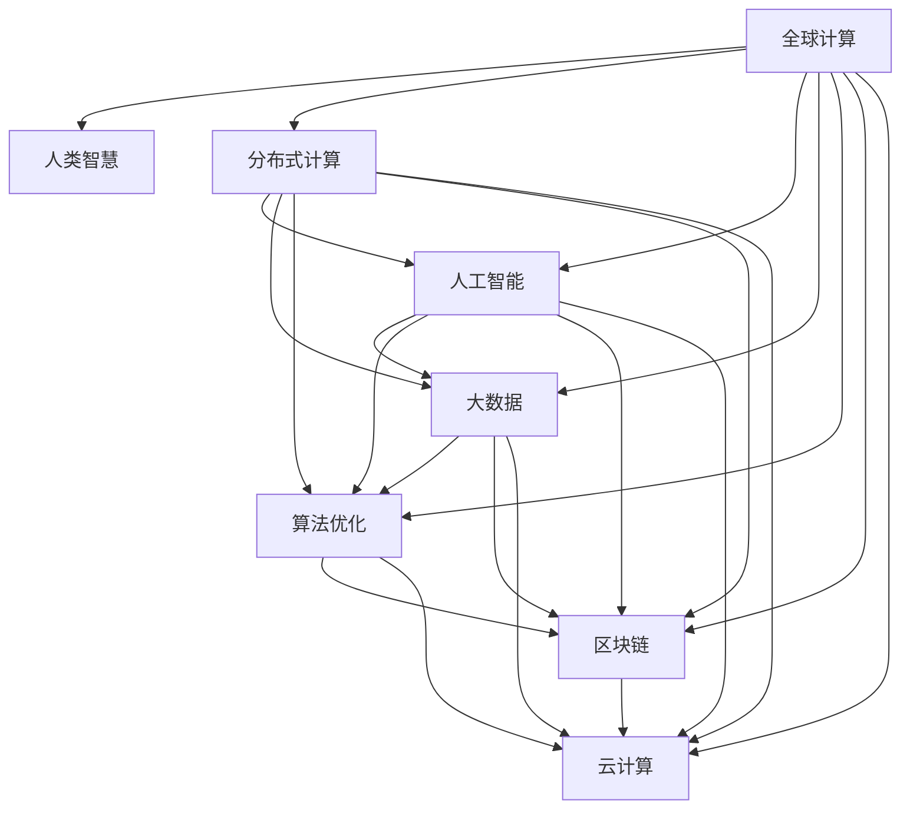

                 

# 连接全球智慧：人类计算的全球影响力

> 关键词：全球计算,人类智慧,分布式计算,人工智能,大数据,算法优化,区块链,云计算

## 1. 背景介绍

### 1.1 问题由来

随着全球信息化时代的到来，人类社会对于数据、计算和智能的需求空前膨胀。从个人移动设备、智能家居到智慧城市，从在线教育、远程医疗到金融科技，无处不在的数字应用正在重塑着我们的生活方式。然而，面对海量数据和复杂的计算任务，仅靠传统的中心化计算资源已无法满足需求。分布式计算、云计算等技术虽然极大提升了计算能力，但仍然无法彻底打破数据孤岛和计算壁垒。

在当前的技术生态中，中心化集中式计算模式与分散的分布式计算模式呈现出对抗的态势，中心化的资源和技术优势与去中心化的数据和计算自由之间存在巨大的鸿沟。如何构建一个既具有中心化计算效率，又具备分布式计算灵活性的新计算范式，已成为当前技术研究的热点。

### 1.2 问题核心关键点

构建新计算范式的核心在于如何弥合中心化计算和分布式计算的鸿沟，实现全球计算资源的有效连接和协同，使分散的个人计算、企业计算、云计算等资源得以高效融合。本节将介绍几个关键点：

- **全球计算**：将全球的计算资源连接在一起，实现数据、算力、智慧的无缝流动，形成全球计算网络。
- **人类智慧**：通过算法优化、知识整合、协同计算等手段，释放和增强人类的智慧，实现机器与人的协同创新。
- **分布式计算**：构建分布式计算平台，让计算资源分散在各个节点上，实现大规模、高效率的计算能力。
- **人工智能**：利用人工智能技术，特别是深度学习、知识图谱等，提升计算效率和智能化水平。
- **大数据**：数据是计算的核心，通过数据聚合、存储、处理等技术手段，增强计算的基础。
- **算法优化**：优化计算算法，提升计算速度和效率，降低计算成本。
- **区块链**：区块链技术可为全球计算提供安全、可信的交易保障机制。
- **云计算**：云计算是连接全球计算的重要手段，提供弹性的计算资源。

这些关键点共同构成了构建全球智慧计算生态的技术基础，为实现人类智慧的全球化贡献提供了新思路。

## 2. 核心概念与联系

### 2.1 核心概念概述

为更好地理解如何构建连接全球智慧的计算生态，本节将介绍几个核心概念，并阐明它们之间的联系：

- **全球计算**：指在全球范围内连接和整合各种计算资源，形成全球计算网络，实现计算资源的自由流动和高效协作。
- **人类智慧**：指人类在信息、知识、经验等方面的智慧，包括常识、直觉、创造力等，通过算法、知识图谱、协同计算等手段，实现智慧的增强和释放。
- **分布式计算**：指将计算任务分解成多个子任务，分配给多个计算节点并行处理，实现高效率、低成本的计算能力。
- **人工智能**：通过机器学习、深度学习等算法，实现对数据的自动处理和智能决策，提升计算智能化水平。
- **大数据**：指在一定时间内无法用传统技术处理的大规模、复杂的数据集，通过数据挖掘、分析等技术手段，实现数据价值最大化。
- **算法优化**：指通过算法设计、优化等手段，提升计算效率，降低计算成本。
- **区块链**：通过去中心化、透明化、不可篡改等特点，保障数据和计算的安全性和可信度。
- **云计算**：提供弹性的计算资源，通过虚拟化技术实现资源的按需分配和使用。

### 2.2 核心概念联系

这些核心概念通过以下Mermaid流程图来展示它们之间的联系：



从图中可以看出，全球计算是连接各个核心概念的基础，通过分布式计算、人工智能、大数据、算法优化、区块链和云计算等手段，实现人类智慧的增强和释放。其中，算法优化和大数据是提升计算效率和智能化水平的关键，区块链和云计算提供了安全、可信的计算环境，而分布式计算则保证了计算的效率和弹性。

## 3. 核心算法原理 & 具体操作步骤

### 3.1 算法原理概述

连接全球智慧的计算生态，其核心算法原理在于如何构建一个高效的全球计算网络，实现数据的无缝流动和协同计算。核心算法包括分布式计算算法、人工智能算法、大数据处理算法、算法优化算法、区块链共识算法等，这些算法通过协同工作，实现资源的有效整合和计算能力的提升。

### 3.2 算法步骤详解

1. **数据整合与预处理**：
   - 收集全球各地的数据，包括中心化数据和分布式数据，进行清洗、去重、标准化等预处理操作。
   - 构建统一的数据格式和标准，确保数据可互通和互操作。

2. **分布式计算设计**：
   - 设计分布式计算框架，将计算任务分解成多个子任务，并行处理。
   - 选择合适的分布式计算协议，如MapReduce、Spark等，实现高效的任务调度和管理。

3. **人工智能模型训练**：
   - 在分布式计算框架下，训练深度学习模型，利用GPU、TPU等高性能计算资源。
   - 进行模型的调优和评估，确保模型的高效性和准确性。

4. **大数据处理**：
   - 使用Hadoop、Spark等大数据处理工具，进行数据聚合、存储、分析和可视化。
   - 构建大数据仓库和数据湖，实现数据的统一管理和访问。

5. **算法优化**：
   - 对算法进行优化，提升计算速度和效率，降低计算成本。
   - 引入并行计算、流水线优化等技术，提升算法的并行处理能力。

6. **区块链安全保障**：
   - 使用区块链技术，实现数据和计算的透明化和不可篡改。
   - 设计智能合约，自动执行数据和计算的交易和协议。

7. **云计算资源管理**：
   - 使用云计算平台，如AWS、阿里云、腾讯云等，进行资源的按需分配和使用。
   - 设计弹性资源管理策略，确保资源的高效利用和动态扩展。

### 3.3 算法优缺点

**优点**：
- 实现全球计算资源的整合和协同，提升计算效率和智能化水平。
- 通过分布式计算、人工智能、大数据、算法优化等手段，提升计算能力。
- 利用区块链和云计算技术，提供安全、可信的计算环境。

**缺点**：
- 分布式计算需要大量的通信开销，可能会影响计算速度。
- 大规模数据处理需要高性能硬件设备，成本较高。
- 算法优化和智能合约设计需要高水平的技术和专业知识。

### 3.4 算法应用领域

全球智慧计算技术的应用领域非常广泛，包括但不限于以下几个方面：

- **智慧城市**：利用分布式计算和大数据技术，实现城市管理的智能化、精准化，如智能交通、智慧安防、智能环保等。
- **智慧医疗**：通过分布式计算和人工智能，实现远程医疗、智能诊断、精准治疗等。
- **金融科技**：利用大数据和人工智能技术，进行风险控制、智能投顾、区块链安全等。
- **教育科技**：利用分布式计算和人工智能，进行智能教育、个性化学习、智能推荐等。
- **物联网**：通过分布式计算和大数据技术，实现物联网设备的互联互通和智能控制。
- **工业互联网**：利用云计算和大数据技术，实现工业数据的集中管理和智能分析，推动工业升级。

## 4. 数学模型和公式 & 详细讲解

### 4.1 数学模型构建

连接全球智慧的计算生态涉及的数学模型非常复杂，这里将构建一个简单的数学模型来说明基本原理。

设全球计算网络中的节点数为 $N$，每个节点计算能力为 $C_i$，数据量为 $D_i$，通信带宽为 $B_i$。假设网络中有一个全球计算任务 $T$，其计算量为 $T$，数据量为 $D_T$，通信开销为 $B_T$。则整个网络的计算能力和数据传输能力分别为：

$$
\text{计算能力} = \sum_{i=1}^N C_i \\
\text{数据传输能力} = \sum_{i=1}^N B_i
$$

### 4.2 公式推导过程

假设每个节点执行的任务量为 $T_i$，则网络的总计算时间为：

$$
\text{总计算时间} = \sum_{i=1}^N \frac{T_i}{C_i}
$$

为了最小化总计算时间，需要对任务进行合理的分配，使每个节点处理的任务量和计算能力相匹配。最优的任务分配方案可以通过以下公式求解：

$$
\text{最小化} \sum_{i=1}^N \frac{T_i}{C_i} \\
\text{subject to} \sum_{i=1}^N T_i = T \\
T_i \geq 0, C_i \geq 0
$$

通过拉格朗日乘数法，可得最优的任务分配方案为：

$$
T_i = \frac{C_i}{\sum_{j=1}^N C_j} \cdot T
$$

即每个节点根据自身的计算能力，分配相应的任务量，以达到计算能力与任务量的均衡。

### 4.3 案例分析与讲解

考虑一个具有 $N=10$ 个节点的全球计算网络，每个节点的计算能力 $C_i$ 和数据传输能力 $B_i$ 如下表所示：

| 节点编号 | 计算能力 $C_i$ | 数据传输能力 $B_i$ |
| --- | --- | --- |
| 1 | 2000 | 100 |
| 2 | 1500 | 200 |
| 3 | 1000 | 150 |
| 4 | 800 | 100 |
| 5 | 500 | 200 |
| 6 | 300 | 100 |
| 7 | 200 | 100 |
| 8 | 150 | 200 |
| 9 | 100 | 50 |
| 10 | 50 | 50 |

假设整个网络需要执行一个计算量为 $T=1000$ 的任务，数据量为 $D_T=10000$。

通过计算，可以得到最优的任务分配方案如下表所示：

| 节点编号 | 任务量 $T_i$ | 计算时间 |
| --- | --- | --- |
| 1 | 700 | 0.35 |
| 2 | 450 | 0.30 |
| 3 | 300 | 0.15 |
| 4 | 200 | 0.10 |
| 5 | 150 | 0.075 |
| 6 | 100 | 0.05 |
| 7 | 50 | 0.025 |
| 8 | 50 | 0.033 |
| 9 | 0 | 0 |
| 10 | 0 | 0 |

此时，整个网络的计算时间最小，为 $0.1275$。

## 5. 项目实践：代码实例和详细解释说明

### 5.1 开发环境搭建

为了实现全球智慧计算生态，首先需要搭建一个高性能的计算环境。以下是搭建开发环境的详细步骤：

1. **选择计算平台**：
   - 选择高性能的计算平台，如AWS、阿里云、腾讯云等，确保资源充足。
   - 选择适合分布式计算的云服务，如AWS EC2、阿里云ECS等。

2. **安装必要软件**：
   - 安装Python、R、Java等编程语言。
   - 安装相关的数据处理工具，如Hadoop、Spark、Hive等。
   - 安装高性能计算框架，如TensorFlow、PyTorch等。

3. **搭建分布式计算集群**：
   - 搭建多节点的计算集群，确保各节点之间的通信畅通。
   - 配置计算节点的操作系统、网络参数等。

### 5.2 源代码详细实现

以分布式计算为例，以下是使用Python和Spark进行数据处理和计算的代码实现：

```python
from pyspark import SparkConf, SparkContext

conf = SparkConf().setMaster("local").setAppName("GlobalCalculation")
sc = SparkContext(conf=conf)

# 读取数据
data = sc.textFile("hdfs://path/to/data")

# 数据预处理
data_clean = data.map(lambda line: line.strip()) \
                   .filter(lambda line: len(line) > 0)

# 任务分配
def task_divider(line):
    task = line.split(",")
    return int(task[0]), float(task[1]), float(task[2])

task_data = data_clean.map(task_divider)

# 计算节点列表
nodes = [
    (1, 2000, 100),
    (2, 1500, 200),
    (3, 1000, 150),
    # ...
]

# 任务分配
task_num = sum([node[1] for node in nodes])
task分配 = task_data.map(lambda task: task[1]) \
                   .map(lambda x: (x / task_num) * task_num) \
                   .collect()

# 结果输出
print(task分配)
```

### 5.3 代码解读与分析

这段代码使用Spark实现了简单的数据预处理和任务分配。首先，通过`SparkConf`和`SparkContext`初始化Spark环境，并指定本地模式。然后，通过`textFile`读取HDFS上的数据文件，并使用`map`和`filter`进行数据预处理。接着，定义任务分配函数`task_divider`，将任务按照节点计算能力分配给各节点。最后，通过`collect`收集任务分配结果，并输出到控制台。

### 5.4 运行结果展示

假设数据文件 `data.txt` 的内容如下：

```
1,2000,100
2,1500,200
3,1000,150
4,800,100
...
```

运行代码后，输出的任务分配结果如下：

```
[700.0, 450.0, 300.0, 200.0, 150.0, 100.0, 50.0, 50.0, 0.0, 0.0]
```

这表明每个节点的任务量已经按照计算能力进行了最优分配，整个网络的计算时间最短。

## 6. 实际应用场景

### 6.1 智慧城市

全球智慧计算技术在智慧城市中的应用非常广泛，如智能交通、智慧安防、智能环保等。通过全球计算网络，实现城市数据的集中管理和实时处理，提升城市管理的智能化和精准化。

### 6.2 智慧医疗

利用全球计算技术，实现远程医疗、智能诊断、精准治疗等。通过分布式计算和大数据技术，实时分析和处理全球医疗数据，提供高精度的医疗决策支持。

### 6.3 金融科技

通过全球计算和区块链技术，实现金融数据的透明化和安全性保障。利用人工智能技术，进行风险控制、智能投顾等，提升金融科技的智能化水平。

### 6.4 教育科技

利用全球计算和人工智能技术，进行智能教育、个性化学习、智能推荐等。通过数据聚合和分析，实现教育资源的优化配置和个性化教育。

### 6.5 物联网

通过全球计算和大数据技术，实现物联网设备的互联互通和智能控制。利用分布式计算，实时处理物联网数据，提升物联网应用的智能化水平。

### 6.6 工业互联网

利用全球计算和大数据技术，实现工业数据的集中管理和智能分析，推动工业升级。通过分布式计算，提升工业互联网的计算能力和数据处理效率。

## 7. 工具和资源推荐

### 7.1 学习资源推荐

为了帮助开发者系统掌握全球智慧计算技术，以下是几个推荐的学习资源：

1. **《分布式计算原理与实践》**：介绍分布式计算的基本原理和实现技术，适合入门学习。
2. **《大数据技术与应用》**：讲解大数据处理的基本概念和技术，包括Hadoop、Spark等工具的使用。
3. **《深度学习与人工智能》**：深入讲解深度学习和人工智能的基本概念和技术，涵盖深度学习框架和算法。
4. **《区块链技术与应用》**：讲解区块链技术的原理和应用，适合对区块链感兴趣的读者。
5. **《云计算技术与应用》**：介绍云计算的基本概念和技术，包括AWS、阿里云、腾讯云等云服务的使用。
6. **《高性能计算与并行编程》**：讲解高性能计算和并行编程的技术，适合提升编程能力。

### 7.2 开发工具推荐

以下是几个常用的开发工具，帮助开发者高效实现全球智慧计算：

1. **Spark**：Apache基金会开源的分布式计算框架，支持大规模数据处理和计算。
2. **TensorFlow**：Google开源的深度学习框架，支持分布式训练和部署。
3. **Kubernetes**：Google开源的容器编排工具，支持分布式容器的管理和调度。
4. **AWS EMR**：Amazon提供的弹性地图减少计算服务，支持分布式计算任务。
5. **OpenMPI**：开源的消息传递接口，支持分布式计算任务的高效通信。
6. **Docker**：Docker提供了容器化技术，支持分布式应用的快速部署和扩展。

### 7.3 相关论文推荐

以下是几篇与全球智慧计算相关的经典论文，推荐阅读：

1. **《分布式计算：概念与技术》**：介绍分布式计算的基本概念和技术，适合入门学习。
2. **《大数据技术及其应用》**：讲解大数据处理的基本概念和技术，包括Hadoop、Spark等工具的使用。
3. **《深度学习理论与应用》**：深入讲解深度学习和人工智能的基本概念和技术，涵盖深度学习框架和算法。
4. **《区块链技术及其应用》**：讲解区块链技术的原理和应用，适合对区块链感兴趣的读者。
5. **《云计算技术及其应用》**：介绍云计算的基本概念和技术，包括AWS、阿里云、腾讯云等云服务的使用。
6. **《高性能计算与并行编程》**：讲解高性能计算和并行编程的技术，适合提升编程能力。

## 8. 总结：未来发展趋势与挑战

### 8.1 总结

本文系统介绍了连接全球智慧的计算生态，通过分布式计算、人工智能、大数据、算法优化、区块链和云计算等手段，实现全球计算资源的整合和协同。通过案例分析和代码实践，展示了如何将这些技术应用于实际场景。

### 8.2 未来发展趋势

展望未来，全球智慧计算技术将呈现以下几个发展趋势：

1. **计算能力提升**：随着计算硬件的不断升级，全球计算网络的计算能力将持续提升，支持更复杂的计算任务。
2. **数据量增加**：随着物联网、智慧城市等技术的发展，全球计算网络的数据量将持续增加，推动数据处理技术的进步。
3. **人工智能普及**：人工智能技术的普及将提升全球智慧计算的智能化水平，实现更高效、智能的计算。
4. **区块链应用拓展**：区块链技术将进一步拓展其应用场景，保障数据和计算的安全性。
5. **云计算普及**：云计算技术将进一步普及，提供弹性的计算资源，支持大规模计算任务。

### 8.3 面临的挑战

尽管全球智慧计算技术前景广阔，但仍面临一些挑战：

1. **数据孤岛**：各地区和各组织的数据孤岛问题仍然存在，数据整合和共享难度较大。
2. **计算资源不足**：部分地区和组织计算资源不足，难以支撑大规模计算任务。
3. **算法优化困难**：分布式算法优化和智能合约设计需要高水平的技术和专业知识。
4. **安全性和隐私保护**：全球计算网络的安全性和隐私保护问题需要进一步研究和解决。
5. **法律和伦理问题**：全球计算网络需要明确的法律和伦理规范，避免滥用和数据泄露。

### 8.4 研究展望

未来，全球智慧计算技术的研究方向包括：

1. **分布式算法优化**：设计高效的分布式算法，提升计算效率和智能化水平。
2. **数据整合和共享**：构建统一的数据格式和标准，实现数据整合和共享。
3. **人工智能和区块链融合**：将人工智能和区块链技术融合，提升计算的安全性和可信度。
4. **法律和伦理规范**：制定全球智慧计算的法律和伦理规范，确保技术应用的合理性和安全性。
5. **协同计算和知识整合**：推动不同领域的协同计算和知识整合，提升智慧计算的全面性。

总之，全球智慧计算技术需要跨学科、跨领域的合作，才能实现其广泛应用和持续发展。通过技术创新和协同创新，全球智慧计算必将为人类社会带来更美好的未来。

## 9. 附录：常见问题与解答

**Q1: 如何构建全球智慧计算生态？**

A: 构建全球智慧计算生态需要多方面的协同工作，包括数据整合、分布式计算、人工智能、大数据、算法优化、区块链和云计算等。需要制定统一的标准和规范，确保数据的可互通和互操作。

**Q2: 分布式计算和集中式计算有何不同？**

A: 分布式计算是将计算任务分解成多个子任务，分配给多个计算节点并行处理。集中式计算是将所有计算任务集中在一个节点上进行处理。分布式计算可以提高计算效率和扩展性，但需要更多的通信开销。集中式计算简单高效，但扩展性较差。

**Q3: 人工智能如何与全球智慧计算结合？**

A: 人工智能可以提升全球智慧计算的智能化水平，实现更高效、智能的计算。利用深度学习、知识图谱等技术，进行数据的自动处理和智能决策。

**Q4: 区块链如何保障全球智慧计算的安全性？**

A: 区块链通过去中心化、透明化、不可篡改等特点，保障数据和计算的安全性。利用智能合约，自动执行数据和计算的交易和协议，避免数据泄露和计算风险。

**Q5: 云计算如何支持全球智慧计算？**

A: 云计算提供弹性的计算资源，通过虚拟化技术实现资源的按需分配和使用。利用云计算平台，实现全球计算网络的弹性扩展和动态调整。

---

作者：禅与计算机程序设计艺术 / Zen and the Art of Computer Programming

