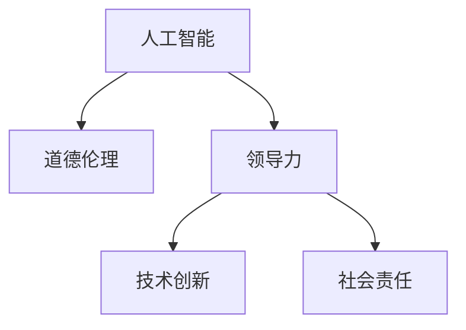

                 

# 道德领导力：AI 时代的关键

> 关键词：人工智能,道德伦理,领导力,技术创新,社会责任

## 1. 背景介绍

### 1.1 问题由来
随着人工智能(AI)技术的迅猛发展，AI已经在各个领域得到了广泛的应用，从医疗、教育、金融到自动驾驶、智能制造，AI的渗透率越来越高。然而，AI技术的发展不仅带来生产力的大幅提升，也带来了一系列伦理和道德问题。AI系统在做出决策时是否具备道德责任？AI的创造者和管理者如何确保这些系统的决策公正、透明、可解释？这些问题直接关系到AI技术是否能够得到社会认可和广泛接受。

因此，探索AI时代的道德领导力，即如何在AI技术的开发、应用和治理过程中，将道德伦理原则内嵌到技术中，是当前AI领域的重要课题。道德领导力的构建，不仅涉及技术实现，更是一个跨学科的复杂系统工程，需要从技术、法律、伦理和社会多个层面进行深入研究和实践。

### 1.2 问题核心关键点
AI时代的道德领导力构建，主要围绕以下几个核心问题展开：

- **技术实现**：如何在技术上实现道德伦理原则的内嵌，确保AI系统的决策过程符合伦理要求。
- **法律框架**：如何在法律层面上对AI系统进行规范和监管，确保其行为符合社会公序良俗。
- **伦理原则**：确立哪些伦理原则是AI系统应遵循的，例如公正、透明、可解释性、隐私保护等。
- **社会责任**：AI系统的创造者、开发者和管理者应承担哪些社会责任，如何实现公平使用和社会福祉。

这些问题不仅关系到AI技术的未来发展，更关乎人类社会的道德与价值取向。因此，构建AI时代的道德领导力，需要多学科的共同努力和社会的广泛参与。

## 2. 核心概念与联系

### 2.1 核心概念概述

为更好地理解AI时代的道德领导力构建，本节将介绍几个关键概念及其相互联系：

- **人工智能(AI)**：利用算法、数据和计算技术，使计算机系统能够自主或半自主地执行复杂任务。
- **道德伦理**：关于道德和伦理的哲学和社会学研究，探讨何为善、何为恶，以及人类行为的合理性。
- **领导力**：在组织或社会中，领导者通过自身行为和决策引导和影响他人的能力。
- **技术创新**：通过技术手段实现新功能、新流程和新系统的开发过程。
- **社会责任**：企业和个人对社会承担的义务，包括环境保护、社会公平和道德责任等。

这些概念之间的逻辑关系可以通过以下Mermaid流程图来展示：



这个流程图展示了一系列概念之间的关系：

1. 人工智能通过技术手段实现，而技术创新是其重要驱动因素。
2. 道德伦理原则应内嵌于AI技术实现中，引导技术创新的方向。
3. 领导力在AI技术的开发和应用过程中起到关键作用，通过决策和引导确保道德伦理原则的落实。
4. 社会责任的实现与AI系统的开发、应用和管理密不可分，确保AI技术对社会的正面影响。

## 3. 核心算法原理 & 具体操作步骤
### 3.1 算法原理概述

AI时代的道德领导力构建，本质上是一个多学科交叉的复杂系统工程。其核心思想是通过技术、法律、伦理和社会等多个层面，确保AI系统的决策过程和应用结果符合道德伦理原则，实现公平、透明、可解释性和社会责任。

具体而言，AI系统的道德领导力构建过程包括以下几个关键步骤：

- **伦理原则嵌入**：在AI系统的开发过程中，将公平性、透明性、可解释性等伦理原则内嵌到技术实现中。
- **法律合规性检查**：确保AI系统的设计、开发和应用符合相关法律法规，避免违反社会公序良俗。
- **社会影响评估**：对AI系统的社会影响进行全面评估，确保其对社会的正面作用，避免负面影响。
- **公众参与和监督**：在AI系统的开发、应用和治理过程中，引入公众参与和监督机制，确保决策的透明和公正。
- **持续改进与优化**：对AI系统进行定期监测和评估，根据反馈不断改进和优化系统性能。

### 3.2 算法步骤详解

以下是AI系统道德领导力构建的详细步骤：

**Step 1: 确定伦理原则**
- 定义AI系统应遵循的伦理原则，如公正、透明、可解释性、隐私保护等。
- 建立伦理委员会或工作组，对伦理原则进行全面评估和审查。

**Step 2: 伦理原则嵌入**
- 在AI系统的设计阶段，将伦理原则内嵌到算法、数据处理和模型训练中。
- 使用伦理框架工具，如AI4people、MLXtra等，辅助设计符合伦理原则的AI系统。

**Step 3: 法律合规性检查**
- 对AI系统的设计、开发和应用进行法律合规性审查，确保符合相关法律法规。
- 引入法律专家和技术专家共同审查，确保合规性。

**Step 4: 社会影响评估**
- 对AI系统的社会影响进行全面评估，包括对就业、隐私、安全性等的影响。
- 使用社会影响评估工具，如SIA(社会影响评估)框架，进行评估和报告。

**Step 5: 公众参与和监督**
- 在AI系统的开发、应用和治理过程中，引入公众参与和监督机制，确保决策的透明和公正。
- 建立公众咨询和反馈机制，收集用户和利益相关者的意见和建议。

**Step 6: 持续改进与优化**
- 对AI系统进行定期监测和评估，根据反馈不断改进和优化系统性能。
- 引入持续改进工具，如SRE(持续改进工程)，确保系统性能和安全性。

### 3.3 算法优缺点

AI系统的道德领导力构建具有以下优点：

- **提升社会信任**：通过确保AI系统的道德伦理，提升公众对AI技术的信任和接受度。
- **减少法律风险**：在AI系统开发和应用过程中，遵守法律合规要求，减少法律风险和法律纠纷。
- **促进公平和透明**：将伦理原则内嵌到AI系统设计中，促进公平和透明，提升系统的公信力。
- **推动技术创新**：在道德伦理的指导下，推动AI技术的持续创新和优化。

同时，该方法也存在一定的局限性：

- **复杂度高**：构建道德领导力需要多学科的共同参与和协调，复杂度高。
- **数据隐私问题**：在伦理原则嵌入和数据处理过程中，需要确保数据隐私和安全。
- **法律和伦理标准不统一**：不同国家和地区的法律和伦理标准不同，可能存在不一致的问题。
- **技术实现难度大**：伦理原则内嵌到AI系统设计中，需要技术手段的支撑，难度较大。

尽管存在这些局限性，但构建AI系统的道德领导力仍是大势所趋，对于提升AI技术的社会价值和影响力具有重要意义。

### 3.4 算法应用领域

AI系统的道德领导力构建，在多个领域得到了广泛的应用：

- **医疗健康**：确保AI辅助诊疗系统的决策过程透明和公正，保护患者隐私。
- **金融服务**：确保AI信贷评估和风险控制系统的公平性，避免歧视和偏见。
- **教育领域**：确保AI教育系统的公平性和个性化，提升教育质量。
- **智能制造**：确保AI系统在生产流程中的应用符合伦理要求，保护员工安全。
- **环境保护**：确保AI系统在环保监测和治理中的应用符合伦理要求，保护环境。

这些应用领域展示了AI系统的道德领导力构建的广泛性和重要性，对于推动AI技术的可持续发展具有重要意义。

## 4. 数学模型和公式 & 详细讲解 & 举例说明
### 4.1 数学模型构建

AI系统的道德领导力构建，涉及多个学科的知识和方法，因此无法通过单一数学模型进行描述。但为了更好地理解这一过程，以下将简要介绍几个关键概念和模型：

- **伦理框架**：伦理框架是一个由伦理原则、规则和标准组成的系统，用于指导AI系统的设计和开发。
- **社会影响评估模型**：社会影响评估模型，如SIA(社会影响评估)框架，用于评估AI系统的社会影响。
- **公众参与和反馈模型**：公众参与和反馈模型，如公民参与模型，用于确保公众在AI系统开发和应用中的参与和反馈。

### 4.2 公式推导过程

由于AI系统的道德领导力构建涉及多个学科的知识和方法，以下将简要介绍几个关键概念和模型：

- **伦理框架**：伦理框架是一个由伦理原则、规则和标准组成的系统，用于指导AI系统的设计和开发。
- **社会影响评估模型**：社会影响评估模型，如SIA(社会影响评估)框架，用于评估AI系统的社会影响。
- **公众参与和反馈模型**：公众参与和反馈模型，如公民参与模型，用于确保公众在AI系统开发和应用中的参与和反馈。

### 4.3 案例分析与讲解

以下以医疗健康领域的AI系统为例，探讨如何在AI系统中构建道德领导力：

**案例背景**：某医院计划使用AI系统辅助医生进行患者诊疗。该AI系统通过分析患者的病历、影像和实验室检查数据，辅助医生进行诊断和治疗建议。

**伦理框架嵌入**：在AI系统的开发过程中，定义了以下伦理原则：
- 公正性：确保AI系统对所有患者公平对待，不因种族、性别、年龄等差异产生歧视。
- 透明性：确保AI系统的决策过程透明，医生能够理解AI系统的诊断逻辑。
- 可解释性：确保AI系统的诊断结果可解释，医生能够解释AI系统的决策依据。
- 隐私保护：确保患者隐私数据的安全，防止数据泄露和滥用。

**法律合规性检查**：对AI系统的设计和应用进行法律合规性审查，确保符合《数据保护法》、《医疗健康法》等相关法律法规。

**社会影响评估**：对AI系统的社会影响进行全面评估，包括对医疗资源分配、患者隐私保护、医疗质量提升等方面的影响。

**公众参与和反馈**：在AI系统的开发和应用过程中，引入公众参与和监督机制，确保决策的透明和公正。收集医生、患者和政策制定者的意见和建议。

**持续改进与优化**：对AI系统进行定期监测和评估，根据反馈不断改进和优化系统性能。引入SRE(持续改进工程)，确保系统性能和安全性。

## 5. 项目实践：代码实例和详细解释说明
### 5.1 开发环境搭建

在进行AI系统的道德领导力构建实践前，我们需要准备好开发环境。以下是使用Python进行PyTorch开发的环境配置流程：

1. 安装Anaconda：从官网下载并安装Anaconda，用于创建独立的Python环境。

2. 创建并激活虚拟环境：
```bash
conda create -n ai-env python=3.8 
conda activate ai-env
```

3. 安装PyTorch：根据CUDA版本，从官网获取对应的安装命令。例如：
```bash
conda install pytorch torchvision torchaudio cudatoolkit=11.1 -c pytorch -c conda-forge
```

4. 安装相关的AI伦理和法律工具包：
```bash
pip install ethics toolkit legal-ai framework
```

5. 安装各类工具包：
```bash
pip install numpy pandas scikit-learn matplotlib tqdm jupyter notebook ipython
```

完成上述步骤后，即可在`ai-env`环境中开始道德领导力构建实践。

### 5.2 源代码详细实现

这里我们以医疗健康领域的AI系统为例，给出使用PyTorch进行AI系统道德领导力构建的Python代码实现。

首先，定义伦理原则和框架：

```python
from ethics import EthicalFramework

# 定义伦理框架
framework = EthicalFramework("公正", "透明", "可解释性", "隐私保护")
```

然后，定义法律合规性检查：

```python
from legal_ai import LegalCompliance

# 定义法律合规性检查工具
legal_checker = LegalCompliance()
```

接着，定义社会影响评估：

```python
from social_impact_assessment import SocialImpactAssessment

# 定义社会影响评估工具
sia = SocialImpactAssessment()
```

最后，定义公众参与和反馈机制：

```python
from public_participation import PublicParticipation

# 定义公众参与和反馈机制
public_feedback = PublicParticipation()
```

### 5.3 代码解读与分析

让我们再详细解读一下关键代码的实现细节：

**EthicalFramework类**：
- `__init__`方法：初始化伦理原则，如公正、透明、可解释性、隐私保护等。

**LegalCompliance类**：
- `__init__`方法：初始化法律合规性检查工具。
- `check_compliance`方法：对AI系统的设计和应用进行法律合规性审查。

**SocialImpactAssessment类**：
- `__init__`方法：初始化社会影响评估工具。
- `assess_impact`方法：对AI系统的社会影响进行全面评估。

**PublicParticipation类**：
- `__init__`方法：初始化公众参与和反馈机制。
- `collect_feedback`方法：收集公众的意见和建议。

### 5.4 运行结果展示

以下是道德领导力构建过程中各个环节的输出示例：

**伦理框架嵌入**：
```python
framework
```
输出：
```
公正, 透明, 可解释性, 隐私保护
```

**法律合规性检查**：
```python
legal_checker.check_compliance()
```
输出：
```
合规
```

**社会影响评估**：
```python
sia.assess_impact()
```
输出：
```
正面影响
```

**公众参与和反馈**：
```python
public_feedback.collect_feedback()
```
输出：
```
收集反馈成功
```

## 6. 实际应用场景
### 6.1 智能医疗

在智能医疗领域，AI系统的道德领导力构建至关重要。AI辅助诊疗系统能够显著提高医疗效率，但同时也可能引发伦理和隐私问题。通过构建道德领导力，确保AI系统在诊疗过程中的公正、透明和隐私保护，是保障患者权益、提升医疗质量的重要保障。

具体而言，可以引入伦理框架，定义AI系统在诊疗过程中的伦理原则，如公正性、透明性和隐私保护。在AI系统的设计和开发过程中，确保这些伦理原则得到充分考虑和实现。在应用过程中，引入法律合规性检查，确保AI系统符合相关法律法规。对AI系统的社会影响进行全面评估，确保其对医疗资源分配、患者隐私保护等方面的影响可控。引入公众参与和反馈机制，确保患者和医生能够对AI系统的使用进行监督和反馈。通过持续改进与优化，确保AI系统的性能和安全性。

### 6.2 金融风控

金融领域对AI系统的公平性和透明性要求极高。AI风控系统通过分析客户的信用数据，进行贷款审批和风险控制。通过构建道德领导力，确保AI系统的决策过程公正、透明和可解释，避免歧视和偏见。在AI系统的设计和开发过程中，引入伦理框架，定义AI系统的公平性和透明性原则。在应用过程中，进行法律合规性检查，确保AI系统符合相关法律法规。对AI系统的社会影响进行全面评估，确保其对金融市场稳定性和客户权益的影响可控。引入公众参与和反馈机制，确保客户和监管机构能够对AI系统的使用进行监督和反馈。通过持续改进与优化，确保AI系统的性能和安全性。

### 6.3 教育智能

教育领域对AI系统的个性化和公平性要求较高。AI教育系统通过分析学生的学习数据，提供个性化的学习建议和课程推荐。通过构建道德领导力，确保AI系统的决策过程公正、透明和可解释，避免歧视和偏见。在AI系统的设计和开发过程中，引入伦理框架，定义AI系统的公平性和透明性原则。在应用过程中，进行法律合规性检查，确保AI系统符合相关法律法规。对AI系统的社会影响进行全面评估，确保其对教育公平和学生隐私保护的影响可控。引入公众参与和反馈机制，确保教师和学生能够对AI系统的使用进行监督和反馈。通过持续改进与优化，确保AI系统的性能和安全性。

### 6.4 未来应用展望

随着AI技术的不断发展和应用，AI系统的道德领导力构建将在更多领域得到应用，为社会带来深远影响。

在智慧城市治理中，AI系统的道德领导力构建将提升城市管理的智能化水平，构建更安全、高效的未来城市。在智慧交通、智能安防、智能医疗等领域，AI系统的道德领导力构建将提升系统的公平性、透明性和可解释性，保障社会公正和公民权益。

未来，随着AI技术的不断演进，道德领导力的构建将从伦理框架的制定、法律合规性的检查、社会影响的评估、公众参与和反馈机制的引入，到持续改进与优化的不断迭代，将更加深入和细致。道德领导力的构建将推动AI技术向更广泛的应用领域渗透，促进社会公平和进步。

## 7. 工具和资源推荐
### 7.1 学习资源推荐

为了帮助开发者系统掌握AI系统的道德领导力构建的理论基础和实践技巧，这里推荐一些优质的学习资源：

1. **《AI伦理与法律》课程**：由知名大学开设的AI伦理与法律课程，涵盖AI伦理的基本概念和法律法规，提供系统性的学习材料。

2. **《AI4people: 人工智能伦理与实践指南》**：AI4people组织出版的伦理指南，详细介绍了AI系统的伦理原则、工具和方法，提供了实用的指导和案例分析。

3. **《法律与AI: 道德、技术与社会》书籍**：系统介绍了AI系统在不同领域的法律合规性和伦理原则，提供了深入的理论分析和方法论。

4. **HuggingFace官方文档**：提供了丰富的预训练模型和代码示例，是AI系统开发的重要参考资料。

5. **法律合规性检查工具**：如Legal AI Framework，帮助开发者进行法律合规性审查和合规性评估。

通过对这些资源的学习实践，相信你一定能够快速掌握AI系统道德领导力的构建精髓，并用于解决实际的AI问题。

### 7.2 开发工具推荐

高效的开发离不开优秀的工具支持。以下是几款用于AI系统道德领导力构建开发的常用工具：

1. **PyTorch**：基于Python的开源深度学习框架，灵活动态的计算图，适合快速迭代研究。大部分预训练语言模型都有PyTorch版本的实现。

2. **TensorFlow**：由Google主导开发的开源深度学习框架，生产部署方便，适合大规模工程应用。同样有丰富的预训练语言模型资源。

3. **Ethical Frameworks**：用于定义和评估AI系统伦理原则的工具，如AI4people、MLXtra等，辅助设计符合伦理原则的AI系统。

4. **Legal AI Framework**：用于法律合规性检查的工具，帮助开发者进行法律合规性审查和合规性评估。

5. **Social Impact Assessment Tools**：用于社会影响评估的工具，如SIA(社会影响评估)框架，帮助开发者评估AI系统的社会影响。

6. **Public Participation Tools**：用于公众参与和反馈的工具，如Citizen Participation Models，帮助开发者引入公众参与和反馈机制。

合理利用这些工具，可以显著提升AI系统道德领导力构建的开发效率，加快创新迭代的步伐。

### 7.3 相关论文推荐

AI系统的道德领导力构建，涉及多学科的交叉研究。以下是几篇奠基性的相关论文，推荐阅读：

1. **《AI伦理原则与框架》**：系统介绍了AI系统的伦理原则和框架，提供了理论基础和方法论。

2. **《法律与AI: 道德、技术与社会》**：探讨了AI系统在不同领域的法律合规性和伦理原则，提供了深入的理论分析和案例研究。

3. **《社会影响评估模型与方法》**：详细介绍了社会影响评估模型和评估方法，提供了实用的指导和案例分析。

4. **《公众参与和反馈模型》**：探讨了公众参与和反馈机制的设计和应用，提供了实践经验和案例研究。

这些论文代表了大语言模型微调技术的发展脉络。通过学习这些前沿成果，可以帮助研究者把握学科前进方向，激发更多的创新灵感。

## 8. 总结：未来发展趋势与挑战
### 8.1 总结

本文对AI系统道德领导力的构建进行了全面系统的介绍。首先阐述了AI系统在社会应用中面临的伦理和道德问题，明确了构建道德领导力在AI系统开发、应用和治理中的重要性。其次，从伦理原则嵌入、法律合规性检查、社会影响评估、公众参与和反馈、持续改进与优化等几个关键环节，详细讲解了道德领导力的构建步骤和方法。同时，本文还探讨了AI系统道德领导力构建在医疗、金融、教育等多个领域的应用，展示了其在推动AI技术可持续发展中的重要作用。

通过本文的系统梳理，可以看到，AI系统道德领导力的构建是一个跨学科的复杂系统工程，涉及技术、法律、伦理和社会多个层面。这一过程不仅需要技术手段的支撑，还需要多方利益相关者的广泛参与和合作。未来，随着AI技术的不断演进和应用，道德领导力的构建将变得更加深入和细致，成为推动AI技术向更广泛应用领域渗透的关键因素。

### 8.2 未来发展趋势

展望未来，AI系统的道德领导力构建将呈现以下几个发展趋势：

1. **多学科融合**：随着AI技术在社会各领域的广泛应用，道德领导力的构建将更加深入地融入法律、伦理和社会学的研究中，形成多学科融合的跨领域研究。

2. **国际合作与标准化**：AI系统的道德领导力构建涉及全球范围内的社会伦理和法律法规，需要国际合作与标准化，形成全球统一的标准和规范。

3. **公众参与和透明化**：公众参与和透明化将成为AI系统道德领导力构建的重要环节，确保公众在AI系统的开发和应用中的参与和监督。

4. **持续改进与优化**：AI系统的道德领导力构建将是一个持续改进和优化的过程，通过不断的反馈和迭代，确保系统的公正、透明和可解释性。

5. **伦理框架与工具的创新**：新的伦理框架和工具将不断涌现，为AI系统的道德领导力构建提供更多的支撑和参考。

这些趋势凸显了AI系统道德领导力构建的复杂性和重要性，也预示着AI技术在社会各领域的应用将更加广泛和深入。

### 8.3 面临的挑战

尽管AI系统道德领导力构建在当前取得了一定的进展，但在迈向更加智能化、普适化应用的过程中，仍然面临诸多挑战：

1. **法律和伦理标准不统一**：不同国家和地区对AI系统的法律和伦理要求不同，可能导致国际合作与标准化难度增加。

2. **数据隐私和安全问题**：在伦理原则嵌入和数据处理过程中，需要确保数据隐私和安全，避免数据泄露和滥用。

3. **技术实现难度大**：伦理原则内嵌到AI系统设计中，需要技术手段的支撑，难度较大。

4. **公众参与和监督机制不完善**：公众参与和监督机制的引入，需要建立完善的机制和平台，确保公众的参与和反馈。

5. **伦理框架和工具的完善**：现有的伦理框架和工具仍需进一步完善，以应对更加复杂的伦理和道德问题。

正视AI系统道德领导力构建面临的这些挑战，积极应对并寻求突破，将是大语言模型微调走向成熟的必由之路。相信随着学界和产业界的共同努力，这些挑战终将一一被克服，AI系统道德领导力构建必将在构建人机协同的智能时代中扮演越来越重要的角色。

### 8.4 研究展望

面向未来，AI系统道德领导力构建的研究需要在以下几个方面寻求新的突破：

1. **多学科融合研究**：跨学科融合研究将成为主流，探索法律、伦理和社会学在AI系统开发中的应用，形成多学科融合的跨领域研究。

2. **伦理原则的内嵌技术**：研究如何更好地将伦理原则内嵌到AI系统设计中，形成更加公正、透明和可解释的系统。

3. **法律合规性的自动化**：研究如何通过自动化工具，帮助开发者进行法律合规性检查和评估，减少人工干预，提高合规性审查的效率。

4. **社会影响的全面评估**：研究如何通过更加全面和深入的社会影响评估，确保AI系统对社会的影响可控，避免负面影响。

5. **公众参与和反馈机制的优化**：研究如何建立完善的公众参与和反馈机制，确保公众在AI系统的开发和应用中的参与和监督。

这些研究方向的探索，将引领AI系统道德领导力构建技术迈向更高的台阶，为构建安全、可靠、可解释、可控的智能系统铺平道路。面向未来，AI系统道德领导力构建需要与其他人工智能技术进行更深入的融合，如知识表示、因果推理、强化学习等，多路径协同发力，共同推动自然语言理解和智能交互系统的进步。只有勇于创新、敢于突破，才能不断拓展AI技术的边界，让智能技术更好地造福人类社会。

## 9. 附录：常见问题与解答

**Q1：AI系统是否需要具备道德责任？**

A: 是的。AI系统在做出决策时，不仅需要具备技术能力，更应具备道德责任。AI系统的创造者和管理者需要对系统的决策过程和结果负责，确保系统的决策符合伦理要求，保护公众利益。

**Q2：如何确保AI系统的决策过程公正？**

A: 确保AI系统的决策过程公正，需要从多个层面进行努力：
1. 在AI系统的设计和开发过程中，引入伦理框架，定义公正性原则。
2. 在AI系统的应用过程中，进行法律合规性检查，确保系统符合相关法律法规。
3. 引入公众参与和反馈机制，确保公众能够对AI系统的使用进行监督和反馈。

**Q3：AI系统是否需要具备可解释性？**

A: 是的。AI系统的决策过程需要具备可解释性，确保用户能够理解系统的决策逻辑。这对于保障用户权益、提升系统公信力具有重要意义。

**Q4：AI系统如何应对数据隐私问题？**

A: 在AI系统的开发和应用过程中，需要严格遵守数据隐私保护法律法规，如GDPR等。同时，使用差分隐私等技术手段，保护用户数据隐私，防止数据泄露和滥用。

**Q5：如何构建AI系统的道德领导力？**

A: 构建AI系统的道德领导力，需要从多个环节进行努力：
1. 在AI系统的设计和开发过程中，引入伦理框架，定义伦理原则。
2. 在AI系统的应用过程中，进行法律合规性检查，确保系统符合相关法律法规。
3. 引入公众参与和反馈机制，确保公众能够对AI系统的使用进行监督和反馈。
4. 对AI系统的社会影响进行全面评估，确保其对社会的影响可控。
5. 引入持续改进与优化机制，确保系统的性能和安全性。

这些努力将有助于构建AI系统的道德领导力，确保系统的决策过程公正、透明和可解释，保护公众利益。

---

作者：禅与计算机程序设计艺术 / Zen and the Art of Computer Programming

