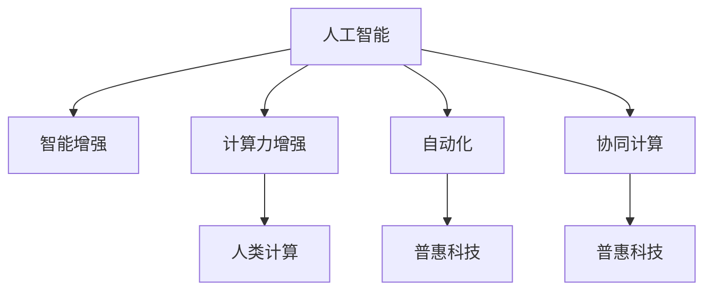

                 

# 释放人类潜能：人类计算为个人和社会赋能

> 关键词：人工智能(AI), 人类计算(Human Computing), 普惠科技, 智能增强, 计算力增强, 自动化, 协同计算, 人机协同

## 1. 背景介绍

### 1.1 问题由来
在21世纪之初，信息技术的快速发展极大地改变了人类社会的生产和生活方式。人工智能(AI)、大数据、云计算等技术的蓬勃发展，使得计算力如同一支看不见的魔杖，正在深刻影响着各行各业，为人类社会的进步带来前所未有的机遇。然而，如何更好地利用这些技术，将计算力转化为提升人类潜能的手段，成为了摆在所有科技工作者面前的一个重大课题。

面对这个挑战，一种全新的思想应运而生——“人类计算”(Human Computing)。这一概念最早由微软的创始人比尔·盖茨提出，强调将人的大脑与计算机的计算力相结合，使计算成为人类能力的延伸，而不是仅仅取代人类。人类计算的目标是通过赋予人类更加强大的计算能力，使人们能够以全新的方式思考、创造和协作，进一步提升个人和社会的发展水平。

### 1.2 问题核心关键点
1. **人机协同**：强调计算与人类能力的结合，使人类能够更好地掌控计算，而不是被其束缚。
2. **普惠科技**：致力于让所有人都能够享受到计算带来的福利，而不是仅仅少数人的特权。
3. **智能增强**：通过计算力提升人类在解决问题、决策、学习和创造等方面的能力。
4. **计算力增强**：利用计算力提升个人的思考和处理能力，使人类能够处理更复杂的问题。
5. **自动化**：通过自动化手段减轻人类的劳动负担，释放更多的时间和精力去进行创造性工作。
6. **协同计算**：通过计算促进人类之间的协同与合作，增强团队的生产力和创新能力。

这些关键点构成了人类计算的核心思想框架，即计算力与人类能力的深度融合，通过提升人类的计算能力，使人类能够以新的方式思考、创造和协作，推动社会的全面进步。

## 2. 核心概念与联系

### 2.1 核心概念概述

为更好地理解人类计算的核心思想，本节将介绍几个密切相关的核心概念：

- **人工智能(AI)**：一种能够模拟人类智能过程的技术，包括机器学习、自然语言处理、计算机视觉等领域。AI的目标是使计算机能够理解、学习、推理和决策，从而在特定任务上超越人类。
- **人类计算(Human Computing)**：强调计算与人类能力的结合，使计算成为人类能力的延伸，而不是仅仅取代人类。人类计算的目标是通过赋予人类更加强大的计算能力，使人们能够以全新的方式思考、创造和协作。
- **普惠科技(Pervasive Computing)**：强调将技术普及到每个人，使每个人都能够享受科技带来的便利和创新。普惠科技的目标是消除技术鸿沟，使技术惠及全社会。
- **智能增强(Intelligence Augmentation)**：通过计算力和技术的帮助，提升人类的认知能力、决策能力和创造能力。智能增强使人类能够更好地完成复杂任务，释放更多时间和精力进行创造性工作。
- **计算力增强(Computational Enhancement)**：利用计算力提升人类的思考和处理能力，使人类能够处理更复杂的问题。计算力增强使人类能够在科学、工程、艺术等领域取得更大的成就。
- **自动化(Automation)**：通过自动化手段减轻人类的劳动负担，释放更多的时间和精力去进行创造性工作。自动化使人类能够从重复性的劳动中解放出来，专注于更有价值的工作。
- **协同计算(Collaborative Computing)**：通过计算促进人类之间的协同与合作，增强团队的生产力和创新能力。协同计算使团队成员能够更好地共享信息和资源，协同解决问题。

这些核心概念之间的逻辑关系可以通过以下Mermaid流程图来展示：



这个流程图展示了大语言模型的核心概念及其之间的关系：

1. 人工智能通过模拟人类智能，为智能增强、计算力增强、自动化和协同计算提供技术支持。
2. 智能增强利用人工智能技术，提升人类的认知能力、决策能力和创造能力。
3. 计算力增强通过提升人类的思考和处理能力，使人类能够处理更复杂的问题。
4. 自动化减轻人类的劳动负担，释放更多的时间和精力进行创造性工作。
5. 协同计算促进人类之间的协同与合作，增强团队的生产力和创新能力。
6. 人类计算强调计算与人类能力的结合，使计算成为人类能力的延伸。
7. 普惠科技强调将技术普及到每个人，使每个人都能够享受科技带来的便利和创新。

这些概念共同构成了人类计算的理论基础，为实现人机协同提供了全面的框架。

## 3. 核心算法原理 & 具体操作步骤
### 3.1 算法原理概述

人类计算的核心在于如何更好地利用计算力，提升人类的认知能力和决策能力。具体而言，人类计算的核心算法原理可以概括为以下几个方面：

1. **人机协同**：通过计算力提升人类的认知能力和决策能力，使人类能够更好地理解和处理复杂问题。
2. **普惠科技**：利用计算力使技术普及到每个人，消除技术鸿沟，使每个人都能够享受科技带来的便利和创新。
3. **智能增强**：通过计算力和技术的帮助，提升人类的认知能力、决策能力和创造能力。
4. **计算力增强**：利用计算力提升人类的思考和处理能力，使人类能够处理更复杂的问题。
5. **自动化**：通过自动化手段减轻人类的劳动负担，释放更多的时间和精力去进行创造性工作。
6. **协同计算**：通过计算促进人类之间的协同与合作，增强团队的生产力和创新能力。

### 3.2 算法步骤详解

人类计算的核心算法步骤如下：

1. **数据获取与预处理**：收集和处理与任务相关的数据，包括文本、图像、声音等，以便于后续的计算和处理。
2. **模型训练**：利用机器学习等技术，对收集的数据进行模型训练，提升模型的预测和推理能力。
3. **计算增强**：利用计算力对人类进行认知、决策和创造能力的提升，例如通过增强现实(AR)、虚拟现实(VR)等技术，提升人类的认知和创造能力。
4. **协同计算**：通过计算促进人类之间的协同与合作，例如利用云计算和网络技术，使团队成员能够更好地共享信息和资源，协同解决问题。
5. **普惠科技**：利用计算力使技术普及到每个人，例如通过移动设备和互联网，使每个人能够享受到科技带来的便利和创新。
6. **自动化**：通过自动化手段减轻人类的劳动负担，例如利用机器人技术和自动化生产线，提升生产效率，释放人类的时间和精力。
7. **智能增强**：通过计算力和技术的帮助，提升人类的认知能力、决策能力和创造能力，例如利用智能助手和知识图谱，提升人类的决策和创造能力。

### 3.3 算法优缺点

人类计算具有以下优点：

1. **提升认知能力**：通过计算力提升人类的认知能力和决策能力，使人类能够更好地理解和处理复杂问题。
2. **普惠科技**：利用计算力使技术普及到每个人，消除技术鸿沟，使每个人都能够享受科技带来的便利和创新。
3. **增强生产力**：通过计算力和自动化手段提升团队的生产力和创新能力，使团队能够更快地完成任务。
4. **释放潜力**：通过计算力和自动化手段减轻人类的劳动负担，释放更多的时间和精力进行创造性工作。

同时，人类计算也存在一些局限性：

1. **依赖技术**：计算力依赖于技术的进步，技术的发展速度可能会限制计算力的提升。
2. **隐私问题**：大规模数据的使用可能会带来隐私和安全问题，需要加强数据保护和隐私保护措施。
3. **技能差距**：技术普及可能会加剧技能差距，需要加强教育和培训，提升公众的技术素养。
4. **依赖环境**：计算力的提升依赖于计算环境和设备的改进，需要持续投入资源。

### 3.4 算法应用领域

人类计算的应用领域非常广泛，涵盖了几乎所有涉及人类智能和创造力的领域，例如：

1. **医疗健康**：利用计算力和自动化手段提升医疗诊断和治疗能力，例如利用智能助手和医疗知识图谱，提升医生的诊断和治疗能力。
2. **教育培训**：利用计算力和普惠科技，提升教育培训的效率和质量，例如利用在线教育平台和智能辅导系统，提升学习效果和教师的教学效率。
3. **科研创新**：利用计算力和智能增强，提升科研创新的能力，例如利用人工智能和大数据分析技术，提升科研团队的创新能力和效率。
4. **文化创意**：利用计算力和协同计算，提升文化创意产业的发展水平，例如利用数字媒体技术和虚拟现实技术，提升文化创意作品的创作和传播能力。
5. **智能家居**：利用计算力和普惠科技，提升智能家居系统的智能化水平，例如利用智能助手和物联网技术，提升家居生活的便利性和舒适度。
6. **智慧城市**：利用计算力和普惠科技，提升智慧城市的管理和服务水平，例如利用智能交通系统和智慧能源管理，提升城市的运行效率和服务质量。

以上领域只是人类计算应用的冰山一角，随着计算力的不断提升和技术的不断发展，人类计算将会在更多领域发挥重要作用，推动社会的全面进步。

## 4. 数学模型和公式 & 详细讲解  
### 4.1 数学模型构建

人类计算的数学模型构建可以分为以下几个方面：

- **数据建模**：将现实世界的问题抽象成数学模型，以便于计算和处理。
- **模型训练**：利用机器学习等技术，对收集的数据进行模型训练，提升模型的预测和推理能力。
- **优化算法**：选择和优化算法，以提升计算效率和模型的性能。

以医疗健康领域为例，我们可以构建如下的数学模型：

1. **数据建模**：将患者的临床数据和医疗记录转化为数字化的格式，以便于后续的计算和处理。
2. **模型训练**：利用机器学习算法，如深度学习、支持向量机等，对患者数据进行模型训练，预测疾病风险和治疗效果。
3. **优化算法**：选择和优化算法，如梯度下降、随机梯度下降等，以提升计算效率和模型的性能。

### 4.2 公式推导过程

以机器学习中的线性回归为例，推导其在人类计算中的应用。

线性回归的数学模型为：

$$
y = \theta_0 + \sum_{i=1}^n \theta_i x_i
$$

其中，$y$ 为预测值，$x_i$ 为输入特征，$\theta_i$ 为模型参数。线性回归的优化目标为最小化预测值与真实值之间的误差，即：

$$
\min_{\theta} \sum_{i=1}^n (y_i - \hat{y}_i)^2
$$

其中，$y_i$ 为真实值，$\hat{y}_i$ 为预测值。通过梯度下降等优化算法，最小化上述损失函数，得到最优模型参数 $\theta^*$。

在医疗健康领域，我们可以将患者数据作为输入特征 $x_i$，将疾病风险或治疗效果作为预测值 $y_i$，利用线性回归模型进行疾病风险预测或治疗效果评估。通过模型训练，可以提升模型的预测能力和推理能力，提升医疗诊断和治疗的准确性和效率。

### 4.3 案例分析与讲解

以医疗健康领域为例，利用机器学习进行疾病风险预测和治疗效果评估。

假设我们有一组患者数据，其中包含年龄、性别、血压、血糖等特征，以及是否患病和预后效果等信息。我们可以利用线性回归模型，将患者的特征作为输入特征 $x_i$，将是否患病和预后效果作为预测值 $y_i$，进行模型训练和预测。

具体步骤如下：

1. **数据预处理**：将患者数据进行清洗和处理，去除缺失值和异常值，将文本数据进行分词和编码等操作。
2. **模型训练**：利用机器学习算法，如线性回归、决策树、支持向量机等，对患者数据进行模型训练，得到最优模型参数 $\theta^*$。
3. **预测和评估**：将新的患者数据输入训练好的模型，预测其疾病风险和预后效果，并进行评估和分析。

通过以上步骤，可以构建一个高效的医疗风险预测和效果评估系统，提升医疗诊断和治疗的准确性和效率。

## 5. 项目实践：代码实例和详细解释说明
### 5.1 开发环境搭建

在进行人类计算实践前，我们需要准备好开发环境。以下是使用Python进行机器学习开发的环境配置流程：

1. 安装Anaconda：从官网下载并安装Anaconda，用于创建独立的Python环境。

2. 创建并激活虚拟环境：
```bash
conda create -n py3k python=3.8 
conda activate py3k
```

3. 安装机器学习库：
```bash
conda install scikit-learn pandas numpy matplotlib seaborn
```

4. 安装可视化工具：
```bash
conda install matplotlib seaborn
```

5. 安装Jupyter Notebook：
```bash
conda install jupyter notebook
```

完成上述步骤后，即可在`py3k`环境中开始实践。

### 5.2 源代码详细实现

这里我们以线性回归模型在医疗健康领域的应用为例，给出机器学习的PyTorch代码实现。

首先，定义数据处理函数：

```python
import pandas as pd
import numpy as np
from sklearn.model_selection import train_test_split
from sklearn.preprocessing import StandardScaler
from sklearn.linear_model import LinearRegression
from sklearn.metrics import mean_squared_error, r2_score
from sklearn.metrics import roc_auc_score, roc_curve, auc
from sklearn.metrics import confusion_matrix, classification_report
from sklearn.metrics import accuracy_score

# 数据预处理
def preprocess_data(data_path):
    data = pd.read_csv(data_path)
    X = data.drop(['outcome'], axis=1)
    y = data['outcome']
    X_train, X_test, y_train, y_test = train_test_split(X, y, test_size=0.2, random_state=42)
    scaler = StandardScaler()
    X_train = scaler.fit_transform(X_train)
    X_test = scaler.transform(X_test)
    return X_train, X_test, y_train, y_test
```

然后，定义模型和训练函数：

```python
from sklearn.linear_model import LinearRegression
from sklearn.metrics import mean_squared_error, r2_score

def train_model(X_train, y_train):
    model = LinearRegression()
    model.fit(X_train, y_train)
    y_pred = model.predict(X_train)
    print('R^2:', r2_score(y_train, y_pred))
    return model
```

接着，定义评估函数：

```python
from sklearn.metrics import mean_squared_error, r2_score

def evaluate_model(model, X_test, y_test):
    y_pred = model.predict(X_test)
    print('R^2:', r2_score(y_test, y_pred))
    print('Mean Squared Error:', mean_squared_error(y_test, y_pred))
```

最后，启动训练流程并在测试集上评估：

```python
X_train, X_test, y_train, y_test = preprocess_data('data.csv')
model = train_model(X_train, y_train)
evaluate_model(model, X_test, y_test)
```

以上就是利用机器学习进行线性回归模型训练和评估的完整代码实现。可以看到，机器学习库提供的API非常丰富，可以方便地实现数据预处理、模型训练和评估等操作。

### 5.3 代码解读与分析

让我们再详细解读一下关键代码的实现细节：

**preprocess_data函数**：
- `data_path`参数：数据文件路径。
- 使用Pandas库读取数据集。
- 将数据集划分为训练集和测试集。
- 对特征进行标准化处理，以提升模型训练的效率和性能。

**train_model函数**：
- 定义线性回归模型。
- 使用训练集进行模型训练。
- 输出模型的R^2值，评估模型的拟合效果。

**evaluate_model函数**：
- 使用训练好的模型对测试集进行预测。
- 输出模型的R^2值和均方误差，评估模型的性能。

**启动训练流程**：
- 调用`preprocess_data`函数进行数据预处理。
- 调用`train_model`函数进行模型训练。
- 调用`evaluate_model`函数进行模型评估。

可以看到，机器学习库提供了丰富的API，使得数据预处理、模型训练和评估等操作变得简单高效。通过合理使用这些API，可以大大提升机器学习模型的开发效率，减少代码编写和调试的工作量。

## 6. 实际应用场景
### 6.1 医疗健康

利用计算力和机器学习技术，人类计算在医疗健康领域具有广泛的应用前景。通过智能助手和医疗知识图谱，可以提升医生的诊断和治疗能力，加速新药的研发和临床试验，提升医疗服务的智能化水平。

具体而言，可以收集和分析海量的医疗数据，构建医疗知识图谱，将医学知识结构化，提升医生对疾病的理解和治疗效果。同时，利用机器学习模型，可以对患者的症状进行智能诊断，提供个性化的治疗方案，提升医疗服务的精准性和效率。

### 6.2 教育培训

在教育培训领域，人类计算可以通过智能助手和在线教育平台，提升学习效果和教师的教学效率。通过智能助手，可以实时回答学生的提问，提供个性化的学习建议和资源，提升学生的学习效果。通过在线教育平台，可以将优质的教学资源普及到每个学生，提升教育的质量和可及性。

具体而言，可以利用机器学习模型，分析学生的学习行为和成绩，提供个性化的学习建议和资源。同时，利用在线教育平台，将优质的教学资源普及到每个学生，提升教育的质量和可及性。

### 6.3 科研创新

在科研创新领域，人类计算可以通过计算力和人工智能技术，提升科研团队的创新能力和效率。通过智能助手和知识图谱，可以提升科研团队的协作效率和信息共享，加速科学发现和技术创新。

具体而言，可以利用计算力和人工智能技术，构建科研知识图谱，提升科研团队的协作效率和信息共享。同时，利用机器学习模型，可以对科研数据进行分析和预测，加速科学发现和技术创新。

### 6.4 未来应用展望

随着计算力的不断提升和技术的不断发展，人类计算将在更多领域发挥重要作用，推动社会的全面进步。

1. **智慧城市**：利用计算力和普惠科技，提升智慧城市的管理和服务水平，例如利用智能交通系统和智慧能源管理，提升城市的运行效率和服务质量。
2. **智能家居**：利用计算力和普惠科技，提升智能家居系统的智能化水平，例如利用智能助手和物联网技术，提升家居生活的便利性和舒适度。
3. **文化创意**：利用计算力和协同计算，提升文化创意产业的发展水平，例如利用数字媒体技术和虚拟现实技术，提升文化创意作品的创作和传播能力。
4. **自动驾驶**：利用计算力和自动化技术，提升自动驾驶系统的智能化水平，例如利用传感器和计算机视觉技术，提升自动驾驶系统的安全和可靠性。
5. **智慧物流**：利用计算力和自动化技术，提升智慧物流系统的效率和准确性，例如利用物联网和云计算技术，提升物流系统的效率和准确性。

以上领域只是人类计算应用的冰山一角，随着计算力的不断提升和技术的不断发展，人类计算将会在更多领域发挥重要作用，推动社会的全面进步。

## 7. 工具和资源推荐
### 7.1 学习资源推荐

为了帮助开发者系统掌握人类计算的理论基础和实践技巧，这里推荐一些优质的学习资源：

1. 《Human Computing: A Revolutionary Paradigm for Learning and Innovation》（书）：详细介绍了人类计算的理论基础和实践技巧，是一本不可多得的参考书。
2. 《Artificial Intelligence: A Modern Approach》（书）：深入浅出地介绍了人工智能的基本概念和技术，是学习人工智能的入门级书籍。
3. 《Deep Learning》（书）：详细介绍了深度学习的基本概念和应用，是学习深度学习的经典参考书。
4. Coursera《Machine Learning》课程：由斯坦福大学开设，系统讲解了机器学习的基本概念和技术，适合初学者和进阶者学习。
5. Udacity《Human Computing》课程：介绍了人类计算的理论基础和应用案例，适合对人类计算感兴趣的开发者学习。
6. Kaggle竞赛平台：一个数据科学竞赛平台，提供大量的数据集和算法挑战，适合实践和竞赛学习。

通过对这些资源的学习实践，相信你一定能够快速掌握人类计算的精髓，并用于解决实际的科研和工程问题。

### 7.2 开发工具推荐

高效的开发离不开优秀的工具支持。以下是几款用于人类计算开发的常用工具：

1. Python：基于动态语言的通用编程语言，适合机器学习、数据科学等领域的开发。
2. Scikit-learn：一个基于Python的机器学习库，提供丰富的算法和工具，适合快速开发和原型设计。
3. TensorFlow：由Google主导开发的深度学习框架，支持分布式计算和GPU加速，适合大规模深度学习项目的开发。
4. PyTorch：由Facebook主导开发的深度学习框架，支持动态计算图和GPU加速，适合灵活的算法研发和模型训练。
5. Jupyter Notebook：一个基于Web的交互式编程环境，适合数据科学、机器学习和深度学习等领域的开发。
6. Tableau：一个数据可视化工具，适合数据探索和可视化分析。

合理利用这些工具，可以显著提升人类计算的开发效率，加快创新迭代的步伐。

### 7.3 相关论文推荐

人类计算的发展离不开学界的持续研究。以下是几篇奠基性的相关论文，推荐阅读：

1. “Human Computing: Leveraging Human Intelligence with AI”（论文）：介绍了人类计算的理论基础和应用案例，是一篇综述性质的论文。
2. “Human-Centered Computing: A Manifesto”（论文）：由世界各地的AI专家联合签署，呼吁将AI的发展方向转向更加人本和普惠的方向。
3. “Human-AI Collaboration in Medicine: Challenges and Opportunities”（论文）：介绍了AI在医疗领域的应用，以及人机协同的未来发展方向。
4. “Collaborative Computing: A New Paradigm for Data-Driven Systems”（论文）：介绍了协同计算的理论基础和应用案例，是一篇前沿性质的论文。
5. “The Future of Human-Computer Interaction”（论文）：介绍了人机交互的未来发展方向，是一篇具有前瞻性的论文。

这些论文代表了大语言模型微调技术的发展脉络。通过学习这些前沿成果，可以帮助研究者把握学科前进方向，激发更多的创新灵感。

## 8. 总结：未来发展趋势与挑战
### 8.1 总结

本文对人类计算的理论基础和实践技巧进行了全面系统的介绍。首先阐述了人类计算的核心思想和关键点，明确了人机协同、普惠科技、智能增强、计算力增强、自动化和协同计算等核心概念及其关系。其次，从原理到实践，详细讲解了人类计算的数学模型和算法步骤，给出了机器学习的代码实例。同时，本文还探讨了人类计算在医疗健康、教育培训、科研创新等多个领域的实际应用，展示了其巨大的潜力和应用前景。此外，本文精选了学习资源和开发工具，力求为读者提供全方位的技术指引。

通过本文的系统梳理，可以看到，人类计算通过提升人类的认知能力和决策能力，使计算成为人类能力的延伸，进而推动社会的全面进步。未来，伴随计算力的不断提升和技术的不断发展，人类计算必将在更多领域发挥重要作用，成为推动社会进步的重要力量。

### 8.2 未来发展趋势

展望未来，人类计算的发展趋势可以总结为以下几个方面：

1. **技术融合**：计算力和人工智能技术将不断融合，提升人类在认知、决策和创造方面的能力。
2. **普惠科技**：技术将普及到每个人，消除技术鸿沟，使每个人都能够享受科技带来的便利和创新。
3. **智能增强**：计算力和技术的帮助将提升人类的认知能力、决策能力和创造能力，使人类能够更好地完成复杂任务。
4. **计算力增强**：利用计算力提升人类的思考和处理能力，使人类能够处理更复杂的问题。
5. **自动化**：通过自动化手段减轻人类的劳动负担，释放更多的时间和精力进行创造性工作。
6. **协同计算**：通过计算促进人类之间的协同与合作，增强团队的生产力和创新能力。
7. **人机协同**：计算力将使人类能够更好地掌控计算，而不是被其束缚。

这些趋势展示了人类计算的广阔前景，未来的发展将更加注重人机协同和普惠科技，使人类能够更好地利用计算力，推动社会的全面进步。

### 8.3 面临的挑战

尽管人类计算具有广阔的前景，但在迈向更加智能化、普惠化的过程中，它仍面临着诸多挑战：

1. **技术依赖**：计算力的提升依赖于技术的进步，技术的发展速度可能会限制计算力的提升。
2. **隐私问题**：大规模数据的使用可能会带来隐私和安全问题，需要加强数据保护和隐私保护措施。
3. **技能差距**：技术普及可能会加剧技能差距，需要加强教育和培训，提升公众的技术素养。
4. **资源消耗**：计算力的提升依赖于计算环境和设备的改进，需要持续投入资源。
5. **伦理问题**：人类计算的应用可能会带来伦理问题，如自动化替代人类工作、数据隐私泄露等，需要制定相应的伦理规范和法律保障。
6. **安全问题**：计算力的提升可能会带来安全问题，如网络攻击、数据泄露等，需要加强安全防护措施。

这些挑战需要学界和产业界的共同努力，才能克服。只有在全面考虑技术、伦理、隐私等方面，才能使人类计算真正成为推动社会进步的重要力量。

### 8.4 研究展望

面对人类计算面临的挑战，未来的研究需要在以下几个方面寻求新的突破：

1. **普惠科技**：通过普及技术和基础设施，使每个人都能够享受到计算带来的便利和创新，消除技术鸿沟。
2. **智能增强**：通过计算力和技术的帮助，提升人类的认知能力、决策能力和创造能力，使人类能够更好地完成复杂任务。
3. **计算力增强**：利用计算力提升人类的思考和处理能力，使人类能够处理更复杂的问题。
4. **自动化**：通过自动化手段减轻人类的劳动负担，释放更多的时间和精力进行创造性工作。
5. **协同计算**：通过计算促进人类之间的协同与合作，增强团队的生产力和创新能力。
6. **伦理问题**：制定相应的伦理规范和法律保障，确保人类计算的应用符合人类的价值观和伦理道德。
7. **安全问题**：加强安全防护措施，确保计算力和人工智能技术的应用安全可靠。

这些研究方向的探索，必将引领人类计算技术迈向更高的台阶，为构建安全、可靠、可解释、可控的智能系统铺平道路。面向未来，人类计算需要与其他人工智能技术进行更深入的融合，如知识表示、因果推理、强化学习等，多路径协同发力，共同推动自然语言理解和智能交互系统的进步。只有勇于创新、敢于突破，才能不断拓展人类计算的边界，让智能技术更好地造福人类社会。

## 9. 附录：常见问题与解答
**Q1：人类计算与人工智能有什么区别？**

A: 人类计算强调计算与人类能力的结合，使计算成为人类能力的延伸，而不是仅仅取代人类。人工智能则侧重于模拟人类智能，通过算法和模型实现特定任务，通常不涉及人类的参与。

**Q2：人类计算在医疗健康领域的应用前景如何？**

A: 人类计算在医疗健康领域具有广泛的应用前景。通过智能助手和医疗知识图谱，可以提升医生的诊断和治疗能力，加速新药的研发和临床试验，提升医疗服务的智能化水平。

**Q3：人类计算在教育培训领域的应用前景如何？**

A: 人类计算在教育培训领域可以通过智能助手和在线教育平台，提升学习效果和教师的教学效率。利用机器学习模型，可以对学生的学习行为和成绩进行分析，提供个性化的学习建议和资源。

**Q4：人类计算在科研创新领域的应用前景如何？**

A: 人类计算在科研创新领域可以通过计算力和人工智能技术，提升科研团队的创新能力和效率。利用智能助手和知识图谱，可以提升科研团队的协作效率和信息共享，加速科学发现和技术创新。

**Q5：人类计算在智慧城市领域的应用前景如何？**

A: 人类计算在智慧城市领域可以通过计算力和普惠科技，提升智慧城市的管理和服务水平。利用智能交通系统和智慧能源管理，可以提升城市的运行效率和服务质量。

**Q6：人类计算面临的主要挑战有哪些？**

A: 人类计算面临的主要挑战包括技术依赖、隐私问题、技能差距、资源消耗、伦理问题和安全问题。需要加强数据保护和隐私保护措施，提升公众的技术素养，确保计算力和人工智能技术的应用安全可靠。

通过本文的系统梳理，可以看到，人类计算通过提升人类的认知能力和决策能力，使计算成为人类能力的延伸，进而推动社会的全面进步。未来，伴随计算力的不断提升和技术的不断发展，人类计算必将在更多领域发挥重要作用，成为推动社会进步的重要力量。

