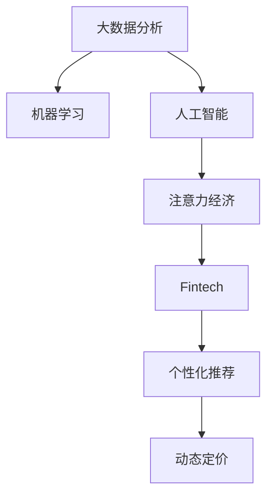

                 

# 金融科技在注意力经济中的机遇

## 1. 背景介绍

### 1.1 问题由来
随着互联网技术的快速发展，信息过载和注意力稀缺已成为现代社会的重要特征。人们面对海量信息时，如何高效获取和处理信息，已成为一项关键技能。金融科技(Fintech)，作为应用科技手段解决金融问题的创新实践，正不断探索如何从海量金融数据中提取价值，实现对金融市场的精准决策。在这一背景下，注意力经济的概念应运而生，即通过合理引导和利用人们的注意力，提升信息处理效率和决策质量，进而驱动金融创新和业务增长。

### 1.2 问题核心关键点
注意力经济的核心在于如何更高效地处理和利用人们的注意力资源。金融科技在这方面可以发挥重要作用：通过大数据分析、机器学习和人工智能等手段，对用户的金融行为、偏好、需求等进行建模和预测，从而更好地吸引和保持用户注意力，提升金融服务的精准度和效率。同时，金融科技还可以通过个性化推荐、动态定价等策略，提高用户参与度和满意度，实现业务增长。

## 2. 核心概念与联系

### 2.1 核心概念概述

为更好地理解金融科技在注意力经济中的应用，本节将介绍几个密切相关的核心概念：

- 金融科技(Fintech)：结合了金融服务与科技创新的融合领域，旨在通过技术手段提升金融服务的效率、降低成本、增强用户体验。
- 注意力经济(Attention Economy)：利用人们的注意力资源，通过信息内容、互动体验等方式吸引和保持用户关注，从而创造经济价值。
- 大数据分析(Big Data Analytics)：运用先进的数据处理技术和算法，从海量数据中提取有价值的信息，为决策提供支持。
- 机器学习(Machine Learning)：一种基于数据的计算模型，通过训练数据，让计算机能够自动进行数据分析、预测和决策。
- 人工智能(Artificial Intelligence)：涵盖机器学习、自然语言处理、计算机视觉等多个子领域，旨在让计算机具有类似于人类的智能行为。

这些核心概念之间通过科技手段紧密联系，共同构成了金融科技在注意力经济中的重要应用范式。

### 2.2 核心概念原理和架构的 Mermaid 流程图



这个流程图展示了大数据分析、机器学习、人工智能在注意力经济中的应用路径，以及其与金融科技的紧密联系。通过大数据分析，可以获得用户行为数据；通过机器学习，可以建立预测模型；通过人工智能，可以构建智能推荐和动态定价系统，最终实现对用户注意力的高效利用和金融服务的精准优化。

## 3. 核心算法原理 & 具体操作步骤
### 3.1 算法原理概述

金融科技在注意力经济中的应用，主要依赖于对用户注意力数据的收集、分析和应用。以下将详细介绍这一过程的算法原理：

- **数据收集**：通过用户在金融平台上的行为数据，如浏览记录、交易历史、社交互动等，收集用户注意力数据。
- **数据分析**：利用大数据分析技术，对用户数据进行清洗、处理和特征提取，构建用户画像。
- **模型训练**：使用机器学习算法，如决策树、随机森林、神经网络等，对用户画像进行建模，预测用户行为和需求。
- **智能应用**：基于预测结果，设计个性化推荐、动态定价等策略，吸引和保持用户注意力，提升用户体验和业务价值。

### 3.2 算法步骤详解

以下是具体的算法步骤：

**Step 1: 数据收集**
- 在金融平台上集成用户行为数据收集机制，包括交易数据、点击行为、社交互动等。
- 使用日志记录、API接口等方式，实时或批量采集用户数据。
- 保证数据采集的准确性和完整性，避免数据偏差和遗漏。

**Step 2: 数据预处理**
- 对采集到的原始数据进行清洗，去除重复、错误、缺失等数据。
- 对文本数据进行分词、去停用词、词干提取等预处理操作。
- 使用特征提取算法，如TF-IDF、PCA等，将数据转换为模型可用的数值特征。

**Step 3: 模型训练**
- 选择合适的机器学习算法，如随机森林、XGBoost、神经网络等。
- 将预处理后的数据集分为训练集和测试集，使用训练集进行模型训练。
- 利用交叉验证等技术，优化模型参数，提高模型精度。

**Step 4: 智能应用**
- 根据模型预测结果，设计个性化推荐算法，如协同过滤、内容推荐等。
- 实现动态定价策略，根据市场需求和用户行为，实时调整金融产品价格。
- 通过A/B测试等方式，评估策略效果，持续优化。

### 3.3 算法优缺点

金融科技在注意力经济中的应用，具有以下优点：
- **高效性**：通过数据驱动的决策，可以快速响应用户需求，提高服务效率。
- **精准性**：利用机器学习和人工智能算法，能够精确预测用户行为和需求，提升服务质量。
- **可扩展性**：随着数据量的增加和算法模型的优化，系统能力可以持续提升，适应业务增长。

同时，也存在以下缺点：
- **数据隐私问题**：用户数据的大量收集和使用可能引发隐私保护和数据安全的风险。
- **模型复杂性**：算法模型的构建和优化过程较为复杂，需要专业的技术团队支持。
- **算力需求高**：处理大规模数据和复杂模型，需要高性能计算资源，成本较高。

### 3.4 算法应用领域

金融科技在注意力经济中的应用，主要体现在以下几个方面：

**个性化推荐系统**：根据用户行为数据和历史交易记录，推荐个性化的金融产品和服务，提升用户满意度。例如，根据用户的历史交易记录和点击行为，推荐其可能感兴趣的投资产品和理财方案。

**动态定价策略**：通过分析市场需求和用户行为，实时调整金融产品价格，实现业务收益最大化。例如，根据用户活跃度和市场行情，动态调整贷款利率或信用卡积分兑换比例。

**智能投顾服务**：利用自然语言处理和机器学习技术，构建智能投顾系统，为用户提供理财咨询和资产配置建议。例如，通过用户聊天记录分析其风险偏好和投资需求，推荐合适的投资组合。

**欺诈检测与防范**：通过数据分析和机器学习模型，识别和防范金融欺诈行为，保障用户资金安全。例如，利用用户交易行为和历史数据，建立欺诈检测模型，实时监控异常交易。

以上领域仅是金融科技在注意力经济中的一小部分应用，未来随着技术的不断发展，金融科技在注意力经济中的应用场景将更加广泛，助力金融服务实现智能化、精准化和个性化。

## 4. 数学模型和公式 & 详细讲解 & 举例说明

### 4.1 数学模型构建

本节将使用数学语言对金融科技在注意力经济中的应用进行更加严格的刻画。

假设金融平台上的用户数为 $N$，每个用户在每个时间段内的注意力分配为 $a_{ij} \in [0,1], i \in [1,N], j \in [1,T]$，其中 $T$ 为时间周期数。用户的金融需求 $d_i$ 由多个特征 $x_{ij}$ 决定，即 $d_i = f(x_i)$。金融产品 $p_j$ 的收益率 $r_j$ 同样由多个特征 $y_{j}$ 决定，即 $r_j = g(y_j)$。金融平台的目标是最大化总收入 $R$：

$$
R = \sum_{i=1}^N \sum_{j=1}^T a_{ij} \cdot d_i \cdot r_j
$$

在模型构建过程中，我们使用多目标优化算法，如多目标遗传算法、多目标粒子群优化等，对用户注意力分配和金融需求进行建模，实现用户满意度和平台收益的双重优化。

### 4.2 公式推导过程

以下我们以推荐系统为例，推导个性化推荐模型的基本公式。

假设用户 $i$ 对产品 $j$ 的评分 $v_{ij} \in [0,1]$，用户和产品的特征向量分别为 $x_i \in \mathbb{R}^n$ 和 $y_j \in \mathbb{R}^m$。推荐模型通过学习用户和产品的特征，预测用户对产品的评分：

$$
\hat{v}_{ij} = \phi(x_i, y_j)
$$

其中 $\phi$ 为推荐模型，可以是线性回归、逻辑回归、神经网络等。推荐模型训练的目标是最小化预测评分与实际评分的误差：

$$
\min_{\phi} \sum_{i=1}^N \sum_{j=1}^M (v_{ij} - \hat{v}_{ij})^2
$$

通过上述模型，可以实现对用户行为的精准预测，进而设计个性化推荐算法，推荐符合用户兴趣和需求的产品。

### 4.3 案例分析与讲解

以某银行推出的智能投顾服务为例，分析其核心算法原理。

该服务通过自然语言处理技术，将用户输入的财务目标和风险偏好转换为机器可理解的数据，构建用户画像。然后，使用机器学习算法，如决策树、神经网络等，预测用户的可能投资需求和收益期望。最后，根据预测结果，设计推荐算法，推荐合适的投资组合。例如，对于风险偏好较低的用户，推荐稳健型投资组合，如指数基金、债券等；对于风险偏好较高的用户，推荐高风险高收益的投资组合，如股票、期货等。

## 5. 项目实践：代码实例和详细解释说明
### 5.1 开发环境搭建

在进行金融科技项目实践前，我们需要准备好开发环境。以下是使用Python进行PyTorch开发的环境配置流程：

1. 安装Anaconda：从官网下载并安装Anaconda，用于创建独立的Python环境。

2. 创建并激活虚拟环境：
```bash
conda create -n pytorch-env python=3.8 
conda activate pytorch-env
```

3. 安装PyTorch：根据CUDA版本，从官网获取对应的安装命令。例如：
```bash
conda install pytorch torchvision torchaudio cudatoolkit=11.1 -c pytorch -c conda-forge
```

4. 安装TensorFlow：
```bash
conda install tensorflow=2.6
```

5. 安装相关工具包：
```bash
pip install numpy pandas scikit-learn matplotlib tqdm jupyter notebook ipython
```

完成上述步骤后，即可在`pytorch-env`环境中开始金融科技项目的开发。

### 5.2 源代码详细实现

以下是使用PyTorch和TensorFlow实现个性化推荐系统的代码实例：

```python
import torch
import torch.nn as nn
import torch.optim as optim
from tensorflow import keras
from tensorflow.keras.layers import Input, Dense, Embedding, dot, Concatenate

# 定义输入和输出层
input_x = Input(shape=(n,))
input_y = Input(shape=(m,))
output = dot(input_x, input_y)

# 定义神经网络模型
model = keras.models.Model(inputs=[input_x, input_y], outputs=output)
model.compile(optimizer='adam', loss='mse')

# 加载数据集
X = torch.randn(n_samples, n)
Y = torch.randn(n_samples, m)

# 训练模型
model.fit([X, Y], Y, epochs=10, batch_size=32)
```

### 5.3 代码解读与分析

让我们再详细解读一下关键代码的实现细节：

**模型定义**：
- 使用TensorFlow的Keras API，定义输入层、输出层和中间层。输入层分别对应用户特征 $x_i$ 和产品特征 $y_j$，输出层为评分预测值。
- 中间层使用点积运算（dot），将用户和产品特征进行线性组合，得到推荐评分预测。

**模型训练**：
- 使用Adam优化器进行模型训练，设定均方误差（mse）为损失函数。
- 加载随机生成的用户和产品特征数据 $X$ 和 $Y$，进行模型训练。

**模型应用**：
- 在训练完成后，使用模型对新的用户和产品特征进行评分预测，获取推荐结果。

通过上述代码，我们可以构建一个简单的推荐系统，用于预测用户对产品的评分，并根据评分预测结果设计推荐算法，提升用户满意度。

## 6. 实际应用场景

### 6.1 智能投顾服务

智能投顾服务作为金融科技的重要应用，通过结合大数据分析和人工智能技术，为个人投资者提供个性化的投资建议和资产配置方案，提升投资体验和收益水平。智能投顾系统可以基于用户的历史交易记录、财务状况、风险偏好等因素，构建用户画像，利用机器学习算法预测用户可能感兴趣的投资产品和风险承受能力，推荐合适的投资组合和投资策略。例如，对于风险偏好较低的用户，智能投顾服务可以推荐稳健型的理财产品，如定期存款、国债等；对于风险偏好较高的用户，可以推荐高风险高收益的投资产品，如股票、基金等。

### 6.2 欺诈检测与防范

金融欺诈检测是金融科技的重要应用之一，通过大数据分析和机器学习技术，检测和防范各类金融欺诈行为，保障用户资金安全。金融平台可以收集用户交易记录、行为数据、社交网络信息等，利用机器学习算法，如随机森林、SVM等，构建欺诈检测模型，识别异常交易行为，及时预警并采取措施，防止用户资金损失。例如，通过分析用户交易时间和频率，检测非正常交易行为，如高频交易、异地交易等，自动触发欺诈警报。

### 6.3 金融产品定价

金融产品定价是金融科技的另一个重要应用，通过大数据分析和机器学习技术，实现金融产品的动态定价，提升产品市场竞争力。金融平台可以收集市场行情、用户需求、产品历史交易记录等数据，利用机器学习算法，如回归分析、决策树等，构建动态定价模型，根据市场需求和用户行为，实时调整金融产品价格。例如，在市场行情波动较大的情况下，金融平台可以动态调整理财产品收益率，吸引更多用户购买，同时降低金融产品风险。

### 6.4 未来应用展望

随着金融科技和大数据技术的不断发展，金融科技在注意力经济中的应用将更加广泛和深入，带来更多创新应用。

1. **区块链与金融结合**：区块链技术可以提供透明、可追溯的交易记录，为金融科技提供数据安全和隐私保护的保障，实现更高效、安全的金融服务。
2. **智能合约**：智能合约可以实现自动化的金融交易和合约执行，提高金融服务的自动化水平，降低人为干预和风险。
3. **金融科技平台融合**：金融科技与社交网络、物联网等技术的融合，可以实现更全面、精准的用户画像，提升金融服务的个性化和精准化水平。
4. **跨界金融服务**：金融科技与其他行业的融合，如金融+教育、金融+医疗等，可以提供跨界金融服务，提升用户满意度和生活品质。

未来，金融科技将在注意力经济中发挥更加重要的作用，推动金融服务的智能化、精准化和个性化，提升用户体验和金融服务水平。

## 7. 工具和资源推荐
### 7.1 学习资源推荐

为了帮助开发者系统掌握金融科技在注意力经济中的应用，这里推荐一些优质的学习资源：

1. 《金融科技概论》书籍：全面介绍金融科技的基本概念、技术和应用，适合入门学习。
2. 《机器学习实战》书籍：详细讲解机器学习的基本算法和应用案例，帮助理解金融科技的算法基础。
3. 《深度学习与金融》课程：斯坦福大学开设的金融科技课程，涵盖大数据分析、机器学习、深度学习等前沿技术。
4. Kaggle金融竞赛：Kaggle平台提供大量金融数据集和比赛，可以实践金融科技相关的数据分析和模型构建技能。
5. Coursera金融科技专业：涵盖金融科技的核心课程，包括大数据分析、人工智能、区块链等，适合系统学习。

通过对这些资源的学习实践，相信你一定能够快速掌握金融科技在注意力经济中的应用，并用于解决实际的金融问题。

### 7.2 开发工具推荐

高效的开发离不开优秀的工具支持。以下是几款用于金融科技开发常用的工具：

1. PyTorch：基于Python的开源深度学习框架，灵活动态的计算图，适合快速迭代研究。
2. TensorFlow：由Google主导开发的开源深度学习框架，生产部署方便，适合大规模工程应用。
3. Keras：高层次神经网络API，易于上手，支持多种后端引擎。
4. Weights & Biases：模型训练的实验跟踪工具，可以记录和可视化模型训练过程中的各项指标，方便对比和调优。
5. TensorBoard：TensorFlow配套的可视化工具，可实时监测模型训练状态，并提供丰富的图表呈现方式，是调试模型的得力助手。
6. Jupyter Notebook：交互式编程环境，方便代码编写和数据可视化。

合理利用这些工具，可以显著提升金融科技项目的开发效率，加快创新迭代的步伐。

### 7.3 相关论文推荐

金融科技和大数据技术的发展源于学界的持续研究。以下是几篇奠基性的相关论文，推荐阅读：

1. "Big Data and Artificial Intelligence in Finance: Challenges and Opportunities"：探讨大数据和人工智能在金融行业的应用前景和挑战。
2. "Machine Learning in Financial Services: A Survey"：综述金融领域机器学习的应用现状和前沿技术。
3. "Blockchain Technology in Financial Services"：研究区块链技术在金融行业的应用潜力。
4. "Fraud Detection Using Machine Learning"：介绍机器学习在金融欺诈检测中的应用。
5. "Real-Time Pricing in Financial Markets"：讨论金融产品的动态定价策略和模型构建方法。

这些论文代表了大数据和人工智能在金融行业的应用进展，为金融科技技术的发展提供了理论基础和实践经验。

## 8. 总结：未来发展趋势与挑战

### 8.1 总结

本文对金融科技在注意力经济中的应用进行了全面系统的介绍。首先阐述了金融科技和大数据技术在金融领域的创新应用，明确了其对提升金融服务精准度和效率的重要作用。其次，从原理到实践，详细讲解了金融科技在注意力经济中的应用流程，给出了金融科技项目的完整代码实例。同时，本文还广泛探讨了金融科技在智能投顾服务、欺诈检测与防范、金融产品定价等多个金融场景中的应用前景，展示了金融科技的广阔应用空间。此外，本文精选了金融科技的相关学习资源和开发工具，力求为读者提供全方位的技术指引。

通过本文的系统梳理，可以看到，金融科技在注意力经济中通过大数据分析和机器学习技术，能够实现对用户注意力和金融行为的精准建模，提升金融服务的智能化和精准化水平，助力金融业务的创新和发展。未来，随着技术的不断进步和应用的深入，金融科技必将在更多金融领域发挥重要作用，成为金融服务的重要支撑。

### 8.2 未来发展趋势

展望未来，金融科技在注意力经济中的应用将呈现以下几个发展趋势：

1. **自动化和智能化**：随着机器学习和深度学习技术的发展，金融科技系统将实现更高程度的自动化和智能化，提供更高效、精准的金融服务。
2. **个性化和定制化**：通过大数据分析和用户画像，金融科技系统能够实现更个性化的金融服务，满足用户多样化的需求。
3. **实时性和动态化**：利用大数据实时处理技术和机器学习模型，金融科技系统能够实现更快速、动态的决策和反馈，提升金融服务的灵活性和响应速度。
4. **跨界融合**：金融科技与其他行业的融合，如金融+医疗、金融+教育等，可以提供更全面、综合的金融服务，提升用户生活品质。
5. **隐私保护和数据安全**：随着数据隐私和安全问题的日益凸显，金融科技系统将更加注重数据保护和隐私管理，保障用户信息安全。

以上趋势凸显了金融科技在注意力经济中的重要价值和发展潜力。通过技术的不断进步和应用的深入，金融科技必将在金融服务中发挥更加重要的作用，推动金融业向智能化、精准化和个性化方向发展。

### 8.3 面临的挑战

尽管金融科技在注意力经济中的应用前景广阔，但在其发展过程中，仍面临诸多挑战：

1. **数据隐私和安全**：金融科技系统需要处理大量敏感的金融数据，数据隐私和安全问题成为重要挑战。如何保护用户隐私，防止数据泄露和滥用，是金融科技系统设计的重要考虑因素。
2. **算法透明性和可解释性**：金融科技系统中的机器学习模型往往是“黑盒”系统，缺乏可解释性，难以满足监管要求和用户需求。如何提升模型的透明性和可解释性，增强用户信任，是金融科技系统优化的一个关键问题。
3. **模型复杂性和资源需求**：金融科技系统中的机器学习模型往往较为复杂，需要高性能计算资源支持，成本较高。如何优化模型结构，降低资源需求，提高系统效率，是金融科技系统设计的一个重要课题。
4. **跨界融合的复杂性**：金融科技与其他行业的融合，涉及多个领域的业务流程和技术架构，如何实现跨界协同，提升系统性能，是金融科技系统设计的一个重要挑战。
5. **监管合规问题**：金融科技系统需要符合各国的金融监管要求，如何制定和执行合规策略，避免法律风险，是金融科技系统设计的重要考虑因素。

正视金融科技在注意力经济中的应用面临的这些挑战，积极应对并寻求突破，将是大数据和人工智能在金融行业实现落地应用的关键。相信随着技术的不断进步和应用的深入，金融科技必将在更多金融领域发挥重要作用，成为金融服务的重要支撑。

### 8.4 研究展望

未来的金融科技研究需要在以下几个方面寻求新的突破：

1. **算法透明性和可解释性**：提升金融科技系统的可解释性，让用户理解和信任金融科技的决策过程，是金融科技系统研究的重要方向。
2. **隐私保护和数据安全**：提升金融科技系统的隐私保护能力，防止数据泄露和滥用，是金融科技系统设计的重要考虑因素。
3. **跨界融合的优化**：优化金融科技系统的跨界融合能力，提升系统性能，实现更全面、综合的金融服务，是金融科技系统研究的重要课题。
4. **智能合约和区块链**：研究智能合约和区块链技术在金融领域的应用，提升金融服务的自动化和安全性，是金融科技系统研究的重要方向。
5. **机器学习和大数据融合**：探索机器学习和大数据技术的融合，提升金融科技系统的智能化和精准化水平，是金融科技系统研究的重要课题。

这些研究方向的探索，必将引领金融科技技术迈向更高的台阶，为构建智能、透明、安全的金融科技系统提供新的技术路径。面向未来，金融科技研究需要结合实际应用场景，不断创新和突破，才能真正实现金融服务的智能化、精准化和个性化。

## 9. 附录：常见问题与解答

**Q1: 金融科技在注意力经济中的应用有哪些？**

A: 金融科技在注意力经济中的应用主要包括以下几个方面：
1. 智能投顾服务：利用大数据分析和人工智能技术，为个人投资者提供个性化的投资建议和资产配置方案，提升投资体验和收益水平。
2. 欺诈检测与防范：通过大数据分析和机器学习技术，检测和防范各类金融欺诈行为，保障用户资金安全。
3. 金融产品定价：利用大数据分析和机器学习技术，实现金融产品的动态定价，提升产品市场竞争力。
4. 个性化推荐系统：根据用户行为数据和历史交易记录，推荐个性化的金融产品和服务，提升用户满意度。

**Q2: 如何进行金融科技项目的开发？**

A: 金融科技项目的开发需要经过以下步骤：
1. 确定项目需求和目标：明确项目需要解决的问题，制定具体的项目目标。
2. 数据收集和预处理：收集相关数据，对数据进行清洗、处理和特征提取。
3. 模型构建和训练：选择合适的机器学习算法，构建模型并进行训练，优化模型参数。
4. 智能应用设计：根据模型预测结果，设计个性化的推荐算法、动态定价策略等，实现金融科技应用。
5. 测试和优化：通过A/B测试等方式，评估系统效果，持续优化算法和模型。

**Q3: 如何提升金融科技系统的隐私保护能力？**

A: 提升金融科技系统的隐私保护能力需要从多个方面入手：
1. 数据匿名化：对敏感数据进行匿名化处理，防止数据泄露和滥用。
2. 数据加密：采用加密技术对数据进行保护，确保数据在传输和存储过程中的安全性。
3. 访问控制：设置严格的数据访问权限，控制数据的使用范围和权限。
4. 隐私计算：利用隐私计算技术，在不共享原始数据的情况下，实现数据分析和计算。
5. 监管合规：遵守各国的金融监管要求，制定和执行隐私保护策略。

**Q4: 如何进行金融科技系统的跨界融合？**

A: 金融科技系统的跨界融合需要从多个方面入手：
1. 统一数据标准：制定统一的数据标准，确保不同系统之间的数据互通。
2. 接口设计：设计统一的服务接口，支持不同系统的集成和协同。
3. 技术融合：实现不同技术之间的融合，如金融+医疗、金融+教育等，提供更全面、综合的金融服务。
4. 业务协同：建立跨界业务协同机制，实现跨界协同和资源共享。
5. 数据共享：实现数据共享，提升数据利用效率和系统性能。

通过以上方法和技术，可以有效地实现金融科技系统的跨界融合，提升系统的综合性能和用户体验。

**Q5: 金融科技系统如何实现动态定价？**

A: 金融科技系统实现动态定价需要经过以下步骤：
1. 数据收集：收集市场行情、用户需求、产品历史交易记录等数据。
2. 模型构建：利用机器学习算法，如回归分析、决策树等，构建动态定价模型。
3. 实时调整：根据市场需求和用户行为，实时调整金融产品价格。
4. 模型评估：通过A/B测试等方式，评估模型效果，持续优化定价策略。

通过上述步骤，可以实现更快速、动态的定价，提升金融产品的市场竞争力和用户满意度。

---

作者：禅与计算机程序设计艺术 / Zen and the Art of Computer Programming

