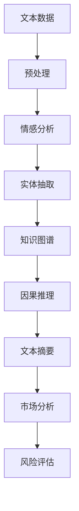

                 

# 金融领域的NLP应用：市场分析与风险评估

## 1. 背景介绍

随着金融市场的快速发展和复杂化，传统的分析方法已经难以满足需求。自然语言处理（NLP）技术通过对金融文本的深入挖掘，提供了丰富的新工具。利用NLP技术进行市场分析与风险评估，不仅可以加速信息处理，还能辅助决策者理解海量新闻、公告、报告等文本数据，预测市场走势，发现风险点。

## 2. 核心概念与联系

### 2.1 核心概念概述

- **自然语言处理（NLP）**：涉及文本分析、信息提取、情感分析、实体识别等技术，帮助计算机理解、处理自然语言数据。
- **情感分析**：通过文本分类、情感词典、情感模型等方法，识别文本情感倾向。
- **事件抽取**：从文本中自动提取关键事件，如盈利预测、股票分裂、并购等，帮助理解市场动态。
- **知识图谱**：构建实体、关系和属性的关系网，用于知识整合和推理。
- **因果推理**：识别事件之间的因果关系，辅助风险评估。
- **文本摘要**：从长篇报告中提取出关键信息，供快速浏览。

### 2.2 核心概念原理和架构的 Mermaid 流程图(Mermaid 流程节点中不要有括号、逗号等特殊字符)



## 3. 核心算法原理 & 具体操作步骤
### 3.1 算法原理概述

金融领域的NLP应用主要基于文本数据的分析、处理和理解，包括情感分析、事件抽取、知识图谱构建和因果推理等技术。其核心在于通过文本挖掘和数据分析，辅助决策者进行市场预测和风险评估。

### 3.2 算法步骤详解

**步骤1：数据收集与预处理**
收集金融领域的文本数据，包括新闻、报告、公告、社交媒体评论等。预处理包括文本清洗、分词、去除停用词、词性标注等。

**步骤2：情感分析**
利用情感词典、情感分类器等工具，对文本情感进行分类，判断其是正面、负面还是中性。结合时间序列模型，预测情感变化趋势。

**步骤3：事件抽取**
通过命名实体识别、关系抽取等技术，从文本中自动提取关键事件，如盈利预测、股票分裂、并购等。利用文本关系网络，分析事件间的因果关系。

**步骤4：知识图谱构建**
结合实体识别和关系抽取结果，构建金融领域知识图谱。图谱用于知识整合、关系推理、实体链接等任务，辅助决策。

**步骤5：因果推理**
识别文本中事件间的因果关系，构建因果图谱。利用因果推理算法，评估不同事件对市场的影响，辅助风险评估。

**步骤6：文本摘要**
对长篇报告进行文本摘要，提取关键信息。结合知识图谱，提供丰富的背景信息支持。

**步骤7：市场分析与风险评估**
结合情感分析、事件抽取、知识图谱、因果推理和文本摘要结果，进行市场分析和风险评估。生成报告和可视化结果，辅助决策。

### 3.3 算法优缺点

**优点**：
- 快速处理海量金融文本数据，加速信息挖掘。
- 结合多源数据，提供丰富的市场信息和风险评估。
- 支持动态更新，实时反映市场变化。

**缺点**：
- 数据质量影响分析结果。低质量、噪音数据可能导致误判。
- 模型复杂，需要大量计算资源。
- 结果可解释性不足，模型"黑盒"特性难以被理解。

### 3.4 算法应用领域

基于NLP的金融分析广泛应用于金融市场预测、投资策略制定、风险评估、客户服务等多个领域。以下是几个典型应用场景：

**市场预测**：分析新闻、公告、分析师评论等文本数据，预测股市走势。

**投资策略制定**：结合事件抽取、因果推理等技术，优化投资组合。

**风险评估**：识别潜在风险事件，预测其对市场的影响，辅助决策。

**客户服务**：通过问答机器人，实时解答客户咨询，提升服务质量。

## 4. 数学模型和公式 & 详细讲解 & 举例说明

### 4.1 数学模型构建

- **情感分类模型**：使用LSTM、BERT等模型，通过情感词典或深度学习模型对文本情感进行分类。
- **事件抽取模型**：利用CRF、RNN等模型，从文本中提取命名实体和关系。
- **知识图谱构建**：采用图神经网络等方法，构建金融领域的知识图谱。
- **因果推理模型**：利用图神经网络、因果图等技术，分析事件间的因果关系。
- **文本摘要模型**：利用Transformer等模型，生成文本摘要。

### 4.2 公式推导过程

**情感分类公式**：
$$
y = \sigma(W*x + b)
$$
其中，$y$表示情感分类结果，$x$为文本特征向量，$W$和$b$为模型参数。

**事件抽取公式**：
$$
P(E_i) = \prod_{j=1}^n P(I_j|I_{j-1}, I_{j-2})
$$
其中，$E_i$为事件，$I_j$为实体，$P(E_i)$为事件发生的概率。

**知识图谱构建公式**：
$$
G = \{V, E\}
$$
其中，$V$为节点集，$E$为边集。

**因果推理公式**：
$$
P(Y|X) = \frac{P(Y|X, G)}{P(Y|G)}
$$
其中，$Y$为结果，$X$为原因，$G$为因果图谱。

**文本摘要公式**：
$$
\hat{X} = \text{SENet}(X)
$$
其中，$\hat{X}$为摘要，$X$为原文本，SENet为摘要生成网络。

### 4.3 案例分析与讲解

以一个简单的案例来说明NLP在金融分析中的应用：
- **数据收集**：收集最近一年的股市新闻和分析师评论。
- **预处理**：去除停用词，进行词性标注。
- **情感分析**：使用情感词典，将新闻评论分为正面、负面和中性。
- **事件抽取**：识别新闻中的公司名称、产品名称、市场变化等实体。
- **知识图谱构建**：将实体和关系构建为知识图谱。
- **因果推理**：分析事件间的因果关系，预测其对股价的影响。
- **文本摘要**：生成每条新闻的摘要，提取关键信息。
- **市场分析**：结合情感、事件、知识图谱、因果推理和摘要，分析市场走势。

## 5. 项目实践：代码实例和详细解释说明

### 5.1 开发环境搭建

- 安装Python 3.8及以上版本。
- 安装TensorFlow、PyTorch、NLTK等库。
- 安装金融数据集，如Yahoo Finance、Google Finance等。

### 5.2 源代码详细实现

以下是一个简单的情感分析代码实现，利用BERT模型对文本进行情感分类：

```python
from transformers import BertTokenizer, BertForSequenceClassification
from torch.utils.data import Dataset, DataLoader
from torch import nn
import torch

class FinNewsDataset(Dataset):
    def __init__(self, texts, labels):
        self.tokenizer = BertTokenizer.from_pretrained('bert-base-uncased')
        self.texts = texts
        self.labels = labels
        
    def __len__(self):
        return len(self.texts)
    
    def __getitem__(self, item):
        text = self.texts[item]
        label = self.labels[item]
        
        encoding = self.tokenizer(text, truncation=True, max_length=128)
        input_ids = torch.tensor(encoding['input_ids'])
        attention_mask = torch.tensor(encoding['attention_mask'])
        return {'input_ids': input_ids, 'attention_mask': attention_mask, 'labels': label}

model = BertForSequenceClassification.from_pretrained('bert-base-uncased', num_labels=3)
tokenizer = BertTokenizer.from_pretrained('bert-base-uncased')

train_dataset = FinNewsDataset(train_texts, train_labels)
dev_dataset = FinNewsDataset(dev_texts, dev_labels)
test_dataset = FinNewsDataset(test_texts, test_labels)

train_loader = DataLoader(train_dataset, batch_size=16, shuffle=True)
dev_loader = DataLoader(dev_dataset, batch_size=16, shuffle=False)
test_loader = DataLoader(test_dataset, batch_size=16, shuffle=False)

criterion = nn.CrossEntropyLoss()
optimizer = AdamW(model.parameters(), lr=1e-5)

def train_epoch(model, data_loader, optimizer, criterion):
    model.train()
    total_loss = 0
    for batch in data_loader:
        input_ids = batch['input_ids'].to(device)
        attention_mask = batch['attention_mask'].to(device)
        labels = batch['labels'].to(device)
        
        optimizer.zero_grad()
        outputs = model(input_ids, attention_mask=attention_mask)
        loss = criterion(outputs.logits, labels)
        loss.backward()
        optimizer.step()
        total_loss += loss.item()
        
    return total_loss / len(data_loader)

def evaluate(model, data_loader, criterion):
    model.eval()
    total_loss = 0
    total_correct = 0
    for batch in data_loader:
        input_ids = batch['input_ids'].to(device)
        attention_mask = batch['attention_mask'].to(device)
        labels = batch['labels'].to(device)
        
        with torch.no_grad():
            outputs = model(input_ids, attention_mask=attention_mask)
            loss = criterion(outputs.logits, labels)
            total_loss += loss.item()
            total_correct += (outputs.logits.argmax(dim=1) == labels).sum().item()
        
    return total_loss / len(data_loader), total_correct / len(data_loader.dataset)

for epoch in range(10):
    train_loss = train_epoch(model, train_loader, optimizer, criterion)
    dev_loss, dev_acc = evaluate(model, dev_loader, criterion)
    test_loss, test_acc = evaluate(model, test_loader, criterion)
    
    print(f'Epoch {epoch+1}, train loss: {train_loss:.4f}, dev loss: {dev_loss:.4f}, dev acc: {dev_acc:.4f}, test loss: {test_loss:.4f}, test acc: {test_acc:.4f}')
```

### 5.3 代码解读与分析

**FinNewsDataset类**：
- `__init__`方法：初始化分词器、文本和标签。
- `__len__`方法：返回数据集的样本数量。
- `__getitem__`方法：对单个样本进行处理，返回模型所需的输入和标签。

**模型定义**：
- 使用`BertForSequenceClassification`类定义情感分类模型，加载预训练的BERT模型。
- 定义损失函数和优化器。

**训练和评估函数**：
- `train_epoch`函数：进行一个epoch的训练，返回平均损失。
- `evaluate`函数：对数据集进行评估，返回平均损失和准确率。

**训练流程**：
- 设置总的epoch数和batch size，开始循环迭代。
- 每个epoch内，先在训练集上训练，输出平均损失。
- 在验证集和测试集上评估，输出平均损失和准确率。

## 6. 实际应用场景

### 6.1 市场预测

NLP技术可以分析新闻、公告、分析师评论等文本数据，预测市场走势。如使用情感分析识别市场情绪，利用事件抽取识别关键事件，通过因果推理评估事件影响，生成综合的市场分析报告。

### 6.2 投资策略制定

结合情感分析、事件抽取和因果推理，优化投资组合。例如，识别市场利好事件，建议买入相关股票；识别市场利空事件，建议卖出相关股票。

### 6.3 风险评估

利用NLP技术识别潜在风险事件，评估其对市场的影响。例如，识别宏观经济政策变化、公司财务危机等事件，预测其对股价的影响。

### 6.4 未来应用展望

未来，基于NLP的市场分析和风险评估将更加精准和智能。伴随技术进步，模型将支持更多多模态数据，融合更多知识来源，支持动态更新和自适应调整，提供更全面的市场分析和风险评估。

## 7. 工具和资源推荐

### 7.1 学习资源推荐

1. **《NLP for Finance》课程**：由Coursera提供，介绍金融领域NLP应用的入门知识。
2. **Kaggle Finance Data**：包含多个金融领域的数据集，用于实践NLP应用。
3. **IEEE Xplore**：搜索金融领域的学术论文，了解最新研究成果。

### 7.2 开发工具推荐

1. **Jupyter Notebook**：用于编写和运行Python代码，支持可视化输出。
2. **TensorBoard**：可视化训练过程和模型性能，辅助调优。
3. **Scikit-learn**：用于数据预处理、特征工程等任务。

### 7.3 相关论文推荐

1. **"FinBERT: A Pretrained Contextualized Embedding for Finance"**：介绍FinBERT模型，在金融领域应用预训练BERT模型。
2. **"EventExtraction: A Deep Learning Framework for Automated Event Extraction"**：利用深度学习技术，从文本中自动提取事件。
3. **"EventCausality: Identifying and Linking Financial Market Events"**：识别金融市场事件间的因果关系，评估其影响。

## 8. 总结：未来发展趋势与挑战

### 8.1 总结

本文系统介绍了NLP在金融领域的应用，涵盖情感分析、事件抽取、知识图谱构建、因果推理和文本摘要等技术。通过实际案例和代码实现，展示了NLP在金融分析中的广泛应用。

### 8.2 未来发展趋势

1. **模型复杂性降低**：随着模型优化和算法进步，未来模型的复杂度将逐步降低，提高部署效率。
2. **多模态融合**：NLP与图像、音频等多模态数据结合，提升市场分析的全面性。
3. **实时更新**：伴随技术进步，模型将支持动态更新，实时反映市场变化。
4. **智能决策支持**：结合NLP与机器学习，提供智能化的决策支持。
5. **普及化应用**：NLP技术将逐步普及，应用于更多金融场景，提升服务质量。

### 8.3 面临的挑战

1. **数据质量问题**：低质量、噪音数据可能导致误判，影响分析结果。
2. **计算资源需求**：模型复杂度高，计算资源需求大，需优化算法和模型结构。
3. **模型可解释性不足**：模型"黑盒"特性难以被理解，缺乏透明性。
4. **跨领域融合**：与其他金融技术结合，如机器学习、量化分析等，形成更全面的应用。

### 8.4 研究展望

未来，NLP在金融领域的应用将更加广泛和深入。重点研究方向包括：
1. **提升数据质量**：优化数据收集和清洗流程，提高数据质量。
2. **降低计算资源需求**：优化模型结构和算法，降低计算需求。
3. **增强可解释性**：开发可解释性强的模型，提供透明、可理解的分析结果。
4. **多模态融合**：结合多源数据，提升市场分析的全面性。
5. **实时更新**：实现动态更新，实时反映市场变化。

## 9. 附录：常见问题与解答

**Q1：NLP在金融分析中面临哪些挑战？**

A: 数据质量、计算资源、模型可解释性不足等问题。

**Q2：如何优化NLP模型的计算资源需求？**

A: 优化模型结构和算法，减少计算资源消耗。

**Q3：NLP模型的可解释性不足，如何解决？**

A: 开发可解释性强的模型，提供透明、可理解的分析结果。

**Q4：NLP在金融分析中的应用前景如何？**

A: 前景广阔，结合多模态数据和智能决策支持，提升市场分析和风险评估的准确性和智能性。

---

作者：禅与计算机程序设计艺术 / Zen and the Art of Computer Programming

