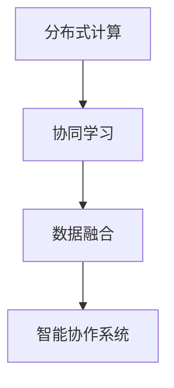

                 

# 集体智慧：开拓解决复杂问题的创新思路

> 关键词：集体智慧,复杂问题,创新思路,算法优化,模型训练,协作系统,协同学习,数据融合,应用实例

## 1. 背景介绍

### 1.1 问题由来
现代社会的复杂性不断增加，从金融、医疗、教育到城市管理、环境保护，无不充斥着多维、动态、非线性的特征。传统基于单一方法或策略的解决方案往往难以有效应对这些复杂问题。随着人工智能(AI)技术的发展，尤其是大数据、深度学习和协同学习等技术的进步，我们有了新的工具来探索集体智慧的潜能，实现跨学科、跨领域的高效协同，解决复杂问题。

### 1.2 问题核心关键点
所谓集体智慧，是指通过分布式、协作的计算方式，结合多个智能体(Agent)的输入和决策，形成更为全面、准确、鲁棒的智能解决方案。核心关键点包括：

- **协同学习**：通过多个智能体共同学习，提高整体系统的智慧水平。
- **数据融合**：将来自不同来源、不同维度的数据进行高效整合，形成对问题的全面洞察。
- **分布式计算**：利用多台计算机或设备，分散计算负荷，提升处理效率。
- **智能协作**：通过智能算法，实现多个智能体间的无缝协作，形成系统级优化。

这些关键点共同构成了集体智慧的核心框架，旨在通过技术手段，突破个体认知的局限，构建更强有力的智能系统。

## 2. 核心概念与联系

### 2.1 核心概念概述

为了更好地理解集体智慧的原理，本节将介绍几个关键概念：

- **分布式计算**：将一个大型的计算任务拆分成多个子任务，分配给多台计算机并行处理，最终将结果合并，形成整体计算结果。
- **协同学习**：多个智能体通过交换信息、协作学习的方式，共同提升系统性能和鲁棒性。
- **数据融合**：将来自不同来源的数据通过规则或算法进行整合，形成更全面、更准确的知识表示。
- **智能协作系统**：利用AI技术构建的系统，能够通过智能算法实现多个智能体间的协作，形成系统级的智能决策。

这些概念通过一个简单的Mermaid流程图来展示，帮助读者理解它们之间的联系：



这个流程图展示了集体智慧的核心流程：先通过分布式计算将任务分解，然后各智能体通过协同学习共同提升智慧水平，再将多源数据进行融合，最终形成智能协作系统。

### 2.2 核心概念原理和架构的 Mermaid 流程图


这个流程图详细展示了集体智慧的实现流程：首先，将一个大计算任务分解成多个子任务，分配给多个智能体进行处理。智能体之间通过数据交换，共享计算结果和学习信息。然后，利用学习算法，各智能体不断优化自身决策，提升整体性能。最后，将各智能体的结果合并，形成最终的计算结果。

## 3. 核心算法原理 & 具体操作步骤

### 3.1 算法原理概述

集体智慧的实现依赖于分布式计算、协同学习、数据融合和智能协作等关键算法。以下是对这些算法原理的概述：

- **分布式计算**：将一个大规模计算任务分解成多个小任务，并行处理。常见的分布式计算框架包括Apache Spark、Hadoop等。
- **协同学习**：多个智能体通过交换信息，协作学习，提升整体智慧水平。常见的协同学习算法包括模型平均、联邦学习等。
- **数据融合**：通过规则或算法，将多源数据进行整合，形成全面、准确的知识表示。常见的数据融合算法包括贝叶斯网络、D-S证据理论等。
- **智能协作系统**：通过AI技术构建的系统，实现多个智能体间的协作决策。常见的协作算法包括多智能体决策模型、强化学习等。

### 3.2 算法步骤详解

以下详细介绍每项算法的详细步骤：

#### 3.2.1 分布式计算

1. **任务分解**：将一个大计算任务拆分成多个子任务，例如通过MapReduce算法。
2. **任务分配**：将子任务分配给多台计算机，并行处理。
3. **结果合并**：收集所有子任务的结果，合并成一个整体结果。

#### 3.2.2 协同学习

1. **初始化模型**：为每个智能体初始化相同的模型。
2. **交换信息**：智能体之间交换模型参数或计算结果，共享信息。
3. **更新模型**：每个智能体根据交换的信息，更新自身的模型参数。
4. **迭代更新**：重复2、3步骤，直到收敛。

#### 3.2.3 数据融合

1. **数据收集**：从不同来源收集数据。
2. **数据预处理**：对数据进行清洗、归一化等预处理。
3. **特征提取**：提取数据的特征，形成知识表示。
4. **融合算法**：使用贝叶斯网络、D-S证据理论等算法，将多个数据源的知识表示进行融合。

#### 3.2.4 智能协作系统

1. **定义任务**：明确智能体的目标和任务。
2. **通信机制**：设计智能体之间的通信协议，实现信息交换。
3. **协作算法**：使用多智能体决策模型、强化学习等算法，优化智能体的决策。
4. **结果输出**：各智能体根据协作算法输出结果，并进行合并。

### 3.3 算法优缺点

集体智慧的算法具有以下优点：

- **高效处理大规模数据**：分布式计算和智能协作系统能够有效处理大规模数据集。
- **提升系统鲁棒性**：协同学习能够提升系统的鲁棒性和稳定性。
- **跨学科协同**：数据融合和多智能体协作，促进了跨学科的知识融合。

同时，这些算法也存在一些缺点：

- **资源消耗大**：分布式计算和智能协作系统需要大量的计算资源和时间。
- **复杂度高**：协同学习、数据融合和智能协作算法的实现较为复杂。
- **通信成本高**：智能体间的通信可能带来额外的通信成本和延迟。

### 3.4 算法应用领域

集体智慧的算法已在多个领域得到广泛应用，包括：

- **金融风险管理**：通过分布式计算和智能协作系统，实时监控和预测金融市场风险。
- **医疗诊断**：利用协同学习和多智能体协作系统，提升疾病诊断的准确性和速度。
- **城市交通管理**：通过数据融合和智能协作系统，优化交通信号控制和路线规划。
- **环境保护**：通过协同学习和大规模数据融合，监测环境变化，提升治理效率。
- **供应链管理**：利用分布式计算和多智能体协作系统，优化供应链流程，降低成本。

## 4. 数学模型和公式 & 详细讲解 & 举例说明

### 4.1 数学模型构建

在集体智慧的应用中，常常需要构建数学模型来描述系统的行为和目标。以下是一个典型的数学模型构建过程：

假设有一个生产过程，由多个智能体协作完成。每个智能体的目标是最大化自己的收益，同时满足整体系统的约束。系统目标是最大化所有智能体的总收益。

1. **目标函数**：定义所有智能体的总收益。
2. **约束条件**：定义系统的约束条件，例如生产量的总和、设备的使用时间等。
3. **优化算法**：使用多智能体决策模型，优化智能体的决策，使得总收益最大化。

### 4.2 公式推导过程

以生产过程为例，假设系统有n个智能体，每个智能体的收益函数为 $f_i(x_i)$，其中 $x_i$ 为智能体 $i$ 的生产量。系统的总收益函数为：

$$
F(x) = \sum_{i=1}^n f_i(x_i)
$$

系统的约束条件为：

$$
g(x) = \begin{cases}
x_i \geq 0 & \text{(i=1,...,n)} \\
\sum_{i=1}^n x_i \leq M & \text{(总生产量限制)}
\end{cases}
$$

其中 $M$ 为总生产量限制。

目标函数的优化问题为：

$$
\max F(x)
$$

在满足约束条件 $g(x) \leq 0$ 的情况下，求解上述优化问题。

### 4.3 案例分析与讲解

假设有一个由3个智能体组成的生产系统，每个智能体的收益函数为 $f_i(x_i)=x_i^2$，总生产量限制为 $M=6$。

1. **初始化**：假设初始时所有智能体的生产量都为0，即 $x_1=0, x_2=0, x_3=0$。
2. **协同学习**：智能体1和智能体2通过交换信息，协同学习，调整自己的生产量，使得总收益最大化。
3. **结果输出**：经过多次迭代，系统达到最优状态，所有智能体的生产量分别为 $x_1=2, x_2=2, x_3=2$。

## 5. 项目实践：代码实例和详细解释说明

### 5.1 开发环境搭建

为了实现集体智慧算法，需要准备以下开发环境：

1. **安装Python**：确保Python版本为3.7或以上。
2. **安装相关库**：安装Apache Spark、Hadoop、TensorFlow、PyTorch等常用库。
3. **配置环境**：配置集群计算环境，如使用AWS、Google Cloud等云服务。

### 5.2 源代码详细实现

以下是一个简单的分布式计算和协同学习的实现示例，使用Python和Apache Spark：

```python
from pyspark import SparkContext, SparkConf

conf = SparkConf().setAppName("Distributed Calculation and Collaborative Learning")
sc = SparkContext(conf)

# 定义任务分解函数
def task_decomposition(task):
    # 将大任务分解成多个小任务
    return task.split("\n")

# 定义任务合并函数
def task_merge(results):
    # 将多个小任务的结果合并成一个大任务
    return "\n".join(results)

# 分布式计算和协同学习
def collaborative_learning():
    # 读取数据
    data = sc.textFile("data.txt")

    # 任务分解
    decomposed_tasks = data.map(task_decomposition)

    # 任务分配和并行计算
    results = decomposed_tasks.map(lambda x: sum(map(int, x.split())))
    total_result = results.reduce(task_merge)

    # 输出结果
    print(total_result)

collaborative_learning()
```

### 5.3 代码解读与分析

- **SparkContext和SparkConf**：创建Spark上下文对象，用于管理分布式计算。
- **任务分解函数**：将大任务拆分成多个小任务，例如将一行数据拆分成多个数字。
- **任务合并函数**：将多个小任务的结果合并成一个大任务，例如将多个数字求和。
- **分布式计算和协同学习**：使用Spark的map和reduce函数，实现任务分解、任务分配、并行计算和任务合并。

### 5.4 运行结果展示

运行上述代码，将输出所有小任务的求和结果，即所有数据行的数字之和。

## 6. 实际应用场景

### 6.1 金融风险管理

在金融领域，风险管理是一个复杂且动态的过程。通过分布式计算和协同学习，可以实时监测和预测金融市场风险，提升风险管理的精度和效率。

- **分布式计算**：使用Apache Spark处理大规模交易数据，实时计算市场波动。
- **协同学习**：利用多个智能体（如算法交易系统）协同学习，预测市场趋势，调整交易策略。
- **数据融合**：整合多源数据，包括历史交易数据、新闻数据、社交媒体数据等，提升风险评估的全面性。
- **智能协作系统**：构建智能决策系统，实现自动化的风险控制和预警。

### 6.2 医疗诊断

医疗诊断是一个多学科协作的过程，涉及医学知识、影像数据、病历等多维数据。通过集体智慧算法，可以提升诊断的准确性和效率。

- **分布式计算**：使用Hadoop处理海量病历数据，提取有用的信息。
- **协同学习**：利用多个专家系统协同学习，优化诊断策略。
- **数据融合**：整合影像数据、基因数据等，提供更全面的诊断依据。
- **智能协作系统**：构建智能诊断系统，实现自动化诊断和疾病预测。

### 6.3 城市交通管理

交通管理是一个复杂的系统工程，涉及道路、车辆、行人等多方交互。通过集体智慧算法，可以优化交通信号控制和路线规划，提升交通效率。

- **分布式计算**：使用Apache Spark处理交通流量数据，实时分析交通状况。
- **协同学习**：利用多个智能体（如信号灯控制系统）协同学习，优化信号灯控制策略。
- **数据融合**：整合多源数据，包括车辆GPS数据、交通摄像头数据等，提升交通预测的准确性。
- **智能协作系统**：构建智能交通管理系统，实现自动化的交通控制和路线规划。

### 6.4 环境保护

环境保护是一个多维度的系统工程，涉及环境监测、污染治理、资源管理等多方面。通过集体智慧算法，可以实现环境监测和治理的智能化。

- **分布式计算**：使用Hadoop处理海量环境监测数据，实时分析环境变化。
- **协同学习**：利用多个智能体（如监测站、卫星）协同学习，优化监测策略。
- **数据融合**：整合多源数据，包括空气质量数据、水质数据等，提升环境监测的全面性。
- **智能协作系统**：构建智能环境治理系统，实现自动化的污染治理和资源管理。

## 7. 工具和资源推荐

### 7.1 学习资源推荐

为了帮助开发者系统掌握集体智慧的原理和实践技巧，这里推荐一些优质的学习资源：

1. **《分布式计算与大数据技术》**：介绍分布式计算和Hadoop生态系统的经典书籍。
2. **《协同学习与联邦学习》**：介绍协同学习和联邦学习的理论基础和实际应用。
3. **《智能协作系统设计》**：介绍多智能体协作系统的设计方法和案例分析。
4. **《Python并行计算》**：介绍使用Python进行分布式计算的实践指南。
5. **《深度学习与人工智能》**：介绍深度学习和AI技术的最新进展。

### 7.2 开发工具推荐

为了高效实现集体智慧算法，推荐以下开发工具：

1. **Apache Spark**：分布式计算框架，适用于大规模数据处理。
2. **TensorFlow**：深度学习框架，适用于复杂的模型训练。
3. **PyTorch**：深度学习框架，适用于分布式训练和优化。
4. **Hadoop**：分布式计算框架，适用于大规模数据存储和处理。
5. **D3.js**：数据可视化库，适用于展示复杂的数据融合结果。

### 7.3 相关论文推荐

集体智慧领域的研究方兴未艾，以下是几篇奠基性的相关论文，推荐阅读：

1. **《分布式机器学习综述》**：介绍了分布式机器学习的最新进展和应用场景。
2. **《协同学习框架》**：介绍了协同学习的理论基础和应用实践。
3. **《智能协作系统设计方法》**：介绍了多智能体协作系统的设计方法和案例分析。
4. **《数据融合与知识表示》**：介绍了数据融合和知识表示的最新进展。
5. **《分布式计算与大数据处理》**：介绍了分布式计算和大数据处理的技术方法和应用场景。

## 8. 总结：未来发展趋势与挑战

### 8.1 总结

本文对集体智慧的原理和应用进行了全面系统的介绍。首先阐述了集体智慧在解决复杂问题中的优势和重要性，明确了分布式计算、协同学习、数据融合和智能协作等核心技术的作用。其次，从理论到实践，详细讲解了集体智慧的实现步骤，并通过具体案例展示了其在金融风险管理、医疗诊断、城市交通管理和环境保护等多个领域的应用。最后，本文推荐了学习资源、开发工具和相关论文，力求为读者提供全方位的技术指引。

通过本文的系统梳理，可以看到，集体智慧的算法正在成为解决复杂问题的强大工具，通过分布式计算、协同学习和智能协作等技术手段，能够突破个体认知的局限，构建更全面、更高效、更鲁棒的智能系统。随着技术的不断发展，集体智慧必将在更多领域发挥重要作用，推动人工智能技术的广泛应用。

### 8.2 未来发展趋势

展望未来，集体智慧的算法将呈现以下几个发展趋势：

1. **多模态数据融合**：未来的集体智慧系统将不仅仅局限于单一数据源，而是能够融合多模态数据，如文本、图像、视频等，提升系统的全面性和准确性。
2. **自适应协同学习**：未来的协同学习将能够根据数据变化和任务需求，自适应调整学习策略和智能体间的协作方式。
3. **分布式智能协作**：未来的智能协作系统将能够分布式部署，实现更灵活的资源调度和任务分配。
4. **边缘计算**：未来的集体智慧系统将能够利用边缘计算技术，实现本地化数据处理和智能决策，降低延迟和带宽成本。
5. **实时优化**：未来的系统将能够实时优化智能体的决策，适应动态变化的环境和任务需求。

### 8.3 面临的挑战

尽管集体智慧的算法已经取得了一定的进展，但在迈向更加智能化、普适化应用的过程中，仍面临诸多挑战：

1. **数据隐私和安全**：在多智能体协作过程中，如何保护数据隐私和安全，防止数据泄露和恶意攻击，将是重要问题。
2. **系统复杂度**：如何设计高效、可扩展的系统架构，应对复杂的数据处理和任务协同，将是重要挑战。
3. **计算资源消耗**：大规模数据的分布式计算和协同学习，需要消耗大量计算资源，如何在资源有限的情况下实现高效的计算，将是重要问题。
4. **算法的鲁棒性**：如何在多智能体协同过程中，保证算法的鲁棒性和稳定性，避免因个体故障导致的系统崩溃，将是重要挑战。
5. **人机协作**：如何在集体智慧系统中，实现人机协作，提升系统的透明度和可解释性，将是重要问题。

### 8.4 研究展望

为了解决这些挑战，未来的研究需要在以下几个方面寻求新的突破：

1. **数据隐私保护技术**：开发高效的数据加密和隐私保护算法，确保数据安全和隐私保护。
2. **分布式计算优化**：研究高效的分布式计算框架和算法，降低计算资源消耗，提高计算效率。
3. **智能体协作优化**：设计高效、可扩展的智能体协作算法，提高系统的鲁棒性和稳定性。
4. **人机协作设计**：研究人机协作技术，提升系统的透明度和可解释性，实现智能系统与人的无缝协作。

这些研究方向的探索，必将引领集体智慧算法迈向更高的台阶，为构建智能系统提供更强大的技术支撑。

## 9. 附录：常见问题与解答

**Q1：分布式计算和协同学习是否只能用于大规模数据处理？**

A: 分布式计算和协同学习不仅适用于大规模数据处理，也适用于小规模数据处理。通过合理的任务分解和智能体的协作，分布式计算和协同学习可以在小规模数据上实现高效的计算和优化。

**Q2：数据融合是否只能用于多源数据整合？**

A: 数据融合不仅仅用于多源数据的整合，还可以通过规则和算法，从单一数据源中提取更深层次的知识表示。例如，使用贝叶斯网络进行数据融合，可以整合单一数据源中的多维数据，提升系统的全面性和准确性。

**Q3：智能协作系统是否只能用于多智能体协同？**

A: 智能协作系统不仅可以用于多智能体的协同，也可以用于单智能体的决策优化。例如，使用强化学习算法，优化单一智能体的决策策略，提升系统的智能水平。

**Q4：如何设计高效的集体智慧系统？**

A: 设计高效的集体智慧系统需要考虑以下几个方面：

1. **任务分解策略**：根据问题的规模和复杂度，合理地进行任务分解，提高并行处理的效率。
2. **智能体协作机制**：设计高效的智能体协作机制，确保智能体间的信息交换和决策协同。
3. **数据融合算法**：选择合适的数据融合算法，提升系统的全面性和准确性。
4. **系统优化策略**：使用优化算法，提升系统的鲁棒性和稳定性。

**Q5：集体智慧算法在实际应用中如何优化？**

A: 在实际应用中，集体智慧算法需要根据具体问题进行优化，以下是一些优化策略：

1. **任务优先级**：根据任务的重要性和紧急程度，合理分配计算资源，优化任务优先级。
2. **负载均衡**：设计负载均衡策略，避免资源闲置和过载，提高系统的稳定性和效率。
3. **实时监测**：实时监测系统的运行状态，及时发现和解决故障，提高系统的可靠性。
4. **人机协作**：在关键任务中引入人工干预，提升系统的透明度和可解释性，确保系统决策的准确性和可信度。

---

作者：禅与计算机程序设计艺术 / Zen and the Art of Computer Programming

